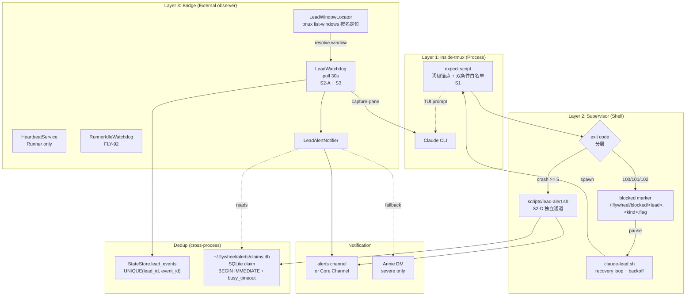
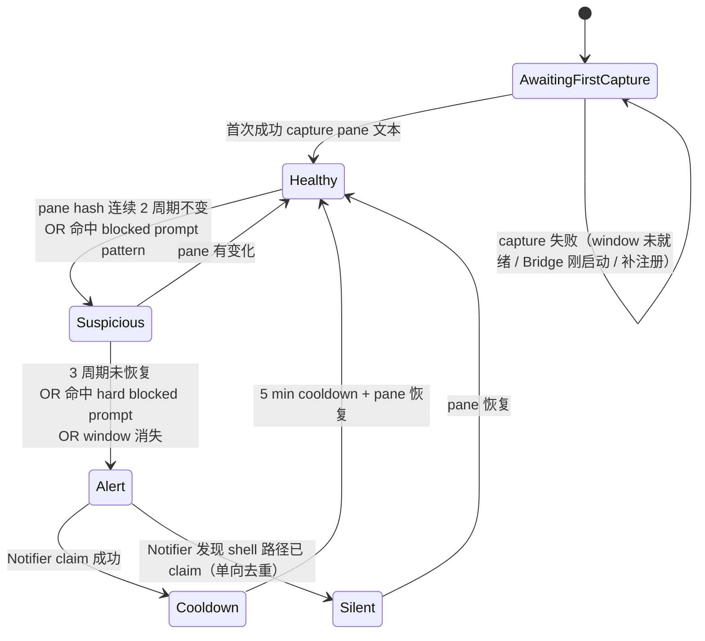
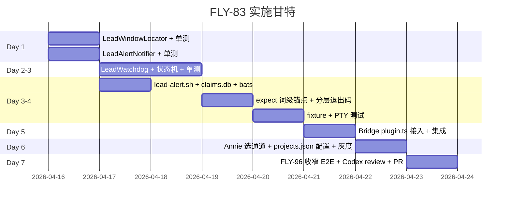

# Plan: Lead Daemon 静默卡住 — 检测、自动恢复、异常通知

**Version**: v1.23.0
**Issue**: FLY-83
**Date**: 2026-04-15
**Source**: FLY-83 Linear issue, `doc/architecture/product-experience-spec.md` §6.3, `doc/architecture/capability-matrix.md`
**Status**: draft (Round 2 — Codex Round 1 feedback 已吸收，见 §15 changelog)

---

## Executive Summary

Lead Daemon（Peter/Oliver/Simba 三个 Claude Code CLI session，由 launchd 管理）存在"静默卡死"风险：
- Claude CLI 在交互式 prompt（rate limit / auto-compact / login expired / permission）上等输入，launchd 看到进程 running，实际已无响应。
- Supervisor recovery loop 在 5+ 次连续 crash 时只写 log，不通知 Annie。
- Expect 自动确认只覆盖单一 `confirm` 字样（dev-channels 场景），其他 prompt 全部 fallthrough。
- 无任何"Lead 沉默"健康信号。

本 plan 采用**双层防护 + 外部观察 + 独立通知通道 + 分层退出码**：
1. **主检测（A）**：Bridge 内新 `LeadWatchdog`（tmux capture-pane），复用 FLY-92 `RunnerIdleWatchdog` 模式，通过 `LeadWindowLocator` 按稳定窗口名 `${projectName}-${leadId}` 定位 Lead pane。
2. **硬告警（D）**：shell supervisor 在 `CRASH_COUNT >= 5` 或 blocked prompt exit code 命中时调独立 notifier（不依赖 Bridge 健在）。
3. **分层退出码**：`100=rate_limited`（长退避 30min），`101=login_expired`（pause marker 直到人工清除），`102=permission_blocked`（pause）——**不复用 crash 语义**，避免每分钟热重启。
4. **告警通道**：Annie 三选一（`#flywheel-alerts` / Core Channel / alerts + DM），SSOT 单一放在 `projects.json`。
5. **跨进程去重**：Bridge 用 `StateStore.lead_events` `(lead_id, event_id)` UNIQUE；shell 用独立 SQLite `~/.flywheel/alerts/claims.db`；Bridge 发告警前先读 shell claim（单向）。
6. **Expect 硬化**：词级锚点 + 双条件白名单，只自动处理确定安全的 prompt，其余只检测并写退出码。

**明确不做**：
- ❌ 不用 `messages.read_at IS NULL` 作为 Lead liveness 主信号（Codex 指出 read_at 在 Bridge→MCP notification 发出即标记，与 Claude 实际是否处理无关；此问题独立于 FLY-109 存在）。B 信号降为 follow-up "inbox-mcp transport 诊断"。
- ❌ 不改 `inbox-mcp` / CommDB `read_at` 写路径（FLY-109 边界）。
- ❌ Permission prompt 绝不自动批准。
- ❌ 不新增 Lead 主动写 heartbeat 文件（改 Lead rules、污染 context）。

**规模**：5-7 天（Annie 已批 all-in-one）。

---

## 1. 背景：问题分类

FLY-83 issue 文本描述了三个现象；结合现状审计，实际分为 **4 个 sub-item**：

| # | Sub-item | 根因 | 本 plan 处理 |
|---|---------|------|-------------|
| **S1** | 交互 prompt 无法自动处理（非 dev-channels） | expect 只匹配 `confirm`，rate limit/compact/login/permission 未覆盖 | 双条件白名单 + 分层退出码（§5） |
| **S2** | Lead 异常不通知 Annie | recovery loop crash ≥ 5 只写 log；无 Lead-level watchdog | `LeadWatchdog` + shell `lead-alert.sh` 双路径（§6） |
| **S3** | Lead 进程健在但不吃消息（沉默） | 无"业务活跃度"观察 | pane hash + blocked prompt 检测（§3 A 信号） |
| **S4** | tmux window 被 kill 后 Claude 不自动重启 | supervisor `_wait_tmux_window()` 已覆盖 | ✅ 已解决，只做回归验证（§11） |

**与 FLY-109 边界（Codex 澄清后）**：

Round 1 原以为 B 信号只是"受 FLY-109 污染"，Codex 核对 `packages/inbox-mcp/src/index.ts:121-135` 后指出：`read_at` 在 Bridge→MCP notification 成功即 UPDATE，**语义上就不代表 Claude liveness**。这是一个独立于 FLY-109 的事实。本 plan 因此把 B 从主状态机完全移出（而非"保留为次主信号待 FLY-109 修后升级"）。

---

## 2. 架构：双层防护 + 分层退出码



**关键设计**：
- `LeadWatchdog` 跑在 Bridge 进程，通过 `LeadWindowLocator` 定位 Lead pane（不依赖 CommDB `sessions` 表）。
- `expect` 识别 blocked prompt 后退出非零，但用**分层退出码**而非通用 crash —— supervisor 根据退出码进入长退避或 pause，**不计入 CRASH_COUNT**。
- 告警两条路径（Bridge `LeadAlertNotifier` + shell `lead-alert.sh`）通过 `lead_events` + `claims.db` 跨进程去重。

---

## 3. Heartbeat 机制设计

### 3.1 信号组合

| 信号 | 角色 | 位置 | 阈值 |
|------|------|------|------|
| **A1. tmux pane 文本 hash** | 主检测 | Bridge `LeadWatchdog` | 连续 3 个 30s 周期不变 + 屏幕上有 blocked prompt pattern |
| **A2. tmux window 存活** | 主检测 | Bridge `LeadWatchdog` | window 不存在 → 立即查 supervisor 状态（可能 S4） |
| **D. supervisor 硬告警** | 硬告警 | shell `claude-lead.sh` | `CRASH_COUNT >= 5` OR exit code `100/101/102` |

**拒绝方案**：
- **B. inbox backlog (`read_at IS NULL`)**：`read_at` 语义 = "notification 发出"，非 Claude liveness。移出主状态机，详见 §3.4。
- **C. PID liveness**：卡在 prompt 时进程健在，无法区分 stuck vs working。
- **E. Lead 主动写 heartbeat 文件**：需改 Lead rules，Claude 不保证按时写，污染 context。

### 3.2 LeadWatchdog 状态机



**为什么 `AwaitingFirstCapture` 替代固定 `startupGraceMs=120_000`**：
- Round 1 原方案：Bridge 启动后 120s 内不告警。
- Codex 指出：`expect` 启动超时刚从 60s 提到 600s（`claude-lead.sh:559-562`），Bridge 对 lead runtime 的补注册是 30s 一轮（`plugin.ts:1352-1390`），拍脑袋定 120s 容易误杀慢启动。
- 改为"首次成功 capture pane 文本"解锁告警，对齐真实启动语义。

### 3.3 LeadWindowLocator：怎么找到 Lead 的 tmux pane

**事实核对**：
- Lead 的 tmux window 不在 CommDB `sessions` 表（该表只存 Runner session）。
- `packages/teamlead/src/bridge/session-capture.ts:65-133` 的 `captureSession()` 签名是 `(executionId, projectName, lines)`，不能直接喂 "Lead 的 window name"。
- `claude-lead.sh:604` 创建 window 时用稳定名 `${PROJECT_NAME}-${LEAD_ID}`，这是可复用的 anchor。

**方案**：新建 `packages/teamlead/src/LeadWindowLocator.ts`：

```typescript
import { execFile } from "node:child_process";
import { promisify } from "node:util";

const execFileAsync = promisify(execFile);

export async function locateLeadWindow(
  projectName: string,
  leadId: string,
): Promise<string | null> {
  const target = `${projectName}-${leadId}`;
  try {
    const { stdout } = await execFileAsync("tmux", [
      "list-windows",
      "-t",
      "flywheel",
      "-F",
      "#{window_id} #{window_name}",
    ]);
    for (const line of stdout.split("\n")) {
      const [id, name] = line.trim().split(/\s+/, 2);
      if (name === target) return id;
    }
  } catch {
    // tmux session 不存在 / tmux 未运行
  }
  return null;
}
```

LeadWatchdog 每次 poll 先调 `locateLeadWindow`，未命中 → `AwaitingFirstCapture`；命中后再调用 `tmux capture-pane -t <window_id> -p -S -200` 读文本。

**可选增强**：`claude-lead.sh:298-315` 的 manifest 写入时增加 `leadWindow` 字段（window ID），作为优化路径（减少 list-windows 调用）；但 window ID 在 tmux 重启后会变，**名字解析仍是权威**。

### 3.4 为什么 B 信号从主状态机移出

**Round 1 原假设**：`messages.read_at IS NULL` backlog 涨 → Lead 沉默。

**Codex 核实（`packages/inbox-mcp/src/index.ts:121-135`）**：
```sql
-- inbox-mcp 把 instruction 发给 Claude channel notification 成功后立即:
UPDATE messages SET read_at = datetime('now') WHERE id = ?
```

- `read_at` 语义 = "Bridge → MCP notification 已发出"，不是 "Claude 真正看过/处理过"。
- 即使没有 FLY-109，只要 Bridge 发出 notification，`read_at` 就非空。
- Lead 卡在 pane 上、Claude 完全没行动时，backlog 也可能是 0 unread → **B 信号会假阴性**。

**结论**：B 从 LeadWatchdog 主状态机完全移出。保留为 follow-up（§12）："transport backlog / inbox-mcp stuck" 独立诊断指标，**不进入本 plan 实现**。

---

## 4. Annie 通知通道：三选一

> **✅ Annie 已决定：Option B — 复用 Simba 的 cos-chat channel (`1487340532610109520`) + `SIMBA_BOT_TOKEN`。** 不新建 alerts channel，不启用独立 `FLYWHEEL_ALERT_BOT_TOKEN`。Phase 3 实施按 B 配置 `projects.json`：所有 Lead 的 `alertChannel` 都填 cos-chat ID，`alertBotTokenEnv` 为 `SIMBA_BOT_TOKEN`，不配 `alertDmUserId`。保留下表为设计记录。

> **代码层无论她选哪个，notifier 都做成可切换 target，不写死**。SSOT 在 `projects.json`（见 §7）。

| 选项 | 描述 | 优点 | 缺点 |
|------|------|------|------|
| **A. 新 `#flywheel-alerts` 频道（推荐）** | 系统告警独立频道，Annie 订阅 | 职责清晰；可 `@Annie` mention | 需新建 Discord channel；三个 Lead bot 都需被邀请进频道，或用专用 `FLYWHEEL_ALERT_BOT_TOKEN` |
| **B. Core Channel（Simba chatChannel `1487340532610109520`）** | 复用现有 | 改动最少，Annie 已看 | 业务告警混在一起；Simba 自己挂时 channel 可能无人 relay |
| **C. A + 严重告警 DM Annie** | alerts channel 默认 + crash loop / 多 Lead 同挂时 DM | 严重告警不被忽略 | **Discord DM 不是权限位** —— 需 Annie 开启"来自共享服务器成员的 DM" + bot 与 Annie 位于同一 server（见下） |

**Discord DM 前置条件（Codex 纠正）**：
- 不存在 `DM_USERS` permission bit；DM 依赖：
  1. bot 与 user 至少在一个共享 server；
  2. user 隐私设置允许共享 server 成员 DM；
  3. bot 调 `POST /users/@me/channels` 创建 DM channel 后再发消息。
- "首发失败就 fallback DM" 在 Discord API 5xx / rate limit 场景下没有本质帮助（同一套 API）。DM 只能降级为**异步 follow-up**（例如 alerts channel 发送成功后，严重等级额外补发 DM），不能作为首发失败的即时备选。

**Fallback 链**：首发 alerts channel → 失败 → 写本地队列 `$HOME/.flywheel/alert-queue/*.json` → Bridge 或 supervisor 下轮 drain。DM 只在严重等级（crash loop / 多 Lead 同挂）触发，位置在 alerts channel 成功后的补发。

**团队建议**：A 是最干净的。如果 Annie 想最简单，B 也行 —— 代码可切换。

---

## 5. Expect 脚本扩展清单 + 分层退出码

**总原则**：expect 只自动处理**确定安全**的 prompt；不确定 → 写分层退出码，supervisor 按退出码决定 backoff / pause / alert，**不复用通用 crash 语义**。

### 5.1 Prompt 白名单

| Prompt 类型 | 动作 | 匹配条件（词级锚点 + 双条件） | 退出码 |
|-------------|------|------------------------------|--------|
| **dev-channels confirm** | 自动按 `1\r` | 词 `development` 或 `bypass` 出现 **AND** 词 `confirm` 或 `cancel` 出现 | 0（正常继续） |
| **auto-compact confirm** | 自动按 `1\r` | 词 `compact` 出现 **AND** 词 `confirm` 或 `enter` 出现 | 0 |
| **rate limit** | **不自动**；写退出码 | 词 `rate` 或 `usage` 出现 **AND** 词 `limit` 或 `reset` 或 `try` 出现 | **100** (rate_limited) |
| **login expired** | **不自动**；写退出码 + marker | 词 `login` 或 `auth` 或 `reauth` 出现 **AND** 词 `expired` 或 `required` 出现 | **101** (login_expired) |
| **permission prompt** | **绝不自动**；写退出码 + marker | 词 `permission` 或 `allow` 或 `deny` 出现 **AND** 词 `file` 或 `network` 或 `tool` 或 `command` 出现 | **102** (permission_blocked) |

**为什么用词级锚点而非多词短语**：
- `claude-lead.sh:565-575` 现状注释已说明：Ink TUI 在每个词之间插 ANSI 颜色码，多词短语（如 `local development`）会被 ANSI 拆碎。
- 词级锚点（单词前后 `\b` 或 `[^A-Za-z]`）可规避 ANSI。
- 双条件（标题词 AND 尾部词）降低误触概率。
- 本地 Tcl `regexp` fixture 验证（见 §11）。

### 5.2 Supervisor 按退出码分支（改 `claude-lead.sh:881,993-1005`）

Round 1 方案把所有 blocked prompt 都做成"退出非零"，复用既有 backoff `5/15/30/60/60/60s`，Codex 指出这会让 rate-limit / login-expired prompt **每分钟重启一次**，5 次后再度报警 → 稳定噪音。

**改造**：

> **Exit code 约定**：100/101/102 是 `claude-lead.sh` supervisor + `expect` wrapper 合成的 sentinel 值（wrapper-owned），**不是对 Claude CLI 原生退出码空间的断言**。在实施前先 grep `claude-lead.sh` 确认未占用（见 §14 Open Question #5）。若 Claude CLI 未来也返回这些码，可向后移动到 110+ 区段。

**Marker 文件命名规范**（单一真实约定）：

- 目录：`${HOME}/.flywheel/blocked/`
- 文件名：`${LEAD_ID}.<kind>.flag`
- kind 枚举：`login_expired` | `permission_blocked`
- 示例：`~/.flywheel/blocked/cos-lead.login_expired.flag`

supervisor 启动前先 `mkdir -p "${HOME}/.flywheel/blocked" "${HOME}/.flywheel/alert-queue" "${HOME}/.flywheel/alerts"`（§7.3 统一责任边界）。

```bash
# 伪代码（实际在 claude-lead.sh 主循环中）
BLOCKED_DIR="${HOME}/.flywheel/blocked"
mkdir -p "$BLOCKED_DIR" "${HOME}/.flywheel/alert-queue" "${HOME}/.flywheel/alerts"

case "$CLAUDE_EXIT" in
  0)
    # 正常 / 自动 confirm 成功
    CRASH_COUNT=0
    ;;
  100)
    # rate_limited: 长退避 30min, 不计 CRASH_COUNT
    log "WARNING: rate limited, pausing 1800s before restart"
    "${SCRIPT_DIR}/lead-alert.sh" --kind rate_limit ...
    sleep 1800
    ;;
  101)
    # login_expired: 写 marker, pause 到人工清除
    MARKER="${BLOCKED_DIR}/${LEAD_ID}.login_expired.flag"
    touch "$MARKER"
    "${SCRIPT_DIR}/lead-alert.sh" --kind login_expired --severity high ...
    while [ -f "$MARKER" ]; do
      sleep 60
    done
    ;;
  102)
    # permission_blocked: 写 marker, pause
    MARKER="${BLOCKED_DIR}/${LEAD_ID}.permission_blocked.flag"
    touch "$MARKER"
    "${SCRIPT_DIR}/lead-alert.sh" --kind permission_blocked --severity high ...
    while [ -f "$MARKER" ]; do
      sleep 60
    done
    ;;
  *)
    # 其他退出码走既有 crash backoff
    CRASH_COUNT=$((CRASH_COUNT + 1))
    # ... existing backoff 5/15/30/60s ...
    if [ "$CRASH_COUNT" -ge 5 ]; then
      "${SCRIPT_DIR}/lead-alert.sh" --kind crash_loop --count "$CRASH_COUNT" ...
    fi
    ;;
esac
```

**Marker 文件职责**：
- blocked 状态可持久（Bridge 重启后仍能看到），LeadWatchdog 启动时检查 marker → 直接进入 Silent（已有人报过）。
- 人工解决后：`rm ~/.flywheel/blocked/<LEAD_ID>.<kind>.flag` → supervisor sleep 循环退出 → 重启 Claude。
- Runbook 文案与 supervisor 代码用同一条路径模板；文档内不再出现其他变体。

---

## 6. LeadWatchdog 实现

### 6.1 位置：Bridge（新模块）

复用 `RunnerIdleWatchdog` 结构（`packages/teamlead/src/RunnerIdleWatchdog.ts:43-255`），新建 `packages/teamlead/src/LeadWatchdog.ts`：

```typescript
interface LeadWatchdogConfig {
  pollIntervalMs: number;          // 30_000
  paneHashStuckCycles: number;     // 2
  paneHashAlertCycles: number;     // 3
  cooldownMs: number;              // 300_000 (5 min per incident)
  projects: ProjectConfig[];
  store: StateStore;               // 用 lead_events UNIQUE 做 Bridge 侧去重
  notifier: LeadAlertNotifier;
  locateWindowFn: typeof locateLeadWindow;
  captureFn: (windowId: string, lines: number) => Promise<string>;
  claimsReader: () => Promise<Set<string>>; // 读 ~/.flywheel/alerts/claims.db
  blockedMarkerReader: (leadId: string) => Promise<string[]>; // 读 ~/.flywheel/blocked/
}
```

### 6.2 每个 Lead 每 30s 流程

1. `blockedMarkerReader(leadId)` → 有 marker → 进入 Silent（supervisor 已告警）
2. `locateWindowFn(projectName, leadId)` → null → 保持/进入 `AwaitingFirstCapture`
3. `captureFn(windowId, 200)` → 失败 → 保持 `AwaitingFirstCapture`
4. 成功 → 计算 pane hash（去除时间戳 / 光标行 / trailing whitespace）
5. 与上周期对比：无变化 → stuckCount++；有变化 → reset
6. 检测 blocked prompt pattern（§5.1 的只检测项）
7. 状态机流转 → 命中 Alert：
   - 生成 `eventId = sha1(lead_id + kind + date_bucket_10min)`
   - 先读 `claimsReader()`，若 shell 已 claim → 进入 Silent
   - 否则调 `store.tryClaimLeadEvent(leadId, eventId, eventType, payload)` —— thin wrapper（§8.2）封装了 seq 语义，返回 `boolean`
   - `true` → `notifier.alert(payload)`；`false`（已被告过）→ 进入 Silent
   - **`eventType` 字段名与现有 schema 一致**（真实列名 `event_type`，见 `StateStore.ts:382`）；本 plan 不引入 `kind` 这个 pseudo-name
   - 底层 `lead_events` 表仍直接使用既有 `appendLeadEvent(...)`（§8.2 给出 wrapper 实现）

### 6.3 不发探针（避免自循环）

**不做**："Are you alive" inbox 消息 —— 会制造自己的 unread，逻辑自循环。
**只做**：被动观察（pane text / window 存活 / content hash / marker file）。

### 6.4 Shell 独立告警路径（`scripts/lead-alert.sh`）

`claude-lead.sh` 在 §5.2 的分支中直接调。独立脚本 ~120 行：

- 读 SSOT `~/.flywheel/projects.json` 当前 Lead 对应条目的 `alertChannel` / `alertDmUserId` / `alertBotTokenEnv`
- 生成 `eventId = sha1(lead_id + kind + date_bucket_10min)`
- `~/.flywheel/alerts/claims.db` 用 sqlite3 CLI 单连接 heredoc 去重（`BEGIN IMMEDIATE; INSERT OR IGNORE; SELECT changes(); COMMIT;`，见 §8.3）
  - 被 Bridge `LeadWatchdog.claimsReader` 单向读取
- 走 `curl` 调 Discord bot API：`POST /channels/<alertChannel>/messages`
- 失败 → 写 `$HOME/.flywheel/alert-queue/<timestamp>-<lead>-<kind>.json`
- 不调 Bridge，不依赖 Node.js 运行时

**为什么 shell 独立**：Bridge 挂时仍能发告警。`claude-lead.sh` 由 launchd 直接拉起，不走 Bridge。

---

## 7. 配置与文件改动清单

### 7.1 配置 SSOT：`projects.json`（唯一源）

Round 1 同时提到 `projects.json` 和新建 `~/.flywheel/alert-config.json`，Codex 指出**未定义 SSOT**。本 Round 收敛到 `projects.json`。

**真实 schema 对齐**（Round 2 Codex 指出之前示例是错的）：`loadProjects()` 只接受 **top-level JSON array**，字段是 `projectName` / `projectRoot` / `leads[].agentId`（见 `packages/teamlead/src/ProjectConfig.ts:23-45`）。本 plan 新增字段全部挂在 `LeadConfig` 上，不引入新顶层对象。

```json
[
  {
    "projectName": "geoforge3d",
    "projectRoot": "/Users/xiaorongli/Dev/geoforge3d",
    "projectRepo": "git@github.com:xrliAnnie/geoforge3d.git",
    "generalChannel": "1451234567890123456",
    "leads": [
      {
        "agentId": "cos-lead",
        "forumChannel": "1460000000000000001",
        "chatChannel": "1487340532610109520",
        "match": { "labels": ["cos"] },
        "botTokenEnv": "SIMBA_BOT_TOKEN",
        "statusTagMap": { "In Progress": ["1470000000000000001"] },

        "alertChannel": "1487340532610109520",
        "alertBotTokenEnv": "SIMBA_BOT_TOKEN",
        "alertFallbackToCore": true
      }
    ]
  }
]
```

`ProjectConfig.ts` 在现有 `LeadConfig` interface 上新增 4 个可选字段（向后兼容；未配置则 `LeadAlertNotifier` 降级为 no-op 并只落 `alert-queue/`）：

```typescript
export interface LeadConfig {
  agentId: string;
  forumChannel?: string;
  chatChannel: string;
  match: { labels: string[] };
  statusTagMap?: Record<string, string[]>;
  botTokenEnv?: string;
  botToken?: string;

  // === FLY-83 新增 ===
  alertChannel?: string;       // alerts channel ID
  alertDmUserId?: string;      // Annie 的 Discord user ID（Option C）
  alertBotTokenEnv?: string;   // 默认 undefined → 复用该 lead 自己的 botTokenEnv
  alertFallbackToCore?: boolean; // alerts channel 不可用时降级到 project generalChannel
}
```

**`FLYWHEEL_ALERT_BOT_TOKEN` 运行环境解析**：若采用独立 alert bot（推荐 Option A），这个 env var 必须同时在 **Bridge 进程** 和 **launchd Lead wrapper** 的运行环境里可解析。具体：

- Bridge：继承 shell 登录环境（现有 `packages/teamlead/src/bridge/plugin.ts` 启动路径）。
- launchd：在 `com.flywheel.lead.*.plist` 的 `EnvironmentVariables` 里显式列出，或通过 wrapper 从 `$HOME/.flywheel/.env` source（与现有 `manifests`/`.env` 路径一致，见 `scripts/flywheel-lead-wrapper.sh`）。
- 若 env 未设置 → `lead-alert.sh` 和 `LeadAlertNotifier` 都 fallback 到 lead 自己的 `botTokenEnv`，并在日志中 warn 一次。

### 7.2 Shell 路径修正

Round 1 用 `"${FLYWHEEL_DIR}/scripts/lead-alert.sh"`，但 `claude-lead.sh` 未定义 `FLYWHEEL_DIR`（`flywheel-lead-wrapper.sh:17` 有本地变量但未 export）。

**修正**：`claude-lead.sh` 开头加：
```bash
SCRIPT_DIR="$(cd "$(dirname "${BASH_SOURCE[0]}")" && pwd)"
FLYWHEEL_ROOT="$(cd "${SCRIPT_DIR}/../../.." && pwd)"
```

`lead-alert.sh` 放在 `${FLYWHEEL_ROOT}/scripts/lead-alert.sh`，调用方用 `"${FLYWHEEL_ROOT}/scripts/lead-alert.sh"`。

### 7.3 Queue 目录（user-writable）

Round 1 写 `/var/log/flywheel-alert-queue/`，launchd 下无写权限。改用 `$HOME/.flywheel/alert-queue/`。

### 7.4 文件改动清单

**新建**：

| 文件 | 说明 | 规模 |
|------|------|------|
| `packages/teamlead/src/LeadWatchdog.ts` | Bridge-side 外部观察 | ~320 行 |
| `packages/teamlead/src/LeadAlertNotifier.ts` | 通道切换 + claims.db 读 + fallback | ~180 行 |
| `packages/teamlead/src/LeadWindowLocator.ts` | tmux window 按名定位 | ~60 行 |
| `packages/teamlead/src/__tests__/LeadWatchdog.test.ts` | 单测 | ~280 行 |
| `packages/teamlead/src/__tests__/LeadAlertNotifier.test.ts` | 单测 + Discord mock | ~200 行 |
| `packages/teamlead/src/__tests__/LeadWindowLocator.test.ts` | 单测（tmux mock） | ~80 行 |
| `packages/teamlead/src/__tests__/fixtures/expect-prompts/*.txt` | Tcl regexp fixture | 5 files |
| `scripts/lead-alert.sh` | shell 独立告警路径 | ~120 行 |
| `scripts/__tests__/lead-alert-claim.bats` | claims.db 去重 bats 测试 | ~60 行 |

**改造**：

| 文件 | 改动 |
|------|------|
| `packages/teamlead/scripts/claude-lead.sh` | expect 词级锚点双条件（§5.1） + 分层退出码 case（§5.2） + `SCRIPT_DIR`/`FLYWHEEL_ROOT` |
| `packages/teamlead/src/bridge/plugin.ts` | 在 `RunnerIdleWatchdog` 之后实例化 `LeadWatchdog` + `LeadAlertNotifier` |
| `packages/teamlead/src/ProjectConfig.ts` | 加 `alertChannel` / `alertDmUserId` / `alertBotTokenEnv` / `alertFallbackToCore` 可选字段 |
| `packages/teamlead/src/StateStore.ts` | 复用现有 `lead_events` 表（`(lead_id, event_id)` UNIQUE 索引在 `:382-402`），不加新 schema；新增 ~10 行 thin wrapper `tryClaimLeadEvent(...): boolean`（封装 `appendLeadEvent` + 预检存在性，见 §8.2），避免调用方自己拆 seq 语义 |

### 7.5 不改

- `scripts/flywheel-lead-wrapper.sh`：只是 launchd thin wrapper。
- `HeartbeatService.ts`：Runner 专用，职责清晰。
- `RunnerIdleWatchdog.ts`：FLY-92 已稳定。
- `packages/inbox-mcp/src/index.ts`：FLY-109 边界。
- CommDB schema：不新增字段。

---

## 8. 跨进程去重：lead_events + claims.db

Round 1 用 notifier 内存 `Map<incidentKey, timestamp>`，Codex 指出只能去重"同进程 + 同次运行"。改造：

### 8.1 eventId 生成

```typescript
function leadEventId(leadId: string, kind: string, when: Date = new Date()): string {
  const bucket = Math.floor(when.getTime() / (10 * 60 * 1000)); // 10min bucket
  return sha1(`${leadId}:${kind}:${bucket}`);
}
```

### 8.2 Bridge 侧：`StateStore.lead_events`

利用现有 `(lead_id, event_id)` UNIQUE 索引（`packages/teamlead/src/StateStore.ts:382-402`）。**使用真实 API**：`appendLeadEvent(leadId, eventId, eventType, payload, sessionKey?): number`（见 `StateStore.ts:1343-1369`）——不存在 `recordLeadEvent`，列名也是 `event_type` 不是 `kind`。

**返回值语义**（核实过 `StateStore.ts:1343-1369`）：方法返回 `number`（seq id），UNIQUE 冲突时返回 **已存在的 seq**，成功插入时返回 `last_insert_rowid()`。两者都非零，**无法直接区分"我是首个 claimant"**。

对比 `events` 表的 `insertEvent(...)` 返回 `boolean`（见 `runner-ready-to-close-notifier.ts:58-67` 的既有模式），`lead_events` 的 API 少了这一语义。

**本 plan 最小侵入修复**：在 `StateStore` 上增加一个 thin wrapper `tryClaimLeadEvent(leadId, eventId, eventType, payload, sessionKey?): boolean`。做法是**先 `SELECT COUNT(*)` 预检存在性**，若已存在直接 `false`；否则调用现有 `appendLeadEvent`，返回 `true`。Bridge 是 sql.js 单线程进程内无并发写，所以预检+插入不是原子操作也安全（跨进程竞争由 shell 侧 `claims.db` `BEGIN IMMEDIATE` 独立负责）。  
> 注：刻意不走 `last_insert_rowid()` 比对 —— 在 `appendLeadEvent` 的 UNIQUE 冲突分支里 `last_insert_rowid()` 会保持为上一次成功插入的 rowid，重复插入若撞到旧 rowid 会误判成功，这条路不可靠。

```typescript
// StateStore.ts（新增 ~10 行，紧邻 appendLeadEvent）
tryClaimLeadEvent(
  leadId: string,
  eventId: string,
  eventType: string,
  payload: string,
  sessionKey?: string,
): boolean {
  const before = this.db.exec("SELECT COUNT(*) FROM lead_events WHERE lead_id = ? AND event_id = ?",
                              [leadId, eventId])[0]?.values[0]?.[0] as number ?? 0;
  if (before > 0) return false; // 已存在
  this.appendLeadEvent(leadId, eventId, eventType, payload, sessionKey);
  return true;
}
```

> 未来 Bridge 若拆多进程，可升级为 `INSERT OR IGNORE` + `changes()` 一次调用的 prepared statement。

```typescript
// LeadAlertNotifier.alert(...) 内
const claimed = this.store.tryClaimLeadEvent(
  leadId,
  eventId,                // sha1(lead_id + event_type + 10min-bucket)
  eventType,              // "rate_limit" | "login_expired" | "permission_blocked" | "crash_loop" | "pane_hash_stuck"
  JSON.stringify(payload),
);
if (!claimed) {
  // 已被告过（Bridge 之前 run 或本 run 内重复）
  return { skipped: "duplicate" };
}
await this.sendToDiscord(payload);
```

跨 Bridge 重启持久（SQLite 落盘）。

### 8.3 Shell 侧：`~/.flywheel/alerts/claims.db`

独立 SQLite（避免依赖 Bridge 的 StateStore）：

```sql
CREATE TABLE IF NOT EXISTS alert_claims (
  event_id TEXT PRIMARY KEY,
  lead_id TEXT NOT NULL,
  event_type TEXT NOT NULL,  -- 与 Bridge 侧列名一致
  claimed_at INTEGER NOT NULL
);
```

**macOS baseline 没有 `flock`**（见 `scripts/flywheel-cmux-autostart.sh:4` "macOS has no flock"）。Round 2 Codex 还指出 `sqlite3 "$DB" "INSERT OR IGNORE"` 之后另起一次 `sqlite3 "$DB" "SELECT changes()"` 会因连接隔离恒返回 `0`。两个问题**合并修成一个方案**：单连接、单事务、单次 stdout 判定。

```bash
CLAIMS_DB="${HOME}/.flywheel/alerts/claims.db"
mkdir -p "$(dirname "$CLAIMS_DB")"

# 单 sqlite3 连接完成 INSERT + SELECT changes()；BEGIN IMMEDIATE 提供串行化。
CLAIM_RESULT=$(sqlite3 "$CLAIMS_DB" <<SQL
CREATE TABLE IF NOT EXISTS alert_claims (
  event_id TEXT PRIMARY KEY,
  lead_id TEXT NOT NULL,
  event_type TEXT NOT NULL,
  claimed_at INTEGER NOT NULL
);
BEGIN IMMEDIATE;
INSERT OR IGNORE INTO alert_claims VALUES ('${EVENT_ID}', '${LEAD_ID}', '${EVENT_TYPE}', strftime('%s','now'));
SELECT changes();
COMMIT;
SQL
)

# sqlite3 stdout 最后一行是 SELECT changes() 的结果
LAST_LINE=$(printf '%s\n' "$CLAIM_RESULT" | tail -n 1)
if [ "$LAST_LINE" != "1" ]; then
  log "alert already claimed by another path, skip event_id=$EVENT_ID"
  exit 0
fi
```

**为什么不要外层锁**：`BEGIN IMMEDIATE` 让 SQLite 自己串行化 writer；多个并发 `lead-alert.sh` 同一 eventId 调用里，只有一个连接拿到 write lock 执行 `INSERT OR IGNORE` 并得到 `changes()=1`，其他要么 busy 重试要么 `changes()=0` → 退出。不再需要 `flock`，也不需要 `mkdir` 外锁。

**SQLite busy 重试**：`sqlite3` CLI 默认 busy timeout 0；并发下会 `SQLITE_BUSY`。在 SQL 最开头加 `.timeout 5000` pragma 即可（或 `PRAGMA busy_timeout = 5000;`）。`bats` 并发测试用这个设置验证（§11.2）。

### 8.4 单向去重方向

**Bridge → shell 不阻塞**：Bridge 侧 `LeadAlertNotifier.alert()` 先读 `claims.db`（shell 已 claim → 跳过），再尝试 `lead_events` INSERT。
**shell → Bridge 不读**：shell 不需要读 Bridge 的 `lead_events`（Bridge 有 Bridge 的范围，shell 有 shell 的范围，共享的只是 `claims.db`）。

**为什么方向单向**：Bridge 观察 pane 时间比 shell 退出事件晚（blocked prompt 先被 expect 拦截，expect 写 marker 后 supervisor 调 `lead-alert.sh`；Bridge 下一轮 poll 才看到 pane 状态）。shell 先到先 claim 是正确时序。

---

## 9. FLY-109 边界（最终版）

| 维度 | FLY-83 | FLY-109 |
|------|--------|---------|
| 关注点 | Lead 进程 stuck / crash / 静默 → 告警 | `--resume` 后消息 `read_at` 与 Claude 处理语义不一致 |
| 观察手段 | tmux pane + exit code + supervisor 状态 | Claude context 是否真正看到消息 |
| 本 plan 依赖 FLY-109 吗 | **不依赖**（B 信号移出主状态机） | —— |
| 串行/并行 | **并行**，无冲突 | FLY-109 研究独立推进 |
| 代码重叠 | 零（不改 inbox-mcp / `read_at` 写路径） | —— |

---

## 10. 风险与缓解

| 风险 | 来源 | 缓解 |
|------|------|------|
| **tmux list-windows 解析脆** | window name 含空格 / special char | 本 plan 窗口名 `${project}-${lead}` 受控；lexer 用严格 split |
| **tmux session 不存在 / 在重建** | S4 场景 | `LeadWindowLocator` 返回 null → `AwaitingFirstCapture`，不告警 |
| **Ink TUI ANSI 破坏多词匹配** | Claude CLI 渲染特性 | 词级锚点 + 双条件；fixture 用真实录制 pane 验证 |
| **blocked marker 遗留** | 人工未清 / marker 语义误用 | marker 文件名带 kind 后缀；supervisor log 每分钟 remind |
| **claims.db 锁竞争** | shell 并发 | 单 `sqlite3` 连接 `BEGIN IMMEDIATE` + `PRAGMA busy_timeout=5000`，让 SQLite 自己串行化 writer（macOS 无 `flock`） |
| **lead_events 膨胀** | 10min bucket × N kinds × 90 days | 定期 VACUUM；已有表，复用现有清理策略 |
| **Discord API 5xx / rate limit** | 不可控 | 本地 `alert-queue/` 落盘；Bridge/supervisor drain |
| **Bridge 重启瞬时 pane 抓不到** | window exists 但未就绪 | `AwaitingFirstCapture` 替代固定 grace |
| **多 Lead 同时故障告警洪水** | 3 个 Lead 全挂 | 60s 窗口 aggregator + 严重级升级 DM |
| **expect 词级锚点过宽** | 误按 `1\r` | fixture 负样本（含 rate-limit/permission 文本）确保不自动 confirm |
| **Annie DM 条件不满足** | bot 与 Annie 无共享 server / 隐私阻断 | 配置校验：projects.json schema 检查；发不出时 fallback alerts channel |
| **三 bot 未全部加入 alerts channel** | Option A 场景 | 文档化：Annie 在 Discord 邀请 3 个 bot；或用 `FLYWHEEL_ALERT_BOT_TOKEN` 单独 bot |
| **误告警疲劳** | 阈值激进 | 3 周期 + cooldown 5min + marker pause 语义 |
| **exit code 冲突既有 case** | `claude-lead.sh` 某些场景已用非零码 | 核对现有 exit codes；100/101/102 确认未占用 |

---

## 11. 测试计划

### 11.1 单元测试（Bridge 侧，80%+ 覆盖）

- **`LeadWatchdog.test.ts`**：状态机流转（AwaitingFirstCapture / Healthy / Suspicious / Alert / Silent / Cooldown），claimsReader 单向读，blockedMarkerReader 早退，多 Lead 隔离。
- **`LeadAlertNotifier.test.ts`**：三通道选项路由，alerts channel 成功 + 严重 DM 补发，alerts 5xx → 本地队列，queue drain。
- **`LeadWindowLocator.test.ts`**：tmux 输出 mock（正常 / 无 session / 多 window / 名字含 `-` 特殊情况）。

### 11.2 Fixture / PTY 集成测试（expect + supervisor）

Round 1 把"mock Claude CLI 输出 rate limit"塞给 FLY-96，Codex 指出 FLY-96 没有 mock 能力。改为：

- `scripts/__tests__/expect-fixtures/`：5 个 `.txt` 文件，每个是真实录制的 Claude TUI 输出（含 ANSI）。
- 本地 Tcl `regexp` fixture runner（Bash + `expect` 子进程）：验证每种 prompt 匹配到正确退出码。
- 负样本：普通 "confirm your setup" 对话文本不应误触。
- `lead-alert-claim.bats`（bats-core）：并发调 `lead-alert.sh` 10 次相同 eventId，断言只 1 条被 claim。

### 11.3 E2E（FLY-96 test infra — 收窄）

Codex 指出 `test-deploy.sh:242-266` 只启真实 Claude，无 mock binary / alert channel wiring。FLY-96 slot-based E2E 仅保留**真实 Discord 送达**和 **tmux kill 回归**：

| 场景 | 触发方式 | 预期 |
|------|---------|------|
| **真实告警送达** | slot 2：手动 `touch ~/.flywheel/blocked/<lead>.permission_blocked.flag` 模拟 marker 存在 + 调 `lead-alert.sh --kind permission_blocked` | alerts channel 收到消息（Chrome Discord 观察） |
| **S4 回归** | slot 3：`tmux kill-window -t flywheel:<lead>` | supervisor 5-60s 内重建 window + 重启 Claude |
| **Bridge 侧告警送达** | slot 4：模拟 pane hash 不变 + blocked pattern | LeadWatchdog → alerts channel |
| **跨进程去重** | 同时触发 shell claim + Bridge claim | alerts channel 只收 1 条 |

Prompt pattern / 退出码 / claims.db 并发 → **全部做成本地 fixture / bats 测试**，不进 FLY-96。

### 11.4 发布前 checklist

- [ ] Annie 选定通道（A/B/C），`projects.json` 配置就绪
- [ ] 人为 kill Bridge，触发 shell `lead-alert.sh`，alerts channel 收到
- [ ] 三个 Lead 全部 restart 后无误告警（`AwaitingFirstCapture` 验证）
- [ ] 关闭 `~/.flywheel/blocked/*` marker 后 Lead 自动恢复
- [ ] QA Chrome Discord 全程观察（不只看 API）

---

## 12. Follow-up（本 plan 不做）

- **B 信号作为 inbox-mcp transport 诊断**：独立 FLY-XXX，不作为 Lead liveness。
- **Lead 主动 heartbeat 文件（信号 E）**：需改 Lead rules。
- **Permission prompt 自动批准**：安全风险高，需单独设计 + Annie 批。
- **大而全的 Claude CLI prompt catalog**：本轮只覆盖已知 5 类。
- **alerts channel 的 Slack/邮件镜像**：Annie 可能想多通道同步。
- **Bridge 自身挂了的监测**：launchd KeepAlive + 独立 watchdog（独立 issue）。
- **Quiet hours（Annie 睡眠时延迟告警）**：本 plan 默认不做。
- **FLY-109 修复后重新评估 B 信号**：等 FLY-109 落地。

---

## 13. 实施顺序（5-7 天）



**门禁**：
- 每层完成后才往下（notifier → watchdog → expect → integration）。
- 每个 commit `pnpm lint && pnpm test` 绿才推。
- PR 前必须有 FLY-96 收窄 E2E 全绿 + Codex code review APPROVED。

---

## 14. Open Questions（需 Annie 回答）

1. **通知通道选哪个？** A / B / C
2. **Option A 的 bot 策略**：三个 Lead bot 全部邀请进 alerts channel，还是用独立 `FLYWHEEL_ALERT_BOT_TOKEN`？
3. **Option C 的 DM 条件确认**：Annie 是否与三个 bot 至少位于一个共享 server？隐私设置是否允许服务器成员 DM？
4. **marker 人工清除流程**：是否需要 Discord slash command（`/lead-resume <lead>`）还是 Annie 直接 `rm`？（本 plan 默认后者）
5. **exit code 100/101/102 确认未占用**：实施前先 grep `claude-lead.sh` 现有 exit 分布。

---

## 15. Round 3 → Round 4 Changelog（Codex 反馈对齐）

Round 3 所有 4 个问题全部 accept，均为 Round 2 修复的内部一致性残留；无架构异议：

| # | Codex Round 3 issue | 本轮处理 |
|---|---------------------|----------|
| 1 | §6.2 仍写 `store.appendLeadEvent(...)` 且误标 `true/false` 返回，与 §8.2 的 `tryClaimLeadEvent` 包装矛盾 | §6.2 统一改调 `store.tryClaimLeadEvent(...)` → `boolean`；明确 `appendLeadEvent` 只在 wrapper 内部使用 |
| 2 | §8.2 同时说 "`last_insert_rowid() == returned_seq` 判断" 和代码 `SELECT COUNT(*)` 预检，前后矛盾；且 rowid 比对在 UNIQUE 冲突时会误判 | §8.2 去掉 rowid 比对描述，留一种实现（`SELECT COUNT(*)` 预检 + `appendLeadEvent`），并加 "为何不用 rowid" 注解 |
| 3 | §6.4 / §10 风险表仍残留 `flock`（macOS 不可用） | §6.4 改为 "单连接 heredoc"；§10 风险行改为 "单连接 `BEGIN IMMEDIATE` + busy_timeout"；历史 changelog 保留 `flock` 以说明演进 |
| 4 | §11.3 E2E marker 路径缺 `.flag` 后缀；§2 mermaid 图标为 `<lead>.flag` 不带 kind | §11.3 补 `.permission_blocked.flag`；mermaid 改为 `<lead>.<kind>.flag` |
| 5 (Round 4 补) | §2 mermaid 图中 `claims.db` 节点仍标 "SQLite + file lock"，和正文 "单连接 `BEGIN IMMEDIATE`" 冲突 | 图节点改为 `SQLite claim / BEGIN IMMEDIATE + busy_timeout` |

---

## 16. Round 2 → Round 3 Changelog（Codex 反馈对齐）

| # | Codex Round 2 issue | 本轮处理 |
|---|---------------------|----------|
| 1 | §7.1 `projects.json` 示例 schema 是错的（top-level `{ "projects": [...] }` + `name` + `leadId`），真实 loader 是 **top-level array** + `projectName`/`projectRoot`/`leads[].agentId` | §7.1 完全重写示例为真实 schema；新增字段挂在现有 `LeadConfig` interface 上（不引入新顶层对象） |
| 2 | §8.3 依赖 `flock`，但 macOS baseline 没有此工具（`scripts/flywheel-cmux-autostart.sh:4` 已明确） | §8.3 放弃外层锁，改用 **单 `sqlite3` 连接 + `BEGIN IMMEDIATE` + `SELECT changes()`**，让 SQLite 自己串行化 |
| 3 | `sqlite3 "$DB" "INSERT OR IGNORE"` 后另起一次 `sqlite3 "$DB" "SELECT changes()"` 因连接隔离恒返回 `0`，首次 claim 会被误判重复 | §8.3 改成单连接 heredoc：`BEGIN IMMEDIATE; INSERT OR IGNORE ...; SELECT changes(); COMMIT;`，读 stdout 最后一行 |
| 4 | §6.2 `store.recordLeadEvent(...)` / §8.2 `kind` 列与真实 `StateStore` 不符（真实 API 是 `appendLeadEvent(leadId, eventId, eventType, payload, sessionKey?)`，列名 `event_type`） | §6.2 & §8.2 全部改为 `appendLeadEvent(...)` + `eventType`/`event_type`；shell claims.db 列名同步改 |
| 5 | §5.2 marker 文件 runbook 文案前后不一致（代码 `${LEAD_ID}.login_expired` vs runbook `<lead>.*.flag`） | §5.2 统一为 `${HOME}/.flywheel/blocked/${LEAD_ID}.<kind>.flag`；supervisor 开头 `mkdir -p` 三个目录（blocked/alert-queue/alerts） |
| 6 | Exit code 100/101/102 是 wrapper-owned sentinels 需明说；`FLYWHEEL_ALERT_BOT_TOKEN` env 必须在 Bridge 和 launchd wrapper 两侧都能解析 | §5.2 顶部加 "wrapper-owned sentinel" 说明 + 保留 §14 OQ #5 grep 确认；§7.1 末尾加 `FLYWHEEL_ALERT_BOT_TOKEN` 运行环境解析路径（Bridge shell / launchd plist / wrapper source $HOME/.flywheel/.env） |

---

## 17. Round 1 → Round 2 Changelog（Codex 反馈对齐）

| # | Codex Round 1 issue | 本轮处理 |
|---|---------------------|----------|
| 1 | `CaptureSessionFn` 签名 `(executionId, projectName, lines)` 不能抓 Lead pane；`startupGraceMs=120_000` 拍脑袋 | 新建 `LeadWindowLocator`（tmux list-windows 按 `${project}-${lead}` 定位）；状态机加 `AwaitingFirstCapture` 替代固定 grace；manifest `leadWindow` 作为可选优化（§3.3） |
| 2 | `read_at` 语义是 "notification 已发出"，不是 Claude liveness（独立于 FLY-109） | B 信号从主状态机完全移出；降级 follow-up "inbox-mcp transport 诊断"；不再提 "FLY-109 修后升级 B"（§3.4） |
| 3 | "blocked prompt → exit non-zero + alert" 会让 supervisor 每分钟热重启 + 告警风暴 | 分层退出码 100/101/102 + marker file + supervisor 专用分支（pause / 长退避），不计 CRASH_COUNT（§5.2） |
| 4 | `FLYWHEEL_DIR` 未定义；`DM_USERS` 不是 Discord 权限位；`projects.json` vs `alert-config.json` 无 SSOT；`/var/log/` 不可写；三 bot 未必在 alerts channel | SSOT 收敛到 `projects.json`；`SCRIPT_DIR`/`FLYWHEEL_ROOT` 相对定位；queue 放 `$HOME/.flywheel/alert-queue/`；DM 前置条件文档化；alerts channel 要求三 bot 进频道或用独立 bot token（§7） |
| 5 | notifier 内存 Map 不能跨 Bridge ↔ shell 去重 | Bridge 用 `StateStore.lead_events` `(lead_id, event_id)` UNIQUE；shell 用独立 `~/.flywheel/alerts/claims.db` + flock；Bridge 单向读 claims.db（§8） |
| 6 | FLY-96 不具备 mock Claude / alert wiring 能力 | Prompt pattern / exit code / claims 并发全部做成本地 fixture + bats；FLY-96 E2E 收窄到"真实 Discord 送达" + "tmux kill 回归" + "跨进程去重"（§11.2-3） |

---

## 18. 参考

- FLY-92 `RunnerIdleWatchdog`：`packages/teamlead/src/RunnerIdleWatchdog.ts:43-255` — 外部观察模式参考
- FLY-74 Lead Daemon：`~/Library/LaunchAgents/com.flywheel.lead.*.plist`
- FLY-80 expect 初版：`packages/teamlead/scripts/claude-lead.sh:548-589`
- FLY-96 测试基础设施：`packages/qa-framework/` + `scripts/test-deploy.sh`
- FLY-109 研究（worker-fly-109 并行）
- `packages/teamlead/src/StateStore.ts:382-402,1343-1450` — `lead_events` UNIQUE 索引
- `packages/teamlead/src/bridge/runner-ready-to-close-notifier.ts:10-13,55-67` — stable eventId atomic claim 参考
- `packages/inbox-mcp/src/index.ts:62,67,121-135` — read_at 语义核实
- `packages/teamlead/src/bridge/session-capture.ts:65-133` — CaptureSessionFn 签名
- `packages/teamlead/scripts/claude-lead.sh:565-575,604,634,298-315,881,993-1005` — supervisor 锚点
- `scripts/test-deploy.sh:276-304` — window name 解析 ref
- `scripts/flywheel-lead-wrapper.sh:17,110-116` — `FLYWHEEL_DIR` 作用域
- `doc/architecture/product-experience-spec.md` §6.3 — Lead 24/7 + 自动恢复
- `doc/architecture/capability-matrix.md` — FLY-83 条目
