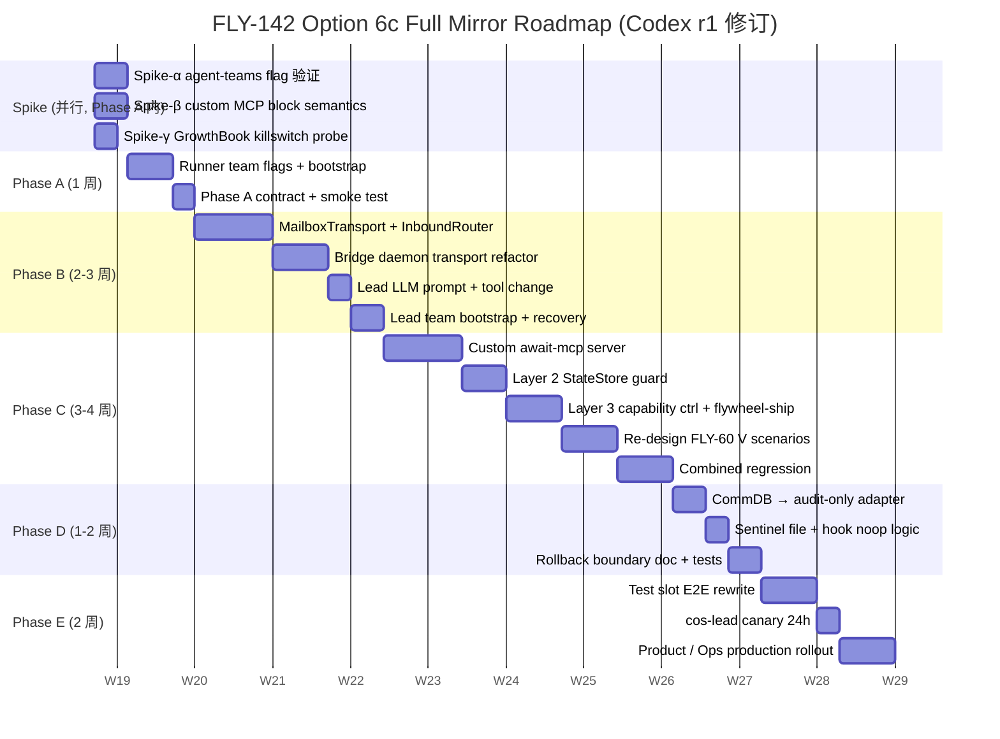
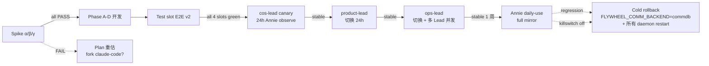
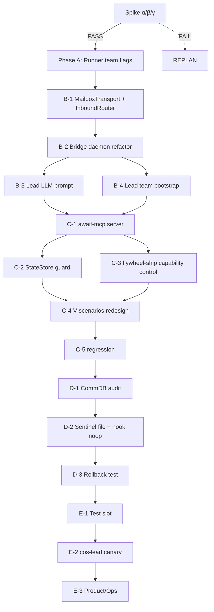

# Plan: Lead↔Runner 通信全切 Agent Team 1:1 镜像（Option 6c full mirror）

**Version**: v1.27.0
**Issue**: FLY-142 (Runner doesn't wake on Lead respond)
**Date**: 2026-05-06
**Source**:
- `doc/engineer/exploration/new/FLY-142-runner-wake-bug-audit.md`
- `doc/engineer/exploration/new/FLY-142-option4-detail.md`
**Status**: codex-approved (5 轮 review: R1+R2+R3+R4 NEEDS_CHANGES → R5 APPROVED)

---

## 0. Annie 决策记录

> "我希望我们的 solution 要和 claude-code agent team 是一样的。"

- 选 Option 6c full mirror
- ✅ 接受 6-9 周 → **修订为 10-14 周**（Codex round 1 严审后）
- ❌ <u>不</u> 走 Option 1 hook quick fix
- 后果：Runner 现 ask/respond 路径仍 broken **until 6c ship**（10-14 周窗口）。窗口期间 incident 用 `tmux send-keys` 救急

## 1. 目标

把 Lead↔Runner 通信从 "CommDB SQLite + PostToolUse hook + flywheel-comm CLI subprocess" 整套切到 "claude-code Agent Team mailbox file + SendMessageTool builtin + useInboxPoller (1s receiver-side polling)"。

**1:1 镜像目标**：
- Lead 在自己 process 内用 SendMessage tool 写 mailbox（不 spawn subprocess）
- Runner 是 Agent Team teammate（带 `--agent-teams` + identity flags），在 binary 内 useInboxPoller 自动 wake
- Lead↔Runner DM、permission relay、shutdown 都走 mailbox
- Hard gate (brainstorm / approve_to_ship) 用 **custom MCP tool** + **外部 enforcement**（不依赖 LLM 自觉）

**非目标**：
- Cross-host (mailbox file 同 CommDB 都是单机存储)
- Memory / pgvector 改造
- Discord plugin 通信改造
- Lead↔Lead 通信（已走 SendMessage tool）

## 2. 核心 Contract（必须 nail down 才能进 Phase A）

> Codex round 1 finding #12: 缺 contract section 导致 plan 像 intent。这里 nail。

### 2.1 Agent Team feature 启用要求（**Codex round 1 finding #1, #4 — critical**）

`isAgentSwarmsEnabled()` (`/Users/xiaorongli/Dev/claude-code/src/utils/agentSwarmsEnabled.ts:24-43`) 需要：
1. **Either** `CLAUDE_CODE_EXPERIMENTAL_AGENT_TEAMS=1` env **or** `--agent-teams` CLI flag
2. **Plus** GrowthBook killswitch `tengu_amber_flint` 为 true（Anthropic 可远程关）
3. Ant builds bypass; Flywheel 是 external build

→ Lead 和 Runner 启动时 **都** 必须设 env 或 flag，否则 `SendMessageTool.isEnabled()` 返回 false (`SendMessageTool.ts:535-537`)，identity flags 被接受但 useInboxPoller 不激活。

→ **Production risk**: Anthropic 通过 GrowthBook 关 killswitch，Flywheel mailbox 通信瞬间停摆。**Mitigation**: §2.8 behavioral probe（best-effort observability，**不**自动 rollback）— probe fail → Discord alert Annie，Annie 手动决策 cold rollback (见 §5)。

### 2.2 CLI 启动 contract（**Codex r1 finding #2 + Spike α 修订**）

> **⚠ Spike α (2026-05-06) 实测发现**: 在 `claude` v2.1.132 中 `--agent-teams` CLI flag **被 reject 为 unknown option** —— 该 flag 在外部 build 被 strip 掉了。<br/>
> 但 `CLAUDE_CODE_EXPERIMENTAL_AGENT_TEAMS=1` env var 单独足够激活 Agent Team。Spike β 已实测验证 useInboxPoller 真的会 wake Runner（6s 内）。<br/>
> 详见 `doc/engineer/implementation/v1.27.0-FLY-142-spike-results.md`。

Runner spawn 完整 CLI（`packages/claude-runner/src/TmuxAdapter.ts:289-307`）：

```bash
# ⚠ NO --agent-teams flag (被外部 build strip)
CLAUDE_CODE_EXPERIMENTAL_AGENT_TEAMS=1 claude \
  --agent-id "${runnerName}@${teamName}" \
  --agent-name "${runnerName}" \
  --team-name "${teamName}" \
  --parent-session-id "${leadSessionId}" \
  --agent-color "${color}" \
  --session-id "${sessionId}" \
  --permission-mode "${permissionMode}" \
  --append-system-prompt "${systemPrompt}" \
  --model "${model}" \
  --allowed-tools SendMessage Bash Read Edit ... \
  --mcp-config "${awaitMcpConfig}" \      # ★ Phase C - custom await tool
  -- "${prompt}"
```

Env vars 必须存在: `CLAUDE_CODE_EXPERIMENTAL_AGENT_TEAMS=1` (★ 唯一 agent-teams 启用方式), `FLYWHEEL_EXEC_ID`, `FLYWHEEL_COMM_DB`（保留作 audit fallback, Phase D）。

Lead daemon spawn 同样 identity flags + env var（无 `--agent-teams` flag），Lead 的 `--team-name` 跟所有它管的 Runner **共享**（见 §2.3）。

Preflight verification 不能用 `claude --help`（hidden flags `.hideHelp()`）。改用 `scripts/spike-mailbox-wake.sh` —— 真 spawn Runner + 写 sentinel + 验 echo（已 spike β PASS）。

### 2.3 Team 拓扑决策：**per-Lead team**（**Codex round 1 finding #4 — critical break**）

> Critical: `SendMessageTool.handleMessage()` 用 `getTeamName(appState.teamContext)` (`SendMessageTool.ts:149-171`) — 一个 Lead 进程只能 address 一个 team。
>
> 之前 plan 假设 "per-execution team (单 Runner 单 team)" → **Lead 用 SendMessage 给多 Runner 直接 break**。

**新拓扑**: per-Lead team。每个 Lead 一个 team，所有它管的 Runner 加入这个 team 当 member。

```
~/.claude/teams/
  cos-lead/
    config.json           # team_name="cos-lead", leadAgentId="cos-lead@cos-lead", members=[{name:"runner-FLY-142", agentId:"runner-FLY-142@cos-lead", ...}, ...]
    inboxes/
      cos-lead.json       # Lead 自己 inbox（Runner reply 进这）
      runner-FLY-142.json # Runner inbox
      runner-FLY-150.json
  product-lead/
    config.json
    inboxes/
      product-lead.json
      runner-XYZ.json
  ops-lead/
    ...
```

**Trade-off + Codex r2 blocker #5 修订**: per-Lead team 的 stale message hazard 和并发写 config 风险。Mitigation:
- Runner agentName 必须包含 execution_id (`runner-${issueId}-${shortExecId}`)，永不复用
- Runner 退出时 Bridge `post-ship-finalization` 删掉它的 inbox file + 从 team config members 移除
- 监控 inbox 文件 size > 1MB 报警（说明 cleanup 漏了）
- **TTL cleanup**: cron 每天扫 `~/.claude/teams/<lead>/inboxes/` 和 team config members，删 > 7 天没活动的 entries（无 active session in StateStore）
- **Startup reconciliation**: Lead daemon 启动时扫 StateStore active session list vs team config members — 不一致 → 修正 config（用 lockfile）
- **Concurrent member add/remove**: stock TeamCreate API 写 config.json 是 plain read-modify-write 没显式 lock。需自己加 file lockfile（`packages/edge-worker/src/team-bootstrap.ts` 用 `proper-lockfile` 库 wrap 所有 mutations）
- **Lead identity 清晰**: Lead 启动 flag 必须明确把自己设为 `team-lead@<lead-name>`（而不是普通 teammate）。如果同时是 teammate + leader，stock useInboxPoller 行为可能有差异 — spike-α 验证

**测试覆盖**: 
- 两 concurrent Runner 在一 Lead 下 send/reply 互不串扰
- 100 个 concurrent member-add/remove 操作 → config.json 不损坏
- Lead daemon 重启后 reconciliation 正确

### 2.4 Hard gate 设计：**custom MCP tool + 外部 enforcement**（**Codex round 1 finding #3, #7 — critical**）

> Codex 抓到：
> - **Finding #3**: `plan_approval_request` leader auto-approve **硬编码** (`useInboxPoller.ts:599-662`)，没 env/config switch。**C-1 (用 plan_approval 协议复刻 brainstorm gate) 不可行** unless fork claude-code.
> - **Finding #7**: 单纯 custom MCP tool 不够 — LLM 可能选择不调它直接 ship。需要外部 enforcement。

**新设计（r2 严重修订）**: 
1. **brainstorm gate** 和 **approve_to_ship gate** 都用同一个 custom MCP tool `await_lead_response`（不再尝试 plan_approval 协议复刻）
2. **外部 enforcement** — **三层 + capability control**（Codex r2 blocker #2/#3 修订）：
   - **Layer 1 — MCP tool block**: Runner LLM 调 `await_lead_response` 时，tool synchronous poll structured-inbox until match `request_id`，blocking
   - **Layer 2 — StateStore guard (单 transition boundary)**: 必须把 approval check 放在 **shared transition boundary** (`packages/teamlead/src/StateStore.ts` 的 `upsertSession` / `applyTransition.ts:applyTransition`)，不只 `post-ship-finalization`。任何 status 写到 `awaiting_review` / `approved_to_ship` / `merging` / `completed` 都必须带 valid approval token
   - **Layer 3 — Capability control（不是 string match）**: 替代 string match `gh pr merge` / `git push origin main` 等。改为：
     - Runner spawn 时 GitHub credential **不**直接给（不在 env / `~/.config/gh/hosts.yml`）
     - 提供一个 wrapper `flywheel-ship` CLI（`packages/flywheel-ship/`）—— 唯一 ship 入口；接受 `--token` param，向 Bridge verify 后才执行 GH API 调用
     - Runner system prompt: "shipping must use `flywheel-ship` only. `gh pr merge` / `git push` 等会被 Bridge 拒绝"
     - Pre-tool policy hook 仅作辅助：reject 直接调 `gh` / `git push` / `curl` GitHub / `node` 含 `octokit` 的命令（但承认 not exhaustive — Layer 2 才是 hard floor）

3. **Approval token design（Codex r2 blocker #2 + r3 修订 — secret 只在 Bridge）**：
   - **Signing secret 只在 Bridge process** — Lead daemon、Runner、await-mcp **都看不到** secret
   - Token 流程：
     1. Lead **批准 ship** 的 LLM 决策（或 Annie Discord OK） → Lead daemon 调 Bridge HTTP API `POST /approval/issue { request_id, exec_id, checkpoint, action_class }`
     2. **Bridge process** 生成 nonce + 签名 token: `t = sign(bridge_secret, {request_id, exec_id, checkpoint, action_class, expiry, nonce})` + insert nonce into `pending_nonces` SQLite table
     3. Bridge 返回 opaque token 给 Lead，Lead 把 token 字符串写入 mailbox response 给 Runner（response.content 含 opaque token，但**不**含 secret）
     4. Runner 用 `await_lead_response` MCP tool 收到 mailbox response，里面有 token 字符串
     5. Runner 调 `flywheel-ship --token <opaque>` → flywheel-ship 调 Bridge `POST /approval/verify { token, intended_action }` → Bridge HMAC re-compute + nonce 未消费 + 没过期 → consume nonce + execute ship
   - Runner 不能 forge token (没 secret)；不能 replay (nonce 一次性 in Bridge SQLite)
   - StateStore guard 在 `applyTransition.ts` 也走 Bridge verify（同一 verifier endpoint）
4. **FLY-60 V scenarios 重新设计 (capability-aware)**:
   - V-1: LLM 跳 await_lead_response 直接 spawn `flywheel-ship` → 没 token → Bridge reject
   - V-2: LLM 试图 forge token → HMAC fail → reject
   - V-3: LLM replay 旧 token → nonce 已 consumed → reject
   - V-4: LLM 直接 `gh pr merge` 或 `curl GH API` → 没 GH credential 在 env → fail
   - V-5: LLM 改 PreToolUse hook bypass → hook 是 root-owned 文件 Runner 不能改 → noop

### 2.5 Idempotency / Source of Truth（**Codex round 1 finding #8 — critical**）

> Codex 抓到：stock `useInboxPoller` mark all unread → read，没 `commId` field；现 PostToolUse hook 不能知 mailbox 已 deliver 哪些。
>
> 之前 plan "dual-write CommDB + mailbox + commId dedupe set" → 跟 stock poller 无法集成。

**新决策**: 
- **Phase D**: 当 mailbox 路径激活（Runner 启动时 `useInboxPoller` 真在跑），**禁用** PostToolUse hook 的 instruction inject path（hook 看到 mailbox-active sentinel file 就 noop）。**单路径 — mailbox**。
- CommDB **降级为审计 log dual-write**，只 append-write，不再被任何 routing path read（GatePoller 改读 mailbox file，详 §2.6）
- mailbox 自己的 read_at 标记用 stock 行为，**不**需要 commId（因为只有 mailbox 一个路径 in flight）
- **Rollback 路径**: env flag `FLYWHEEL_COMM_BACKEND={mailbox,commdb}`：
  - `mailbox`（默认 v1.27）: 启动 sentinel 文件 `~/.flywheel/runner-state/<execId>/mailbox-active`；hook 看到这个 file 就 noop；Lead 走 mailbox writeToMailbox + dual-write CommDB
  - `commdb`（rollback）: 不创建 sentinel；hook 走老路径；Lead 改用旧 flywheel-comm CLI（CommDB single-write）
  - **不存在 `both` 模式 mid-execution** — Codex finding #10 — 切换需要 Runner+Lead 进程 restart

### 2.6 Runner→Lead 入站 read path（**Codex r1 finding #6 + r2 blocker #1**）

> **Codex r2 抓到**: 我之前 plan 让 `StructuredInboxRouter` 跟 stock `useInboxPoller` 在同一 Lead inbox 跑 — race condition。Stock poller 会先读所有 unread + `markMessagesAsRead`（mark **all** read），结构化 `await_request` 被 stock poller 当 plain text 消费 + mark read，InboundRouter 看到时已经 read=true，错过。

**新决策（r2 修订）**: 用 **separate file 路径**给结构化消息，避开 stock poller。

```
~/.claude/teams/cos-lead/
  inboxes/
    cos-lead.json              # stock useInboxPoller 消费的 inbox（plain text only）
    runner-FLY-142.json
flywheel-state/
  inbox-structured/cos-lead/   # ★ 新路径 — 结构化消息独立目录
    {timestamp}-{request_id}.json   # 1 file per structured message, atomic
```

- Runner side：custom await-mcp tool 写到 `<flywheel-state>/inbox-structured/<lead-name>/<ts>-<req>.json`，**不**走 mailbox JSON file
- 同时也写一条 plain SendMessage to Lead mailbox 作为 wake hint（"new gate request submitted, see structured inbox"）— 让 Lead useInboxPoller 触发新 turn
- Lead daemon `StructuredInboxRouter` (`packages/teamlead/src/mailbox/StructuredInboxRouter.ts`) 监 `<flywheel-state>/inbox-structured/<lead-name>/`：
  - 用 fs.watch / chokidar — file create event
  - 读 file content → 转 GatePoller 格式 → 投 daemon
  - 处理完 atomic move file 到 `inbox-structured-processed/` 子目录（不删，作 audit）
- Lead 自己 useInboxPoller 只看到 plain text wake hint，会启动新 turn 让 Lead LLM 看到 "structured request pending"，但 daemon 已经独立 process 了

**优势**：
- 跟 stock poller 完全 disjoint，0 race
- File-system level atomic（move 操作 atomic）
- audit 自然（processed 文件保留）

**测试**: spike 验证 stock useInboxPoller 不读 `inbox-structured/`（因为它只读 `inboxes/<agent>.json`）— 这是合理 invariant 但要写 unit test 锁定。

### 2.7 Mailbox write 错误语义（**Codex round 1 finding #9**）

> Codex 抓到：`writeToMailbox()` swallows errors silently，wrapper 不能可靠 retry。

**新 wrapper**: `MailboxTransport.writeVerified()` (in `packages/teamlead/src/mailbox/MailboxTransport.ts`)
- 调 `writeToMailbox`，然后立即 `readMailbox` 验证最新一条 from/timestamp 匹配
- 不匹配 → throw（否则 silent fail）
- write 失败 typed error: `MailboxWriteError(code, recipient, retryable)`
- 上层调用必须捕获并 fallback 到 CommDB write（dual-write 路径，Phase D）+ alert
- 测试 cover: permission denied / lock timeout / missing dir / corrupted JSON

### 2.8 GrowthBook killswitch 监控（**Codex r2 blocker #4 — 降级为 best-effort observability**）

> Codex r2 抓到：`getFeatureValue_CACHED_MAY_BE_STALE` 默认 `true`，cache miss 时 false-negative。Probe 不能 reliable 自动 detect。

**修订设计**: 监控降级为 **best-effort observability + 手动 / canary 触发 rollback**，不是自动。

- **Behavioral probe**（spike-γ 的实质）: Lead daemon 启动时跑一个真 SendMessage 操作 + 读 own inbox 验证 useInboxPoller 真 wake：
  ```bash
  # 启动 ephemeral test team + 写 self message + 验证 1s 内 inbox 出现
  ```
- 失败 → daemon **不启动** + Discord alert "agent-teams 不可用"。Annie 手动决定 rollback
- **运行时**: 每 30 min behavioral probe 一次，失败计数 ≥ 3 alert
- **不**做自动 fallback — 因为：
  1. Cache 半 stale 时 false negative 概率高
  2. 自动切到 commdb 中途切换会破坏 in-flight messages
  3. Annie 手动决策 rollback 更安全（runbook 详 §5）
- Helper package `packages/agent-teams-probe/` 仍写 — 但只暴露 `behavioralProbe()` API + alert handler，不做 auto-rollback decisioning

## 3. Phase 拆分（Codex r2 修订: 10-14 周 wall-clock）

> r2 进一步严审后从 8-12 周修订到 10-14 周。增加项：StateStore guard 多 transition path enumeration、capability control + flywheel-ship CLI、structured-inbox separate path 避 stock poller race、team config locking、rollback 8 种 failure mode 覆盖。



### Spike-α / β / γ — 必做 (前 3 天) {#spikes}

#### Spike-α: 验证 stock claude CLI 真支持 `--agent-teams`

- 跑 §2.2 cold-start 命令
- 验证 `SendMessageTool` isEnabled
- 验证 `useInboxPoller` polling（写 sentinel 看是否 5s 内 pickup）
- **PASS 才能进 Phase A**。FAIL → 跟 Anthropic 沟通，可能要 fork

#### Spike-β: 验证 custom MCP tool 真 block

- 写 minimal MCP server with `await_lead_response`
- Runner LLM 调 tool 后能否 spawn parallel tool 而不等？
- 测试：tool 返回前要求 LLM "go ahead and do step 2"，看 LLM 行为
- **PASS 不必要 — Layer 2/3 enforcement 是兜底**。如果 PASS，Layer 1 是 nice-to-have；FAIL Layer 2/3 必做（已在 plan 内）

#### Spike-γ: GrowthBook killswitch monitoring

- 写 §2.8 probe helper
- 验证：能在 Lead daemon 启动时 30s 内确认 agent-teams enabled
- 模拟 killswitch off → 测试 fallback 到 CommDB 路径
- **PASS** 才能进 prod rollout (Phase E)

### Phase A — Runner team flags + bootstrap + preflight（修订: 1 周）

**改动文件**：
- `packages/claude-runner/src/TmuxAdapter.ts` — `buildClaudeArgs` 加 `--agent-teams` + 5 identity flags
- `packages/claude-runner/src/types.ts` — `AdapterExecutionContext` 加 `agentName` / `teamName` / `leadSessionId` / `color`
- `packages/edge-worker/src/Blueprint.ts` — DAG 决定 `runner-${issueId}-${shortExecId}` agentName + lead's team
- `packages/edge-worker/src/team-bootstrap.ts` (**新增**) — TeamCreate API wrapper:
  - 启动 Lead daemon 时 ensure team file at `~/.claude/teams/<leadName>/config.json` exists
  - Add Runner 时通过 TeamCreate `addMember` API
  - 删 Runner 时通过 `removeMember`
- `scripts/preflight-runner.sh` (**新增**) — Cold-start spike (§2.2) 跑一次
- `scripts/test-runner-wake-smoke.sh` (**新增**) — Lead 写 sentinel + 5s 内 Runner echo
- env: `CLAUDE_CODE_EXPERIMENTAL_AGENT_TEAMS=1` 注入到 tmux 环境（在 TmuxAdapter `set-environment`）

**测试**：
- Unit: flag 注入正确
- Smoke: spike-α 验证 useInboxPoller 真激活
- Concurrent: 两个 Runner 在同 Lead team 下 spawn，inbox 互不串扰

### Phase B — Lead daemon 改造（修订: 2-3 周，加了 read path）

#### B-1. 新 lib + InboundRouter (~7 天)

- `packages/teamlead/src/mailbox/MailboxTransport.ts` (**新增**, ~250 行)
  - `writeVerified(recipient, payload, opts)` — write + read-after-write 验证 (§2.7)
  - `readUnreadFromInbox(agentName)` — wrapper around `readUnreadMessages`
  - 错误 typed `MailboxWriteError`
- `packages/teamlead/src/mailbox/StructuredInboxRouter.ts` (**新增**, ~250 行)
  - **fs.watch / chokidar 监 `<flywheel-state>/inbox-structured/<lead-name>/`** — file create event
  - 路由 structured `await_request` → Bridge GatePoller 队列项
  - 处理后 atomic move file 到 `inbox-structured-processed/` 子目录（保留作 audit）
  - **不**polling Lead `~/.claude/teams/<lead>/inboxes/<lead>.json`（避 stock useInboxPoller race）— 那个 inbox stock poller 自己处理 plain text wake hint
- `packages/teamlead/src/mailbox/__tests__/...` (~250 行 tests)

#### B-2. Bridge daemon transport 切换 (~5 天)

- `packages/teamlead/src/bridge/commdb-lead-runtime.ts` — 删除（被 StructuredInboxRouter 替代）
- `packages/teamlead/src/bridge/gate-poller.ts` — 改用 StructuredInboxRouter 来 source pending gate
- `packages/teamlead/src/bridge/actions.ts` — `flywheel-comm send` subprocess → `mailbox.writeVerified`
- `packages/teamlead/src/bridge/event-route.ts` — 同上
- `packages/teamlead/src/bridge/post-ship-finalization.ts` — 加 team file member cleanup

#### B-3. Lead LLM prompt + tool (~2 天)

- system prompt：删 `flywheel-comm send/respond` 教法，加 `SendMessage` tool 教法
- 注意：Lead LLM 自己 inbox 也由 useInboxPoller deliver — Runner 直接发给 Lead 的 plain text 自动进 Lead 当 user turn

#### B-4. Lead team bootstrap (~3 天)

- `packages/teamlead/src/main.ts` — Lead 启动加 `--agent-teams` + identity flags + env var
- 启动时 ensure 自己 team file (`team-bootstrap.ts:ensureTeam`)
- Recovery: daemon restart 扫 active runner StateStore，rebuild team members

### Phase C — Hard gate 重写 (修订: 3-4 周，三层 enforcement)

#### C-1. await-mcp server (~7 天)

- 新 package `packages/await-mcp/` (~400 行)
  - MCP server boilerplate
  - Tool `await_lead_response`:
    - input: `request_id`, `checkpoint`, `message_to_lead`
    - 行为：
      1. 写 SendMessage to Lead（用 `mailbox.writeVerified` lib）
      2. 同时获 `approval_token` (HMAC over `request_id + execution_id + checkpoint`，secret in Lead daemon env)
      3. poll Runner own inbox 每 1s，等 message with matching `request_id`
      4. timeout / cleanup behavior 同现 gate.ts
      5. 返回 `{response_content, approval_token}` 作 tool result

#### C-2. Layer 2 — StateStore + transition guard (~5 天，Codex r2 blocker #2/#6 修订)

Codex r2 catch：StateStore 实际位置是 `packages/teamlead/src/StateStore.ts`，不是 `packages/core`。且 status 写入有多个路径需统一 guard：
- `packages/teamlead/src/StateStore.ts` — `upsertSession()` direct writes
- `packages/teamlead/src/applyTransition.ts` — `applyTransition()` FSM transitions
- `packages/teamlead/src/DirectEventSink.ts` — event-driven transitions
- `packages/teamlead/src/bridge/event-route.ts` — route handler
- `packages/teamlead/src/bridge/actions.ts` — Bridge actions
- `packages/teamlead/src/bridge/post-ship-finalization.ts` — final cleanup

实现：
- 所有上述路径 transition 到 `awaiting_review` / `approved_to_ship` / `merging` / `completed` 时 **必须** 通过统一 guard `requireApprovalToken(transition)`（在 `applyTransition.ts` 入口加 check）
- guard 调 Bridge approval verifier (HTTP `POST /approval/verify { token }`) 拿 valid/invalid 决定
- secret 在 Bridge process（不在 Runner / Lead）
- token 是 opaque base64-encoded JSON（含 HMAC + nonce + expiry + action_class），Runner 见到的是字符串，无法 forge
- nonce 一次性消费（Bridge SQLite `consumed_nonces` 表）
- 测试：每个 status write 路径单独验证不带 token 时 reject

#### C-3. Layer 3 — Capability control + flywheel-ship CLI (~5 天，Codex r2 blocker #3 修订)

> Codex r2 抓到：string match `gh pr merge` / `git push.*main` 太窄，bypass 路径多（`hub`、`curl`、direct API、`git push HEAD:main` 等）。

**新设计**: capability control + 唯一 ship 入口

1. 新 package `packages/flywheel-ship/` (~300 行 CLI)
   - 唯一接口：`flywheel-ship --token <opaque> --pr <number> --action {merge,deploy}`
   - 内部调 GitHub API（用受控 credential）
   - 调用前 verify token via Bridge approval API
2. **Runner credential 受控**：
   - Runner spawn 时 env **不含** `GH_TOKEN` / `GITHUB_TOKEN`
   - `~/.config/gh/hosts.yml` 不预置（或权限 root-owned）
   - GH credential 仅 `flywheel-ship` 内部知道（从 Bridge 加密 endpoint 拿）
3. **Pre-tool policy hook 作辅助 default-deny**：
   - 新增 `~/.flywheel/hooks/pre-tool-policy.sh` (PreToolUse hook)
   - 阻拦 Runner 直接调 `gh` / `git push` / `curl.*api.github.com` / `node.*octokit` 等
   - 这是 **defense in depth**，不是 hard floor — Layer 2 才是 hard floor
   - hook file owned by root (Runner 不能改)
4. Runner system prompt: "Shipping requires `flywheel-ship` only. Direct `gh` / `git push` 命令将被 reject — 这是 by design。"
5. PreToolUse 输出 `{decision: "block", reason: "..."}` 阻 tool

注意：Layer 3 即使被绕过（unknown ship 路径），Layer 2 (StateStore guard) 仍 reject 没 token 的 transition — 所以 Annie session_completed 不会推进。

#### C-4. Re-design FLY-60 V scenarios (~5 天)

- V-1: LLM 跳 await tool 直接 ship → 验 Layer 2 reject + Layer 3 reject
- V-2: 伪造 token → Layer 2 reject (HMAC 不匹配)
- V-3: 等 await tool 时 spawn parallel ship → Layer 3 reject
- V-4 / V-5: 重新设计 attack vector
- 写在 `packages/qa-framework/suites/fly-60-hard-gate-v2.md` (新 suite 替代旧)

#### C-5. Combined regression (~5 天)

- 所有 HP scenario rewrite assertions（mailbox file 替代 SQLite query）
- 多 Lead 并发 hard gate 场景
- await tool timeout / cleanup 路径

### Phase D — CommDB 降级（修订: 1-2 周）

#### D-1. CommDB → audit-only adapter (~3 天)

- `packages/flywheel-comm/src/db.ts` — 加 `appendAuditRow(payload)` 方法
- 旧 `insertInstruction/Question/Response` 标 deprecated（保留 callable 但不 routing）
- MailboxTransport.writeVerified 内部 dual-write CommDB（audit）

#### D-2. Sentinel file + hook noop (~2 天)

- Runner 启动时（`TmuxAdapter`）创建 `~/.flywheel/runner-state/<execId>/mailbox-active` 空 file
- 改 `~/.flywheel/hooks/inbox-check.sh`:
  - 启动时 check sentinel — 存在 → exit 0 noop
  - 不存在 → 走老路径（rollback 模式）
  - 同时 fix Option 1 audit catch (control flow + read_at order — §2.5 必做即使 audit-only)

#### D-3. Rollback runbook + 测试 (~4 天，Codex r2 blocker 修订)

- `docs/rollback-flywheel-comm-backend.md` (**新增**)
- 必须 cover 以下 8 种 failure mode（Codex r2 列）：
  1. **Cold rollback** (planned): 切 env / 重启所有 daemon → 老路径完整恢复
  2. **Active execution interruption**: Runner 跑到一半要 rollback，怎么 graceful：先 abort active Runner → 等 in-flight mailbox messages 落 audit log → 再切 env
  3. **Pending mailbox replay/drop**: rollback 时 inbox 还有未消费 mailbox messages — 默认丢弃；选择 replay → CLI `flywheel-comm audit-replay --since <ts>`
  4. **Half-switched processes**: Lead 已 commdb，但有 Runner 还 mailbox → detect via probe + force restart Runner
  5. **Sentinel drift**: sentinel file 残留但模式已切 → cleanup script 启动时清
  6. **GrowthBook killswitch off during active execution**: Lead daemon probe detect → alert Annie → 等 Annie 决策 cold rollback；此期间 mailbox 已 cached enabled，新 message 仍可 deliver但 risk 累
  7. **Audit log reconciliation**: rollback 后 verify 所有 in-flight messages 在 CommDB audit log 里有 record
  8. **Team file / inbox cleanup post-rollback**: 切 commdb 模式后 team files 可保留（留 audit），但需 lock 不让 daemon 写入

- 测试：
  - cold-rollback e2e：active session 中切 commdb，重启 daemon，老路径走通
  - half-switched e2e：模拟 Lead 升级但 Runner 老 → 预期 reject + alert
  - sentinel drift e2e

### Phase E — Test + rollout（修订: 2 周）

参见原 plan §3 Phase E + 加：
- spike-γ probe 在 production 环境验证
- alert 路径（GrowthBook killswitch off / mailbox file size > 1MB）
- per-Lead canary 渐进切换（cos-lead 1 周观察 → product/ops）

## 4. File manifest 总览（修订）

### 新增（**新增**）

| File | 用途 | 行数估 |
|------|------|------|
| `packages/edge-worker/src/team-bootstrap.ts` | TeamCreate API wrapper + member add/remove | ~200 |
| `packages/edge-worker/src/__tests__/team-bootstrap.test.ts` | contract test | ~150 |
| `packages/teamlead/src/mailbox/MailboxTransport.ts` | mailbox write + verify | ~250 |
| `packages/teamlead/src/mailbox/StructuredInboxRouter.ts` | structured-inbox watcher (避 stock poller race) | ~250 |
| `packages/teamlead/src/mailbox/__tests__/...` | unit tests | ~250 |
| `packages/await-mcp/src/server.ts` + tool def + tests | MCP server | ~500 |
| `packages/await-mcp/package.json` + tsconfig | wiring | ~50 |
| `packages/flywheel-ship/src/...` | 唯一 ship 入口 (capability control) | ~350 |
| `packages/flywheel-ship/src/__tests__/...` | tests | ~150 |
| `packages/teamlead/src/approval/ApprovalVerifier.ts` | Bridge token verifier (HMAC + nonce store) | ~250 |
| `packages/teamlead/src/approval/__tests__/...` | tests | ~200 |
| `packages/agent-teams-probe/src/index.ts` | GrowthBook killswitch probe | ~150 |
| `~/.flywheel/hooks/pre-tool-policy.sh` | Layer 3 ship enforcement | ~100 |
| `scripts/preflight-runner.sh` | spike-α | ~80 |
| `scripts/test-runner-wake-smoke.sh` | smoke test | ~50 |
| `packages/flywheel-comm/src/commands/audit-export.ts` | audit log CLI | ~100 |
| `docs/rollback-flywheel-comm-backend.md` | rollback runbook | ~200 (md) |

总: ~3,200 行新代码（vs 原估 1,400 / r1 修订 2,300） + 300 行 docs

### 修改

| File | 修改内容 |
|------|---------|
| `packages/claude-runner/src/TmuxAdapter.ts` | buildClaudeArgs 加 `--agent-teams` + 5 identity flags + env vars + MCP config + sentinel |
| `packages/claude-runner/src/types.ts` | AdapterExecutionContext 加字段 |
| `packages/claude-runner/test/TmuxAdapter.test.ts` | flag 注入 test |
| `packages/edge-worker/src/Blueprint.ts` | DAG 决定 team_name + system prompt 教 SendMessage + await_lead_response |
| `packages/teamlead/src/bridge/commdb-lead-runtime.ts` | **删除** (替代为 StructuredInboxRouter) |
| `packages/teamlead/src/bridge/gate-poller.ts` | source pending gate from StructuredInboxRouter |
| `packages/teamlead/src/bridge/actions.ts` | 切 mailbox.writeVerified |
| `packages/teamlead/src/bridge/event-route.ts` | 切 mailbox.writeVerified |
| `packages/teamlead/src/bridge/post-ship-finalization.ts` | 加 token check + team file cleanup |
| `packages/teamlead/src/system-prompt/*.md` | LLM 教法改 SendMessage |
| `packages/teamlead/src/main.ts` | Lead 启动加 `--agent-teams` + identity flags + bootstrap |
| `packages/teamlead/src/StateStore.ts` + `applyTransition.ts` + `DirectEventSink.ts` | applyTransition 加 approval_token verify; StateStore 写路径统一 guard |
| `~/.flywheel/hooks/inbox-check.sh` | sentinel file noop + Option 1 audit fix |
| `packages/qa-framework/...` | 全 rewrite assertions; 加 mailbox query helpers; FLY-60 V v2 |
| `restart-services.sh` | restart 流程 ensure team files + check killswitch probe |

### 保留 + 弱化

`flywheel-comm` 整 package 保留作 audit-only writer + rollback path；旧 CLI 仍 callable

## 5. Rollout plan（修订）



**Rollback 边界（Codex finding #10）**:
- env flag 切换 **必须** 同时重启 Lead daemon **+** 当前所有 active Runner（env / sentinel / tool config 都要 re-init）
- Mid-execution 切换 **不支持** — Runner 重启 = 当前 task 中断
- Pending mailbox messages 切回 commdb 时 — 从 audit log replay 或丢弃（runbook 详）

## 6. Risk matrix（修订）

| Risk | Phase | Probability | Impact | Mitigation |
|------|-------|-------------|--------|------------|
| Spike-α FAIL (claude CLI 不支持 stable agent-teams) | spike | Low | Critical | 早 spike；fail 立刻沟通 Anthropic / fork |
| **GrowthBook killswitch off — Anthropic 远程关 agent-teams** | meta | Low (Anthropic 不会乱关) | **Critical** (Flywheel 整套失效) | spike-γ behavioral probe + 启动时 health check + Discord alert Annie；Annie 手动决策 cold rollback（**不**自动） |
| Custom await-mcp tool LLM 不调 / 绕过 | C | Medium | High | Layer 2 StateStore + Layer 3 Pre-tool 三层防御 |
| FLY-60 V (bypass) v2 漏 case | C-4 | High | Medium | Bar-Raiser security review |
| Per-Lead team stale message between Runner restart | A | Medium | Medium | unique runner agentName per execution + cleanup hook |
| Mailbox write fail (disk / lockfile) | B | Low | High | writeVerified throw + dual-write CommDB fallback |
| StructuredInboxRouter 漏 message (Lead daemon crash 时) | B | Medium | High | restart recovery: scan inbox 上次未 mark read 的，replay |
| Approval token HMAC secret leak | C | Low | High | secret rotation + env-only (never logged) |
| Runner / Lead 启动时缺 `--agent-teams` flag | A | Medium | High | preflight check + monitoring alert |
| Idempotency 在 sentinel-file 切换瞬间 race | D | Low | Medium | restart 后短暂的 dual-deliver 容忍（messages idempotent by content） |
| 旧 GatePoller 切 StructuredInboxRouter 漏 question | B | Medium | High | parallel run 1 周 |
| FLY-82 决定推翻 | meta | High (intentional) | Low | Annie 已明示 |
| Cross-host future req | meta | Unknown | Variable | 6c 不解决；future RPC layer 单独设计 |

## 7. Dependency graph（修订）



## 8. 验收标准（修订）

- [ ] Spike α/β/γ all PASS
- [ ] Phase A: Runner spawn 后 1 分钟内能从 mailbox 收 sentinel msg
- [ ] Phase A: 两个 concurrent Runner 在同 Lead 下 inbox 互不串扰
- [ ] Phase B: Lead 通过 SendMessage 发的 instruction 1s 内到 Runner（idle 时）
- [ ] Phase B: Runner 通过 SendMessage 给 Lead 的 question 2s 内被 InboundRouter 路由到 GatePoller
- [ ] Phase C-1: await_lead_response tool block 直到 Lead reply
- [ ] Phase C-2/3: V-1..V-5 attack scenarios 全部 reject
- [ ] Phase C-3: pre-tool policy 阻拦无 token 的 ship 命令
- [ ] Phase D: 切 `FLYWHEEL_COMM_BACKEND=commdb` + 重启所有 daemon → 老路径完全工作
- [ ] Phase D: GrowthBook killswitch off → behavioral probe 30s 内 detect + Discord alert（Annie 手动 cold rollback，**不**自动）
- [ ] Phase E: 4-slot QA framework 全绿；cos-lead canary 24h 无 regression
- [ ] Phase E: 多 Lead 并发场景 (3 Lead × 2-3 Runner each) 7 天稳定

## 9. 不在 scope

- Cross-host runner — mailbox 单机
- Memory / pgvector
- Discord plugin / channel
- Lead↔Lead 通信（已用 SendMessage）
- v2 product vision
- Runner ↔ Runner 通信

## 10. 引用

| 概念 | File:Line |
|------|----------|
| **`isAgentSwarmsEnabled()` + GrowthBook killswitch** | `/Users/xiaorongli/Dev/claude-code/src/utils/agentSwarmsEnabled.ts:24-43` |
| **Plan approval auto-approve hardcoded** | `/Users/xiaorongli/Dev/claude-code/src/hooks/useInboxPoller.ts:599-662` |
| Hidden CLI flags | `/Users/xiaorongli/Dev/claude-code/src/main.tsx:3851-3857` |
| Identity precondition | `/Users/xiaorongli/Dev/claude-code/src/main.tsx:1193-1199` |
| isTeammate gate | `/Users/xiaorongli/Dev/claude-code/src/utils/teammate.ts:125-131` |
| useInboxPoller polling | `/Users/xiaorongli/Dev/claude-code/src/hooks/useInboxPoller.ts:107` |
| Mailbox path | `/Users/xiaorongli/Dev/claude-code/src/utils/teammateMailbox.ts:56` |
| SendMessageTool team resolution | `/Users/xiaorongli/Dev/claude-code/src/tools/SendMessageTool/SendMessageTool.ts:149-171` |
| SendMessageTool isEnabled gate | `/Users/xiaorongli/Dev/claude-code/src/tools/SendMessageTool/SendMessageTool.ts:535-537` |
| markMessagesAsRead (no commId) | `/Users/xiaorongli/Dev/claude-code/src/utils/teammateMailbox.ts:279-323` |
| writeToMailbox swallows errors | `/Users/xiaorongli/Dev/claude-code/src/utils/teammateMailbox.ts:148-160` |
| Tool execution awaits MCP result | `/Users/xiaorongli/Dev/claude-code/src/...toolExecution.ts:1206-1215` |
| Runner spawn (interactive claude) | `packages/claude-runner/src/TmuxAdapter.ts:118-200` |
| GatePoller (CommDB read path) | `packages/teamlead/src/bridge/gate-poller.ts:99-139` |
| CommDBLeadRuntime | `packages/teamlead/src/bridge/commdb-lead-runtime.ts:34-54` |
| Hard gate gate.ts | `packages/flywheel-comm/src/commands/gate.ts:111` |
| FLY-60 hard gate suite | `packages/qa-framework/suites/fly-60-hard-gate.md` |
