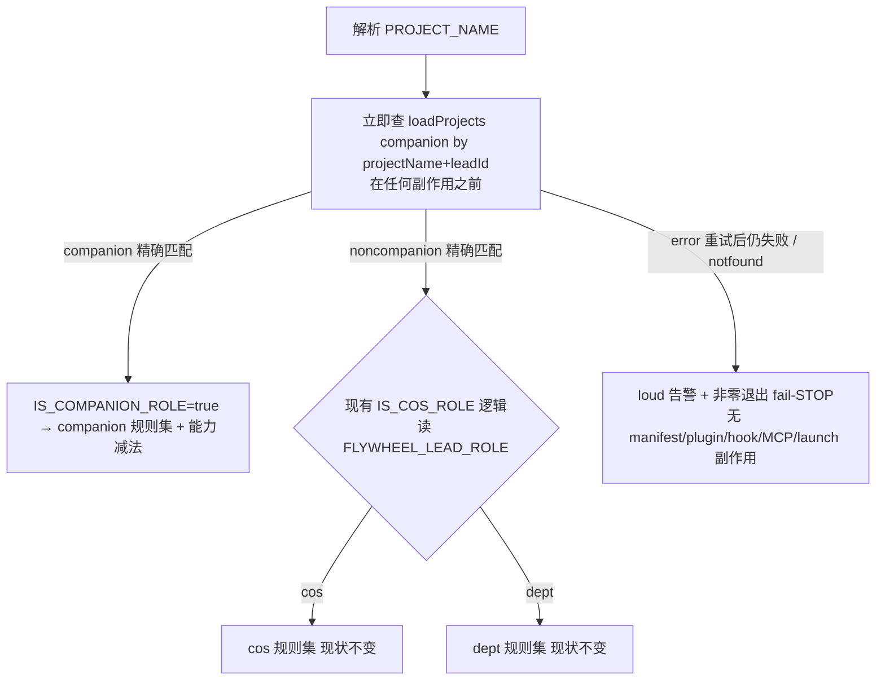

# Plan: Onboard Mufasa + Belle as Flywheel companion Leads

**Version**: v1.37.0 (provisional — re-version at ship if held PRs reorder)
**Issue**: FLY-231
**Date**: 2026-06-06
**Source**: `~/Dev/growth/MUFASA.md`, `~/Dev/personal-assistant/BELLE.md`, FLY-189 (Hiro)/FLY-190 (Asha) onboards
**Status**: codex-approved (R7)
**Review**: Codex design review **7 轮**:R1–R6 CHANGES REQUESTED(强收敛),**R7 APPROVED**(via codex-with-fallback,read-only,high effort)。owner(team-lead 代 Annie)拍板**路 A**(共享 session 换看门狗覆盖,相称减法)。本版落实全部 R1–R6 BLOCKER/HIGH/MEDIUM + 路 A 决定;R7 确认四项 R6 运维闭环编辑已连贯入文件、三红线保持、无 Path A 范围内剩余阻断。

---

## 1. 背景与目标

把两个**陪伴型 agent** 转成正式 Flywheel Lead(常驻 + 崩溃自动重启 + 卡死检测告警),加入跨部门 `#leads-roundtable`:

- **Mufasa** — 成长/沟通陪练。`~/Dev/growth`(**非 git repo**)。朋友/平视人设,反"人机感"。
- **Belle** — 生活助理(每周三 Weee 买菜 + 日常)。`~/Dev/personal-assistant`(**非 git repo**)。20 出头女生 ESFJ 人设。

二者**不是工程 Lead**:不开 Runner、不碰代码 PR、不路由 Linear issue。产品价值 = 精调的"去人机感、温暖、短句"人设。

### 1.1 审计推翻 issue 假设

Issue 设 "Mufasa 从零 / Belle 半套",**实际两者已在线**,跑在 Flywheel 之前的 `atlas`/`belle-daemon` launchd 模式:

| Agent | 老 daemon (label / PID) | 启动脚本 | 现用 bot (公开 id) | 现用频道 |
|-------|------------------------|---------|---------|---------|
| Mufasa | `com.xiaorongli.atlas-growth` / 76199 | `~/Dev/growth/.atlas/start.sh` | 默认共享目录 `~/.claude/channels/discord/`(`1499895683287748679`) | `1500600400238084307`(待 Annie 确认) |
| Belle | `com.xiaorongli.belle-daemon` / 76200 | `~/Dev/personal-assistant/belle/start.sh` | 专属 `~/.claude/channels/discord-belle/`(`1509701064935477318`) | `#belle` `1509720034463846481` |

→ **迁移**(非从零):退役两个老 daemon(否则同 bot token 抢登录)+ 复用现有 bot(token 不变)→ 几乎不需 Annie 过 2FA。
老 daemon 显式 `--effort medium`(躲"草拟回复但没调 reply→静默"bug)+ 隔离 tmux socket `-L atlas`。

### 1.2 "自愈"准确说法

- **崩溃自动重启** = `claude-lead.sh` supervisor 循环(KeepAlive + backoff)。companion 真正的"自愈"。
- **卡死(freeze)检测** = `LeadWatchdog`(FLY-193),**只检测 + 发 Discord 告警,不重启**。故 companion 必须配 `alertChannel`。

### 1.3 Annie Phase 1 拍板

转 + 复用现有 bot;退役老 daemon;保人设;不给 Runner 能力/不碰代码;干净切换;两者都进 roundtable + 互相 allowBots;
各 1 专属聊天频道 + 监听 roundtable(mention-gated);不要 core 频道;Mufasa=growth(M)/Belle=life(B);token 只在 0600 `.env`。

---

## 2. 核心设计

### 2.1 难点

`claude-lead.sh` 给每个 Lead 无条件 append 工程治理 base 规则(`founder-only-authority` ~20KB 所有角色;`department-lead-rules`
~30KB + runner-messaging + executor-routing + stuck-remanage + doc-flow 非 cos),唯一分流 `IS_COS_ROLE`。还给每个 Lead
注入共享 Bridge token、注册 terminal MCP、继承 user-scope MCP + gbrain、跑 Agent Team transport + 工程 bootstrap。
对 lower-trust 个人陪伴 = 能力过授 + 人设污染。**人设保真 = 产品需求本身。**

### 2.2 companion 判别(单一真相源 + 异常 fail-STOP + **永远先查,无 env 旁路**)

**单一真相源 = `loadProjects()` 结果的 `companion: true`**(测试经 `FLYWHEEL_PROJECTS` 提供配置)。`claude-lead.sh` 用查
`LEAD_CORE_CHANNEL` 同款 `node -e loadProjects()`,按 `projectName + leadId` 精确定位,**永远执行**四态查询
(**不再用 `FLYWHEEL_LEAD_ROLE` 跳过查询** —— R4 指出那是 env 驱动 fail-open:wrapper `set -a` source `.env`、legacy/manual 继承调用者环境,
任何意外的 `FLYWHEEL_LEAD_ROLE` 会让真 companion 绕过精确匹配按 noncompanion 起):

- `companion`(精确匹配且 `companion===true`)→ `IS_COMPANION_ROLE=true`。
- `noncompanion`(**精确匹配** project+lead 且 `companion!==true`)→ false。**此后**现有 `IS_COS_ROLE` 逻辑**原样**继续读 `FLYWHEEL_LEAD_ROLE` 决定 cos/dept(role env 只在精确 noncompanion 之后参与,不再做旁路)。删 `companion:true` 即干净回滚为 noncompanion。
- `error`(读/解析抛错)→ **重试一次**;仍 error → **loud 告警 + 非零退出(fail-STOP)**。
- `notfound`(配置不存在 / 精确 lead 未找到;`loadProjects()` 文件缺失返回 `[]` → ENOENT 落此态)→ **loud 告警 + 非零退出(fail-STOP)**。

> fail-open 会粘死(R3 纠正):已按 noncompanion 成功启动的进程是"健康"的,supervisor 不会在配置恢复后重启它。改 fail-STOP:
> 瞬时配置故障只让**正在重启**的该 Lead 等 launchd KeepAlive 重试,不影响已运行的现有 Lead。

> **fail-STOP 的"loud 告警"必须真正到达 Annie(R6 HIGH-3)**:companion 查询 error/notfound 时脚本在建 tmux pane **之前**退出 → LeadWatchdog 找不到 pane 只停在 `AwaitingFirstCapture` **不告警**,stderr 只进 `/tmp/flywheel-lead-*.log` → **静默离线**(与"保持在线"冲突)。故 fail-STOP **必须走独立于正常 projects routing 的启动失败通知路径**(复用现有独立告警:`scripts/lead-alert.sh` / `MetaAlertNotifier`),**带去重**(launchd KeepAlive 每 30s 重试,不能刷屏)。测试证明 error/notfound 产生**一次可观测告警**(非仅日志)。

**检测时机(R4 HIGH-4:必须在任何角色相关副作用之前)**:`IS_COMPANION_ROLE` 在 `PROJECT_NAME` 解析后**立即**查询并定,
**在 manifest 写入 / identity+rules 同步 / Discord 插件 check-update / 全局 PostCompact hook 安装 / `.mcp.json`(terminal/inbox/gbrain/user MCP)构造 /
Agent Team transport preflight / bootstrap 之前**。`error`/`notfound` 在这些副作用**之前** fail-STOP(测试断言:不写 manifest、不改 plugin/hook、不生成 MCP、不 launch)。
此后现有 `IS_COS_ROLE` 块**逻辑不变**,只被 companion guard 包围(owner 红线 #2:不重构)。

> **测试 slot / 部署交互(R5 BLOCKER-2)**:永远查询后,test-slot 的 synthetic lead 必须在 `loadProjects()`(经 `FLYWHEEL_PROJECTS` fixture)里精确匹配 → noncompanion,否则 notfound fail-STOP。
> 且 `restart-services.sh` 现状遍历**全部** `~/.flywheel/manifests/*.json`(含 `test-teardown.sh` 未清的 stale test-slot manifest)→ 生产部署触发全 Lead restart 时会撞 stale slot manifest → notfound fail-STOP → 部署失败。
> **不在 `claude-lead.sh` 加 test-slot fail-open 例外**(会重开旁路);改在重启编排处解决(§3.1.5)。



### 2.3 companion 规则集

`IS_COMPANION_ROLE=true`:
- **跳过**:非 cos dept 块全部 + cos 块 + `founder-only-authority` + `founder-html-delivery` + L3 screencapture + 仓库侧 dept 规则块及其缺失 fail-fast。
- **保留**:`cross-dept-channel-rules`(在 roundtable)+ project-side `common-rules`(若存在;companion repo 无 → 自然跳过)+ 人设。
- **新增** `companion-safety-contract.md`(~12 行):"你是陪伴 Lead,不执行任何 Flywheel 工程/运维动作(merge / 开关 Runner / 改代码 /
  调 Bridge action,**包括 curl `localhost:9876/actions/*`**);不替 Annie 做不可逆动作除非她明确确认。"

### 2.4 companion 能力裁剪(**路 A**:相称减法,共享 session 被看门狗覆盖)

> **架构取舍(owner 拍:team-lead 2026-06-06,scope discipline)**:LeadWatchdog 靠监控**共享 `flywheel` tmux session** 的 pane 抓卡死 →
> companion 要被看门狗覆盖就**必须**待在共享 session 里。共享 session 会带入 ambient env + 加载已启用插件自带 MCP,无法在不改 watchdog 架构 +
> 不放弃监控的前提下做到"只留 Discord MCP / env 白名单"(Codex R4 指出 `--strict-mcp-config` 与 channel 架构直接冲突、会一起干掉 Discord)。
> **路 B**(独立 socket + `env -i` 白名单 + watchdog 改造 + MCP allowlist spike)= 过度工程,且与看门狗打架,**不做**。
> **威胁模型**:Annie 私人陪伴、本机、只对 Annie;Bash 本就能读文件系统。故采用**相称减法**,把"插件 MCP / ambient env 继承"记为**已接受残余风险**。
> **诚实表述(R5 MEDIUM-5)**:共享 tmux 的 ambient env 相比老 daemon 的隔离 socket **确实是 capability 增量**(老 daemon 特意隔离 + 清污染);准确说法是 **owner 在"本机 + Annie-only"威胁模型下接受这个 capability delta**,而非"能力没增加"。

**做的减法(companion 分支,纯加 guard,不重构 `IS_COS_ROLE`)**:
- **pane 凭证显式清空(R3 BLOCKER-4 + R2 HIGH-5)**:companion 在每个 pane `env_args` 显式置空 `TEAMLEAD_API_TOKEN=`、`FLYWHEEL_COMM_CLI=`、
  `FLYWHEEL_COMM_DB=`、`OPENAI_API_KEY=`、`BRIDGE_URL=`(覆盖 wrapper `set -a` source 的 `.env`)。**验收 = token 不可用**(非"变量名不存在";BRIDGE_URL 非秘密)。这是切断 reserved-action 便捷入口的主手段。
- **内部 MCP / mailbox / bootstrap**:不注册 `flywheel-terminal`/`flywheel-inbox`(companion `.mcp.json` 用 `USER_MCP_FRAGMENT={}` + `gbrain_server={}` 做廉价 project-scope 减法);跳过 Agent Team transport preflight + mailbox identity 合并 + initial `send_bootstrap`(避免工程腔 bootstrap;人设经 `--agent` 进 system prompt,compaction 后仍在)。
- **PostCompact 全局 hook(R3 BLOCKER-2)**:跳过**安装**不够 —— `~/.claude/settings.json` 已全局注册 `~/.flywheel/bin/post-compact-bootstrap.sh`,它在 `FLYWHEEL_LEAD_ID` 存在时执行、`BRIDGE_URL` 缺省回退 localhost → companion compaction 后仍会发 bootstrap curl。**修**:给 companion pane 注入 `FLYWHEEL_LEAD_COMPANION=1` 标记 + **改稳定版 `post-compact-bootstrap.sh` 在任何 curl 前对 companion `exit 0`**;非 companion 不变。测试**执行实际安装的全局 hook**证明 companion 不发请求、现有 Lead 不变。
- 工具:`permissionMode: bypassPermissions` + `disallowedTools: Agent`;保留 Write/Edit/MultiEdit/Bash(编辑自己内容文件)。

**已接受残余(路 A 显式记录,不在本 PR 消除)**:
- **ambient env 继承**:共享 `flywheel` session 的 global/session env + wrapper source 的 `.env` 会把**未枚举的**变量(别的 bot token / 未来新增 secret)带进 companion pane。companion 显式清空的是已知高权限 5 个;其余按残余接受。`env -i`/隔离 socket 属路 B,不做。
- **插件自带 MCP**:已启用插件(context7/playwright/serena 等)的 plugin-bundled MCP 仍加载(非 reserved-action 向量)。`USER_MCP_FRAGMENT={}` 只挡 user-scope `~/.claude.json` MCP,挡不住插件 MCP;不强求,记为已接受。
- **全局 hooks**:`permission-logger.sh`(每次 tool call 写日志,可能含 companion 编辑的文件路径/命令前缀)、`strategic-compact`、`flywheel-session-end.sh` 等仍触发。**逐项记录实际副作用 + 保留/接受决定**(均 Annie 本机本地日志,非外泄);PostCompact 已按上面门控。S1 在真 companion 进程核对实际 MCP + hook inventory 作为记录基线。
- **Bash 整机文件系统可达**(workspace 只约束 cwd):相对老 daemon **未扩大**;persona 文件经审查不含高权限/不可逆指令(MUFASA/BELLE.md Hard rules 已"不可逆需确认")。

> **系统性洞 → 独立 follow-up(上线门槛,非本 PR 修)**:`/actions/*` loopback alias 不要求 token、founder-consent gate 默认关 ——
> **先于本 issue、影响所有本机 Lead/进程**的 Bridge 鉴权洞。companion 经"无 token + 无 BRIDGE_URL + 无 terminal MCP + safety contract 明禁"做**风险降低**;
> 保留 Bash 仍能裸 `curl localhost:9876/actions/*` = 残余风险,由**新建并链接的 FLY follow-up** 真正堵。验收措辞"风险降低,非硬隔离",**不**声称 companion 无法执行 reserved actions。

### 2.5 effort

companion 分支加 `--effort medium`(companion-only;现有 Lead 不加任何 `--effort`,argv 字节不变 + 断言)。

### 2.6 identity.md

`--agent <lead-id>` → identity.md = system prompt。= frontmatter(`name`/`description`/`model: opus`/`permissionMode: bypassPermissions`/
`disallowedTools: Agent`)+ MUFASA/BELLE.md 全文人设 + Flywheel 段(Discord identity 表、频道隔离、reply 机制)。MUFASA/BELLE.md 留人类真相源。

### 2.7 projects.json(无 memoryAllowedUsers — R2 HIGH-2)

`loadProjects()` 要求 `match.labels` 非空 → 惰性标识标签(`canSpawnRunners:false` → `lead_cannot_spawn`,永不路由)。首切换不接 Bridge memory → 不配 `memoryAllowedUsers`。

```jsonc
// 追加到 ~/.flywheel/projects.json(Mufasa 待频道确认才写,见 §4)
{ "projectName": "growth", "projectRoot": "/Users/xiaorongli/Dev/growth",
  "leads": [{ "agentId": "mufasa-lead", "chatChannel": "1500600400238084307", "alertChannel": "1500600400238084307",
    "match": { "labels": ["growth"] }, "botTokenEnv": "MUFASA_BOT_TOKEN",
    "canSpawnRunners": false, "companion": true, "department": "growth" }] },   // 无 generalChannel / 无 memoryAllowedUsers
{ "projectName": "personal-assistant", "projectRoot": "/Users/xiaorongli/Dev/personal-assistant",
  "leads": [{ "agentId": "belle-lead", "chatChannel": "1509720034463846481", "alertChannel": "1509720034463846481",
    "match": { "labels": ["life"] }, "botTokenEnv": "BELLE_BOT_TOKEN",
    "canSpawnRunners": false, "companion": true, "department": "life" }] }
```

---

## 3. 改动清单

### 3.1 仓内改动(走本 PR)

1. **`packages/teamlead/src/ProjectConfig.ts`**:`LeadConfig` 加 `companion?: boolean`;`loadProjects()` 仅校验"若提供必须 boolean",**不归一化**;消费者用 `=== true`。保留惰性 label。
2. **`packages/teamlead/scripts/claude-lead.sh`**:
   - companion 单源四态检测,**`PROJECT_NAME` 解析后立即定 + 任何角色相关副作用(manifest 写 / identity+rules 同步 / 插件 check-update / PostCompact 安装 / `.mcp.json` 构造 / transport / bootstrap)之前 fail-STOP**(§2.2 R4 HIGH-4)。**永远查询,无 `FLYWHEEL_LEAD_ROLE` 旁路**。
   - 规则注入 `if companion … elif cos … else dept …`;founder-auth/html/screencapture/仓库侧 dept 要求包 `if not companion`(§2.3)。现有 `IS_COS_ROLE` 块逻辑不变,只被 companion guard 包围。
   - 能力裁剪(§2.4 路 A):`USER_MCP_FRAGMENT={}`+`gbrain={}`、不注册 terminal/inbox、跳 transport+bootstrap、pane creds 显式清空、注入 `FLYWHEEL_LEAD_COMPANION=1` 标记。**不加** `--strict-mcp-config`(与 Discord channel 架构冲突 = 路 B,不做)。
   - `--effort medium`(§2.5)+ 注入 `companion-safety-contract.md`。
   - **gated dry-run/launch-plan(R3 BLOCKER-4 安全版)**:`FLYWHEEL_LEAD_DRY_RUN=1` 守外部/不可逆触点(插件 check/update、bootstrap curl、
     PostCompact 安装、MCP 真 settings pre-seed、`_launch_claude`),输出 launch-plan = 最终 argv + 每个 pane env **key + 状态(`unset|empty|set`,绝不输出值)** +
     注册 MCP server 名 + `IS_COMPANION_ROLE` + role 来源 + bootstrap/transport gate 布尔,exit 0。**始终 redact** bot/teamlead/openai token 及 MCP required-env secret。
3. **`~/.flywheel/bin/post-compact-bootstrap.sh` 稳定版(源 `packages/teamlead/scripts/post-compact-bootstrap.sh`)**:开头检测 `FLYWHEEL_LEAD_COMPANION=1` → 任何 curl 前 `exit 0`(R3 BLOCKER-2)。
4. **`packages/teamlead/lead-rules-base/companion-safety-contract.md`**(新,明禁 `/actions/*`)+ **`cross-dept-channel-rules.md`** 把 mufasa/belle 从 "Future members" 挪进正式 roster + bot id。
5. **`scripts/restart-services.sh`(R5 BLOCKER-2 + R6 BLOCKER-1:test-slot manifest 生命周期 + **fail-closed** resolver)**:`do_restart_all_leads()` 现状遍历**全部** `~/.flywheel/manifests/*.json`;永远查询 + fail-STOP 后,stale/active test-slot manifest 会被生产 restart 撞上 → notfound fail-STOP。**不在 `claude-lead.sh` 加 test-slot 例外**;改:定义一个 **S2.5 与 `do_restart_all_leads()` 共用的 production-candidate-resolver,显式 fail-closed**:
   - `loadProjects()` 失败 → **立即中止,不退为空集合**;
   - 生产 restart 路径**拒绝意外的 `FLYWHEEL_PROJECTS`**(或显式强制读 host 生产 config)——否则 test fixture env 会让生产 candidate 集错/空;
   - **只有满足严格 test-slot ownership 判据**(leadId 匹配保留前缀 `flywheel-test-*` / test-slot 专属 marker)的 manifest 才跳过,且**不计入**会阻止 deployed-sha 前进的 `skipped`;
   - **其余每个 manifest 必须精确匹配 `loadProjects()`,否则 loud error + 中止部署**("无法精确匹配"**绝不**等同于 test-slot —— 漂移/误删/拼错的**生产** manifest 必须挡住部署,不能静默跳过);
   - **`scripts/test-teardown.sh` 删除对应 test-slot manifest**(防堆积)。
   回归测试:**未知非 test manifest 阻止部署** / **意外 `FLYWHEEL_PROJECTS` 不会静默跳过全部生产 Leads** / stale test manifest 不阻塞 / active test slot 不被生产 deploy 错误重启 / 所有生产 candidate 精确匹配。wrapper(`scripts/flywheel-lead-wrapper.sh`,由 `scripts/flywheel-daemon.sh` 装 `~/.flywheel/bin/`)本 PR 无需改。
6. **测试(R3/R4/R5)**:真 `claude-lead.sh` 在**隔离 HOME + scrub 继承环境** + fixture(`FLYWHEEL_PROJECTS`/manifest/agent file/插件 state)下跑 dry-run:
   - **byte-compat sentinel**:**全部 5 个现有 Lead(Peter/Oliver/Simba/Hiro/Asha)逐一** + 一个 dept + cos 形态,NUL-safe argv 与 main 逐项一致(R5 HIGH-3:不只一个 dept/cos 代表)。
   - **companion launch-plan**:argv 含 `--effort medium`/companion-safety-contract/cross-dept,不含 founder-auth/dept/runner-msg/executor/stuck/doc-flow/screencapture(且**不含** `--strict-mcp-config`);
     pane creds 状态=`empty`;生成的 `.mcp.json` 不含 terminal/inbox/gbrain/user MCP(插件 MCP 仍加载 = 已接受);bootstrap/transport gate=off;role 来源=projects-query。
   - **secret-canary**:断言 dry-run stdout/stderr **不含**任何 fixture secret。
   - **role 四态 + 旁路防御**:companion true / 精确 noncompanion / notfound→fail-STOP / error→重试→fail-STOP / **role env(lead|cos)+ missing/notfound config 仍 fail-STOP** / **精确 slot fixture + role env 正常进 cos|dept** / **production companion + 意外 role env 仍 companion** / 多 leads 精确定位 / **回滚(删 companion:true → noncompanion)**。
   - **早 fail-STOP 无副作用**:error/notfound 时断言**不写 manifest、不改 plugin/hook、不生成 MCP、不 launch**。
   - **restart-services manifest 过滤**:stale/active test-slot manifest 不阻塞生产部署(§3.1.5)。
   - **真全局 PostCompact hook**:companion(marker)不发请求、非 companion 行为不变。
   - 接入 CI。`ProjectConfig` 单测:校验 + 正交 + 不归一化。
7. **文档**:本 plan + 归档;CLAUDE.md 里程碑行;MEMORY.md。

### 3.2 主机本地配置(执行期落地,不在 PR)

- `~/Dev/growth/.lead/mufasa-lead/identity.md` + `~/Dev/personal-assistant/.lead/belle-lead/identity.md`(§2.6)。
- `~/.claude/channels/discord-{mufasa-lead,belle-lead}/{.env,access.json}`(token 文件级搬运、**0600**、不打印;access.json = pairing + Annie allowFrom +
  自己聊天频道 + roundtable group **`allowFrom=[Annie + sibling bot ids]`(非空)** + allowBots(其余 6 Lead)+ mentionPatterns)。
- `~/.flywheel/.env`:追加 `MUFASA_BOT_TOKEN`/`BELLE_BOT_TOKEN`(0600,文件级搬运,不 echo)。
- `~/.flywheel/projects.json`:追加项目(§2.7,Mufasa 待频道确认)。**写入用校验后原子替换**(写 temp → `jq`/`loadProjects()` 校验 → `mv`),避免 fail-STOP 撞上部分写窗口(R6 MEDIUM-4)。
- `~/.flywheel/manifests/{growth-mufasa-lead,personal-assistant-belle-lead}.json`:workspace=项目 repo + mcpExclude(冗余防御)。
- `~/Library/LaunchAgents/com.flywheel.lead.{growth-mufasa-lead,personal-assistant-belle-lead}.plist`(照 Hiro/Asha)。
- 现有 5 Lead access.json:`allowBots` 追加 mufasa+belle bot id(**热生效**;现有 Lead roundtable `allowFrom` 空 → 追加 allowBots 即可收 companion 消息)。

---

## 4. 执行顺序

```mermaid
sequenceDiagram
  participant W as worker-fly-231
  participant CX as Codex
  participant TL as team-lead
  participant A as Annie
  W->>CX: S0 plan design review
  CX-->>W: APPROVED
  W->>W: S1 仓内代码+测试(隔离HOME+scrub dry-run CI;真机验 Discord 收发不被减法误伤;真进程 MCP/hook inventory)→ build/test 绿 → Codex code review
  TL->>W: 创建并链接 /actions/* follow-up FLY(上线门槛)
  W->>TL: PR ready + 全证据(**不 merge**)
  A-->>TL-->>W: Annie ship 批准(owner 红线 #3)
  W->>TL: S2 报实时 PID/label 核 + 协调 Bridge 重启窗(批量)——**不含合并部署**
  W->>W: S2.5 部署前只读 host preflight(失败即中止,见正文)
  W->>W: S3 merge/deploy(main pull,确认 dist 重建 + post-deploy 校验 PostCompact installed hash)+ 写 Belle 项目 + 受控 Bridge 重启 + 验证 runtime/watchdog/alert(+ bootstrap/transport 缺席)
  W->>W: S3 Belle 干净切换(预检→bootout 老→bootstrap 新同 bot→三步验证;失败有界回滚同 token 不双登录)
  A-->>TL-->>W: 确认 Mufasa 频道
  W->>W: S4 写 Mufasa 项目(确认后)+ Bridge 重载 + Mufasa 切换 → 三步验证
  W->>W: S5 roundtable allowBots 交叉授权(热生效)+ E2E 联通
```

- **S0** Codex design review 本 plan。
- **Ship 红线(R6 BLOCKER-2 + owner #3)**:顺序 = S1 实现/测试/code review → **PR ready + 全证据 → 等 Annie ship 批准** → S2.5 host preflight → merge/deploy/restart → cutover。**S2 只做 PID/label 报告 + 重启窗协调,绝不含合并部署。** PostCompact `source/path` 校验在 preflight,`installed hash` 校验在 deploy 后。
- **S1** 仓内代码 + 隔离-HOME+scrub dry-run CI 夹具;**真机验证** companion 能正常收发 Discord(reply/mention)+ 跳 bootstrap 后 watchdog/alert 仍覆盖 + 真进程 MCP/hook inventory 作为记录基线(确认无 terminal/inbox、token 不可用;插件 MCP 在=已接受)。`pnpm -r build` + 测试绿 → Codex code review。
- **S2.5 部署前只读 host preflight(R4 HIGH-5 / R5 HIGH-3;失败即中止部署,在 core-script 部署触发全 Lead restart 之前)**。预检集合必须与 `restart-services.sh` 实际会重启的**生产 manifest 集合一致**:
  - `loadProjects()` 成功;
  - **每个生产 restart candidate(经 §3.1.5 过滤后)** 的 `projectName+leadId` 在 `loadProjects()` 精确匹配;
  - 生产启动环境**无意外 `FLYWHEEL_LEAD_ROLE`**;
  - **全部 5 个现有 Lead 各自**跑 NUL-safe launch-plan/argv reverse-compat(非只一个代表);
  - pre-deploy 校验预期 `post-compact-bootstrap.sh` source/path,post-deploy 校验 stable installed hash。
- **S3** 部署后确认 `dist/ProjectConfig.js` 重建,写 Belle 项目,**受控 Bridge 重启**(协调 team-lead、批量),验证 runtime/watchdog/alert routing **+ companion bootstrap/transport 缺席**(不是验证 bootstrap/mailbox 存在 —— companion 设计为无)。
- **S3 预检(bootout 前)**:`plutil -lint`;`jq`+`loadProjects()` 校验;manifest/state-dir 权限 0600;token 非空但**不打印**;Bridge health;dry-run 核对新 Lead launch-plan/persona。
  **切换**:`launchctl bootout` 老 → `ps`+精确 PID 确认退 → `launchctl bootstrap` 新 → 三步验证(绿点/typing/频道隔离 + 真发消息收到保持人设回复)。
  **有界无重叠回滚**:限时未登录/未回复/persona 失真 → bootout 新 → 恢复老,同 token 永不双登录。用 `launchctl print gui/$(id -u)/<label>` + 精确 PID。
- **S4**(R2 MEDIUM-7)**Annie 确认 Mufasa 频道后**才写 Mufasa 项目 + Bridge 重载 + 切换;理想 Annie 在 S3 前确认 → 一次重启。
- **S5** roundtable:加两 bot id 进 5 Lead allowBots(热生效)+ E2E(未点名静默 / 仅目标响应 / 回复路由回请求方 / 无 fanout)。
- 退役老 daemon = `launchctl bootout` + plist 改名 `.disabled`(可逆,不 rm)+ `ps` 验证退。

---

## 5. 风险与缓解

| 风险 | 缓解 |
|------|------|
| 改 `claude-lead.sh` 误伤 5 Lead | 隔离-HOME dry-run launch-plan 逐项比对 dept/cos argv 字节一致 + CI;Codex design+code review |
| companion 漏判 → 工程腔/扩权 | 单源 + 四态 + fail-STOP(异常不静默扩权启动);删 companion:true 干净回滚 |
| companion 调 Bridge reserved actions | 主手段=不发 token/BRIDGE_URL + 无 terminal MCP + safety contract 明禁;裸 loopback 残余由独立 FLY 堵。ambient env/插件 MCP 继承=已接受残余(路 A,共享 session 换看门狗覆盖) |
| `/actions/*` 裸 loopback 残余 | safety contract 明禁 + 链接 FLY follow-up(上线门槛);验收"风险降低非硬隔离" |
| dry-run 泄漏 secret | launch-plan 只出 key+状态(unset/empty/set),绝不出值;redact + scrub 环境 + secret-canary |
| PostCompact 全局 hook 仍触发 bootstrap | 改稳定版脚本对 companion(marker)early-exit;真 hook 测试 |
| 切换期掉线 | 先全 prep + 预检 → 单窗口停老秒起新 → 有界回滚同 token 不双登录 |
| Bridge 不认识新 Lead | S3 受控 Bridge 重启 + 确认 dist 重建 + 验证 runtime/watchdog/alert |
| 默认 effort 静默回复 | companion-only `--effort medium` |
| 卡死无人恢复 | 崩溃→supervisor 重启;freeze→watchdog 检测+`alertChannel` 告警(不自动恢复,后续 issue) |
| Mufasa 频道误判/未确认即写 | 已定位 `1500600400238084307`,**Annie 确认后**才写/重启(S4) |
| token 泄漏 | 只在 0600 .env;文件级 cp;bot id base64 只输出公开数字 id |
| roundtable 隐私/误触发 | group `allowFrom=[Annie+sibling bots]`(非空)+ allowBots 双过滤;E2E |

---

## 6. 验收标准

1. `pnpm -r build` 绿;隔离-HOME+scrub dry-run CI 夹具绿:**全部 5 个现有 Lead 各自** NUL-safe argv 字节不变(非只 dept/cos 代表);companion launch-plan 含/不含项 + pane creds 状态=`empty` + MCP 不含 terminal/inbox/gbrain/user + bootstrap/transport off + role 来源=projects-query;secret-canary(stdout/stderr 无 fixture secret)绿;role 四态 + role-env 旁路防御 + 早 fail-STOP 无副作用 + 回滚 + 真 PostCompact hook 测试绿;**production-candidate-resolver fail-closed 测试**(未知非 test manifest 阻止部署 / 意外 `FLYWHEEL_PROJECTS` 不静默跳过生产 Leads / test-slot teardown 清 manifest)绿;**fail-STOP 一次可观测告警(非仅日志)**测试绿;ProjectConfig 单测绿。
1b. **S2.5 host preflight 成功证据**(全部 5 Lead reverse-compat 通过 + 生产无意外 `FLYWHEEL_LEAD_ROLE` + PostCompact source/path 匹配)留档,作为 merge/deploy 前置。
2. Belle + Mufasa 在 Flywheel launchd 在线(`launchctl print` 见 label + 活 PID);Discord 绿点;Annie 在各自频道发消息收到**保持人设**(短/温暖/无工程腔)的回复。
3. 频道隔离:companion 只在自己聊天频道 + roundtable(mention)响应,其他频道静默。
4. roundtable E2E:`@Mufasa`/`@Belle` 被各自接住,未点名静默,回复路由回请求方,无第三方 fanout。
5. **真 companion 进程**能力验证(路 A 相称):运行时 MCP inventory **不含 terminal/inbox/gbrain/user MCP**(Discord reply 工具在;**插件 MCP 仍在 = 已接受**);PostCompact 对 companion 不发 bootstrap;`TEAMLEAD_API_TOKEN` **不可用**;`--effort medium` 生效;未触发 bootstrap/transport。ambient env 继承 + 插件 MCP 已作为已接受残余记录(§2.4),不作为失败项。
6. Bridge 重启后识别新 Lead 且 **companion bootstrap/transport 缺席不影响** watchdog/alert(runtime 由 projects.json 建);崩溃重启实测(kill→supervisor 复活);freeze 注入→告警到 `alertChannel`。
7. 老 daemon 退役:`launchctl print` 无 `atlas-growth`/`belle-daemon`,`ps` 验证退;plist `.disabled`(可逆)。
8. 全程无 token 明文泄漏。上线前 `/actions/*` follow-up FLY 已创建并链接。

---

## 7. 遗留 / Follow-up

- **FLY(team-lead 待建,上线门槛=创建后在本 PR 引用+链接):Bridge `/actions/*` loopback alias 强制鉴权 / 开 founder-consent gate**(影响所有 Lead)。team-lead 已认领创建该 issue。
- companion 记忆:首切换不接;后续接入需补隐私边界 + bootstrap persona 验收。
- companion 默认 effort 仍偶发静默 → 评估 effort 做 projects.json 可配字段。
- **路 B(若未来需要更强隔离)**:独立 tmux socket + `env -i` 白名单 + channel-aware MCP allowlist + LeadWatchdog 监控隔离 socket。本次按 owner 决定走路 A,不做;若威胁模型变化(如 companion 接外部输入)再评估。
