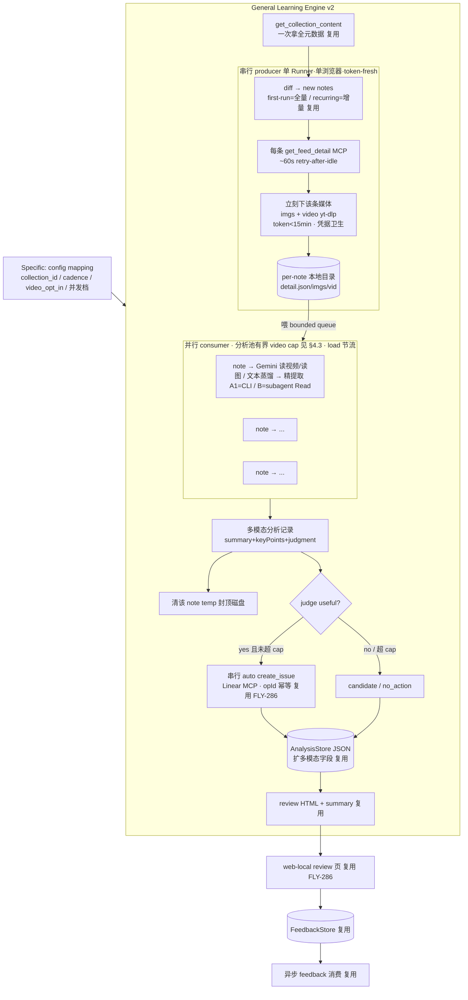

# Plan: 小红书学习系统 v2 — 全内容下载 + Gemini 多模态深读 + 并行 — FLY-349

**Version**: v1.52.0（**tentative** — 设计方案，ship 时按 doc/VERSION 重定）
**Issue**: FLY-349
**Date**: 2026-06-19
**Source**: `doc/engineer/research/new/FLY-349-xiaohongshu-v2-deep-parallel.md`
**Status**: **codex-approved**（codex-design-review 2 轮：R1 CHANGES REQUESTED 8 条全纳入 → R2 APPROVED + 3 条非阻塞文案清理已应用）→ 待 Annie review
**Owner**: runner-ee5dfc82；Lead = flywheel-eng-lead (Tadashi)

> 🔴 **本轮只设计、不实现。** 不动 live、不改 FLY-286 现有代码。这是给 Annie review 的方案；据她反馈迭代后才进实现。

---

## 0. Goal / Scope

把 FLY-286 已上线的小红书学习 loop 的"逐条读 note"这一步**做深**（全内容下载 → Gemini 多模态深读 → 精提取重点），并为大收藏夹（125+）加**并行编排**，让它**又快、又细、又对**。FLY-286 的控制模型（事后 review、自动建、幂等、web-local 回写、state 机）**全不动**——v2 只在"读 note"往深挖 + 加并行 + 兼顾两种运行模式。

**In scope**：
- 深度层：图文+视频全下载、Gemini 读图/读视频、精提取"对 Flywheel 有用的可执行点"。
- 并行编排：分析层 bounded 并行（producer-consumer，藏在串行抓取时间下）。
- 两模式：first-run 大批量重并行 / recurring 每周 5-10 轻量。
- empirical-first-10：先 10 条实测定方法，再 back-apply 125。
- 负载硬约束：并发上限 + load 节流。
- skill-vs-workflow 取舍 + 推荐。

**Out of scope（本设计不碰）**：FLY-286 控制流/存储/回写/scheduler 重做；YouTube；GeoForge3D/Sub 收藏夹；live pilot（CoS 带 Annie，load 安全时跑）；公网手机写后端（FLY-298）。

---

## 1. 核心洞察（v2 设计的地基 — doc 必须让 Annie 理解这个约束）

> **"快"的瓶颈是串行抓取，不是分析。所以并行的正解 = 把分析藏在抓取时间下，而不是并行抓取。**

- RedNote MCP 驱动**单个 Chromium**：`get_feed_detail` 每条 ~60s+、flaky、**必须串行**（并行会撞单浏览器、超时雪崩）。125 条 ≈ **2 小时**纯抓取——支配 wall-clock。
- `xsec_token` ~15min 短命 → 下载（图/视频）**必须紧跟**每条抓取（token 新鲜），不能先抓全再下。
- 分析（Gemini 读视频/读图/精提取）每条 ~1-2min、**互相独立**、不碰 MCP/token → **可并行**。并发 5 时 125 条 ≈ ~40min，**藏得进** 2h 抓取窗口。

→ **这就是为什么"整条搬进 dynamic workflow 并行"行不通**：抓取被单浏览器 MCP + token 窗口钉死在串行/单 Runner。并行机制（subagent/Task fan-out，或 Workflow 工具——名字待核 §6）只能、也正好接管**分析层 fan-out**。**hybrid 不是选择，是约束的结果。**

---

## 1.5 🔴 不变量：FLY-286 post-hoc 授权契约（v2 一字不动，worker 不可绕过 — codex R1#8）

v2 加深+并行只动"读 note"+编排，**绝不放松** FLY-286 的安全不变量。实现/review 时强制：
- **provenance**：每个自动建 issue 写不可变 marker（`xhs-auto-created` + `opId` + `runToken` + note URL + `collection_id`）。
- **低爆炸半径**：自动建 issue 落 triage/backlog（非 active execution）；安全 status/label 解析不出 → `auto_create` **fail-closed**（留 candidate，不建可执行 issue）。
- **可逆 close 受限**：feedback close 只关「本 XHS op 建且仍 untouched」的 issue；被人动过 → 不自动关，升级 Lead。
- **结构化授权**：close/create/promote 来自 review 页结构化动作（枚举），**不**从自由文本推断。
- **feedback 幂等 + 审计**：每动作独立 op id；`xhs-audit` 可按 marker/runToken 列出全部 XHS-created issue。
- 🔴 **并行 worker 不碰这些**：worker 只产分析结果（§4.1）；**所有外部副作用（建 issue / 写 state / 交付）由单一 aggregator 串行做**——契约的执行点不进并行池。

---

## 2. v2 架构（深度 + 并行；producer-consumer）



**与 FLY-286 的差异只有两处**：① `FETCH` 后的"读 note"从"文字层"升级为"全下载 + 多模态精提取"（§3）；② 引入 `POOL` 并行 consumer（§4）。其余全是 FLY-286 既有、复用。

---

## 3. 深度层：每条 note 的多模态深读 + 精提取（补 pilot 缺的层）

### 3.1 per-note 处理 stage（一条 note 的完整深加工）

```
1. get_feed_detail (MCP, 串行)         → title/desc/comments/imageList/videoInfo + xsec_token
2. 即刻下载 (token 新鲜):
     - 图片: imageList[].urlDefault → 本地 → sips webp→png
     - 视频(video_opt_in): yt-dlp + cookie, --max-filesize 200M, -S res:720 → file.mp4
   → per-note 目录 {detail.json, imgs/*.png, video.mp4}
   ───────── 以上串行段结束，token 已用完，后续不依赖 MCP/token ─────────
3. [并行] 多模态深读（🔴 实现方式取决于并行方案 A1/A2/B，见 §5）:
     - 文本: title+desc+top comments → 蒸馏
     - 图片: **CLI 读图**（`gemini -p "@img.png ..."`，bash 可并行）/ 或 **subagent 用 `Read` vision**（仅 B 路径，bash worker 不能调 `Read`，见 §5 R1#1 修正）→ "图里讲了什么"
     - 视频: gemini -m gemini-2.5-pro -S res:720 -p "@video.mp4 <精提取 directive>" (隔离 temp 子目录, GEMINI_CLI_TRUST_WORKSPACE=true)
4. [并行] 精提取: 综合三模态 → keyPoints[] = "对 Flywheel 有用的可执行点"(工具/做法/prompt/思路), 非全文堆砌
   → worker 只**产 per-note 结果 JSON**（不建 issue、不写共享 state，§4.1）
5. judge（useful? + reason）+ 6. 清该 note temp 目录 — judge 标在结果 JSON 里，但**建单/写 state 由 aggregator 串行做**（§4.1）；temp 在该 note 结果落盘后删
```

> 🔴 **`Read` vision 不是 CLI 原语（codex R1#1）**：现 SKILL.md 的"download → sips → `Read`"里 `Read` 是 Claude 工具调用，**bash 子进程（`xargs -P`/后台 job）调不了**。所以 shell-pool 并行路径的图片深读必须走 **`gemini` CLI 读图**（CLI-only）；要用 `Read` vision 并行只能走 subagent/Task（B 路径，§5）。这直接决定 §5 的方案拆分。

### 3.2 AnalysisStore schema 扩展（🔴 不是"纯 additive" — codex R1#3）

**实测**：现 `XiaohongshuAnalyzedPost`（`xiaohongshu-analysis-store.ts:56-69`）只有 `noteId/title/url/mediaKinds/summary/judgment/candidateIssue/createdIssue/status`；且 `xhs-analysis normalizeAnalysisRun()`（`commands/xhs-analysis.ts:109-169`）**故意丢弃所有未知字段**再持久化。→ v2 直接写 `modalRead`/`keyPoints`/`rawCounts`，`deliver`/`write-run` 会**静默丢掉**。
→ 必须做的（实现轮）：
1. **`schemaVersion: 2`** 或加可选 `deepRead` 对象（`{modalRead, keyPoints, rawCounts}`）—— **改 normalizer 白名单**让新字段过，且**兼容 v1 老 run**（加兼容测试）。
2. **review HTML 渲染 keyPoints**（`xhs-review-html.ts`）——否则深读结果进了 store 但 review 页看不到。
3. **复核 `MAX_STORE_FILE_BYTES = 1MB`**：125 条带 `modalRead` 文字可能超 1MB → 调高上限或分片。
- 持久层**仍无 raw 媒体字节**（只存读出来的文字结论）。

### 3.3 精提取 = v2 的产品价值（Annie 要的"重点"）

不是把全文/全转录塞进 issue，是 Gemini/vision 读完后**抽出可执行点**。每条 subagent/子进程在**自己的上下文**里读全内容，只回这个精炼结果 → 主流程/issue/review 页只见精提取，**全媒体不进主 context**。诚实标注：视频读是"内容+模型常识"综合、非逐字转录（review 页是人类 backstop）。

---

## 4. 并行编排（producer-consumer + 两模式 + 🔴 负载硬约束）

### 4.1 producer-consumer 骨架 + 🔴 单一 aggregator 副作用边界（codex R1#4）

- **producer（串行，1 个）**：循环 `get_feed_detail` + 即下媒体 → 落 per-note 目录 → push 进 bounded queue。
- **consumer（并行池，N 见 §4.3）**：从 queue 取一条已落盘 note → 多模态深读 + 精提取 + judge → **只产 per-note 结果 JSON**（`{noteId, modalRead, keyPoints, judgment, ...}`）→ 该 note 结果落盘后清 temp。**consumer 不建 issue、不写共享 state、不交付。**
- 🔴 **单一 aggregator（串行，= 单 Runner 主流程）做所有外部副作用**：收齐 per-note 结果 → enforce `first_run_cap` → 串行 record-op-intent + 查 Linear marker + 建 issue（复用 FLY-286 幂等）→ 组装**一份** AnalysisStore run → 交付 review 页 → **成功的 note 才 mark-processed**；失败/降级的 note 记 pending（下轮重试）。
  - 理由：`first_run_cap`/Linear 建单顺序/processed-pending 判定/owner-fenced state 写都是 **run 级** 关注点；若 consumer 各自判断+建单+改 state，cap 会 race、部分失败难推理。把副作用收口到一个串行 aggregator = 既拿并行分析的速度，又保 FLY-286 的正确性不变量。
- **bounded in-flight（count + bytes 双约束，codex R1#6）**：per-note 目录（detail.json+转换后图+可选视频）活到其 consumer 结果 commit 才删；producer 在 **queue 深度 OR 字节预算** 任一超限时**背压阻塞**（视频大小差异大，光数个数不够——125 视频不能全囤 ~25GB+）。崩溃恢复：下轮按 runToken 先清残留 temp 目录；**raw 媒体绝不进 AnalysisStore**。
- wall-clock ≈ max(串行抓取, 并行分析) ≈ 抓取时间；分析"免费"藏在抓取下。

### 4.2 两个运行模式（同一引擎，按量自动选档）

| 模式 | 判据 | 量 | 并发 | 编排 |
|------|------|----|----|------|
| **first-run** | `bootstrapped=false`（`analyze_baseline`） | 125 存量 | 重并行（分析池有界，video cap 见 §4.3） | 点燃 consumer 池（A1=shell pool·CLI / B=subagent·Task） |
| **recurring** | `bootstrapped=true` 增量 | 每周 5-10 | 轻量（低并发或串行） | 走简单路径，**不背 first-run 复杂度** |

引擎读 state（`bootstrapped` + diff 的 `new` 数）**自动选档**：`new ≤ 阈值（如 12）` → 轻量串行/低并发；`> 阈值` → first-run 重并行池。recurring 每周量小，原 skill 串行就够，**不强行并行**。

### 4.3 🔴 机器负载是硬上限（单独醒目 — 宁慢勿崩）

> Annie 有 **WindowServer panic 史**（多 agent 并发 load 干到 170-450 整机崩）；Gemini 视频分析 CPU/IO 重。**v2 必须把"不崩"放在"快"之前。这不是普通吞吐调优——是真崩过机。**

**保守优先的默认（codex R1#5，宁慢勿崩）**：
- **video 并发与 image/text 并发分开**（视频最重）。**first-10：video 并发 = 1**（先量真实负载，§7 gate）；**back-apply 125：video 起步 = 2**，仅当 first-10 证据证明更高安全才升；**video 硬顶 = 4**（除非显式提高）。image/text 并发可略高但仍 ≤ 6（8 核 cap）。
- **load 节流 + 滞回（hysteresis）**：读 `uptime` load avg 但**知道它滞后**（快速 Gemini/视频尖峰可能在 UI 失稳前来不及反映）→ 所以默认就低 + 加 ramp-down 规则：超阈值降档并**维持低档一段**（滞回，不立刻反弹）；持续高退到串行。
- **每条超时上限**：单 note Gemini/下载有硬超时（防卡死占资源），超时→该条降级/pending。
- **队列字节预算**（§4.1）+ **温和退避**（复用 retry-after-idle，不雪崩重试）。
- **运维规则（文档化）**：**不与其它重 agent 同跑**（first-run 大批量是独占机器的活，CoS 排期避开其它高负载）。
- **可关**：env kill switch `FLYWHEEL_XHS_PARALLEL=0` 退回纯串行，byte-compat 逃生口。

### 4.4 错误处理 + context 管理

- **错误**：单 note 失败（下载/Gemini 超时/flaky）→ 该条**留 pending、不前移 processed**，下轮重试（复用 FLY-286 fail-soft + pending）；不拖垮整批。视频超时 → 该条降级为图文+文字、标注未读视频、留 pending。
- **context**：全媒体/全转录**绝不进主 agent context**——A 方案写文件、主 agent 只读精提取结论；B 方案 subagent 独立 context + schema 返回。这是 Annie "别把全内容 load 进 context" 的硬要求，两方案都满足。

---

## 5. skill vs dynamic-workflow — 取舍 + 推荐

### 5.1 为什么是 hybrid（不是偏好，是约束）

§1 已证：抓取+即下被单浏览器 MCP + token 窗口钉死在**串行/单 Runner**；只有**分析层**能并行。所以无论选哪个并行实现，形态都是 hybrid = **抓取留 skill 串行 + 分析层并行**。讲给 Annie：**"整条搬 workflow"行不通的根因 = MCP 单浏览器 + token 15min，不是我们偷懒选了 hybrid。**

### 5.2 分析层并行的三个实现（codex R1#1 拆开 — `Read` vision 不能在 bash worker 调）

| | **A1：shell pool · CLI-only** | **A2：shell pool + 串行 `Read`** | **B：subagent/Task fan-out** |
|--|-------------------------------|----------------------------------|------------------------------|
| 图片深读 | **`gemini` CLI 读图**（bash 可并行） | `Read` vision **串行**（bash 调不了 `Read`）→ 图片不并行 | subagent 用 `Read` vision（每条独立 context） |
| 视频/文本 | gemini CLI（并行） | gemini CLI（并行） | subagent 内 gemini/分析 |
| 工具面 | **不变**（`Bash` 够：`xargs -P`/后台 job 池；图片也走 CLI 故连 `Read` 都不强依赖并行） | 现 `Bash Read`，但图片 `Read` 卡成串行 | **要确认生产 Runner 的并行工具名**（`Task`/`Batch`？非字面 `Workflow`，§6）+ 工具面放开 |
| context 隔离 | 子进程 bash + 写文件；主 agent 不读全媒体 | 同 A1，但图片读在主 context（串行） | **最强**：每条 subagent 独立 context、schema 结构化返回 |
| 速度 | 图+视频+文本全并行（最快的"今天可跑"方案） | 图片串行 → 大收藏夹"深+快"打折 | 全并行 + 结构化，但依赖未证工具 |
| 成熟度 | **今天可跑**（纯 bash+CLI，QA 过的配方） | 今天可跑但图片瓶颈 | 未证（§6 spike 先过） |

> 共同点：三者都**不能**并行 MCP 抓取（单浏览器）、都把副作用收口到串行 aggregator（§4.1）。差异只在"图片深读怎么并行 + 用什么机制"。

### 5.3 🔴 推荐

**Hybrid，分析并行 v1 = A1（shell pool · CLI-only，gemini 读图/读视频/蒸馏全并行）；B（subagent/Task）作探索/升级（先过 §6 spike）。**

理由：
1. **A1 零新工具面、契合现 skill 的 no-code 形态、今天就能跑**，且**绕开 codex R1#1 的坑**——图片也走 `gemini` CLI（不依赖 bash 调 `Read`），所以图/视频/文本全能并行。first-run 大批量的并行收益立刻拿到。
2. **A2 不推荐**：图片 `Read` 串行会让"深+快"在大收藏夹打折（图多的 note 拖慢），除非 first-10 证明图片 `Read` 极快。
3. **B 优势（context 隔离 + schema）真实且诱人**，正中 Annie 对 dynamic workflow 的兴趣 + "别 load 全内容进 context"——但**生产可用性未证**（§6）：必须先 spike 确认"生产 Runner 能调的并行工具到底叫什么、能不能从这个 skill 调、subagent 是否能被限只用 `Read`/`Bash`/gemini、subagent 绝不能并行 MCP"。证了再作 first-run 升级路径。
4. recurring（5-10 条轻量）三者都不需要——串行/低并发即可。
5. **数据接口对三者中立**：per-note 目录 + per-note 结果 JSON + AnalysisStore run 是公共契约，A1→B 切换不动存储/控制/回写/aggregator。先 A1 后 B 是平滑升级，不是返工。

→ 给 Annie 的选择题（plan review 时拍）：**(默认) A1 先行、B spike 验证后升级** / 直接投入 spike B 作 first-run / 其它。

---

## 6. 风险 / 待验证（设计约束，实现前/中解决）

1. 🔴 **B 路径并行工具名 + 生产可用性未证（codex R1#2）**：`packages/claude-runner/src/config.ts` 列的工具是 `Read`/`Bash`/`Task`/`Batch`/`Skill` 等——**没有**字面叫 `Workflow` 的工具。即生产 Runner 的"dynamic workflow"很可能是 `Task`/`Batch`（subagent fan-out），不是我（orchestrator）手上的 `Workflow` 工具。现 skill `allowed-tools: Bash Read`；TmuxAdapter `--allowed-tools` 仅显式设时加。→ **B 的 spike 验收（Phase 4）要具体**：①定准生产能调的并行工具名（`Task`/`Batch`/Workflow/其它）；②证一个**生产 spawn 的** Runner 能从这个 skill 调它；③证 subagent 只能用预期工具（`Read`/`Bash`/gemini，不能改文件）；④证 subagent **绝不能并行调 RedNote MCP**。未证前 B 只是"未证升级路径"，**first-run 用 A1**。
2. 🔴 **机器负载**（§4.3）：并发硬顶 + load 节流，宁慢勿崩。
3. 🔴 **小红书 MCP 限制**（Annie："125 不一定简单"）：first-10 实测真实失败率/限流/CAPTCHA；>200 取最新 200+告警（已有）。
4. **xsec_token 窗口 vs 2h 串行**：即用即下不囤 token；first-10 验证窗口够。
5. **磁盘/temp 封顶**：in-flight 背压 + 用完即删（不囤 125 视频）。
6. **Gemini 配额/时延**：125 视频 × pro；first-10 量时延、看配额；fallback 待确认。
7. **视频粒度**：全下 720p vs 抽关键帧（省带宽/Gemini）——first-10 实测定。
8. **隐私/video_opt_in**：开视频深读=送 Google；沿用 FLY-286 `video_opt_in`（Annie 已知会）。

---

## 7. 实现路径（phasing — 实现轮才做，本轮只给路线）

### Phase 1 — empirical-first-10（🔴 Annie 要求，先验证再 scale）
拿前 ~10 条真跑：全下载（图文+视频）+ Gemini 多模态深读 + 精提取。**量真实** MCP/Gemini 时延、失败率、token 窗口、MCP 限制；调精提取 prompt、定视频粒度、定不崩的并发档。

**🔴 first-10 必须产 pass/fail 验收表（codex R1#7，不是纯报告）—— Phase 2 参数从此表推导：**

| 指标 | 量什么 | gate / 用途 |
|------|--------|-------------|
| MCP detail 时延 | p50 / p95（含 retry） | 估 125 条 wall-clock；定 lease TTL |
| 下载成功率 | 图/视频下成功 % | < 阈值 → 查 cookie/token/限流 |
| Gemini 时延 | 视频/图 p50 / p95 | 估分析能否藏进抓取窗口 |
| **峰值 load** | first-10 跑时 `uptime` 最高 load | 🔴 定 back-apply 安全并发；超核数 → 降档 |
| 磁盘高水位 | temp 目录峰值字节 | 定 §4.1 字节预算 |
| 视频读准确度 | 抽样人核 Gemini 读得对不对 | 定视频粒度（全下 vs 抽帧）+ prompt |
| 图片提取质量 | 抽样核 keyPoints 有没有用 + **`gemini` 读图 vs `Read` vision 输出质量对比**（小样本） | 调精提取 prompt；gemini 读图明显弱 → B(subagent `Read`) 作升级路径 |
| 配额/限流 | 撞没撞 Gemini 配额 / MCP 限流 | 定 fallback / 节奏 |
| CAPTCHA/限制 | 小红书 MCP 有没有挡 | 撞到就停报（Annie："125 不一定简单"） |

产出"最优深加工方案"实测报告（含上表） → 据此定 Phase 2 的并发档、视频粒度、prompt、批量策略。

### Phase 2 — General 引擎深度层 + 并行（A 实现）
按 Phase 1 定的方法实现：per-note 多模态深读 stage + producer-consumer shell pool（load 节流）+ AnalysisStore schema 扩展 + 两模式选档。TDD：单测（schema/选档/节流/幂等/fail-soft）+ 隔离 sandbox 验收（照 FLY-222/286 A/B-series）。

### Phase 3 — back-apply 125（first-run 大批量）
隔离环境跑全 125 first-run；验 wall-clock、磁盘封顶、不崩、review 页可消化（复用 `first_run_cap` 建单上限）。

### Phase 4（可选/探索）— B：subagent/Task fan-out 升级
先过 §6 spike（定准生产并行工具名 `Task`/`Batch`/Workflow、证生产 Runner 能从此 skill 调、subagent 工具受限、subagent 不能并行 MCP）；过了再把分析层 fan-out 切到 subagent/Task（context 隔离 + schema），数据接口不变。

### Phase 5 — live pilot（CoS 带 Annie，load 安全时）
真扫 + Annie 真 review；非自触发。

> **上线纪律（复用 FLY-205/222/286 教训）**：改 types.ts/schema 须 build；config 进内存须重启 Bridge 一次；skill 靠下轮 sync + 新 Runner spawn 生效；plist 验过才装 launchd；config 保持 default-off 直到 sandbox 过。

---

## 8. 不变量 / 复用清单（明确不重做）

- **复用不动**：lease/CAS/owner-fence、processed 差集、operation 幂等 marker、next-due、bootstrap/`analyze_baseline`、自动建 issue 的 opId 幂等+建前查 Linear、web-local review 路由（loopback+same-origin+review-token+scoped CSP）、FeedbackStore + 异步 feedback 消费、scheduler+tick.sh+plist、凭据卫生、`no_code` 终态。
- **只新增**：多模态深读 stage（强化既有图/视频能力 + 精提取）、producer-consumer 并行池 + load 节流、AnalysisStore 多模态字段、两模式选档、（可选）Workflow fan-out。
- **安全边界不动**：post-hoc 授权契约（provenance/低爆炸半径/可逆 close 受限/结构化授权/幂等/审计）全保留——v2 不放松任何安全不变量。

---

## 9. Open（codex-design-review + Annie review 关注）

1. 分析并行 v1：A1（shell pool·CLI-only）先行 vs 直接 spike B（subagent/Task）——§5.3 推荐 A1，Annie 拍。
2. 视频粒度：全下 720p vs 抽帧——first-10 定。
3. 精提取 prompt 模板：怎么让输出"对 Flywheel 有用的可执行点"——first-10 调。
4. 两模式选档阈值（`new ≤ ? → 轻量`）+ 负载节流信号（load avg 阈值/降档曲线）。
5. AnalysisStore 多模态字段：`schemaVersion:2`/`deepRead` + normalizer 白名单兼容（不破 FLY-286 既有测试）。
6. first-run 125 是否仍分批 + `first_run_cap`（复用 FLY-286 §7）。
