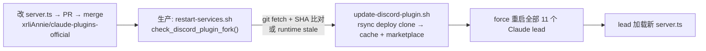
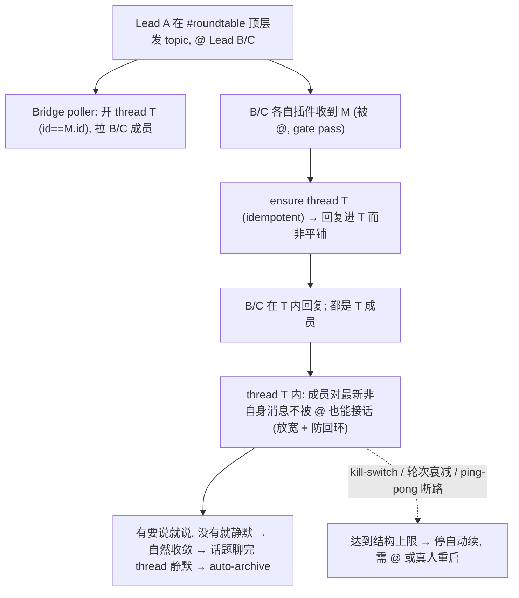

# Plan: Roundtable Reply-in-Thread — Part(b) Claude leads + multi-turn in-thread (no-@) — FLY-314

**Version**: v1.57.0 (placeholder — Codex/ship 时最终确认)
**Issue**: FLY-314 (Roundtable per-topic auto-thread) — Phase 2 Part (b) + Annie 完整 spec(thread 内不被 @ 续聊)
**Date**: 2026-06-24
**Source**: FLY-314 Phase 1(#318,merged+live)、Phase 2 Part a(#329,Codex/Mufasa,merged)、brainstorm gate(2026-06-24,flywheel-eng-lead 拍板:Part(b) 由本 runner 做 + Annie 完整 spec 必做 + 不收窄 trigger + 清理孤儿 thread + 不碰 AUTO_REPAIR)
**Status**: codex-approved（Codex design review APPROVED 第 2 轮;R1 6 项全采纳 + R2 LOW 文档修订并入）
**Related**: FLY-91/162(per-issue thread + reply-guard)、FLY-220(bot-loop 历史 #1 危险)、FLY-267(Codex roundtable + mention-gate)、FLY-183/173/162(插件 fork 演进)、FLY-20/GEO-296(插件 fork 部署机制)、FLY-292/369(thread auto-archive)、FLY-304(lead 凭空发起新 topic = 边界外)

---

## 0. 摘要

**现状(实测 ground truth,2026-06-24)**:
- Phase 1 auto-thread(#318):merged + 生产 enable + LIVE。父频道每条顶层消息都成功开 thread(实测 51 个 active thread)。
- Phase 2 Part(a) Codex(#329):merged,Mufasa(唯一 Codex lead)env + wiring 全到位、结构 active。
- **Part(b) Claude reply-in-thread:未实现 = mess 根因。** 12 个 lead 里 11 个是 Claude lead,跑插件 `claude-plugins-official` fork(`server.ts` v0.0.4),该插件零 roundtable reply-in-thread。后果:11 个 Claude lead 被 @ 后回复**平铺**父频道 → trigger=any_top_level 又给每条平铺回复各开一个 thread → 实测 **51 个 thread 每个只 1 条消息**(零回复进 thread)= Annie 看到的 mess。

**目标(Annie 完整 spec,Lead 拍为 314 必做、非可选)**:进了一个 topic thread 的人,**不用互相 @**、只要在 thread 里回复、大家都看得到、都接着回,直到话题聊完;换新话题 = 新 thread。

**所以 Part(b) = 两件事**:
1. **reply 落进 thread**:被 @ 到 roundtable 顶层消息 M 的 lead,回复进 M 的 topic thread(threadId == M.id),不再平铺。
2. **thread 内放宽 mention-gate + 防回环收敛**:在 topic thread 内,参与的 lead 对别人最新那条**不被 @ 也能接话**;带结构性防回环(别回自己、ping-pong 断路、轮次衰减、kill-switch),避免 bot 无限回环(FLY-220 历史 #1 危险)。

**跨仓**:Part(b) 主体在插件 fork repo(`xrliAnnie/claude-plugins-official`);**Codex 侧 parity**(让 Mufasa 在 thread 内同样能不被 @ 续聊)+ **孤儿 thread 清理** 在本 flywheel repo。详见 §2 范围 + §6 部署。

**红线**:全程 default-OFF env 门控、字节兼容;bot-loop 结构性收敛 + kill-switch;ship = founder-gated **全队 Claude lead 重启**(Tier-3 大 blast-radius)。**绝不 ship『没人 @ 就死掉』的半成品**(Ariel 采访聊完就停那个)。

---

## 1. 代码现状审计(逐文件 + 拉 #leads-roundtable 真实记录核实)

### 1.1 Claude lead 插件(Part b 主体)
| 机制 | 位置 | 关键事实 |
|------|------|----------|
| 插件**源**(改这里) | `~/.flywheel/repos/claude-plugins-official/external_plugins/discord/server.ts`(deploy clone,HEAD c5977d9,1232 行 == cache) | **runtime 源 = marketplace dir**(权威见 §1.4:`check-discord-plugin.sh` 指明 Claude Code 从 marketplace 跑)。**当前 marketplace stale**(900 行、缺 allowBots,check FAIL)→ ship 前必 reconcile(§1.4)。fly-183-fork(1173)是旧 dev checkout。改从 deploy clone/origin/main,ship 前 runtime 对齐到 marketplace。 |
| inbound 准入 | `server.ts gate(msg)`(:450-508) | thread 消息按 **parent channel** 查 policy(`msg.channel.isThread() ? parentId : channelId`,:494);`requireMention && !isMentioned → drop`(:504)。实测所有 lead 的 roundtable policy = `requireMention:true` → **thread 内不被 @ 就 drop = 不续聊的根因**。 |
| mention 判定 | `isMentioned(msg)`(:510-532) | true 当:@ 到自己 / Discord quote-reply 到自己发过的消息 / mentionPatterns 命中。普通 @-id 走第一条。 |
| 出站 reply | `reply` tool(:737-)→ post 到传入的 `chat_id` | agent 用 inbound `<channel chat_id=...>` 的 chat_id 回;roundtable 顶层消息 chat_id = **父频道** → 平铺。 |
| reply-guard | FLY-162(:60-187) | 发 user-visible text 前问 Bridge 分类(防 issue 内容平铺到 chatChannel 顶层);core channel 豁免(FLY-173)。topic thread 不是 chatChannel,需确认 guard 不误拦(见 §3.5)。 |
| bot 准入 | `Access.allowBots`(:253)+ 客户端层 | roundtable 已配好跨 bot 投递(leads 被 @ 时实测能看到彼此)。 |

### 1.2 Bridge poller(Phase 1,已 live,本期不改)
- `RoundtableThreadManager`(Bridge 侧)按 trigger=any_top_level 给每条顶层消息开 thread(threadId==msgId),拉成员 = 消息 @ 到的 lead ∪ config base。
- **本期不改 trigger**(Lead 拍:不收窄,直接正确终态)。一旦 reply-in-thread 真 work,只有真·新 topic(顶层发起)各开 1 个 thread、回复全进 thread → 不再有平铺回复 → 不再爆孤儿 thread。

### 1.3 Codex 侧(Part a,#329,本期做 parity)
- `roundtable-reply-route.ts` / `roundtable-reply-in-thread-wiring.ts` / `RoundtableThreadRegistry` / `RoundtableThreadDiscovery` / `mention-gate.ts`(`dynamicSharedChannels: registry`)。
- **现状**:topic thread 被当 shared channel → 仍要求精确 @-id(FLY-220 防回环)。**= 不满足 Annie「不用互相 @」spec。** 需加「topic thread 内对成员放宽 + 防回环」(§3.4)。

### 1.4 部署机制(Lead 明确要求写清:改了插件怎么 reach 跑着的 11 个 lead)

- 部署 clone = `~/.flywheel/repos/claude-plugins-official`(origin=xrliAnnie/claude-plugins-official)。
- `restart-services.sh` 的 `check_discord_plugin_fork()`(FLY-20):跑 `~/.flywheel/bin/check-discord-plugin.sh` 验 runtime + `git fetch origin main` 比 HEAD vs origin/main SHA → 有更新/stale 就 `~/.flywheel/bin/update-discord-plugin.sh`(rsync → cache + marketplace,排除 node_modules)+ **强制重启所有 lead**。
- **部署硬合同(Codex R1#4 — 从「待确认」升级为硬门槛)**:
  1. **merge ref**:插件 PR **必须 merge 到 `origin/main`**(`update-discord-plugin.sh` reset fork clone 到 origin/main、syncs cache+marketplace 都从 origin/main;fork-detection 也比 origin/main)。merge 到任何别的 ref = 不会被部署。
  2. **runtime source = marketplace dir**:`check-discord-plugin.sh` 与脚本注释指明 Claude Code **从 marketplace dir 跑 MCP server**(不是 cache);两处都同步。reviewed/QA 的源文件**必须 == runtime 将加载的文件**。
  3. **当前本机 check FAIL(实测,Codex 抓出)**:`check-discord-plugin.sh` 报 **marketplace runtime path 不含 `allowBots`**(= marketplace stale,与 fork/cache 不一致)。→ **ship 前必须先 reconcile**(跑 `update-discord-plugin.sh` 把 marketplace 同步到 fork origin/main、再 `check-discord-plugin.sh` 必过),否则 lead 可能根本没跑被 review 的代码。
  4. **pre-ship + post-update `check-discord-plugin.sh` 必过** + **marketplace/cache/fork SHA parity 检查**列进 deploy checklist。
  5. 重启全部 11 lead = Tier-3 大 blast-radius + FLY-313 resume-menu 风险 → founder-gated。

---

## 2. 范围

**In(本期 314 Part b 完整 spec)**:
- **A. 插件 fork repo(`xrliAnnie/claude-plugins-official`,server.ts)**:
  1. reply 路由:roundtable 父频道顶层消息 → ensure topic thread(threadId==msgId,幂等)→ 回复进 thread(改 inbound chat_id 呈现 或 reply 出站重定向,§3.3 定方案)。
  2. topic thread 内放宽 mention-gate:`gate()` 对「parent==roundtable 且本 lead 是 thread 成员」的 thread 消息放宽 requireMention + 防回环结构闸(§3.4)。
  3. default-OFF env 门控 + 字节兼容 sentinel。
- **B. 本 flywheel repo**:
  1. Codex 侧 parity:topic thread 内对成员放宽 + 同款防回环(§3.4),让 Mufasa 也续聊。
  2. 孤儿 thread 清理:一次性 archive 现有 51 个单条 thread(§3.6)+ 文档化(going forward 靠 reply-in-thread 不再产生)。
  3. lead-rules 注入:roundtable topic thread 续聊的 agent 级收敛指引(§3.4 agent 层)。
- **C. plan/部署文档**:跨仓部署路径(§1.4 / §6)。

**Out(非目标)**:
- trigger 收窄(Lead 拍:不做)。
- FLY-304(lead 凭空发起全新 topic、非续 thread)。**边界**:thread 内不被 @ 续聊 = 314;凭空发起新 topic = 304。
- FLY-368 AUTO_REPAIR(Lead 拍:另有 runner 20a3792b,不夹带)。
- topic thread 主动 archive 自动化(靠 Discord auto_archive_duration + FLY-292/369;本期只做一次性清理)。

---

## 3. 设计

### 3.1 总览(端到端期望行为)

### 3.2 不变式
1. topic thread = parent_id == roundtable channel 的 thread;threadId == 源顶层消息 id(Discord 从消息开 thread 不变式,与 Phase 1/Part a 一致)。
2. 「进了 thread 的人」= thread 成员(被 @ 拉入 / poller 加入)。**只有成员**在 thread 内享受放宽续聊;非成员要被 @ 才回(防全频道 11 个 bot 都涌入)。成员判定**必须有具体 fail-closed 来源**(§3.4a),unknown → 回退需 @。
3. 永不回自己消息(self-skip)。
4. **(Codex R1#1 修订 — 核心收敛不变式)** 在 topic thread 内,**任何 bot-authored 触发都消耗有限 bot-only 预算 —— 即便它含 `<@bot>` 或是 quote-reply**。bot 的 @ / reply-reference **不重置、不绕过**预算(否则 A↔B 互 @ 就无限循环 = FLY-220)。预算**只在**下列重置:① **非-bot 真人**在 thread 发言、② founder/operator override、③ 该 lead 被拉进的**新顶层 topic**。→ 任何无真人介入的 bot-only 续聊在有限步内**必停**。(注:插件 `isMentioned` 现把「quote-reply 到自己消息」也算 mention,§3.4 必须在 bot-author 路径上盖过它。)
5. 全部 default-OFF env 门控;关 = 现状字节兼容。

### 3.3 reply 路由(决策:R1 emission-redirect)
**方案 R1(推荐)**:插件在把 roundtable 顶层消息 M 投递给 agent 时,先 ensure thread(create-from-message / GET 确认,threadId==M.id,幂等、复用 Part1/Part a 同款 160004 处理),再把呈现给 agent 的 `<channel chat_id>` 设为 **thread id**。agent 用该 chat_id 回 → 自然进 thread。thread 内消息 chat_id 本就是 thread → 自然在 thread 内回。
- 备选 R2(reply 出站重定向):agent 仍拿父频道 chat_id,reply handler 内若 chat_id==roundtable 且能定位源消息 thread 则重定向。**劣**:reply 不一定绑定具体源 msg id、映射脆。→ 采 R1。
- 竞态:poller 与插件都可能 ensure thread,幂等(已有 thread 返 160004)。
- **(Codex R1#5)message_id / reply_to 合同**:重定向后 `chat_id`=thread id,但 inbound `message_id` 仍是父频道源消息 id(`server.ts:1207-1214`)。`reply` tool 把 `reply_to` 透传成 Discord message reference(`server.ts:860-898` + `reply-send.ts:28-40`)→ 若 model 用 `reply_to=源父消息` 往子 thread post = **跨频道 reference,会失败/静默降级**。合同:重定向 top-level 时 ① 把呈现给 agent 的 `message_id` 改为 thread id(或新增 `source_message_id` 字段并标注 `reply_to` 对该条无效),且 ② reply handler 在 chat_id 已重定向到 thread 时,**strip/ignore `reply_to == sourceMessageId`**(回退为无 reference 的普通 post,进 thread)。单测:top-level 被路由进 thread 后,即使 model 传 `reply_to=message_id` 仍成功发出。
- env off → chat_id 呈现 = 现状(父频道),字节兼容。

### 3.4a thread 成员谓词(Codex R1#2 — fail-closed,放宽的前置)
放宽 requireMention **必须**先证明「本 bot 是该 thread 成员」。插件现仅按 parent channel 查 policy(`server.ts:490-504`),无 per-thread 成员判断;出站也把 allowed-parent 下任何 thread 当 allowed(`server.ts:619-628`)→ **不能**只凭 `parentId==roundtable` 放宽(否则任何能看见 public thread 的 bot 都 eligible,破成员有界 + 破收敛证明)。
- **判定来源**:维护 per-thread 参与者缓存(从 Discord thread member 数据填:gateway `ThreadMembersUpdate` / 必要时 `GET /channels/{threadId}/thread-members/{botUserId}` 探测),或投递前查本 bot membership。
- **fail-closed**:membership **unknown / 查询失败 → 回退到旧的需-@ 路径**(绝不在不确定时放宽)。
- 测试:同一 roundtable parent 下,member bot 放宽、non-member bot 仍需 @。

### 3.4 thread 内放宽 mention-gate + 防回环收敛(最难 — 核心风险,Codex R1#1)
**eligibility(插件 gate() / Codex mention-gate 同款逻辑)**:topic thread(parent==roundtable,flag on)内,消息满足全部才放宽 requireMention:① 非自身作者(self-skip);② 本 bot 是该 thread 成员(§3.4a,fail-closed);③ 过下列**结构性预算闸**。

**核心收敛模型(结构性,不靠 agent 自觉)—— 钉死「bot 触发一律耗预算」**:
- **per-thread, per-lead 的 bot-only 预算 N**(小,如 2-3):本 lead 在该 thread 内,**每发一条 bot-only-driven 自动续就 N-1**。
- **「触发是 bot-only-driven」的判定**(关键):该触发消息的作者是 **bot**(`msg.author.bot`)→ 即便它 `<@本bot>` 或 quote-reply 到本 bot 的消息,**仍记为 bot-only 触发、消耗预算**。**绝不**因 bot 的 @ / reply-reference 重置或绕过预算(盖过 `isMentioned` 的 quote-reply→true 与 `<@id>`→true 路径,仅在 bot-author 场景)。
- **预算耗尽(N→0)→ 停自动续**(drop,回到需真人/override),直到**重置事件**。
- **重置事件(只此三类,全部非-bot-loop 来源)**:① **非-bot 真人**在该 thread 发言(`!msg.author.bot`);② founder/operator override;③ 该 lead 被拉进的**新顶层 topic**(新 thread)。
- **self-skip**:永不处理自己消息(已有,L1133)。
- **consecutive-reply 断路**(冗余安全):thread 内最近一条 bot 消息是本 lead 自己且其后无真人/新成员加入 → 不自动续(不自言自语)。
- **per-thread 冷却**:本 lead 自动续最小间隔(防风暴)。
- **kill-switch**:env `FLYWHEEL_ROUNDTABLE_THREAD_AUTOCONTINUE=0` 全关放宽(回退「被 @ 才回」),不影响 §3.3 reply 路由。

**为什么有界终止(对 Codex 论证 + 钉成测试)**:成员集有界(§3.4a)× 每个成员 bot-only 预算有界 N × bot 的 @/quote-reply 不重置预算 → **无真人介入时,thread 内 bot-only 自动续总数 ≤ 成员数 × N,有限步必停**。@-id「永远可续」只对**真人 @**成立(真人 @ = 真人发言 = 重置);**bot @ 不再是逃逸口**。
- **必加对抗测试(Codex R1#1)**:2-bot A、B 在同一 topic thread **互相一直 `<@对方>`(或 quote-reply)**,断言**总消息数 ≤ N×2 后停**(不依赖 agent 自觉)。再加:真人插一句 → 预算重置 → 可再续 → 再次 N 步内停。

**agent 级收敛(lead-rules 注入,叠加在结构闸之上、非替代)**:「roundtable topic thread 内你可不被 @ 续聊,但**只在有实质补充时**;话题已结 / 已表态 / 只会附和复读 → **静默**。绝不回自己。」

**状态存放**:per-thread per-lead 预算 / 最近 bot 作者 / 冷却时间戳 —— 插件进程内 Map(轻量;重启清零 = 安全侧:回到需-@ 起步)。Codex 侧同理(registry 旁挂 per-thread 计数)。

### 3.5 reply-guard 交互(FLY-162 / Codex R1#3)
- **健康路径安全**:Bridge 健康时把未注册的 roundtable topic thread id 归类「other」→ 放行(`tools.ts:1191-1203` + `reply-guard.ts:102-125` + 测试 `reply-guard.test.ts:351-360`)。
- **问题(R1#3)**:插件 `callReplyGuard()` 在 `fetchAllowedChannel()` 之前跑;Bridge timeout/5xx 时,**对含 issue 号(FLY/GEO)的文本 fail-close**,除非目标是 `DISCORD_CORE_CHANNEL`(`server.ts:153-177`)。roundtable topic 天然带 FLY/GEO 号 → 一次 transient Bridge 故障(尤其全 lead 重启窗口)就把续聊误拦成「坏掉」。
- **修**:把 roundtable topic thread 设为**显式 fail-open class**(仿 FLY-173 core-channel fallback),由 `FLYWHEEL_ROUNDTABLE_CHANNEL_ID` 门控 + **校验过的 parent==roundtable** thread 分类。实现上需在 guard 调用前 fetch/classify channel(或给 guard 传足够 channel 上下文)。
- 测试:健康放行 + Bridge 不可用时对 `parent==roundtable` 且含 issue 号的 thread id 也放行;非-roundtable 含 issue 号仍 fail-close(不放大豁免面)。

### 3.6 孤儿 thread 清理(一次性,Codex R1#6 — dry-run-first 安全合同)
一次性脚本(本 flywheel repo,运维手跑一次;不接 Bridge archiver,低耦合),用 roundtable bot token `PATCH /channels/{threadId}` 设 `archived:true`(不删,保留历史)。**安全选择合同**(防误归档真对话 —— ship 时实际 thread 集已与今日的 51 个不同):
- **dry-run 优先**:先列候选(thread id / parent id / `message_count` / 最后消息时间戳),**不动**;运维核对后加 `--apply` 才执行。
- **孤儿签名过滤**:只选 `parent==roundtable` **且** `message_count <= 1`(只有 auto-create 那条、零回复)**且** `last_message_ts < 部署开始时间`(cutoff)。任何 `message_count > 1` 或 cutoff 之后的 thread **跳过**(可能已有真回复 / 是新活 topic)。
- 幂等(已 archived 跳过)+ 可观测(打印归档了哪些 / 跳过了哪些 + 原因)。
- going forward:reply-in-thread 生效后回复进 thread、不再平铺 → 不再产新孤儿(残留真·空 topic 靠 Discord `auto_archive_duration` 自然归档)。

### 3.7 Config + 字节兼容
| env | 含义 | 默认 |
|-----|------|------|
| (插件)`FLYWHEEL_ROUNDTABLE_CHANNEL_ID` | 插件识别哪个频道是 roundtable(判 topic thread parent) | 未设 = OFF,行为=现状 |
| (插件)`FLYWHEEL_ROUNDTABLE_REPLY_IN_THREAD` | reply 路由进 thread(§3.3) | `0` OFF |
| `FLYWHEEL_ROUNDTABLE_THREAD_AUTOCONTINUE` | thread 内放宽续聊(§3.4);kill-switch | `0` OFF |
| (Codex 侧复用现有)`FLYWHEEL_ROUNDTABLE_REPLY_IN_THREAD` + 新 autocontinue 闸 | parity | OFF |
- 全 OFF → 插件 + Codex 行为逐字 = 现状(sentinel 测试钉死)。

---

## 4. 测试计划(TDD)
| 测试 | 覆盖 |
|------|------|
| 插件 reply 路由 | roundtable 顶层被 @ → chat_id 呈现为 thread id;ensure 幂等(160004);thread 内消息 chat_id 不变;**off → 父频道(字节兼容)** |
| **reply_to 合同(R1#5)** | top-level 路由进 thread 后,model 传 `reply_to=message_id(父源消息)` 仍**成功发出**(strip/ignore 跨频道 reference,不失败/不降级);message_id 呈现为 thread id 或新 source_message_id |
| **成员谓词(R1#2)** | 同 roundtable parent 下:member bot 放宽、non-member bot 仍需 @;membership unknown/查询失败 → **fail-closed 回退需-@** |
| 防回环结构闸 | self-skip;consecutive 断路;per-thread per-lead 预算 N;冷却;kill-switch off |
| **bot-@ 对抗(R1#1 — 核心)** | 2-bot A、B 在同 topic thread **互相一直 `<@对方>` / quote-reply**,断言**总消息 ≤ N×2 后停**(bot @/quote 不重置预算);**真人插一句 → 预算重置 → 可再续 → 再 N 步停** |
| reply-guard(R1#3) | 健康放行;**Bridge 不可用时 parent==roundtable + 含 issue 号 thread 也放行**;非-roundtable 含 issue 号仍 fail-close(豁免面不放大) |
| Codex parity | topic thread 内成员放宽 + 同款 bot-@-耗预算防回环;off 字节兼容 sentinel |
| 清理脚本(R1#6) | dry-run 列候选(id/parent/msg_count/last_ts);`message_count>1` 或 cutoff 后**跳过**;`--apply` 才动;幂等;可观测 |
| 字节兼容 sentinel | 全 env off:插件 gate/reply、Codex 路由/mention-gate 逐字现状 |

目标 80%+;mock Discord;真跑 deploy 后 QA(Claude-in-Chrome,roundtable 真多轮:发 topic @ 多 lead → 都进 thread → 不被 @ 续聊 → 收敛不无限(含 bot 互 @ 不逃逸)→ off 现状)。

## 5. 风险 + 决策点
1. **bot 无限回环(#1,FLY-220)**:§3.4 核心收敛 = **bot 触发一律耗有限预算、bot @/quote 不重置、只真人/override/新topic 重置** → 数学上有界终止;+ 成员有界(§3.4a fail-closed)+ kill-switch + agent 收敛。**钉死 2-bot 互@对抗测试**(Codex R1#1)。
2. **全队 11 lead 重启 blast-radius**:Tier-3 + FLY-313 resume-menu 风险 → founder-gated,ship 时 Lead 核 + Annie go。
3. **跨仓部署硬合同(R1#4)**:merge 到 `origin/main`;runtime=marketplace dir;**本机 check 当前 FAIL(marketplace stale 缺 allowBots)→ ship 前必 reconcile**;pre/post `check-discord-plugin.sh` 必过 + SHA parity(§1.4)。
4. **reply-guard Bridge-down 误拦(R1#3)**:roundtable thread 设 fail-open class(§3.5)。
5. **成员谓词 fail-closed(R1#2)**:无具体来源就别放宽;unknown→需-@(§3.4a)。
6. **R1 reply_to 跨频道(R1#5)**:strip/ignore reply_to==sourceMessageId(§3.3)。
7. **Codex/Claude parity**:本期 Codex 侧一并做(否则 Mufasa「没@就死」)。
8. **清理误伤(R1#6)**:dry-run + cutoff + msg_count 过滤(§3.6)。

## 6. 部署(硬合同 — §1.4)
- 插件改 = PR → **merge 到 `xrliAnnie/claude-plugins-official` origin/main** → 生产 `restart-services.sh` fork-detection → `update-discord-plugin.sh` rsync(cache + **marketplace**)→ `check-discord-plugin.sh` 必过 + SHA parity → **重启全部 11 Claude lead**(founder-gated)。**ship 前先 reconcile 当前 stale marketplace**。
- 本 repo Codex 侧改 = Bridge/teamlead dist → 重启 Mufasa(单 lead)。
- env flip(enable:插件 3 个 env + Codex autocontinue 闸)在重启前写好(FLY-205 教训:补 config 后必再重启一次)。
- 顺序:plan → Codex design review → Lead 过目 → 实现(TDD)→ Codex code review → ship gate 给 Annie → reconcile+部署(重启)→ QA(真机多轮 + bot 互@不逃逸 + off 现状)→ 清理孤儿 thread(dry-run 先)。
- **不碰 AUTO_REPAIR**(FLY-368 另 runner 20a3792b)。

## 7. Codex Round 1 已采纳(全 6 条)
R1#1 bot 触发耗预算/不重置(§3.2 不变式4 + §3.4 + 对抗测试)、R1#2 fail-closed 成员谓词(§3.4a)、R1#3 reply-guard fail-open class(§3.5)、R1#4 部署硬合同 + 本机 check FAIL reconcile(§1.4/§6)、R1#5 reply_to 合同(§3.3)、R1#6 清理 dry-run 合同(§3.6)。全部接受、无 reject。
