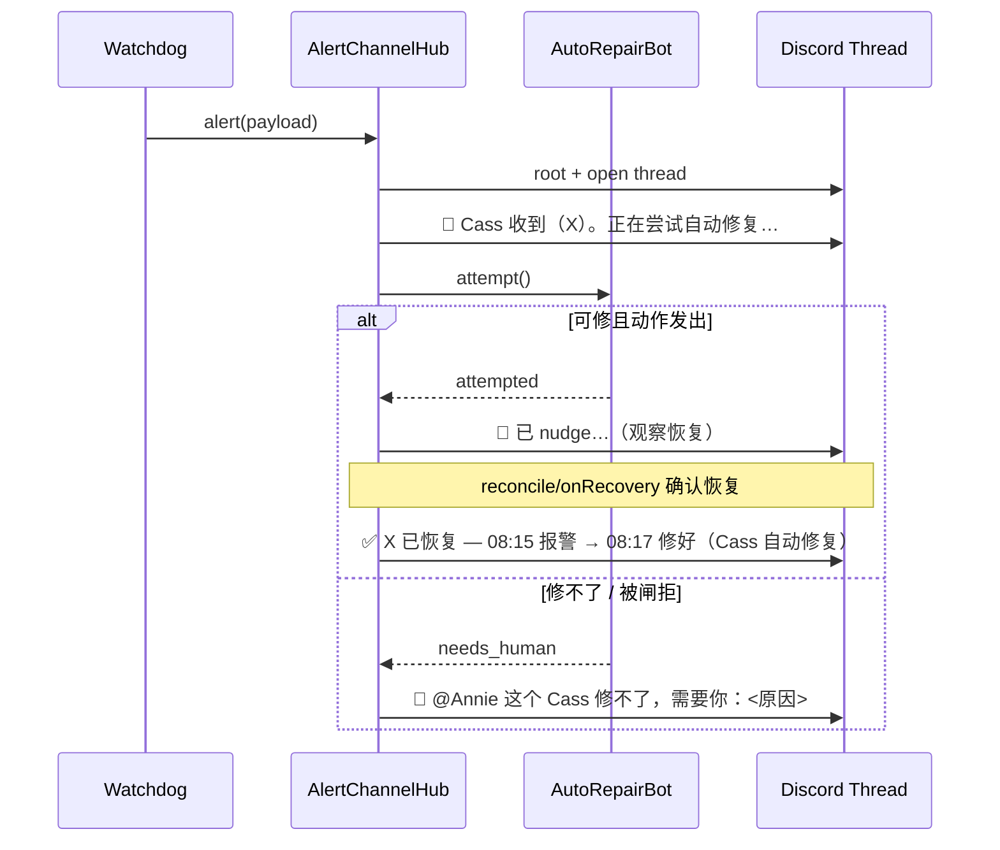

# Plan: FLY-368 收尾 — AUTO_REPAIR=ON 路径措辞 + 行为理顺

**Version**: v1.58.0（Lead 原批 v1.56.0，但 v1.56.0/v1.57.0 已被既有 plan 占用 → 取下一空号 v1.58.0；待 Lead 确认）
**Issue**: FLY-368 (统一 Alert Channel + 自动修复 Bot)
**Date**: 2026-06-24
**Source**: `doc/engineer/plan/inprogress/v1.55.0-FLY-368-unified-alert-channel-autofix-bot.md`（已 merge 的主特性 #327/#330）
**Status**: codex-approved（Codex design review Round 1 APPROVED，4 条 LOW guardrail 已 fold 入下文）

---

## 1. Problem & Goal

主特性（统一 alert channel + per-error thread + Cass 保守自动修复）已 merge（#327/#330）+ QA PASS（FLY-526），**但 QA 是在 `FLYWHEEL_AUTO_REPAIR=OFF` 下测的**。Annie 2026-06-24 提出收尾要求（一次做完，不分 phase）:

1. **措辞 + 行为**: 不要「等待人工」这种被动话。要 → 检测到 X 坏 → **Cass 先自己尝试修** → 修好了在频道同步「X 几点坏、几点修好」; **只有 Cass 修不了的才 @Annie**。把 `AUTO_REPAIR=ON` 路径理顺（Cass「修复中 → 修好了 / 修不了 @Annie」，不再 premature「等待人工」）。
2. **打开 `FLYWHEEL_AUTO_REPAIR=1`**（需重启 Bridge/Cass）—— runner 不自己 flip，本 plan 出「影响评估 + 部署步骤」给 Lead，由 Lead 递 Annie informed-approval gate。

**Goal**: `AUTO_REPAIR=ON` 时，每条 alert 的 thread 读起来是一个连贯的 Cass 故事 ——「收到 → (能修则)修复中 → 修好了(带 坏/修 时间) / (修不了则)真 @Annie」。无 premature 被动语。

---

## 2. Current Behavior（已审计）

`AUTO_REPAIR=ON` 时 `AlertChannelHub.handle()` 对每条 alert:

1. root 告警 POST 到统一频道（`LeadAlertNotifier`，可靠锚点）。
2. 开 thread。
3. **ack**（`AlertChannelHub.ts:267`）: `🔧 收到（<title>）。正在尝试安全自动修复…`（bot 在 → 这句；bot 不在 → 「等待人工处理。」）。
4. `autoRepairBot.attempt()`:
   - 可修 kind（`runner_stuck_unhandled` 带 fingerprint / `pane_hash_stuck`）→ 发 nudge/Enter → `attempted` → thread 发「🔧 已 nudge…」→ `repair_status=attempted`。
   - 不可修 kind（rate/usage/login/permission/crash、未知、或被安全闸拒）→ `needs_human` → thread 发「🙋 需要 Annie：<原因>」→ `repair_status=needs_human`。
5. 后续 reconcile/onRecovery 确认恢复 → `resolve()` 发「✅ 已恢复 HH:MM」+ archive。

### 三处与 Annie 诉求不对齐

| # | 问题 | 位置 |
|---|------|------|
| **P1** | ack 无差别先说「正在尝试安全自动修复…」，但 rate_limit 等 Cass 根本不碰的 kind 紧接就「🙋 需要 Annie」—— 先吹「在修」再立刻甩人 = premature/被动感的根 | `AlertChannelHub.ts:267` |
| **P2** | resolve 只发「✅ 已恢复 HH:MM」，缺 Annie 要的「几点坏 → 几点修好」时间线（`opened_at` 已存表，可取） | `AlertChannelHub.ts:298` |
| **P3** | 「需要 Annie」只是文字、没真 @。真正 ping（severe DM）在 notifier 层按 severity 发，跟「Cass 能不能修」无关 → 与「只有修不好才 @我」不对齐 | `AutoRepairBot.ts:103/116/139/165` |

---

## 3. Design — 只动 Hub + Bot 的措辞/行为（最小改动）

四块改动 A/B/C/D，**只碰** `AlertChannelHub.ts` + `AutoRepairBot.ts`（+ 各自单测）。**不碰** AutoRepairBot 的安全闸/动作集、不碰 notifier 的 severe-DM 排序。

### A. ack 按 kind 诚实化（治 P1）

`AutoRepairBot` 加**纯谓词**，与 `attempt()` 的 switch **共用同一真相源**（Codex LOW-1：避免未来加动作时两处漂移导致 ack 又说谎）:

```ts
/** 单一真相源：本 bot 会真尝试自动修复的 kind。canAttempt() 与 attempt() 都引用它。 */
const AUTO_ATTEMPT_EVENT_TYPES: ReadonlySet<AlertPayload["eventType"]> = new Set([
  "runner_stuck_unhandled",
  "pane_hash_stuck",
]);

/** 本 bot 是否会对该 kind 真尝试自动修复（无副作用，供 Hub 措辞 ack）。 */
canAttempt(eventType: AlertPayload["eventType"]): boolean {
  return AUTO_ATTEMPT_EVENT_TYPES.has(eventType);
}
```

> `attempt()` 的 switch 保留（它要按 kind 走不同动作 + 提取 metadata），但其「哪些 kind 会尝试」的判断与 `canAttempt` 同源于 `AUTO_ATTEMPT_EVENT_TYPES`（switch 的 default 分支 = 不在该 set 内 → needs_human）。加 1 个测试断言两者对所有 kind 一致。

`AlertChannelHub.openOrReplaceThread()` 的 ack 改为按「bot 在不在 + 该 kind 能不能修」分三态:

| 状态 | ack |
|------|-----|
| bot 在 + 可修 kind | `🔧 Cass 收到（<title>）。正在尝试自动修复…` |
| bot 在 + 不可修 kind | `🔧 Cass 收到（<title>）。`（紧跟的 needs_human 结果行会真 @Annie，见 C —— ack 不再吹「正在修」） |
| bot 不在（OFF 路径） | `🔧 Cass 收到（<title>）。自动修复未启用，需要 Annie。`（治 D，替掉「等待人工处理。」） |

> ack 保留子串「收到」（现有测试 `AlertChannelHub.test.ts:74` 断言 `toContain("收到")` 不破）。

### B. resolve 带「坏 → 修好」时间线（治 P2）

`resolve()` 改用 `formatResolved(row)`，从 active 行取 `opened_at`（= 报警/检测时刻）+ `now`（修好时刻）+ `repair_status` 归因:

```ts
private formatResolved(row: AlertThreadRow): string {
  const broke = this.localHHMM(row.opened_at);     // SQLite UTC → 本地 hh:mm
  const fixed = this.hhmm();
  const what = `${row.lead_id} ${row.event_type}`;
  // 仅 Cass 真动手（attempted）才归功 Cass；自愈 / 无 bot / needs_human 不冒认。
  return row.repair_status === "attempted"
    ? `✅ ${what} 已恢复 — ${broke} 报警 → ${fixed} 修好（Cass 自动修复）。`
    : `✅ ${what} 已恢复 — ${broke} 报警 → ${fixed} 恢复。`;
}

/** SQLite datetime('now')（UTC，无时区后缀）→ 本地 hh:mm；复用全仓既有模式。 */
private localHHMM(sqliteUtc: string): string {
  const d = new Date(`${sqliteUtc.replace(" ", "T")}Z`);
  if (Number.isNaN(d.getTime())) return "??:??";
  return `${String(d.getHours()).padStart(2, "0")}:${String(d.getMinutes()).padStart(2, "0")}`;
}
```

> - 保留子串「已恢复」（现有测试 `:152`/`:231` 断言 `includes("已恢复")` 不破）。
> - `localHHMM` 复用全仓既有 UTC→local 模式（`new Date(\`${ts.replace(" ", "T")}Z\`)`，见 `HeartbeatService.ts:179` 等多处）。
> - stale-thread 取代路径（`openOrReplaceThread` 内「↪️ 取代为新 incident」）**不**走 `resolve()`，不受影响。

### C. 只在 needs_human 真 @Annie（治 P3）

**Bot 侧**: needs_human 的 `detail` 改成**只含原因**（不再自带「🙋 需要 Annie：」前缀；由 Hub 统一加 @）:

| 场景 | 旧 detail | 新 detail（reason-only） |
|------|-----------|--------------------------|
| rate/usage/login/permission/crash/unknown | `🙋 需要 Annie：<reason>` | `<reason>`（`HUMAN_ONLY_REASON` 文案不变） |
| runner 缺 fingerprint | `🙋 需要 Annie：stuck-runner alert lacks…` | `stuck-runner alert 缺结构化 fingerprint，拒绝盲目 nudge。` |
| nudge 被闸拒 | `🙋 需要 Annie：runner nudge 被安全闸拒绝（<err>）。` | `runner nudge 被安全闸拒绝（<err>）。` |
| lead resume 被拒 | `🙋 需要 Annie：<outcome.reason>` | `<outcome.reason>` |

> 现有 bot 测试断言 `toContain("fingerprint mismatch")`、`toContain("resume-menu")` 仍成立（原因子串保留）。

**Hub 侧**: `DiscordOps.postToThread` 加可选 `opts`，allowed_mentions 据此切换:

```ts
postToThread(threadId: string, content: string, opts?: { mentionUserId?: string }): Promise<void>;
// createDiscordOps 内: allowed_mentions = opts?.mentionUserId ? { users: [opts.mentionUserId] } : { parse: [] }
```

needs_human 结果行真 @:

```ts
if (repair.outcome === "needs_human") {
  const fid = this.founderId();                       // env FLYWHEEL_FOUNDER_DISCORD_USER_ID（trim，空→undefined）
  const mention = fid ? `<@${fid}>` : "Annie";        // 未设 → 退化纯文字「Annie」，不报错
  await this.safePostToThread(
    threadId,
    `🙋 ${mention} 这个 Cass 修不了，需要你：${repair.detail}`,
    fid ? { mentionUserId: fid } : undefined,
  );
} else {
  await this.safePostToThread(threadId, repair.detail); // attempted：原样发，永不 ping
}
```

- `founderId()` **每次调用**读 env（与全仓「call-time resolve」一致；env 可变）+ **校验 snowflake 形态**（Codex LOW-2：present 但格式非法的 env 会让 Discord 拒整个 `allowed_mentions.users` body、丢掉 needs_human 那行）:

```ts
private founderId(): string | undefined {
  const id = process.env.FLYWHEEL_FOUNDER_DISCORD_USER_ID?.trim();
  return id && /^\d{17,20}$/.test(id) ? id : undefined;  // 仅接受 Discord snowflake；否则退化纯文字
}
```

- **attempted / resolved 永不 @ping**（只有 needs_human ping）。
- 现有测试 `createDiscordOps:269`（`postToThread("t","@everyone hi")` 断言 `{ parse: [] }`）不传 opts → 仍 `{ parse: [] }`，不破。

### D. OFF 路径措辞（见 A 第三态）

bot 不在时 ack 由「等待人工处理。」改为「自动修复未启用，需要 Annie。」—— Annie 看到的那句被动话被替掉。OFF 路径**仅改文字、不加真 ping**（OFF 非目标态，是降级/过渡态；真 ping 留给 ON 路径的 needs_human，避免 OFF 模式每条都 ping 的噪音）。

### Thread 生命周期（ON 路径，可修 kind）



---

## 4. Test Plan（TDD：先 RED）

> 测试 double `makeDiscord().posts` 升级为 `[threadId, content, opts]`（Codex LOW-3：mention 安全合同现在部分在第三参里 —— needs_human 带 `{ mentionUserId }`、attempted/resolved/default 不带）。保留现有 `收到`/`已恢复`/`fingerprint mismatch`/`resume-menu` 子串断言。

### `AutoRepairBot.test.ts`（新增）
- `canAttempt` 对 `runner_stuck_unhandled` / `pane_hash_stuck` 返 true；对 rate_limit/usage_limit/login_expired/permission_blocked/crash_loop/unknown 返 false。
- **`canAttempt` 与 `attempt()` 结果一致性**（Codex LOW-1）：遍历所有 kind，`canAttempt(k)===false` 的 kind `attempt()` 必返 `needs_human`、`action:"none"`（runner_stuck 带合法 fingerprint 与 pane_hash_stuck 为可尝试侧）。
- needs_human 的 `detail` **不含**「需要 Annie」前缀（已变成 reason-only）；仍含对应原因子串（回归保护现有断言）。

### `AlertChannelHub.test.ts`（新增/改）
- bot 在 + 可修 kind（pane_hash_stuck）→ ack 含「正在尝试自动修复」。
- bot 在 + 不可修 kind（rate_limit）→ ack **不含**「正在尝试」；needs_human 结果行含真 mention `<@<id>>`（设了合法 `FLYWHEEL_FOUNDER_DISCORD_USER_ID`）且该 post 带 `opts.mentionUserId`。
- 未设 / 格式非法的 founder env → needs_human 行退化为纯文字「Annie」、`postToThread` 不带 `mentionUserId`（Codex LOW-2 的形态校验）。
- bot 不在 → ack 含「自动修复未启用，需要 Annie」、不含「等待人工」。
- attempted 结果行 **不**带 `mentionUserId`（永不 ping）。
- resolve（`repair_status=attempted`）→ 含「已恢复」+「报警」+「修好」+「Cass 自动修复」+ 正确 hh:mm（注入 `now` + 已知 `opened_at`）。
- resolve（`repair_status` 非 attempted，如自愈）→ 含「已恢复」+「恢复」、**不含**「Cass 自动修复」。
- **stale 取代回归**（Codex LOW-4）：扩展现有「不同 `event_id`」用例，断言 `↪️ 取代为新 incident` 那条 post **不含** `已恢复` / `修好` / `Cass 自动修复`（refactor `formatResolved` 时不糊到 stale 路径）。

### `createDiscordOps`（新增）
- `postToThread(id, content, { mentionUserId })` → body `allowed_mentions = { users: [id] }`；不传 opts → `{ parse: [] }`（回归）。

> 全程 `pnpm --filter @flywheel/teamlead test` + 全仓 `pnpm lint`（biome）在 push 前跑（memory: 两次 CI 第一轮挂 biome format 的教训）。

---

## 5. Byte-compat / Blast Radius

- 改动文件: `AlertChannelHub.ts`、`AutoRepairBot.ts`（+ 两个单测文件）。
- **OFF/legacy 路径**（`FLYWHEEL_AUTO_REPAIR` 未开 / Hub 未启用）: 行为不变（仅 OFF ack 文字微调，见 D），threading/reconcile/resolve 时间线对 OFF 也生效（纯增强）。
- `DiscordOps.postToThread` 第三参可选 → 现有调用点全部兼容。
- 不动: notifier severe-DM、安全闸、动作集、StateStore schema（`opened_at`/`repair_status` 早已存在）。

---

## 6. Part 2 — 打开 `FLYWHEEL_AUTO_REPAIR=1`（影响评估 + 部署步骤，给 Lead 递 Annie）

> **runner 不自己 flip**。以下供 Lead 组织 informed-approval gate。

### 6.1 这步做什么
在生产 Bridge 的 env（`~/.flywheel/.env` 或对应 launchd plist）加 `FLYWHEEL_AUTO_REPAIR=1` → 重启 Bridge。之后 Cass 才会对 alert 真动手（此前只报「自动修复未启用，需要 Annie」）。前置 `FLYWHEEL_UNIFIED_ALERT_CHANNEL_ID` + `FLYWHEEL_ALERT_THREADS=1` 在 FLY-526 QA 时已是 ON（threading 已验过）。

### 6.2 阻断半径（保守）
Cass 开了之后**只会做两个安全可逆动作**（= Annie/CoS 现在手动就在做的）:
- `runner_stuck_unhandled`（带结构化 fingerprint）→ 给 runner 发一次 `continue`（走全部 5 道 audited 安全闸 + audit-before-send）。
- `pane_hash_stuck` 且 pane 是 **resume 菜单**精确形态 → 给该 Lead pane 发一个 `Enter`。

**绝不**自动重启/杀 Lead 或 Runner、close-tmux/close-runner、批权限 prompt、碰 compact 框 —— 这些仍 founder-gated（FLY-175）。rate/usage/login/permission/crash 仍诚实「转 Annie」并真 @。

### 6.3 风险 & 缓解
- 误 nudge: nudge 走 fingerprint 匹配 + status running + 无 pending gate/review + idle input 共 5 闸，且 audit-before-send（写不了审计就不发）。误判概率低、动作可逆（一个 continue）。
- 误 Enter: 仅 `freeze-resume-menu` 精确形态（真 fixture 背书），不打文本、只发 Enter。
- 噪音: per-error thread + 报一次（active-mapping 去重），不刷屏。

### 6.4 部署步骤
1. env 加 `FLYWHEEL_AUTO_REPAIR=1`（先改 config 再重启 —— memory: launchd KeepAlive 会自动重起 Bridge，必须先落 config）。
2. 精准重启 Bridge（按 port + run-bridge 进程树，不裸 pattern kill —— FLY-239/memory 教训；不误杀 QA-slot worktree bridge）。
3. 验证 boot log: `[Bridge] FLY-368 AlertChannelHub ON (… auto-repair=ON)`。

### 6.5 回滚
去掉 `FLYWHEEL_AUTO_REPAIR=1`（或设 `=0`）→ 重启 Bridge。Cass 立刻回到「只报不修」。零迁移、零状态残留。

### 6.6 建议
本 PR merge 后，Lead 把 6.1–6.5 作为 informed-approval gate 递 Annie。**大概率与 FLY-286 review 开关那次重启批一次**（memory: 多个 Bridge 侧 PR 攒成一次重启的纪律）。

---

## 7. Out of Scope / Follow-ups
- **扩 Cass repair 动作集**（让 Cass 能自动修更多 kind）→ Lead 已说单独开 follow-up issue，**本 PR 不做**（MVP 保持 2 类）。
- **notifier severe-DM 按 repair 结果重排**（让 DM 也只在 Cass 修不了时发）→ 侵入大，留 follow-up；本 PR 在 thread 内加 needs_human 真 ping 已满足「修不好才 @我」的核心诉求。
- OFF 路径真 ping → 不做（OFF 非目标态）。
