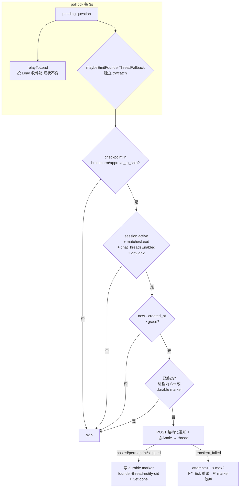
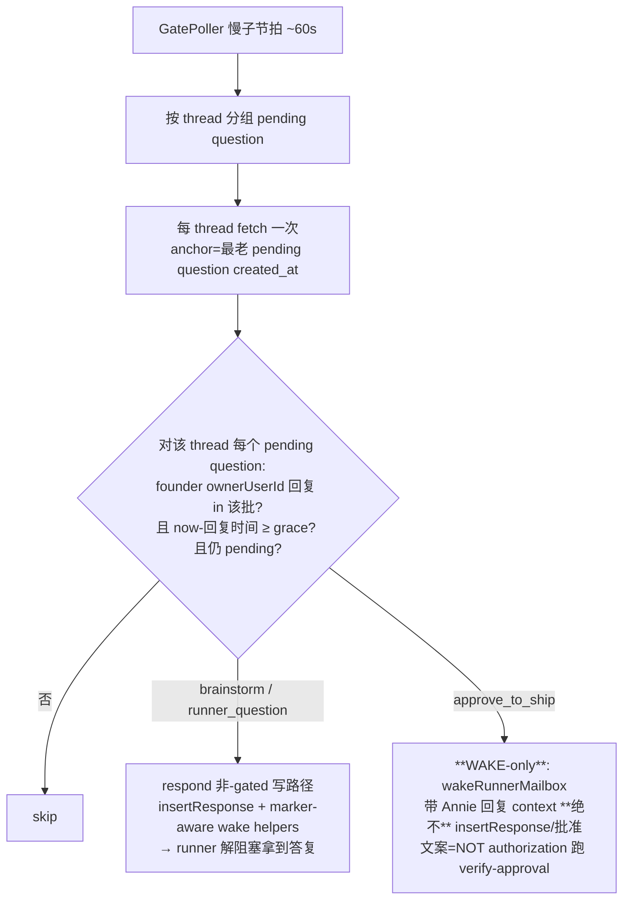

# Plan: runner ↔ founder 决策双向可靠捅达（in-thread）

**Version**: v1.58.0（暂定；ship 时取下一个空号，由 team/Codex 定）
**Issue**: FLY-605
**Date**: 2026-06-26
**Source**: `doc/engineer/exploration/new/FLY-605-founder-reliable-in-thread-relay.md`
**Status**: codex-approved（Codex design review 4 轮 APPROVED，2026-06-26）

---

## 目标 / 非目标

**双向双保险**（Lead NL relay = 主、不动；Bridge grace 兜底 = 备、不依赖 Lead）：

**Part A — 方向①（outbound：runner → founder）**：天生 founder-bound 的 gate（brainstorm / approve_to_ship）raise 后超 grace（默认 10min）仍没人答 → Bridge 把结构化通知 + @Annie 直接捅进对应 issue thread（非 alert 频道）。

**Part B — 方向②（inbound：founder → runner，Annie 加硬需求 lead-instruction 79ceae19）**：founder 在 issue thread 回复了、且该 issue 有 parked runner 带 open question、且 Lead 在 grace 内没 relay（question 仍 pending）→ Bridge auto-deliver founder 的 thread 回复进 runner（走 `respond()` 非-gated 写路径）→ runner 不再干等几天。

**🔴 Part B 核心安全约束（Tadashi 确认 fa32145b：「这是硬红线」）**：**ship gate（approve_to_ship）的批准绝不能从 thread 自然语言自动授权 merge**（FLY-175：message text NEVER carries merge authority；ship 授权只认 verify-approval；`respond()` 对 approve_to_ship 天生 fail-closed）。所以 Part B **按 checkpoint 分流**：
- **非-gated（brainstorm gate + runner_question）** → **full auto-deliver**：写 founder 回复为 gate 答复（`insertResponse` + wake）→ runner 解阻塞继续干活。
- **approve_to_ship** → **WAKE-only**：只 auto-WAKE parked runner + 带 Annie 回复做 context（mailbox wake，**绝不** `insertResponse`、**绝不**写批准），wake 文案明示「NOT authorization，ship 前必须跑 verify-approval」（复用 `respond.ts` bypass 路径已有的同款文案）→ runner 知道 Annie 回了、可处理 feedback；真 ship 授权仍走 verify-approval / founder-consent。

**非目标（v1.1+ follow-up，已在 exploration 标出）**：
- runner→founder 问题 outbound（需在 `ask` 上加干净 founder 标记）。
- 普通 `question` gate outbound 通知（多是 runner 问 Lead，自动 @Annie 会刷她）。
- ship 批准 inbound 的**结构化 auto-授权**（绕不开 FLY-175，需单独 founder-consent 设计；v1 ship 只 WAKE 不授权）。
- Runner Hook（强制结构化总结）。

---

## 设计概要 — Part A（方向①）

复用 `runner-ready-to-close-notifier.ts` 的「atomic claim + 直发 issue thread + 审计」先例。触发点 = `GatePoller` 同一个 tick（零新定时器，FLY-169/172 纪律）。GatePoller 是唯一统一遍历全部 pending 决策节点的地方，已有 session/issue/lead 上下文。

**关键时序坑**：兜底**不能**放在 `relayToLead` 的 `isLeadEventDelivered` 早退之后——第一 tick 投给 Lead 后该 event 已 delivered → 后续 tick 早退 → grace 后永远到不了。故兜底作为**独立 pass**（own try/catch）在 `poll()` 里 `relayToLead` 之后调用。



---

## 改动清单 — Part A（方向① outbound）

### 1. 新文件 `packages/teamlead/src/bridge/founder-thread-notifier.ts`

照 `runner-ready-to-close-notifier.ts` 结构：

```
export interface FounderThreadNotifyOpts {
  questionId: string;
  checkpoint: "brainstorm" | "approve_to_ship";
  executionId: string;
  issueId: string;
  issueIdentifier?: string;
  projectName: string;
  summary: string;            // 已 resolve content_ref 的 question 内容
  ageMinutes: number;          // raise 至今分钟（展示用）
  thread?: ChatThreadRef;      // 预解析（getChatThreadByIssue）
  botToken?: string;           // lead.botToken ?? config.discordBotToken
  ownerUserId?: string;        // config.discordOwnerUserId（@mention）
}
export interface FounderThreadNotifyDeps { store: StateStore; fetchImpl?: typeof fetch; }

export async function emitFounderThreadNotification(opts, deps): Promise<FounderThreadNotifyResult>
```

返回 `FounderThreadNotifyResult = { kind: "posted" | "skipped" | "permanent_failed" | "transient_failed"; retryAfterMs?: number }`（让 GatePoller 决定是否重试 / 标 done；done-check 在 GatePoller 侧，notifier 不返回 already_done。`transient_failed` 带 `retryAfterMs`（从 429 `Retry-After` 解析，复用 `chat-thread-utils.ts::parseRetryAfterMs`），供 GatePoller 算 `nextAttemptAtMs`）。

逻辑：
1. **校验**：缺 `thread?.thread_id` / `botToken` / `ownerUserId` **或 ownerUserId 非合法 Discord snowflake**（Codex R2 #4：`config.discordOwnerUserId` 是 raw env（`config.ts:136`），畸形会让 POST 400）→ 写 `founder_thread_notify_skipped` 审计（reason: no_chat_thread / no_bot_token / no_owner / bad_owner_id）+ return `{kind:"skipped"}`。校验用共享 `isDiscordSnowflake(id)`（`^\d{17,20}$`）放 config/use 边界。
2. **组装 body**（按 checkpoint，含 `<@ownerUserId>`）：
   - brainstorm：`🧠 **Brainstorm gate 等你确认** — <identifier>` + `<@owner>` + 截断 summary（≤1500 字）+ `已等 <ageMinutes> 分钟没人答（Lead 可能漏转）。在本 thread 回复确认/纠正。`
   - approve_to_ship：`🚀 **Ship gate 等你批准** — <identifier>` + `<@owner>` + 截断 summary + `…实现+code-review 完成、等你 ship。已等 <ageMinutes> 分钟。`
3. **POST** `${DISCORD_API}/channels/${thread.thread_id}/messages`，body `{ content, allowed_mentions: { users: [ownerUserId] } }`（显式放行 user mention，屏蔽 @everyone/role）。AbortController 5s 超时（同 ChatThreadCreator）。
4. **失败分类**（仿 `chat-thread-utils.ts::archiveChatThread`）：
   - 2xx → `founder_thread_notified` 审计 + return `{kind:"posted"}`。
   - 429 → 解析 `Retry-After`（`parseRetryAfterMs`）→ `{kind:"transient_failed", retryAfterMs}`；5xx/网络/超时 → `{kind:"transient_failed"}`（GatePoller 按时间预算重试，见 §2）。各写 transient 审计。
   - **其它 4xx（含 400 畸形 mention / 401/403/404 坏 token/无权限/thread 没了）→ permanent**（Codex R2 #4：非-429 4xx 都是 client error，重试无用）→ `founder_thread_notify_failed`(permanent) 审计 + return `{kind:"permanent_failed"}`（**放弃、不无限刷**）。

**为什么不照搬 runner-ready-to-close 的 claim-first 一次性**：那个先 `insertEvent` claim 再 POST，POST 瞬时失败时 claim 已写 → 永不重试 → 通知**静默丢**。本 issue 的全部价值就是「founder 必到」，瞬时 Discord blip 不能丢。故**去重 + 重试由 GatePoller 侧管**（见 §2），notifier 只负责「发一次 + 分类结果」。

> 复用 `ChatThreadRef = NonNullable<ReturnType<StateStore["getChatThreadByIssue"]>>`（已在 runner-ready-to-close 定义；导出共享或各自 derive）。

### 2. `packages/teamlead/src/bridge/gate-poller.ts`

**GatePollerConfig 新增**（全部 optional，缺省 = 干净 no-op）：
- `discordBotToken?: string`
- `discordOwnerUserId?: string`
- `fetchImpl?: typeof fetch`（测试 seam，透传给 notifier）
- `founderThreadNotifyGraceMs?: number`（默认 `10*60*1000`）
- `founderThreadRetryBudgetMs?: number`（**瞬时失败重试的时间预算**，默认 `45*60*1000` = 45min；Codex R1 #4：retry 是时间预算不是 5 个快 tick——5 ticks≈15s 太短，一次短 Discord 429/5xx 就会 give-up 静默丢，正是本 issue 要消的失败模式）

**进程内去重/重试状态**（仿 HeartbeatService 的 `notified*` Set 写法）：
- `private readonly founderNotifyDone = new Set<string>();`（qid → 已终态：posted / permanent / 重试预算耗尽）
- `private readonly founderNotifyRetry = new Map<string, { firstFailedAtMs: number; nextAttemptAtMs: number }>();`（qid → 瞬时失败重试状态：首次失败时刻 + 下次尝试时刻）

**poll() 内每 question 循环** —— **relayToLead 与 fallback 各自独立 try/catch**（Codex R2 #3：现状 `relayToLead` 在 per-lead try 内，若它 throw（Lead runtime 失败/重启）会中断该 lead 的 question loop → fallback 跑不到、又退回「behind Lead」）。改成显式分离：
```
let relayThrew = false;
try {
  await this.relayToLead(lead, session, question, dbPath);
} catch (err) {
  relayThrew = true;
  // 保留 circuit-breaker 计账（relay 失败照旧记），但不让它阻断 fallback
  console.warn(`[GatePoller] relayToLead threw for ${lead.agentId}:`, ...);
}
try {
  await this.maybeEmitFounderThreadFallback(lead, session, question, dbPath);
} catch (err) {
  console.warn(`[GatePoller] founder-thread fallback error for ${lead.agentId}:`, ...);
}
```
→ Lead runtime 抛错时 Part A fallback（grace 后）仍拿到机会。测试：`relayToLead`/runtime deliver 在 grace 后 throw → Part A 仍尝试 thread 通知。

**新方法 `maybeEmitFounderThreadFallback`**（门 → 去重 → 发 → 记终态）：
- `if (!this.founderThreadNotifyEnabled()) return;`（env `FLYWHEEL_FOUNDER_THREAD_NOTIFY !== "0"`，默认开，每 poll 读，可热切）
- `if (!this.config.chatThreadsEnabled) return;`
- `const cp = question.checkpoint; if (cp !== "brainstorm" && cp !== "approve_to_ship") return;`（v1 scope）
- live + scoped（同 gate relay 门，独立判，含 matchesLead try/catch）：
  `if (!ACTIVE_SESSION_STATUSES.has(session.status)) return;`
  `if (!matchesLead(session, lead.agentId, this.config.projects)) return;`
- grace：`const ms = parseSqliteUtcMs(question.created_at); if (ms === null) return; if (Date.now() - ms < graceMs) return;`
  （**复用现成安全 parser** `parseSqliteUtcMs`（`packages/flywheel-comm/src/commands/verify-lifecycle-consent.ts:99-104`）：含 `T` 直接 `Date.parse`、否则 SQLite UTC `+Z`、无效返 `null` fail-safe。**不用** `new Date(ts.replace+"Z")`——那对已含 T/Z 的 ISO 串会双加 Z（Codex R1 #5）。导出共享或抽到 shared util。Part B 同用。）
- **去重**（终态后绝不再发；跨重启用 durable marker）：
  - `if (this.founderNotifyDone.has(question.id)) return;`（进程内）
  - 否则查 durable：`getEventsByExecution(session.execution_id)` 里有 `founder-thread-notify-<qid>` marker → `founderNotifyDone.add(qid); return;`（跨 Bridge 重启去重）
- 解析 thread / token / owner / content：
  `thread = store.getChatThreadByIssue(session.issue_id, lead.chatChannel)`
  `botToken = lead.botToken ?? this.config.discordBotToken`；`ownerUserId = this.config.discordOwnerUserId`
  content：若 `content_type==="ref"` 用 `readContentRef`（同 relayToLead）
- `const result = await emitFounderThreadNotification({...}, { store, fetchImpl: this.config.fetchImpl })`
- **按结果记终态**（瞬时失败用**时间预算**，Codex R1 #4）：
  - `"posted"` / `"permanent_failed"` / `"skipped"` → `writeFounderMarker(qid, ...)` + `founderNotifyDone.add(qid)`（终态，写 durable marker = 跨重启不再发）。
  - `"transient_failed"` → 取/建 `founderNotifyRetry.get(qid)`（首次设 `firstFailedAtMs=now`）；`nextAttemptAtMs = now + backoff(Retry-After 优先，否则指数退避，capped)`（**尊重 Discord Retry-After**，notifier 把 429 的 retry-after 透传出来）。下个 tick 仅当 `now >= nextAttemptAtMs` 才重发（避免每 3s 硬刷）。**仅当 `now - firstFailedAtMs >= founderThreadRetryBudgetMs`（默认 45min）才放弃** → 写 marker(reason: transient_budget_exhausted, severity=warn) + `founderNotifyDone.add(qid)`。预算未到 = 一直重试（直到 posted 或 gate 不再 pending→自然掉出）。
- `writeFounderMarker` = `store.insertEvent({ event_id: "founder-thread-notify-"+qid, event_type: "founder_thread_notify_done", ... })`（UNIQUE；终态唯一写点 = durable 去重锚）。
- notifier 的 `"transient_failed"` 结果带 `retryAfterMs?`（从 429 `Retry-After` 解析，同 `chat-thread-utils.ts::parseRetryAfterMs`），GatePoller 用它算 `nextAttemptAtMs`。

> 注：`skipped`（缺 thread/owner/token）也记终态——这些缺失不会因重试而改变；避免每 tick 重查重发。若部署后补上配置，gate 仍 pending 的话进程内 Set 已 done → 不补发（可接受：极边缘 + 配置应部署前就位）。

### 3. `packages/teamlead/src/bridge/plugin.ts`（GatePoller 构造，~2623）

新增三行（owner/token 已在 `config` 上）：
```
discordBotToken: config.discordBotToken,
discordOwnerUserId: config.discordOwnerUserId,
// fetchImpl 默认 global fetch；grace 默认 10min（可加 env FLYWHEEL_FOUNDER_THREAD_NOTIFY_GRACE_MS 解析）
```

---

## 设计概要 — Part B（方向② inbound）

founder 在 issue thread 回复 → 若 Lead 在 grace 内没 relay（question 仍 pending）→ Bridge **按 checkpoint 分流**处理。**piggyback GatePoller 慢子节拍**（每 ~20 tick ≈ 60s，仿 misroute patrol；零新定时器）。

**关键：按 thread 分组（grouped per-thread pass，Codex R1 #2）**——一个 issue 可能有多个 pending question（共用一个 thread）。若 per-question 各自读 thread + 推进共享 cursor，先处理的会把 cursor 推过后一个 question 还需要的消息（漏 founder 回复）。故**每个 thread 只 fetch 一次**，从该 thread **最老 pending question 的 `created_at`** 为锚（不用 baseline-to-latest——那会漏掉「fallback 首次扫描前就已存在」的 founder 回复，与 RestPoll 给 Lead inbound 的 baseline 语义相反），对**同一批已 fetch 的消息**评估该 thread 的**所有** pending question，再统一推进 cursor。



**🔴 安全（Tadashi 确认硬红线 + Codex R1 #6）**：approve_to_ship 走 **WAKE-only**——**绝不调 `respond()`**（`respond()` 在 BRIDGE_URL/env 在场时会把 approve_to_ship 路由进 founder-consent；Bridge 进程常带这些 env，故 ship 必须**完全绕开 respond()**，只调 wake primitive + 非授权文案）+ 显式 ship guard。只认 **founder（`discordOwnerUserId`）** 作者的消息（不读 Lead/bot 消息，防回环）。

---

## 改动清单 — Part B（方向② inbound）

### B1. 新文件 `packages/teamlead/src/bridge/founder-reply-deliverer.ts`

`emitFounderReplyDeliveryForThread(threadCtx, pendingQuestions, deps)` —— 对**一个 thread**（grouped）：
- threadCtx: `{ issueId, threadId, botToken, ownerUserId, graceMs, commDbPath }`
- pendingQuestions: 该 thread 全部 pending question `[{ questionId, checkpoint, executionId, createdAtMs }]`
- deps: `{ store, fetchImpl?, cursorStore?, wakeImpl?, respondImpl?, commDbFactory? }`
- 逻辑（**processed-through cursor，at-least-once**，Codex R2 #1）：
  1. **读 thread 一次**：`GET ${DISCORD_API}/channels/${threadId}/messages?after=<cursor>&limit=...`（cursor 取 `cursorStore.load(threadId)`；首次无 cursor → 用最老 pending question 的 `createdAtMs` 推一个 Discord snowflake 下界，**不 baseline-to-latest**——baseline 会漏掉首扫前已存在的 founder 回复）。AbortController 超时；复用 RestPoll raw message 解析。**oldest-first 排序**。
  2. **逐条消息 oldest-first 处理**，维护 `advanceableUpTo`（= 可安全推进到的 msgId，初始 = 入参 cursor）：
     - **非 founder 作者**（`author.id !== ownerUserId`）/ founder 消息但**不**匹配任何仍-pending question（时间 ≤ 所有 pending 的 createdAtMs，或对应 question 已答）→ 该消息**无关/permanent-skip** → `advanceableUpTo = thisMsgId`（可推过）。
     - **founder 消息匹配某仍-pending question**：
       - `now - msgTime < graceMs`（**未成熟**）→ **停**：不推过这条（`break`，cursor 停在 `advanceableUpTo`），下个子节拍 grace 到了再读到它。
       - 成熟 → 按 checkpoint 投递（见 step 3）。投递**成功/已终态**（response 行已写 / ship-wake marker 已持久写 / 已答）→ `advanceableUpTo = thisMsgId`（可推过）；投递**瞬时失败**（respond/wake/marker 写失败）→ **停**：不推过（`break`），下个子节拍重试同一条。
  3. **按 checkpoint 投递**（仅对成熟 + 仍 pending 的匹配消息；投递前再查一次 `getMessageById` + 无 response 行确认仍 pending，Lead 可能刚 relay）：
     - **brainstorm / runner_question（非-gated）** → 调 `respond({ questionId, fromAgent:"founder-bridge-auto", answer, dbPath, env })`（**不传 bridgeUrl**；Codex R1 #1：`respond()` 非-gated 路径除 `insertResponse` 外跑 `wakeNoBlockGateRunnerBestEffort`/`wakeAskedRunnerBestEffort` 的 marker-aware backend 路由）。**⚠️ 需先把 `respond` 经 `flywheel-comm` 包导出**（Codex R3 #1：`packages/flywheel-comm/package.json` 现只导出 `./db`/`./wake`/`./verify-approval` 等，没导出 `./commands/respond` → teamlead NodeNext import 会解析失败）—— 见 B4。写 `founder_reply_delivered` 审计。
     - **approve_to_ship** → **WAKE-only**（显式 guard：**绝不进 respond 分支**）：`wakeRunnerMailbox({ db, execId, fromAgent:"founder-bridge-auto", content:"Annie 在 thread 回复了你的 ship gate：<answer 摘要>。这条不是授权——ship 前必须跑 verify-approval。", metadata:{ kind:"ship_thread_reply", questionId } })`（复用 respond.ts:86 文案）。**绝不** insertResponse / respond()。写 `founder_ship_reply_waked` 审计 + **按 founder 消息 id 去重**的 durable marker `founder-ship-wake-<qid>-<msgId>`（Codex R1 #3：ship gate 永远 pending，按 qid 去重会压掉 Annie 后续回复）→ 每新 founder 消息 wake 一次、内容恒非授权。
  4. **🔴 多 question 歧义保守策略**（Codex R2 #2 + R3 #2/#3）：一条 founder 消息时间上晚于该 thread **某个非-ship pending question 的 createdAtMs，且该 thread 还有任何其它 pending question**（**含 ship**——Codex R3 #3：非-ship + approve_to_ship 同 thread，把这条文本自动写成非-ship 答复也可能解错 question）→ 非-ship **自动投递有歧义**。**v1 保守**：**不**自动投递该消息给任何**非-ship** question，改走 **durable Lead handoff**（Codex R3 #2，不能只写审计行——session_events 审计不是 Lead-visible wake、lead_events 不自动重试）：用 stable lead event id `founder-reply-ambiguous-<threadId>-<msgId>`，**经 GatePoller 同款 LeadRuntime 路径** `appendLeadEvent` + `runtime.deliver`（请 Lead 人工 relay）。**cursor 推进条件 = handoff durably accepted+delivered**；handoff 投递失败 → **停在该消息前**（同其它瞬时失败，下个子节拍重试，不丢人工 relay）。（**ship WAKE-only 不受影响**：ship 的 wake 本就非授权 + 按 msgId 去重，可照常发该 ship gate 的 context。）（单 pending question 是常态；多 question 同 thread 罕见。）
  5. 处理完，`cursorStore.save(threadId, advanceableUpTo)`（**只推到最后一个安全可推进的 msgId**，绝不跳过未成熟/失败的 founder 消息）。
- 失败：非 2xx 读 → 审计 + 不抛、cursor 不动（下个子节拍重读）。投递失败见 step 2（cursor 停在该消息前）。

### B2. `gate-poller.ts` 慢子节拍调用 Part B

- `poll()` 末尾（patrol 之后）加：`if (this.founderReplyDeliverEnabled() && this.tickCount % this.replyDeliverEveryNTicks() === <phase>) await this.founderReplyDeliverPass();`（独立 try/catch）。
- `founderReplyDeliverPass()`：遍历 `this.config.projects` 的每个 (project, lead)，取该 lead 全部 pending question（已 raise 超过 grace），**按 issue/threadId 分组**（`getChatThreadByIssue`），每组调一次 `emitFounderReplyDeliveryForThread`（grouped，不 per-question 调）。
- **GatePollerConfig 复用** Part A 的 `discordBotToken` / `discordOwnerUserId` / `fetchImpl`；新增 `founderReplyDeliverGraceMs?`（默认同 10min）、`founderReplyDeliverEveryNTicks?`（默认 20）、`cursorStore?`（`FileInboundCursorStore`，plugin 注入；缺省 = 内存 `InMemoryInboundCursorStore`）。ship-WAKE 去重的进程内 Set（按 `qid:msgId`）同 Part A 套路。
- env：`FLYWHEEL_FOUNDER_REPLY_DELIVER !== "0"`（默认开、`=0` 硬关）。

### B3. `plugin.ts` 注入 cursorStore（GatePoller 构造，~2623）

`cursorStore: new FileInboundCursorStore(join(getStateDir(), "founder-reply-cursor.json"))`（同 roundtable 的 cursor 持久化套路）。owner/token 已在 Part A 接线。

### B4. `packages/flywheel-comm/package.json` 导出 `respond`（Codex R3 #1）

`exports` 加 `"./respond": { "types": "./dist/commands/respond.d.ts", "default": "./dist/commands/respond.js" }`（现有只导出 `./db`/`./wake`/`./verify-approval`/`./utils` 等）→ teamlead `founder-reply-deliverer.ts` 才能 NodeNext `import { respond } from "flywheel-comm/respond"`。**或**抽 `writeNonGatedResponseAndWake()` 进已导出的子路径（如 `flywheel-comm/wake` 或新 `./respond-helpers`）。测试覆盖 teamlead→flywheel-comm 的 import 边界（build 通过 + 调用走通 marker-aware wake）。

---

## 字节兼容 / 安全

- env `FLYWHEEL_FOUNDER_THREAD_NOTIFY` 默认开、`=0` 硬关。
- `chatThreadsEnabled=false`、缺 owner/token、thread 缺失、checkpoint 不在范围、未到 grace → 全部干净 no-op（+ 必要时审计跳过事件）。
- 现有 GatePoller 测试不传新 config → 兜底永不触发（无 owner/token）→ 既有行为零变化。
- 仅放行 `allowed_mentions.users:[ownerUserId]`，屏蔽 @everyone/@here/role（沿用 ChatThreadCreator 防护）。
- 兜底 pass 全程独立 try/catch，**绝不**打断 GatePoller 主职（Lead relay / 巡检）。
- **可靠性**：瞬时 Discord 失败（429/5xx/网络）按**时间预算**重试（尊重 429 `Retry-After` + 指数退避，默认 45min 窗口或直到 gate 不再 pending，**不**是 5 个快 tick——Codex R1 #4）；永久失败（401/403/404）写 marker 放弃（不无限刷 Discord）。durable marker（`getEventsByExecution` 读 / `insertEvent` 写）保证 Bridge 重启后不重发。
- 绝不走 FLY-368 alert 频道。

**Part B（方向②）专属**：
- env `FLYWHEEL_FOUNDER_REPLY_DELIVER` 默认开、`=0` 硬关；缺 owner/token/thread 或 `chatThreadsEnabled=false` → 干净 no-op。
- **approve_to_ship = WAKE-only**（**绝不调 `respond()`**、绝不 `insertResponse`、绝不写批准；只 wake + 非授权 context 文案 + 显式 ship guard）→ ship 授权只认 verify-approval（FLY-175 核心安全约束，Tadashi 确认硬红线 + Codex R1 #6）。
- 只读 **founder 作者**消息（`author.id === discordOwnerUserId`）；不读 Lead/bot 消息 → 防回环、防把 Lead 的话当 founder 答复。
- 去重：非-gated = response 行存在 → qid 掉出 pending（幂等）；**ship-WAKE 按 founder msg-id**（`founder-ship-wake-<qid>-<msgId>` / 持久化 last-delivered msgId）—— ship gate 永远 pending，按 qid 去重会压掉 Annie 后续回复（Codex R1 #3）；cursor 仅作减少重复读的优化。
- pass 独立 try/catch，绝不打断 GatePoller 主职；非-gated **走 `respond()` 非-gated 路径**（marker-aware wake helpers，Codex R1 #1），不自己拼 `insertResponse + wakeRunnerMailbox`。

---

## 测试（TDD，RED→GREEN）

### `parseSqliteUtcMs` 单测（Codex R1 #5；放共享 util test）
- SQLite `"2026-06-26 19:00:00"` → 正确 epoch ms；已含 T 的 ISO `"2026-06-26T19:00:00Z"` → **不**双加 Z、正确 parse；空/乱串 → `null`。

### `__tests__/founder-thread-notifier.test.ts`（新，Part A）
1. 2xx → POST 到正确 thread，body 含 `<@owner>` + `allowed_mentions.users`，返回 `{kind:"posted"}`，写 `founder_thread_notified` 审计。
2. 缺 thread / token / owner **或 owner 非合法 snowflake（畸形 id）** → 各返回 `{kind:"skipped"}` + 对应 `..._skipped`(no_chat_thread/no_bot_token/no_owner/bad_owner_id) 审计、无 POST（Codex R2 #4）。
3. 400（畸形 mention）/401/403/404 → `{kind:"permanent_failed"}` + `..._failed`(permanent) 审计、不抛（**非-429 4xx 都 permanent**，Codex R2 #4）。
4. 429（带 Retry-After header）→ `{kind:"transient_failed", retryAfterMs}`（断言解析对）；500/网络 throw/超时 → `{kind:"transient_failed"}`，不抛。
5. brainstorm vs approve_to_ship body 文案分支。

### `__tests__/gate-poller-founder-fallback.test.ts`（新，Part A）
1. checkpoint=brainstorm 且 age≥grace → 触发一次 POST。
2. checkpoint=approve_to_ship 且 age≥grace → 触发。
3. checkpoint=null（runner_question）/ checkpoint="question" → **不**触发。
4. age<grace → 不触发；跨多 tick 到 grace 后**只发一次**（posted → founderNotifyDone + durable marker 去重）。
5. **瞬时失败=时间预算重试**（Codex R1 #4）：transient_failed → 按 `nextAttemptAtMs` 隔拍重试（尊重 Retry-After，不每 3s 硬刷）；**预算内（<45min）一直重试**、tickN posted 写 marker；仅 `now-firstFailedAt ≥ 预算` 才写 give-up marker。断言「短 blip（如 20s）不会 give-up」。
6. **永久失败放弃**：403 → 写 marker + 不再重试。
7. **durable 去重**：marker 已存在（模拟 Bridge 重启后 `getEventsByExecution` 命中）→ 不 POST。
8. `chatThreadsEnabled=false` / env `=0` / 缺 owner|token → 不触发。
9. session 非 active / matchesLead=false → 不触发。
10. 隔离：notifier throw 不打断同 tick 的 relayToLead。
11. **🔴 relayToLead throw 后 fallback 仍跑**（Codex R2 #3）：`relayToLead`/runtime deliver 在 grace 后 throw → 断言 Part A fallback 仍被调用并尝试 thread 通知（不被 Lead runtime 抛错阻断）；circuit-breaker 计账仍记 relay 失败。

### `__tests__/founder-reply-deliverer.test.ts`（新，Part B）
1. **非-gated 走 respond() 非-gated 路径**（Codex R1 #1）：checkpoint=brainstorm，founder 回复 + grace 过 + 仍 pending → 断言**经 `respond()`/`writeNonGatedResponseAndWake()`**（marker-aware wake helper 被调，**不是**直接 `wakeRunnerMailbox`）；no-block brainstorm marker 与 ask marker 都经现有 marker 路径路由。写 `founder_reply_delivered` 审计。
2. **🔴 approve_to_ship = WAKE-only + 绝不走 respond()**（Codex R1 #6）：fake `BRIDGE_URL`+`FLYWHEEL_BRIDGE_URL`+`TEAMLEAD_API_TOKEN` 在 env，founder 回复「approved / ship it」→ 断言：**0 次 `insertResponse`、0 次 founder-consent HTTP、恰 1 次 wake**、content 含「NOT authorization / verify-approval」、写 `founder_ship_reply_waked`。
3. **🔴 ship 后续回复按 msg-id 去重**（Codex R1 #3）：ship gate 仍 pending，第一批 founder 回复 → wake 一次；**第二批**新 founder 回复（不同 msgId）→ **再 wake 一次**（不被 qid marker 压掉），全程 0 insertResponse。
4. **grouped per-thread**（Codex R1 #2）：同一 thread 两个 pending question（brainstorm + runner_question），founder 两条回复在同一 fetch page → **一次 fetch**、两个 question 都被各自处理（cursor 不在第一个处理后推过第二个需要的消息）。
5. **首扫不漏已存在回复**（Codex R1 #2）：founder 回复在 fallback 首次扫描**之前**已发（无 cursor）→ anchor=最老 pending question created_at（非 baseline-to-latest）→ 仍能读到并处理。
6. **只认 founder 作者**：Lead/bot 消息（author.id≠ownerUserId）→ 不当答复。
7. **grace 闸** / **仍 pending 闸**（Lead 刚 relay → 已答 → skip）。
8. 读/写 throw → 审计 + 不抛。
9. **🔴 processed-through cursor：未成熟不推过**（Codex R2 #1）：founder 回复但 `now-msgTime<grace` → cursor **停在该消息前**（不 save 过它）；下个子节拍 grace 到 → 仍读到该消息并投递。断言 cursor 在两拍间不跳过。
10. **🔴 投递瞬时失败不推过**（Codex R2 #1）：`respond()` throw（或 ship wake/marker 写失败）→ cursor 停在该 founder 消息前、`founder_reply_delivered` 不写；下个子节拍重试同一条 → 成功后才推过。
11. **cursor 只在终态推进**：消息无关/已答/投递成功/ship-marker 已写 → 才 `advanceableUpTo` 推过；混合一批（前一条成熟成功、后一条未成熟）→ cursor 停在第一条后、不跳过第二条。
12. **🔴 多 question 歧义 + durable handoff**（Codex R2 #2 + R3 #2/#3）：
    - 同 thread 两个非-ship pending question + 一条晚于两者的 founder 回复 → **不**自动投递任何非-ship、走 **durable Lead handoff**（断言 `appendLeadEvent` + `runtime.deliver` 被调，event id=`founder-reply-ambiguous-<threadId>-<msgId>`）。
    - **handoff 投递失败** → cursor **停在该消息前**（不推过、不丢人工 relay），下个子节拍重试；handoff 成功后才推 cursor。
    - **ship+非-ship 重叠**（Codex R3 #3）：同 thread 一个非-ship + 一个 approve_to_ship，一条晚于非-ship 的 founder 回复 → 非-ship 走 ambiguous handoff（不自动写答复）；ship gate 的 WAKE-only context 照常发（msgId 去重、非授权）。
    - 两条 founder 回复对两个 question（时间一一对应、无歧义）→ 正常各自投递。
13. **respond 导出边界**（Codex R3 #1）：teamlead `founder-reply-deliverer` 能经 `flywheel-comm/respond`（或共享 helper 子路径）import 并调用 → 非-gated 走 marker-aware wake（build/import 不挂）。

### `__tests__/gate-poller-founder-reply.test.ts`（新，Part B 接线）
1. 慢子节拍只在 `tickCount % N === phase` 跑（不是每 3s）。
2. env `FLYWHEEL_FOUNDER_REPLY_DELIVER=0` / 缺 owner|token / `chatThreadsEnabled=false` → pass 完全不跑。
3. **按 thread 分组**：多 issue 各自 thread → 每 thread 调一次 grouped deliverer（不 per-question 调）。
4. 隔离：deliverer throw 不打断 poll 主职。

> 两 Part 都复用 `gate-poller-health.test.ts` 的 GatePoller 构造/mock 套路（fake CommDB + StateStore stub + fetchImpl seam + 可注入 cursorStore/wakeImpl/respondImpl）。

---

## 验收（QA，双向）

**Part A（方向①）**：
- 真机（529 QA Room 或隔离 slot）：起 runner 到 brainstorm gate → **不**让 Lead 转 → 等 grace（QA 用 `FLYWHEEL_FOUNDER_THREAD_NOTIFY_GRACE_MS` 调到几十秒）→ Claude-in-Chrome 验 issue thread 出现结构化通知 + @Annie，且 alert 频道**没有**。
- Lead 正常秒级转 + 答 gate → grace 内解析 → 兜底**不**触发（不刷屏）。
- 同 gate 多 tick → 只一条；模拟 Bridge 重启（进程内 Set 清空、durable marker 仍在）→ 仍不重发。

**Part B（方向②）**：
- runner park 在 brainstorm gate → founder（QA 用 Annie session / owner id）在该 issue thread 回复 → **不**让 Lead relay → 等 grace → 验 runner 收到 founder 答复并解阻塞（CommDB response 行 + runner pane 继续）。
- Lead 正常 relay（`respond`）→ grace 内 qid 已答 → 方向② **不**重复 deliver。
- **🔴 ship gate 安全验**：runner 在 approve_to_ship gate，founder 在 thread 打字「approved/ship it」→ 验方向② 走 **WAKE-only**：runner 被 wake 且收到非授权 context（文案含 verify-approval 提示）、**绝无** insertResponse / 自动批准、ship 仍须走 verify-approval（这是 Tadashi 确认的核心安全约束）。

- env `=0`（两 flag）→ 各自完全不触发（逃生口）。

---

## 部署

- 纯 Bridge 侧 → 单次 Bridge 重启生效（攒进下一次 Tier-3 批量重启，不单独重启生产 Bridge；开跑前问 team-lead 有无其他 Bridge PR 在排）。
- 默认开 = 部署后立即生效；先 QA 真机过、Annie 在场再 ship。

---

## 风险 / 取舍

**Part A（方向①）**：
- **可能与 Lead NL 转发重复**：grace=10min 让正常情况下 gate 已解析 → 兜底不触发，重复概率低；真重复也只是 thread 里多一条结构化提醒（可接受，远好于静默丢）。grace 可调。
- **summary 截断**：brainstorm 内容可能 >1500 字被截；Lead 主路转发有全文，兜底只为「让 Annie 看见有事等她」。可接受。
- **thread 缺失/归档**：active gate 时 thread 应在；缺则 skip 审计。归档极少（issue 未完成）。

**Part B（方向②）**：
- **raw-forward 不智能**：founder 的 thread 回复可能是反问/闲聊而非干净答复，方向② 原样转给 runner（Lead 主路才做综合）。但这是**兜底**——给 runner founder 的原话远好于干等几天；runner 可再问。grace + Lead 主路覆盖常见情况。已知局限，标出。
- **founder 多条消息**：取 question 之后 founder 的消息 join（截断）作为答复；可能含无关闲聊。可接受（兜底）。
- **ship 批准 = WAKE-only**（设计取舍，非缺陷；Tadashi 确认硬红线）：approve_to_ship 的 inbound 只 wake parked runner + 带 context，**绝不**自动写批准（FLY-175）；真 ship 授权仍走 verify-approval。若 Annie 想要 ship 批准也 inbound 自动授权 → 单独 follow-up（需 founder-consent 结构化）。
- **Discord 读频率**：方向② 每 ~60s 读一次有 pending 非-gated question 的 issue thread（量小）；rate-limit 友好。

---

## 实现分阶段（同一 PR / issue）

1. **Phase A**：Part A（方向① outbound）—— `founder-thread-notifier.ts` + GatePoller 兜底 + 测试。
2. **Phase B**：Part B（方向② inbound）—— `founder-reply-deliverer.ts` + GatePoller 慢子节拍 + 测试。
3. 两 Phase 复用同一批 GatePollerConfig 新字段（owner/token/fetch）；可一个 PR 双 commit，或先 A 后 B 视体量。Tadashi 定。

---

## Codex Design Review 状态

**Round 1 = CHANGES REQUESTED → 全 6 项已采纳修订**（隔离 CODEX_HOME=/tmp/codex-home-fly-605 + school，前台跑稳）：
1. Part B 非-gated 改走 `respond()` 非-gated 路径（marker-aware wake helpers，不自拼 insertResponse+wake）。
2. Part B 改 **grouped per-thread**（每 thread fetch 一次、anchor=最老 pending created_at、非 baseline-to-latest）→ 修多 question cursor race + 首扫漏已存在回复。
3. ship-WAKE 去重改**按 founder msg-id**（不按 qid）→ 修 ship 后续回复被压掉。
4. Part A retry 改**时间预算**（Retry-After+退避，45min 或直到不再 pending），非 5 快 tick。
5. timestamp 用现成安全 `parseSqliteUtcMs`（不双加 Z）。
6. 显式 ship guard + fake BRIDGE_URL 对抗测试（证 ship 文本绝不经 consent）。
**Round 2 = CHANGES REQUESTED**（6 项 R1 全确认已修 + FLY-175 边界 sound）→ 4 新项已采纳修订：
1. **（主）Part B cursor 改 processed-through / at-least-once**：oldest-first，只在「response 已写 / ship-marker 已写 / 证明无关」后才推过；相关但未成熟 grace / 投递瞬时失败 → 停在该消息前（不静默丢）。对齐 RestPoll/Roundtable at-least-once 先例。
2. **多 question 歧义保守**：一条 founder 消息晚于同 thread 多个非-ship pending question → 不投递、写 ambiguous 审计 + wake Lead。
3. **Part A fallback 在 relayToLead throw 时仍跑**：relayToLead 与 fallback 各自独立 try/catch。
4. **snowflake 校验 owner id** + 非-429 4xx（含 400）归 permanent。
**Round 3 = CHANGES REQUESTED**（R2 reliability 修确认对、FLY-175 sound）→ 3 窄项已采纳：
1. `flywheel-comm` 导出 `respond`（B4）—— teamlead 才能 import 复用非-gated 写路径（现 package.json 未导出）。
2. 歧义 Lead handoff 改 **durable**（经 GatePoller 同款 LeadRuntime appendLeadEvent+deliver，stable event id），handoff durably 投递后才推 cursor、失败则停（不丢人工 relay）。
3. 歧义规则覆盖 **ship+非-ship 重叠**（非-ship 走 handoff，ship WAKE-only 照常）。
**Round 4 = ✅ APPROVED**（收敛 6→4→3→0；架构 + FLY-175 ship-WAKE 边界四轮均 sound，「ship 文本绝不经 respond()/consent 成批准」对抗测试被特别认可）。
**4 个 non-blocking 实现注记**（不阻塞、留给 implement）：① `parseRetryAfterMs` 现 file-local 于 `chat-thread-utils.ts` → 导出它或在 notifier 内放个小 parser；② Part A 是 at-least-once（Discord POST 超时但实际已发可能重一条）—— v1 接受此 tradeoff（消静默丢 > 偶尔重一条），如实现便宜可加 nonce 幂等；③ §1 签名 typo 已修（返回 `FounderThreadNotifyResult`）；④（同 ①）。
→ **plan 实现-ready，draft→new**。superseded 3-轮 safety valve 说明:每轮 finding 真实递减、皆窄实现细节、方向四轮无异议(已非阻塞知会 Tadashi)。
