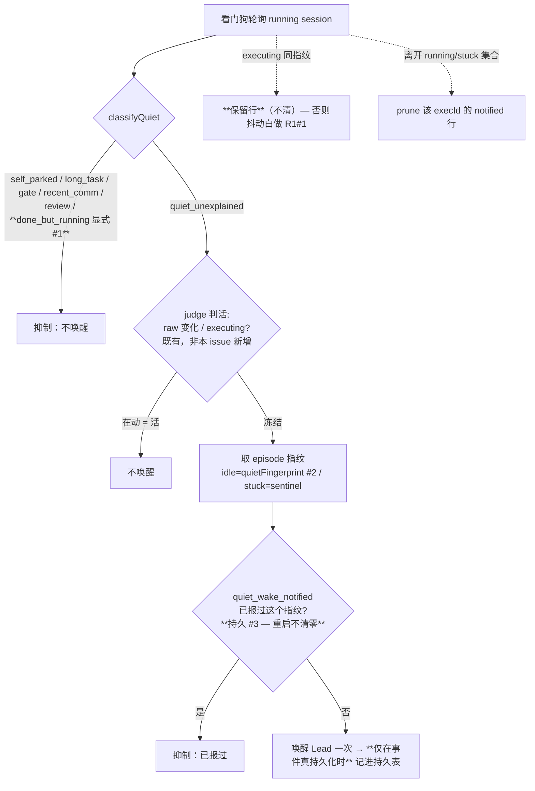

# Plan: 看门狗 quiet 路径细化 — 显式 FLY-324 skip + normalized fingerprint dedup + 持久「已报过」(direction A)

**Version**: v1.58.0（占位，ship 时按当时 main 重定；不急、排在 FLY-639/638/630 之后）
**Issue**: FLY-637（FLY-626 follow-up，看门狗 deferred ③）
**Date**: 2026-06-28
**Source**: `doc/engineer/exploration/new/FLY-637-watchdog-backoff-fingerprint-quiet-registry.md`
**Status**: codex-approved（Codex design review 2 轮 APPROVED，2 个 LOW 已 fold；待 Lead 放行后 implement；不开 PR）
**方向**: Annie 拍 A —— **只报一次 + 3 件小事**，砍掉指数退避 + 重账本

---

## 1. 目标与范围

在 FLY-626 已 ship 的 quiet 路径上补三个细化，**全部围绕「让『只报一次』更稳」**，不引入退避：

1. **显式 FLY-324 skip** —— 「干完但进程还活着」(done-but-running) 在分类器里**显式**短路成「不唤醒」，不再只靠 FLY-324 把它 transition 出 running 集合的隐式保护。
2. **normalized fingerprint 接进 dedup** —— idle 看门狗的去重键从「status 字符串」换成「`quietFingerprint(pane)`」，让状态栏 ctx% / spinner 跳秒 / executing↔waiting 闪烁不再伪造「新一轮」去重复唤醒。
3. **持久「已报过」** —— 把「这个冻结画面我已经报过一次」存进 StateStore，Bridge 重启后不再重报（堵住 FLY-623 同类的重启重唤醒）。

**Annie 的加分点（§4 诚实评估）**：用便宜文字判活优先、贵的细看只当 fallback —— 评估结论是**已基本实现且不需要新判活路径**，正式说明见 §4。

### 非目标（明确不碰）

- ❌ 指数退避 / `next_eligible` / 重账本（B 方案，Annie 否决）。
- ❌ FLY-195 `StuckRunnerDetector`（自带 raw-fingerprint episode + `stuck_dispositions`，FLY-626 已声明不 subsume）。
- ❌ orphan 强杀（`reapOrphans`，60min 无心跳 auto-fail）、`monitoring_lost`、FLY-623 reconnecting —— 这些是 heartbeat + tmux liveness 拥有，且正是 FLY-369 的现成兜底，**不动**。
- ❌ 看门狗轮询节奏（FLY-628 的 ~1h / 心跳 5min）—— 不改。

---

## 2. 现状回顾（626 已做 vs 637 要做，精简版）

> 完整边界见 exploration 文档 §2。这里只列 plan 直接依赖的事实。

- 两个看门狗，唤醒前都 consult `classifyQuiet`（fail-open）：
  - `RunnerIdleWatchdog`（每 ~1h，**抓 pane 文字** `tmux capture-pane`）→ `runner_idle_detected`。去重 = 内存 `notifiedForStatus`（按 status）。
  - `HeartbeatService.checkStuck`（每 5min，**只读 DB 时间戳**，无 pane）→ `session_stuck`。去重 = 内存 `notifiedStuck` Set。
- `classifyQuiet` 已覆盖 self_parked / self_long_task / pending_gate / recent_comm / review_signal / parked_review_status → `quiet_unexplained` 是唯一 `mayWake=true`。
- `quietFingerprint()` / `normalizeForQuietFingerprint()` 已 export + 单测，**未接进任何 dedup**。
- FLY-369 兜底（保留）：每日 standup `aggregateStandup` → `getStuckSessions` 整批列还卡着的 runner（便宜，不逐个唤醒）+ `reapOrphans` 60min auto-fail。
- **判活已存在**（R1 #5 措辞校准）：`detectTerminalStatus` 是**单次 capture** 启发式；其时间维度（45s raw 阈值）在 `applyStallWatchdog` 里、**于每次 idle 轮询的 status query 内评估**（FLY-628 后轮询 ~1h，所以实际观察间隔 = 轮询节奏而非「持续 45s 看门狗」）。raw 输出相对上次变了 → executing = 活的 = 不唤醒。这就是判活；FLY-637 的 normalized 指纹只当去重。

---

## 3. 设计

四项合成**一个最小机制**：给 `quiet_unexplained` 唤醒加一个**持久化的「已报过」去重**，键 = `(execution_id, source, episode_fingerprint)`，两个看门狗共用一个 helper。

### 3.1 显式 FLY-324 skip（item 1）

**`packages/teamlead/src/bridge/quiet-classifier.ts`**
- `QuietSignals` 加 `isDoneButRunning?: boolean`（可选，缺省 = false → byte-compat）。
- `QuietVerdict` 加 `"done_but_running"`。
- `classifyQuiet`：在 `isStuckEligibleStatus` 之后、`declaredKind` 之前插入
  ```ts
  if (signals.isDoneButRunning) return { verdict: "done_but_running", mayWake: false };
  ```

**`packages/teamlead/src/bridge/stuck-escalation.ts::probeQuietSignals`**
- session 参数类型扩成也带 `session_stage? / decision_route? / pr_number?`（看门狗本就把整个 `Session` 传进来）。
- 复用 `done-running-reconciler.ts` 现有谓词（import 成 `isDoneButRunning` 别名避免与字段同名）算出，写进返回的 `QuietSignals`。

> 价值：done-but-running 一旦被 FLY-324 的 live handler / boot sweep 漏掉（如被 parked exclude / 有 pending marker / race）仍停在 status=running，分类器**显式**判它「不唤醒」，而不是依赖「它已被 transition 出 running 集合」这个隐式前提。纯 belt-and-suspenders，byte-compat-improving。

### 3.2 normalized fingerprint 接进 idle dedup（item 2）

- idle 看门狗对**有 pane 输出**的 `quiet_unexplained` 候选（waiting / idle-with-output），**去重键** = `quietFingerprint(output)`（normalized，折叠 ctx% / spinner / 时钟 / 空行）。
- 同一冻结画面（指纹相同）→ 已报过 → 不重复唤醒，**即使 status 在 executing↔waiting 闪烁**。
- 指纹变了（真实内容变化）= 一张**新的**冻结画面 → 可以为它再报一次（至多一次）。

> **⚠️ 关键修正（Codex R1 #1 HIGH）：去重行不能在 executing 时清掉。**
> 旧设计「status 恢复 executing → 清 dedup」会**自我抵消**：`runner-status.ts` 的 `applyStallWatchdog` 只要 raw 输出（spinner / ctx%）变一下就判 executing —— 而这正是 FLY-637 要吸收的抖动。若一 executing 就清掉持久指纹行，同一张画面稍后又能重报，#2 白做。
> **正确做法**：去重行**按 normalized 指纹键持有**，executing 轮询**不清行**（executing 只重置内存里的 `waitingCycleCount` 计数器，不碰持久去重）。同一冻结帧指纹不变 → 永远命中去重；只有 (a) normalized 内容真变（新帧）→ 新键→可再报一次，或 (b) session 离开 running 集合（prune）、(c) 显式 re-arm/terminal —— 才让一张帧重新可报。

> **为什么 normalized 指纹只当去重、不当判活**（§4）：一个**正在思考、只有 spinner 在跳**的 runner，normalized 指纹会「不变」（spinner 被折叠），拿它判活会误判冻住→误唤醒。判活继续用既有的 **raw 变化 / executing 分类**（`detectTerminalStatus` + `applyStallWatchdog` 的 45s raw 阈值，**在每次 idle 轮询时于 status query 内评估**，~1h 一次）：raw 相对上次变了 → executing → idle 看门狗 executing 分支只重置计数、不唤醒。所以走到 waiting/idle 分支时 raw 本就稳定（真冻结），此时用 normalized 指纹去重是安全的。

### 3.3 持久「已报过」(item 3 + 4 的精简版)

**新表（`StateStore.ts`，与 sessions 同 `sql.js` 库）**：
```sql
CREATE TABLE IF NOT EXISTS quiet_wake_notified (
  execution_id       TEXT NOT NULL,
  source             TEXT NOT NULL,   -- 'idle' | 'stuck'
  episode_fingerprint TEXT NOT NULL,  -- idle=quietFingerprint(pane); stuck=sentinel 'stuck'
  notified_at        TEXT NOT NULL DEFAULT (datetime('now')),
  PRIMARY KEY (execution_id, source, episode_fingerprint)
)
```
**方法**：
- `hasQuietWakeNotified(execId, source, fp): boolean`
- `recordQuietWakeNotified(execId, source, fp): void`（INSERT OR IGNORE + save）
- `clearQuietWakeNotified(execId, source?): void`（恢复 / 离开集合时清单 execId）
- `pruneQuietWakeNotifiedNotIn(source, keepExecIds): void`（删某 source 下 execId **不在** keepExecIds 的行）。**空集合守卫**：`keepExecIds=[]` 时直接 `DELETE ... WHERE source=?`（不生成非法 `IN ()`）。

**接线（已据 Codex R1 修正）**：

- **idle 路径**（`RunnerIdleWatchdog.checkSession`，**仅有 pane 输出的 waiting / idle**）：去重闸 = `!store.hasQuietWakeNotified(execId, "idle", quietFingerprint(output))`；`emitIdleEvent` **已返回 `persisted` 布尔**（事件真写进 `lead_events` 才 true）→ **只在 `persisted===true` 时** `recordQuietWakeNotified`。**executing 不清持久行**（只重置内存 `waitingCycleCount`）。session 离开 **running 集合**（idle 看门狗本就先 `filter(status==="running")`，§ R1 #4）→ `pruneQuietWakeNotifiedNotIn("idle", runningExecIds)`。waiting-cycle 计数保持内存（重启重置它保守、可接受）。
  - **`unknown` / 抓取失败（无 pane 输出，R1 #3）**：**不走持久指纹去重**，沿用既有内存 `notifiedForStatus` 行为（byte-compat）。理由：`unknown` = tmux 抓取失败，是 capture 故障而非稳定冻结帧，且已被 monitor-loss / FLY-623 reconnect 覆盖；持久化一个粗 `unknown` sentinel 反而有 stale 抑制风险。
- **stuck 路径**（`HeartbeatService.checkStuck`，无 pane → `source="stuck"`、`fp="stuck"` sentinel）：
  - **success signal（R1 #2 HIGH，必做）**：现 `onSessionStuck()` 返回 `void`，且 `deliverHook()` 在无法 resolve lead/runtime 时**静默 return、不 append `lead_events`**，而 `checkStuck()` 把「没抛异常」当已通知。若据此持久化去重，会把一次**根本没进 guardrail journal 的 wake** 跨重启永久静默 → FLY-369 回归。
    - 修：让 `onSessionStuck()` 返回 `Promise<boolean>`（true = 事件已持久化进 `lead_events`，对齐 idle 的 `emitIdleEvent`）；`deliverHook` 把「是否 append 成功」透传出来；no-op notifier / 无 lead-runtime → 返回 false。`checkStuck()` 取 `const persisted = await notifier.onSessionStuck(...)`，**只在 `persisted===true` 时**才同时写 `recordQuietWakeNotified(execId,"stuck","stuck")` **与既有内存 `notifiedStuck.add`**（R2 LOW #2：两个 dedup 都得 gate 在 persisted 上，否则「下 cycle 可重试」不变量被内存 dedup 破坏）；false → 两者都不写（下个 cycle 重试）。同步改 `HeartbeatNotifier` 接口 + no-op 实现 + 测试桩。
  - session 离开 `getStuckSessions` → `pruneQuietWakeNotifiedNotIn("stuck", stuckExecIds)`（镜像现有 `notifiedStuck` prune）。

### 3.4 开关 / byte-compat

- kill-switch：`FLYWHEEL_QUIET_PERSIST_DEDUP=0` → 完全绕过持久表 + fingerprint dedup，回退 MVP 内存「只报一次」。默认开。
- FLY-324 显式 skip 无开关（纯防御性、byte-compat-improving）。
- 整条 quiet 路径仍受 FLY-626 既有 `FLYWHEEL_QUIET_CLASSIFIER=0` 总开关控制（关了 → 全唤醒，本表也不参与）。

### 3.5 流程图



---

## 4. 诚实评估：Annie「文字指纹判活优先、细看只当 fallback」

- **事实纠正**：看门狗**从不截「图」**，跑的是 `tmux capture-pane -p`（纯文字、本地、不花 token）；真正烧 token 的只有**唤醒 Lead**。「截屏贵」=「唤醒贵」。
- **判活已基本实现**：`detectTerminalStatus` 是单次 capture；`applyStallWatchdog` 在 ~1h idle 轮询跑时套用 45s raw 阈值（**raw 指纹**判「输出在不在变」）；raw 相对上次变了 → executing → 不唤醒。Annie 的直觉系统里已有。
- **够不够 / 哪些 case 非得细看（诚实标出）**：
  1. **真在干活但终端零输出**（静默子进程 / 大编译 / 长 codex review）→ 文字看着冻住，**截图也救不了**（同是静止画面）→ 归 FLY-626 `busy` 自声明覆盖。
  2. **静态等输入**：真卡 vs 合法等批 → 指纹分不清意图 → `pending_gate` / `park` 覆盖（已在 626）。
  3. **heartbeat 路径无 pane**：要给它加文字判活需加一次 `capture-pane`（仍便宜，但是新增本地抓取）。
- **结论**：**没有任何 case 真需要图片截屏；`capture-pane` 文字永远够。** 判活用 raw/executing（已存在），FLY-637 的 normalized 指纹**只**当去重，不当判活（否则正在思考的 runner 会被误判冻住）。静默内部进展由 `busy` marker 兜。
- **可选项（plan 列出、默认不做）**：把便宜文字指纹判活下沉到 heartbeat 路径（每 5min 那个），即「DB 时间戳超 15min → 先抓一次 pane 看 raw 指纹动没动 → 动了就不唤醒」。收益 = 进一步少唤醒；代价 = 给一条本无 pane 抓取的路径加一次本地 `capture-pane`。**默认不纳入本次**（保持 stuck 路径便宜 + 范围最小）；若 Annie/Lead 想要可单独 follow-up。

---

## 5. 测试计划（TDD：RED → GREEN → REFACTOR）

| 层 | 测试 | 断言 |
|---|---|---|
| `quiet-classifier.test.ts` | done-but-running → verdict | `isDoneButRunning=true` → `done_but_running` / `mayWake=false`；优先级在 declaredKind 之前 |
| 同上 | byte-compat | `isDoneButRunning` 缺省/false → 行为与现状逐字一致 |
| 新 `quiet-wake-notified.test.ts`（StateStore） | 持久去重 CRUD | record→has=true；clear→has=false；不同 fp 互不影响；`pruneQuietWakeNotifiedNotIn` 删不在集合内的行 + **空集合不报 `IN ()` 错**（R1 #4） |
| `runner-idle-watchdog-quiet.test.ts`（扩） | **R1 #1 核心回归**：抖动不清行 | waiting(fp=X) emit 一次 → executing(**同 normalized fp=X**) → waiting(fp=X) **不得再 emit**；executing(**不同 fp=Y**) 后 → 可为 Y 再 emit 一次 |
| 同上 | 重启持久 | 重建 watchdog（清内存）+ 同 store → 不重报（持久表命中） |
| 同上 | **R1 #3**：unknown 分开测 | tmux-unreachable `unknown`（无 output）走内存 status dedup、**不写持久行**；与 pane-backed `idle`/`waiting` 分开断言 |
| `heartbeat-quiet-suppression.test.ts`（扩） | stuck 持久去重 | 报一次→重启→不重报；离开 stuck 集合→prune→再 stuck 可再报 |
| 同上 | **R1 #2 核心回归**：无 success 不写行 | notifier 无法 resolve lead/runtime（no-op / 未注册）→ `onSessionStuck` 返回 false → **不写持久行** → 下个 cycle 可重试（不被永久静默） |
| 全部 | kill-switch | `FLYWHEEL_QUIET_PERSIST_DEDUP=0` → 回退 MVP 内存 dedup，逐字 byte-compat |
| probe | `probeQuietSignals` 算 isDoneButRunning | stage=completed & 无 route & 无 pr → true；否则 false |

- 全仓 `pnpm lint`（biome）+ 改动包测试，push/PR 前跑（memory: lint/CI hygiene）。

---

## 6. 改动文件（预估）

| 文件 | 改动 |
|---|---|
| `bridge/quiet-classifier.ts` | +`isDoneButRunning` 字段、+`done_but_running` verdict + 短路 |
| `bridge/stuck-escalation.ts` | `probeQuietSignals` 扩 session 字段 + 算 isDoneButRunning |
| `StateStore.ts` | 新表 `quiet_wake_notified` + 4 方法 |
| `RunnerIdleWatchdog.ts` | dedup 闸换 fingerprint + 持久；executing **不清行**；unknown 走内存；prune 按 running 集合 |
| `HeartbeatService.ts` | checkStuck dedup 接持久（sentinel）；**`onSessionStuck` 改返回 `Promise<boolean>`（persisted）**，只在 true 时 record；prune 按 stuck 集合 |
| `HeartbeatService.ts`（接口 + notifier） | `HeartbeatNotifier.onSessionStuck` 签名 `void→Promise<boolean>`；`RegistryHeartbeatNotifier.deliverHook` 透传 append 成功；no-op notifier 返回 false（R1 #2） |
| `bridge/plugin.ts` | 接 store 进两个看门狗的持久 dedup（store 已在）+ `FLYWHEEL_QUIET_PERSIST_DEDUP` 开关 |
| 三个测试文件 + 1 新测试 | 见 §5 |

---

## 7. 风险与回滚

- **风险低**：纯 advisory 路径（不碰 orphan 强杀 / liveness）；kill-switch 一键回退 MVP；FLY-369 兜底（standup + auto-fail）原样保留。
- **唯一行为变化**：(a) done-but-running 不再可能被误唤醒；(b) 抖动不再重报；(c) 重启不再重报。三者都是「少唤醒」方向，不会让一个真卡死的 runner 被永久静默（standup 仍每天列、auto-fail 仍兜底）。
- 回滚 = `FLYWHEEL_QUIET_PERSIST_DEDUP=0`（无需 revert 代码）。

---

## 8. 流程

draft → **Codex design review**（本步）→ 改到 approved → 移 `plan/new/` → Lead 放行 → `/implement`（TDD）→ Codex code review → QA → ship。**现在不开 PR、不动代码。**
