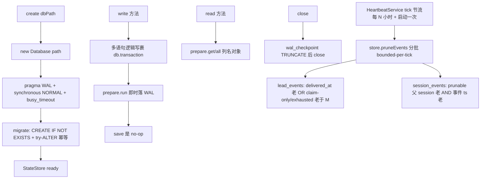

# Plan: StateStore sql.js → better-sqlite3 迁移（WASM 损坏 root-fix）

**Version**: v1.58.0 *(provisional — ship 时取空号)*
**Issue**: FLY-663
**Date**: 2026-06-29
**Source**: `doc/engineer/exploration/new/FLY-663-statestore-wasm-corruption-root-cause.md`
**Status**: codex-approved

---

> **IMPLEMENTATION SCOPE（Annie GREENLIGHT `d3d6fd2a`，2026-06-29）**：本 PR **只做治崩 = engine swap（sql.js→better-sqlite3）**。**治胖 = §2.6 retention/prune 拆成独立 backlog issue**（Lead 已建，以后有问题再做），**本 PR 不实现 prune**。下文 §2.6 / §4.3 retention / 流程图 prune 节点 / §6 的 `pruneEvents()`+`HeartbeatService` 接线 = **保留为已 Codex-approved 的设计记录**，供 backlog issue 直接落地，**本次不写代码**。本 PR 落地：§2.1-2.5、§2.7-2.9（engine + 事务 + WAL + close checkpoint + 外部读兼容 + 639 恢复合同）。

## 0. TL;DR

把 `packages/teamlead/src/StateStore.ts` 的存储引擎从 **sql.js（SQLite→WASM，每写全库 `export()`）** 换成 **better-sqlite3（原生 SQLite，增量 WAL 写）**。

- **根治**：没有 WASM 线性堆 → 损坏（`null function or function signature mismatch` / `no such table`）在结构上不可能。
- **零调用方改动**：公开方法签名 1:1 不变。
- **零数据迁移**：sql.js 写的就是标准 SQLite3 文件，better-sqlite3 原地打开生产 23.4MB 库已实测通过。
- **本 plan 必须包【两半】**（Annie + Cass + Lead 明确，2026-06-29）：
  1. **治崩** = 换 better-sqlite3（损坏结构上不可能）。
  2. **治胖** = 给 `lead_events` / `session_events` 加 **retention/prune**（留最近 N 天、更老的删、库不失控）。光换引擎只治崩、库还会一直涨。Annie 原话「这里面都是对话、没必要一直存」。**两个都要、缺一不可。**
- **范围**：`StateStore.ts` + 一个 poller 接线 + 测试（`StateStore.test.ts` 改写 + 两个裸 `store.db` cast 测试）+ WAL 副车运维文档（`fleet-provisioning-runbook.md` / `RUNBOOK.md`）。TDD。
- FLY-639 抗崩保留为休眠保险（Annie：两个都要）。

---

## 1. Root Cause（见 exploration，简述）

`save()` 每写都 `db.export()` → sql.js 的 export() = close+reopen 连接 + 整库重序列化成连续 buffer。叠加「无界表增长」+「2GB 易碎 WASM 堆（独立于系统 RAM）」→ 高频大块分配把堆碎片化/撞穿 → SQLite WASM 实例损坏。实测：20MB 库 sql.js RSS 飙 1.5GB 上爬；better-sqlite3 同 workload 206MB 库仅 614MB 平稳、快 4–5 倍。

---

## 2. 设计

### 2.1 引擎替换（镜像 in-repo `SqliteJournalStore` 约定）

```ts
import Database from "better-sqlite3";

export class StateStore {
  private db: Database.Database;
  private dbPath: string;

  private constructor(db: Database.Database, dbPath: string) {
    this.db = db; this.dbPath = dbPath;
  }

  // 保留 async 签名 → 调用方 `await StateStore.create(...)` 零改（含 :memory: 测试）
  static async create(dbPath: string): Promise<StateStore> {
    let db: Database.Database;
    if (dbPath !== ":memory:") mkdirSync(dirname(dbPath), { recursive: true });
    db = new Database(dbPath);                 // 原地打开既有库（标准 SQLite 文件）
    db.pragma("journal_mode = WAL");           // 增量写，不再全库 export
    db.pragma("synchronous = NORMAL");         // WAL 下安全 + 快（断电最多丢最后事务，可接受）
    db.pragma("busy_timeout = 5000");          // 偶发文件锁（WAL checkpoint）自动重试
    db.pragma("foreign_keys = ON");
    const store = new StateStore(db, dbPath);
    store.migrate();                           // CREATE TABLE IF NOT EXISTS + ALTER（幂等，不变）
    return store;
  }
}
```

### 2.2 API 1:1 等价映射（这是迁移的核心，逐类列全）

| 现 sql.js 用法 | better-sqlite3 等价 | 备注 |
|---|---|---|
| `db.run(sql, params)` | `db.prepare(sql).run(...params)` | params 数组 → 展开为位置参数 |
| `db.exec(ddl)`（建表/索引，无参） | `db.exec(ddl)` | 一字不改 |
| `db.prepare(sql)` + `bind` + `step` + `getAsObject` + `free`（单行） | `db.prepare(sql).get(...params)` | `.get()` 返回 **列名键对象**，与 `getAsObject()` 同形；undefined=无行 |
| 同上（多行 while step） | `db.prepare(sql).all(...params)` | 返回对象数组 |
| `db.exec(sql, params)` 返回 `[{values:[[...]]}]`（lead_events / stuck / delivery 用下标 `row[0]`） | `db.prepare(sql).all(...params)`（重写成列名访问）**或** `.raw().all()`（保留元组下标） | 见 2.3 |
| `db.getRowsModified()` | `info.changes`（`.run()` 返回值） | `claimAutoQaRecord` 用 |
| `last_insert_rowid()`（via exec） | `info.lastInsertRowid`（`.run()` 返回值） | `appendLeadEvent` 用；注意 bigint→Number |
| `db.export()` | **删除**（不再需要） | 见 2.4 save/flush |
| `new SQL.Database(bytes)` / `new SQL.Database()` | `new Database(path)` / `new Database(":memory:")` | 文件直开，无需手动 load |
| `getAsObject()` 行值类型 | better-sqlite3 INTEGER→JS number（默认非 bigint）、TEXT→string、NULL→null、BLOB→Buffer | 与 sql.js 行为一致；`codex_skip`/`founder_facing_ux` 的 `!!(x as number)` 仍成立 |

**类型细节守卫**：
- `lastInsertRowid` / `MAX(seq)` 等可能是 `bigint`（行号大时）。统一 `Number(info.lastInsertRowid)`、`Number(row.seq)`，保持现有 `number` 返回类型。better-sqlite3 默认对 ≤2^53 返回 number，但显式 `Number()` 防御。
- `db.prepare(sql).run(...arr)` 需要把现有 `[a,b,c]` 数组展开（spread）。

### 2.3 `db.exec(...)` 完整 inventory（Codex R1#5）

**铁律**：better-sqlite3 `db.exec()` 只能跑**无参、无结果**的 SQL（可多语句 DDL 脚本）；**任何带结果或带参数的查询（含 PRAGMA 读）必须 `db.prepare(...).get/all()`**。

**(a) 结果-元组下标调用点**（现用 `db.exec(sql, params)` 后 `row[0]` 下标）→ 改 `.all/.get(...params)` + **列名访问**（不再下标，防错位）：
`appendLeadEvent`(SELECT seq / last_insert_rowid)、`getRecentDeliveredEvents`、`getLastDeliveredSeq`、`isLeadEventDelivered`、`getDeliveryStats`、`getUndeliveredGuardrailEvents`、`getStuckDisposition`、`getStuckDispositionRows`、`tryClaimLeadEvent`(COUNT)。

```ts
// before: const result = this.db.exec("SELECT MAX(seq) ...", [leadId]); (result[0]?.values[0]?.[0])
// after:
const row = this.db.prepare("SELECT MAX(seq) AS m FROM lead_events WHERE lead_id=? AND delivered_at IS NOT NULL").get(leadId) as { m: number | null };
return Number(row?.m ?? 0);
```

**(b) migrate-time 的 PRAGMA / pragma_table_info 读**（Codex R1#5，**容易漏**）——这些也是结果-bearing exec：
- `migrate()`: `exec("SELECT 1 FROM pragma_table_info('sessions') WHERE name='slack_thread_ts'")`、同 `thread_id`、`exec("PRAGMA user_version")`(读) (StateStore.ts:558-580)。
- helper migrations: `exec("PRAGMA table_info(lead_events)")` / `(chat_threads)` / `(auto_qa_record)` (StateStore.ts:2992/3013/3030/3061)。
→ 全改 `db.prepare("PRAGMA table_info(X)").all()`（返回 `{cid,name,type,...}` 对象数组，用 `.name` 取列名）。

**(c) 无参 DDL**（CREATE TABLE/INDEX、ALTER、DROP、`PRAGMA user_version = 2` 写）→ 用 `db.exec(ddl)`（一字不改/合并）；单语句也可 `db.prepare(ddl).run()`。**统一用 `db.exec()` 跑 DDL**（最贴近现状、支持多语句）。

`private dbQuery(...)`（现包 `db.exec`）→ 删除（仅 `tryClaimLeadEvent` 用，内联 `.get()` COUNT）。

### 2.4 `save()` / `flush()` 语义

- **`save()`** → 变 **no-op**（保留方法，body 空 + 注释）。原因：34 处内部 `this.save()` 调用点全部保留不动 = 最小 diff；better-sqlite3 的每个 `run()` 已即时落 WAL，无需手动持久化。
- **`flush()`**（FLY-605 外部调用：`gate-poller.ts` 2 处）→ 保留方法。可选执行 `this.db.pragma("wal_checkpoint(PASSIVE)")`，或同样 no-op（WAL 已durable）。**推荐 no-op + 注释**（checkpoint 是性能/磁盘细节，非正确性；保留方法签名即可），design review 定。
- 副作用红利：FLY-639 注释里「appendLeadEvent/markLeadEventDelivered 不 auto-save、靠 flush 才 durable」的**数据丢失窗口消失**——WAL 下它们本就即时 durable。

### 2.5 FLY-639 抗崩代码（休眠保留 + better-sqlite3 恢复合同，Codex R1#7）

- `isSqlJsCorruptionError`（纯字符串匹配）→ **保留不动**（零成本、被守卫调用）。可顺手扩成认 better-sqlite3 错误码 `SQLITE_CORRUPT`/`SQLITE_IOERR`/`SQLITE_NOTADB`（`(err as {code?:string}).code`），但**不机械照搬 sql.js 语义**。
- `recoverFromCorruption(err)` → **保留方法**（3 poller `typeof===function` 守卫）。**明确恢复合同（不能像旧测试那样默默重建空库）**：
  - `:memory:`：可重建空库（仅测试用途）。
  - 文件库 **不存在**：仅当文件**真的缺失**时建新空库（合法首跑）。
  - 文件库 **存在但 malformed / NOTADB / CORRUPT**：算**恢复失败**（不静默重建空库覆盖数据）→ 计数 → 连续失败 N 次 → `onUnrecoverableCorruption`（受控 exit，launchd 带干净进程重启）。
- `onUnrecoverableCorruption` / 失败计数 / 节流 → 保留语义。
- `buildDatabaseFromDisk` → 改为 better-sqlite3 重开（`close()` 旧句柄 → `new Database(path)` → `migrate()`）；不再 sql.js module。
- `sqlModule` 字段 → 删除。
- **测试**：close 失败、reopen 失败（malformed 文件→升级，不重建空）、节流、瞬时句柄错误后成功重开。**删掉**旧的「unflushed lead event 丢失」前提（WAL 下即时 durable，前提消失）。

### 2.6 event 表 retention/prune（治胖，**本 plan 第二半，必做**）

**历史 archaeology（Annie 线索 + git log/blame 实证）**：
- `session_events` / `lead_events` **从开天辟地就没有任何 prune**（全 git 历史零 `DELETE FROM session_events` / `lead_events`）。
- Annie 记得的「历史清理改动」= **forum `conversation_threads` 的 CleanupService**，在 **FLY-163（PR #193）整个移除**了（forum 概念删除）。它清的是 **forum 线程**，从不覆盖 event 日志表 → 这就是 Annie「清理没真做好」的真相：当年的清理是 forum-only，event 表一直漏。
- `sessions` 也没 prune（Cass 看到 502 像「有清」其实是误判）——它只是天然每 run 1 行、增长慢；event 表每 run 多行、是 22MB 的大头（lead_events 14077 / session_events 6713）。

**安全 retention 设计**（治胖、又不碰 durable marker，含 Codex R4 五点修正）：

**(1) prunable 状态集合 — 绝不用 `OUTCOME_STATUSES`（R4#1）**：`OUTCOME_STATUSES` 含 **`approved_to_ship`，它是 active**（Runner 还要 ship、`getActiveSessions()` 含它、gate-poller 当 active 投递）。新增显式常量：
```ts
const PRUNABLE_SESSION_STATUSES = ["completed","approved","blocked","failed","rejected","deferred","shelved","terminated"];
// = OUTCOME_STATUSES 去掉 approved_to_ship；且天然不含 running/awaiting_review/pending
```

**(2) `session_events`（R4#2：双闸，事件自身龄 + 父 session 终态老）**：
```sql
DELETE FROM session_events WHERE rowid IN (
  SELECT se.rowid FROM session_events se
  JOIN sessions s ON s.execution_id = se.execution_id
  WHERE s.status IN (<PRUNABLE_SESSION_STATUSES>)
    AND s.last_activity_at < datetime('now','-N days')
    AND se.ts < datetime('now','-N days')          -- 事件自身也得够老，绝不删今天写的审计/marker
  LIMIT <batch>);
```
+ 孤儿兜底：`se` 无对应 `sessions` 行 且 `se.ts < now-M天`（M ≥ N，更长）才删。活跃/`awaiting_review`/`approved_to_ship` session 的事件**永不删** → founder-thread-notify-`<qid>`（`gate-poller.ts:940-947`）、FLY-191 窗口、FLY-195 disposition 审计全安全。

**(3) `lead_events`（R4#2+#3：按 `delivered_at` 计龄 + claim-only 行也要 bound）**：
- 已投递行：`delivered_at IS NOT NULL AND delivered_at < now-N天`（**用 delivered_at，不用 created_at**——`getRecentDeliveredEvents` 的 recency 就是按 delivered_at；老建但今投递的要留）。
- 未投递行**单一规则**（覆盖全部三类，R4#3 + R5#3）：
  - **保留** = 仍可重试的活候选：`delivered_at IS NULL AND event_type IN RETRYABLE_LEAD_EVENT_TYPES AND delivery_attempts < maxAttempts`。
  - **prune** = 其余所有未投递行且 `created_at < now-M天`，即 `delivered_at IS NULL AND NOT(event_type IN RETRYABLE AND delivery_attempts < maxAttempts) AND created_at < now-M天`。这一条同时 bound 了：
    - **claim-only**（`tryClaimLeadEvent`/`LeadAlertNotifier` 写的 alert 去重行，delivered_at 永 NULL、attempts=0、非 retry 类型）；
    - **exhausted retryable**（R5#3：retry 类型但 `delivery_attempts >= maxAttempts`，已 dead-letter，`getDeliveryStats` 仍记 failed）——留够 M 天给 dashboard/诊断、再删。
  - M = 较长 cap（默认 90 天，env 可配），≫ dedup/retry 窗口，删老行无害。

**(4) retention 值**：默认 **30 天**（Annie「都是对话没必要一直存」），env `FLYWHEEL_STATESTORE_EVENT_RETENTION_DAYS`；孤儿/claim cap M 默认更长（如 90 天）env 可配；总开关 `FLYWHEEL_STATESTORE_PRUNE_ENABLED`（默认 on）。

**(5) prune 机制（R4#4：分批 + bounded-per-tick + 索引，避免 event-loop 阻塞）**：
- **分批 chunked DELETE**：`... WHERE rowid IN (SELECT rowid ... LIMIT 500)` 循环（better-sqlite3 默认没编 `DELETE...LIMIT`，用 rowid 子查询）。
- **每次调用 bounded**：`maxBatchesPerRun`（如 20 批 × 500 = 1 万行/次）封顶；没删完下次 throttled tick 续删。**纠正初稿**：同步 `while` 不会自动让出 event loop，故靠「每次封顶 1 万行（毫秒级）」保证单次不长阻塞，而非靠「批间让出」。
- **加 prune 专用索引**（防反复扫表）：`lead_events(delivered_at)`（已投递龄）、`lead_events(created_at)`（claim-only/exhausted 未投递龄，R5#4）、`session_events(ts)`（事件龄）。execution_id 已有 `idx_events_execution`；sessions 已有 `idx_sessions_status`。
- prune 失败只 log 不抛（poller 已有 try/catch + FLY-639 守卫）。

**(6) 跑在哪 = `HeartbeatService`（R4#5 钉死）**：它已是 DB-maintenance 性质 owner（guardrail retry / stale checks / FLY-191 timeout）；`RunnerIdleWatchdog` 是 tmux-capture/stuck 取向、cadence 已被 env 拉长，不合适。在 `HeartbeatService.check()` 里加**节流到每 N 小时一次**的 `store.pruneEvents()` + Bridge 启动/首次 heartbeat 跑一次。**零新 timer**（piggyback 现有 poller）。不用写时触发。

> 与 §2.1：迁到原生 SQLite 后「库大」不再致命（GB 级无压力）= 治崩；retention = 治胖、让库不失控。**两半正交、都在本 plan**。

### 2.7 现有 23.4MB 生产库平滑过渡 + WAL sidecar 运维（Codex R1#4）

- **已实测**：better-sqlite3 只读打开生产 `~/.flywheel/teamlead.db` 成功（11 表、user_version=2、502 sessions / 6715 events / 14090 lead_events 全在）。
- **零转换**：首次 `create()` 直接 `new Database(同一路径)`；`migrate()` 幂等跑（全是 IF NOT EXISTS / try-ALTER），不改既有数据。
- **WAL 副车文件**：开 WAL 后生成 `teamlead.db-wal` / `-shm`，可能在 checkpoint 前**含已提交的 live 数据**。
- **`close()` 做 checkpoint**：`StateStore.close()` 改为 `pragma("wal_checkpoint(TRUNCATE)")` 后再 `db.close()` → 干净停时主库文件完整、-wal 清空。设合理 `wal_autocheckpoint`（默认 1000 页即可）。
- **运维文档必须改（Codex R1#4，扩范围）**：
  - `docs/operations/fleet-provisioning-runbook.md:104-107`（叫操作员只 copy `teamlead.db`）→ 改为「停 Bridge 后 copy `teamlead.db` + `teamlead.db-wal` + `teamlead.db-shm` 作为一个整体，或 copy 前先 checkpoint」。
  - `docs/RUNBOOK.md:205-215`（叫删 `teamlead.db-journal` 解 stale lock）→ 更新：**不要随意删 WAL 副车**（`-wal`/`-shm`），别给错误恢复指引。
- **部署切换时序**：Bridge-side 改动 → self-ship / Tier-3 Bridge 重启；旧进程（sql.js）**干净停** → 最后一次 `save()` export 完整库落盘 → 新进程（better-sqlite3）原地打开同文件、开 WAL。无数据缺口。停 Bridge 用仓内精准停法（FLY-239）。

### 2.8 多语句逻辑写 → 显式事务（Codex R1#1，**正确性必做**）

sql.js 模型下，多条 `db.run()` 只改 in-WASM 内存，**最后那次 `save()`(export) 才是持久化边界** → 一个 public method 里的多条 SQL 是「一次性原子落盘」。better-sqlite3 是**每条 run() 立即 autocommit** → 中途抛错会**durable 暴露半成品状态**（对 FLY-191 review window、FLY-245 lifecycle revision 尤其敏感）。

**规则**：任何「一个 public method 内多条 SQL = 一个逻辑 mutation」必须裹 `this.db.transaction(fn)()`。已识别需裹的：
- `upsertSession`（INSERT/UPSERT session + `stampAwaitingReviewEntry` + `bumpLifecycleRevision`，StateStore.ts:1030-1130）
- `persistTransition`（同上模式，1169-1265）
- `forceStatus`（UPDATE + stamp + bump，1406-1416）
- `upsertChatThread`（DELETE-first + INSERT/UPDATE，1940-1953）
- 实现期发现的其它 delete-then-insert/update helper。

**测试**：在两条语句之间注入抛错 → reopen 后断言**无半成品 durable 状态**（事务回滚）。

### 2.9 直接读 `teamlead.db` 的跨进程消费方（WAL 读，Codex R1#3）

这些**不经 StateStore 对象**、直接用 better-sqlite3 打开同一文件读（**已是 better-sqlite3**，已在生产读 sql.js 写的库 → 跨引擎文件兼容已验证）：
- `verify-approval.ts:144-153`（读 sessions：status/pr_head_sha/review_question_id；**FLY-175 merge 授权关键路径**，readonly + fileMustExist + fail-closed）。
- `verify-lifecycle-consent.ts:141-150`（读 lifecycle revision/project）。
- gateway 只读 state 探针（`gateway-main.ts:301-310`、`598-607`）。

**WAL 影响**：这些是 readonly 跨进程读。WAL 库的 readonly 读在 writer（Bridge）在跑、`-wal`/`-shm` 在时正常；边界风险 = Bridge 停、`-shm` 缺时 readonly 打开 WAL 库可能瞬时失败（`close()` 的 checkpoint(TRUNCATE) 让停后主库完整、-wal 空 → 缓解）。
**测试（必加）**：建文件库 WAL + 写 review/lifecycle 字段 → 验 `verifyApproval` / `verifyLifecycleConsent` / gateway 探针在 (a) Store 仍开时、(b) reopen 后 都读对。若测出瞬时锁错 → follow-up：给这些 readonly reader 加 `busy_timeout` 或去 readonly。**fail-closed 语义不变**（读失败 = notApproved，安全）。

---

## 3. 迁移流程图


*（治崩=engine 换；治胖=pruneEvents 挂 HeartbeatService、零新 timer，见 §2.6。保留：活/awaiting_review/approved_to_ship session 事件 + 活 retry 候选。）*

---

## 4. 测试计划（TDD）

### 4.1 既有测试 = 主回归网（1:1 API 不变的证明）
- 所有用 `await StateStore.create(":memory:")` 走公开 API 的测试（几十个文件：event-route / lead-events / awaiting-review-window / applyTransition / auto-qa-record / stuck-* …）**不改**，全绿 = 行为等价铁证。
- **先红后绿**：迁移前先跑全套基线存档；迁移后必须同样全绿。

### 4.2 需改的测试文件（Codex R1#6，**比初稿广**）
- **`StateStore.test.ts`（1540 行）**：
  - seed-export 用法（line 647 / 846 / 1323：`fs.writeFileSync(path, Buffer.from(seed.export()))`）→ 改为「直接建文件库 + 复用同 path 重开」。
  - 私有 DB 注入 / sql.js seed → 改 better-sqlite3。
  - FLY-639 corruption describe（line 1345-1533）：`isSqlJsCorruptionError` 单测保留；`recoverFromCorruption`/`onUnrecoverableCorruption`/`sqlModule` 注入测按 §2.5 新合同重写；**删**「unflushed lead event 丢失」前提。
- **裸 `store.db` cast 测试**（实证存在）：`awaiting-review-window.test.ts:164/172` 与 `heartbeat-review-timeout.test.ts:34` 把 `store.db` cast 成 `import("sql.js").Database` 调 `.run()` → better-sqlite3 的 Database 无 `.run()`。改法：加一个 **test-only helper**（如 `store.execForTest(sql, params)` 内部 `prepare().run()`），或把 cast 改成 `better-sqlite3` 并用 `prepare().run()`。**优先 test-only helper**，避免散落 cast。
- **`StateStore.auto-qa-record.test.ts`**：现仅用 `StateStore.create(":memory:")`（公开 API）→ **预计不改**，作回归信号；除非实跑发现行为差异。

### 4.3 新增测试
- WAL 生效（文件库 `pragma("journal_mode",{simple:true})==='wal'`）；`close()` 后 -wal 被 checkpoint(TRUNCATE) 清空。
- **事务原子性（§2.8）**：`upsertSession`/`persistTransition`/`upsertChatThread` 多语句间注入抛错 → reopen 断言无半成品 durable 状态。
- **直接读跨进程（§2.9）**：WAL 文件库写 review/lifecycle 字段 → `verifyApproval`/`verifyLifecycleConsent`/gateway 探针在 Store 仍开 & reopen 后均读对。
- 既有 sql.js 旧格式 fixture 打开 + migrate 幂等 + 数据可读（已用生产 23.4MB 库预证）。
- `lastInsertRowid`(→`Number()`) / `getRowsModified→info.changes` 等价（`appendLeadEvent` 返 seq、`claimAutoQaRecord` 返 inserted、UNIQUE 冲突返既有 seq）。
- 不再 export 的回归（save 是 no-op；大量写内存平稳，对照 harness）。
- **retention/prune（§2.6，含 R4 五点）**：
  - **`approved_to_ship` 老 session 的事件必须存活**（R4#1 回归：它是 active，不在 `PRUNABLE_SESSION_STATUSES`）；`running`/`awaiting_review`/`pending` 同理保留。
  - `session_events` 双闸：终态老 session 但有「今天写的新事件」→ **新事件留、老事件删**（R4#2）。
  - `lead_events` 按 `delivered_at` 计龄：老建+今投递的行**存活**（R4#2/#3）；未投递的 retry 活候选（RETRYABLE 类型 + attempts<max）留；claim-only（`tryClaimLeadEvent` 写、delivered_at NULL、attempts=0）老于 M 天被删（R4#3）；**exhausted retryable**（RETRYABLE 类型但 attempts≥max、never delivered）老于 M 天被删（R5#3，断言不无界、且 M 天内留给 dashboard 诊断）。
  - 孤儿事件（无对应 session）老于 M 天删。
  - bounded-per-tick：插 > maxBatches×batch 行 → 一次 prune 只删上限内、剩下下次续删（R4#4）。
  - `FLYWHEEL_STATESTORE_PRUNE_ENABLED=0` 时零删（逃生口）。
  - `HeartbeatService` owner（R4#5）：启动跑一次 + 节流每 N 小时一次 + 失败只 log。

---

## 5. 风险与缓解

| 风险 | 缓解 |
|---|---|
| 大文件单点改动出回归 | 既有几十个 public-API 测试做回归网；TDD；Codex code review；独立 QA（529 Room、restart-gated） |
| `db.exec(sql,params)` 元组下标点改错位 | 全改列名访问（不再下标）；逐点单测 |
| bigint 行号类型漂移 | 统一 `Number()` 包裹返回 |
| better-sqlite3 原生模块构建 | 已是 teamlead 依赖、在 onlyBuiltDependencies、FLY-153 已根治、sibling 已用 |
| 部署切换数据缺口 | 零转换原地开同文件；旧 Bridge 干净停（FLY-239 精准停） |
| WAL 副车文件 / 备份脚本 | 文档说明 -wal/-shm；若有备份逻辑需带上副车文件（design review 核查是否存在备份逻辑） |

---

## 6. 范围边界（防膨胀）

- **改**：
  - `packages/teamlead/src/StateStore.ts`（引擎替换 + 事务 + 恢复合同 + `pruneEvents()` retention）。
  - **`HeartbeatService`**（R4#5/R5#1 钉死，非 RunnerIdleWatchdog）加节流的 `store.pruneEvents()` 调用 + 启动跑一次，零新 timer。
  - `packages/teamlead/src/__tests__/StateStore.test.ts`（+ seed-export / FLY-639 测试改写 + retention 测试）。
  - 裸 `store.db` cast 测试：`awaiting-review-window.test.ts`、`heartbeat-review-timeout.test.ts`（test-only helper）。
  - 运维文档：`docs/operations/fleet-provisioning-runbook.md`、`docs/RUNBOOK.md`（WAL 副车说明）。
- **不改**：所有 StateStore 对象调用方（公开签名不变）；直接读 `teamlead.db` 的 verify-approval / verify-lifecycle-consent / gateway（**它们已是 better-sqlite3**，仅加测试覆盖 WAL 读，代码暂不动，除非测出锁问题→follow-up）；其它 DB（SqliteJournalStore / fleet-admin-audit 不碰）；FLY-639 poller 守卫调用。
- **不做**（明确排除，防膨胀）：不重构 schema、不改业务逻辑、不动 decisionMode/founder-consent、不删 FLY-639 抗崩；retention **绝不碰**活跃/`awaiting_review`/`approved_to_ship`/`pending` session 的事件、**绝不删仍可重试的活候选** lead_event（RETRYABLE 类型 + attempts<max）、不碰 `sessions` 表本身。**会删**（per §2.6）：terminal+老 且事件自身老的 session_events、已投递+老（按 delivered_at）的 lead_events、以及老 claim-only/exhausted-retry 的未投递 lead_events。

---

## 7. 验收

- 全套 teamlead 测试绿（含未改的几十个 public-API 测试）。
- 全仓 `pnpm lint` 绿（biome）。
- 复现 harness 重跑：better-sqlite3 路径内存平稳、无损坏（已预演）。
- 独立 QA（529 Room）：真机起 Bridge + 十几个 runner 高频读写 → 内存平稳、零 `null function`/`no such table`、数据完整、Bridge 重启后原库续读。
- founder ship-gate（Annie 懂这个 Bridge-core 改动后批）。
