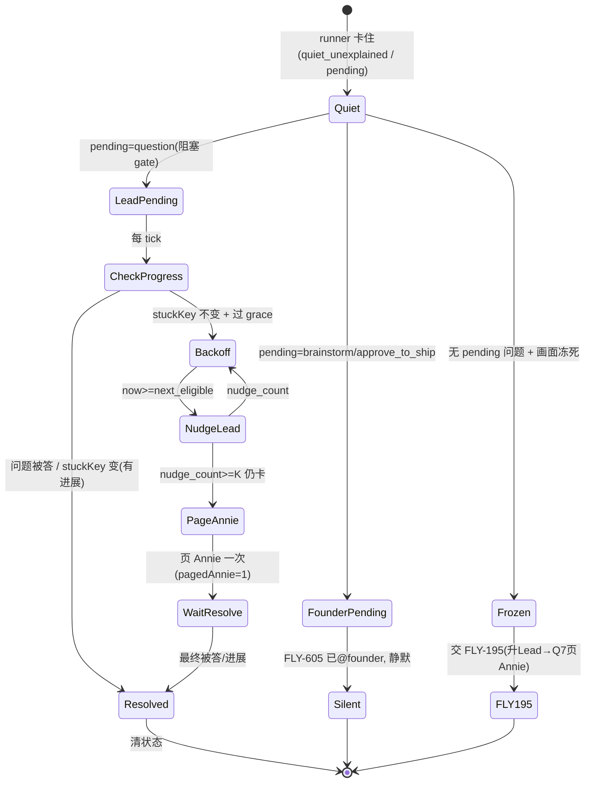

# Plan: FLY-637 扩展 — lead-pending 升级（指数退避催 Lead → 兜底页 Annie）

**Version**: v1.59.0（占位，ship 时按当时 main 重定；不进当前批次，PR #386 上扩）
**Issue**: FLY-637（扩展：report-once → 带升级的看门狗）
**Date**: 2026-06-29
**Source**: `doc/engineer/exploration/new/FLY-637-watchdog-backoff-fingerprint-quiet-registry.md`
**Status**: codex-approved（Codex design review 2 轮 APPROVED：R1 3 HIGH + 3 MED 全修、R2 2 LOW 已 fold；待 Annie 终确认阈值/页-Annie 配置后 implement；不开新 PR、在 #386 上扩。git 当前因 Xcode 许可证不可用，文档暂未 commit/move）
**基于**: direction A（report-once，已 ship PR #386）+ Annie 2026-06-29 扩范围决定 + Tadashi 架构对齐（brainstorm gate）

---

## 1. 目标与范围

direction A（report-once + 持久 dedup）已 ship。本扩展在它之上，把看门狗从「只报一次」升成「**分清 runner 等谁、该催才催**」。

审完 codebase（见 §3），真正的新增**只有一条**：**runner 用 ask/question 问 Lead、Lead 坐着没答**这个 case 现在被 `pending_gate` 整个豁免、没人催。两件相关的**已经有了、不重建**：
- founder-facing gate（brainstorm/approve_to_ship）→ **FLY-605** 已在 10min 没答时自动 @founder。
- 画面真冻死（无 pending 问题）→ **FLY-195** 已升 Lead → Q7 页 Annie。

### 非目标（明确不碰 / 不重建）
- ❌ 不重建 FLY-605 founder-relay（founder-facing gate 它管）。
- ❌ 不重建 FLY-195 StuckRunnerDetector（冻死无问题它管）。
- ❌ 不动 direction A 的 report-once 底座（quiet dedup / 持久表 / kill-switch 原样保留）。
- ❌ 不加「lead 转没转 founder」的 marker —— checkpoint type 本身就是「等谁」信号（Tadashi 确认，ad5af46f 的 marker 想法多余）。

---

## 2. 谁等谁 —— 判定依据（checkpoint type）

runner 卡住时「等谁」**完全由 pending 问题的 checkpoint 类型决定**（不需要追「lead 转没转」）：

| pending 问题 | checkpoint | runner 阻塞吗 | 等谁 | 现有归属 | 本扩展 v1 |
|---|---|---|---|---|---|
| 要 founder 批 | `approve_to_ship` / `brainstorm` | 阻塞(blocking gate) | **founder** | FLY-605 自动 @founder（10min 没答） | **静默**（不催 Lead；FLY-605 在管） |
| **阻塞问 Lead** | `question`（blocking gate） | **阻塞、真在干等** | **Lead** | 只 surface 一次（FLY-161），**不再催** | **← v1 新增：指数退避催 Lead → 兜底页 Annie** |
| 非阻塞问 Lead | 裸 `ask`（checkpoint=null，**非阻塞**） | **不阻塞、runner 继续干活** | Lead（弱） | 只 surface 一次 | **v1 不做**（见下，需额外『没进展』信号；future） |
| 无 pending 问题、画面冻死 | — | — | 没在等谁 | FLY-195 升 Lead → Q7 页 Annie | 不碰 |

> **关键收窄（Codex R1 #2 HIGH）**：裸 `ask`（checkpoint=null）是**非阻塞**的 —— runner 问完 Lead **继续干活、不等回话**（FLY-161 设计）。所以「ask 还 pending」≠「runner 卡住等 Lead」：Lead 不答、runner 仍在推进，拿它当『卡住』催 Lead/页 Annie 会**误报**。因此 **v1 只做阻塞的 `question` gate**（runner 真在 blocking 等 Lead 答）—— 这正是 Annie 说的「我跟你说一次、你停了」里的『停了』。非阻塞 `ask` 留 future（要补一个独立的『runner 真没进展』信号，如 `hasRecentMessagesFrom` / activity 时间戳，才能区分『Lead 没答但 runner 在动』）。

> founder-facing 判定与 FLY-605 同源（`founder-thread-notifier.ts::FounderGateCheckpoint = "brainstorm" | "approve_to_ship"`），两边对「谁是 founder-facing」永不漂移。

---

## 3. 现状回顾（已审实，file:line）

- **FLY-605 founder-relay**（`gate-poller.ts::maybeEmitFounderThreadFallback` L913 + `founder-thread-notifier.ts`）：仅 brainstorm/approve_to_ship；gate 超 grace（默认 10min，L887）没答 = 「Lead 漏转」→ @founder 贴 thread + 记 `founder_thread_notified` 审计 + dedup marker。
- **FLY-195 StuckRunnerDetector**（`stuck-runner-detector.ts` / `stuck-escalation.ts`）：raw 指纹 episode；硬门 2 = `pending_gate` 直接清 episode 不升级（所以等-Lead-问题被它放过）；冻死 → `runner_stuck_escalation` 给 **Lead**；Lead 5min（`LEAD_GRACE_MS`）不处置 → `createStuckUnhandledAlerter` 页 **Annie**（`runner_stuck_unhandled`）。`needs_founder` disposition 存在但只**抑制**、不路由 founder。
- **FLY-626/637 quiet classifier**：`pending_gate` 是硬豁免（不 wake）。
- **GatePoller 主循环**（L278）：逐 pending 问题 → `relayToLead`（surface 一次）+ `maybeEmitFounderThreadFallback`。**lead-facing 问题只走 relayToLead、没有再催**。← 缺口在此。

---

## 4. 设计

### 4.1 落点 —— GatePoller，FLY-605 的对称兄弟

新增 `maybeEmitLeadPendingNudge(lead, session, question, dbPath)`，在 GatePoller 主循环里**紧挨 `maybeEmitFounderThreadFallback`**（各自 try/catch，L333 旁）。对称：
- `maybeEmitFounderThreadFallback` = founder-facing 问题超 grace → 再推给 **founder**。
- `maybeEmitLeadPendingNudge`（新） = **lead-facing** 问题超 grace + 没进展 → 指数退避再推给 **Lead** → 兜底页 **Annie**。

落在 GatePoller 而非 watchdog 的理由：GatePoller 已逐 pending 问题迭代、已知 checkpoint + created_at + session、已有 per-question 退避/dedup 模式（`founderNotifyRetry`）。FLY-169 norm：不加新 timer，搭 GatePoller 现有 tick。

### 4.2 「等谁」+ 适用门（v1 = 阻塞 question gate）

`maybeEmitLeadPendingNudge` 只处理 **阻塞的 lead-facing gate question**：
- `cp === "brainstorm" || cp === "approve_to_ship"` → **return**（founder-facing，FLY-605 管）。
- `cp == null`（裸 ask，非阻塞）→ **return**（Codex R1 #2：runner 没阻塞、还在干活，v1 不催；future 需独立没进展信号）。
- `cp === "question"`（阻塞 gate）→ lead-facing 真阻塞 → 进入升级逻辑。
- 同 FLY-605 的 liveness/scope 门：`ACTIVE_SESSION_STATUSES.has(session.status)` + `matchesLead`。
- FLY-579 QA-held 不影响（那只 hold approve_to_ship = founder-facing，本路径已排除）。

### 4.3 进展判断（reset 信号）

**对一个阻塞的 `question` gate**：runner **本就在 blocking 等 Lead 答、不会自己推进**，所以「有没有进展」最强且最简单的信号就是 **这个 question 还在不在 pending**：
- question 被答（Lead 回了）→ 掉出 pending → 升级自然停 + 清状态。**这是主信号。**
- question 仍 pending → runner 仍在干等 → 继续退避催 Lead。
- 防御性 `stuck_key = sha16(questionId + "|" + session_stage)`（理论上阻塞期 stage 不变；若意外变了 = 有外部进展 → 重置，避免误催）。**不依赖 pane 指纹**（GatePoller 无 pane；且阻塞 gate 不需要）。

> 这把 Codex R1 #2 的「非阻塞 ask 会误报」问题从根上消掉：v1 只认阻塞 question gate，runner 真在等、question pending 本身就是干净的「没进展」信号，不需要去猜 runner 动没动。「Step N」= `session_stage`（无更细步号，Annie Q3 定）。非阻塞 ask 的进展信号（`hasRecentMessagesFrom` 等）留 future。

### 4.4 升级规则 ③（核心，Annie 87518d71 + Tadashi Q2）

```
lead-facing 问题 pending + stuckKey 不变（没进展）+ 已过 grace：
  指数退避催 Lead：
    nudge #1 at grace(默认 20min, Annie 定)
    nudge #2 at +2×base
    nudge #3 at +4×base …（base×2^(n-1)，封顶 ~2h）
  催到第 K 轮（默认 K=3，累计 ~70min）Lead 还不动 + stuckKey 仍不变：
    兜底页 Annie 一次（LeadAlertNotifier/AlertChannelHub 同通道，但新 eventType runner_lead_pending_unhandled / 新语义、不复用 stuck-runner 语义）
    标 pagedAnnie=true（只页一次）

founder-facing 问题 pending：静默（FLY-605 管，本路径 return）
进展（stuckKey 变 / 问题被答）：清状态、退避重置
```

- **催 Lead 的事件**：emit 新 Lead event `runner_lead_pending_escalation`，内容「runner <issue> 卡在 question gate（stage=<stage>）等你答，已 <N> 分钟没进展（第 <k> 次提醒）」。走 `appendLeadEvent` + `runtime.deliver`。**加进 guardrail/retryable event set**（Codex R1 #6：投递失败要靠 guardrail 重试、不能只指望下个退避周期；否则该催的没催到）。
- **页 Annie 兜底（Codex R1 #3 HIGH — 不复用 stuck 语义）**：**不能**直接用 `createStuckUnhandledAlerter` 的 `runner_stuck_unhandled` —— 那个 event type 会被 Cass/AutoRepairBot 当『runner 卡死』修（带 `metadata.runnerStuck` 时触发给 runner 发 continue 键),但这里 runner 没卡、是 **Lead 没答**,误触 auto-repair 会对 runner 乱发键。改成**兄弟 alerter**:用 `LeadAlertNotifier.alert` / AlertChannelHub 当投递通道,但**新 eventType `runner_lead_pending_unhandled`** + lead-pending 专属文案 + metadata **不带 `runnerStuck`**(不进 auto-repair 修复路径,走 AlertChannelHub 的 needs-human 页 Annie)。body「Lead 催了 K 轮还没答 runner <issue> 的问题」。**惊动 Annie 的阈值是 Annie HTML review 确认对象**(§7)。

### 4.5 持久化（指数退避状态，复活 exploration §3 的 backoff）

新表 `lead_pending_escalation`（StateStore，与 sessions 同 sql.js 库），**主键 `(execution_id, question_id)`**（Codex R1 #1 HIGH：一个 runner 可能有多个 pending question，按 execution_id 单键会串状态/丢催/错页）：

| 列 | 含义 |
|---|---|
| `execution_id` + `question_id` | 主键 —— 每个阻塞 question gate 独立一行 |
| `stuck_key` | 上次卡点身份 sha16(questionId+stage)，变了 = 有进展 |
| `nudge_count` | 已催 Lead 几次 |
| `last_nudge_at_ms` | 上次催的时刻 |
| `next_eligible_at_ms` | 下次允许催 = last_nudge + base×2^(count-1)（封顶） |
| `paged_annie` | 是否已兜底页过 Annie（0/1，只页一次） |

- 持久化 → Bridge 重启后退避状态不清零（不会重启就从头狂催 —— 同 direction-A 持久 dedup 精神）。
- 清行：question 被答（掉出 pending）/ runner 离开 active / stuck_key 变。prune 按 **GatePoller 当前活跃 pending question id 集**（不是 execution 集），空集守卫同 base #4。
- **持久化顺序（Codex R1 #5 MED + FLY-639 self-heal）**：先算 eligibility → **先 emit/persist 催 Lead 或页 Annie 的 user-visible 事件** → **事件被接受后才 commit 退避/页状态**（advance backoff 必须在 nudge 真发出之后，否则重启会丢一次催；event 持久了但 backoff 没 commit 会重启重发 —— 取『重启可能多催一次』而非『丢催』的安全侧,与 base 的 persisted-before-record 同精神）。新方法的 StateStore 触碰要走 GatePoller 现有 `maybeRecoverStore` self-heal（同 relay/founder-fallback 的 try/catch）。
- 方法：`getLeadPendingEscalation` / `upsertLeadPendingEscalation` / `clearLeadPendingEscalation(execId, questionId?)` / `pruneLeadPendingEscalationNotIn(activeQuestionIds)`。退避策略为纯函数 `decideLeadNudge(prevRow, stuckKey, nowMs, policy)` 可单测。

### 4.6 状态机



### 4.7 reconcile（不双重升级）

- 与 **FLY-195**：FLY-195 硬门 2 = `pending_gate` 清 episode 不升级。所以一个等-Lead-问题的 runner，FLY-195 **本就不碰**。本扩展正好补这个被放过的 case → **无重叠、无双重升级**。
- 与 **FLY-605**：本路径对 founder-facing checkpoint `return`，只管 lead-facing → **无重叠**。
- 与 **FLY-626/637 report-once**：那是 idle/stuck *wake* 的 dedup；本扩展是 *gate 问题升级*，不同通道。lead-facing 问题在 classifyQuiet 里仍是 `pending_gate`（不触发 idle/stuck wake）；升级走 GatePoller 这条独立路径。

### 4.8 开关 / byte-compat

- kill-switch `FLYWHEEL_LEAD_PENDING_ESCALATION=0` → 整条新路径关，回退现状（lead-facing 问题只 surface 一次）。默认开。
- 阈值全 env 可调：`FLYWHEEL_LEAD_NUDGE_GRACE_MS`（默认 20min, Annie 定）、`FLYWHEEL_LEAD_NUDGE_BACKOFF_FACTOR`（默认 2）、`FLYWHEEL_LEAD_NUDGE_CAP_MS`（默认 2h）、`FLYWHEEL_LEAD_NUDGE_PAGE_ANNIE_ROUNDS`（默认 3）。
- **页-Annie 兜底独立开关（Codex R1 #4 MED → §7 配置翻转）**：`FLYWHEEL_LEAD_NUDGE_PAGE_ANNIE_ROUNDS=0` **显式定义为「永不页 Annie」**（只一直退避催 Lead），单测 byte-compat。这样 Annie 若决定『只催 Lead 不惊动我』= **改一个 env 数字、不用改设计/代码**（§7 的 open item 变成配置翻转）。

---

## 5. 改动文件（预估）

| 文件 | 改动 |
|---|---|
| `bridge/gate-poller.ts` | +`maybeEmitLeadPendingNudge`（FLY-605 兄弟，独立 try/catch + `maybeRecoverStore` self-heal）+ 只认 `cp==="question"` |
| 新 `bridge/lead-pending-escalation.ts` | 纯退避策略 `decideLeadNudge` + `stuckKey` 计算 + 催 Lead emit + 页 Annie 兜底 alerter（**新 eventType `runner_lead_pending_unhandled`**，不带 `runnerStuck` metadata，不进 AutoRepairBot） |
| `StateStore.ts` | 新表 `lead_pending_escalation`（PK `(execution_id, question_id)`）+ get/upsert/clear/prune；持久化顺序：emit 后才 commit backoff |
| `bridge/plugin.ts` | 接线 env（含 `PAGE_ANNIE_ROUNDS=0`=never）+ 把 LeadAlertNotifier 传给 GatePoller |
| `bridge/hook-payload.ts` + `bridge/lead-runtime.ts` | 新 event_type `runner_lead_pending_escalation`（催 Lead）**加进 guardrail/retryable set**（R1 #6） |
| `LeadAlertNotifier.ts` + `bridge/AutoRepairBot.ts`（R2 #2） | `AlertEventType` 闭合 union 加 `runner_lead_pending_unhandled`；**不加进 `AUTO_ATTEMPT_EVENT_TYPES`**（不自动修 runner）；给它 lead-pending 专属 needs-human 文案（别落到 AutoRepairBot 默认的「no safe auto-repair」通用语） |
| 测试 | 见 §8 |

---

## 6. 阈值默认（Annie 可调）

| 项 | 默认 | 说明 |
|---|---|---|
| 起点 grace | 20 分钟（Annie 定，从 10 调高）| 等 Lead 多久没进展才第一次催 |
| 退避因子 | ×2（10→20→40→80…，封顶 ~2h） | 不刷屏 |
| 页 Annie 轮次 | 第 3 轮（累计 ~70min） | 兜底惊动 founder（**Annie 确认中**） |
| founder-facing | 永远静默 | FLY-605 管 |

---

## 7. 待确认 / open items（present 时给 Annie 终确认）

1. **页 Annie 兜底是否保留**：Tadashi Q2 决定「催 N 轮 Lead 不动 → 兜底页 Annie」（架构层 Lead 拍 + 在 Annie review 的 HTML 里）。Annie 87518d71 确认了指数退避、但重述 ③ 时**没重述页-Annie 兜底**。**本 plan 按「保留页-Annie 兜底」写为默认**（Lead Q2 + HTML 已含）。**Codex R1 #4 已把它做成纯配置翻转**：`FLYWHEEL_LEAD_NUDGE_PAGE_ANNIE_ROUNDS=0` = 永不页 Annie、只一直退避催 Lead。所以 present 时 Annie 的最终决定 = **改一个数字**（保留=3 / 不惊动我=0），不需改设计/代码。
2. **三个阈值数字**（起点 20min / ×2 / 第 3 轮页她=PAGE_ANNIE_ROUNDS=3，Annie 已定）—— Annie HTML review 给的是「确认 backoff」，具体数沿用默认、全 env 可调；present 时微调即可。

---

## 8. 测试计划（TDD）

| 层 | 断言 |
|---|---|
| `decideLeadNudge` 纯函数 | grace 前不催；首催 nudge_count=1；退避 next_eligible=last+base×2^(n-1) 封顶；stuckKey 变→重置；K 轮后 pageAnnie；**`PAGE_ANNIE_ROUNDS=0`→永不页 Annie、只一直退避催 Lead** |
| StateStore `lead_pending_escalation` | CRUD（**PK `(execId,questionId)`：同 runner 两个 question 各自独立、不串状态** R1#1）+ prune 按活跃 questionId 集 + 空集守卫 + 重启持久（reopen 不重置退避） |
| GatePoller 集成 | 阻塞 `question` gate 超 grace 没进展 → 催 Lead；退避到 K 轮 → 页 Annie 一次（pagedAnnie 防重页）；**question 被答 → 清不催**；**裸 ask（cp=null 非阻塞）→ 不催**(R1#2)；**founder-facing → 不催**（FLY-605）；kill-switch=0 → 回退只 surface 一次 |
| 投递 / 持久顺序（R1 #5/#6） | nudge 真发出后才 advance backoff（失败不 advance、靠 guardrail 重试）；**StateStore throw → maybeRecoverStore self-heal、check 不崩**（FLY-639）；重启在『已发一次 nudge』后不重风暴 |
| 兜底 alert 隔离（R1 #3） | 页 Annie 走 `runner_lead_pending_unhandled`、**不带 runnerStuck metadata** → 不触发 AutoRepairBot 给 runner 发 continue（断言 auto-repair 路径不被误触） |
| reconcile | FLY-195 不双重升级（pending_gate 它放过）；classifyQuiet 仍 pending_gate（idle/stuck 不 wake） |
| 全仓 lint + 改动包测试 |

---

## 9. 流程

draft → **Codex design review** → 改到 approved → present 给 Tadashi（转 Annie 终确认 §7）→ implement（在 PR #386 上扩、TDD）→ Codex code review → 重 QA → ship（**不进当前批次**，663/614/615/616 先走）。git 当前因 Xcode 许可证不可用 → 先 plan（本步不需 git），需 git 操作时 Lead 通知恢复。
