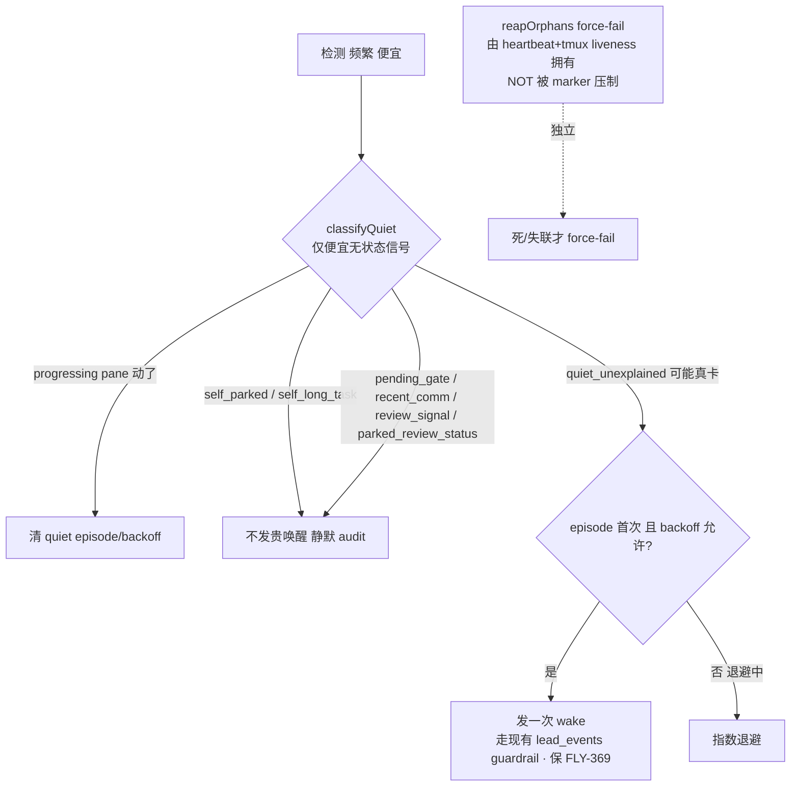

# Plan: token-frugal state-aware stall 看门狗（便宜探针 + 有意停泊不报 + backoff）

**Version**: v1.60.0（tentative — ship 时按 Codex 校准重排）
**Issue**: FLY-626
**Date**: 2026-06-27
**Source**: `doc/engineer/exploration/new/FLY-626-state-aware-stall-watchdog.md`
**Status**: implementing（Codex design review 2 轮 APPROVED；本 PR 落地核心切片，见下「实现状态」）

## 实现状态（本 PR = 核心切片，安全 + 字节兼容）

**已实现**（直接修 Annie 的反复唤醒症状，两个 advisory waker 都接）：
- §3.2 runner 自声明 marker（CommDB `runner_declared_states`，epoch-ms，readonly 容忍缺表）+ `park`/`busy`/`unpark` CLI。
- §3.1 共享 `classifyQuiet` 纯函数（仅便宜无状态信号；disposition/Q7 不进，FLY-195 raw fp 不动）+ §3.5 normalized `quietFingerprint`。
- §3.6 接 **RunnerIdleWatchdog**（`runner_idle_detected`，反复唤醒真凶）+ **HeartbeatService.checkStuck**（`session_stuck`）：legitimately-quiet runner 不再唤醒 Lead。
- 安全边界（Codex R1 #4）：`reapOrphans` force-fail + `reconcileMonitorLoss` **未碰** —— orphan/liveness 仍 heartbeat+tmux 拥有。fail-open（probe 出错仍唤醒，保 FLY-369）。`FLYWHEEL_QUIET_CLASSIFIER=0` 字节兼容逃生口。

**推迟到 follow-up**（refinement，非 blocker —— 当前切片不引入 Codex 警示的回归）：
- §3.4 StateStore `quiet_state` registry + 持久 backoff（③ 的指数退避尾部 case）+ Heartbeat 共享 pane-fingerprint。当前 HeartbeatService 用便宜 CommDB/marker 信号直判（无需 pane registry），RunnerIdleWatchdog 沿用已有 per-status episode dedup。
- §3.3 FLY-324 done-but-running reconciliation skip（park 契约 = park-not-complete → 不报 stage=completed → FLY-324 不触发；显式 skip 是健壮性增强）。
- §3.6 `session_monitoring_lost` advisory 压制 + 与 `notifiedMonitorLost` 解耦（Codex R2 LOW #2）。

---

## 1. Problem + Goal + Context（Codex 先读这段）

**Problem**：自托管 Flywheel 里，一个『idle 但还活着』的 runner（干完一单等 iterate、或在跑长任务如 codex review / 大测试套）会被 stall 看门狗反复唤醒它的 Lead。每次唤醒 = Lead 重载整段 context + 回一条 = 真金白银 token。Tadashi 一整晚在回这些假警；本周 Anthropic 额度本就紧张（剩 ~11%）。**真正费 token 的不是 idle runner（它不产 token），而是『看门狗→唤醒 Lead』这一下。**

**审计到的真相（三套并行看门狗）**：`packages/teamlead` 有三套独立 stall/idle 监控：
- `RunnerIdleWatchdog`（`RunnerIdleWatchdog.ts:163-194`，30s 抓 tmux pane，status 转换直接 → `runner_idle_detected`，无 parked-aware）；
- `HeartbeatService`（`HeartbeatService.ts:351-381`，5min 查 DB timestamp，`session_stuck` / `session_orphaned`(force-fail) / `session_monitoring_lost`）；
- `StuckRunnerDetector`（`stuck-candidate.ts:237-317` + `stuck-runner-detector.ts` + `stuck-escalation.ts`，FLY-195/253，**有** parked-aware，`stuck-candidate.ts` 开头逐字写 "Design (set by Annie's brainstorm)"）。
反复唤醒 Lead 的前两套**完全绕过了**第三套已有的便宜判断；三套都**没有「长任务」维度**。

**Goal**（Annie brainstorm 定）：正经设计 ≠ 单纯降频（FLY-628 band-aid）。要 **state-aware + 便宜探针先判 + backoff**：①便宜探针先判（终端动没动 / 停在输入框 / 有意停泊 marker）②有意停泊 → 不叫 Lead（顶多静默记一笔），真卡 → 才叫 ③同 runner 指数 backoff。**responsiveness 不掉，但停掉为「在等的 runner」反复烧 Lead token。**

**Decisions locked**：Q1（共享 quiet-aware 压制层，与 FLY-623 共用判断）；Q2 = A（park-alive：留住停泊 runner 上下文/内存，不 kill）。

**一条线（别重复造）**：FLY-628 = 降频 band-aid（PR #372，本 issue 取代）；FLY-623 = 重启重连（用本 issue 共享判断）；FLY-368 = Q7 统一 alert 投递；FLY-369 = 看门狗存在的理由（防真卡住没人发现，绝不能因压制丢掉）。

---

## 2. 核心机制：解耦『检测 cadence（便宜）』与『唤醒 Lead（贵）』

病根 = 检测一判「静默」就直接唤醒 Lead；FLY-628 只好把整个检测 cadence 拉到 ~1hr 止血（连带拖慢第 3 套，responsiveness 掉）。本 issue 在「检测」和「唤醒」之间插一层 **便宜 `classifyQuiet` 探针**：检测照常频繁跑（便宜），只有判定「真卡 + backoff 允许」才升级唤醒（贵）。→ 落地后可把 628 拉长的 poll **恢复回 responsive**，唤醒仍 token-frugal。

> **关键安全边界（Codex R1 #4）**：`classifyQuiet` 只压制**贵的唤醒/advisory 事件**（`runner_idle_detected` / `session_stuck` / `session_monitoring_lost` advisory）。**`reapOrphans()` 的 force-fail 不被 marker 压制** —— 它由 heartbeat + tmux liveness 拥有；marker 绝不能让一个**死了/失联**的 runner 永久隐身（否则丢 FLY-369 + 制造 liveness 洞）。



---

## 3. 组件设计（已 fold Codex R1 八条）

### 3.1 `classifyQuiet` —— 共享便宜探针（仅无状态信号；Codex R1 #1）

**纯函数**，新文件 `packages/teamlead/src/bridge/quiet-classifier.ts`。**只覆盖便宜、无状态的信号**，**不吞** FLY-253 disposition / Q7 状态机（那留在 detector/backoff 层，见 §3.4）：

```
classifyQuiet({
  status,
  output, priorRawFingerprint, priorQuietFingerprint,   // pane —— Layer 0
  commSignals,                  // probeCommSignalsFromCommDb → { hasPendingGate, hasRecentOutbound }
  hasPendingReviewSignal,
  declaredState,                // §3.2 runner_declared_states（parked / long_task / null）
  now,
}) → { verdict, rawFingerprint, quietFingerprint, reason }
  verdict ∈ progressing | self_parked | self_long_task
         | pending_gate | recent_comm | review_signal | parked_review_status
         | quiet_unexplained
```

判定顺序（便宜在前）：
1. **Layer 0（纯计算）**：`status ∈ awaiting_review/approved_to_ship` → `parked_review_status`（其实已被 `status='running'` 过滤，列出为完整性）。`quietFingerprint`（**归一化** pane，见 §3.5）与 priorQuietFingerprint 比 —— 变了 = `progressing`（清 episode）。`detectInputBoxPresent` = 证据。
2. **Layer 1（便宜 SQLite 读）**：`declaredState`（self_parked / self_long_task）→ 命中即静默；`pending_gate`；`recent_comm`；`review_signal`。
3. 都没解释、且停滞 ≥ 阈值 → `quiet_unexplained`（唯一升级唤醒的 verdict，受 §3.4 backoff 约束）。

**FLY-195 字节兼容（Codex R1 #1）**：`evaluateStuckCandidate()` 改为薄 wrapper 复用 `classifyQuiet` 的 Layer-0/1 + **保留其原有 raw fingerprint + disposition/Q7 调用点不变**。reverse-compat sentinel 必须覆盖：exact 行、`*` sentinel 行、过期 snooze/latch 行、re-arm、Q7 fallback —— 不只 candidate true/false。**disposition 不进 classifyQuiet 的 verdict 集**。

### 3.2 Runner 自声明 marker（专表；Codex R1 #5）

CommDB 新专表（**不复用** `stuck_dispositions`——那是 Lead 判定不是 runner 自声明；**不加** StateStore session 列存 runner 写的 intent）：

```sql
runner_declared_states(
  execution_id TEXT PRIMARY KEY, kind TEXT,           -- 'parked' | 'long_task'
  reason TEXT, created_at INTEGER, expires_at INTEGER, updated_at INTEGER)
```

- **CLI**：`flywheel-comm park [--reason] [--until]` / `busy --task <d> [--expect <dur>]` / `unpark`。默认 `execution_id = $FLYWHEEL_EXEC_ID`（**不**接受任意 `--exec-id`，除一个 loud debug/test 路径）。
- **busy 有界（Codex R1 #5）**：`--expect` 必填或默认 60m，**硬顶 4h**，提供 renew 路径；不允许无界 busy。
- **park 可无界**，但 §3.3/§3.4 保证 liveness/orphan 路径仍活（无界 park ≠ 隐身）。
- **readonly 容忍缺表（Codex R1 #5）**：`CommDB.openReadonly()` 跳过建表/迁移，Bridge reader 必须把「表不存在」当 no marker（不抛）。
- **自愈/过期**：`expires_at` 到点失效（`busy` 恒有界）；**Lead/founder 重新派活**（`flywheel-comm send` 给该 runner）清 marker → 恢复正常监控（Codex code #1，防 indefinite park 在重新唤起后仍静音 = FLY-369 保障）；显式 `unpark` 亦清。indefinite park 未被重新派活则持续到 `unpark`——其间 orphan/tmux liveness reap 始终生效，死的 parked runner 仍被 reap。

### 3.3 park ↔ FLY-324 done-but-running 对账（Codex R1 #3）

现状：`event-route.ts:1443-1489` 把仍 running 的 no-PR/no-route session 的 `stage_changed=completed` 当终态 → `running→completed`；注释明说想 parked 的 runner 不该报 stage=completed；boot sweep `done-running-reconciler.ts:30-77` 同 predicate + 仅靠手动 env exclude list 放过 parked。

**fix（robust 路径）**：effective `parked` marker 存在 → FLY-324 的 **live(event-route) + boot(reconciler) 都 skip** 该 session 的 running→completed 转换，带 audit log。结构化 marker **取代**手动 `FLYWHEEL_FLY324_SWEEP_EXCLUDE`。test-protected（parked marker 在/不在两路径行为）。

### 3.4 共享 QuietStateRegistry + backoff + 只叫一次（Codex R1 #2/#6）

**问题**：HeartbeatService 只有 StateStore timestamp、没有 pane/fingerprint/episode 状态，不能裸消费 Layer-0（否则要么每个 stuck session 多抓一次 tmux、要么 pane 在动还发 session_stuck）。

**共享 registry**（StateStore 新表，单一真相）：`RunnerIdleWatchdog`（已每 30s 抓 pane）每 execution 写：
```
quiet_state(execution_id PK, quiet_fingerprint, first_quiet_at, last_pane_changed_at,
            last_verdict, escalation_count, last_escalated_at, updated_at)
```
- **HeartbeatService 只消费 fresh 条目**（`updated_at` 在 staleness 窗口内）；否则 fallback 现有 timestamp 行为（**不**自己抓 tmux）。测试证明：Heartbeat 只在「近期 pane/marker/comm 证据解释了静默」时才压 stale `last_activity_at`。
- **backoff（③）**：`quiet_unexplained` 首次越阈 → 唤醒一次（保 FLY-369，用现有阈值）；同 episode 未处置 → base **30m ×2 cap 4h**；progress/翻态/声明/disposition → 重置 `escalation_count`。
- **只叫一次（④）+ 跨重启稳定（Codex R1 #6）**：episode dedup **不**用 `Date.now()` 内存集（重启即丢、正是 FLY-623 场景）。改为持久 `quiet_state` 或稳定 event-id `(execution_id, quiet_fingerprint, first_quiet_at)`，Heartbeat/Idle 共享。测 Bridge 在「首次 wake 与 retry 之间」重启。

### 3.5 两层 fingerprint —— 治 pane-jitter refire（Codex R1 #7）

`runner-status.ts:114-160` 和 `stuck-candidate.ts:148-150` 都对 **raw** capture 做指纹。raw 对 FLY-195 字节兼容、**但**对 626 escalation dedup：状态栏时钟 / ctx% / spinner 这类无害 TUI churn 会造出「新 episode」→ 重新放行唤醒（病根之一）。

**fix**：**FLY-195 的 raw fingerprint 不动**；**另加 normalized `quietFingerprint`**（剥掉易变状态栏/spinner 行）专供 626 escalation dedup。测真实 pane-jitter：`executing↔waiting` status 抖动在同一 parked episode 内**不**再 refire。

### 3.6 接两套看门狗 + 统一第三套

- `RunnerIdleWatchdog.checkSession`：`emitIdleEvent` 前过 `classifyQuiet`；非 `quiet_unexplained` → 不发 `runner_idle_detected` + 静默 audit + 写 `quiet_state`；`quiet_unexplained` → 过 §3.4 backoff。
- `HeartbeatService.checkStuck`：`onSessionStuck` 前查 fresh `quiet_state`（§3.4）。`reconcileMonitorLoss`/`emitMonitorLostOnce`：marker 可压 advisory，**但** tmux 每轮仍 re-probe，tmux 死 → 解压（Codex R1 #4）。**`reapOrphans` force-fail 不碰 marker**。
- `StuckRunnerDetector`：重构为复用 `classifyQuiet` 的 Layer-0/1（disposition/Q7 仍它自己），行为字节不变。

### 3.7 投递措辞（Codex R1 #8）

first-level Lead wake（`runner_idle_detected` / `session_stuck`）**复用现有 `lead_events` guardrail 投递**，不改路由；**Q7 `runner_stuck_unhandled` / 统一 alert 才走 FLY-368**。

### 3.8 实现期 guardrail（Codex R2 LOW，APPROVED 时保留）

1. **`quiet_state` freshness 窗口显式化**：常量/env-backed，= idle poll interval（30s）+ skew；stale → fallback 现有 timestamp 行为并 log fallback 原因。测 stale fallback。
2. **`session_monitoring_lost` 压制与现有 `notifiedMonitorLost` 终态位解耦**：advisory 压制用自己的 quiet/backoff 状态；每轮**必 re-probe tmux**，liveness 变化时在 orphan 处理**前**清掉 `notifiedMonitorLost` 条目 → 不让 advisory 压制顺带永久压住 stuck/reap。
3. **`runner_declared_states` 时间戳钉死 epoch ms**：`created_at/expires_at/updated_at` = epoch 毫秒；比较统一在 JS 或一致 SQL cast；含 expired-row + missing-table 测试。
4. **normalized `quietFingerprint` 严格隔离于 FLY-195 raw 语义**：fixture 测试断言 raw fingerprint 字节兼容不变 + normalized 折叠真实状态栏/spinner jitter。

---

## 4. 变更点（design-first 不写实现）

| 区域 | 文件 | 改动 |
|---|---|---|
| 共享探针 | `bridge/quiet-classifier.ts`（新）/ `bridge/stuck-candidate.ts` | `classifyQuiet` 纯函数（仅无状态信号）；`evaluateStuckCandidate` 薄 wrapper 复用、保 disposition/Q7 + raw fp 不变 |
| 自声明 marker | `flywheel-comm` `park`/`busy`/`unpark` + CommDB `runner_declared_states` 表 + readonly-tolerant reader | runner 状态契约 |
| FLY-324 对账 | `bridge/event-route.ts`、`bridge/done-running-reconciler.ts` | effective parked marker → live+boot skip running→completed + audit |
| 共享 quiet 状态 | StateStore `quiet_state` 表 | RunnerIdleWatchdog 写、Heartbeat fresh-only 读、backoff/episode 持久 |
| 两层 fp | `bridge/quiet-classifier.ts`（normalized）| 不动 raw；加 normalized quietFingerprint |
| 看门狗接线 | `RunnerIdleWatchdog.ts`、`HeartbeatService.ts`、`stuck-runner-detector.ts` | wake 前过 classifyQuiet；orphan force-fail 不动 |
| responsiveness | 628 改的 poll interval | tests 过后调回 responsive + env 逃生口（§7-5） |

---

## 5. Test plan（TDD）

- `classifyQuiet` 纯函数：每条 verdict（progressing / self_parked / self_long_task / pending_gate / recent_comm / review_signal / parked_review_status / quiet_unexplained）+ 声明过期/活动清声明。
- **FLY-195 reverse-compat sentinel**：`evaluateStuckCandidate` 复用后行为字节不变 —— 覆盖 exact / `*` sentinel / 过期 snooze-latch / re-arm / Q7 fallback（Codex R1 #1）。
- marker：park/busy/unpark 写读 + 过期 + busy 4h 硬顶 + renew + 鉴权（只写自己 execId）+ readonly 缺表当 no-marker + 跨重启存活。
- FLY-324 对账：parked marker 在 → live + boot 都 skip running→completed；不在 → 原行为（Codex R1 #3）。
- QuietStateRegistry：Heartbeat 只读 fresh、stale 则 fallback、不自己抓 tmux；只在证据解释静默时压 stale last_activity（Codex R1 #2）。
- **orphan 安全（Codex R1 #4）**：parked/busy marker 下 tmux 死 → `reapOrphans` 仍 force-fail；monitoring_lost 被压时每轮 re-probe、tmux 死即解压。
- pane-jitter（Codex R1 #7）：executing↔waiting 抖动同 episode 不 refire。
- backoff（Codex R1 #6）：首次报、30m×2 cap 4h、Bridge 在 wake↔retry 间重启仍只叫一次。
- 独立真机 QA（FLY-579 路线）：parked runner 长时间零唤醒 + 真卡 runner 仍被发现一次 + 死 runner 仍被 reap。

## 6. Byte-compat / rollout / 风险

- `classifyQuiet` 未命中 + 无声明 → 行为=现状 → reverse-compat sentinel。
- marker 默认无 = 现状；env 逃生口 `FLYWHEEL_QUIET_CLASSIFIER=0` 回旧全唤醒。
- **保 FLY-369**：③ 首次告警 + 声明过期/自愈 + orphan force-fail 独立于 marker（§3.6/#4）→ 绝不永久静音、绝不隐藏死 runner。
- **Non-goals**：不删/重写 StuckRunnerDetector（只抽共享）；不另造 first-level 投递（走 lead_events）；不实现重启重连（FLY-623）；不顺手重构相邻系统。
- 风险：runner 忘声明 → 隐式闸 + backoff 兜底（graceful degrade，最坏=一次 wake + 退避）。

## 7. 已解决的 open questions（Codex R1 答复采纳）

1. `classifyQuiet` 落点 = 新 `quiet-classifier.ts`；`evaluateStuckCandidate` 留作 compat wrapper；disposition/Q7 **不**进 classifier。
2. marker = CommDB 新专表 `runner_declared_states`；不复用 stuck_dispositions、不加 session 列。
3. backoff = 首次用现有阈值，之后 base 30m ×2 cap 4h；busy `--expect` 默认 60m 硬顶 4h + renew，不允许无界。
4. `session_monitoring_lost` = 本 issue 接 advisory 压制，**但** orphan/force-fail 仍 tmux-liveness 拥有；不在本 issue 做 heartbeat-reconnect（那是 623）。
5. FLY-628 协调 = 当前 worktree 仍 30s、无本地 628 plan 文件。若 #372 先 land，626 在 quiet-classifier/backoff tests 过后才 restore/relax interval；若没先 land，本 PR 不加 interval churn。
