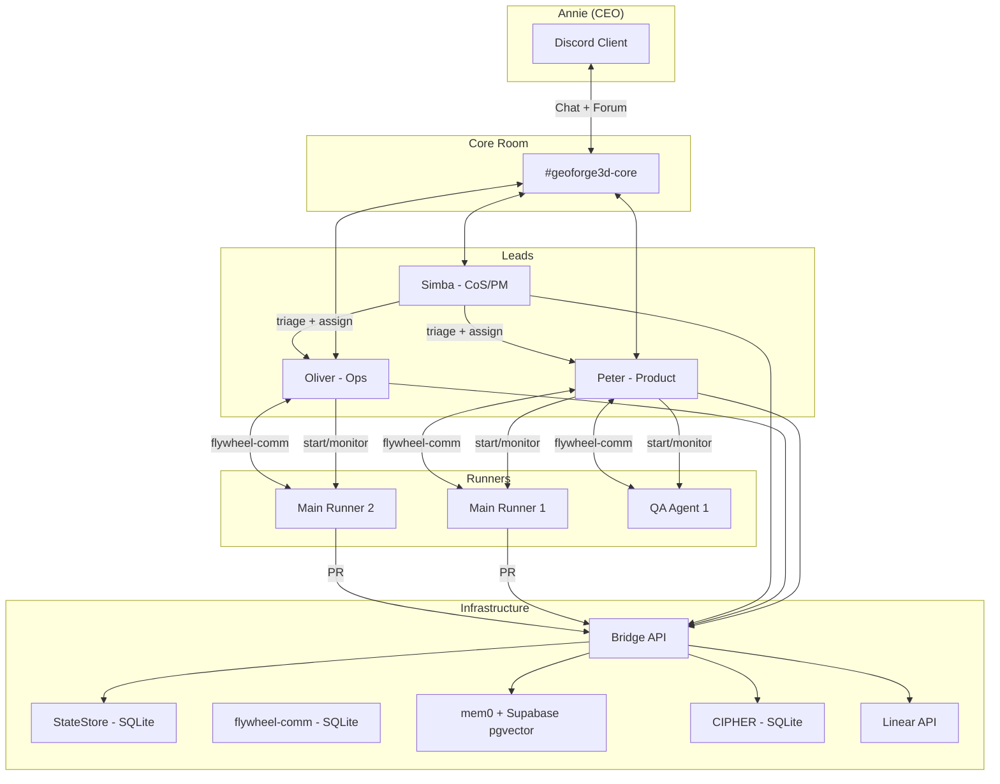
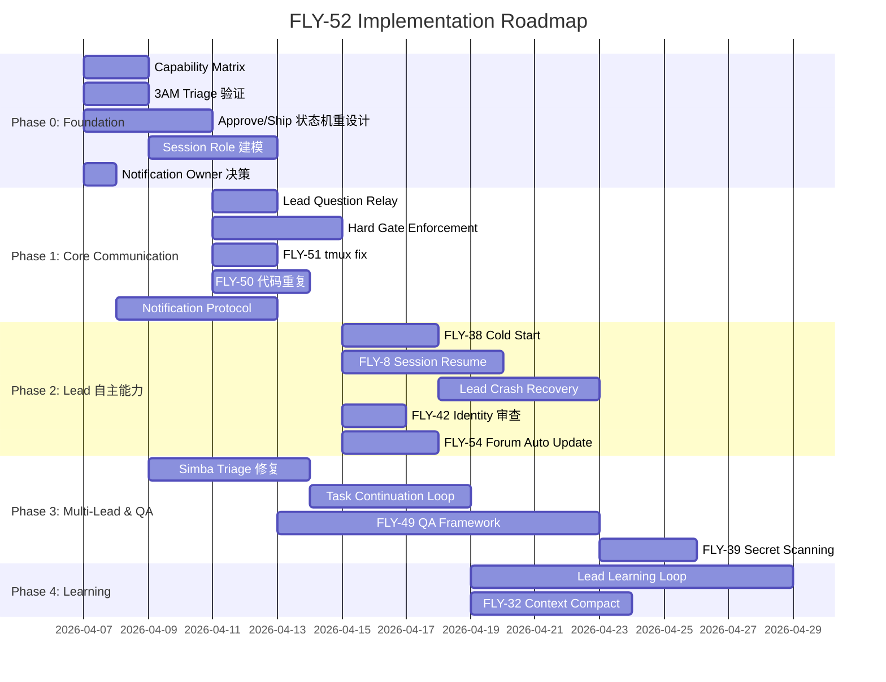

# Plan: Product Experience Implementation Roadmap

**Version**: v2.1
**Issue**: FLY-52
**Date**: 2026-04-03
**Source**: `doc/architecture/product-experience-spec.md`, `doc/engineer/exploration/new/FLY-52-product-experience-deep-design.md`
**Status**: codex-approved

---

## 1. Executive Summary

基于 FLY-52 brainstorm + architecture gap analysis，**现有架构不需要重写**。但有两个架构级问题需要先解决：

1. **approve/ship 控制点错位** — 当前 `approve` 直接 merge PR，但 spec 要求 "Annie approve → Runner ship"两步分离
2. **同 issue 多 session 模型缺失** — 当前 `issueId` 限制单活跃 session，无法支撑 Main + QA 并行

此外，需要先做 **capability inventory**（区分"已有但没用"vs"真正缺失"），避免重复造轮子。

本 plan 定义了从现状到产品体验 spec 的完整实施路径。

---

## 2. Architecture Overview

**关键数据流**：
- Annie ↔ Lead: Discord (Chat + Forum)
- Lead ↔ Lead: Discord Core Room
- Lead ↔ Runner: flywheel-comm (SQLite inbox/outbox)
- Lead ↔ Bridge: HTTP REST API
- Runner → Git: worktree isolation, PR via GitHub

---

## 3. Linear Issue Reconciliation

### 3.1 Issues to CANCEL/DEFER

| Issue | Title | Action | Reason |
|-------|-------|--------|--------|
| FLY-6 | Pod Binding | Cancel | 与 "Lead 是唯一通信通道" 设计冲突 |
| FLY-36 | Structured Shutdown Protocol | Defer | Spec 强调 crash recovery，不是 graceful shutdown |
| FLY-46 | Agent/Task State Machine Spec | Defer | 过早优化，核心 flow 稳定后再做 |
| FLY-47 | Channel Contract / Message Envelope | Defer | 当前 Discord 分轨满足 spec |

### 3.2 Issues to CONSOLIDATE

| Issues | Merged Into | Reason |
|--------|------------|--------|
| FLY-23 + GEO-289 | NEW: Task Continuation Loop | 都是 Lead 空闲后要新 task |
| FLY-48 + FLY-45 | Merge into FLY-45 | 都是 observability |

### 3.3 Issues to UPDATE

| Issue | Title | Update |
|-------|-------|--------|
| FLY-52 | Product Experience Deep Design | 标记为 source of truth |
| FLY-33 | Session Memory Extraction | 明确是 Lead 长期运行的 context 保持 |
| FLY-35 | Idle Memory Consolidation | 明确 scope |

### 3.4 New or Rescoped Work Items

> 每项标注类型：`verify existing` = 已有基础设施需验证接通；`wire existing` = 已有能力需要连接；`bugfix` = 现有实现有 bug；`net new` = 全新功能。

| # | Title | Type | Priority | Description |
|---|-------|------|----------|-------------|
| 1 | Lead Question Relay | **wire existing** | Urgent | flywheel-comm pending/respond 已有，department-lead-rules 已定义流程。缺失：Lead 自动把 Runner 问题转达到 Discord Chat 的行为接通 |
| 2 | Approve/Ship 状态机重设计 | **net new** | Urgent | 新增 `approved_to_ship` 状态，拆分 approve（只写状态）和 ship（Runner 执行 merge）。详见 §4.1 状态迁移表 |
| 3 | Session Role/Lane 建模 | **net new** | Urgent | 同 issue 多 session 支持。添加 session_role 字段贯穿全栈 |
| 4 | Hard Gate Enforcement E2E | **net new** | Urgent | 验证 3 个 gate：no merge before approve、no close before ship、no shutdown before Annie confirms |
| 5 | Notification Protocol + Event Contracts | **net new** | High | 新增 Bridge 事件类型 + producer + payload 定义。详见 §4.2 事件契约表 |
| 6 | Task Continuation Loop | **wire existing** | High | FLY-23 + GEO-289 合并。Lead identity + Simba identity 需要接通 "Runner done → ask Simba → new task" 链路 |
| 7 | Lead Crash Recovery | **verify existing** | High | supervisor loop + bootstrap + backoff 已有。先验证链路，补缺失的 Runner 状态恢复 |
| 8 | Simba 3AM Triage | **verify existing** | High | launchd plist + standup service + Simba identity 已有。先排查为什么没跑，可能是 config/bugfix |
| 9 | Lead Learning Loop & CIPHER | **net new** | Medium | Annie feedback → CIPHER pattern → 信心决策。全新功能 |

---

## 4. Implementation Phases

### 4.1 Approve/Ship 状态迁移表

**新状态**: `approved_to_ship`（在 `awaiting_review` 和 `completed` 之间）

| 旧状态 | 旧语义 | 新状态 | 新语义 |
|--------|--------|--------|--------|
| `awaiting_review` | PR 等待 review | `awaiting_review` | 不变 |
| `approved` | CEO 批准 = 已完成 | `approved_to_ship` | CEO 说了 OK，但 Runner 还没 merge |
| — | — | `completed` | Runner 执行了 merge + cleanup + shutdown |
| `failed` | 失败 | `failed` | 不变 |

**受影响模块 checklist**（`approved` → `approved_to_ship` + `completed` 拆分）：

| 模块 | 文件 | 影响 | 改动 |
|------|------|------|------|
| 状态定义 | StateStore.ts (OUTCOME_STATUSES, isTerminal) | `approved` 不再是 terminal | 更新集合定义 |
| Action 执行 | actions.ts, ApproveHandler.ts | approve 不再 merge | 重构：只写 `approved_to_ship` 状态 |
| 事件路由 | event-route.ts | `approved` 事件路由 | 添加 `approved_to_ship` 路由 |
| 事件分类 | EventFilter.ts | `approved` 分类规则 | 更新规则 |
| 事件生产 | DirectEventSink.ts | `approved` 事件生产 | 拆分为两个事件 |
| Dashboard | dashboard-data.ts | `approved` 统计 | 区分 approved_to_ship vs completed |
| Standup | standup-service.ts | `approved` 纳入完成统计 | 用 `completed` 替代 |
| Cleanup | CleanupService.ts | `approved` 触发清理 | 改为 `completed` 触发 |
| Bootstrap | bootstrap-generator.ts | `approved` 排除 | 更新排除条件 |
| Post-merge | post-merge.ts | `approved` 后执行 | 改为 `completed` 后执行 |
| Runner ship | spin.md | `:cool:` 触发 | 添加 `approved_to_ship` 状态检查 |

### 4.2 新增事件契约表

| 事件类型 | Producer | 触发时机 | Payload | Consumer |
|---------|----------|---------|---------|---------|
| `pr_created` | Runner stage report (`stage set pr_created`) | Runner 创建 PR 后 | `{executionId, issueId, prNumber, prUrl}` | EventFilter → Chat 通知 Annie |
| `approved_to_ship` | Bridge actions.ts (approve handler) | Annie approve 后 | `{executionId, issueId, approvedBy, approvedAt}` | EventFilter → 通知 Runner 可以 ship |
| `runner_question` | flywheel-comm ask command → Bridge event | Runner 问 Lead 问题时 | `{executionId, issueId, questionId, content}` | EventFilter → Chat 通知 Annie |
| `qa_pass` | QA Agent stage report | QA 全部测试通过 | `{executionId, issueId, qaAgentId, testedSha, reportPath}` | EventFilter → Chat 通知 Annie "可以 review" |
| `qa_failed` | QA Agent stage report | QA 发现 product_bug | `{executionId, issueId, qaAgentId, failureCount, reportPath}` | EventFilter → 路由到 Main Runner 修 bug |
| `ship_completed` | Runner post-merge | Runner 完成 merge + cleanup | `{executionId, issueId, mergedPrNumber}` | EventFilter → Chat 通知 Annie "已 ship" |

### 4.3 Implementation Mapping: 语义事件 ↔ Transport ↔ 投递目标

> 区分三层：**语义事件**（product spec 定义的业务含义）、**实际 transport**（Bridge 里的 event_type 或 stage_changed payload）、**投递链路**（事件最终到达谁、经过什么路径）。

| 语义事件 | 实际 Transport | stage_changed payload 变更 | 投递链路 | Producer 文件 |
|---------|---------------|---------------------------|---------|--------------|
| `pr_created` | `stage_changed` (stage=`pr_created`) | 已在 VALID_STAGES / STAGE_ORDER 中。**需扩展 payload**：添加 `pr_number`, `pr_url` 字段 | Bridge → Lead runtime → Lead 在 Chat 通知 Annie | `packages/flywheel-comm/src/commands/stage.ts` (扩展 payload schema) |
| `ship_completed` | `stage_changed` (stage=`ship`) | `ship` 已在 STAGE_ORDER 中，语义改为 "ship completed"（原义模糊）。**需扩展 payload**：添加 `merged_pr_number` | Bridge → Lead runtime → Lead 在 Chat 通知 Annie | `packages/flywheel-comm/src/commands/stage.ts` |
| `approved_to_ship` | **新增 event_type** `approved_to_ship`（不复用 stage_changed，因为这是 Bridge action 产生的，不是 Runner 上报的） | N/A — 独立事件 | Bridge → Lead runtime → **Lead 通过 flywheel-comm send 通知 Runner** | `packages/teamlead/src/bridge/actions.ts` (refactored approve handler emit) |
| `runner_question` | **新增 event_type** `runner_question` | N/A — 独立事件 | flywheel-comm ask 写 DB → **新增 Bridge webhook/hook** → Lead runtime → Lead 在 Chat 问 Annie | `packages/flywheel-comm/src/commands/ask.ts` (添加 Bridge 通知 hook) |
| `qa_pass` | `stage_changed` (stage=`qa_pass`) | **新增到 VALID_STAGES**：`qa_pass` 加入 stage 集合。Payload 扩展：`qa_agent_id`, `tested_sha`, `report_path` | Bridge → Lead runtime → Lead 在 Chat 通知 Annie "可以 review" | `packages/flywheel-comm/src/commands/stage.ts` (QA Agent 调用) |
| `qa_failed` | `stage_changed` (stage=`qa_failed`) | **新增到 VALID_STAGES**：`qa_failed` 加入 stage 集合。Payload 扩展：`qa_agent_id`, `failure_count`, `report_path` | Bridge → Lead runtime → **Lead 通过 flywheel-comm send 通知 Main Runner 修 bug** | `packages/flywheel-comm/src/commands/stage.ts` (QA Agent 调用) |

**关键设计决策**：

1. **stage_changed payload 扩展**：当前 `flywheel-comm stage set` 只发 `{stage}`。需要扩展为 `{stage, metadata: {...}}` 形式，让 `pr_number`/`tested_sha`/`report_path` 等字段可以携带。改动文件：`packages/flywheel-comm/src/commands/stage.ts` payload 构造 + `packages/teamlead/src/bridge/event-route.ts` stage_changed handler 解析 metadata。

2. **qa_pass/qa_failed 加入 STAGE_ORDER**：`packages/teamlead/src/bridge/stage-utils.ts` 的 `VALID_STAGES` 和 `STAGE_ORDER` 需要扩展。`qa_pass` 和 `qa_failed` 在 `pr_created` 之后、`ship` 之前。注意：`qa_failed` 不推进 stage（允许回退到 `pr_created` 后重新到 `qa_pass`）。

3. **投递目标始终是 Lead runtime，不新增直达 Runner 通道**：所有事件先到 Lead，Lead 再决定是否通过 flywheel-comm 转达给 Runner。这保持了 "Lead 是唯一通信通道" 的 spec 原则。`approved_to_ship → Runner` 和 `qa_failed → Main Runner` 都由 Lead 中转。

4. **`ship` stage 语义澄清**：`ship` = "Runner 完成了 merge + cleanup"（ship completed），不是 "开始 ship"。开始 ship 由 `approved_to_ship` 事件触发。

**Phase checklist 更新**（受 transport mapping 影响的额外文件）：

| Phase | 额外文件 |
|-------|---------|
| Phase 0 | `stage-utils.ts`（添加 qa_pass/qa_failed 到 VALID_STAGES）、`hook-payload.ts`（扩展 metadata 字段） |
| Phase 1 | `stage.ts`（payload schema 扩展）、`event-route.ts`（stage_changed handler 解析 metadata）、`ask.ts`（添加 Bridge 通知 hook） |
| Phase 3 | QA Agent 使用扩展后的 `stage set qa_pass/qa_failed` |

### Phase 0: Foundation — Capability Inventory + Architecture Fixes (Urgent — 1 week)

> 目标：搞清楚什么已经有了、什么真正缺失；修复两个架构级问题。

| Item | 具体工作 | 文件变更 | 复杂度 |
|------|---------|---------|--------|
| **Capability Matrix** | 对照 product spec 每条需求，分类为：infra exists / prompt rules exist / deployed & wired / spec-aligned。区分 "真正缺失" vs "有但没用" | 新文档 | S |
| **3AM Triage 验证** | 不是新功能，是运维验证。检查：launchd plist 是否加载、bot token 是否正确、standup message 是否触发 Simba triage、Simba 是否在 Core Room 完成讨论。确定是 bugfix 还是 config 还是新功能 | launchd plist, Simba identity.md | S |
| **Approve/Ship 状态机重设计** | 当前 `approve` 直接 merge PR（ApproveHandler.execute → gh pr merge）。Spec 要求 Annie approve → Runner ship 两步。需要：新增 `approved_to_ship` 状态，`approve` action 只写状态不 merge，Runner /spin ship 阶段才执行 merge | StateStore.ts, ApproveHandler.ts, actions.ts, spin.md | M |
| **Session Role/Lane 建模** | 同一 issue 需要 Main + QA 两个并发 session。添加 `session_role` 字段（main/qa/review），贯穿 RunDispatcher inflight map、POST /api/runs/start 409 检查、resolve-action 查询、Lead 事件展示 | StateStore.ts, run-dispatcher.ts, runs-route.ts, ActionExecutor.ts | M |
| **Notification Owner 决策** | 选定：`pr_created`/`qa_pass`/`qa_failed`/`runner_question` 等是升格为 Bridge 事件（EventFilter 单一真相），还是 Lead 侧轮询/推理。**建议：Bridge 事件**，因为 Lead 轮询不可靠且难以测试 | EventFilter.ts, event-route.ts, 决策文档 | S |

### Phase 1: Core Communication (Urgent — 1-2 weeks)

> 目标：Lead 能跟 Annie 正确沟通、能管理 Runner、能强制执行 gate。
> 前置：Phase 0 完成。

| Issue | 具体工作 | 文件变更 | 复杂度 |
|-------|---------|---------|--------|
| **Lead Question Relay** | 验证 department-lead-rules.md 已有 flywheel-comm pending/respond 流程。缺失的是：Lead 自动把 Runner 问题转达到 Discord Chat 的行为。补充到 identity.md | identity.md (Peter/Oliver) | S |
| **Hard Gate Enforcement** | 基于 Phase 0 的新状态机，更新 spin.md ship 阶段：check `approved_to_ship` 状态 → 才执行 merge。Lead identity.md 更新 approve 行为 | spin.md, identity.md | M |
| **FLY-51** | Runner tmux 不自动关闭 | TmuxAdapter.ts | S |
| **FLY-24** | Forum Post 创建（验证是否仍有问题） | DirectEventSink.ts | S |
| **FLY-50** | 代码重复消除 | retry-dispatcher.ts, run-infra.ts | M |
| **Notification Protocol** | 基于 Phase 0 的 owner 决策，实现双轨通知。如果选 Bridge 事件：添加 `pr_created`/`runner_question` 等事件类型到 EventFilter | EventFilter.ts, event-route.ts | M |

### Phase 2: Lead 自主能力 (High — 2-3 weeks)

> 目标：Lead 能独立运行、crash recovery、管理多 Runner。

| Issue | 具体工作 | 文件变更 | 复杂度 |
|-------|---------|---------|--------|
| **FLY-38** | Lead Cold Start 脚本 | claude-lead.sh | M |
| **FLY-8** | Session Resume design spike | 调研 Claude Code --session-id | M |
| **Lead Crash Recovery** | 验证已有能力（supervisor loop + bootstrap endpoint + backoff）。补充缺失的：resume 后重建 Runner 状态、恢复进行中的对话 | claude-lead.sh, bootstrap-generator.ts | M |
| **FLY-42** | Identity.md 过度约束审查 | identity.md (all Leads) | S |
| **FLY-43** | restart-services.sh 修复 | restart-services.sh | M |
| **FLY-44** | Lead 一步关闭 session | Bridge API + identity.md | M |
| **FLY-54** | Runner 状态自动更新 Forum Post | ForumTagUpdater.ts, stage tracking | M |

### Phase 3: Multi-Lead & QA (Medium — 2-3 weeks)

> 目标：Simba 自动 triage、Lead 间协调、QA Agent 集成。
> 前置：Phase 0 的 session_role 建模和 3AM triage 验证。

| Issue | 具体工作 | 文件变更 | 复杂度 |
|-------|---------|---------|--------|
| **Simba Triage → 执行链路** | 基于 Phase 0 验证结果，修复/补全 3AM → Simba triage → Core Room 讨论 → Annie 确认 → 分发的完整链路 | cos-lead/identity.md, 可能需要 standup-service 修复 | M |
| **Task Continuation Loop** | Runner done → Lead → Simba → new task | identity.md (all), flywheel-comm handler | M |
| **FLY-49 QA Agent Framework** | 基于 Phase 0 的 session_role 建模，实现 Main + QA 并行启动、bug relay loop、QA PASS gate | RunDispatcher, runs-route, identity.md | L |
| **FLY-39** | Secret Scanning for Memory | memory-route.ts, PII filter | M |

### Phase 4: Learning & Growth (Low — ongoing)

> 目标：Lead 从 Phase 1（问 Annie）进化到 Phase 2（自主决策）。

| Issue | 具体工作 | 文件变更 | 复杂度 |
|-------|---------|---------|--------|
| **Lead Learning Loop** | CIPHER 接入 Lead 决策；Annie correction → memory | CIPHER integration, identity.md | L |
| **FLY-32** | Context Compact 策略 | PostCompact hook, memory injection | M |
| **FLY-33** | Session Memory Extraction | mem0 integration | M |
| **FLY-41** | 4-Phase Prompt | identity.md workflow | M |

---

## 5. Critical Path

---

## 6. Architecture Decisions Needed

| 决策 | 选项 | 建议 | 理由 |
|------|------|------|------|
| 多 Runner per Issue | A) session_role/lane 字段贯穿全栈; B) 只改 inflight key | **A** | Codex review 指出：需要在 dispatcher、StateStore 查询、resolve-action、Lead 文案全部区分 main/qa |
| Approve vs Ship 控制点 | A) approve 只写状态，Runner ship 执行 merge; B) 保持现状（approve 直接 merge） | **A** | Spec 明确要求 "Annie approve → Runner ship" 两步。现状直接 merge 违反 spec |
| 新状态 | 在 `awaiting_review` 和 `approved`(现=completed) 之间加 `approved_to_ship` | **加** | 区分 "Annie 说了 OK" 和 "PR 已经 merge 完" |
| 3AM Triage | A) 新建 scheduler; B) 先验证已有 launchd + standup 链路 | **B 先** | 3AM 基础设施已有（launchd plist + standup service + Simba identity），先排查为什么没跑 |
| Notification Owner | A) Bridge 事件（EventFilter 单一真相）; B) Lead 侧轮询 | **A** | Lead 轮询不可靠且难测试；升格为 Bridge 事件后可以统一路由 |
| Question Relay 时机 | A) 立即转达; B) 批量 | **A** | Annie 说随时可以被打扰 |

---

## 7. Validation Plan（按 Phase 拆分）

### Phase 0 验收
- [ ] Capability Matrix 文档产出，每条 spec 能力有明确分类
- [ ] 状态迁移表实现：`approved_to_ship` 状态可用，受影响模块全部更新
- [ ] Session role 字段：同 issue 可启动 main + qa 两个 session
- [ ] 3AM triage 链路诊断完成（bugfix / config / 或确认需新功能）

### Phase 1 验收
- [ ] **问题转达**：Runner 问 Lead → Lead Chat 问 Annie → Annie 回答 → Lead 转 Runner
- [ ] **Hard gate**：Runner 创建 PR → approve 只写 `approved_to_ship` → Runner check 状态 → merge
- [ ] **首帖通知**：Runner 启动 → Forum post 创建 → Chat 通知 Annie（不含中间 update）
- [ ] **失败处理**：Runner 失败 3 次 → Lead Chat 告诉 Annie + 详细说明

### Phase 2 验收
- [ ] **Forum 持续更新**：中间阶段自动更新到 Forum post
- [ ] **Lead crash recovery**：Lead 挂了 → 自动重启 → 恢复状态 → 继续
- [ ] **执行 flow（不含 QA）**：Lead 启动 Runner → Forum post → 中间 update → PR → Annie approve → ship

### Phase 3 验收
- [ ] **早会 flow**：Simba 3AM triage → Core Room 讨论 → Annie 确认 → 分发
- [ ] **QA 集成**：PR 后 → QA Agent 测试 → bug relay loop → QA PASS → Annie review
- [ ] **Task 循环**：Runner 完成 → Lead 问 Simba → Simba 分配新 task
- [ ] **完整 E2E**：从早会到 ship 的全链路
