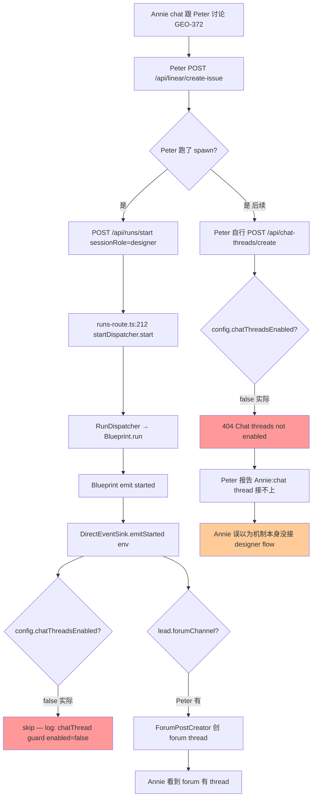

# Research: FLY-147 Codebase Audit — Chat-driven Issue + Auto Discord Thread

**Issue**: FLY-147
**Date**: 2026-05-07
**Source**: `https://linear.app/geoforge3d/issue/FLY-147`
**Status**: Step A audit (pre-Q&A)
**Worker**: worker-fly-147

---

## 0. Audit 范围

完整把"Annie 在 chat 跟 Lead 聊天 → Lead 起 issue → spawn Runner → 期望自动有 Discord thread" 这条链路上**所有**已存在的代码 surface 摸一遍,得出:

1. 现有 thread auto-create 真实在哪儿 wire 的(5W1H)
2. Annie 列出的 path (a/b/c/d) 各自要改哪些文件、几行
3. 每条 path 的破坏面(尤其是不能 break engineer Runner)
4. GEO-372 designer Runner 失败的真 root cause(已经 confirm — Bridge log 实证)
5. 基于 audit 才能问的 substantial 深问题(≥6 条) for Annie

下面逐条用 `wc -l` + `grep` + 实际文件 line 号说话,不凭印象。

---

## 1. Codebase 实证 Inventory

### 1.1 真正涉及 chat thread 的 source 文件 + 行数

```
runs-route.ts                 305 lines   /api/runs/start endpoint
tools.ts                      637 lines   /api/chat-threads/{create,register} + /chat-threads
ChatThreadCreator.ts          280 lines   2-step Discord create + idempotent dedup
chat-thread-register.ts       210 lines   shared validation (project/lead/channel/Discord verify)
chat-thread-utils.ts           85 lines   archiveChatThread + removeUserFromChatThread
DirectEventSink.ts            571 lines   bridge-internal emitStarted auto-create (line 177-230)
ForumPostCreator.ts           135 lines   平行机制(forum thread, 不 gate)
plugin.ts                    1885 lines   wires QueryRouter + RunsRouter + linear/create-issue
StateStore.ts                (chat_threads table line 405 + CRUD line 1226-1298)
ProjectConfig.ts              332 lines   LeadConfig.chatChannel(必填)
ExecutionEventEmitter.ts      253 lines   EventEnvelope schema (sessionRole 在 line 15)
Blueprint.ts                  (BlueprintContext.sessionRole line 76; ctx 传 line 152)
run-dispatcher.ts             (RunDispatcher.start sessionRole 透传 line 92-98)
retry-dispatcher.ts            ~58 lines  IStartDispatcher 接口 (line 53-57)
chat-thread-routes.test.ts    498 lines   现有测试覆盖
chat-thread-register.test.ts  (~100 lines)
total ≈ 4108 lines
```

### 1.2 prod projects.json (实证)

```json
[{
  "projectName": "geoforge3d",
  "leads": [
    { "agentId": "product-lead", "chatChannel": "1485787822894878955",
      "match": { "labels": ["Product"] }, "botTokenEnv": "PETER_BOT_TOKEN",
      "forumChannel": "1485787822119194755" },
    { "agentId": "ops-lead",     "chatChannel": "1485789342541680661",
      "match": { "labels": ["Operations"] }, "botTokenEnv": "OLIVER_BOT_TOKEN",
      "forumChannel": "1485789340989915266" },
    { "agentId": "cos-lead",     "chatChannel": "1487340532610109520",
      "match": { "labels": ["PM"] }, "botTokenEnv": "SIMBA_BOT_TOKEN" }
  ]
}]
```

**关键事实**:
- 每个 Lead 有**独立** chatChannel(不是共享 `#product-chat`)
- `chatChannel` 是**必填**(`ProjectConfig.ts:130-135` 强校验)
- `forumChannel` 可选(`ProjectConfig.ts:118-127`,cos-lead 没有 forum channel)
- 标签匹配用 `resolveLeadForIssue` (`ProjectConfig.ts:266-289`):**第一个匹配 lead 胜出**;无标签默认第一个 lead("general" match)

GEO-372 标签是 `["designer", "Product", "current-sprint"]` → `Product` → product-lead 拿走 → designer Runner 在 Peter 的 chatChannel 创 thread(若 flag 开)。

---

## 2. 现有 Thread Auto-Create 的 5W1H

> 重点:**Forum Post 跟 Chat Thread 是两套独立机制,经常被混淆**(Annie 看到 engineer Runner 有 thread,实际是 Forum thread,不是 chat thread)。

### 2.1 Forum Post Thread(engineer 现状)

| 5W1H | 答案 |
|---|---|
| **Who** | `ForumPostCreator` 单例 (`packages/teamlead/src/bridge/ForumPostCreator.ts`) |
| **Where wired** | `DirectEventSink.emitStarted()` line 127-175 (fire-and-forget) |
| **When** | session_started event,Blueprint.run 进入起跑后立即 |
| **What** | Discord Forum channel(独立频道类型)里的一个 post(post 本身就是 thread)|
| **Why** | Per-issue dashboard,带 status tag 自动更新 |
| **How (gate)** | `lead.forumChannel?` 存在 + 有 botToken。**不 gate** `chatThreadsEnabled` flag |
| **Idempotent?** | 是,通过 `ForumPostCreator.ensureForumPost` + StateStore.threads 表查重 |

**结论**: engineer Runner 之所以"有 thread",是因为 product-lead/ops-lead 配了 forumChannel,Forum Post 自动建。Designer Runner 也走这条(同样的 emitStarted 路径),但 designer 没专门 forum,Annie 看不到→ 认为 designer 缺 thread 机制。

### 2.2 Chat Thread (FLY-91, 现状 OFF in prod)

| 5W1H | 答案 |
|---|---|
| **Who** | `ChatThreadCreator` 单例 (`packages/teamlead/src/bridge/ChatThreadCreator.ts:31`) |
| **Where wired (in-process)** | `DirectEventSink.emitStarted()` line 177-230 (**await**, 不是 fire-and-forget) |
| **Where wired (out-of-process)** | `tools.ts:487-613` POST `/api/chat-threads/create` |
| **When (in-proc)** | session_started,跟 Forum Post 平行触发 |
| **When (out-of-proc)** | Lead 主动调,任何时候(包括 issue 还没 spawn Runner) |
| **What** | Discord 普通 text channel 里 message → thread (2-step: POST message + POST thread from message) |
| **Why** | Per-issue conversation thread,Annie 在主 chat channel 不被 issue 噪音淹没 |
| **How (gate)** | **三层 gate**:`chatThreadsEnabled` flag + `chatThreadCreator` constructed + `lead.chatChannel` + botToken resolves |
| **Idempotent?** | 是,`inflight` Map (key=`issueId:channelId`) + StateStore `chat_threads` 表 (UNIQUE index `idx_chat_threads_issue_channel`,见 `StateStore.ts:415`)|

**Discord 2-step 流程** (`ChatThreadCreator.ts:97-149`):
1. POST `${DISCORD_API}/channels/${chatChannelId}/messages` → 拿 messageId
2. POST `${DISCORD_API}/channels/${chatChannelId}/messages/${msgId}/threads` → 拿 threadId
3. `store.upsertChatThread(threadId, channelId, issueId, leadId)`
4. `addThreadMember(threadId, ownerUserId)` (Annie 加入侧栏)

5s `AbortController` timeout,fail-open(返回 `{created:false, error}` 不 throw)。

### 2.3 sessionRole 在 chat thread 创建路径上的现状

```
runs-route.ts:218
  startDispatcher.start({..., sessionRole: role})
↓
run-dispatcher.ts:92
  ctx: BlueprintContext = { ..., sessionRole: req.sessionRole }
↓
Blueprint.ts:152
  env: EventEnvelope = { ..., sessionRole: ctx.sessionRole }
↓
DirectEventSink.emitStarted(env)
  // line 82: store sessionRole on session row
  // line 177-230: chat thread creation — DOES NOT INSPECT sessionRole
```

**结论:`sessionRole` 在当前 chat thread 触发逻辑里完全 inert。** 只用于 session row metadata + 后续 retry/dedup gating。改动 sessionRole 行为只需要在 `emitStarted()` 加一个 `if (env.sessionRole === ...)` guard。

### 2.4 Bridge log 实证(prod GEO-372)

```
[RunInfra] geoforge3d: ForumPostCreator created, hasRegistry=true,
            hasGlobalBotToken=false, chatThreads=false
[DirectEventSink] chatThread guard: enabled=false hasCreator=false
            — skipping for GEO-372
```

`config.chatThreadsEnabled === false` → endpoint 404 + emitStarted skip。**不是代码 bug,是 env 没传到 Bridge process。**

`~/.flywheel/.env` 里有 `TEAMLEAD_CHAT_THREADS_ENABLED=true`,但当前 prod Bridge 不是通过 `daily-standup.sh`(它会 source env)起来的。`scripts/run-bridge.ts` 自己**不 source `~/.flywheel/.env`**(audit `scripts/run-bridge.ts` 全文 — 0 处 source/env 加载),靠调用方 shell 已经 export。这是 deployment fragility,不是 logic bug。

---

## 3. 4 Path 改动面分析(实证)

### Path (a): `/api/runs/start` 默认创 thread,opt-out via `chat_thread: false`

**已存在的部分**:

- `runs-route.ts:226-243` — 已经 polls `chatThreadId` 并 return,**已经在等 chat thread**
- `DirectEventSink.emitStarted()` line 177-230 — 已经 sessionRole-agnostic,任何 sessionRole spawn 都走相同 chat thread auto-create

**还差什么(代码改动估算)**:

| 改动 | 文件 | 估算行数 |
|---|---|---|
| body 接受 `chat_thread?: boolean`(默认 true) | `runs-route.ts` | +10 |
| `IStartDispatcher.StartRequest` 加 `chatThread?: boolean` | `retry-dispatcher.ts` | +2 |
| `RunDispatcher.start` 透传 `chatThread` 到 `BlueprintContext` | `run-dispatcher.ts` | +2 |
| `BlueprintContext.chatThread?: boolean` | `Blueprint.ts` | +2 |
| `EventEnvelope.chatThread?: boolean` + Blueprint 构造 env 透传 | `ExecutionEventEmitter.ts` + `Blueprint.ts:140-152` | +4 |
| `emitStarted()` 加 guard `if (env.chatThread === false) skip` | `DirectEventSink.ts:180` | +3 |
| 测试 | `chat-thread-routes.test.ts` + new e2e | +50 |

**真正的"打开"动作**: 还得**取消** `chatThreadsEnabled` 这道 gate(否则 path (a) 形同虚设),或保证 prod 启动 env 可靠。两条路都要选。

**破坏面**:
- engineer Runner: 当前 prod 是 `chatThreadsEnabled=false` → 之前没创 chat thread。flag 一打开,会**额外**在 product-lead/ops-lead 各自 chatChannel 创 thread。**Annie 是否预期这个改变?**(下面 Q1)
- 现有测试有 `chat-thread-routes.test.ts:115-145` "returns 404 when disabled" 三条,删 flag 后这些 case 要重写
- ChatThreadCreator 已 idempotent → 现有 thread 不会被覆盖

**Edge cases**:
- 同一 issue main + qa 双 spawn → idempotent 复用同一 thread(测试 case 已有)
- `chat_thread:false` opt-out 真正的 use case 是什么?worker 想不到。YAGNI 风险。

---

### Path (b): `/api/chat-threads/create` 独立 endpoint,Lead 主动调

**已存在的部分**:

- endpoint 完整 (`tools.ts:487-613`)
- 接受 `issueId` (UUID) **或** `issueIdentifier` (字符串)(line 502-512)
- Linear preflight 验证 issue 存在 + 解析 (line 525-573)
- 共享 `validateChatThreadParams` (`chat-thread-register.ts:48-81`)

**还差什么**:

| 改动 | 文件 | 估算行数 |
|---|---|---|
| 删 `chatThreadsEnabled` flag gate (line 488-491) | `tools.ts` | -5 |
| 同样删 `/api/chat-threads/register` (line 419-422) 的 gate | `tools.ts` | -5 |
| 同样删 GET `/api/chat-threads` (line 616-619) 的 gate | `tools.ts` | -5 |
| `config.ts:128-129` 删 flag definition + types.ts:31 | `config.ts` + `types.ts` | -4 |
| `DirectEventSink.ts:180` + `:228` 同步删 `chatThreadsEnabled` 检查 | `DirectEventSink.ts` | -10 |
| 调整 4 处 `RunnerIdleWatchdog.ts:213` / `HeartbeatService.ts:371` / `RunnerIdleWatchdog.ts:31` | 多文件 | -8 |
| 测试 disabled-case 重写(3 处 in `chat-thread-routes.test.ts`) | tests | ±30 |

**破坏面**:
- 完全独立 endpoint,不影响 Runner spawn 路径
- Lead prompt 已经写了"何时调"(`department-lead-rules.md:122-156`)→ 解锁 Lead 立即可用
- ChatThreadCreator 单例: 删 flag 后**永远** construct(`run-infra.ts:312`),内存增加可忽略

---

### Path (c): Lead 系统 prompt 协议补丁

**已存在的部分**(在 `~/.flywheel/lead-rules/product-lead/department-lead-rules.md`):

- line 122-143:"discussing an issue but no `chat_thread_id` available → POST /api/chat-threads/create"
- line 145-149:"proactively create thread when received task assignment"
- line 153-156:"failure → fall back to chatChannel"
- line 215-249:"run GEO-XX → POST /api/runs/start" 但**没**说"我自己起的 issue 怎么办"

**还差什么**(prompt-only,0 code):

加一条具体协议:
> "When you call `POST /api/linear/create-issue` 之后:
>   - 如果立刻要 `POST /api/runs/start`,Bridge 自动创 thread(从 response 拿 chatThreadId)
>   - 如果暂时**不**起 Runner(只讨论/搁置),立刻 `POST /api/chat-threads/create` 把 thread 开起来,把 `Linear issue created at <thread-link>` 在 thread 里发"

**找 prompt source**(audit):
- `~/.flywheel/lead-rules/product-lead/` 是 staging 目录,被 `claude-lead.sh` 拷贝
- 真正 source: 通过 `claude-lead.sh` 的 `Shared rule staged: department-lead-rules.md` 提示,可能从 GeoForge3D `.lead/product-lead/identity.md` 派生(`/Users/xiaorongli/Dev/GeoForge3D/.lead/product-lead/identity.md`,Lead 启动日志 line 17 有写)
- **需要进一步 audit**: `department-lead-rules.md` 的 source repo(可能在 flywheel 仓里,可能在 product 仓里)

**破坏面**: 0 code,prompt fidelity 风险(Lead 可能漏)。

---

### Path (d): Per-project flag `auto_create_chat_thread: true`

**改动**:

| 改动 | 文件 | 估算行数 |
|---|---|---|
| `LeadConfig` 加 `autoCreateChatThread?: boolean`(默认 true) | `ProjectConfig.ts:5-39` + 验证 | +8 |
| `DirectEventSink.emitStarted()` 检查 `lead.autoCreateChatThread === false` 时 skip | `DirectEventSink.ts:180` | +3 |
| 文档 `~/.flywheel/projects.json` schema | `SETUP.md` + `projects.json` 注释 | +5 |
| 测试 | new test file | +30 |

**破坏面**: 默认 true → 现有项目无需改 config。但 flag 维度增加(目前已有 chatThreadsEnabled global + 拟引入的 per-project)→ 配置面多一维度。

**实际收益评估**:
- 当前 1 个 prod project (geoforge3d) + 4 个 test slot
- Lead 维度的开关已经能通过"不配 chatChannel"实现(虽然 chatChannel 是必填,可改为可选)
- 真正"per-project"的 use case 要等 multi-project 时(>2 prod 项目),**现在做提前优化**

---

## 4. 隐藏 trade-offs(audit 才能发现的)

### 4.1 Sync vs Async thread create

`DirectEventSink.emitStarted()` 对 Forum Post 是 **fire-and-forget**(line 146-167:`.then(...).catch(...)`),对 Chat Thread 是 **await**(line 198-209)。

**为什么 chat 要 await?**(注释 line 177-179):
> "FLY-91: Await chat thread creation so first notification includes chat_thread_id. Unlike ForumPost (fire-and-forget), chat_thread_id doesn't affect EventFilter classification, so awaiting is safe and ensures first message goes to thread."

**意义**: chat thread create 失败 / Discord rate limit / 网络慢 → emitStarted 阻塞最多 5s(`CREATE_TIMEOUT_MS`)。Bridge `/api/runs/start` 整个 round-trip 受影响。

**对 path (a) 的含义**: 默认开 chat thread,prod load 上去后 every Runner spawn 多 ~1-3s 延迟(Discord API 真延迟)。Annie 能接受?

**对 path (b) 的含义**: Lead 主动调 `/api/chat-threads/create` → Lead 阻塞最多 5s(Lead 跑在 Claude session,5s OK)。

### 4.2 Bot token 不一致风险

`/api/chat-threads/create` (`tools.ts:576`) 用 `validation.leadConfig.botToken ?? opts?.globalBotToken`。
`emitStarted` (`DirectEventSink.ts:189`) 用 `ctLead.botToken ?? this.config.discordBotToken`。
ChatThreadCreator (`ChatThreadCreator.ts:172`) 用 `addThreadMember` 加 owner = `discordOwnerUserId` (Annie's user ID)。

**风险**: 不同 Lead 不同 botToken → thread 在 Peter 的 channel 创建,Peter 的 bot 拥有,但 Simba 想 reply → Simba 的 bot 没权限 PATCH 那个 thread。**已存在 issue 还是新风险?**

**实证**: bot 通常需要 channel 的 SEND_MESSAGES + MANAGE_THREADS 权限。如果 channel 配了多 bot 权限,OK;如果只给 Peter bot,Simba 想跨发就挂。

**对 path (a/b) 的含义**: chat thread 一旦创建,只有该 Lead 的 bot 能跨进 reply。Annie 不会 mind(她在那个 channel 也是 Peter 在跟她说话),但 cross-Lead handoff(Simba → Peter → Oliver)可能挂。

### 4.3 issueIdentifier vs issueId 不一致

- `runs-route.ts:108-124`:Linear preflight 同时拿 title 和 identifier
- `tools.ts:541-568`:`/chat-threads/create` 接受 identifier OR UUID
- Lead chat 上下文里只有 identifier(`FLY-91`),Lead 起 issue 后 response 给 UUID
- `chat_threads` table key 是 `(issue_id, channel_id)` UNIQUE → identifier 重复 OK,但 identifier 重命名后 mapping 不会跟

**含义**: 实现时统一用 UUID 作 key,identifier 仅做 Lead-friendly display(已经这么做了)。

### 4.4 Multi-Lead 同 issue 并发 spawn

`ChatThreadCreator.inflight` Map key 是 `${issueId}:${chatChannelId}` → **per-channel** 去重。
若 Lead-A 起 main runner、Lead-B 同时起 qa runner,labels 同样会被 `resolveLeadForIssue` 解析到同一个 lead → 同 channel → idempotent OK。
**但**: 如果 Annie 手动改了 issue label,导致 second spawn 解析到 *不同* lead → 不同 channel → 创两个 thread。

**含义**: 罕见,但 multi-Lead 项目要注意。当前 1 prod project + 1 lead per label,无风险。

### 4.5 Thread lifecycle: archive/unarchive race

`post-ship-finalization.ts:180-194`:session 完成后 `removeUserFromChatThread` + `archiveChatThread` (Annie 侧栏消失)。
Discord 行为:archived thread 收到新消息会自动 unarchive。
**对 path (a) 的含义**: 如果 Annie 在 archive 后再发,thread 自己复活,无问题。但 Lead 端 prompt 怎么处理?currently 没明示。

### 4.6 prod env 加载链(deployment 实证)

| 谁起 Bridge | 是否 source env | 实证 |
|---|---|---|
| `daily-standup.sh:21` | ✅ 有 `source $ENV_FILE` | grep 实证 |
| `scripts/run-bridge.ts` 直接 `npx tsx`(手起 / launchd) | ❌ 不 source | grep 实证全文 0 处 |
| `flywheel-lead-wrapper.sh:31` | ✅ 有 `source $ENV_FILE` | 但只 wrap Lead,不 wrap Bridge |

**结论**: prod Bridge 当前是手动 `npx tsx scripts/run-bridge.ts` 起来的,shell env 不一定 export 了 `TEAMLEAD_CHAT_THREADS_ENABLED`。无 wrapper / launchd plist for Bridge → fragile。

**FLY-147 应不应该顺便修?**(Q5 见下)

---

## 5. GEO-372 Root Cause(完整链)



**真因**:

1. **架构层**: chat thread 跟 forum thread 是两套独立机制,Annie 的"engineer Runner 有 thread" = forum thread,不是 chat thread
2. **配置层**: prod Bridge 的 `chatThreadsEnabled` flag 是 false(env 没加载)
3. **认知层**: Annie 看到 forum 有 / chat 没有,以为是 designer-vs-engineer 差异;实际是 forumChannel-vs-chatChannel 配置差异
4. **设计意图层**: FLY-91 chat thread 其实**就是为这个场景设计的**,只是 prod 没启用

---

## 6. 实现路径推演

> **Worker 这里只列出实证可行的组合,不下定论**(等 Annie Q&A 回完再 Plan)。

### 组合 1: 最小化("修部署 + path b 永远开")
- 删 `chatThreadsEnabled` flag (path b 永远可用)
- 修 prod Bridge 启动方式(让它 source env, 或干脆删 flag)
- Lead prompt 不动(已经写过)
- DirectEventSink 加 chat thread auto-create(path a 默认)
- 工作量: ~80 行 code, 1 个 deployment script 改

### 组合 2: ("config-flag 化 + per-project")
- 引入 path (d) per-project flag,默认 true
- 删 global flag
- DirectEventSink 检查 lead.autoCreateChatThread
- 工作量: ~50 行 code,projects.json schema 升级

### 组合 3: ("body opt-out + 全局开")
- 删 global flag
- `/api/runs/start` 接受 `chat_thread:false`
- 透传 BlueprintContext → EventEnvelope → emitStarted gate
- 工作量: ~80 行 code(透传链路长)

**Worker 倾向**: 组合 1(最少新概念,最大复用)。但 Annie 决定。

---

## 7. ≥6 substantial 深问题(Q&A round 1)

> 这些问题都是 audit 后才能问出来的,不是"a 还是 b"那种表面问题。

### Q1 — "engineer Runner 有 thread"的 Annie 实际看到的是 forum 还是 chat?

Audit 实证: prod Bridge `chatThreads=false`,所以**没有任何 chat thread 被创建过**。Annie 在 GEO-371 等 issue 看到的"thread",100% 是 product-lead 的 forum channel(`#1485787822119194755` 一个独立 forum-type channel)里的 forum post — 那个 channel 本身就是 thread-only 的论坛频道。

**问题**: 你 (Annie) 现在期望的"chat thread" 是 (i) forum channel 里的 post(已存在), 还是 (ii) chatChannel(`#product-chat` 等普通 text channel)里的 message thread (FLY-91 设计的, 但 prod 没开)?

如果只是 (i),FLY-147 实际是 designer Lead 没配 forumChannel 的问题,2 行 config 改动就解决。
如果是 (ii),那是 chat thread 整套要在 prod 真打开,工作量 ~80 行 code + deployment fix。

### Q2 — chatChannel 现状 = 三个 Lead 三个独立 channel; 如果 path (a) 默认开, 你会被什么淹没?

实证: product-lead chatChannel = `#1485787822894878955`(我猜 = `#product-chat`), ops-lead = `#1485789342541680661`, cos-lead = `#1487340532610109520`。每个 Lead 独立。

如果 path (a) 默认开:
- 每个 issue spawn → 在 owning Lead 的 chatChannel 多一个 thread
- product-lead 一周可能 spawn 10-20 issues → product-lead 的 chat channel 每周多 10-20 个 thread tab

**问题**: 你 (Annie) 嫌乱还是欢迎? 如果嫌乱, 我们要不要 (i) 只在 issue 有特定 label (e.g. `discuss`) 时才创, (ii) 或交给 Lead 自己判断 (path c only), (iii) 或都开 + 用 Discord 自己的 thread 折叠 UI?

### Q3 — Sync vs Async thread create 的延迟代价你接受吗?

实证: `emitStarted()` 对 chat thread create 是 **await**(否则首条 notification 路由不进 thread)。Discord API 真延迟 ~1-3s, fail timeout 5s。

意思是: **每个 Runner spawn 的 `/api/runs/start` round-trip 增加 ~1-3s**。

**问题**: 接受吗? 还是改成 fire-and-forget(代价: 第一条 notification 可能落 chatChannel top-level 而不是 thread, 用户体感差)?

### Q4 — 多 sessionRole(main / qa / designer / 自定义)是不是真都要 thread? Opt-out body field 真有 use case 吗?

Acceptance 条款 1 说"任何 sessionRole spawn 都能配套 chat thread"。

实证: 当前 sessionRole 是 free-form string,不固定枚举。Worker 想到的可能 opt-out case:
- 短任务 / 静默 batch job(e.g. `sessionRole: "lint-fix"` 只跑 5 分钟自动 ship,不需要讨论)
- daily-standup 触发的 cron-like spawn(已有 standup-route)

**问题**:
(i) 这些场景实际存在? 还是都假设走 main / qa, 一律开 thread 就行?
(ii) 如果存在 opt-out, 你倾向 body field (`chat_thread: false`) 还是按 sessionRole 白名单 (`["main","qa","designer"]`)?

### Q5 — prod Bridge env 加载方式 = ad-hoc shell, 没 wrapper. FLY-147 顺便修?

实证: `daily-standup.sh` source env, `flywheel-lead-wrapper.sh` source env(给 Lead 用), 但 Bridge 自己没专属 wrapper / launchd / source。

实际后果: 任何 env 改动后, Bridge 必须用 source 过的 shell `npx tsx scripts/run-bridge.ts` 重启, 否则改动不生效。这是 GEO-372 失败的最终因。

**问题**: FLY-147 范围内顺便加一个 `flywheel-bridge-wrapper.sh` + launchd plist? (额外 ~40 行 shell + 一个 plist) 还是单独开 issue (FLY-148?) 处理?

### Q6 — Lead 起 issue 但不 spawn Runner 的"discussion-only" 真实场景多吗? 决定 path (b) 必要性

Acceptance 条款 2 说"Lead 在 chat ad-hoc 起 issue 也能配套 thread"(手动也行, 但 path 必须打通)。

如果 Annie 99% 时间是"起 issue → 立即 spawn Runner", 那 path (a) 默认开就够, path (b) 不用强调。
如果常出现"起 issue 后想再讨论 / 等更多信息 / 排队", 那 path (b) Lead 主动调 `/api/chat-threads/create` 必须教 Lead。

**问题**: 你 (Annie) 实际多大概率会让 Lead 起 issue 后**不立刻** spawn Runner?

### Q7 (bonus) — Cross-Lead handoff 时, thread 归谁? Bot token 限制是否有现实问题?

Audit 实证: thread 由 owning Lead 的 bot 创建。其他 bot 想 cross-post 需要 channel-level 权限 (SEND_MESSAGES + MANAGE_THREADS)。

**问题**: 你目前的 Discord channel 给所有 bot 同等权限了吗? (Peter / Oliver / Simba 在彼此的 channel 都能发?) 如果没, cross-Lead handoff 场景会挂在 Discord API 401。

---

## 8. Open follow-up audit 项(Q&A 回完再做)

- 如果走 path (b) 删 flag: `RunnerIdleWatchdog` / `HeartbeatService` 里 4 处 `chatThreadsEnabled` 引用要 trace 一遍, 确保不是 logic gate 而是 metadata gate
- prompt source repo: 找到 `department-lead-rules.md` 的真正 master(可能 in flywheel `.flywheel/lead-rules/...` 模板, 也可能在 GeoForge3D `.lead/.../identity.md` 拼接), 才能 path (c) 改 master 而不是只改 staging copy
- discord 权限实证: list channel permission 看 cross-Lead bot 能否 post

## 9. References(实证 line refs)

- `packages/teamlead/src/bridge/runs-route.ts:18-289` — POST /api/runs/start full
- `packages/teamlead/src/bridge/tools.ts:418-637` — chat-threads endpoints
- `packages/teamlead/src/DirectEventSink.ts:127-230` — Forum + Chat 双路径
- `packages/teamlead/src/bridge/ChatThreadCreator.ts:31-280` — 2-step create + idempotent
- `packages/teamlead/src/bridge/chat-thread-register.ts:48-209` — shared validation
- `packages/teamlead/src/bridge/chat-thread-utils.ts:1-86` — archive + remove member
- `packages/teamlead/src/bridge/post-ship-finalization.ts:180-194` — terminal-state cleanup
- `packages/teamlead/src/StateStore.ts:405-415, 1226-1298` — chat_threads schema + CRUD
- `packages/teamlead/src/ProjectConfig.ts:5-39, 266-289` — LeadConfig + resolveLeadForIssue
- `packages/teamlead/src/config.ts:128-129` — flag def
- `packages/teamlead/src/bridge/types.ts:31` — flag in BridgeConfig
- `packages/edge-worker/src/ExecutionEventEmitter.ts:4-16` — EventEnvelope schema
- `packages/edge-worker/src/Blueprint.ts:51-83, 140-152` — BlueprintContext + env build
- `packages/teamlead/src/bridge/run-dispatcher.ts:92-98, 301-307` — RunDispatcher start/retry both pass sessionRole
- `~/.flywheel/projects.json` — prod 3-Lead config
- `~/.flywheel/.env` — has flag set
- `~/.flywheel/lead-rules/product-lead/department-lead-rules.md:112-249` — Lead protocol
- `~/Dev/flywheel/scripts/daily-standup.sh:15-21` — env source
- `~/Dev/flywheel/scripts/run-bridge.ts:1-78` — no env source
- `/tmp/flywheel-bridge.log` — chatThreads=false log evidence
