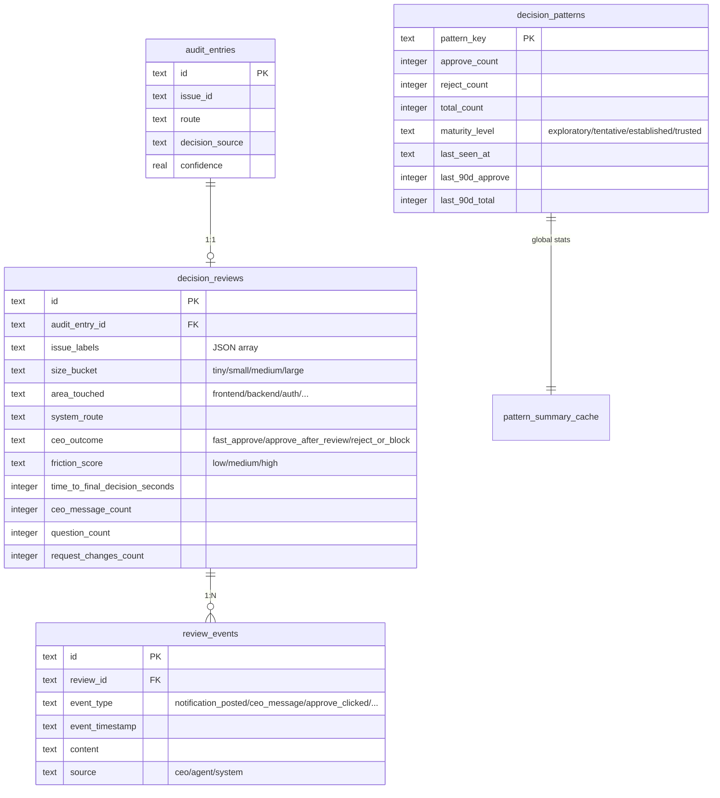
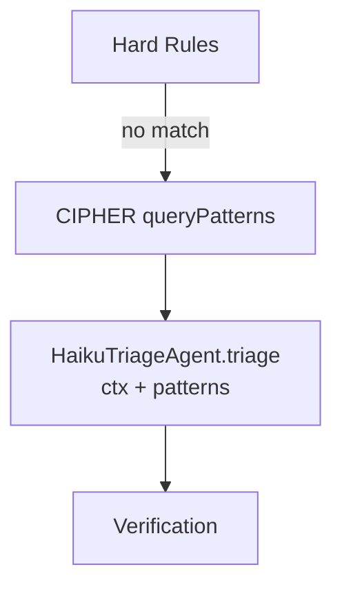

# Research: CIPHER Phase 1 Implementation — GEO-149

**Issue**: GEO-149
**Date**: 2026-03-15
**Source**: `doc/engineer/exploration/new/GEO-149-cipher-decision-memory.md`

## 1. Schema Design

### 概览

三张新表扩展现有 AuditLogger SQLite (sql.js)：



### CREATE TABLE 语句

```sql
-- Table 1: CEO 审核记录（一个审核 = 一行）
CREATE TABLE IF NOT EXISTS decision_reviews (
  id TEXT PRIMARY KEY,
  audit_entry_id TEXT NOT NULL UNIQUE,
  issue_id TEXT NOT NULL,
  issue_identifier TEXT NOT NULL,
  project_id TEXT NOT NULL,

  -- Issue 快照（决策时）
  issue_labels TEXT NOT NULL,              -- JSON array
  size_bucket TEXT NOT NULL,               -- tiny|small|medium|large
  area_touched TEXT NOT NULL,              -- frontend|backend|auth|test|config|mixed

  -- 系统推荐
  system_route TEXT NOT NULL,              -- auto_approve|needs_review|blocked
  system_confidence REAL NOT NULL,
  system_reasoning TEXT,
  decision_source TEXT NOT NULL,

  -- CEO 结果
  ceo_outcome TEXT NOT NULL,               -- fast_approve|approve_after_review|reject_or_block
  friction_score TEXT NOT NULL,            -- low|medium|high
  ceo_action_timestamp TEXT NOT NULL,

  -- Deliberation 信号
  time_to_first_response_seconds INTEGER,
  time_to_final_decision_seconds INTEGER,
  ceo_message_count INTEGER DEFAULT 0,
  question_count INTEGER DEFAULT 0,
  request_changes_count INTEGER DEFAULT 0,
  thread_turn_count INTEGER DEFAULT 0,

  -- Thread 引用
  slack_thread_ts TEXT,
  reason_code TEXT,                        -- scope_too_large|missing_test_evidence|...
  reason_comment TEXT,

  created_at TEXT NOT NULL DEFAULT (datetime('now'))
);

CREATE INDEX IF NOT EXISTS idx_reviews_issue ON decision_reviews(issue_id);
CREATE INDEX IF NOT EXISTS idx_reviews_outcome ON decision_reviews(ceo_outcome);
CREATE INDEX IF NOT EXISTS idx_reviews_created ON decision_reviews(created_at);

-- Table 2: 审核事件流
CREATE TABLE IF NOT EXISTS review_events (
  id TEXT PRIMARY KEY,
  review_id TEXT NOT NULL,
  event_type TEXT NOT NULL,
  event_timestamp TEXT NOT NULL,
  content TEXT,
  metadata TEXT,                           -- JSON
  source TEXT NOT NULL,                    -- ceo|agent|system
  FOREIGN KEY (review_id) REFERENCES decision_reviews(id)
);

CREATE INDEX IF NOT EXISTS idx_events_review ON review_events(review_id);

-- Table 3: Pattern 统计
CREATE TABLE IF NOT EXISTS decision_patterns (
  pattern_key TEXT PRIMARY KEY,
  approve_count INTEGER NOT NULL DEFAULT 0,
  reject_count INTEGER NOT NULL DEFAULT 0,
  total_count INTEGER NOT NULL DEFAULT 0,
  maturity_level TEXT NOT NULL DEFAULT 'exploratory',
  first_seen_at TEXT NOT NULL,
  last_seen_at TEXT NOT NULL,
  last_90d_approve INTEGER DEFAULT 0,
  last_90d_total INTEGER DEFAULT 0
);

-- Table 4: 全局统计缓存
CREATE TABLE IF NOT EXISTS pattern_summary_cache (
  id TEXT PRIMARY KEY DEFAULT 'global',
  global_approve_count INTEGER DEFAULT 0,
  global_reject_count INTEGER DEFAULT 0,
  global_approve_rate REAL DEFAULT 0.5,    -- 初始无偏先验
  prior_strength INTEGER DEFAULT 10,
  last_computed_at TEXT NOT NULL DEFAULT (datetime('now'))
);
```

### 与现有 AuditLogger 的关系

- `decision_reviews.audit_entry_id` 一对一关联 `audit_entries.id`
- CIPHER 表存在**同一个 SQLite 数据库文件**中（`~/.flywheel/audit.db`）
- AuditLogger 的 `init()` 方法扩展，增加 CIPHER 表创建
- 现有 `audit_entries` 完全不变

## 2. 统计算法

### Beta-Binomial 平滑

为什么不用原始频率：1/1 approve = 100%？贝叶斯方法加入"先验假设"——等于说"在看到实际数据之前，先假设这个 pattern 和全局基线差不多"。

```typescript
/**
 * Beta-Binomial 后验均值。
 * prior 锚定到全局 approve rate，防止小样本过度自信。
 */
function posteriorMean(
  approveCount: number,
  totalCount: number,
  globalRate: number,
  priorStrength: number = 10,
): number {
  const alphaPrior = priorStrength * globalRate;
  const betaPrior = priorStrength * (1 - globalRate);
  return (approveCount + alphaPrior) / (totalCount + alphaPrior + betaPrior);
}
```

例子（全局 approve rate = 50%，prior strength = 10）：
- 1/1 approve → `(1+5)/(1+10) = 54.5%`（不是 100%）
- 5/5 approve → `(5+5)/(5+10) = 66.7%`
- 10/10 approve → `(10+5)/(10+10) = 75%`
- 50/50 approve → `(50+5)/(50+10) = 91.7%`（数据足够，prior 影响小）

### Wilson Lower Bound

后验均值是"最佳猜测"。Wilson lower bound 是"在 90% 置信度下，最保守的估计是多少？"

```typescript
/**
 * Wilson score 区间下界。
 * 只有下界 > 全局基线时才认为这个 pattern 有意义。
 */
function wilsonLowerBound(
  successes: number,
  total: number,
  confidence: number = 0.90,
): number {
  if (total === 0) return 0;
  const z = confidence === 0.90 ? 1.645 : 1.96;
  const pHat = successes / total;
  const z2 = z * z;
  const n = total;
  const numerator = pHat + z2 / (2 * n)
    - z * Math.sqrt((pHat * (1 - pHat) + z2 / (4 * n)) / n);
  return Math.max(0, numerator / (1 + z2 / n));
}
```

**注入判断规则**：只有 Wilson lower bound 显著偏离全局基线时才注入：
- `lowerBound > globalRate` → 这类 PR CEO 比平均更容易 approve
- `upperBound < globalRate` → 这类 PR CEO 比平均更容易 reject
- 否则 → 无显著差异，不注入

用 **90% 置信度**（z=1.645），因为小样本下 95% 太严格。

### Pattern 成熟度

| 级别 | 样本数 | 行为 |
|------|--------|------|
| `exploratory` | < 10 | 只记录，不注入 prompt |
| `tentative` | 10-19 | 可注入，但标注"弱参考" |
| `established` | 20-49 | 正常注入 |
| `trusted` | >= 50 | 强参考（但 Phase 1 不自动决策） |

## 3. Pattern Family 设计

12 个维度，全部从现有 `ExecutionContext` 提取，零新数据源：

| 维度 | 来源 | 值域 | 例子 |
|------|------|------|------|
| `primary_label` | `ctx.labels[0]` | bug/feature/refactor/test/docs/chore/other | "bug" |
| `size_bucket` | `linesAdded + linesRemoved` | tiny(<20)/small(20-100)/medium(100-500)/large(500+) | "small" |
| `area_touched` | `changedFilePaths` 分析 | frontend/backend/test/config/docs/mixed | "backend" |
| `tests_only` | 全部文件是测试 | true/false | false |
| `auth_touched` | 文件路径含 auth/secret/credential | true/false | false |
| `infra_touched` | 文件路径含 docker/ci/deploy | true/false | false |
| `exit_status` | `ctx.exitReason` | completed/timeout/error | "completed" |
| `duration_bucket` | `ctx.durationMs` | fast(<5min)/normal(5-30min)/slow(30min+) | "normal" |
| `commit_bucket` | `ctx.commitCount` | single(1)/few(2-5)/many(6+) | "few" |
| `change_direction` | `linesAdded / total` | add_heavy(>80%)/delete_heavy(<20%)/balanced | "balanced" |
| `has_prior_failures` | `ctx.consecutiveFailures > 0` | true/false | false |
| `scope_breadth` | 文件扩展名种类数 | narrow(1)/moderate(2-3)/broad(4+) | "moderate" |

### Pattern Key 生成

每次 CEO 操作后，生成 ~18 个 pattern key：

```
Level 1 (12 keys): label:bug, size:small, area:backend, ...
Level 2 (5 curated pairs): label+size:bug+small, label+area:bug+backend, ...
Level 3 (1 triple): label+size+area:bug+small+backend
```

### 分层回退

查询时从最细到最粗，**一次 SQL 查询获取所有层级**：

```
label+size+area:bug+small+backend  (n=3, exploratory → skip)
     ↓ fallback
label+size:bug+small  (n=12, tentative → 用这个)
     ↓ 如果也不够
label:bug  (n=25, established)
     ↓ 如果也不够
global baseline  (n=100)
```

```sql
SELECT pattern_key, approve_count, total_count, maturity_level
FROM decision_patterns
WHERE pattern_key IN (?, ?, ?, ?, ?, ?, ?)
ORDER BY total_count DESC;
```

一次查询，TypeScript 侧按 specificity 排序选最佳。

## 4. Friction Score 计算

### 公式

三个子分数取最大值：

```typescript
function computeFriction(event: {
  notificationTs: string;
  decisionTs: string;
  ceoMessageCount: number;
  questionCount: number;
  requestChangesCount: number;
}): "low" | "medium" | "high" {
  const minutes = (Date.parse(event.decisionTs) - Date.parse(event.notificationTs)) / 60_000;

  // 时间分：<5min → 0, 5-30min → 0.3, 30-120min → 0.6, >2h → 1.0
  const timeScore = minutes < 5 ? 0 : minutes < 30 ? 0.3 : minutes < 120 ? 0.6 : 1.0;

  // 交互分：加权（问题 x1.5）
  const weighted = event.ceoMessageCount + event.questionCount * 0.5;
  const interactionScore = weighted === 0 ? 0 : weighted <= 1 ? 0.2 : weighted <= 3 ? 0.5 : 1.0;

  // 修改请求分
  const revisionScore = event.requestChangesCount === 0 ? 0
    : event.requestChangesCount === 1 ? 0.5 : 1.0;

  const score = Math.max(timeScore, interactionScore, revisionScore);
  return score <= 0.3 ? "low" : score <= 0.6 ? "medium" : "high";
}
```

### 三类结果映射

```
CEO action = reject/defer/shelve → reject_or_block
CEO action = approve + friction = low → fast_approve
CEO action = approve + friction = medium/high → approve_after_review
```

## 5. HaikuTriageAgent Prompt 注入

### 注入位置

在 `DecisionLayer.decide()` 中，Hard Rules 之后、LLM Triage 之前：



### 注入格式

```
## Historical CEO Decision Patterns (CIPHER)
These patterns are from CEO's past approve/reject decisions.
They are advisory signals — they do NOT override your analysis.

Global baseline: 85% approve rate (50 total decisions)

Relevant patterns for this issue:
- label:bug — 92% approve (25 samples, established, lower bound 78%)
- size:small — 90% approve (30 samples, established, lower bound 77%)
- label+size:bug+small — 95% approve (12 samples, tentative, lower bound 74%)

Best match: label+size:bug+small
- Bayesian approve rate: 88%
- Sample count: 12 (tentative)
- Interpretation: CEO typically approves small bug fixes without much review
```

### 修改方式

`HaikuTriageAgent.triage()` 增加 optional `cipherContext?: string` 参数：

```typescript
async triage(ctx: ExecutionContext, cipherContext?: string): Promise<DecisionResult> {
  const prompt = this.buildPrompt(ctx);
  const fullPrompt = cipherContext ? `${prompt}\n\n${cipherContext}` : prompt;
  // ... call LLM
}
```

`DecisionLayer.decide()` 在调用 triage 前查询 CIPHER：

```typescript
// After hard rules, before triage
let cipherContext: string | undefined;
if (this.cipherService) {
  try {
    cipherContext = await this.cipherService.buildPromptContext(ctx);
  } catch { /* non-fatal */ }
}
result = await this.triage.triage(ctx, cipherContext);
```

## 6. 集成点分析

### ReactionsEngine 集成

| Handler | 改动 | 数据 |
|---------|------|------|
| `ApproveHandler` | `execute()` 末尾调用 `cipher.recordOutcome()` | issueId, userId, threadTs, timestamp, prNumber |
| `RejectHandler` | `execute()` 末尾调用 `cipher.recordOutcome()` | issueId, userId, threadTs, timestamp |
| `DeferHandler` | `execute()` 末尾调用 `cipher.recordOutcome()` | issueId, userId, threadTs, timestamp |

需要通过 `StateStore.getSessionByIssue(issueId)` 获取 execution_id 和 session 上下文。

### Slack Thread 内容捕获

**Phase 1 策略**：在 CEO 操作时**一次性抓取** thread 内容。

```typescript
// 在 recordOutcome() 中
const session = await stateStore.getSessionByIssue(issueId);
if (session?.slack_thread_ts) {
  const replies = await slack.conversations.replies({
    channel: session.channel,
    ts: session.slack_thread_ts,
  });
  // 提取 deliberation signals
  const ceoMessages = replies.messages.filter(m => m.user === ceoUserId);
  const questionCount = ceoMessages.filter(m => m.text?.includes("?")).length;
  // ... 存入 review_events
}
```

**限制**：Slack API 50 calls/min。对于 trial run 阶段（每天 < 10 issues），完全够用。

**替代方案**（Phase 2+）：OpenClaw product-lead agent 记录对话摘要，通过 webhook 推送给 CIPHER，避免直接调 Slack API。

### Blueprint 集成

`CipherService` 作为 Blueprint 的 optional constructor 参数（和 MemoryService 一样）：

```typescript
// setup.ts
const cipherService = new CipherService(auditLogger.getDb());

const blueprint = new Blueprint(
  hydrator, gitChecker, makeRunner, shell,
  worktreeManager, skillInjector, evidenceCollector,
  flywheelConfig?.skills,
  decisionLayer,
  eventEmitter,
  agentDispatcher,
  memoryService,
  cipherService,  // NEW
);
```

## 7. CipherService API

```typescript
export class CipherService {
  constructor(db: Database) {}

  // === 写入 ===

  /** CEO 操作后记录审核结果 */
  recordOutcome(params: {
    auditEntryId: string;
    issueId: string;
    issueIdentifier: string;
    projectId: string;
    executionContext: ExecutionContext;
    decisionResult: DecisionResult;
    ceoAction: "approve" | "reject" | "defer" | "shelve";
    actionTimestamp: Date;
    threadTs?: string;
    threadContent?: SlackMessage[];
  }): Promise<string>;  // returns reviewId

  /** 追加审核事件 */
  addEvent(reviewId: string, event: {
    type: string;
    timestamp: Date;
    content?: string;
    source: "ceo" | "agent" | "system";
  }): Promise<void>;

  /** 更新 pattern 统计（在 recordOutcome 内部调用） */
  private updatePatterns(
    dims: PatternDimensions,
    outcome: "fast_approve" | "approve_after_review" | "reject_or_block",
  ): void;

  // === 读取 ===

  /** 查询与当前 issue 相关的 patterns（给 DecisionLayer 用） */
  buildPromptContext(ctx: ExecutionContext): Promise<string | null>;

  /** Pattern 统计概览（调试/dashboard） */
  getPatternSummary(): PatternSummaryCache;

  // === 维护 ===

  /** 刷新 90 天窗口计数 */
  refreshTemporalWindows(): Promise<void>;

  /** 降级过期 pattern */
  enforceDecay(thresholdDays?: number): Promise<void>;
}
```

## 8. 实现任务分解

| # | Task | 依赖 | 估计 |
|---|------|------|------|
| 1 | Schema + CipherService 骨架 | AuditLogger | 2h |
| 2 | Pattern 维度提取函数 (extractPatternDimensions) | ExecutionContext types | 1h |
| 3 | Pattern key 生成 + 分层回退 | Task 2 | 1h |
| 4 | Beta-Binomial + Wilson 统计函数 | 纯数学 | 1h |
| 5 | recordOutcome() + updatePatterns() | Tasks 1-4 | 2h |
| 6 | buildPromptContext() + prompt 格式化 | Tasks 3-4 | 1h |
| 7 | DecisionLayer 集成（注入 CIPHER context） | Task 6 | 1h |
| 8 | ReactionsEngine handlers 集成 | Task 5 | 1h |
| 9 | Blueprint constructor 扩展 + setup.ts | Tasks 7-8 | 1h |
| 10 | Friction score 计算 | Task 5 | 30min |
| 11 | 90 天窗口刷新 + decay | Task 5 | 30min |
| 12 | 单元测试（统计函数 + pattern 提取） | Tasks 2-4 | 2h |
| 13 | 集成测试（recordOutcome → queryPatterns → prompt injection） | All | 2h |

**总估计**: ~16 小时 / 2-3 天

## 9. 风险与缓解

| 风险 | 影响 | 缓解 |
|------|------|------|
| 数据太少（< 10 decisions） | Pattern 全是 exploratory，无法注入 | 可接受——系统在后台积累数据，不影响现有 Decision Layer |
| CEO approve rate 极高（95%+） | 所有 pattern 看起来差不多 | 用 lift（相对于基线的偏差）而不是绝对 approve rate |
| Pattern key 组合爆炸 | 太多 pattern 分散样本 | 限制为 18 个 curated keys，不做自由组合 |
| CIPHER 查询延迟 | 增加 Decision Layer 延迟 | 超时 500ms + fallback（无 CIPHER context 继续决策） |
| 循环学习（CIPHER 影响决策 → 决策被记录 → 影响 CIPHER） | Pattern 自我强化 | Phase 1 只是 advisory（LLM 参考），不自动改路由 |
| Slack thread 抓取失败 | 缺少 deliberation signals | 降级到只记录 approve/reject（不影响核心流程） |

## 10. 不在 Phase 1 范围内

- ❌ 自动生成 hard rules（Phase 2+）
- ❌ 向量语义搜索（Phase 2: mem0 扩展）
- ❌ 信念演化 / reflect（Phase 3: Hindsight）
- ❌ MCP 集成（Phase 3）
- ❌ 时间衰减的复杂实现（简单 90 天窗口即可）
- ❌ NLP 提取 reason codes（手动标注 or CEO 选择）
- ❌ Dirichlet-Multinomial 三分类模型（先用 binary Beta-Binomial，数据够后升级）
