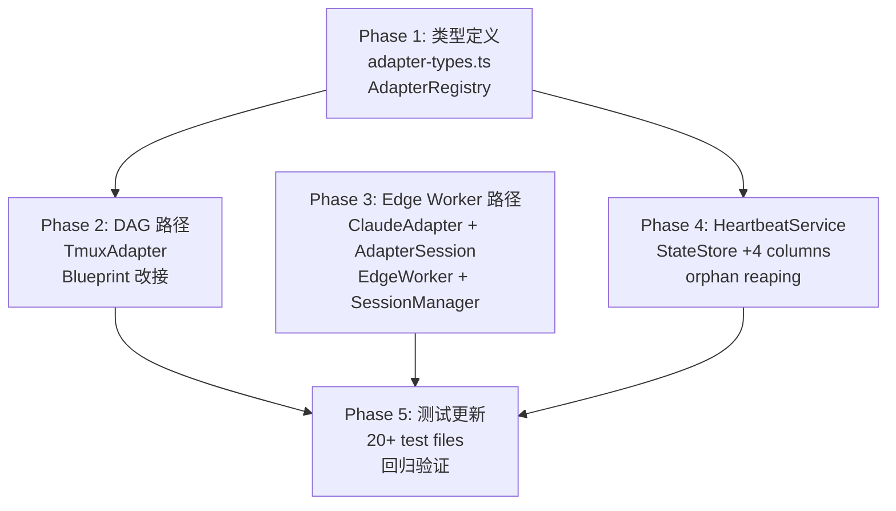

# Research: Adapter Unification Codebase Analysis — GEO-157

**Issue**: GEO-157
**Date**: 2026-03-15
**Source**: `doc/engineer/exploration/new/GEO-157-adapter-protocol-heartbeat.md`

## 1. Research Scope

深入研读所有三套 runner 接口的消费者、实现者和测试，为 Option A（全面统一）提供精确的改动地图。

## 2. 核心发现

### 2.1 ISimpleAgentRunner 从未被实现或使用

**这是最重要的发现。** `ISimpleAgentRunner` 只存在于两个文件：
- `core/src/simple-agent-runner-types.ts`（接口定义）
- `core/src/index.ts`（re-export）

**没有实现类，没有消费者。** Decision Layer 用的是完全独立的模式：

```
DecisionLayer.decide(ctx, cwd)
  → HardRuleEngine（确定性规则）
  → HaikuTriageAgent.triage(ctx)    ← 直接用 LLMClient.chat()，不是 ISimpleAgentRunner
  → HaikuVerifier.verify(ctx, diff) ← 同上
  → FallbackHeuristic
  → Final Guard
```

**结论**：统一时不需要迁移 ISimpleAgentRunner 的任何消费者——它本来就没人用。可以直接删除，或者让新 `IAdapter` 的 `execute()` 也能覆盖 Decision Layer 场景（但不是当务之急）。

### 2.2 IAgentRunner 方法使用矩阵

| 消费者 | `start` | `startStreaming` | `addStreamMessage` | `isStreaming` | `stop` | `isRunning` | `getMessages` | `getFormatter` | `supportsStreamingInput` |
|--------|:---:|:---:|:---:|:---:|:---:|:---:|:---:|:---:|:---:|
| **ChatSessionHandler** | ✓ | ✓ | ✓ | ✓ | - | ✓ | (via postReply) | - | (checks) |
| **EdgeWorker** | ✓ | ✓ | (fallback) | - | ✓ | ✓ | ✓ | - | ✓ |
| **AgentSessionManager** | - | - | - | - | - | - | - | ✓ | - |
| **SlackChatAdapter** | - | - | - | - | - | - | ✓ | - | - |

**ChatSessionHandler 和 EdgeWorker 不可能用 `execute() → result`**。它们依赖：
- `startStreaming()` — 启动持久 session
- `addStreamMessage()` — 中途注入用户消息
- `isStreaming()` / `isRunning()` — 检查 session 状态

### 2.3 Blueprint 完整执行流程（14 阶段）

```
Blueprint.run(node, projectRoot, ctx)
  ├─ 1. Worktree setup（可选）
  ├─ 2. Git exclude setup
  ├─ 3. Git preflight（assertCleanTree + captureBaseline）
  ├─ 4. Pre-hydration（从 Linear 拉 issue 详情）
  ├─ 5. Skill injection（可选）
  ├─ 6. Agent dispatch（可选，v0.6）
  ├─ 7. Memory retrieval（可选，v0.3）
  ├─ 8. Landing signal path setup
  ├─ 9. Prompt + system prompt construction
  ├─ 10. >>> runner.run(request) <<<  ← 唯一调用 IFlywheelRunner 的地方
  ├─ 11. Git result check
  ├─ 12. Evidence collection
  ├─ 13. Non-worktree cleanup
  └─ 14. Decision Layer（可选）
```

Blueprint 通过构造函数注入 `getRunner: (name: string) => IFlywheelRunner`，只调用 `runner.run(request)`。

### 2.4 测试影响分析

**直接引用 `IFlywheelRunner` 的测试文件（~20 个）**：

| 文件 | Mock 模式 |
|------|----------|
| `Blueprint.test.ts` (12 tests) | `makeMockRunner()` → `{ name, run: vi.fn() }` |
| `Blueprint.decision.test.ts` (5 tests) | 同上 |
| `Blueprint.memory.test.ts` (16 tests) | 同上 |
| `Blueprint.v0.2.integration.test.ts` | 同上 |
| `Blueprint.v0.6.integration.test.ts` | 同上 |
| `e2e-core-loop.test.ts` (3 tests) | `makeRunner()` → `{ name, run }` |
| `parallel-dispatch-e2e.test.ts` | 同上 |
| `TmuxRunner.test.ts` (10+ tests) | 直接测 TmuxRunner 实现 |
| `FlywheelRunnerRegistry.test.ts` (8 tests) | `stubRunner()` → `{ name, run }` |
| `DagDispatcher.test.ts` (5+ tests) | 通过 Blueprint mock |

**Mock 创建模式**：
```typescript
// 所有测试都用这个模式
function makeMockRunner(result = {}): IFlywheelRunner {
  return {
    name: "claude",
    run: vi.fn(async () => ({ success: true, sessionId: "sess", ...result })),
  };
}
```

## 3. 统一 IAdapter 接口设计（基于代码分析）

### 3.1 设计挑战

需要覆盖三种执行模式：

| 模式 | 当前接口 | 执行模型 | 实际消费者 |
|------|---------|---------|-----------|
| Fire-and-forget | `IFlywheelRunner.run()` | 单次调用 → 结果 | Blueprint, DagDispatcher |
| Interactive streaming | `IAgentRunner.startStreaming()` | 持久 session + 消息注入 | EdgeWorker, ChatSessionHandler |
| Enumerated decision | `ISimpleAgentRunner.query()` | 单次调用 → 枚举结果 | **无消费者（未使用）** |

### 3.2 推荐设计：Base + Optional Streaming

```typescript
// ─── Base IAdapter ───
interface IAdapter {
  readonly type: string;

  /** 环境检查：tmux、claude CLI 是否就绪 */
  checkEnvironment(): Promise<AdapterHealthCheck>;

  /** Fire-and-forget 执行（替代 IFlywheelRunner.run()）*/
  execute(ctx: AdapterExecutionContext): Promise<AdapterExecutionResult>;

  /** 执行后清理 */
  cleanup?(ctx: AdapterExecutionContext): Promise<void>;

  /** 是否支持交互式 streaming（替代 supportsStreamingInput）*/
  readonly supportsStreaming: boolean;

  /** 启动交互式 session（替代 IAgentRunner.startStreaming()）*/
  startSession?(ctx: AdapterExecutionContext): Promise<AdapterSession>;
}

// ─── 交互式 Session（替代 IAgentRunner 的 streaming 方法）───
interface AdapterSession {
  readonly sessionId: string | null;
  addMessage(content: string): void;
  completeStream(): void;
  isStreaming(): boolean;
  stop(): void;
  isRunning(): boolean;
  getMessages(): AgentMessage[];
  getFormatter(): IMessageFormatter;
}

// ─── 执行上下文（合并 FlywheelRunRequest + AgentRunnerConfig 的公共部分）───
interface AdapterExecutionContext {
  runId: string;
  issueId: string;
  prompt: string;
  cwd: string;
  // Runner config
  model?: string;
  permissionMode?: string;
  appendSystemPrompt?: string;
  allowedTools?: string[];
  maxTurns?: number;
  timeoutMs?: number;
  // Session persistence（新增）
  previousSession?: Record<string, unknown>;
  // TmuxRunner-specific
  label?: string;
  sentinelPath?: string;
  sessionDisplayName?: string;
  // Callbacks
  onLog?: (stream: "stdout" | "stderr", chunk: string) => void;
  onProgress?: (event: ProgressEvent) => void;
  // IAgentRunner-specific（streaming 模式用）
  onMessage?: (message: AgentMessage) => void | Promise<void>;
  onError?: (error: Error) => void | Promise<void>;
  onComplete?: (messages: AgentMessage[]) => void | Promise<void>;
  // MCP
  mcpConfigPath?: string | string[];
  mcpConfig?: Record<string, unknown>;
  // Edge Worker specific
  workspaceName?: string;
  allowedDirectories?: string[];
  flywheelHome?: string;
  hooks?: Record<string, unknown>;
  onAskUserQuestion?: OnAskUserQuestion;
}

// ─── 执行结果（合并 FlywheelRunResult + AgentSessionInfo）───
interface AdapterExecutionResult {
  success: boolean;
  exitCode?: number | null;
  timedOut?: boolean;
  durationMs?: number;
  sessionId: string;
  costUsd?: number;
  numTurns?: number;
  resultText?: string;
  // Session persistence（新增）
  sessionParams?: Record<string, unknown>;
  // TmuxRunner-specific
  tmuxWindow?: string;
  // Usage tracking
  usage?: { inputTokens: number; outputTokens: number };
}
```

### 3.3 迁移映射

| 现有 | 新接口 | 改动 |
|------|-------|------|
| `IFlywheelRunner.run(request)` | `IAdapter.execute(ctx)` | 参数展平，新增 previousSession |
| `IFlywheelRunner.name` | `IAdapter.type` | 重命名 |
| `IAgentRunner.start(prompt)` | `IAdapter.execute(ctx)` | 简单模式走 execute |
| `IAgentRunner.startStreaming()` | `IAdapter.startSession(ctx)` | 返回 AdapterSession |
| `IAgentRunner.addStreamMessage()` | `AdapterSession.addMessage()` | 移到 session 对象 |
| `IAgentRunner.isStreaming()` | `AdapterSession.isStreaming()` | 移到 session 对象 |
| `IAgentRunner.stop()` | `AdapterSession.stop()` | 移到 session 对象 |
| `IAgentRunner.isRunning()` | `AdapterSession.isRunning()` | 移到 session 对象 |
| `IAgentRunner.getMessages()` | `AdapterSession.getMessages()` | 移到 session 对象 |
| `IAgentRunner.getFormatter()` | `AdapterSession.getFormatter()` | 移到 session 对象 |
| `IAgentRunner.supportsStreamingInput` | `IAdapter.supportsStreaming` | 重命名 |
| `ISimpleAgentRunner.query()` | （删除，未使用） | 直接删除 |
| 无 | `IAdapter.checkEnvironment()` | 新增 |
| 无 | `IAdapter.cleanup()` | 新增 |
| 无 | `AdapterExecutionContext.previousSession` | 新增 |
| 无 | `AdapterExecutionResult.sessionParams` | 新增 |

### 3.4 实现者迁移

| 现有实现 | 新实现 | 改动量 |
|---------|-------|--------|
| `TmuxRunner implements IFlywheelRunner` | `TmuxAdapter implements IAdapter` | 中（重命名 + 新增 checkEnvironment/cleanup） |
| `ClaudeRunner implements IAgentRunner` | `ClaudeAdapter implements IAdapter` | 大（拆分 streaming → AdapterSession） |
| `ClaudeCodeRunner implements IAgentRunner` | `ClaudeCodeAdapter implements IAdapter` | 大（同上） |
| （无）`ISimpleAgentRunner` 实现 | 不需要 | 删除接口即可 |

### 3.5 消费者迁移

| 消费者 | 当前用法 | 改动 |
|--------|---------|------|
| `Blueprint.ts` | `getRunner(name).run(req)` | → `getAdapter(name).execute(ctx)` |
| `DagDispatcher.ts` | 通过 Blueprint 间接 | 无直接改动 |
| `EdgeWorker.ts` | `runner.start()`, `runner.startStreaming()`, `runner.stop()` | → `adapter.execute()`, `adapter.startSession()`, `session.stop()` |
| `ChatSessionHandler.ts` | `runner.startStreaming()`, `runner.addStreamMessage()` | → `adapter.startSession()`, `session.addMessage()` |
| `AgentSessionManager.ts` | `addAgentRunner()`, `getFormatter()` | → `addAdapter()` 或 `addSession()`，`session.getFormatter()` |
| `SlackChatAdapter.ts` | `runner.getMessages()` | → `session.getMessages()` |
| `CyrusAgentSession.ts` | `agentRunner?: IAgentRunner` | → `adapter?: IAdapter` 或 `session?: AdapterSession` |
| `FlywheelRunnerRegistry` | `Map<string, IFlywheelRunner>` | → `Map<string, IAdapter>` |

## 4. StateStore 扩展

```sql
-- 新增列（idempotent migration）
ALTER TABLE sessions ADD COLUMN session_params TEXT;      -- JSON blob
ALTER TABLE sessions ADD COLUMN heartbeat_at TEXT;         -- ISO datetime
ALTER TABLE sessions ADD COLUMN adapter_type TEXT;         -- "claude-cli" | "claude-sdk"
ALTER TABLE sessions ADD COLUMN run_attempt INTEGER DEFAULT 0;
```

**session_params 实际内容**：
- `sessionId`（Claude CLI session ID，用于 `--session-id` resume）
- `worktreePath`（已有列，但 session_params 可以存更多上下文）
- `lastPrompt`（上次 prompt 摘要，帮助 retry）

## 5. HeartbeatService 设计

```typescript
class HeartbeatService {
  // 继承 StuckWatcher 的功能
  private timer: NodeJS.Timeout | null = null;
  private notifiedExecutions = new Set<string>();

  constructor(
    private store: StateStore,
    private notifier: StuckNotifier,
    private thresholdMinutes: number,   // stuck 阈值
    private orphanThresholdMinutes: number, // orphan 阈值（> stuck）
    private intervalMs: number,
  ) {}

  start(): void;
  stop(): void;

  async check(): Promise<void> {
    // 1. 原有 StuckWatcher 逻辑（通知 stuck sessions）
    await this.checkStuck();
    // 2. 新增：orphan reaping
    await this.reapOrphans();
  }

  /** Orphan = running 状态但 heartbeat_at 超过 orphanThreshold */
  private async reapOrphans(): Promise<void> {
    const orphans = this.store.getOrphanSessions(this.orphanThresholdMinutes);
    for (const session of orphans) {
      this.store.forceStatus(session.execution_id, "failed",
        new Date().toISOString(), "Reaped: no heartbeat");
      await this.notifier.onSessionStuck(session, this.orphanThresholdMinutes);
    }
  }
}
```

**Heartbeat 更新机制**（TmuxAdapter）：
- TmuxRunner 的 `waitForCompletion()` 已有 5s 轮询间隔（`pollIntervalMs`）
- 在每次轮询 pane_dead 时，顺便 update `heartbeat_at`
- 改动量极小：在 poller 里加一行 `store.updateHeartbeat(executionId)`

## 6. 影响总览

### 文件改动地图

```
packages/core/src/
  ├─ adapter-types.ts          (新建) IAdapter + AdapterSession + Context/Result types
  ├─ flywheel-runner-types.ts  (删除) → 被 adapter-types.ts 替代
  ├─ agent-runner-types.ts     (大改) IAgentRunner → 保留 Ask/Formatter types，接口本身删除
  ├─ simple-agent-runner-types.ts (删除) → 未使用，直接删
  ├─ FlywheelRunnerRegistry.ts (改名) → AdapterRegistry
  ├─ CyrusAgentSession.ts      (小改) agentRunner → adapter/session
  ├─ index.ts                  (小改) 更新 exports

packages/claude-runner/src/
  ├─ TmuxRunner.ts    → TmuxAdapter.ts   (中改) implements IAdapter
  ├─ ClaudeRunner.ts  → ClaudeAdapter.ts (大改) implements IAdapter + AdapterSession
  ├─ ClaudeCodeRunner.ts → ClaudeCodeAdapter.ts (大改) 同上

packages/edge-worker/src/
  ├─ Blueprint.ts              (小改) getRunner → getAdapter, run → execute
  ├─ EdgeWorker.ts             (大改) IAgentRunner → IAdapter + AdapterSession
  ├─ AgentSessionManager.ts    (中改) 存储类型改变
  ├─ ChatSessionHandler.ts     (中改) streaming 方法改名
  ├─ SlackChatAdapter.ts       (小改) runner → session
  ├─ 20+ test files            (中改) mock type 更新

packages/teamlead/src/
  ├─ StateStore.ts             (小改) +4 columns, +2 methods
  ├─ StuckWatcher.ts → HeartbeatService.ts (中改) +orphan reaping
  ├─ 5 test files              (小改) 类名更新
```

### 按风险排序

| 风险 | 文件 | 原因 |
|------|------|------|
| 🔴 高 | `EdgeWorker.ts` (1300+ 行) | 最大消费者，streaming + session 管理 |
| 🔴 高 | `AgentSessionManager.ts` (1660+ 行) | Session 存储/检索全链路 |
| 🟡 中 | `ClaudeRunner.ts` → `ClaudeAdapter.ts` | 拆分 streaming → AdapterSession |
| 🟡 中 | `ChatSessionHandler.ts` | Streaming 方法改名 |
| 🟢 低 | `Blueprint.ts` | 只改 `getRunner → getAdapter`, `run → execute` |
| 🟢 低 | `TmuxRunner.ts` → `TmuxAdapter.ts` | 加 checkEnvironment/cleanup |
| 🟢 低 | `StateStore.ts` | 加 4 列 + 2 方法 |
| 🟢 低 | `StuckWatcher.ts` → `HeartbeatService.ts` | 加 orphan reaping |

### 估算

| 阶段 | 工作量 | 风险 |
|------|--------|------|
| Phase 1: 类型定义 + TmuxAdapter（DAG 路径） | 2-3 天 | 低 |
| Phase 2: ClaudeAdapter + AdapterSession（Edge Worker 路径） | 3-5 天 | 高 |
| Phase 3: EdgeWorker + AgentSessionManager 迁移 | 3-5 天 | 高 |
| Phase 4: HeartbeatService + StateStore 扩展 | 1-2 天 | 低 |
| Phase 5: 测试更新 + 回归验证 | 2-3 天 | 中 |
| **总计** | **2-3 周** | |

## 7. 建议的实施顺序



**Phase 1 和 Phase 4 可以并行**（无依赖）。
**Phase 2 和 Phase 3 最好串行**（Phase 3 依赖 Phase 2 验证接口设计）。
