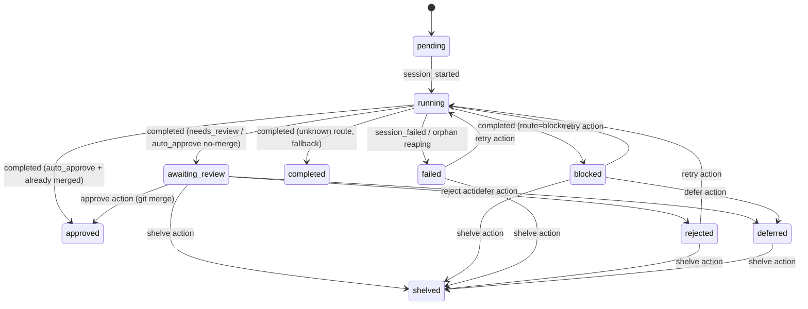

# Research: FSM + Directive Implementation — GEO-158

**Issue**: GEO-158
**Date**: 2026-03-15
**Source**: `doc/engineer/exploration/new/GEO-158-jido-directive-fsm.md`

---

## 1. Complete FSM Transition Map

### 1.1 All States (10)

| State | Terminal? | Outcome? | Description |
|-------|----------|----------|-------------|
| `pending` | No | No | Schema default，代码中几乎不使用 |
| `running` | No | No | Session 执行中 |
| `awaiting_review` | Yes | No | 等待 CEO 审批 |
| `completed` | Yes | Yes | 无明确结果的完成（fallback） |
| `approved` | Yes | Yes | 审批通过并合并 |
| `blocked` | Yes | Yes | 被策略或错误阻塞 |
| `failed` | Yes | Yes | 执行错误或 orphan reaping |
| `rejected` | Yes | Yes | CEO 拒绝 |
| `deferred` | Yes | Yes | 延后处理 |
| `shelved` | Yes | Yes | 永久搁置 |

### 1.2 Complete Transitions (13)



### 1.3 Transition Map (TypeScript 数据结构)

```typescript
const WORKFLOW_TRANSITIONS: Record<string, string[]> = {
  pending:         ["running"],
  running:         ["awaiting_review", "approved", "blocked", "completed", "failed"],
  awaiting_review: ["approved", "rejected", "deferred", "shelved"],
  blocked:         ["running", "deferred", "shelved"],
  failed:          ["running", "shelved"],
  rejected:        ["running", "shelved"],
  deferred:        ["shelved"],
  // Terminal states — no outgoing transitions
  approved:        [],
  completed:       [],
  shelved:         [],
};
```

### 1.4 Guards

| Transition | Guard | 当前实现 |
|-----------|-------|---------|
| `awaiting_review → approved` | ApproveHandler git merge 成功 | actions.ts line 52 |
| `running → approved` | `landingStatus.status === "merged"` | event-route.ts line 166 |
| `running → awaiting_review` vs `blocked` | `decision.route` 值 | event-route.ts lines 161-173 |
| `* → running` (retry) | Source status 必须是 failed/blocked/rejected | actions.ts ACTION_SOURCE_STATUS |

### 1.5 Triggers (Event → Transition 映射)

| Trigger | From | To | Code Location |
|---------|------|-----|---------------|
| `session_started` event | pending | running | event-route.ts:136 |
| `session_completed` + route=needs_review | running | awaiting_review | event-route.ts:161 |
| `session_completed` + route=auto_approve + merged | running | approved | event-route.ts:166 |
| `session_completed` + route=auto_approve + not merged | running | awaiting_review | event-route.ts:169 |
| `session_completed` + route=blocked | running | blocked | event-route.ts:172 |
| `session_completed` + unknown route | running | completed | event-route.ts:173 |
| `session_failed` event | running | failed | event-route.ts:206 |
| Orphan reaping (heartbeat stale) | running | failed | HeartbeatService.ts:97 |
| POST /actions/approve | awaiting_review | approved | actions.ts:40-87 |
| POST /actions/reject | awaiting_review | rejected | actions.ts:33 |
| POST /actions/defer | awaiting_review, blocked | deferred | actions.ts:33 |
| POST /actions/retry | failed, blocked, rejected | running | actions.ts:36 |
| POST /actions/shelve | awaiting_review, blocked, failed, rejected, deferred | shelved | actions.ts:37 |

---

## 2. Side Effect Catalog (Directive Types)

### 2.1 Notification

| Side Effect | Trigger Location | Data | Async | Fatal |
|------------|-----------------|------|-------|-------|
| OpenClaw hook (notify agent) | event-route.ts, HeartbeatService.ts | HookPayload + sessionKey | Yes (3s timeout) | No (best-effort) |
| Heartbeat update | Blueprint.ts onHeartbeat | execution_id only | Yes (3s timeout) | No (silent) |

### 2.2 State Mutation (DB)

| Side Effect | Trigger Location | Data | Async | Fatal |
|------------|-----------------|------|-------|-------|
| Session upsert | event-route.ts | SessionUpsert (26 fields) | No (sync) | Yes (throws) |
| Session event insert | event-route.ts | SessionEvent | No (sync) | No (dedup) |
| Heartbeat timestamp update | event-route.ts /heartbeat | execution_id | No (sync) | No |
| Thread mapping | event-route.ts session_started | execution_id, thread_id | No (sync) | No |
| Force status | actions.ts, HeartbeatService.ts | executionId, status, reason | No (sync) | Yes |

### 2.3 Git Operations

| Side Effect | Trigger Location | Data | Async | Fatal |
|------------|-----------------|------|-------|-------|
| PR merge (approve) | actions.ts → ApproveHandler | executionId, repo, branch | Yes | Yes |
| Worktree create/cleanup | Blueprint.ts | projectRoot, issueId | Yes | Yes (create) / No (cleanup) |

### 2.4 Process Management

| Side Effect | Trigger Location | Data | Async | Fatal |
|------------|-----------------|------|-------|-------|
| tmux window kill | Blueprint.ts | tmuxWindow name | Yes | No (best-effort) |

### 2.5 Memory

| Side Effect | Trigger Location | Data | Async | Fatal |
|------------|-----------------|------|-------|-------|
| Memory extract | Blueprint.ts | session result, evidence, decision | Yes (30s timeout) | No |
| Memory search | Blueprint.ts | query, projectName | Yes (30s timeout) | No |

### 2.6 Event Emission

| Side Effect | Trigger Location | Data | Async | Fatal |
|------------|-----------------|------|-------|-------|
| emitStarted | Blueprint.run() | EventEnvelope | Yes (fire-and-forget) | No |
| emitCompleted | Blueprint.emitTerminal() | EventEnvelope + result | Yes (1s race) | No |
| emitFailed | Blueprint.emitTerminal() | EventEnvelope + error | Yes (1s race) | No |

### 2.7 Proposed Directive Types (Option B 范围)

Option B 只在 FSM `onEnter` 中使用 directives，不重构现有代码。因此只需要覆盖 **状态进入时触发的副作用**：

```typescript
type Directive =
  | NotifyDirective        // 通知 OpenClaw gateway
  | StateUpdateDirective   // 更新 session DB 状态
  | AuditDirective         // 记录 transition 到 session_events
  | ErrorDirective;        // 信号失败

interface NotifyDirective {
  type: "notify";
  payload: HookPayload;
  sessionKey: string;
  fatal: false;
}

interface StateUpdateDirective {
  type: "state_update";
  executionId: string;
  fields: Partial<SessionUpsert>;
  fatal: true;
}

interface AuditDirective {
  type: "audit";
  executionId: string;
  fromState: string;
  toState: string;
  trigger: string;
  fatal: false;
}

interface ErrorDirective {
  type: "error";
  error: Error;
  issueId: string;
  severity: "warning" | "critical";
  fatal: false;
}
```

**注意**：Git 操作（merge）、Process 管理（tmux）、Memory 操作不在 FSM onEnter 范围内。这些是 Blueprint 管道的一部分，在 Option B 中不通过 directive 执行。

---

## 3. Existing Test Patterns

### 3.1 概览

| 指标 | 值 |
|------|-----|
| 总测试数 | 191 |
| 测试文件 | 11 |
| 测试代码行数 | 3,273 |
| 框架 | vitest |
| DB 模式 | `:memory:` SQLite |

### 3.2 关键测试模式

**StateStore 实例化**：
```typescript
let store: StateStore;
beforeEach(async () => {
  store = await StateStore.create(":memory:");
});
```

**HTTP 集成测试**：
```typescript
const app = createBridgeApp(store, testProjects, makeConfig());
server = app.listen(0, "127.0.0.1"); // random port
```

**Mock Gateway 验证 hook payload**：
```typescript
const capturedPayloads: Record<string, unknown>[] = [];
gateway.post("/hooks/ingest", (req, res) => {
  capturedPayloads.push(req.body);
  res.json({ ok: true });
});
```

**Status transition 测试**：
- 已覆盖 monotonic guard（terminal → running 被阻止）
- 已覆盖所有 action transition（approve, reject, defer, retry, shelve）
- 已覆盖非法 action 源状态（如 running → reject 返回错误）

### 3.3 GEO-158 新增测试需求

基于现有 191 个测试 + FSM/Directive 新增，预估新增 ~40-50 个测试：

| 测试类别 | 预估数量 | 内容 |
|---------|---------|------|
| WorkflowFSM.transition() | ~15 | 每个合法 transition + 每个非法 transition |
| WorkflowFSM guards | ~5 | Guard 条件验证 |
| FSM onEnter directives | ~5 | 状态进入时生成正确 directive |
| DirectiveExecutor.drain() | ~8 | 每种 directive type + 失败处理 |
| StateStore FSM 集成 | ~5 | upsertSession 改用 FSM validate |
| actions.ts FSM 集成 | ~5 | transitionSession 走 FSM |
| Transition 审计 | ~3 | session_events 中记录 transition |

---

## 4. Jido FSM 参考实现

### 4.1 核心 Machine（极简）

```elixir
# Jido Machine — 只做 transition validation
def transition(%{status: current, transitions: transitions} = machine, new_status) do
  allowed = Map.get(transitions, current, [])
  if new_status in allowed do
    {:ok, %{machine | status: new_status}}
  else
    {:error, "invalid transition from #{current} to #{new_status}"}
  end
end
```

### 4.2 Flywheel 对 Jido 的扩展

Jido FSM 核心**没有**：guards、onEnter callbacks、transition history。这些是 Flywheel 的扩展层。

设计原则：
- **Core FSM** = 纯数据（transition map） + 纯函数（validate）
- **Guards** = 可选函数，在 transition 前执行，返回 boolean
- **onEnter** = 可选函数，在 transition 后执行，返回 Directive[]
- **Audit** = transition 成功后自动写入 session_events

---

## 5. Implementation Architecture

### 5.1 Package 归属

```
packages/core/src/
  ├── workflow-fsm.ts          # WorkflowFSM class + transition map
  ├── directive-types.ts       # Directive discriminated union
  └── index.ts                 # re-exports

packages/teamlead/src/
  ├── DirectiveExecutor.ts     # drain() directives
  ├── StateStore.ts            # 修改: upsertSession → FSM validate
  └── bridge/
      └── actions.ts           # 修改: transitionSession → FSM transition
```

### 5.2 WorkflowFSM API

```typescript
class WorkflowFSM {
  constructor(
    transitions: Record<string, string[]>,
    guards?: Record<string, GuardFn>,
    onEnter?: Record<string, OnEnterFn>,
  )

  // Core: validate + execute transition
  transition(
    currentState: string,
    targetState: string,
    context?: TransitionContext,
  ): TransitionResult

  // Query helpers
  allowedTransitions(currentState: string): string[]
  isTerminal(state: string): boolean
  canTransition(from: string, to: string): boolean
}

interface TransitionResult {
  ok: boolean;
  newState: string;
  directives: Directive[];
  error?: string;   // InvalidTransitionError message
}

type GuardFn = (ctx: TransitionContext) => boolean;
type OnEnterFn = (ctx: TransitionContext) => Directive[];

interface TransitionContext {
  executionId: string;
  issueId: string;
  trigger: string;
  payload?: Record<string, unknown>;
}
```

### 5.3 DirectiveExecutor API

```typescript
class DirectiveExecutor {
  constructor(deps: {
    store: StateStore;
    notifyAgent?: (body: Record<string, unknown>) => Promise<void>;
  })

  async drain(directives: Directive[]): Promise<DirectiveResult[]>
}

interface DirectiveResult {
  type: string;
  success: boolean;
  error?: string;
}
```

### 5.4 StateStore 集成

```typescript
// 改前 (upsertSession)
upsertSession(session: SessionUpsert): void {
  const existing = this.getSession(session.execution_id);
  if (existing && TERMINAL_STATUSES.has(existing.status) && session.status === "running") {
    return; // monotonic guard
  }
  // ... SQL INSERT OR UPDATE
}

// 改后 (FSM validate)
upsertSession(session: SessionUpsert, fsm: WorkflowFSM): void {
  const existing = this.getSession(session.execution_id);
  if (existing) {
    const result = fsm.canTransition(existing.status, session.status);
    if (!result) {
      return; // FSM rejects transition
    }
  }
  // ... SQL INSERT OR UPDATE
}
```

### 5.5 actions.ts 集成

```typescript
// 改前
export function transitionSession(store, action, executionId, reason): ActionResult {
  const validSources = ACTION_SOURCE_STATUS[action];
  if (!validSources?.includes(session.status)) { return error; }
  const targetStatus = ACTION_TARGET_STATUS[action]!;
  store.forceStatus(session.execution_id, targetStatus, ...);
}

// 改后
export function transitionSession(store, action, executionId, reason, fsm): ActionResult {
  const targetStatus = ACTION_TARGET_STATUS[action]!;
  const result = fsm.transition(session.status, targetStatus, {
    executionId, issueId: session.issue_id, trigger: action,
  });
  if (!result.ok) {
    return { success: false, message: result.error };
  }
  // Use regular upsertSession (FSM already validated)
  store.upsertSession({ ...session, status: targetStatus, last_activity_at: now });
}
```

### 5.6 forceStatus() 移除路径

| 当前调用位置 | 改为 |
|------------|------|
| `actions.ts` transitionSession() | FSM `transition()` — retry 是合法 transition |
| `HeartbeatService.ts` reapOrphans() | FSM `transition("running", "failed", ...)` |

`forceStatus()` 方法标记 `@deprecated`，保留但不再被任何代码调用。后续版本移除。

---

## 6. Migration Strategy

### 6.1 向后兼容

- `TERMINAL_STATUSES` Set 保留（dashboard queries 使用）
- `OUTCOME_STATUSES` 保留
- `ACTION_SOURCE_STATUS` / `ACTION_TARGET_STATUS` 可在 FSM transition map 正式化后移除
- `forceStatus()` 标记 deprecated，暂不删除

### 6.2 FSM 实例化

FSM 是全局单例（状态机定义不变），在 bridge plugin.ts 初始化时创建，注入到需要的组件：

```typescript
// plugin.ts
const fsm = new WorkflowFSM(WORKFLOW_TRANSITIONS, guards, onEnterCallbacks);
// 传入 action router, event router
```

### 6.3 不改动的文件

| 文件 | 原因 |
|------|------|
| Blueprint.ts | 顺序管道，不适合 directive 化 |
| DecisionLayer.ts | 已是纯函数 |
| ExecutionEventEmitter.ts | Blueprint 的事件发射器，不变 |
| event-route.ts 通知逻辑 | Option B 不重构现有副作用代码 |

---

## 7. Risk Assessment

| 风险 | 影响 | 缓解 |
|------|------|------|
| FSM transition map 遗漏某个合法 transition | 运行时 transition 被拒绝 | Exhaustive 测试覆盖所有 13 个 transition |
| StateStore upsertSession 签名变更 | 所有调用者需要传入 FSM | FSM 参数可选（default = 使用全局单例） |
| forceStatus 移除后 orphan reaping 失败 | Running session 无法被标记 failed | FSM map 已包含 `running → failed` |
| actions.ts 改动影响 OpenClaw action resolution | Approve/reject 流程中断 | 现有 50 个 action 测试覆盖 |
| GEO-163 branch 与本分支冲突 | Merge conflict | GEO-163 Wave 1 已合并 main，改动不重叠 |
