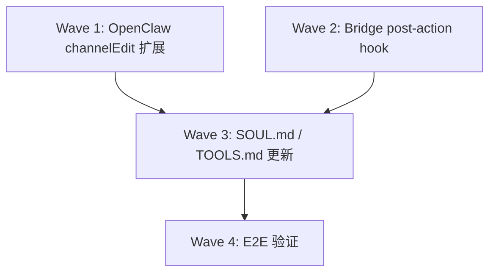

# Research: Runtime Forum Tag 更新实现 — GEO-167

**Issue**: GEO-167
**Date**: 2026-03-16
**Source**: `doc/engineer/exploration/new/GEO-167-runtime-forum-tag-update.md`

## 1. OpenClaw `channelEdit` 扩展

### 现状

- 工具名：`channelEdit`（对应 Discord `PATCH /channels/{id}`）
- `threadCreate` 已支持 `appliedTags`（`send.types.ts:72-81`）
- `channelEdit` 不支持 `appliedTags`（`send.types.ts:149-161` 的 `DiscordChannelEdit` 缺少此字段）
- Discord API 确认支持 `PATCH /channels/{thread_id}` 的 `applied_tags` 字段

### 改动清单（4 文件，~12 LOC）

| File | Line | Change |
|------|------|--------|
| `src/discord/send.types.ts` | 160 | `DiscordChannelEdit` 加 `appliedTags?: string[]` |
| `src/discord/send.channels.ts` | 81 | `editChannelDiscord` body 加 `if (payload.appliedTags?.length) body.applied_tags = payload.appliedTags` |
| `src/agents/tools/discord-actions-guild.ts` | 329-342 | `channelEdit` case 加 `readStringArrayParam(params, "appliedTags")` + payload 传递 |
| `src/channels/plugins/actions/discord/handle-action.guild-admin.ts` | 199-214 | `channel-edit` case 加 `readStringArrayParam` + `handleDiscordAction` 传递 |

**依赖**：`readStringArrayParam` 已存在于 `src/agents/tools/common.ts:157-201`，无需新增 helper。

### 测试参考

`send.creates-thread.test.ts:79-98` 有 `appliedTags` 的测试模式：
- 传入 `appliedTags: ["tag1", "tag2"]`
- 验证 PATCH body 含 `applied_tags: ["tag1", "tag2"]`

## 2. Bridge Post-Action Hook

### 核心问题

`createActionRouter` **不接收** `BridgeConfig`，导致 `approveExecution` 和 `transitionSession` 无法访问 `gatewayUrl` / `hooksToken`。

对比 `createEventRouter`：
```
createEventRouter(store, projects, config, cipherWriter)  // ✅ has config
createActionRouter(store, projects, cipherWriter)          // ❌ no config
```

### 改动路径

#### 2.1 提取 `notifyAgent` 为共享模块

`notifyAgent` 当前定义在 `event-route.ts:58-83`（3s timeout, best-effort, warn on failure）。

**方案**：提取到 `hook-payload.ts`（已是 hook 相关共享模块），避免 actions.ts 和 event-route.ts 重复代码。

```typescript
// hook-payload.ts — 新增 export
export async function notifyAgent(
  gatewayUrl: string,
  hooksToken: string,
  body: Record<string, unknown>,
): Promise<void> { ... }
```

event-route.ts 和 HeartbeatService 改为 import 此函数。

#### 2.2 扩展 HookPayload 接口

`hook-payload.ts:1-27` 当前已有 CIPHER 字段。新增 action 字段：

```typescript
export interface HookPayload {
  // ... existing fields ...
  action?: string;                // "approve", "reject", "defer", "retry", "shelve"
  action_source_status?: string;  // 原始 status
  action_target_status?: string;  // 变更后 status
  action_reason?: string;         // reject/defer/shelve 的原因
}
```

#### 2.3 Threading `config` 到 action handlers

**plugin.ts** (lines 159, 166):
```
// OLD
createActionRouter(store, projects, cipherWriter)
// NEW
createActionRouter(store, projects, cipherWriter, config)
```

**createActionRouter** (actions.ts:153):
```
// OLD
export function createActionRouter(store, projects, cipherWriter): Router
// NEW
export function createActionRouter(store, projects, cipherWriter, config?): Router
```

**方案选择**：传整个 `config?: BridgeConfig` 而非拆散参数（`gatewayUrl`, `hooksToken`, `notificationChannel`）。理由：
- 与 `createEventRouter(store, projects, config, cipherWriter)` 保持一致
- 未来若新增 config 字段不需要改签名
- 用 `config?.gatewayUrl` guard 即可

#### 2.4 Hook 发送插入点

**approveExecution** (actions.ts:76-98) — `store.upsertSession({ status: "approved" })` 之后：
```typescript
if (config?.gatewayUrl && config?.hooksToken) {
  const updatedSession = store.getSession(executionId);
  if (updatedSession) {
    const hookPayload: HookPayload = {
      event_type: "action_executed",
      action: "approve",
      action_source_status: "awaiting_review",
      action_target_status: "approved",
      execution_id: session.execution_id,
      issue_id: session.issue_id,
      issue_identifier: session.issue_identifier,
      issue_title: session.issue_title,
      project_name: session.project_name,
      status: "approved",
      thread_id: updatedSession.thread_id,
      channel: config.notificationChannel,
    };
    const body = buildHookBody("product-lead", hookPayload, buildSessionKey(updatedSession));
    notifyAgent(config.gatewayUrl, config.hooksToken, body).catch(() => {});
  }
}
```

**transitionSession** (actions.ts:129-144) — `store.forceStatus()` 之后，return 之前：
```typescript
if (config?.gatewayUrl && config?.hooksToken) {
  const updatedSession = store.getSession(executionId);
  if (updatedSession) {
    const hookPayload: HookPayload = {
      event_type: "action_executed",
      action,
      action_source_status: session.status,
      action_target_status: targetStatus,
      action_reason: reason,
      execution_id: session.execution_id,
      issue_id: session.issue_id,
      issue_identifier: session.issue_identifier,
      issue_title: session.issue_title,
      project_name: session.project_name,
      status: targetStatus,
      thread_id: updatedSession.thread_id,
      channel: config.notificationChannel,
    };
    const body = buildHookBody("product-lead", hookPayload, buildSessionKey(updatedSession));
    notifyAgent(config.gatewayUrl, config.hooksToken, body).catch(() => {});
  }
}
```

### 测试策略

参考 `event-route.test.ts:236-306` 的 mock gateway server 模式：
1. 启动临时 express server 捕获 hook payload
2. 配置 `gatewayUrl` 指向 mock server
3. 调用 action API
4. 验证捕获的 payload 包含正确的 `event_type`, `action`, `action_source_status`, `action_target_status`

## 3. SOUL.md / TOOLS.md 更新

### SOUL.md 变更

新增 tag 更新行为规则：

1. **触发条件**：收到任何包含 `status` 字段的 hook（无论 `event_type` 是 `session_started`/`session_completed`/`session_failed`/`action_executed`）
2. **执行流程**：
   - 从 hook payload 提取 `status`
   - 查 status → tag 映射表（已在 SOUL.md 中定义）
   - 获取 Forum Post 的 `thread_id`（从 hook payload 的 `thread_id` 或查 Bridge API）
   - 调用 `channelEdit` with `channelId = thread_id`, `appliedTags = [mapped_tag_id]`
   - 失败时重试（最多 2 次）
3. **工具名修正**：现有 SOUL.md 中的 `discord:thread-create` 和 `discord:sendMessage` 命名需确认是否与 OpenClaw 实际工具名一致（brainstorm 阶段发现不一致）

### TOOLS.md 变更

`channelEdit` 工具新增 `appliedTags` 参数文档：
```
- channelEdit: Edit a channel or forum thread
  - channelId (required): Channel/thread ID
  - appliedTags (optional): Array of tag IDs to apply (forum threads only)
  - ... existing params ...
```

## 4. 实现顺序建议



1. **Wave 1** (OpenClaw repo): `channelEdit` 加 `appliedTags`（4 文件 + 测试）
2. **Wave 2** (Flywheel repo): 提取 `notifyAgent` + HookPayload 扩展 + actions.ts hook + plugin.ts wiring（4 文件 + 测试）
3. **Wave 3** (Agent config): SOUL.md + TOOLS.md 更新
4. **Wave 4**: E2E 验证（发 test hook → 验证 tag 更新）

Wave 1 和 Wave 2 可并行开发（无依赖）。Wave 3 依赖两者都完成。

## 5. 风险评估

| Risk | Impact | Mitigation |
|------|--------|------------|
| Discord API 限制 `applied_tags` PATCH | High — 方案不可行 | 已通过 web search 确认支持 |
| Agent 偶尔不执行 tag 更新 | Medium — tag 过滤不准 | SOUL.md 强调必须执行 + retry |
| `notifyAgent` 提取影响现有 event-route | Low — 纯重构 | 保持函数签名不变 |
| OpenClaw 部署节奏 | Medium — 需先部署 OpenClaw | Wave 1 先完成，与 Wave 2 并行 |
