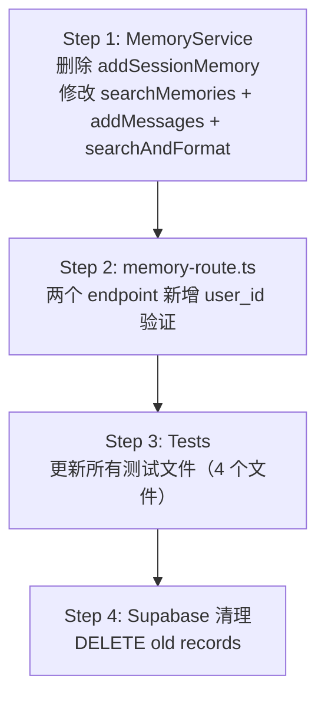

# Research: Fix mem0 Entity Mapping — GEO-204

**Issue**: GEO-204
**Date**: 2026-03-22
**Source**: `doc/engineer/exploration/new/GEO-204-fix-mem0-entity-mapping.md`

## 1. mem0 SDK 内部机制（已验证源码）

### 1.1 Entity 字段处理流程

源码位置：`node_modules/.pnpm_patches/mem0ai@2.3.0/dist/oss/index.js`

**`add()` (L4599-4628)**:
```js
const { userId, agentId, runId, metadata = {}, filters = {} } = config;
if (userId) filters.userId = metadata.userId = userId;   // 双写：metadata + filters
if (agentId) filters.agentId = metadata.agentId = agentId;
if (runId) filters.runId = metadata.runId = runId;
// 至少一个必须有值，否则 throw
if (!filters.userId && !filters.agentId && !filters.runId) {
    throw new Error("One of the filters: userId, agentId or runId is required!");
}
```

**`search()` (L4817-4837)**:
```js
const { userId, agentId, runId, limit = 100, filters = {} } = config;
if (userId) filters.userId = userId;   // 仅写入 filters（用于查询过滤）
if (agentId) filters.agentId = agentId;
if (runId) filters.runId = runId;
// 同样至少一个必须有值
```

### 1.2 关键发现

| 特性 | 说明 |
|------|------|
| `userId`/`agentId`/`runId` | **一等公民** — SDK 自动合并到 metadata + filters |
| `app_id` | **非一等公民** — 必须通过 `metadata` 手动写入，通过 `filters` 手动查询 |
| 必填约束 | userId/agentId/runId **至少一个**必须有值，否则 SDK throws |
| 存储位置 | 全部在 Supabase `metadata` JSONB 列中 |

### 1.3 Supabase 存储架构

**`memories` 表结构**:
```sql
create table if not exists memories (
  id text primary key,
  embedding vector(1536),
  metadata jsonb,            -- 所有 entity 字段都在这里
  created_at timestamptz,
  updated_at timestamptz
);
```

**`match_vectors()` 搜索函数**:
```sql
-- 使用 JSON containment 做过滤
where case
    when filter::text = '{}'::text then true
    else t.metadata @> filter
end
```

这意味着：当我们传 `filters: { app_id: "flywheel", userId: "geoforge3d" }` 时，
Supabase 执行 `metadata @> '{"app_id":"flywheel","userId":"geoforge3d"}'::jsonb`。

### 1.4 当前数据存储格式

每条记忆的 `metadata` JSONB 大致如下：
```json
{
  "userId": "geoforge3d",
  "agentId": "product-lead",
  "app_id": "flywheel",
  "memory": "...",
  "hash": "..."
}
```

修正后应变为：
```json
{
  "userId": "annie",
  "agentId": "product-lead",
  "app_id": "geoforge3d",
  "memory": "...",
  "hash": "..."
}
```

## 2. 精确变更清单

### 2.1 MemoryService.ts — 核心方法修改

#### 删除：`addSessionMemory()` (L56-122)

整个方法 + 67 行代码。生产环境零调用（已验证）。

#### 修改：`searchMemories()` (L129-165)

**当前**:
```ts
async searchMemories(params: {
    query: string;
    projectName: string;        // ← 传给 userId
    agentId?: string;
    limit?: number;
}): Promise<string[]> {
    const results = await this.memory.search(params.query, {
        userId: params.projectName,   // ← 错误：项目名当用户
        agentId: params.agentId,
        limit: params.limit ?? this.searchLimit,
        filters: { app_id: "flywheel" },   // ← 错误：硬编码
    });
```

**修改后**:
```ts
async searchMemories(params: {
    query: string;
    projectName: string;        // → 传给 filters.app_id
    userId: string;             // 新增：传给 mem0 userId
    agentId?: string;
    limit?: number;
}): Promise<string[]> {
    const results = await this.memory.search(params.query, {
        userId: params.userId,          // ✅ 人类用户
        agentId: params.agentId,
        limit: params.limit ?? this.searchLimit,
        filters: { app_id: params.projectName },  // ✅ 项目名作为 app_id
    });
```

#### 修改：`addMessages()` (L172-206)

**当前**:
```ts
async addMessages(params: {
    messages: Array<{ role: "user" | "assistant"; content: string }>;
    projectName: string;        // ← 传给 userId
    agentId: string;
    metadata?: Record<string, unknown>;
}): Promise<{ added: number; updated: number }> {
    const result = await this.memory.add(params.messages, {
        userId: params.projectName,   // ← 错误
        agentId: params.agentId,
        metadata: {
            ...params.metadata,
            app_id: "flywheel",   // ← 错误：硬编码
        },
    });
```

**修改后**:
```ts
async addMessages(params: {
    messages: Array<{ role: "user" | "assistant"; content: string }>;
    projectName: string;        // → 传给 metadata.app_id
    userId: string;             // 新增：传给 mem0 userId
    agentId: string;
    metadata?: Record<string, unknown>;
}): Promise<{ added: number; updated: number }> {
    const result = await this.memory.add(params.messages, {
        userId: params.userId,          // ✅ 人类用户
        agentId: params.agentId,
        metadata: {
            ...params.metadata,
            app_id: params.projectName,   // ✅ 项目名作为 app_id
        },
    });
```

#### 修改：`searchAndFormat()` (L213-239)

此方法内部调用 `searchMemories()`，需要传入 `userId`。

**当前**:
```ts
async searchAndFormat(params: {
    query: string;
    projectName: string;
    agentId?: string;
}): Promise<string | null> {
    const memories = await this.searchMemories({
        query: params.query,
        projectName: params.projectName,
        agentId: params.agentId,
    });
```

**修改后**:
```ts
async searchAndFormat(params: {
    query: string;
    projectName: string;
    userId: string;             // 新增
    agentId?: string;
}): Promise<string | null> {
    const memories = await this.searchMemories({
        query: params.query,
        projectName: params.projectName,
        userId: params.userId,
        agentId: params.agentId,
    });
```

**注意**：`searchAndFormat()` 目前无生产调用方（GEO-198 移除了 Blueprint 中的调用），但保留它因为它是 `searchMemories()` 的 graceful degradation wrapper，可能被 Lead agent runtime 复用。如果我们保留它，需要添加 `userId` 参数。

### 2.2 memory-route.ts — API 参数扩展

两个 endpoint 都新增 `user_id` required 字段。

**POST /search** — 新增验证 + 传递：
```ts
const { query, project_name, agent_id, user_id, limit } = req.body ?? {};
// ... 现有验证 ...
if (!isNonEmptyString(user_id)) {
    res.status(400).json({ error: "user_id must be a non-empty string" });
    return;
}
// 调用 MemoryService
memoryService.searchMemories({
    query,
    projectName: project_name,
    userId: user_id,          // 新增
    agentId: agent_id,
    limit: limit as number | undefined,
})
```

**POST /add** — 同样：
```ts
const { messages, project_name, agent_id, user_id, metadata } = req.body ?? {};
// ... 现有验证 ...
if (!isNonEmptyString(user_id)) {
    res.status(400).json({ error: "user_id must be a non-empty string" });
    return;
}
memoryService.addMessages({
    messages,
    projectName: project_name,
    userId: user_id,          // 新增
    agentId: agent_id,
    metadata,
})
```

### 2.3 测试更新矩阵

#### MemoryService.test.ts

| 变更 | 说明 |
|------|------|
| **删除** `addSessionMemory` 整个 describe block (L73-208) | 6 个测试全删 |
| **更新** `searchMemories filters by app_id` (L325-338) | `"flywheel"` → `"proj"` (projectName) |
| **更新** `searchMemories` 调用 — 全部添加 `userId` 参数 | 7 个测试 |
| **更新** `addMessages enforces app_id` (L400-414) | `"flywheel"` → `"proj"` |
| **更新** `addMessages merges caller metadata` (L417-434) | `"flywheel"` → `"proj"` |
| **更新** `addMessages passes agentId` (L436-452) | 验证 `userId` 变为新值而非 `"proj"` |
| **更新** `addMessages` 调用 — 全部添加 `userId` 参数 | 5 个测试 |
| **更新** `searchAndFormat` / `passes app_id filter` (L510-527) | `"flywheel"` → `"myproject"`, 添加 `userId` |

#### memory-route.test.ts

| 变更 | 说明 |
|------|------|
| **所有 POST /search 请求** | body 新增 `user_id: "annie"` |
| **所有 POST /add 请求** | body 新增 `user_id: "annie"` |
| **新增** `400 when user_id missing` (search) | 1 个新测试 |
| **新增** `400 when user_id missing` (add) | 1 个新测试 |
| **更新** mock 验证 | `projectName` → `app_id` 语义, 新增 `userId` 验证 |

#### memory-e2e.test.ts

| 变更 | 说明 |
|------|------|
| **删除** "full loop" 测试中的 `addSessionMemory` 调用 (L46-54) | 改用 `addMessages` |
| **删除** "failure session" 测试 (L130-159) | 整个删除（测试 addSessionMemory） |
| **更新** 所有 `searchAndFormat` 调用 | 添加 `userId` 参数 |
| **更新** 隔离测试 (L74-94) | userId assertion 从 `"beta"` 改为新 userId |

#### memory-supabase-live.test.ts

| 变更 | 说明 |
|------|------|
| **替换** `addSessionMemory` → `addMessages` (L28-36) | round-trip 测试改用活跃 API |
| **更新** `searchAndFormat` 调用 | 添加 `userId` 参数 |

### 2.4 数据清理 SQL

```sql
-- 删除所有旧映射的记忆（app_id: "flywheel" 是 v0.3 遗留值）
DELETE FROM memories WHERE metadata @> '{"app_id": "flywheel"}'::jsonb;
```

注意：这会删除 **所有** 旧记忆。用户已确认此操作（数据量少，干净重来）。

## 3. 风险评估

| 风险 | 严重度 | 缓解措施 |
|------|--------|----------|
| API breaking change | **中** | Lead agent TOOLS.md 同步更新，`user_id` 为新 required field |
| `searchAndFormat()` 签名变化 | **低** | 当前无生产调用方，但保留向后兼容性 |
| Supabase 数据删除 | **低** | 数据量少（<50 条），且用户已确认 |
| mem0 SDK 至少需要一个 userId/agentId/runId | **无** | API 已经 require `user_id` + `agent_id`，总是满足 |

## 4. 实施顺序建议



**Step 1 和 2 可以合并**（改 MemoryService 和 route 一起），因为改参数签名后 route 必须同步更新。

**不需要改的文件**：
- `createMemoryService.ts` — `projectName` 仅用于 history DB 路径
- `index.ts` / `run-bridge.ts` — 初始化逻辑不涉及 entity 映射
- `plugin.ts` — MemoryService 实例透传，不涉及 entity 字段
- `types.ts` — config 类型不涉及 entity 映射

## 5. API Contract 修改摘要

### POST /api/memory/search

```diff
  {
      "query": "auth bug",
      "project_name": "geoforge3d",
+     "user_id": "annie",
      "agent_id": "product-lead",
      "limit": 10
  }
```

### POST /api/memory/add

```diff
  {
      "messages": [{"role": "user", "content": "hello"}],
      "project_name": "geoforge3d",
+     "user_id": "annie",
      "agent_id": "product-lead",
      "metadata": {}
  }
```

`project_name` 语义从 "mem0 userId" 变为 "mem0 app_id"（API field name 不变，内部映射变了）。
