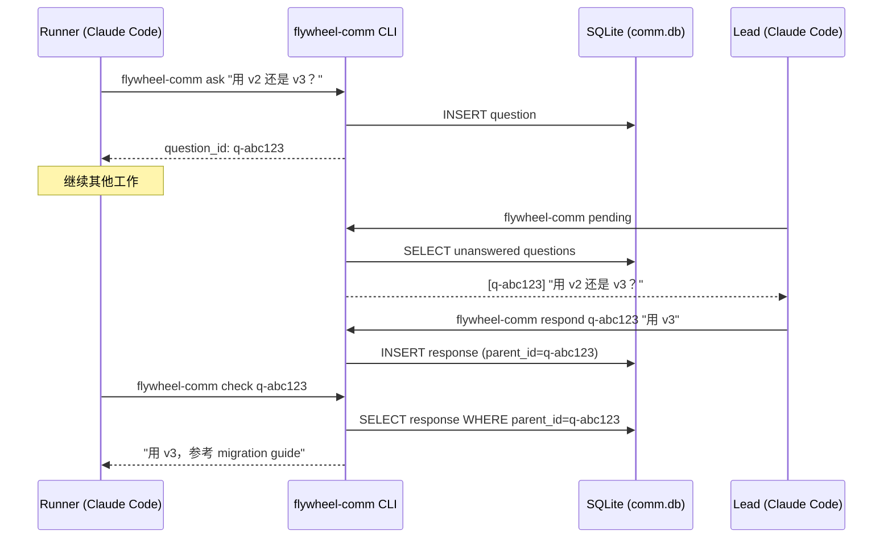

# Research: Lead ↔ Runner 双向通信 — GEO-206

**Issue**: GEO-206
**Date**: 2026-03-22
**Source**: `doc/engineer/exploration/new/GEO-206-lead-runner-bidirectional-comm.md`, `doc/architecture/v2.0-product-vision.md`
**Review**: Codex Rounds 1-6 (MCP+JSONL 版) → CEO pivot 到 CLI+SQLite → Codex CLI Round 1 (4 blockers 修复)

---

## 研究目标

验证 Lead ↔ Runner 双向通信的技术可行性。核心问题：

1. Runner 怎么跟 Lead 对话？（通信接口）
2. 消息怎么存储？（存储方案）
3. Lead 怎么通过 tmux 管理 Runner？（可见性）

---

## 1. 通信接口：CLI vs MCP

### 1.1 为什么选 CLI 而不是 MCP

**2026 年行业共识**：对于简单的读/写操作，CLI 比 MCP 便宜 10-32 倍。

| 维度 | MCP | CLI (Bash) |
|------|-----|------------|
| Token 开销 | 每个 tool schema 消耗数百 tokens | **零** — Claude 天生知道 Bash |
| 运行时开销 | 每个 Runner 一个 stdio 子进程 | **无** — 直接调命令 |
| 需要改 TmuxAdapter？ | 是（注入 `--mcp-config`） | **否** |
| 需要新 package？ | 是（`packages/flywheel-mcp/`） | 否（一个 CLI 脚本） |
| 可靠性 | 100% (structured tool call) | ~100% (Bash 调用) |
| 适合场景 | 复杂 API、team-shared 工具 | 简单读/写、已知命令 |

**结论**: Runner ↔ Lead 的操作就是 "写问题 → 读回复"，不需要 MCP 的复杂性。Runner 用 `Bash` tool 调 `flywheel-comm` CLI 即可。

**Sources**:
- [Why CLIs Beat MCP for AI Agents](https://medium.com/@rentierdigital/why-clis-beat-mcp-for-ai-agents-and-how-to-build-your-own-cli-army-6c27b0aec969)
- [MCP vs CLI: When to Use Which](https://systemprompt.io/guides/mcp-vs-cli-tools)
- [MCP vs CLI Benchmarking](https://mariozechner.at/posts/2025-08-15-mcp-vs-cli/)

### 1.2 CLI 设计：`flywheel-comm`

```bash
# ── Runner 端 ──

# 提问
flywheel-comm ask --lead product-lead "用 API v2 还是 v3？"
# → question_id: q-abc123

# 查回复
flywheel-comm check q-abc123
# → "用 v3，参考 migration guide"
# → 或 "not yet"（还没回复）

# 查收件箱（Lead 主动发来的指令）
flywheel-comm inbox --runner exec-001
# → [i-def456] "先跑测试再提 PR" (5 min ago)

# ── Lead 端 ──

# 查待答问题
flywheel-comm pending --lead product-lead
# → [q-abc123] Runner exec-001: "用 API v2 还是 v3？" (3 min ago)

# 回答
flywheel-comm respond q-abc123 "用 v3，参考 migration guide"
# → Response sent.

# 主动发指令
flywheel-comm send --runner exec-001 "先跑测试再提 PR"
# → Instruction sent.
```

### 1.3 CLI 实现

CLI 是一个 TypeScript 脚本，编译后放在 `packages/flywheel-comm/` 或 monorepo bin。

```typescript
// flywheel-comm — 核心逻辑
import Database from 'better-sqlite3';

const db = new Database(resolveCommDbPath());

switch (command) {
  case 'ask':
    const id = uuid();
    db.prepare('INSERT INTO messages (id, from_agent, to_agent, type, content) VALUES (?, ?, ?, ?, ?)')
      .run(id, `runner:${execId}`, `lead:${leadId}`, 'question', question);
    console.log(`question_id: ${id}`);
    break;

  case 'check':
    const row = db.prepare('SELECT content FROM messages WHERE parent_id = ? AND type = ?')
      .get(questionId, 'response');
    console.log(row ? row.content : 'not yet');
    break;

  case 'pending':
    const questions = db.prepare('SELECT * FROM messages WHERE to_agent = ? AND type = ? AND id NOT IN (SELECT parent_id FROM messages WHERE type = ?)')
      .all(`lead:${leadId}`, 'question', 'response');
    // 格式化输出
    break;

  case 'respond':
    db.prepare('INSERT INTO messages (id, from_agent, to_agent, type, content, parent_id) VALUES (?, ?, ?, ?, ?, ?)')
      .run(uuid(), `lead:${leadId}`, originalQuestion.from_agent, 'response', answer, questionId);
    break;
}
```

**依赖**: `better-sqlite3`（非 `sql.js`）。

> **Codex 发现**: Flywheel 现有的 `sql.js` 是整库读入内存、`db.export()` 写回的模式，不支持真正的 WAL 并发。`flywheel-comm` 需要 Lead 和 Runner 两个进程同时读写同一个 `.db` 文件，必须用 `better-sqlite3`（native SQLite binding，支持 WAL + busy_timeout）。

### 1.4 Runner 怎么知道用 flywheel-comm？（Codex Blocker #3 修正）

> **Codex 发现**: Blueprint 当前在 system prompt 中注入 `"Do not ask questions — implement your best judgment."`（`Blueprint.ts:301`）。这与 `flywheel-comm ask` 的设计直接冲突。

**Phase 1 需要同时修改**：
1. **Blueprint system prompt** — 将 "Do not ask questions" 改为条件化规则：
   ```
   优先独立完成。遇到架构/API/优先级的重大歧义且无法安全推进时，
   使用 `flywheel-comm ask --lead {leadId} "你的问题"` 向 Lead 提问。
   之后继续做不依赖答案的工作，定期 `flywheel-comm check {id}` 查看回复。
   ```
2. **Runner CLAUDE.md** — 补充 flywheel-comm 使用指导（与 system prompt 一致）

### 1.5 TmuxAdapter 改动最小化

**不需要 MCP 配置改动。** 需要的改动仅限：
- 注入 `FLYWHEEL_COMM_DB` 环境变量到 tmux window（`-e FLYWHEEL_COMM_DB=...`）
- 确保 `flywheel-comm` CLI 在 Runner 的 `$PATH` 中可用

**CLI 安装方式** (Phase 1 交付物):
- 编译后放到 monorepo 的 `node_modules/.bin/flywheel-comm`（pnpm bin link）
- 或安装到 `~/.flywheel/bin/flywheel-comm`，Blueprint 注入 PATH
- Runner 使用 `bypassPermissions` 模式，Bash 调用不需要额外授权

### 1.6 显式退让（相对于 MCP+Bridge 版）

> Phase 1 接受以下 trade-off：
> - **Polling 代替事件推送**: Lead 需要定期 `flywheel-comm pending` 轮询，不会被主动通知。建议 Lead 每 2-3 分钟检查一次。
> - **Same-machine 约束**: CLI + SQLite 只支持本地通信。跨机器需要 Phase 4 (Supabase)。
> - **暂无中央审计**: Runner ↔ Lead 通信不经过 Bridge，Dashboard 看不到 Q&A 历史。Phase 2+ 可加。

---

## 2. 存储方案：SQLite → Supabase

### 2.1 为什么选 SQLite 而不是 JSONL 文件

| 维度 | JSONL 文件 | SQLite |
|------|-----------|--------|
| 查询 | 全文扫描 | **索引查询** |
| 并发 | 需要 `proper-lockfile` | **内置 WAL 并发** (`better-sqlite3`) |
| 已读追踪 | 需要额外 cursor 文件 | **SQL 查询即可** |
| 自动清理 | 需要 cron 脚本 | **`DELETE WHERE expires_at < now()`** |
| 跨机器扩展 | 不可能 | **换 Supabase backend** |
| Flywheel 已有 | ❌ | ✅ **Bridge StateStore 已用 sql.js** |

**结论**: SQLite 在每个维度上都比 JSONL 更合适，且 Flywheel 已有 SQLite 使用经验。

### 2.2 数据库位置（Codex Blocker #2 修正）

> **问题**: Runner 在 per-issue git worktree 中执行（`~/.flywheel/worktrees/...`），Lead 在主仓库或另一个目录。如果 `comm.db` 放在 `{cwd}/.flywheel/`，每个 worktree 会有自己的 DB，Lead 和 Runner 不共享。

**解决方案**: `comm.db` 放在 **固定的项目级路径**，不跟随 worktree。

```
~/.flywheel/comm/{projectName}/comm.db
```

CLI 通过环境变量 `FLYWHEEL_COMM_DB` 定位数据库。Blueprint/Lead 在启动 Runner 时注入：

```bash
# Blueprint 注入（TmuxAdapter -e 参数）
-e FLYWHEEL_COMM_DB=~/.flywheel/comm/geoforge3d/comm.db

# CLI 读取
const dbPath = process.env.FLYWHEEL_COMM_DB ?? defaultPath(projectName);
```

**为什么不放项目目录**:
- Worktree 分散，每个 Runner 的 cwd 不同
- `.flywheel/` 在主仓库的 `.gitignore` 中没有覆盖（Codex 确认）
- `~/.flywheel/comm/` 由 Flywheel 管理，不污染任何 git 状态

### 2.3 Schema

```sql
CREATE TABLE messages (
  id          TEXT PRIMARY KEY,
  from_agent  TEXT NOT NULL,    -- "runner:exec-001" | "lead:product-lead"
  to_agent    TEXT NOT NULL,    -- "lead:product-lead" | "runner:exec-001"
  type        TEXT NOT NULL CHECK(type IN ('question','response','instruction','progress')),
  content     TEXT NOT NULL,
  parent_id   TEXT,             -- response 关联 question 的 id
  created_at  DATETIME DEFAULT CURRENT_TIMESTAMP,
  expires_at  DATETIME NOT NULL DEFAULT (datetime('now', '+72 hours')),
  FOREIGN KEY (parent_id) REFERENCES messages(id)
);

-- 每个 question 最多一个 response
CREATE UNIQUE INDEX idx_unique_response ON messages(parent_id) WHERE type = 'response';
-- pending 查询优化
CREATE INDEX idx_messages_to_agent ON messages(to_agent, type, created_at);
CREATE INDEX idx_messages_parent ON messages(parent_id);
CREATE INDEX idx_messages_expires ON messages(expires_at);
```

CLI 初始化时设置 WAL 并发模式：
```sql
PRAGMA journal_mode=WAL;
PRAGMA busy_timeout=5000;
```

### 2.4 消息保留策略

- 消息创建时设置 `expires_at = now() + 72h`
- CLI 启动时自动清理过期消息: `DELETE FROM messages WHERE expires_at < datetime('now')`
- 不需要永久保留 — Bridge 审计层负责长期记录（后续）

### 2.5 演进路径

```
Phase 1:  SQLite (~/.flywheel/comm/{projectName}/comm.db) — 本地、简单、够用
未来:     Supabase — 同样的 CLI，换个 database driver
```

CLI 的 database driver 通过配置切换：
- `FLYWHEEL_COMM_DB=~/.flywheel/comm/geoforge3d/comm.db` (默认，SQLite)
- 未来: Supabase backend（异步 mirror 模式，参考现有 `CipherSyncService` 模式）

CLI schema 和命令契约保持不变。Storage access 收口到 adapter 层，Phase 1 实现 SQLite adapter，后续加 Supabase adapter。

### 2.6 消息流

#### Runner → Lead（提问）



### 2.7 与 Bridge 的关系

**Phase 1: Bridge 不在通信路径上。** Runner ↔ Lead 通信走 SQLite + CLI。

```
Runner ←→ flywheel-comm CLI ←→ SQLite (comm.db) ←→ Lead (Bash 调 CLI)
                                      ↓ (后续，非 Phase 1)
                                 Bridge API (审计)
```

- Bridge 现有功能（StateStore、Forum、Actions、Dashboard）不变。
- 后续可选：CLI 异步同步 Q&A 到 Bridge StateStore 做审计。

---

## 3. Lead tmux 管理

### 3.1 读取 Runner 输出

```bash
# 最后 50 行（去 ANSI）
tmux capture-pane -t flywheel:{window} -p -S -50 | sed 's/\x1b\[[0-9;]*m//g'

# 检查是否还活着
tmux list-panes -t flywheel:{window} -F "#{pane_dead}"

# 列出所有 Runner
tmux list-windows -t flywheel -F "#{window_id} #{window_name} #{window_created}"
```

**限制**: 默认历史 2000 行。

### 3.2 Lead 启动新 Runner

**当前 TmuxAdapter 真实启动参数**（`TmuxAdapter.ts:177-195`）:

```bash
tmux new-window -P -F "#{window_id}" -t =flywheel \
  -e FLYWHEEL_CALLBACK_PORT=9876 \
  -e FLYWHEEL_CALLBACK_TOKEN={uuid} \
  -e FLYWHEEL_ISSUE_ID=GEO-XXX \
  -n {sanitized-label} \
  -c {worktree-path} \
  claude --session-id {id} \
        --permission-mode bypassPermissions \
        --append-system-prompt "{prompt}"
```

**注意**: `--agent runner` 是 GEO-205 未来增强，当前不支持。

### 3.3 资源监控

```bash
# macOS 内存
free_pages=$(vm_stat | awk '/Pages free/ {gsub(/\./,"",$3); print $3}')
free_mb=$((free_pages * 16384 / 1048576))

# CPU 负载
load=$(sysctl -n vm.loadavg | awk '{print $2}')

# 活跃 Runner 数
runner_count=$(tmux list-windows -t flywheel 2>/dev/null | wc -l)
```

### 3.4 tmux send-keys 可靠性

**结论**: 关键通信用 **CLI + SQLite**。`tmux send-keys` 仅用于紧急中断（`Ctrl+C`）。

---

## 4. Runner 超时与等待语义

### 4.1 问题

- TmuxAdapter 默认 45 分钟超时（`TmuxAdapter.ts:36,73`）
- Blueprint 也默认 45 分钟（`Blueprint.ts:341-356`）
- TmuxAdapter 交互模式不支持 session resume（`TmuxAdapter.ts:191`）
- v2.0 产品 vision: "CEO 可能几小时后才回复"

### 4.2 三种解决路径

| 路径 | 描述 | 复杂度 | Phase |
|------|------|--------|-------|
| **A) 约束回复窗口** | Lead 在 Runner 超时前回复（~30min）。超时则 Runner 用自己判断或 fail | 低 | **Phase 1** |
| **B) 暂停 + 恢复** | Runner 超时保留上下文。Lead 回复后 `--resume` 启动新 session | 中 | Phase 2 |
| **C) 动态超时** | `ask_lead()` 时延长超时 | 高 | Phase 3 |

### 4.3 Phase 1：路径 A（约束回复窗口）

1. Runner 调 `flywheel-comm ask` → 立即返回 question_id
2. Runner 继续做不依赖答案的工作
3. 定期调 `flywheel-comm check` — 有回复则用
4. Session 超时仍无回复 → 用自己判断或标记 unanswered

**优势**: 不需要改 TmuxAdapter 超时逻辑。Phase 1 验证通信可行性。

---

## 5. 风险评估

| 风险 | 概率 | 影响 | 缓解 |
|------|------|------|------|
| Runner 不知何时调 flywheel-comm | 高 | 遇问题直接 fail | CLAUDE.md 明确指导 |
| flywheel-comm 不在 Runner PATH 中 | 低 | 阻塞 Phase 1 | Blueprint 注入 PATH 或用绝对路径 |
| SQLite 并发写入冲突 | 极低 | `better-sqlite3` WAL + busy_timeout | 默认启用 |
| 45 分钟内无回复 | 高 | Runner 用自己判断或 fail | Phase 1 可接受 |
| CLI 输出格式 Claude 解析失败 | 低 | 通信失败 | 简洁纯文本输出 |

---

## 6. Phase 1 实施范围（最小闭环）

### 做什么

1. **`flywheel-comm` CLI** — 新 CLI 工具（`packages/flywheel-comm/`）
   - `ask`, `check`, `pending`, `respond` 命令
   - `--json` 模式（machine-friendly 输出，提高 Claude 解析可靠性）
   - 读写 SQLite `~/.flywheel/comm/{projectName}/comm.db`（`better-sqlite3`）
   - WAL 并发模式 + busy_timeout
   - 自动创建 schema、自动清理过期消息
   - Storage adapter 层（为未来 Supabase 迁移预留）
2. **Blueprint system prompt 修改** — "Do not ask questions" 改为条件化规则
3. **TmuxAdapter 最小改动** — 注入 `FLYWHEEL_COMM_DB` 环境变量
4. **Runner CLAUDE.md** — 指导何时 ask、超时 fallback
5. **Lead CLAUDE.md** — 指导如何 pending + respond（建议 2-3 分钟 polling 间隔）

### 不需要做（Phase 1 的简化）

- ❌ 不需要 MCP server
- ❌ 不需要改 Bridge
- ❌ 不需要 JSONL 文件、cursor 文件、file locking

### 不做什么（Phase 2+）

- `inbox` / `send` 命令（Lead 主动指令）— Phase 2
- Bridge 审计/同步 — 后续
- Lead tmux visibility — Phase 3
- 动态超时 / session resume — Phase 2
- SQLite → Supabase 迁移 — Phase 4
- Resource monitor — 独立 issue

### 验证清单

- [ ] `flywheel-comm` 能通过 Bash 在 tmux Claude Code session 中正常调用
- [ ] `flywheel-comm ask` 写入 SQLite 后 < 100ms 返回
- [ ] `flywheel-comm check` 能找到对应回复（有/无两种 case）
- [ ] `flywheel-comm pending` 列出未回复问题
- [ ] `flywheel-comm respond` 写入回复后 Runner 能读到
- [ ] Lead 和 Runner（不同进程、不同 cwd）共享同一个 `comm.db`
- [ ] WAL 模式下并发读写无冲突
- [ ] Blueprint 修改后的 system prompt 正确引导 Runner 使用 CLI
- [ ] 超时无回复时 Runner 行为符合预期
- [ ] `--json` 模式输出可被 Claude 稳定解析

---

## Sources

### Codebase
- `packages/claude-runner/src/TmuxAdapter.ts` — Runner tmux 启动、超时
- `packages/edge-worker/src/Blueprint.ts` — session timeout (lines 341-356, 419-435)

### External — MCP vs CLI
- [Why CLIs Beat MCP for AI Agents](https://medium.com/@rentierdigital/why-clis-beat-mcp-for-ai-agents-and-how-to-build-your-own-cli-army-6c27b0aec969)
- [MCP vs CLI: When to Use Which](https://systemprompt.io/guides/mcp-vs-cli-tools)
- [MCP vs CLI Benchmarking](https://mariozechner.at/posts/2025-08-15-mcp-vs-cli/)
- [MCP is Dead; Long Live MCP](https://chrlschn.dev/blog/2026/03/mcp-is-dead-long-live-mcp/)

### External — Storage & Communication
- [Claude Code Agent Teams](https://code.claude.com/docs/en/agent-teams)
- [OpenCode Agent Teams (JSONL inbox)](https://dev.to/uenyioha/porting-claude-codes-agent-teams-to-opencode-4hol)

### Previous Reviews
- Codex Design Review Rounds 1-6 (MCP+JSONL 版): 架构方向确认，细节问题修正
