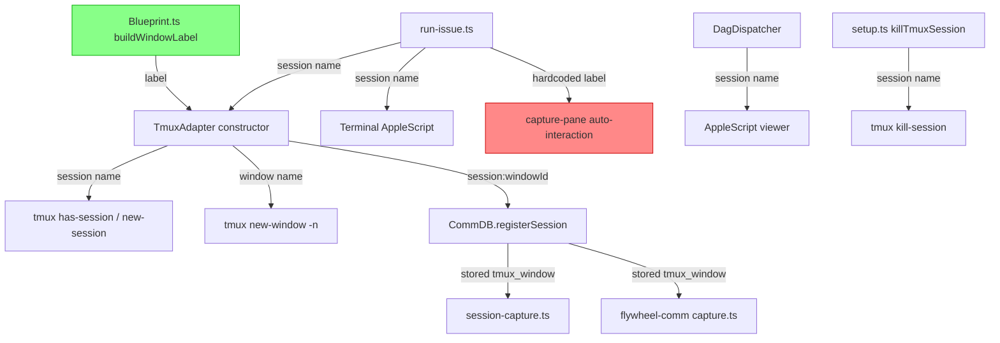

# Research: tmux Session/Window 命名机制 — GEO-269

**Issue**: GEO-269
**Date**: 2026-03-27
**Source**: `doc/engineer/exploration/new/GEO-269-tmux-session-naming.md`

## Findings

### F1: Claude Code `--name` 行为

| 方面 | 结论 |
|------|------|
| CLI 参数 | `-n, --name <name>` — "Set a display name for this session (shown in /resume and terminal title)" |
| 实现方式 | 通过 ANSI OSC escape sequence 设置 terminal title：`\033]2;Claude: <name>\007` |
| tmux 兼容性 | **被 `allow-rename off` 阻止** — TmuxAdapter 在 line 119 显式设置了此选项 |
| `/resume` 效果 | ✅ 有效 — Claude 内部 session picker 会显示 `--name` 设置的名字 |
| `/rename` 命令 | ✅ 可运行时改名，同样受 `allow-rename off` 限制无法反映到 tmux |

**结论**：`--name` 对 tmux window 标题无效（被 `allow-rename off` 阻止），但对 Claude 内部 session 管理有价值。可以传 `--name` 但不能依赖它做 tmux 层命名。

### F2: Claude Code `--tmux` flag

- 需要配合 `--worktree` 使用，创建独立的 tmux session
- **不能替代 TmuxAdapter** — TmuxAdapter 提供 heartbeat、dynamic timeout、comm DB 注入、sentinel 检测等 Flywheel 特有能力

### F3: 下游依赖分析

**关键发现：`run-issue.ts` 有 `buildWindowLabel()` 的硬编码副本**

```
run-issue.ts:368-375 手动重建 window label：
  const windowLabel = `claude-${cleanTitle}`.replace(...).slice(0, 50);
  const tmuxTarget = `${tmuxSessionName}:${windowLabel}`;
```

这段代码和 `Blueprint.ts:buildWindowLabel()` 逻辑**不同步** — 如果改了 Blueprint 的命名逻辑，`run-issue.ts` 的 auto-interaction 会找不到 window。

**完整依赖图**：



红色：硬编码副本（风险点）
绿色：正式命名逻辑

**CommDB 路径（安全）**：存储完整 `session:windowId` 字符串，format-agnostic。Session name 改变不影响 capture 功能，因为 windowId 是 tmux 分配的数字 ID（如 `@42`）。

### F4: `sessionDisplayName` 历史

| 时间线 | 事件 |
|--------|------|
| 2026-03-04 | commit `4dd276a` 引入字段，注释："Blueprint: pass sessionDisplayName in runner request" |
| 2026-03-15 | commit `23066eb` 移入 IAdapter 统一协议（GEO-157） |
| 至今 | **从未被消费** — TmuxAdapter 接受该字段但不读取 |

**结论**：这是一个**未完成的功能** — 原计划通过 Claude CLI `/rename` 命令设置 session 显示名，但从未实现。字段定义完好，可以直接利用。

### F5: tmux 命名约束

| 约束 | 说明 |
|------|------|
| Session name 非法字符 | `.` 和 `:` |
| Session name 不能以 `-` 开头 | Issue ID（`GEO-`）天然满足 |
| Window name | 无特殊限制，但 TmuxAdapter sanitize 到 `[a-zA-Z0-9-]` |
| 长度 | tmux 无硬性限制，但过长影响可读性，当前 cap 50 chars |

### F6: 方案评估

| 方案 | 优点 | 缺点 | 推荐 |
|------|------|------|------|
| A) Flywheel 控制 tmux 命名 | 完全掌控，确定生效 | 需同步多处逻辑 | ✅ 主方案 |
| B) 仅靠 `--name` | 零改动 | `allow-rename off` 阻止 tmux 层效果 | ❌ |
| C) 混合：A + `--name` | 两层都有好命名 | 略增复杂度 | ✅ 推荐 |
| D) 切换到 `--tmux` | 减少 Adapter 代码 | 丢失 heartbeat/timeout/comm 能力 | ❌ |

**推荐方案 C**：
1. Flywheel 控制 tmux session/window 命名（A — 确保 `tmux ls` 可读）
2. 同时传 `--name` 给 Claude CLI（利用 `sessionDisplayName`，让 `/resume` 也能识别）
3. 消除 `run-issue.ts` 中的硬编码副本（降低维护风险）

### F7: 硬编码副本修复方案

`run-issue.ts` 的 auto-interaction 用手动构建的 `tmuxTarget` 做 `capture-pane`。但 TmuxAdapter 返回的 `result.tmuxWindow` 已包含正确的 `session:windowId` target。

**问题**：auto-interaction 在 Blueprint.run() **之前**启动（line 377），此时还没有 `result.tmuxWindow`。它需要提前猜测 window name。

**方案**：
- 保持提前构建 `tmuxTarget` 的模式（auto-interaction 需要在 window 创建后立即工作）
- 但统一命名逻辑 — 让 `run-issue.ts` 的 label 构建和 `buildWindowLabel()` 使用相同格式
- 或者：把 auto-interaction 的 trust prompt 处理移到 TmuxAdapter 内部（更彻底但超出 GEO-269 scope）
