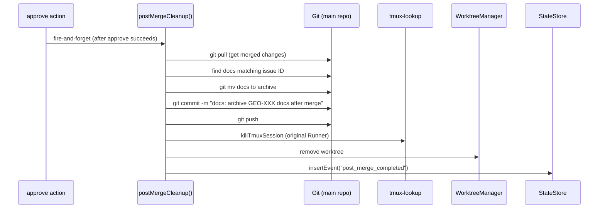

# Research: Post-Merge Runner 实现方案 — GEO-280

**Issue**: GEO-280
**Date**: 2026-03-28
**Source**: `doc/engineer/exploration/new/GEO-280-sprint-closing.md`

## Research Scope

确认方案 C（新 Runner session）的实现细节：触发机制、Blueprint 复用、prompt 设计、resource cleanup 方式。

## Key Findings

### 1. Approve 后的触发点

`approveExecution()` in `actions.ts:174-294`:
1. ApproveHandler 执行 `gh pr merge --squash --delete-branch`
2. FSM transition → approved
3. sendActionHook 通知 Lead
4. CIPHER recordOutcome

**最佳触发点**: 在 approve 成功且 FSM transition 成功后，fire-and-forget 触发 post-merge。不 block approve 返回。

### 2. 触发方式：Bridge 新端点 vs 内部调用

两个选择：

**A) 内部调用 — `approveExecution` 直接调用 post-merge 逻辑**
- 优点：简单，不需要新端点
- 缺点：`approveExecution` 已经很复杂了，耦合度增加

**B) 新端点 `POST /api/runs/post-merge` — approve 后 fire-and-forget HTTP 自调用**
- 优点：解耦，可手动重触发，可独立测试
- 缺点：self-HTTP-call pattern 不常见

**C) approve 成功后调用一个 callback — `onApproved` hook**
- 优点：干净解耦，`approveExecution` 不需要知道 post-merge 细节
- 缺点：需要 threading callback 到 action router

**推荐 C**: 新增 `PostApproveHook` callback，在 `createActionRouter` 中注入。approve 成功后 fire-and-forget 调用 hook。Hook 的具体实现是调用 startDispatcher 或 shell 脚本。

### 3. Post-Merge 执行方式

**不用 Blueprint/Runner**: Blueprint 需要 DagNode + PreHydrator + DecisionLayer 等重装备。Post-merge 是简单的 shell 任务，不需要这些。

**用简单 shell 脚本**: approve 后直接在 main repo 里执行一系列 git 命令：
1. `git pull` (拉取已 merge 的变更)
2. `git mv` docs to archive
3. Update MEMORY.md (append 记录)
4. `git commit && git push`
5. 关闭原 Runner 的 tmux session
6. 清理 worktree (如果还在)

但 **shell 脚本不够智能**: MEMORY.md 更新需要理解本次变更的内容，纯脚本只能 append 固定格式。

**用 Claude Code session**: 启动一个轻量 Claude Code session 来做 post-merge。不走 Blueprint，直接用 TmuxAdapter 或者 `claude` CLI。

### 4. 实际可用的最简方案

重新审视后，发现一个更简单的路径：

**Bridge 端点 + 直接 shell 命令（不用 Claude）**

Post-merge 的核心任务其实是确定性的：
- Archive docs: 知道 issue ID → 找到匹配的 docs → `git mv`
- Close tmux: 已有 `killTmuxSession()` helper
- Cleanup worktree: 已有 `WorktreeManager.remove()`
- MEMORY.md: 可以 defer（让 CEO/Lead 后续更新）

只有 MEMORY.md 更新需要 AI。其他都是确定性操作。

### 5. 两阶段方案

**Phase 1**: 确定性清理 — 不需要 AI
- 新端点 `POST /api/sessions/:id/post-merge`
- 关闭 tmux session (复用 close-tmux 逻辑)
- 清理 worktree (调用 WorktreeManager)
- Archive docs (`git mv` + commit + push on main repo)
- 记录 audit event

**Phase 2** (后续 issue): AI 增强
- 用 Claude Code 更新 MEMORY.md
- 用 Claude Code 更新 CLAUDE.md milestone table
- 更智能的 doc discovery

### 6. Doc Archive 的实现分析

当前 doc 命名规范 (`doc/*/new/` → `doc/*/archive/`):
- Exploration: `doc/engineer/exploration/new/GEO-{XX}-*.md` → `doc/engineer/exploration/archive/`
- Research: `doc/engineer/research/new/GEO-{XX}-*.md` → `doc/engineer/research/archive/`
- Plan: `doc/engineer/plan/inprogress/v*-GEO-{XX}-*.md` → `doc/engineer/plan/archive/`

知道 issue ID 就可以用 glob 找到对应文件 → `git mv`。

**需要在哪个 repo 操作**: 对应项目的 main repo。ApproveHandler 已经有 `projectRoot`。

### 7. 现有基础设施复用

| 需要 | 现有基础 | 复用方式 |
|------|----------|----------|
| 关闭 tmux | `killTmuxSession()` in tmux-lookup.ts | 直接调用 |
| 查找 tmux target | `getTmuxTargetFromCommDb()` | 直接调用 |
| 清理 worktree | `WorktreeManager.remove()` | 需要 worktree path (从 session metadata 或 CommDB) |
| Archive docs | 不存在 | 新建：glob + git mv + commit + push |
| Lead scope | `matchesLead()` | 直接调用 |
| Audit | `StateStore.insertEvent()` | 直接调用 |
| Project config | `ProjectEntry.projectRoot` | 已有 |

### 8. Worktree 信息来源

Session metadata 有 `worktree_path` 和 `branch` 字段。但 ApproveHandler 的 `gh pr merge --delete-branch` 已经删了远程分支。本地 worktree 需要 `WorktreeManager.remove()` 清理。

worktree path 可以从 session metadata 获取，或者根据命名规范计算：
`~/.flywheel/worktrees/{projectName}/flywheel-{issueId}`

### 9. 执行顺序

## 结论

Phase 1 方案：在 `approveExecution` 成功后触发一个 `postMergeCleanup()` 函数，fire-and-forget 执行确定性清理操作。不需要 AI，不需要新 Runner session，不需要 Blueprint。

**核心变更**:
1. 新增 `post-merge.ts` — 包含 `postMergeCleanup()` 函数
2. 修改 `actions.ts` — approve 成功后调用 postMergeCleanup
3. 新增测试

**不做的事**:
- 不改 FSM (approved 仍是终态)
- 不启动新 Runner session
- 不更新 MEMORY.md (Phase 2，需要 AI)
- 不新增 Bridge 端点 (内部调用即可)
