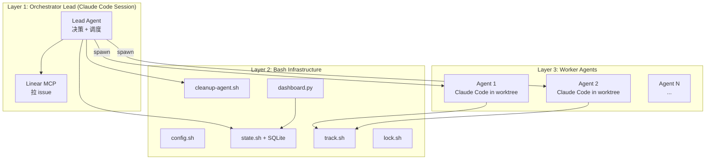
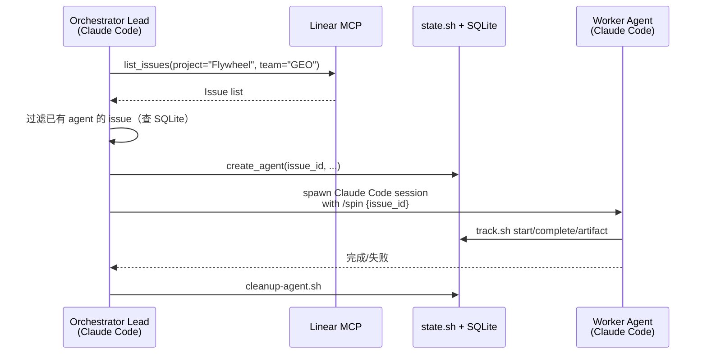
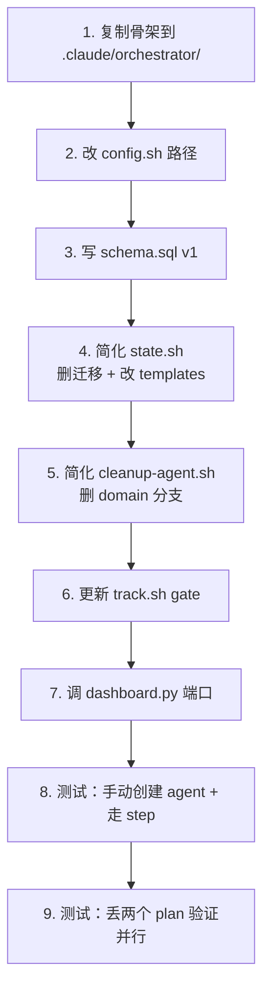

# Research: Flywheel Orchestrator Adaptation — GEO-291

**Issue**: GEO-291
**Date**: 2026-03-28
**Source**: `doc/engineer/exploration/new/GEO-291-flywheel-orchestrator.md`

---

## 1. 架构层次划分

GeoForge3D orchestrator 有两层：



**关键洞察**：Linear 查询在 Layer 1（Claude Code MCP），不在 Layer 2（bash）。bash 脚本只负责状态持久化和并发控制。

---

## 2. 文件级适配方案

### 2.1 config.sh — 路径重写 + 简化

**保留的常量**：

| 常量 | GeoForge3D 值 | Flywheel 值 |
|------|--------------|-------------|
| `PROJECT_ROOT` | `/Users/xiaorongli/Dev/GeoForge3D` | `/Users/xiaorongli/Dev/flywheel` |
| `ORCHESTRATOR_DIR` | `$PROJECT_ROOT/.claude/orchestrator` | 不变（相对路径） |
| `DB_PATH` | `$ORCHESTRATOR_DIR/agent-state.db` | 不变 |
| `VERSION_FILE` | `$PROJECT_ROOT/product/doc/VERSION` | `$PROJECT_ROOT/doc/VERSION` |
| `MAX_CONCURRENT_AGENTS` | 4 | 5 |
| `DOCS_LOCK_TIMEOUT` | 120 | 不变 |
| `RECONCILE_INTERVAL` | 300 | 不变 |
| `DASHBOARD_PORT` | 9473 | 9474 |
| `CLAUDE_MODEL` | opus | 不变 |

**新增的常量**（替代 domain-specific 路径）：

```bash
PLAN_NEW="$PROJECT_ROOT/doc/engineer/plan/new"
PLAN_DRAFT="$PROJECT_ROOT/doc/engineer/plan/draft"
PLAN_INPROGRESS="$PROJECT_ROOT/doc/engineer/plan/inprogress"
PLAN_ARCHIVE="$PROJECT_ROOT/doc/engineer/plan/archive"
EXPLORATION_NEW="$PROJECT_ROOT/doc/engineer/exploration/new"
EXPLORATION_ARCHIVE="$PROJECT_ROOT/doc/engineer/exploration/archive"
RESEARCH_NEW="$PROJECT_ROOT/doc/engineer/research/new"
RESEARCH_ARCHIVE="$PROJECT_ROOT/doc/engineer/research/archive"
```

**删除的常量**：
- `BACKEND_DIR`, `FRONTEND_DIR`（无 domain 子目录）
- `BACKEND_NEW`, `FRONTEND_NEW`, `QA_NEW`, `DESIGNER_NEW`, `HANDOFF_NEW`（5 个 watch path）
- `ENV_LEASE_TIMEOUT`（无 deploy 流程）

**保留的函数**：
- `get_feature_version()` — 改 VERSION_FILE 路径，删除 filesystem fallback scan
- `bump_feature_version()` — 改 VERSION_FILE 路径

### 2.2 state.sh — Schema 简化 + 删迁移

**30 个函数的处置**：

| 类别 | 函数 | 决策 |
|------|------|------|
| SQL helpers (4) | `sql_escape`, `_sql`, `state_critical`, `state_try` | **全部 KEEP** |
| DB init (5) | `init_db` | **MODIFY**：删迁移逻辑 |
| | `init_step_templates` | **MODIFY**：只 seed executor 9 步 |
| | `migrate_v1_to_v2`, `v2_to_v3`, `v3_to_v4` | **全部 DELETE** |
| Agent lifecycle (4) | `create_agent`, `update_agent_status`, `set_agent_pr`, `set_agent_error` | **全部 KEEP** |
| Step tracking (10) | `init_steps`, `start_step`, `complete_step`, `fail_step`, `skip_step`, `get_current_step`, `check_step_completed` | **KEEP** (7 个) |
| | `insert_plan_step`, `count_plan_steps` | **DELETE**（动态 plan step 不需要） |
| | `reset_steps_from` | **DELETE**（designer iteration 不需要） |
| Artifacts (1) | `add_artifact` | **KEEP** |
| Queries (6) | `list_active_agents` 等 6 个 | **全部 KEEP** |

**净结果**：30 → 24 函数（删 6 个）

#### Flywheel v1 Schema

```sql
-- agents: 去掉 domain CHECK 多余值
CREATE TABLE agents (
    id TEXT PRIMARY KEY,
    domain TEXT NOT NULL DEFAULT 'executor'
        CHECK(domain IN ('executor')),
    version TEXT NOT NULL,
    slug TEXT NOT NULL,
    plan_file TEXT,          -- NULL for Linear-triggered (no pre-existing plan)
    issue_id TEXT,           -- NEW: Linear issue identifier (e.g., "GEO-288")
    branch TEXT DEFAULT '',
    worktree_path TEXT,
    pr_number INTEGER,
    status TEXT NOT NULL DEFAULT 'spawned'
        CHECK(status IN ('spawned','running','awaiting_approval','shipping','completed','failed','stopped')),
    error_message TEXT,
    spawned_at DATETIME DEFAULT (datetime('now')),
    completed_at DATETIME,
    updated_at DATETIME DEFAULT (datetime('now'))
);

-- step_templates: 只有 executor
CREATE TABLE step_templates (
    agent_type TEXT NOT NULL DEFAULT 'executor'
        CHECK(agent_type IN ('executor')),
    step_key TEXT NOT NULL,
    step_name TEXT NOT NULL,
    step_order INTEGER NOT NULL,
    is_aggregate BOOLEAN DEFAULT 0,
    PRIMARY KEY (agent_type, step_key)
);

-- agent_steps: 不变
CREATE TABLE agent_steps (
    agent_id TEXT NOT NULL REFERENCES agents(id) ON DELETE CASCADE,
    step_key TEXT NOT NULL,
    step_name TEXT NOT NULL,
    step_order INTEGER NOT NULL,
    is_aggregate BOOLEAN DEFAULT 0,
    status TEXT NOT NULL DEFAULT 'pending'
        CHECK(status IN ('pending','in_progress','completed','skipped','failed')),
    started_at DATETIME,
    completed_at DATETIME,
    notes TEXT,
    PRIMARY KEY (agent_id, step_key)
);

-- artifacts: 增加 exploration_doc, research_doc 类型
CREATE TABLE artifacts (
    id INTEGER PRIMARY KEY AUTOINCREMENT,
    agent_id TEXT NOT NULL REFERENCES agents(id) ON DELETE CASCADE,
    artifact_type TEXT NOT NULL
        CHECK(artifact_type IN ('pr','commit','test_result','codex_review','deploy','screenshot','exploration_doc','research_doc','plan_doc','other')),
    value TEXT NOT NULL,
    metadata TEXT,
    created_at DATETIME DEFAULT (datetime('now'))
);
```

**关键变更**：
1. agents 表新增 `issue_id` 列（Linear issue identifier）
2. agents.plan_file 改为 nullable（从 Linear 触发时无预存 plan）
3. domain CHECK 只有 `executor`
4. artifact_type 新增 `plan_doc`

#### Flywheel Executor Step Template（9 步）

| step_key | step_name | step_order | 对应 /spin 阶段 |
|----------|-----------|------------|-----------------|
| 1 | Verify Environment | 10 | worktree 创建 + 环境检查 |
| 2 | Brainstorm | 20 | /brainstorm → exploration doc |
| 3 | Research | 30 | /research → research doc |
| 4 | Plan + Design Review | 40 | /write-plan + /codex-design-review |
| 5 | Implement | 50 | /implement |
| 5a | Code Review | 51 | /codex-code-review |
| 5b | User Approval | 55 | CEO 审批（MANDATORY GATE） |
| 6 | Ship | 60 | /ship-pr + merge |
| 7 | Post-Ship | 70 | Memory/docs update + worktree cleanup |

### 2.3 track.sh — 基本不变

Gate 依赖链对齐新 step template：

```
Step 1: 无前置
Step 2: requires 1 ✓
Step 3: requires 2 ✓
Step 4: requires 3 ✓
Step 5: requires 4 ✓
Step 5a: requires 5 ✓
Step 5b: requires 5a ✓
Step 6: requires 5b ✓
Step 7: requires 6 ✓
```

### 2.4 lock.sh — 原样复用

保留的锁：
- `docs-update` — 保护 plan/exploration/research 文件移动
- `version-bump` — 保护 VERSION 递增

删除的锁：
- `backend-env-lease`, `frontend-live-lease`（无 deploy）

### 2.5 cleanup-agent.sh — 简化

**保留**：
1. 更新 SQLite 状态（`update_agent_status`）
2. 归档 plan（`inprogress/` → `archive/`）
3. 归档 exploration/research docs（从 artifacts 读路径）
4. 删除 worktree + branch
5. 释放锁（`docs-update`, `version-bump`）
6. 音效通知

**删除**：
- 整个 domain-specific case 语句（6 个 case 分支）
- QA report 归档逻辑
- Designer handoff 归档逻辑
- severity_trigger 检查
- env-lease / live-lease 释放

**简化后流程**：

```bash
# 1. Update SQLite
state_critical update_agent_status "$AGENT_NAME" "$TERMINAL_STATUS"

# 2. Archive plan (inprogress → archive)
if [[ -f "$PLAN_INPROGRESS/$FILENAME" ]]; then
    git mv "$PLAN_INPROGRESS/$FILENAME" "$PLAN_ARCHIVE/$FILENAME"
fi

# 3. Archive exploration/research (from artifacts)
for type in exploration_doc research_doc; do
    doc_path=$(get_artifact "$AGENT_NAME" "$type")
    if [[ -n "$doc_path" ]] && [[ -f "${doc_path/\/new\///new/}" ]]; then
        git mv "${doc_path}" "${doc_path/\/new\///archive/}"
    fi
done

# 4. Remove worktree + branch
git worktree remove "$WORKTREE_PATH" --force 2>/dev/null
git branch -D "$BRANCH" 2>/dev/null

# 5. Release locks
for lock in docs-update version-bump; do
    release_lock "$lock"
done

# 6. Notification
afplay /System/Library/Sounds/Funk.aiff &
```

### 2.6 dashboard.py — 换端口 + 微调

- 端口: 9474
- 路由和查询逻辑不变
- Domain 列仍显示但只会是 "executor"
- 可选：去掉 domain 列，加 issue_id 列

---

## 3. Linear 集成方案

### 触发流程



### MCP 调用方式

Orchestrator lead 是 Claude Code session，直接用 MCP 工具：

```
mcp__linear-api__list_issues(
    project: "Flywheel",
    team: "GEO"
)
```

不需要在 bash 脚本里调 Linear API。bash 脚本只管 SQLite 状态。

### 防重复 spawn

每次 reconcile 时：
1. 从 Linear 拉当前 issue 列表
2. 从 SQLite 查所有 non-terminal agent 的 issue_id
3. 只对**不在 SQLite 中**的 issue 创建新 agent

---

## 4. Worktree 生命周期

```mermaid
graph LR
    S1[Step 1: Verify] -->|创建| WT[../flywheel-geo-{XX}<br/>worktree]
    WT --> S2[Step 2-6: 全流程]
    S2 --> S7[Step 7: Post-Ship]
    S7 -->|删除| GONE[worktree removed]
```

命名规则：`../flywheel-geo-{issue_number}`，例如 `../flywheel-geo-288`

Branch 规则：`feat/GEO-{XX}-{slug}`，例如 `feat/GEO-288-flywheel-comm-e2e`

---

## 5. 和现有 /spin 命令的关系

| 维度 | /spin (手动) | Orchestrator (自动) |
|------|-------------|-------------------|
| 触发 | CEO 手动执行 `/spin GEO-XX` | Orchestrator lead 从 Linear 拉 |
| 工作流 | /spin 内置的 9 步 pipeline | Agent 执行 /spin，orchestrator track 进度 |
| 状态追踪 | 无持久化 | SQLite + dashboard |
| 并发 | 一次一个（CEO 手动切换） | 最多 5 个并行 |
| worktree | /spin 自己创建 | Orchestrator 创建，/spin 复用 |

**关键**：Orchestrator 不替代 /spin，而是**自动调用 /spin**。每个 worker agent 就是一个 `/spin GEO-XX` session。

---

## 6. Gap 分析

### 需要新增的能力

| 能力 | 说明 | 实现方式 |
|------|------|---------|
| Linear 查询 | 从 Linear 拉 Flywheel issue | Orchestrator lead 用 MCP 工具 |
| issue_id 追踪 | agents 表记录 Linear issue ID | Schema 新增 `issue_id` 列 |
| 防重复 spawn | 同一 issue 不重复创建 agent | reconcile 时查 SQLite |
| Post-Ship step | Ship 后的 update + cleanup | 新增 step 7 in template |
| 和 /spin 集成 | Agent 启动时自动进入 worktree 执行 /spin | Spawn 命令传 worktree path + issue ID |

### 不需要做的

| 能力 | 原因 |
|------|------|
| Linear webhook 监听 | 用 polling（reconcile interval），不做 push |
| Priority/label 过滤 | 暂不需要（用户确认） |
| 多 agent type | 只有 executor |
| Deploy 流程 | Flywheel 无 deploy |
| Domain routing | 单一项目，无 domain |

---

## 7. 风险评估

| 风险 | 概率 | 影响 | 缓解 |
|------|------|------|------|
| /spin + orchestrator worktree 冲突 | 中 | Agent 失败 | lock.sh 保护 worktree 创建；用 issue_id 检查是否已有 worktree |
| Linear API rate limit | 低 | reconcile 失败 | 5 分钟 interval 足够低频 |
| 5 并发 Claude Code session 资源压力 | 中 | 机器变慢 | 可动态调 MAX_CONCURRENT_AGENTS |
| Agent 卡在 User Approval (5b) | 高 | 占用 slot 不释放 | 设超时（如 24h），超时自动 fail |
| Post-Ship cleanup 失败（worktree 残留） | 低 | 磁盘占用 | cleanup-agent.sh 已有 `--force` |

---

## 8. 实施顺序建议



步骤 1-7 是代码改动，步骤 8-9 是验证。
