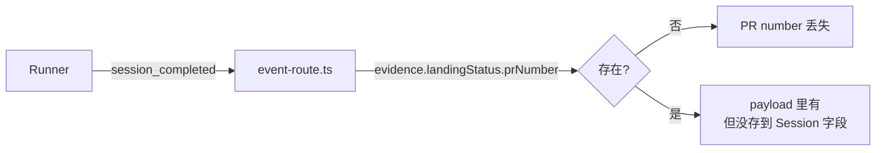
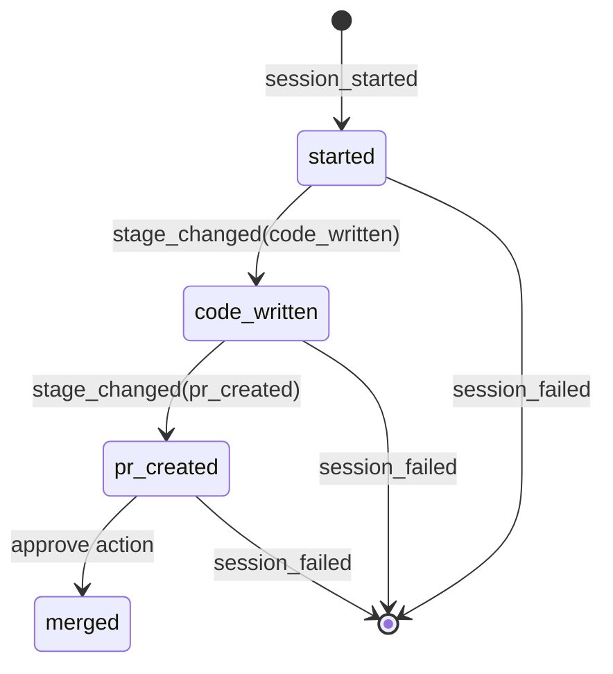

# Research: Lead 编排能力实现模式 — GEO-292

**Issue**: GEO-292
**Date**: 2026-03-30
**Source**: `doc/engineer/exploration/new/GEO-292-lead-orchestration.md`

---

## 1. PR Number 数据流分析

### 现有路径



**发现**：`LandingStatus` interface（`packages/core/src/decision-types.ts:16`）已定义 `prNumber?: number`。当 `flywheel-land` skill 执行后，PR number 通过 `evidence.landingStatus.prNumber` 传递到 `session_completed` event payload。

**问题**：`event-route.ts:302` 的 `patchSessionMetadata()` 只提取了 `decision_route`、`commit_count`、`files_changed` 等字段，**没有提取 `evidence.landingStatus.prNumber`**。数据在 event payload JSON 里，但 Session 没有对应字段。

### 修复路径

1. Session 加 `pr_number` 字段（nullable INTEGER）
2. `event-route.ts` session_completed handler 从 `evidence.landingStatus.prNumber` 提取
3. `patchSessionMetadata()` 写入 Session
4. `GET /api/sessions` 返回 `pr_number`

**复杂度**：小 — 纯粹是"数据已有但没存"，只需加字段 + 提取逻辑。

---

## 2. Stage Tracking 设计（借鉴 Orchestrator + AgentsMesh）

### 2.1 Orchestrator 的 Step Template 模式

Orchestrator 用 9 步精细模板（`.claude/orchestrator/state.sh`）：
```
Verify → Brainstorm → Research → Plan+DR → Implement → CR → User Approval → Ship → Post-Ship
```

每步有 `start_step()` / `complete_step()` / `fail_step()` / `skip_step()` + gate 检查。这对本地 agent 有效（agent 自己调用 `track.sh`），但 Discord Lead 不能调用 bash 脚本。

### 2.2 AgentsMesh 的 Autopilot 断路器模式

AgentsMesh Autopilot Controller（`autopilot_controller.go`）的核心循环：
```
observe → decide → act → wait → observe ...
```

**断路器规则**（设计模式层面，非代码复制）：
- **No-progress 检测**：连续 N 次迭代无文件变更 → 暂停 → 通知人类
- **Same-error 检测**：相同错误模式出现 N 次 → 触发断路器
- **超时机制**：每次迭代有硬超时（300s），整体执行有软超时

**Flywheel 应用**：
- Runner 的 `session_stage` 长时间不变 → Lead 应 tmux capture 检查
- Runner 进入 `failed` 状态 → Lead 收到 Discord 通知（已有）
- Runner 长时间处于 `started` → Lead 应主动 capture 看是否卡住

### 2.3 AgentsMesh 的 Agent Status Detection 模式

AgentsMesh 通过 OSC escape sequences + 进程检测实现 `executing / waiting / idle` 三态。

**Flywheel 可借鉴的检测方式**：
- tmux `list-panes -F "#{pane_current_command}"` 可检测 Runner 是否在执行命令
- Claude Code 的 OSC title 变化可用于状态推断
- 但这属于**未来 enhancement**，本期不实现 — 粗粒度 stage 已够用

### 2.4 本期方案：粗粒度 Session Stage



4 个 stage：
- `started` — Runner 启动，开始工作
- `code_written` — 代码已提交（有 commit 但未出 PR）
- `pr_created` — PR 已创建
- `merged` — PR 已合并（approve action 后）

**上报机制**：Runner 通过 `POST /events/ingest` 发送 `stage_changed` event type，payload 包含 `{ stage: "code_written" }` 等。Event-route handler 更新 Session 的 `session_stage` 字段。

**Agent.md 行为规则**（AgentsMesh Autopilot 断路器思想的 prompt-level 实现）：
- `started` 超过 2h → Lead 应 capture 检查 Runner 状态
- `code_written` 超过 30min → Lead 可 capture 看 review 进度
- `pr_created` → Lead 应通知 Annie review

---

## 3. StateStore Migration 模式

### 现有模式分析

StateStore（`packages/teamlead/src/StateStore.ts`）使用 **idempotent try-catch pattern**：

```typescript
// 每个新字段独立 try-catch，ALTER TABLE 幂等
try {
    this.db.run("ALTER TABLE sessions ADD COLUMN heartbeat_at TEXT");
} catch {
    // Column already exists — ignore
}
```

**特点**：
- 无版本化 migration 文件
- 每次启动都 run 一遍所有 migration（幂等）
- `PRAGMA user_version` 只用于一次性数据清理（如版本 2 的 thread 清理）
- `patchSessionMetadata()` 用于非 upsert 的增量字段更新

### 本期 Migration 策略

遵循现有模式：
1. `migrate()` 中加 `try { ALTER TABLE sessions ADD COLUMN pr_number INTEGER } catch {}`
2. `try { ALTER TABLE sessions ADD COLUMN session_stage TEXT } catch {}`
3. `SessionUpsert` / `Session` interface 加对应字段
4. `upsertSession()` 的 INSERT/UPDATE SQL 加新字段
5. `patchSessionMetadata()` 支持新字段

---

## 4. 关键文件清单

| 文件 | 改动类型 | 说明 |
|------|---------|------|
| `packages/teamlead/src/StateStore.ts` | 改 | 加 pr_number + session_stage 字段、migration、upsert |
| `packages/teamlead/src/bridge/event-route.ts` | 改 | session_completed 提取 PR number；新增 stage_changed handler |
| `packages/teamlead/src/bridge/tools.ts` | 改 | GET /api/sessions 返回新字段 |
| `packages/core/src/decision-types.ts` | 读 | LandingStatus.prNumber 已存在（不需要改） |
| `packages/edge-worker/src/ExecutionEventEmitter.ts` | 读 | emitCompleted 已传递 evidence（不需要改） |
| `packages/teamlead/src/__tests__/event-route.test.ts` | 改 | 新增 PR number 提取 + stage_changed 测试 |
| `packages/teamlead/src/__tests__/StateStore.test.ts` | 改 | 新增 pr_number + session_stage 字段测试 |

---

## 5. 风险评估

| 风险 | 影响 | 缓解 |
|------|------|------|
| Runner 不上报 stage_changed | Lead 看不到 stage 变化 | stage 字段默认 "started"，不影响现有流程 |
| PR number 在 landingStatus 中不存在（未 land 的 session） | pr_number 为 null | nullable 字段，Lead 查 session 看到 null 就知道未出 PR |
| Session 表继续膨胀 | 已有 30+ 字段 | 两个小字段可接受；长期考虑 session_artifacts 表 |
