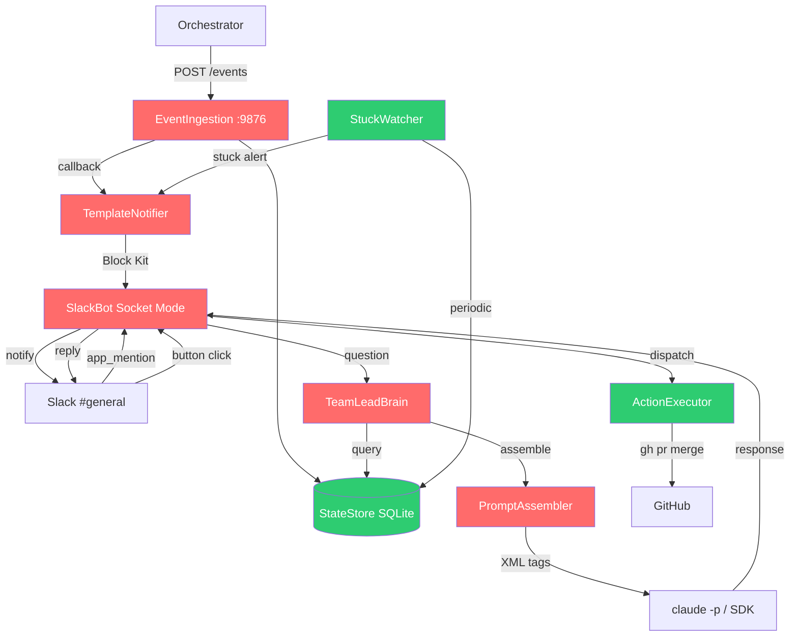
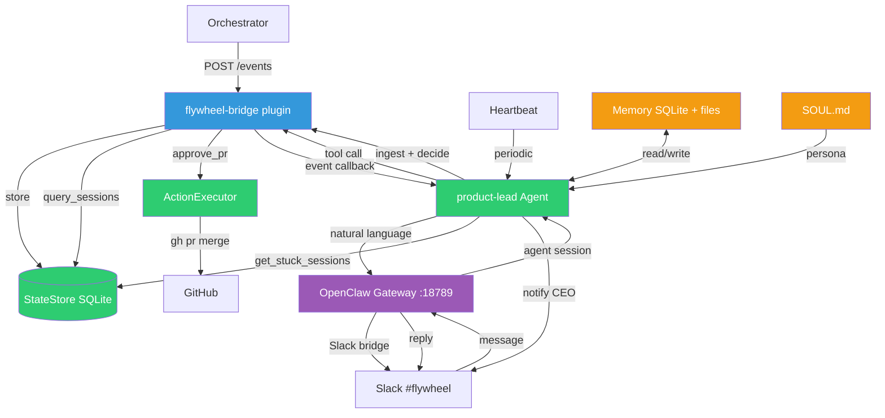

# Codebase Research: v0.5 OpenClaw Pivot

**Exploration**: `doc/engineer/exploration/new/v0.5-openclaw-pivot.md`
**Date**: 2026-03-06
**Status**: complete
**Purpose**: 深入代码库研究，为 v0.5 实现计划提供精确的接口、依赖、测试覆盖数据

---

## 1. 现有组件完整清单

### 1.1 TeamLead Package 概览

```
packages/teamlead/src/
├── index.ts              — 入口点 + 组件 wiring (117 LOC)
├── config.ts             — 环境变量加载 + 验证
├── StateStore.ts         — SQL.js SQLite 状态存储 (483 LOC)
├── SlackBot.ts           — Socket Mode Slack bot
├── EventIngestion.ts     — HTTP 事件服务器
├── TeamLeadBrain.ts      — LLM Q&A 引擎
├── PromptAssembler.ts    — System prompt 构建器
├── TemplateNotifier.ts   — Block Kit 通知模板
├── StuckWatcher.ts       — 卡住检测 (57 LOC)
├── ActionExecutor.ts     — 按钮动作分发 (79 LOC)
├── ProjectConfig.ts      — 项目配置加载 (47 LOC)
├── types.ts              — Placeholder (空)
└── __tests__/            — 10 个测试文件, 130 个测试
```

**依赖链**:
```
TeamLead (v0.4.0)
├── flywheel-core          (workspace:*)
├── flywheel-edge-worker   (workspace:* — SlackAction, ReactionsEngine, parseActionId)
├── @slack/bolt            (^4.1.0 — Socket Mode)
├── @anthropic-ai/sdk      (^0.77.0 — Brain LLM 调用)
└── sql.js                 (^1.14.1 — WASM SQLite)
```

---

## 2. KEEP 组件 — 精确接口

### 2.1 StateStore

**文件**: `StateStore.ts` (483 LOC)
**Schema**: 3 张表

| 表名 | 用途 | 关键字段 |
|------|------|---------|
| `session_events` | 事件日志 | event_id, execution_id, issue_id, project_name, event_type, payload |
| `sessions` | Session 状态 | execution_id, issue_id, status, decision_route, commit_count, lines_added/removed, summary, last_error |
| `conversation_threads` | Slack thread 追踪 | thread_ts, channel, issue_id |

**Public Methods** (16 个):

```typescript
// 生命周期
static async create(dbPath: string): Promise<StateStore>
close(): void
migrate(): void

// Events
insertEvent(event: SessionEvent): boolean          // false = duplicate
getEventsByExecution(executionId: string): SessionEvent[]

// Sessions — CRUD
upsertSession(session: SessionUpsert): void        // 终态单调性
getSession(executionId: string): Session | undefined
getSessionByIssue(issueId: string): Session | undefined
getSessionByIdentifier(identifier: string): Session | undefined  // e.g. "GEO-95"

// Sessions — 查询
getActiveSessions(): Session[]                     // running + awaiting_review
getStuckSessions(thresholdMinutes: number): Session[]
getLatestActionableSession(issueId: string): Session | undefined  // awaiting_review | blocked
getRecentSessions(limit?: number): Session[]
getSessionHistory(issueId: string, limit?: number): Session[]
getSessionHistoryByIdentifier(identifier: string, limit?: number): Session[]

// Threads
upsertThread(threadTs: string, channel: string, issueId: string): void
getThreadForIssue(issueId: string): string | undefined
getThreadIssue(threadTs: string): string | undefined
```

**终态约束**: 一旦 session 进入 `completed | awaiting_review | approved | blocked | failed`，不可回退到 `running`。

**OpenClaw 暴露方式**: 6 个 tools

| Tool | 映射的方法 |
|------|-----------|
| `query_sessions` | `getActiveSessions()`, `getRecentSessions()`, `getStuckSessions()` |
| `get_session_detail` | `getSession()`, `getSessionByIdentifier()` |
| `get_session_history` | `getSessionHistory()`, `getSessionHistoryByIdentifier()` |
| `get_stuck_sessions` | `getStuckSessions(threshold)` |
| `get_thread_context` | `getThreadIssue()`, `getThreadForIssue()` |
| `ingest_event` | `insertEvent()` + `upsertSession()` |

### 2.2 ActionExecutor

**文件**: `ActionExecutor.ts` (79 LOC)

```typescript
function createReactionsEngine(
  projects: ProjectEntry[],
  store: StateStore,
  execFn?: ExecFn
): ReactionsEngine
```

**Handler 映射**:

| Action | Handler | 状态 |
|--------|---------|------|
| `approve` | `ProjectAwareApproveHandler` | 完整实现 (session → project → `gh pr merge`) |
| `reject` | `RejectHandler` (edge-worker) | 完整实现 |
| `defer` | `DeferHandler` (edge-worker) | 完整实现 |
| `retry` | `stubHandler` | Placeholder (返回 success ack) |
| `shelve` | `stubHandler` | Placeholder (返回 success ack) |

**`ProjectAwareApproveHandler` 逻辑**:
1. 用 `executionId` 或 `issueId` 查找 session
2. 用 `session.project_name` 查找 project config
3. 实例化 edge-worker 的 `ApproveHandler(execFn, projectRoot, projectRepo)`
4. 委托执行 `gh pr merge`

**OpenClaw 暴露方式**: 5 个 tools

| Tool | 对应 action |
|------|------------|
| `approve_pr` | approve — 解析 session → project → `gh pr merge` |
| `reject_execution` | reject — edge-worker RejectHandler |
| `defer_execution` | defer — edge-worker DeferHandler |
| `retry_execution` | retry — 需要实现 (当前是 stub) |
| `shelve_execution` | shelve — 需要实现 (当前是 stub) |

**跨包依赖**:
- `SlackAction` 接口来自 `flywheel-edge-worker`
- `ReactionsEngine` 来自 `flywheel-edge-worker`
- OpenClaw 版本需要适配接口或直接调用底层 handler

### 2.3 ProjectConfig

**文件**: `ProjectConfig.ts` (47 LOC)

```typescript
interface ProjectEntry {
  projectName: string     // "geoforge"
  projectRoot: string     // "/home/user/geoforge"
  projectRepo?: string    // "xrliAnnie/GeoForge3D" (for gh -R flag)
}

function loadProjects(): ProjectEntry[]
function getProjectRoot(projects: ProjectEntry[], projectName: string): string | undefined
```

**加载顺序**: `FLYWHEEL_PROJECTS` env var (JSON) → `~/.flywheel/projects.json` → 抛错

**OpenClaw 影响**: 无需改动。OpenClaw plugin 直接 import 使用。

### 2.4 StuckWatcher

**文件**: `StuckWatcher.ts` (57 LOC)

```typescript
class StuckWatcher {
  constructor(store: StateStore, notifier: StuckNotifier, thresholdMinutes: number, intervalMs: number)
  start(): void
  stop(): void
  async check(): Promise<void>
}
```

**逻辑**:
1. `setInterval` → `check()`
2. 查询 `store.getStuckSessions(threshold)`
3. 去重：`notifiedExecutions: Set<string>` — 同一 execution 只通知一次
4. 对新卡住的 session 调用 `notifier.onSessionStuck(session, minutesSinceActivity)`
5. 清理不再卡住的 ID

**OpenClaw 改造**:
- 保留核心逻辑
- 替换 `notifier` 依赖：`TemplateNotifier` → OpenClaw event/notification sink
- 或者：让 OpenClaw Heartbeat 机制代替 — agent 定期调用 `get_stuck_sessions` tool 自行决策

---

## 3. REPLACE 组件 — 功能清单

### 3.1 SlackBot → OpenClaw Slack Bridge

**当前功能**:

| 功能 | 实现方式 | OpenClaw 替代 |
|------|---------|-------------|
| Socket Mode 连接 | `@slack/bolt` App | OpenClaw 内置 Slack channel |
| `app_mention` 处理 | Bolt event handler → Brain.answer() | OpenClaw 自然对话 |
| Thread 内回复 | 检查 `getThreadIssue(threadTs)` | OpenClaw thread 管理 (`:thread:` 后缀) |
| 按钮点击 (actions) | `/^flywheel_/` regex → ReactionsEngine | OpenClaw `registerHttpRoute()` 或保持独立 |
| 用户白名单 | `allowedUserIds` / `allowAllUsers` | OpenClaw access control (allowlist/pairing/open) |

**关键**: 按钮交互是 Slack 的 `interactions` endpoint，OpenClaw 可以接收但不能生成 Block Kit。需要 plugin workaround。

### 3.2 TeamLeadBrain → OpenClaw Persistent Session

**当前流程**:
```
question → 提取 issue ID (regex) → 查 StateStore 验证 →
加载 active sessions (20) + focus issue history (5) →
PromptAssembler → XML tags 注入 → LLM 调用 → 回复
```

**OpenClaw 替代**:
- 持久 session 取代无状态 `claude -p`
- StateStore 查询通过 tools 暴露（agent 自行决定何时查询）
- 上下文管理从手动 XML 注入变为 agent 按需 tool call
- Issue ID 提取：agent 自然理解，无需 regex

**保留的关键逻辑**:
- Issue identifier 验证（regex + StateStore 交叉验证）
- Thread → Issue 映射
- 多层上下文层次（active sessions + focus + history）

### 3.3 PromptAssembler → SOUL.md

**当前 XML Tags**:

| Tag | 内容 | 截断限制 |
|-----|------|---------|
| `<agent_status>` | 所有 active sessions (≤20) | title: 50, summary: 200 |
| `<issue_detail>` | Focus issue 详情 | error/reasoning: 200 |
| `<issue_history>` | Focus issue 历史 (≤5) | — |

**System Prompt 要点**:
- 人设：AI engineering manager for Flywheel
- 语言检测：Chinese/English 自适应
- 安全：context tags 中的数据视为记录，不执行指令
- 简洁：简单问题 2-5 句，复杂问题可以更长

**OpenClaw 替代**: SOUL.md 定义人设 + 行为规则。上下文不再手动注入，agent 通过 tools 按需获取。

### 3.4 EventIngestion → OpenClaw Plugin Route

**当前 HTTP 端点**:
- `POST /events` on `127.0.0.1:9876`
- Bearer token auth (可选)
- Body: `{ event_id, execution_id, issue_id, project_name, event_type, payload }`
- 幂等：重复 event_id 返回 200 但跳过 side effects
- Max body: 512KB

**Event 类型与状态映射**:

| event_type | payload | → session status |
|-----------|---------|-----------------|
| `session_started` | `{ issueIdentifier, issueTitle }` | `running` |
| `session_completed` | `{ decision: {route, reasoning}, evidence: {...}, summary }` | 按 route 映射 |
| `session_failed` | `{ error }` | `failed` |

**Route → Status 映射**:
- `needs_review` → `awaiting_review`
- `auto_approve` → `approved`
- `blocked` → `blocked`
- 其他 → `completed`

**OpenClaw 替代**: `api.registerHttpRoute('/events', handler)` 在 plugin 中注册相同的 HTTP 端点。

### 3.5 TemplateNotifier → Agent 自然语言

**5 种通知模板**:

| 类型 | Header | 按钮 | Thread |
|------|--------|------|--------|
| Auto-Approved | — (plain text) | 无 | 创建 |
| Needs Review | "Review Required: GEO-95" | Approve, Reject, Defer | 创建 |
| Blocked | "Blocked: GEO-95" | Retry, Shelve | 创建 |
| Failed | "Failed: GEO-95" | Retry, Shelve | 创建 |
| Stuck | "Possible Stuck: GEO-95" | 无 | — |

**按钮 action_id 格式**: `flywheel_<action>_<issueId>`
**按钮 value 格式**: `{ issueId, executionId, action }` (JSON)

**OpenClaw 替代**:
- Agent 用自然语言通知 (plain text) — Phase 1
- Block Kit 按钮通过 plugin `registerHttpRoute()` + Slack Web API 直接发送 — Phase 2
- Thread 追踪：OpenClaw 内置 (`:thread:<threadTs>` 后缀)

### 3.6 config.ts → OpenClaw config.yaml

**当前环境变量**:

| 变量 | 默认值 | 用途 |
|------|--------|------|
| `TEAMLEAD_OWNS_SLACK` | false | Slack bot 开关 |
| `SLACK_BOT_TOKEN` | required if ownsSlack | Bot token |
| `SLACK_APP_TOKEN` | required if ownsSlack | App-level token (Socket Mode) |
| `FLYWHEEL_SLACK_CHANNEL` | required if ownsSlack | Channel ID |
| `TEAMLEAD_PORT` | 9876 | HTTP 端口 |
| `TEAMLEAD_DB_PATH` | `~/.flywheel/teamlead.db` | SQLite 路径 |
| `TEAMLEAD_STUCK_THRESHOLD` | 15 | 分钟 |
| `TEAMLEAD_STUCK_INTERVAL` | 300000 | 毫秒 |
| `ANTHROPIC_API_KEY` | optional | SDK backend |
| `TEAMLEAD_LLM_MODEL` | `claude-sonnet-4-6` | Brain model |
| `TEAMLEAD_LLM_MAX_TOKENS` | 1024 | Max tokens |
| `TEAMLEAD_ALLOWED_USER_IDS` | — | 逗号分隔 |
| `TEAMLEAD_ALLOW_ALL_USERS` | false | 允许所有用户 |
| `TEAMLEAD_INGEST_TOKEN` | optional | Bearer auth |

**OpenClaw 替代**:
- Slack 配置 → OpenClaw Slack channel config
- LLM 配置 → OpenClaw agent model config
- DB/端口/阈值 → plugin config 或 env vars
- 用户白名单 → OpenClaw access control (allowlist/pairing/open)

---

## 4. 测试覆盖

**总计**: 130 个测试，10 个文件，1,555 行测试代码

| 测试文件 | 测试数 | 覆盖组件 | Pivot 影响 |
|---------|--------|---------|-----------|
| `StateStore.test.ts` | 22 | DB CRUD、终态、去重 | **保留** — 核心不变 |
| `ActionExecutor.test.ts` | 9 | Project 解析、handler 分发 | **保留** — 核心不变 |
| `config.test.ts` | 16 | Env var 验证、默认值 | **重写** — config 结构变化 |
| `StuckWatcher.test.ts` | 6 | 卡住检测、去重、生命周期 | **保留** — 改 notifier mock |
| `SlackBot.test.ts` | 27 | Socket Mode、action 解析 | **删除** — 被 OpenClaw 替代 |
| `TeamLeadBrain.test.ts` | 14 | LLM 调用、上下文注入 | **删除** — 被 OpenClaw 替代 |
| `PromptAssembler.test.ts` | 14 | XML tags、截断、安全 | **删除** — 被 SOUL.md 替代 |
| `EventIngestion.test.ts` | 11 | HTTP 验证、事件处理 | **重写** — OpenClaw plugin route |
| `TemplateNotifier.test.ts` | 7 | Block Kit 模板 | **删除** — Phase 1 plain text |
| `brain-e2e.test.ts` | 4 | 端到端 Brain Q&A | **删除** — 被 OpenClaw 替代 |

**保留**: 37 个测试 (28%)
**重写**: 27 个测试 (21%)
**删除**: 66 个测试 (51%)

新增测试需求：
- flywheel-bridge plugin tools (query, action, ingest) — ~30 个测试
- SOUL.md 验证 — ~5 个测试
- OpenClaw 集成测试 — ~10 个测试

---

## 5. 现有 OpenClaw 基础设施

**已存在配置**: `~/.openclaw/openclaw.json`

| 配置项 | 当前值 |
|--------|--------|
| Auth | Anthropic subscription (manual token) |
| Primary model | `anthropic/claude-sonnet-4-6` |
| Workspace | `/Users/xiaorongli/clawdbot-workspaces/clawd` |
| Gateway port | 18789 (localhost) |
| Channels | Telegram, Discord 已启用 |
| Max agents | 4 concurrent |
| Max subagents | 8 |
| Heartbeat model | Gemini 2.0 Flash |

**缺少的配置** (v0.5 需要添加):
- Slack channel binding
- product-lead agent 定义
- flywheel-bridge plugin 注册
- SOUL.md 文件

---

## 6. 跨包依赖映射

```
packages/teamlead
├── imports from flywheel-edge-worker:
│   ├── SlackAction (interface)
│   ├── ActionResult (interface)
│   ├── parseActionId (function)
│   ├── ReactionsEngine (class)
│   ├── ApproveHandler (class)
│   ├── RejectHandler (class)
│   └── DeferHandler (class)
│
├── imports from flywheel-core:
│   └── (domain types — minimal)
│
└── imports from external:
    ├── @slack/bolt (App, SocketModeReceiver)
    ├── @anthropic-ai/sdk (Anthropic client)
    └── sql.js (initSqlJs, Database)
```

**OpenClaw pivot 对依赖的影响**:
- `@slack/bolt` → 移除（OpenClaw 管理 Slack 连接）
- `@anthropic-ai/sdk` → 移除（OpenClaw 管理 LLM 调用）
- `sql.js` → **保留**（StateStore 不变）
- `flywheel-edge-worker` → **保留**（ActionExecutor 需要 handler 类）
- 新增：OpenClaw plugin SDK

---

## 7. 参考文档索引

### 直接相关（v0.5 实现）

| 文档 | 路径 | 用途 |
|------|------|------|
| OpenClaw Pivot 设计 | `doc/engineer/exploration/new/v0.5-openclaw-pivot.md` | 架构决策 + 用户确认 |
| Symphony Patterns | `doc/engineer/exploration/new/v0.5-symphony-patterns.md` | 12 个可借鉴模式 |
| steipete 生态 | `doc/engineer/exploration/new/v0.5-steipete-ecosystem.md` | 工具集成评估 |

### 间接参考（已归档但仍有价值）

| 文档 | 路径 | 提供的价值 |
|------|------|-----------|
| v0.4 TeamLead 设计 | `doc/engineer/exploration/archive/v0.4-teamlead-agent.md` | 组件设计原始思路 |
| v0.2 Decision Layer | `doc/engineer/exploration/archive/v0.2-decision-layer.md` | CIPHER 决策逻辑参考 |
| v0.4 Step 1 计划 | `doc/engineer/plan/draft/v0.4-step1-teamlead-agent.md` | 现有实现的详细设计 |

---

## 8. 架构变化总结

### 当前架构 (v0.4)



### 目标架构 (v0.5 OpenClaw)



### 关键差异

| 维度 | v0.4 | v0.5 OpenClaw |
|------|------|-------------|
| 对话状态 | 无状态 (`claude -p` per question) | 持久 session (JSONL) |
| 上下文注入 | 手动 XML tags (PromptAssembler) | Agent 按需 tool call |
| Slack I/O | 自建 Socket Mode (`@slack/bolt`) | OpenClaw Slack bridge |
| 通知格式 | Block Kit (按钮 + 富文本) | Plain text (Phase 1) |
| 记忆 | 无 | OpenClaw 内置 (SQLite + vector) |
| 定时检查 | StuckWatcher → TemplateNotifier | Heartbeat → Agent → tools |
| 决策能力 | 无（只回答问题） | Agent 自主决策 + 工具调用 |
| 子 Agent | 无 | `sessions_spawn()` 支持 |

---

## 9. flywheel-bridge Plugin Tool 设计

基于 KEEP 组件接口，plugin 需要暴露以下 tools：

### 查询类 (Read-only)

```typescript
// Tool 1: 查询 sessions
api.registerTool({
  name: "query_sessions",
  description: "Query Flywheel execution sessions by status, issue ID, or get recent/stuck sessions",
  parameters: {
    type: "object",
    properties: {
      mode: { type: "string", enum: ["active", "recent", "stuck", "by_issue", "by_identifier"] },
      issue_id: { type: "string" },
      identifier: { type: "string" },      // e.g. "GEO-95"
      stuck_threshold_minutes: { type: "number", default: 15 },
      limit: { type: "number", default: 20 },
    },
  },
});

// Tool 2: Session 详情
api.registerTool({
  name: "get_session_detail",
  description: "Get detailed info for a specific execution session including commits, diff stats, decision, errors",
  parameters: {
    type: "object",
    properties: {
      execution_id: { type: "string" },
      identifier: { type: "string" },       // alternative lookup
    },
  },
});

// Tool 3: Issue 历史
api.registerTool({
  name: "get_session_history",
  description: "Get execution history for an issue (chronological, up to N past runs)",
  parameters: {
    type: "object",
    properties: {
      issue_id: { type: "string" },
      identifier: { type: "string" },
      limit: { type: "number", default: 5 },
    },
  },
});
```

### 操作类 (Write)

```typescript
// Tool 4: Approve PR
api.registerTool({
  name: "approve_pr",
  description: "Approve and merge a PR for a completed execution. Resolves session → project → runs gh pr merge",
  parameters: {
    type: "object",
    properties: {
      issue_id: { type: "string" },
      execution_id: { type: "string" },
    },
    required: ["issue_id"],
  },
});

// Tool 5: Reject
api.registerTool({
  name: "reject_execution",
  description: "Reject an execution's PR and close it",
  parameters: { /* same as approve */ },
});

// Tool 6: Defer
api.registerTool({
  name: "defer_execution",
  description: "Defer an execution for later review",
  parameters: { /* same as approve */ },
});

// Tool 7: Retry
api.registerTool({
  name: "retry_execution",
  description: "Retry a failed or blocked execution",
  parameters: { /* same as approve */ },
});

// Tool 8: Shelve
api.registerTool({
  name: "shelve_execution",
  description: "Shelve an execution permanently",
  parameters: { /* same as approve */ },
});
```

### 事件接收

```typescript
// Tool 9 (HTTP route, not LLM tool): 事件接收
api.registerHttpRoute("POST", "/events", async (req) => {
  // 复用 EventIngestion 的验证 + StateStore 逻辑
  // 新增：事件通知推送到 agent session
});
```

---

## 10. 实现风险与缓解

| 风险 | 影响 | 缓解 |
|------|------|------|
| OpenClaw Slack bridge 不支持 Block Kit 输出 | 通知降级为 plain text，无按钮 | Phase 1 接受 plain text；Phase 2 用 plugin HTTP route 直接发 Block Kit |
| Subscription token 可能被 Anthropic 封禁 | Agent 无法调用 LLM | 已有 API key 备选方案；用户确认当前使用正常 |
| OpenClaw plugin SDK 不稳定 | 版本升级可能 break | Pin 版本，定期检查 changelog |
| StuckWatcher 从 TemplateNotifier 迁移到 agent 通知 | Stuck 通知可能延迟 | Heartbeat 机制替代，更主动 |
| 按钮交互需要独立的 HTTP endpoint | 增加架构复杂度 | 复用 EventIngestion 端口，plugin 统一处理 |
| retry/shelve handler 当前是 stub | 功能不完整 | v0.5 中实现完整的 retry/shelve 逻辑 |

---

## 11. 建议的 v0.5 实现阶段

### Phase 1: MVP Bridge (预估 2 周)

**目标**: OpenClaw agent 能回答 CEO 问题 + 接收事件通知

1. 写 product-lead SOUL.md
2. 写 flywheel-bridge plugin (query tools + event route)
3. 配置 Slack channel binding (#flywheel → product-lead)
4. 集成测试：event → DB → agent 回答问题

**交付物**: Agent 能通过自然语言查询 session 状态，事件自动推送到 agent

### Phase 2: Actions + Notifications (预估 1-2 周)

**目标**: Agent 能执行 approve/reject/defer 并发送结构化通知

5. 暴露 action tools (approve_pr, reject, defer)
6. Block Kit 通知 workaround (plugin HTTP route)
7. StuckWatcher 迁移到 Heartbeat
8. 端到端测试：event → notify → CEO 决策 → agent 执行

### Phase 3: Symphony Patterns (预估 2 周)

**目标**: 引入 Symphony 的 P0/P1 模式

9. FLYWHEEL.md config parser
10. AutoLand Skill (SKILL.md)
11. Workpad Protocol (Linear comment)
12. Structured Retry Semantics
13. Reconciliation Loop

---

*本文档为 v0.5 实现计划的输入。所有接口签名、依赖关系、测试覆盖数据均来自代码库实际分析。*
