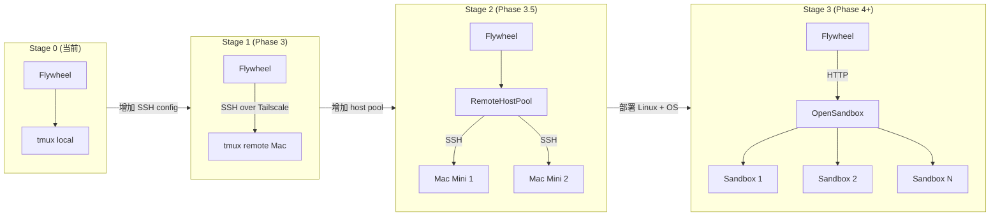

# Research 007: Remote Execution 方案评估

> 日期：2026-03-01
> 优先级：🟢 Low（Phase 3+）
> 输入：`doc/engineer/plan/backlog/R5-remote-execution-sandbox.md` + `/tmp/OpenSandbox/` 源码深度分析
> 产出：Remote Mac 执行方案选型 + OpenSandbox 适用性评估

---

## 背景

Flywheel 当前运行在本地 Mac + tmux 模式（v0.1.0/v0.1.1）。随着 project 数量增长，CEO 提出可能将执行迁移到 remote Mac（如 Garage Mac Mini）。本文评估四种 remote 执行方案，并深度分析 OpenSandbox 的 TypeScript SDK 实现与 macOS 适用性限制。

---

## 1. 方案对比表

| 维度 | SSH + tmux | OpenSandbox + Docker | Tailscale + tmux | Claude Code SDK remote |
|------|-----------|---------------------|-----------------|----------------------|
| **配置复杂度** | 低（SSH key + tmux） | 高（server + Docker + execd + egress sidecar） | 中（Tailscale 安装 + SSH） | 中高（SDK 配置 + 网络） |
| **延迟** | 低（直接 SSH，局域网 <1ms） | 中（Docker 启动 2-5s，execd HTTP 开销） | 低（Tailscale WireGuard 层，基本等同局域网） | 中（API 调用往返） |
| **安全隔离** | 无（进程级，共享 user） | 高（Docker namespace + cgroup + 可选 egress 控制） | 无（进程级，同 SSH） | 中（依赖 Claude API 端） |
| **监控能力** | 低（需手动 tmux attach） | 高（SSE 实时流、`/metrics`、`/metrics/watch` 1s 周期） | 低（同 SSH） | 低（API 返回结果，无实时流） |
| **macOS 兼容性** | 完全兼容 | 部分兼容：Docker 可运行，egress 控制（nftables/iptables）**仅 Linux** | 完全兼容 | 完全兼容 |
| **故障恢复** | 手动（tmux session 持久化，重连即可） | 需要 Lifecycle API 重建 sandbox | 手动（同 SSH） | 无状态，重新调用 |
| **成本** | 零（SSH 原生） | Docker 资源消耗 + 维护 server | Tailscale 免费 tier 够用 | API 调用费用 |
| **项目规模适配** | 1-5 projects（手动管理） | 10+ projects（自动化，K8s 可扩展） | 1-5 projects | 受 API 限制 |

### 关键限制说明

**SSH + tmux**：适合当前场景，零额外依赖。缺点是无进程隔离——两个 project 的 Claude Code session 都跑在同一个 user 下，互相可见文件系统，API key 通过 env 传递存在泄漏风险（`ps aux` 可见）。

**OpenSandbox + Docker**：macOS 上 Docker Desktop 存在性能问题（通过 Linux VM 层转发，I/O 延迟约 2-3x）。更关键的是 egress 控制（nftables/iptables）需要 `CAP_NET_ADMIN` 且**仅 Linux kernel 支持**，macOS 完全无法使用这个功能。

**Tailscale + tmux**：在 SSH 基础上加了 VPN 层，解决了动态 IP 问题（Tailscale 设备 IP 固定），适合跨网络（如 Garage Mac Mini 不在同一局域网）。安全性与 SSH 相同。

**Claude Code SDK remote**：`@anthropic-ai/claude-code` SDK 目前没有成熟的"远程 session"概念，本质是直接 API 调用，没有状态持久化和交互式 tmux 体验。

---

## 2. OpenSandbox 深度分析

> 源码版本：v0.1.4（`package.json` 中 `"version": "0.1.4"`）
> npm 包名：`@alibaba-group/opensandbox`

### 2.1 TypeScript SDK API Surface

SDK 分两层：**Lifecycle API**（sandbox 生命周期管理）和 **Execd API**（sandbox 内部执行）。

#### 主入口：`Sandbox` 类（`src/sandbox.ts`）

```typescript
// 创建 sandbox
const sbx = await Sandbox.create({
  image: "opensandbox/code-interpreter:v1.0.1",  // 或带 auth 的私有镜像
  env: { ANTHROPIC_AUTH_TOKEN: "..." },
  networkPolicy: {
    defaultAction: "deny",
    egress: [
      { action: "allow", target: "api.anthropic.com" },
      { action: "allow", target: "*.npmjs.org" },
    ],
  },
  volumes: [{
    name: "project-src",
    host: { path: "/Users/me/project" },
    mountPath: "/workspace",
  }],
  resource: { cpu: "2", memory: "4Gi" },
  timeoutSeconds: 3600,
  metadata: { project: "geoforge3d", issueId: "GEO-42" },
});

// 连接已有 sandbox（重连场景）
const sbx2 = await Sandbox.connect({ sandboxId: "existing-id" });

// 执行命令（同步，返回完整结果）
const result = await sbx.commands.run("npm i -g @anthropic-ai/claude-code@latest");
console.log(result.logs.stdout);

// 执行命令（SSE 流式，最低级 API）
for await (const event of sbx.commands.runStream("claude 'fix this bug'")) {
  if (event.type === "stdout") process.stdout.write(event.text ?? "");
}

// 文件系统操作
await sbx.files.writeFiles([{ path: "/workspace/prompt.txt", data: "...", mode: 644 }]);
const content = await sbx.files.readFile("/workspace/result.md");

// 生命周期管理
await sbx.pause();       // 暂停（保留状态）
const resumed = await sbx.resume();  // 恢复，返回新实例
await sbx.renew(3600);   // 续期
await sbx.kill();        // 销毁

// 监控
const metrics = await sbx.getMetrics();
// { cpuUsedPercentage, memoryUsedMiB, memoryTotalMiB, ... }
```

完整接口（从 `src/index.ts` 导出）：

```typescript
// 核心类
class Sandbox {
  readonly id: SandboxId
  readonly commands: ExecdCommands  // run() / runStream() / interrupt() / getCommandStatus()
  readonly files: SandboxFiles      // read/write/search/move/delete/setPermissions
  readonly health: ExecdHealth      // ping()
  readonly metrics: ExecdMetrics    // getMetrics()
  readonly sandboxes: Sandboxes     // 底层 lifecycle API

  static create(opts: SandboxCreateOptions): Promise<Sandbox>
  static connect(opts: SandboxConnectOptions): Promise<Sandbox>
  static resume(opts: SandboxConnectOptions): Promise<Sandbox>  // 恢复暂停的 sandbox
  getInfo(): Promise<SandboxInfo>
  isHealthy(): Promise<boolean>
  getMetrics(): Promise<SandboxMetrics>
  pause(): Promise<void>
  resume(): Promise<Sandbox>  // 返回新实例（endpoint 可能变化）
  kill(): Promise<void>
  renew(timeoutSeconds: number): Promise<RenewSandboxExpirationResponse>
  getEndpoint(port: number): Promise<Endpoint>
  getEndpointUrl(port: number): Promise<string>
  waitUntilReady(opts): Promise<void>
  close(): Promise<void>  // 释放 HTTP agent
}

// 管理接口（批量管理多个 sandbox）
class SandboxManager {
  static create(opts: SandboxManagerOptions): SandboxManager
  listSandboxInfos(filter: SandboxFilter): Promise<ListSandboxesResponse>
  getSandboxInfo(sandboxId): Promise<SandboxInfo>
  killSandbox(sandboxId): Promise<void>
  pauseSandbox(sandboxId): Promise<void>
  resumeSandbox(sandboxId): Promise<void>
  renewSandbox(sandboxId, timeoutSeconds): Promise<void>
  close(): Promise<void>
}
```

#### 默认常量（`src/core/constants.ts`）

```typescript
DEFAULT_EXECD_PORT = 44772         // execd HTTP daemon 端口
DEFAULT_ENTRYPOINT = ["tail", "-f", "/dev/null"]  // 保持容器存活
DEFAULT_RESOURCE_LIMITS = { cpu: "1", memory: "2Gi" }
DEFAULT_TIMEOUT_SECONDS = 600      // 10 分钟默认 TTL
DEFAULT_READY_TIMEOUT_SECONDS = 30 // health check 超时
DEFAULT_REQUEST_TIMEOUT_SECONDS = 30
```

#### 连接配置（`src/config/connection.ts`）

```typescript
// 支持从环境变量读取
// OPEN_SANDBOX_DOMAIN（默认 localhost:8080）
// OPEN_SANDBOX_API_KEY

const config = new ConnectionConfig({
  domain: "remote-mac-mini:8080",
  protocol: "http",
  apiKey: process.env.OPEN_SANDBOX_API_KEY,
  requestTimeoutSeconds: 60,
  useServerProxy: false,  // true: 通过 server 代理 execd 请求
  debug: true,  // 打印 HTTP 请求/响应
});
```

#### SandboxState 状态机

```
Creating → Running ↔ Pausing/Paused ↔ Resuming
Running → Deleting → Deleted
any → Error
```

### 2.2 Docker 注入机制（execd binary via volume mount）

OpenSandbox 的核心技巧是**无需修改 base image**——execd 二进制通过 volume mount 注入到任意容器：

1. **execd**（Go 编译，`CGO_ENABLED=0` 静态链接）构建为 Alpine 兼容的二进制
2. 部署时通过 volume 挂载到 `/opt/opensandbox/execd`
3. `bootstrap.sh` 先启动 execd daemon，再执行用户命令：

```bash
# bootstrap.sh 核心逻辑（简化）
EXECD="${EXECD:=/opt/opensandbox/execd}"
$EXECD &  # 后台启动，监听 :44772

# 然后执行用户容器的 entrypoint
exec "$@"
```

4. execd 是基于 Beego 框架的 HTTP daemon，暴露：
   - `GET /ping` — health check
   - `POST /code` — code execution（Python/Go/JS/TS/Java/Bash via Jupyter kernel）
   - `POST /command` — shell command 同步执行（SSE 流式输出）
   - `POST /command/background` — 后台命令
   - `GET /command/{id}` — 查询命令状态
   - `GET|POST /files/*` — 文件 CRUD
   - `GET /metrics` — 资源指标（CPU/内存/uptime）
   - `GET /metrics/watch` — SSE 实时监控（1s 周期）

这个设计的优势：任何标准 Docker image（python:3.11、ubuntu、node:20 等）都可以直接作为沙箱，无需预配置。

### 2.3 Claude Code 示例分析（`examples/claude-code/main.py`）

```python
# 完整流程：
# 1. 创建 sandbox（code-interpreter image，已含 Node.js）
sandbox = await Sandbox.create(image, connection_config=config, env={
    "ANTHROPIC_AUTH_TOKEN": claude_auth_token,
    "ANTHROPIC_BASE_URL": claude_base_url,  # 可选代理
    "ANTHROPIC_MODEL": "claude_sonnet4",
})

# 2. 运行时安装 Claude CLI
install_exec = await sandbox.commands.run(
    "npm i -g @anthropic-ai/claude-code@latest"
)

# 3. 执行任务（非交互式，返回完整输出）
run_exec = await sandbox.commands.run('claude "Compute 1+1=?."')
for msg in run_exec.logs.stdout:
    print(f"[stdout] {msg.text}")

# 4. 清理
await sandbox.kill()
```

**关键发现**：示例使用 `claude` 命令（非 `--print` 模式），但 `commands.run()` 是同步阻塞等待命令结束，不适合 Flywheel 需要的**交互式 tmux session**——Claude Code 在沙箱中是无头模式（batch mode），没有 `--print` 无法返回结果，而 `--print` 会截断上下文。如果要在 OpenSandbox 内运行 Flywheel 的 session，需要用 `runStream()` 流式接收输出，并自行实现 completion detection（无法依赖 `pane_dead` tmux 语义）。

### 2.4 macOS 兼容性限制（关键问题）

| 组件 | macOS 状态 | 原因 |
|------|-----------|------|
| opensandbox-server（Python FastAPI） | 可运行 | 纯 Python，跨平台 |
| Docker runtime | 性能下降 30-50% | macOS 没有原生 Docker，通过 Linux VM（Docker Desktop / OrbStack）转发 |
| execd daemon | 可运行（需重编译） | Go 静态链接，但需 darwin/arm64 编译 |
| egress sidecar | **完全不可用** | 依赖 `iptables` + `nftables`，macOS kernel 没有这些子系统 |
| `CAP_NET_ADMIN` | macOS 无此 capability | Linux-only |
| network namespace 共享 | macOS Docker 网络实现不同 | sidecar `--network container:` 语义不同 |

**结论**：在 macOS 上，OpenSandbox 可以提供 **进程隔离**（Docker cgroup + namespace），但**无法提供 egress 网络控制**（nftables/iptables 缺失）。对于 Flywheel 当前的 1-2 台 Mac Mini 场景，这意味着放弃了 OpenSandbox 最有价值的安全功能。

---

## 3. 推荐方案

### Phase 3（1-2 台 remote Mac）：Tailscale + SSH + tmux

**理由：**

1. **最小复杂度**：Flywheel v0.1.1 已经有 tmux 会话管理（`TmuxRunner`），remote Mac 只需 SSH 访问，无需重写核心逻辑
2. **macOS 原生**：不引入 Linux 依赖，避免 Docker 性能损耗
3. **Tailscale 解决动态 IP**：Mac Mini 在家庭网络/公司网络下 IP 可能变化，Tailscale 提供稳定的 100.x.x.x 地址，零配置 VPN
4. **符合当前规模**：1-2 台 Mac，手动 SSH key 管理完全可行
5. **监控可行**：通过 SSH 执行 `tmux list-sessions`、`tmux capture-pane` 实现远程监控，或暴露简单 HTTP status endpoint

**架构示意：**

```
本地 Mac（Flywheel 主进程）
    │
    │  Tailscale VPN（WireGuard 加密）
    ▼
Garage Mac Mini（执行节点）
    │  SSH（PublicKey auth）
    ▼
tmux session（Claude Code 运行中）
    │  git push
    ▼
GitHub PR
```

**实现要点（TypeScript 伪码）：**

```typescript
// TmuxRunner 扩展：支持 remote Mac
interface TmuxRunnerConfig {
  host?: string;        // 为空 = 本地，否则 Tailscale IP（如 "100.64.1.2"）
  sshKeyPath?: string;  // 默认 ~/.ssh/id_rsa
  tmuxSocket?: string;  // 默认 default socket
}

// remote 命令执行：用 execFileNoThrow 避免 shell injection
async function runRemote(host: string, args: string[]): Promise<ExecResult> {
  return execFileNoThrow("ssh", ["-i", keyPath, host, "--", ...args]);
}

// 检查 pane 状态（completion detection）
async function isPaneDead(host: string, sessionId: string): Promise<boolean> {
  const result = await runRemote(host, [
    "tmux", "display-message", "-p", "-t", sessionId, "#{pane_dead}"
  ]);
  return result.stdout.trim() === "1";
}
```

### Phase 4+（5+ projects 并行 / 需要隔离）：Tailscale + OpenSandbox on Linux

当 project 数量增长，需要进程隔离和 egress 控制时，在 Linux 节点（Ubuntu server 或 Linux Docker host on Mac Mini）上部署 OpenSandbox。egress 控制在 Linux 下完全可用。

---

## 4. 安全模型

### 4.1 代码隔离

**当前（本地 tmux）**：无隔离。所有 Claude Code session 共享同一个 macOS user。

**Tailscale + SSH（推荐过渡方案）**：进程级隔离（不同 tmux session），但文件系统共享。风险：
- 一个 session 中的 Claude Code 可以读取另一个 project 的文件（如果 working directory 配置错误）
- 缓解：每个 project 在独立目录，git worktree 隔离（参考 superset-sh 的 `git.ts` 实现）

**OpenSandbox on Linux（未来）**：Docker cgroup namespace 完全隔离，`pid`/`net`/`mnt` namespace 独立，无法互相访问。

### 4.2 Secret 管理

**API Keys（ANTHROPIC_API_KEY、LINEAR_TOKEN 等）**

推荐策略（按优先级）：

1. **macOS Keychain + launchd**（Phase 3 推荐）：
   ```bash
   # 存储到 Keychain
   security add-generic-password -a flywheel -s ANTHROPIC_API_KEY -w "sk-..."
   # 读取（在 launchd plist 中用 shell 注入）
   security find-generic-password -a flywheel -s ANTHROPIC_API_KEY -w
   ```

2. **SSH 加密传递**（remote Mac 场景）：通过 `~/.profile` / `~/.zshenv` 在 remote Mac 上预设，SSH 登录时自动继承。

3. **OpenSandbox env 注入**（未来）：
   ```typescript
   await Sandbox.create({ env: { ANTHROPIC_API_KEY: process.env.ANTHROPIC_API_KEY } });
   ```
   Secrets 只存在于容器内存，不写磁盘。

**Git Credentials**

remote Mac 上配置 SSH key 并添加到 GitHub。每台 Mac Mini 用独立 deploy key，权限最小化（只读 + PR 推送）。

### 4.3 Network Egress 控制

**Phase 3（Tailscale + SSH）**：无 egress 控制。Claude Code 的网络访问完全由 Anthropic 处理（API 调用），project repo 通过 git over SSH 访问 GitHub。Flywheel 自身不需要特殊 egress 控制。

**Phase 4+（OpenSandbox on Linux）**：精细化 egress 白名单：

```typescript
networkPolicy: {
  defaultAction: "deny",
  egress: [
    { action: "allow", target: "api.anthropic.com" },   // Claude API
    { action: "allow", target: "github.com" },           // git push
    { action: "allow", target: "*.npmjs.org" },          // npm install
    { action: "allow", target: "api.linear.app" },       // Linear API（如需）
  ],
}
```

egress sidecar 通过 DNS proxy（Layer 1）+ nftables（Layer 2）实现。DNS proxy 拦截所有 port 53 请求，NXDOMAIN 拒绝非白名单域名；nftables 在 IP 层 drop 未解析的直连请求。

---

## 5. 运维

### 5.1 Session 监控

**Phase 3（SSH + tmux）**

```bash
# 远程查看所有 session
ssh remote-mac "tmux list-sessions"

# 捕获 session 输出（获取当前状态）
ssh remote-mac "tmux capture-pane -p -t flywheel-GEO-42"

# 实时 tail（需预先设置日志重定向）
ssh remote-mac "tail -f ~/.flywheel/logs/GEO-42.log"
```

**Flywheel 监控扩展**：`TmuxRunner` 可定期通过 SSH 执行 `tmux display-message -p '#{pane_dead}'` 检查 pane 状态，同 v0.1.1 completion detection 逻辑一致。

**Phase 4+（OpenSandbox）**

```typescript
// 实时指标（SSE 流，1s 周期）
const metricsUrl = await sbx.getEndpointUrl(44772);
// GET ${metricsUrl}/metrics/watch → SSE
// { cpu_used_pct, mem_used_mib, mem_total_mib, timestamp }

// 命令状态轮询
const status = await sbx.commands.getCommandStatus(commandId);
// { running: boolean, exitCode: number | null, startedAt, finishedAt }

// 后台命令日志（cursor 分页）
const logs = await sbx.commands.getBackgroundCommandLogs(commandId, cursor);
```

### 5.2 故障恢复

**场景 1：remote Mac 网络中断**
- Tailscale 方案：WireGuard 自动重连，tmux session 保持存活（tmux 与 SSH 连接无关）
- Flywheel 侧：SSH 断开后轮询重连，重新 attach 到已有 session

**场景 2：remote Mac 重启**
- tmux session 丢失（非持久化）
- 缓解：`tmux-resurrect` 插件（自动保存/恢复 session），或 Flywheel 在重启后重新触发任务
- git worktree 状态保留（文件系统 persistent）

**场景 3：Claude Code session 挂起**
- v0.1.1 的 `pane_dead` polling 超时机制同样适用于 remote（通过 SSH 执行检查命令）
- timeout 后：kill session + 记录失败 + 通知 Slack

**场景 4：OpenSandbox sandbox 崩溃**
- Lifecycle API 支持 `pause`/`resume`：`await sbx.resume()`
- `SandboxManager.listSandboxInfos({ states: ["Running"] })` 查找孤立 sandbox
- TTL 自动清理（DEFAULT_TIMEOUT_SECONDS=600，可用 `sbx.renew()` 续期）

### 5.3 日志收集

**Phase 3 方案**：

在 TmuxRunner 启动 tmux session 时，将 Claude Code 输出重定向到 log 文件。通过 `scp` 或 `rsync` 在任务完成后将日志拉回本地存储。

**Phase 4+（OpenSandbox）**：

```typescript
// 实时流式接收（ExecdCommands.runStream）
for await (const event of sbx.commands.runStream(claudeCmd)) {
  if (event.type === "stdout") appendLog(event.text);
  if (event.type === "stderr") appendLog(event.text, "error");
}

// execd 日志通过 EXECD_LOG_FILE 环境变量持久化
// GET ${execdUrl}/command/${id}/logs?cursor=0 → 分页日志
```

---

## 6. Migration Path

### Stage 0（当前）：本地 Mac + tmux

```
Flywheel（本地）→ tmux session → Claude Code → git push → GitHub PR
```

无 remote 组件，零网络依赖。

### Stage 1（Phase 3）：单台 remote Mac

**变更点**：
- TmuxRunner 增加 `remoteHost` 配置选项
- SSH key 配置（`~/.ssh/config` alias `mac-mini`）
- Tailscale 安装（两台 Mac 各一次，`tailscale up`）
- git credentials 配置（remote Mac 上 `git config --global`）

**代码改动估计**：`TmuxRunner` 增加约 50 LOC（SSH 调用封装 + error handling）

```
Flywheel（本地）──SSH over Tailscale──→ Mac Mini
                                         └─ tmux session → Claude Code → git push → GitHub
```

### Stage 2（Phase 3.5）：多台 remote Mac（2-3 台）

**新增**：`RemoteHostPool`（简单轮询负载均衡）

```typescript
interface RemoteHostPool {
  hosts: RemoteHost[];
  strategy: "round-robin" | "least-loaded";
}

// 每次 dispatch 选一台 host
// round-robin: index++ % hosts.length
// least-loaded: 查询各主机当前 session 数量，选最少的
```

**代码改动估计**：约 100 LOC（host pool + selection strategy）

### Stage 3（Phase 4+）：OpenSandbox on Linux（5+ projects）

**前提**：project 数量增长到 5+，需要进程隔离和 egress 控制。

**迁移步骤**：
1. 在 Linux 节点（Ubuntu server 或 Mac Mini 上的 Linux VM）部署 opensandbox-server
2. `IAgentRunner` 新增 `OpenSandboxRunner` 实现（替代 `TmuxRunner`）
3. `OpenSandboxRunner.run()` 使用 TS SDK 创建 sandbox，注入 Claude Code CLI，执行任务
4. completion detection 改为 `commands.getCommandStatus()` 轮询
5. result detection 保持 git SHA-range 逻辑不变

```
Flywheel（本地）──HTTP/HTTPS──→ OpenSandbox Server（Linux）
                                  ├─ Sandbox A（project-1）
                                  ├─ Sandbox B（project-2）
                                  └─ Sandbox C（project-N）
                                      各自独立 Docker namespace + egress 控制
```



---

## 7. 结论与行动项

### 结论

| 问题 | 答案 |
|------|------|
| 当前（Phase 3）推荐方案 | **Tailscale + SSH + tmux**，最小改动，macOS 原生 |
| OpenSandbox 现在能用吗 | 可运行但 egress 控制在 macOS 下**完全无效**；container 隔离可用但性能有损耗 |
| OpenSandbox 何时值得引入 | 当需要 5+ 并发 project 且 egress 控制成为安全需求时（Phase 4+） |
| 代码隔离当前是否必要 | 暂时不是（1-2 projects，CEO 可接受手动管理） |
| remote Mac 监控可行吗 | 可行（SSH + tmux capture-pane + log tail），Phase 3 够用 |

### 行动项（Phase 3 实施时）

1. `TmuxRunner` 增加 `remoteHost?: string` 选项，SSH 命令封装（使用 `execFileNoThrow` 避免 shell injection）
2. Tailscale 安装脚本（Mac Mini setup checklist）
3. Secret 管理：macOS Keychain + `security` CLI 封装，remote Mac 上 `.zshenv` 预设
4. 日志目录约定：`~/.flywheel/logs/{issueId}-{timestamp}.log`（local + remote 统一）
5. Completion detection 兼容 remote（SSH 执行 `tmux display-message`）

### 行动项（OpenSandbox 跟踪）

- 关注 Roadmap 中的 "Local lightweight sandbox"——如果 OpenSandbox 实现了 macOS 原生 lightweight sandbox（无 Docker），重新评估适用性
- v0.1.4 生产经验未知（约 3.6k stars，阿里背景），持续观察稳定性
- egress 控制在 Linux 下完全可用，Phase 4+ 时直接使用

---

## 参考来源

- `/tmp/OpenSandbox/sdks/sandbox/javascript/src/sandbox.ts` — Sandbox 类完整实现
- `/tmp/OpenSandbox/sdks/sandbox/javascript/src/core/constants.ts` — 默认值（端口、超时等）
- `/tmp/OpenSandbox/sdks/sandbox/javascript/src/models/sandboxes.ts` — 数据模型（NetworkPolicy, Volume 等）
- `/tmp/OpenSandbox/sdks/sandbox/javascript/src/services/execdCommands.ts` — 命令执行接口
- `/tmp/OpenSandbox/sdks/sandbox/javascript/src/services/filesystem.ts` — 文件系统接口
- `/tmp/OpenSandbox/sdks/sandbox/javascript/src/config/connection.ts` — 连接配置（env var、undici agent）
- `/tmp/OpenSandbox/sdks/sandbox/javascript/src/manager.ts` — SandboxManager 批量管理
- `/tmp/OpenSandbox/sdks/sandbox/javascript/src/models/execd.ts` — execd 数据类型（SSE events、CommandStatus 等）
- `/tmp/OpenSandbox/sdks/sandbox/javascript/package.json` — npm 包 @alibaba-group/opensandbox v0.1.4
- `/tmp/OpenSandbox/components/execd/README.md` — execd daemon 文档（API、性能基准）
- `/tmp/OpenSandbox/components/execd/bootstrap.sh` — execd 注入机制
- `/tmp/OpenSandbox/components/execd/Dockerfile` — 构建方式（CGO_ENABLED=0 静态链接）
- `/tmp/OpenSandbox/components/egress/README.md` — egress sidecar（Linux-only，CAP_NET_ADMIN 必须）
- `/tmp/OpenSandbox/oseps/0001-fqdn-based-egress-control.md` — egress FQDN 控制设计规范
- `/tmp/OpenSandbox/examples/claude-code/main.py` — Claude Code 集成示例（Python）
- `/tmp/OpenSandbox/examples/codex-cli/main.py` — Codex CLI 集成示例（结构相同）
- `/tmp/OpenSandbox/examples/claude-code/README.md` — 运行说明（SANDBOX_DOMAIN / ANTHROPIC_AUTH_TOKEN）
