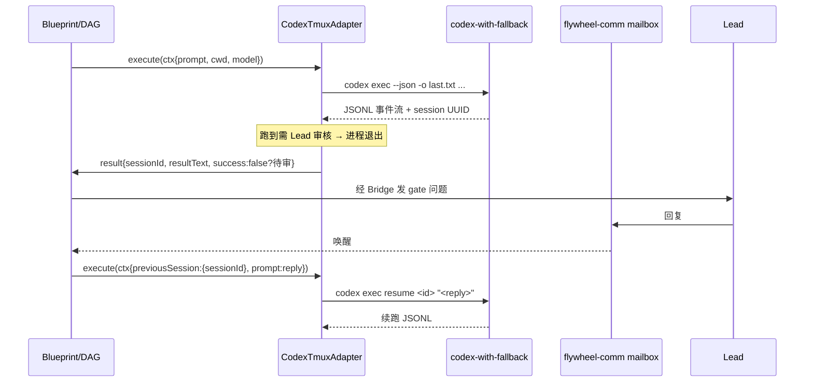

# Research: Codex Capabilities — FLY-123

**Issue**: FLY-123 ([Architecture] Decouple Flywheel from Claude Code — enable hybrid agent runtime)
**Date**: 2026-06-01
**Source**: `doc/engineer/exploration/new/FLY-123-brainstorm-decisions.md`、`packages/core/src/adapter-types.ts`（`IAdapter` 现状）
**Status**: Complete
**Feeds**: 修订版 `doc/engineer/plan/draft/v2.0-FLY-123-vendor-neutral-agent-runtime.md` + Spike-δ（gate 语义）

---

## 0. 调研边界与诚实声明

- 所有能力均以官方 `developers.openai.com/codex` 文档 + OpenAI 官方公告 + GitHub `openai/codex` 为准，二手博客只作交叉印证。
- 凡是只在二手来源出现、官方未确认的点，本文档**明确标注"待本地 `codex --help` 验证"**，不编造。
- 今天是 2026-06-01，下文 changelog 截止此日期。
- **最重要的一条结论先放最前**:Annie 点名的两个炫功能(用本机 App、在生成 HTML 上 comment)**都只存在于 Codex App / IDE,不在 CLI(`codex exec`)里**。Flywheel 的 Runner 走 headless `codex exec` + tmux,所以这两个功能**当前无法通过 `CodexTmuxAdapter` 暴露**。详见 §2、§3.4。

---

## 1. Codex 当前能力面(CLI / `codex exec` —— Flywheel 实际能用的那层)

Flywheel Runner = headless 进程(`codex exec`),不是交互 App。所以这一节是 adapter 设计真正的依据。

### 1.1 `codex exec` 非交互执行

```
codex exec [FLAGS] PROMPT
```

| Flag | 含义 | 对 Flywheel 的意义 |
|------|------|--------------------|
| `--sandbox, -s` | `read-only` \| `workspace-write` \| `danger-full-access` | Runner 沙箱级别;workspace-write ≈ 现在 Claude Runner 在 worktree 里的写权限 |
| `--ask-for-approval, -a` | `untrusted` \| `on-request` \| `never` | 自动化要 `never`(无人值守);gate 由 Flywheel 外部建模,不靠 Codex 内部 approval |
| `--dangerously-bypass-approvals-and-sandbox` / `--yolo` | 跳过所有 approval + sandbox | 隔离环境才用;一般不用 |
| `--json` / `--experimental-json` | 输出 newline-delimited JSON 事件(JSONL)而非格式化文本 | **关键**:可观测性 = adapter 解析事件流(对标 Claude `--output-format stream-json`) |
| `--output-last-message, -o PATH` | 把最终 assistant 消息写到文件 | **关键**:gate/完成判定可直接读这个文件(对标 sentinel 文件思路) |
| `--model, -m STRING` | 覆盖模型 | 映射 `AdapterExecutionContext.model` |
| `--cd, -C PATH` | 设工作目录 | 映射 `ctx.cwd`(worktree 路径) |
| `--profile, -p STRING` | 叠加命名 config | 映射多账号 profile(见 1.5) |
| `-c, --config KEY=VALUE` | 内联 config 覆盖(可重复) | 细粒度参数注入 |
| `--ephemeral` | 不持久化 session 文件 | 一次性任务用 |
| `--image, -i PATH` | 附带图片 | 视觉任务(对标 Claude 多模态输入) |
| `--skip-git-repo-check` | 允许在非 git 仓库执行 | 边缘场景 |
| `--oss` | 用本地开源 provider(需 Ollama) | 离线/降级路径(暂不需要) |

> ⚠️ **`--full-auto` 已被弃用(deprecated)**:据 changelog,2026-04-30 的 **CLI 0.128.0** 把 `--full-auto` 弃用,改用显式 permission profile(sandbox + approval 组合)。这直接影响 `~/.claude/rules/codex-multi-account.md` 里写死的 `codex-with-fallback exec --full-auto ...` 用法。**行动项**:下次本地 `codex exec --help` 确认 `--full-auto` 是否还可用 / 是否打 deprecation warning,再决定要不要改 wrapper 默认参数。(此条来自二手 changelog,官方 CLI reference 仍列了部分旧 flag,需本地核实。)

### 1.2 Session 续跑(`resume`)—— FLY-123 gate 语义的命脉

```
codex resume <SESSION_ID>          # 按 UUID 续
codex resume --last                # 续最近一次
codex resume --all                 # 跨目录搜索
codex exec resume [SESSION_ID]     # 非交互续跑(--last / --all 同样适用)
```

- 这是 brainstorm 里 **Option A(进程边界 = gate)** 的技术基础:Runner 跑到要等 Lead 审核时**进程退出**,Lead 回复后用 `codex exec resume <id> "<lead 的回复>"` 续跑同一会话。
- 对标 Claude `ClaudeCodeAdapter` 的 `--resume <sessionId>`(`packages/claude-runner/src/ClaudeCodeAdapter.ts:96-99`),语义几乎一一对应 → adapter 抽象能复用 `previousSession.sessionId` 字段。
- **Spike-δ 必须验证**:`codex exec resume` 在 tmux + 外部 watcher 注入场景下能否稳定续上同一 session 上下文(官方文档说支持,但生产可靠性未验)。

### 1.3 Sandbox 模式

| 模式 | 行为 |
|------|------|
| `read-only` | 不可写文件系统 |
| `workspace-write` | 仅可写项目 workspace(Runner 默认应该用这个) |
| `danger-full-access` | 无限制 |

Codex 自带 OS 级沙箱(macOS Seatbelt / Linux landlock 类机制),这点比 Claude Code 的纯 prompt+allowlist 工具门控更"硬"。

### 1.4 MCP 支持

```
codex mcp add <name>     # 注册 stdio 或 HTTP server
codex mcp list
codex mcp login <name>   # HTTP server 的 OAuth
codex mcp remove <name>
```

- 支持 **stdio + streamable HTTP**,带 bearer token + OAuth。
- 对 Flywheel 意义:`flywheel-comm`(Lead↔Runner mailbox)、Linear、gbrain wiki 这些现有 MCP server **理论上可直接喂给 Codex Runner**,无需重写 —— 是 vendor-neutral 的大利好。需验证 Codex MCP 的 tool-call 事件能否在 `--json` 流里观测到。

### 1.5 多账号 / auth

- 两种 auth:**ChatGPT 订阅登录**(`codex login`,走 Plus/Business 额度,无 per-token 计费)vs **API key**。Flywheel 现状用订阅登录 → 与"Claude 订阅、无 per-token 计费"的成本模型一致。
- **`codex-with-fallback`**(Annie 自己的 wrapper,见 `~/.claude/rules/codex-multi-account.md`):5 个 ChatGPT 账号,rate-limit(429)时自动 `codex-profile next` 轮换重试。这是 Flywheel 跑 Codex Runner 的**自动化稳定性基石** —— Option A(进程边界=gate)天然契合它,因为每次 exec/resume 都是独立进程调用,wrapper 能在进程级别拦截 429 并换号;Option B(长驻 TUI)会**丢掉**这层容错(brainstorm §4 已记)。

### 1.6 Hooks

- Hooks 引擎在 **v0.124.0(2026-04-23)转为 stable**。生命周期事件:subagent start/stop、tool execution、turn metadata(v0.133.0 起扩展)。
- 对标 Claude Code 的 hooks。可用于 Runner 侧注入 Flywheel 的 heartbeat / stage 上报,但优先级低于核心 exec/resume 打通。

---

## 2. mid-April 2026 release + 本机 App 控制 + HTML comment

### 2.1 "mid-April release" 到底指哪个(诚实拆分)

Annie 说"4 月中旬版本",4 月其实有**两个**关键节点,我都列出,不替她猜:

| 日期 | 载体 | 内容 |
|------|------|------|
| **2026-04-16** | Codex App | "更宽的工作台"更新:thread automations、**GitHub PR review**、artifact previews(PDF / 表格 / 文档)、remote connections(alpha)。← 严格意义的"4 月中旬" |
| **2026-04-23** | App + CLI 0.124.0 | **GPT-5.5 发布** + **computer use(macOS)** + **browser use 扩展** + **goal mode 转正** + **hooks stable**。← 真正的"新功能大爆发",但属于 4 月下旬 |
| 2026-04-30 | CLI 0.128.0 | `/goal` 持久化、**`--full-auto` 弃用**、permission profile 增强、`codex marketplace add` |

> 结论:若 Annie 指的是"那波让 Codex 变强的新功能",**核心是 4-23 的 GPT-5.5 + computer use + browser use**;若严格按"中旬",则是 4-16 的工作台更新。两者我都覆盖。

### 2.2 GPT-5.5(2026-04-23,Codex 默认推荐模型)

| 维度 | 数值(已交叉印证) |
|------|------|
| Context window | **Codex 内 400K**,API 内 1M(GitHub issue #19319 报告 Codex 实测有时只给 ~258K,存在已知偏差) |
| 定价(API) | $5 / $30 per MTok(in/out) |
| Benchmark | **Terminal-Bench 2.0 82.7% SOTA**,领先 Claude Opus 4.7(69.4%)13+ 分 |
| 模式 | 可选 **Fast mode**(低延迟、更贵) |
| 配套 | GPT-5.4 mini 作为 subagent / 轻任务模型 |

对 Flywheel 意义:Codex Runner 用 GPT-5.5 在终端/agentic-coding 基准上**强于 Claude Opus 4.7**(按 OpenAI 自报),这正是 Annie"想用更强那一边"的直接论据。但 benchmark 是 vendor 自报,需在 joycon/sub 试验场用真实任务对比。

### 2.3 用本机 App 的能力(Computer Use)—— **App-only,非 CLI**

- **能干什么**:看屏幕(截屏)、点击、打字、操作任意 GUI 桌面 App + 浏览器。适合命令行/结构化集成搞不定的活(改 App 设置、复现只在 GUI 出现的 bug、用没有 API 的工具)。
- **平台**:macOS(2026-04-23 首发)+ Windows(2026-05-29 GA)。**EEA / UK / 瑞士首发不可用**。
- **怎么触发**:在 Codex **App** 里装 "Computer Use plugin",prompt 里 `@Computer` 或 `@AppName`。
- **限制**:
  - Windows:仅前台,接管鼠标/键盘,你不能同时用同一 session。
  - macOS:可跑 scoped 后台任务(需 Screen Recording + Accessibility 权限)。
  - **不能**自动化终端 App,也不能操作 Codex 自身(安全策略)。
  - 每个 App 需先批准,有 "Always allow"。
  - Remote control:可从 ChatGPT 手机端(iOS/Android)或一台 Mac 远程操控/续跑。
- **对 Flywheel 的真相**:这是 **App 功能,CLI 没有**。Flywheel headless Runner **用不上**。除非未来 Flywheel 起一个"有头" Codex App 实例(完全不同的形态),否则不进 adapter。**不要在 plan 里假装 `CodexTmuxAdapter` 能暴露它。**

### 2.4 在生成 HTML 上直接 comment(In-App Browser)—— **App-only,非 CLI**

- **是什么**:thread 里一个共享的"渲染网页预览"(in-app browser)。`Cmd+Shift+B` / `Ctrl+Shift+B` 打开。
- **comment / annotation 怎么用**:
  - 开 annotation 模式 → 选元素或区域(`Shift+click` 框选)→ 提交评论;或 `Cmd+click` 直接秒发。
  - 点 config 图标 → 细粒度样式反馈:**font / text / spacing / color**,先在页面上预览效果再发给 Codex。
  - 例:对"按钮在 mobile 溢出"打标注,Codex 通过 browser use 定位元素并改 CSS。
- **支持**:localhost dev server、file-backed 预览、public 无需登录的页面。
- **不支持**:登录流程、signed-in 页面、cookie、扩展、已有 tab。
- **载体**:**只在 Codex App**,CLI 没有。
- **相关**:2026-05-21 加了 **Appshots**(macOS,把 App 窗口连截图发进 thread)+ browser annotation 支持调字体/颜色/间距。
- **对 Flywheel 的真相**:同 2.3,**App-only,headless Runner 用不上**。这是给"人在 App 里和 Codex 协作做前端"的功能,不是给自动化 orchestrator 的。

---

## 3. Flywheel 能利用什么 → 映射到 `IAdapter` 设计

现有 `IAdapter`(`packages/core/src/adapter-types.ts`)已经为多 vendor 留好位:`AdapterExecutionContext.vendor?: "claude-code" | "codex"`、`previousSession`、`onLog/onMessage/onComplete` 回调、`AdapterHealthCheck`。下面把"CLI 可达"的 Codex 能力逐条映射到 `CodexTmuxAdapter` 要做什么。

| Codex 能力 | CLI 可达? | `CodexTmuxAdapter` / `IAdapter` 要暴露什么 |
|------------|:--------:|---------------------------------------------|
| `codex exec` 非交互执行 | ✅ | `execute(ctx)`:拼 `codex exec --sandbox workspace-write -a never --json -o <lastMsgPath> -C <ctx.cwd> -m <ctx.model> "<ctx.prompt>"`;经 `codex-with-fallback` 调用 |
| `codex exec resume` | ✅ | gate 续跑:`ctx.previousSession.sessionId` → `codex exec resume <id> "<reply>"`。复用现有 `previousSession` 字段,无需改接口 |
| `--json` JSONL 事件流 | ✅ | 解析事件 → 映射成 `AgentMessage[]` → 喂 `onMessage` / `onLog`;完成时填 `AdapterExecutionResult.messages` |
| `--output-last-message` | ✅ | 完成/gate 判定读该文件 → `result.resultText`;也可做 land-status sentinel 的替代 |
| sandbox 模式 | ✅ | `ctx` 需要(可选)新增 sandbox hint,或在 adapter 内按角色固定(Runner=workspace-write) |
| approval 模式 | ✅ | 自动化固定 `-a never`;gate 由 Flywheel 外部 mailbox 建模,**不依赖** Codex 内部 approval |
| session id 抓取 | ✅ | 从 `--json` 事件或 session 文件抓 session UUID → `result.sessionId` + `result.sessionParams.sessionId`(对标 ClaudeCodeAdapter:165) |
| MCP server 注入 | ✅ | `ctx.mcpConfig` / `mcpConfigPath` → `codex mcp add` 或 config 注入;复用 flywheel-comm / Linear / gbrain |
| 多账号 fallback | ✅ | adapter **不自己实现**,统一走 `codex-with-fallback` wrapper(进程级 429 轮换)→ 这是选 Option A 的硬理由 |
| GPT-5.5 / Fast mode | ✅ | `ctx.model`("gpt-5.5" 等)→ `-m`;Fast mode 经 `-c` config |
| hooks | ✅(后续) | 可选,用于 heartbeat/stage 上报;非首期 |
| `checkEnvironment()` | ✅ | `codex --version` + auth 状态 + profile 可用性 → `AdapterHealthCheck` |
| **computer use(本机 App)** | ❌ App-only | **不暴露**。headless 不可达 |
| **in-app browser HTML comment** | ❌ App-only | **不暴露**。headless 不可达 |
| goal mode `/goal` | ⚠️ 部分 | CLI 有 `/goal`,但与 Flywheel DAG/gate 模型重叠,首期**不**接入,避免双重 orchestration |

### 3.1 gate 语义(Option A)落地草图



要点:**进程边界 = gate**;每次都是独立 `codex-with-fallback` 调用 → 保住 429 轮换;`--json` + `-o` 给可观测性与完成判定。Spike-δ 就是验证这张图在 tmux 里真能跑。

### 3.2 接口改动评估(尽量不动 `IAdapter`)

- `previousSession.sessionId`、`vendor:"codex"`、`onLog/onMessage/onComplete`、`AdapterHealthCheck` —— **全部已存在**,直接复用。
- 可能新增(小):`ctx` 里一个可选 `sandbox` / `approvalPolicy` hint(否则 adapter 内按角色硬编码也行)。
- **结论**:GEO-157 的统一 adapter 抽象**基本够用**,Codex 不需要推翻接口,这验证了"先设计全、Runner 先行"的可行性。

---

## 4. Codex vs Claude Code 差异化(swappable-agent 设计不能假设的事)

| 维度 | Codex(CLI) | Claude Code(CLI) | vendor-neutral 抽象必须注意 |
|------|------------|-------------------|------------------------------|
| 非交互入口 | `codex exec` | `claude --print` | 都有,但 flag 名不同;adapter 各自拼 |
| JSON 输出 | `--json`(NDJSON 事件) | `--output-format json` / `stream-json` | 事件 schema **不同**,formatter 不能假设 Claude 格式 |
| 完成判定 | `--output-last-message` 文件 | stdout JSON 的 `result` 字段 | 不能假设"读 stdout 末尾 JSON";Codex 走文件 |
| session resume | `codex exec resume <id>` | `--resume <id>` | 语义相近,可统一到 `previousSession.sessionId` |
| 沙箱 | **OS 级 sandbox**(read-only/workspace-write/full) | prompt + 工具 allowlist | 别假设"沙箱靠 allowlist";Codex 有更硬的 OS 层 |
| 多账号容错 | `codex-with-fallback`(429 换号) | 单订阅 | adapter 不能假设单账号;Codex 路径要保留进程级 wrapper |
| 模型 | GPT-5.5 / 5.4 mini | Opus / Sonnet / Haiku | `ctx.model` 是不透明字符串,**别 enum 死成 Claude 模型名** |
| 长驻交互+原地 gate | **无**(靠 exec+resume 模拟) | 有(长驻 session + mailbox 唤醒) | **最关键**:抽象**不能假设** Runner 能"原地暂停等唤醒";gate 必须支持"进程退出 + resume"这种实现 |
| 本机 App 控制 / HTML comment | App 有、CLI 无 | 无(Claude 侧另有路径) | 别把"炫功能"写进 headless adapter 契约 |
| 多模态输入 | `--image` | 有 | 都支持,可抽象 |
| MCP | stdio + HTTP + OAuth | stdio + HTTP | 基本对齐,利好复用 |

**给抽象层的三条硬约束:**
1. **不要假设"长驻 + 原地 gate 暂停"是所有 vendor 都有的**——这是 Claude-only 形态。gate 抽象要能用"进程退出 + resume"实现(Codex 走这条)。
2. **不要假设输出是单坨 stdout JSON**——Codex 用 NDJSON 事件流 + last-message 文件,formatter/解析必须 per-adapter。
3. **不要把 `model` enum 死**——保持不透明字符串,否则换 vendor 必改接口。

---

## 5. 未证实 / 需本地验证(诚实清单)

1. **`--full-auto` 弃用**:仅二手 changelog(developersdigest)称 CLI 0.128.0 弃用,官方 CLI reference 页仍混列旧 flag。→ 本地 `codex exec --help` 核实,再决定动不动 `codex-with-fallback` 默认参数。
2. **`--json` 事件 schema**:官方未在 reference 页给出完整事件类型表。→ 跑一次 `codex exec --json` 抓真实 NDJSON 样本,才能写 formatter(对标 Claude 的教训:mock 测不出真实格式串)。
3. **`codex exec resume` 在 tmux + 外部注入下的可靠性**:文档说支持,生产未验 → **Spike-δ 的核心**。
4. **MCP tool-call 是否出现在 `--json` 流**:需实测;关系到 flywheel-comm 在 Codex Runner 下能否被观测/审计。
5. **GPT-5.5 Codex 实际 context window**:官方 400K,GitHub issue 报告实测有时 ~258K(#19319)→ 长任务前需实测。
6. **GPT-5.5 vs Opus 4.7 的真实表现**:Terminal-Bench 82.7% 是 OpenAI 自报 → 在 joycon/sub 试验场用真实 Flywheel 任务对比。

---

## 6. 一句话总结给 plan

CLI 层(`codex exec` + `resume` + `--json` + `-o` + sandbox + MCP + `codex-with-fallback`)**完全够** Flywheel 做一个干净的 `CodexTmuxAdapter`,且现有 `IAdapter` 接口基本不用改;Annie 点名的两个炫功能(本机 App 控制、HTML comment)**是 App-only、headless 用不上,不进 adapter 契约**;真正的差异化抓手是 **GPT-5.5 强度 + OS 级沙箱 + 多账号 fallback + exec/resume 的 gate 形态**——而 gate 形态(进程退出+resume)正是 Spike-δ 必须先验的那块。

---

## Sources

- [Changelog – Codex | OpenAI Developers](https://developers.openai.com/codex/changelog)
- [CLI Reference – Codex | OpenAI Developers](https://developers.openai.com/codex/cli/reference)
- [Computer Use – Codex app | OpenAI Developers](https://developers.openai.com/codex/app/computer-use)
- [In-app browser – Codex app | OpenAI Developers](https://developers.openai.com/codex/app/browser)
- [Introducing GPT-5.5 | OpenAI](https://openai.com/index/introducing-gpt-5-5/)
- [OpenAI upgrades ChatGPT and Codex with GPT-5.5 — 9to5Mac (2026-04-23)](https://9to5mac.com/2026/04/23/openai-upgrades-chatgpt-and-codex-with-gpt-5-5-a-new-class-of-intelligence-for-real-work/)
- [Codex Changelog April 2026 — Developers Digest](https://www.developersdigest.tech/blog/codex-changelog-april-2026)
- [GPT-5.5 reports 258400 context window in Codex despite published 400K — openai/codex#19319](https://github.com/openai/codex/issues/19319)
- [Releases · openai/codex (GitHub)](https://github.com/openai/codex/releases)
- 内部对照:`packages/core/src/adapter-types.ts`(`IAdapter` 现状)、`packages/claude-runner/src/ClaudeCodeAdapter.ts`(`--print --output-format json` + `--resume` 模式)、`~/.claude/rules/codex-multi-account.md`(`codex-with-fallback`)
