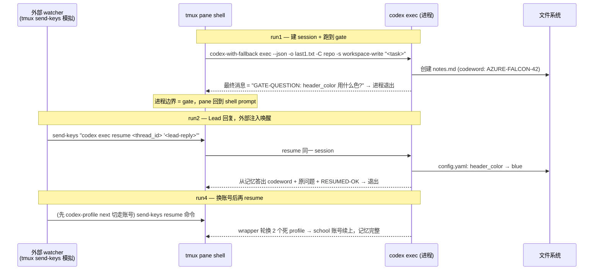

# Research: Spike-δ — Codex Gate 语义验证报告 — FLY-123

**Issue**: FLY-123 ([Architecture] Decouple Flywheel from Claude Code — enable hybrid agent runtime)
**Date**: 2026-06-03
**Source**: `doc/engineer/exploration/new/FLY-123-brainstorm-decisions.md` §4/§7、`doc/engineer/plan/draft/v2.0-FLY-123-vendor-neutral-agent-runtime.md` §5.2/§9 D1、`doc/engineer/research/new/FLY-123-codex-capabilities.md` §5
**Status**: Complete
**Feeds**: 修订版 v2.0 plan（D1 拍板依据）

---

## 0. 结论先行

**Option A（`codex exec` + `resume`，进程边界 = gate）全链路验证通过。D1 建议拍 A。**

| # | 验证项 | 判定 | 一句话证据 |
|---|--------|------|------------|
| 1 | `codex exec` headless 在 tmux 里跑通（经 `codex-with-fallback`） | ✅ **过** | EXIT:0，JSONL 事件流完整，`-o` 文件 = gate 问题原文 |
| 2 | Gate 语义：进程退出=暂停点 + `exec resume` 续命、上下文不丢 | ✅ **过** | 同一 thread_id 续跑；**零文件读取**情况下从对话记忆答出 codeword；gate 后继续改文件成功 |
| 3 | 外部注入：watcher 经 `tmux send-keys` 灌输入 | ⚠️ **带条件过** | 在 shell prompt 态注入 resume 命令 100% 可控（run2/run4 都是外部注入启动的）；**但 codex 运行中注入的内容会在退出后被 shell 当命令执行**（实测复现）→ watcher 必须先验证 pane 空闲（FLY-169 三道闸模式直接适用） |
| 4 | 429/账号轮换后 resume 还接得上 | ✅ **过**（经等价路径） | wrapper 真实轮换当场触发：personal 建的 session，轮过 2 个 token 过期的 profile，最终在 **school** 账号下 resume 成功且记忆完整 |

> 实验环境：codex-cli **0.135.0**，2026-06-03，scratch repo `/tmp/spike-delta-fly123/repo`，专用 tmux session `spike-fly123`（不碰生产/QA slot）。全程 load < 13（上限 40）。所有原始证据文件（JSONL/stderr/产物）在 `/tmp/spike-delta-fly123/`。

---

## 1. 实验设计

模拟 Runner 完整 gate 循环，一个 session 跨 3 次进程调用：



---

## 2. 逐项证据

### 2.1 Test 1 — `codex exec --json` headless in tmux ✅

命令形态（实测可用）：

```bash
codex-with-fallback exec --json \
  -o "$S/last1.txt" \          # 最终消息落文件 → gate 问题提取面
  -C "$S/repo" \               # 工作目录
  -s workspace-write \         # OS 级沙箱
  "<prompt>"
```

- EXIT:0，~9s 完成（trivial 任务）。
- **JSONL 事件 schema 实测样本**（research 未证实清单 #2 已解决）：
  ```
  {"type":"thread.started","thread_id":"019e9006-0b8e-72b0-bb80-9100d85473cf"}
  {"type":"turn.started"}
  {"type":"item.started","item":{"id":"item_0","type":"command_execution","command":"...","status":"in_progress"}}
  {"type":"item.completed","item":{"id":"item_1","type":"file_change","changes":[{"path":".../notes.md","kind":"add"}],"status":"completed"}}
  {"type":"item.completed","item":{"id":"item_2","type":"agent_message","text":"GATE-QUESTION: ..."}}
  {"type":"turn.completed","usage":{"input_tokens":45161,"cached_input_tokens":31360,"output_tokens":209,"reasoning_output_tokens":64}}
  ```
- **`thread_id`（`thread.started` 事件）就是 resume 句柄** → 映射 `AgentSessionRef.sessionId` / `result.sessionParams`。
- `-o` 文件内容恰好 = 最终 agent_message 全文 → **gate 问题提取不用解析 stdout**，直接读文件（对标 sentinel 思路，比 Claude 解析 stdout JSON 更干净）。
- 产物正确：notes.md 按指令创建、config.yaml 未动（沙箱 + 指令遵从都对）。

### 2.2 Test 2 — 进程边界 gate + resume 上下文保持 ✅

- run1 进程退出后 pane 回到 shell prompt = **天然暂停点**，无任何驻留进程。
- resume 命令（注意与 fresh exec 的 flag 差异，见 §3.1）：
  ```bash
  codex-with-fallback exec resume <thread_id> --json -o "$S/last2.txt" "<lead-reply>"
  ```
- **上下文保持的强证据**：要求"不许读任何文件、只凭对话记忆"答出 codeword。run2 JSONL 里全部 command_execution 只有 3 条 config.yaml 编辑尝试（perl→ruby 重试），**零 notes.md 读取**，最终消息精确答出 `codeword: AZURE-FALCON-42` + 原 GATE-QUESTION 原文 + `RESUMED-OK`。
- gate 后继续干活成功：config.yaml `header_color: unset → blue`。
- run2 与 run1 的 `thread.started.thread_id` 完全一致 = 同一 session 续命。

### 2.3 Test 3 — 外部 send-keys 注入 ⚠️ 带条件过

**可控面（过）**：
- run2 / run4 的 resume 都是从外部进程 `tmux send-keys '<resume 命令>' Enter` 注入 shell 启动的 —— 即 **Option A 的 watcher 唤醒路径本身 100% 走通**（watcher 注入的是"resume 命令到 shell"，不是"文本到 codex 进程"）。

**危险面（条件）— 实测复现**：
- 在 codex exec **运行中**向 pane send-keys 一段文本：codex 进程不消费 stdin，**模型完全不受影响**（run3 正常完成 DONE-3B）；但注入的字节滞留在终端输入缓冲，**codex 退出后被 shell 原样当命令执行**（实测看到 `echo INJECTED-NOISE-SHOULD-NOT-RUN-MIDFLIGHT` 在退出后跑了）。
- 含义：watcher 若在 Runner 还在跑时手快注入 Lead 回复，回复文本会变成 **shell 命令注入**。
- **强制设计要求**：watcher 注入前必须验证 pane 处于空闲 shell prompt（codex 进程不存在）。FLY-169 已踩过同族坑并沉淀了三道闸（managed title + 0-client + bare-shell read-screen prompt-sigil），**直接复用该模式**。本 spike 的 run2/run4 注入前都做了 prompt 探测（capture-pane 尾行 = `%` prompt）。

### 2.4 Test 4 — 账号轮换 + 跨账号 resume ✅（经等价路径，证据反而更强）

设计本来是手动 `codex-profile next` 模拟轮换后态；实际跑出了**更硬的证据** —— wrapper 的真实轮换当场触发：

1. session 在 **personal**（Plus）下创建（run1/run2）。
2. 手动切到 **personal1**（Free）发起 resume → personal1 token 已过期（`refresh_token_reused` 401）→ codex 非零退出。
3. `codex-with-fallback` 抓到 auth-expiry 模式 → `Auth token expired (attempt 1/5). Switching profile...` → **personal2** → 也过期 → `attempt 2/5` → **school**。
4. **school**（Plus）下 resume 成功：EXIT:0、同一 thread_id、**零命令执行**凭记忆答出 codeword + `header_color: blue`、`CROSS-PROFILE-OK`。

**结构性原因**（实地核实）：
- `~/.codex/profiles/<name>/` 里**只有 `auth.json`** —— profile 切换 = 纯 auth 换壳。
- session rollout 文件在共享的 `~/.codex/sessions/YYYY/MM/DD/rollout-*-<thread_id>.jsonl` —— **对话历史本地共享、与账号无关**。
- 所以"哪个账号付 quota"和"session 上下文"彻底解耦 → 任意轮换不丢上下文。

**诚实声明**：本次触发的是 auth-expiry 轮换分支，不是真 429 分支（429 无法按需制造）。两个分支走同一套 `codex-profile next` + 重试循环（wrapper 代码核实），仅 grep 模式不同 → 判定 **过（等价路径）**，429 文本匹配分支留生产观察。

---

## 3. 对 Plan 的修订输入（关键发现）

### 3.1 `buildCodexArgs` 必须分两套（fresh vs resume）

**实测踩坑**：`codex exec resume` 的 flag 集比 `codex exec` 窄 —— **不接受 `-C/--cd`、`-s/--sandbox`**（传了直接 `error: unexpected argument`）。cwd 与 sandbox 从原 session 继承（覆盖只能走 `-c`）。

| | fresh exec | exec resume |
|---|---|---|
| 可用 | `-C` `-s` `--json` `-o` `-m` `-c` `--ephemeral` `--skip-git-repo-check` | `--json` `-o` `-m` `-c` `--last` `--all` `--ephemeral` `--skip-git-repo-check`（**无 `-C`/`-s`**） |
| 含义 | sandbox/cwd 在 **session 创建时定死** | resume 进程的 **cwd 由调用方保证**（watcher 注入前 pane 必须已在 worktree 目录）|

### 3.2 `--full-auto` 已从 0.135.0 移除（research 未证实清单 #1 解决）

`codex exec --help` / `codex --help` 都已无 `--full-auto`。`codex-with-fallback` wrapper 本身**不注入**该 flag（纯透传，无碍）；但 `~/.claude/rules/codex-multi-account.md` 里的示例 `codex-with-fallback exec --full-auto ...` 已 stale，照抄会报错。Plan §5.1/§5.3 的 flag 映射改为 `-s workspace-write`（+ 默认无 approval 交互，exec 本来就非交互）。

### 3.3 全局可变 profile 状态 = 并发 Codex Runner 的竞态（新发现，Phase 1 单 Runner 可忍，多 Runner 前必须解决）

`codex-profile next/use` 改的是**全局** `~/.codex/auth.json`。轮换期间若有第二个 codex 进程启动（或在 token refresh），会用到被换走的账号。Phase 1（单 Codex Runner 灰度）风险可接受；**多 Codex Runner 并行前**需要：per-Runner `CODEX_HOME` 隔离、或轮换锁、或接受任意账号皆可的语义并验证。**建议写进 plan §7 风险表。**

### 3.4 双层 `AGENTS.md` 注入面（补充 plan §5.5）

`~/.codex/AGENTS.md`（用户全局）实地存在且会被每个 codex 进程读取 —— Codex Runner 的 instructions 实际是 **全局 AGENTS.md + repo AGENTS.md + exec prompt** 三层叠加。Plan §5.5 只讨论了 repo 层；executor 动态 prompt 的"显式覆盖冲突条款"要把全局层也覆盖进去。

### 3.5 运维即时事项（非本 spike 范围，已上报）

- **personal1 + personal2 两个 profile token 当前已过期**（`refresh_token_reused`）→ 5 个 profile 实际可用 3 个。建议择机跑 `/codex-relogin`（需 Chrome 自动化，等机器负载窗口）。
- wrapper 轮换成功后**停在成功的 profile 上**（本次 school），不自动切回 —— 调用方（adapter）不能假设 profile 不变。本 spike 已手动恢复 personal。

---

## 4. D1 拍板建议

**选 Option A**（`codex exec` + resume，进程边界 = gate），理由全部拿到实证：

1. gate 暂停/续命语义完整可靠（§2.2），上下文跨进程、跨账号都不丢（§2.4）。
2. 完全保住 `codex-with-fallback` 的进程级容错 —— 且轮换在 spike 里真实发生并自愈。
3. `--json` + `-o` 的可观测性比交互 TUI 好一个量级（事件流可解析、gate 问题直接读文件）。
4. Option B（TUI 长驻）反向证据：mid-run 注入实验（§2.3）说明往活进程 pane 灌文本的形态天然危险，而 B 整个交互模型都建立在这上面。

**带回 plan 的条件**：
- watcher 注入前置三道闸（§2.3，复用 FLY-169 模式）— 写进 `CodexAdapter` transport `createReceiver` 的设计契约。
- `buildCodexArgs` fresh/resume 双形态（§3.1）。
- 并发 profile 竞态进风险表（§3.3）。
- §5.5 补全局 AGENTS.md 层（§3.4）。

---

## 5. 原始证据索引

| 文件 | 内容 |
|------|------|
| `/tmp/spike-delta-fly123/run1.jsonl` | fresh exec 全事件流（8 行） |
| `/tmp/spike-delta-fly123/last1.txt` | gate 问题原文（`-o` 输出） |
| `/tmp/spike-delta-fly123/run2.jsonl` | resume 续跑事件流（含 3 次 config 编辑、零 notes.md 读取） |
| `/tmp/spike-delta-fly123/last2.txt` | 记忆答题 + RESUMED-OK |
| `/tmp/spike-delta-fly123/run3.jsonl` + run3 pane 截录 | mid-run 注入实验（模型不受扰 + 退出后 shell 执行注入文本） |
| `/tmp/spike-delta-fly123/run4.jsonl` / `run4.stderr` | 跨账号 resume + wrapper 真实轮换日志（attempt 1/5 → 2/5 → school 成功） |
| `/tmp/spike-delta-fly123/last4.txt` | CROSS-PROFILE-OK 记忆答题 |
| `/tmp/spike-delta-fly123/repo/` | notes.md / config.yaml 最终态 |
