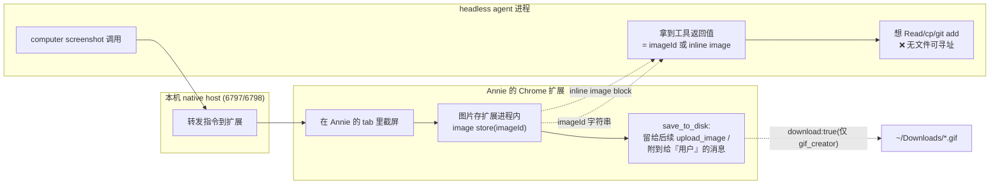
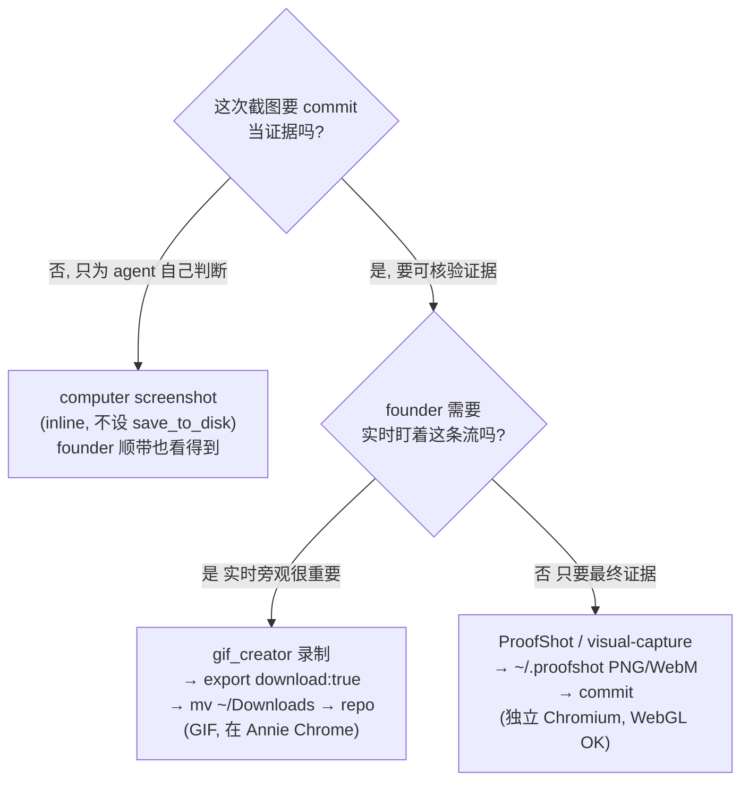

# Research: claude-in-chrome 截图持久化 — FLY-188

**Issue**: FLY-188 ([Research] claude-in-chrome 截图持久化：agent 用 claude-in-chrome 时如何可靠导出/落盘截图)
**Date**: 2026-06-01
**Source**: Linear FLY-188（触发来源 GEO-386 CJK E2E QA + FLY-178 Discord E2E）
**Status**: Complete
**Author**: worker-fly-188

---

## 0. TL;DR（核心结论先行）

> **issue 描述属实，且我亲手复现了**：agent 用 claude-in-chrome 的 `computer` 工具截图、设 `save_to_disk: true`，**工具只回一个 `imageId`（如 `ss_15831auyv`），不返回任何本地磁盘路径，也不在 agent 可访问的文件系统里产任何文件**。截图存在 Chrome **扩展的进程内 image store**（按 imageId 寻址），唯一消费方式是 `upload_image` 把它喂进**网页表单**——不能 `Read`、不能 `cp`、不能 `git add`。

**为什么会这样（根因，非 bug 是设计）**：claude-in-chrome 的截图默认走 **multimodal inline**——图片作为 image block 直接回给 agent「看」，本就不为「落盘」设计。`save_to_disk` 这个 flag 在当前 Claude Code harness + 扩展组合下，**没有产出 agent 侧可寻址的文件**（它的语义是「留着给后续 `upload_image` / 附到给用户的消息」，存在扩展侧）。

**推荐做法（按场景三分，不要一刀切）**：

| 场景 | 推荐路径 | 产物 | founder 能否实时看 |
|---|---|---|---|
| **agent 只需「看一眼」做判断**（多数中间步骤） | `computer` screenshot（inline，不设 save_to_disk） | 无（ephemeral，本就够用） | ✅ 在自己 Chrome |
| **需要可 commit 的视觉证据 + founder 要实时看** | `gif_creator` 录制 → `export download:true` → 从 `~/Downloads` `mv` 进 repo evidence 目录 | GIF（落 `~/Downloads`） | ✅ 在自己 Chrome |
| **需要可 commit 证据、不要求 founder 实时看**（纯 QA evidence、WebGL/3D） | **ProofShot / agent-browser**（已装，已被 `flywheel-comm visual-capture` 封装） | PNG/WebM/SUMMARY.md（落 `~/.proofshot/sessions/`，直接 commit） | ❌ 自驱独立 Chromium |

**GEO-386/FLY-178 的真正错误**不是「截图工具坏了」，而是**把「agent 看见」和「证据落盘可核验」当成一回事**。这俩在 claude-in-chrome 里是两条独立通道——前者 inline 永远 work，后者必须显式走 download 或换 ProofShot。

---

## 1. 现状审计（grep 真实代码 + 查工具 schema，不凭印象）

### 1.1 claude-in-chrome MCP 工具全集（实查 schema）

MCP server 进程是本地 native host：

```
6797  …/claude/versions/2.1.159 --chrome-native-host
6798  …/claude/versions/2.1.159 --chrome-native-host
```

即 claude-in-chrome 是「**本机 native messaging host ↔ Annie 的 Chrome 扩展**」的桥。截图的「拍摄端」和「存储端」都在 Annie 的 Chrome 里，agent（哪怕同机 headless）拿到的只是工具返回值。

关键工具与其持久化语义：

| 工具 | 截图相关行为 | 落盘？ |
|---|---|---|
| `computer` (`action:"screenshot"`, `save_to_disk?`) | schema 原文：「save the image to disk so it can be attached to a message **for the user**. Returns the saved path in the tool result. Only set this when you intend to **share** the image — screenshots you're just looking at don't need saving.」 | **实测：否**（见 §2，只回 imageId） |
| `computer` (`action:"zoom"`) | 同上，区域放大 | 同上 |
| `gif_creator` (`action:"export"`, `download:true`) | 把录制帧导出为 GIF，`download:true` 触发**浏览器下载** | **是 → `~/Downloads`**（见 §2 旁证） |
| `upload_image` (`imageId` / `ref`) | 把**之前截的** imageId 上传到**网页 file input / 拖放目标** | 不落盘（目标是网页，不是磁盘） |
| `file_upload` (`paths[]`, `ref`) | 把**本地文件**上传到网页 file input | 读本地，不产截图 |

> **关键**：`computer` 截图的产物只能被 `upload_image` 按 imageId 取用，喂进**网页**。没有任何 claude-in-chrome 工具能把一个 `computer` 截图**导出成 agent 本地文件**。唯一落本地盘的是 `gif_creator` 的 download。

### 1.2 项目里已有的三条截图基础设施

| 路径 | 实现 | 产物位置 | 谁驱动浏览器 | founder 实时看 |
|---|---|---|---|---|
| **A. claude-in-chrome** | `computer` / `gif_creator` MCP（PostToolUse hook 在 `EdgeWorker.ts:4641-4724`） | inline / 扩展 imageId store / `~/Downloads`(gif) | **Annie 的 Chrome**（扩展） | ✅ |
| **B. ProofShot / agent-browser** | `proofshot` CLI（已装 `~/.npm-global/bin/proofshot` v1.3.1 + `agent-browser` v0.22.3），封装于 `flywheel-comm visual-capture`（`packages/flywheel-comm/src/commands/visual-capture.ts`） | `~/.proofshot/sessions/<sid>/` → SUMMARY.md + PNG + WebM（**直接 commit**） | **自驱独立 headless Chromium** | ❌ |
| **C. screencapture -l** | `packages/teamlead/scripts/screencapture-l3-skill.md` + `find-window.sh`，Lead 截 macOS 窗口发 Discord | `/tmp/flywheel-screencap-*.png`（截完即删，发 Discord） | 截的是 **macOS 窗口**（含 Chrome 窗口） | n/a（Lead 主动） |

> 设计背景见 `doc/engineer/exploration/new/v0.5-remote-screenshot.md`（GEO-151）。它把 capture 拆成 Capture × Delivery × Interpret 三正交维度，并**明确选 ProofShot 作 L2 网页截图主力**，claude-in-chrome 的 `computer` 只作 escape hatch（「单张图、不想 spin up 整个 session 时用」）。**FLY-188 暴露的正是这条 escape hatch 在「需要 commit 证据」时的缺口。**

### 1.3 EdgeWorker 的 screenshot hook —— 顺带发现一个 latent bug

`EdgeWorker.ts:4665-4686` 给 `mcp__claude-in-chrome__computer` 装的 PostToolUse hook：

```ts
const response = postToolUseInput.tool_response as {
  action?: string; imageId?: string; path?: string;
};
if (response?.action === "screenshot") {
  const filePath = response?.path || "the screenshot file";   // ← path 永远 undefined
  return { …, additionalContext:
    `Screenshot captured. … use the linear_upload_file tool to upload ${filePath} …` };
}
```

它**假设 `response.path` 存在**并据此 nudge「upload 这个文件到 Linear」。但实测 `computer` 截图的 response **只有 `imageId`、没有 `path`**（§2）。所以这个 hook 的指引对 claude-in-chrome **永远 fallback 到占位符 `"the screenshot file"`**——给 Runner 的是一句无法执行的话。这解释了为什么 GEO-386 QA agent「全盘搜无新文件」：连框架给的 hook 提示都指不到真实文件。

> 注意 hook 的 type 注解里**写了 `imageId?: string`**——说明工程上**早就知道** computer 截图回的是 imageId。但 nudge 逻辑只用了 `path`，没处理 imageId 分支。这是 FLY-188 该顺手修的具体落点（属实现，不在本研究 scope，记入 §7 建议）。

### 1.4 历史铁证：同一结论一个月前已被一个真实 worker 写下

`doc/qa/reports/v1.25.0-FLY-77-discord-cleanup-evidence/README.md:69`（2026-05-04 worker-fly-77）：

> "Visual evidence captured inline during the worker session via Chrome MCP screenshots; **not persisted as JPEGs in this directory because the `save_to_disk` flag of the screenshot tool returns the image inline to the agent rather than writing to the project filesystem.** Full visual proof is preserved in the worker session transcript."

→ 这不是 GEO-386 第一次踩，是**复发**。FLY-188 把它从「个案口头注解」升级成「框架层要解的能力缺口」。

---

## 2. 亲手实测（issue 要求的「亲手验证」）

环境：worker-fly-188（headless agent），有 claude-in-chrome MCP，跑在 Annie 同一台 Mac。load 37 时执行（避开高峰）。

**步骤**：`tabs_context_mcp` → 新建 tab（不动 Annie 的 Discord/Design Studio tab）→ `navigate https://example.com` → `computer screenshot save_to_disk:true`。

**工具返回**（逐字）：

```
[computer:screenshot] Successfully captured screenshot (1332x896, jpeg) - ID: ss_15831auyv
```

→ 只有 **imageId `ss_15831auyv`**，**无 path**。

**全盘搜证（截图后 3-5 分钟内）**：

```bash
# 所有可能落盘位置，找新 png/jpeg/带 imageId 的文件
find /tmp ~/Downloads ~/Library/Caches/Claude* ~/.claude \
     ~/Library/Application\ Support/Claude* /var/folders \
     -type f \( -iname '*.png' -o -iname '*.jpeg' -o -iname '*ss_*' \) -newermt '-2 minutes'
# → 0 结果

find ~ /tmp /var/folders -name '*15831auyv*'        # → 0 结果
# 连 harness 自己的 session 目录、>30KB 任意类型新文件，也 0 结果
```

→ **`save_to_disk:true` 没有在 agent 能触达的任何文件系统位置产出文件。** 截图驻留在扩展进程内（imageId 寻址），只有 `upload_image` 能取用、且只能喂网页表单。**复现 issue 描述 100%。**

**旁证（download API 确实落盘）**：`~/Downloads/GEO-386-cjk-e2e-prod.gif`（**今天 14:40**，6.2 MB）——正是触发本 issue 的 GEO-386 QA 那次产的 GIF。它能存在，是因为走了 `gif_creator export download:true`（浏览器 download API → `~/Downloads`）。对照之下，`computer` 单张截图无任何等价的 download 能力。

**对照确认候选 #3（ProofShot/Playwright）确实落本地盘**：`proofshot` + `agent-browser` 二进制已装；`flywheel-comm visual-capture` 已把它封装成「`proofshot start → exec screenshot <file>.png → stop`」并在 `--output` 目录 `discoverArtifacts()` 出真实文件路径（`select-vision-artifacts.ts` 的整条 pipeline 都基于「caller 已 stat 出本地文件 path + bytes」）。即 ProofShot 路线**天生落盘可 commit**。（`~/.proofshot/sessions` 此刻不存在，仅因本机还没跑过 session，非能力问题。）

---

## 3. 根因分析（架构层，为什么 claude-in-chrome 注定不落 agent 盘）



三点结构性原因：

1. **截图发生在 Annie 的 Chrome 扩展沙箱里**，不在 agent 进程里。agent 拿到的是「值」（inline 图 / imageId），不是「文件句柄」。
2. **`save_to_disk` 的设计语义是「给用户看/给网页用」**，不是「给 agent 落盘 commit」。schema 原文「attached to a message **for the user**」「screenshots you're just looking at don't need saving」已经写明它服务的是**交互式人在环**场景（agent 和用户共享屏幕），不是**非交互 headless + 要 commit 证据**场景。
3. **唯一打通「扩展 → 本地盘」的桥是浏览器 download API**，而当前只有 `gif_creator` 暴露了 `download` 参数；`computer` 截图没有。

> 所以这**不是可以靠「设对参数」绕过的 bug**——是 claude-in-chrome 这个工具族在「headless agent 要 commit 证据」这个 use case 下的**能力边界**。要么换工具（ProofShot），要么用它唯一的 download 出口（gif_creator）。

---

## 4. 四个候选方向评估 + 可行性矩阵

issue 列的 4 个候选，逐个评估（含我补的细节）：

### 候选 #1 — 共享挂载（扩展写截图到 agent+浏览器都可访问的共享目录）

- **可行性**：❌ **不可行（在 Flywheel 侧）**。截图存储在 Chrome 扩展进程内，写盘与否由**扩展 + Claude Code harness** 决定，不是 Flywheel 能配置的。我们没有改扩展行为的旋钮（`save_to_disk` 是唯一暴露的旋钮，且实测不落盘）。
- **取舍**：要实现等于改 claude-in-chrome 扩展/native host 源码——**上游能力，不在 Flywheel 控制范围**。可作为给 Anthropic 的 feature request（「`computer` screenshot 增加 `download`/`outputPath` 参数」），但不能作为 FLY-188 的本地解。
- **结论**：**放弃**（作为上游建议保留，§7）。

### 候选 #2 — base64 返回（工具结果回 base64，agent 自解码落盘）

- **可行性**：⚠️ **部分可行，但是绕路**。`computer` 截图**不**回 base64（回 inline image block + imageId）。但可以用 `javascript_tool` 在页面里跑 JS 拿 base64：
  - `canvas.toDataURL()` —— 仅对**同源 `<canvas>`** 有效（WebGL canvas 若 `preserveDrawingBuffer:false` 会读到空白）。
  - `html2canvas` / DOM 序列化 —— 只截 DOM 渲染，**不等于真实浏览器截图**，跨源资源/iframe/真实合成层都丢。
  - 拿到 base64 字符串后 agent `Bash` 解码落盘可行。
- **取舍**：覆盖面窄（只同源 canvas / 纯 DOM），**恰恰盖不住 GEO-386 的 3D/WebGL 场景**（GeoForge3D 模型预览是 WebGL canvas，且 viewer 常跨源）。脆弱、维护成本高。
- **结论**：**不推荐作主路**。只在「目标就是一个同源 2D canvas、且其它路都不可用」时当 last resort。

### 候选 #3 — Playwright / ProofShot fallback（agent 侧自驱浏览器截图，本地落盘）

- **可行性**：✅ **完全可行，且基础设施已就位**。两个具体形态：
  - **ProofShot/agent-browser**（**推荐**）：已装、已被 `flywheel-comm visual-capture` 封装、产 SUMMARY.md+PNG+WebM 到 `~/.proofshot/sessions/`、支持 WebGL、`proofshot pr` 直发 GitHub、已有 `select-vision-artifacts` 做 token 预算精选。**这是项目早就选定的 L2 主力**（v0.5 doc §3.2）。
  - **Playwright MCP**（`mcp__plugin_playwright_playwright__browser_take_screenshot`）：`filename` 参数 + `fullPage`，写到 output 目录，本地可 commit，支持 WebGL。比 ProofShot 轻，但没有录屏/SUMMARY/PR 集成。
- **取舍（核心矛盾）**：自驱的是**独立 Chromium 实例**，**不是 Annie 的 Chrome** → **founder 无法在自己浏览器里实时观看**。且独立浏览器**没有 Annie 的登录态/cookie**（要测需登录的页面得另配 auth）。
- **结论**：✅ **推荐作「需要可 commit 证据」场景的主路**（尤其 WebGL/3D、不要求实时旁观时）。

### 候选 #4 — extension download API（已知 download 目录约定）

- **可行性**：✅ **可行，是 claude-in-chrome 当前唯一能落本地盘的原生出口**。`gif_creator action:export download:true` → 浏览器下载到 **`~/Downloads`**（实测 GEO-386 gif 即此路）。
- **怎么用**：`gif_creator start_recording` → 用 `computer` 跑完要验证的 UI 步骤（**这期间 founder 在自己 Chrome 全程能看**）→ `gif_creator stop_recording` → `gif_creator export download:true filename:"<issue>-<scenario>.gif"` → agent `mv ~/Downloads/<file>.gif <repo>/doc/qa/reports/.../` → `git add`。
- **取舍**：
  - 产物是 **GIF 不是 PNG**（动图，体积大；单帧证据也得是 gif）。
  - 落 **`~/Downloads`** 不是 repo——需要 agent 知道约定路径并 `mv`（`~/Downloads` 是「共享目录」，某种意义上**候选 #1 已经被浏览器 download 机制天然满足了一部分**）。
  - `~/Downloads` 是全局的，多 agent 并发可能撞文件名 → 必须用 `<issue>-<scenario>-<ts>` 唯一命名（注意 harness 里 `Date.now()` 在 workflow 脚本中不可用，但 agent 普通 Bash `date` 可用）。
- **结论**：✅ **推荐作「founder 要实时看 + 又要可 commit 证据」场景的主路**。这是唯一同时满足两个诉求的方案。

### 4.x 可行性矩阵汇总

| 候选 | 落 agent 本地盘 | founder 实时看（自己 Chrome） | WebGL/3D | 产物 | 基础设施就位 | 推荐度 |
|---|---|---|---|---|---|---|
| #1 共享挂载 | ❌ 需改上游扩展 | —— | —— | —— | ❌ | ✗ 放弃（转上游 FR） |
| #2 base64 (js_tool) | ⚠️ 同源 canvas/DOM only | ✅ | ❌（WebGL 读空白） | base64→png | ⚠️ 手搓 | △ last resort |
| #3 ProofShot/Playwright | ✅ `~/.proofshot/...` | ❌ 独立浏览器 | ✅ | PNG/WebM/SUMMARY | ✅ 已装+已封装 | ◎ 证据主路 |
| #4 gif_creator download | ✅ `~/Downloads/*.gif` | ✅ Annie 的 Chrome | ✅（录的是真实渲染） | GIF | ✅ 原生 | ◎ 实时+证据主路 |
| (基线) computer inline | ❌ ephemeral | ✅ | ✅（agent 看得到） | 无 | ✅ | ◎ 只为「看」 |

---

## 5. 核心矛盾：「founder 实时观看」vs「截图可持久化 commit」

这是 issue 点名要回答的。本质：

- **founder 实时观看**要求**用 Annie 自己的 Chrome**（她盯着那个窗口）→ 只能走 **claude-in-chrome（路径 A）**。
- **截图可 commit**要求**产物落 agent 本地盘** → claude-in-chrome 里**只有 gif_creator download** 能做到；想要 PNG/单帧/WebGL 干净截图，得换 **ProofShot（路径 B，独立浏览器）**。

两者**不是非此即彼**，而是**按「founder 是否需要这一刻盯着看」分流**：



> **判据口诀**：「**看一眼** → inline；**要存证 + 要 Annie 现场看** → gif download；**要存证 + 不必现场看** → ProofShot」。

---

## 6. 推荐标准做法 + 给 QA / 设计验证 agent 的 recipe 更新建议

### 6.1 推荐的标准做法（框架级约定）

1. **明确区分两类截图意图**，写进 QA / 设计验证 agent 的 recipe（和 system prompt 提示）：
   - **vision（看）**：`computer` screenshot，**不设** `save_to_disk`，inline 即可。多数中间步骤属此类。**不要再为这类去纠结落盘**。
   - **evidence（存证）**：必须显式走 §5 的 gif-download 或 ProofShot，**禁止假设 `computer save_to_disk` 会产文件**。
2. **「证据落盘」首选 ProofShot/`flywheel-comm visual-capture`**（已封装、WebGL OK、有 token 精选 + PR 直发）。仅当**必须 Annie 实时旁观**时才用 gif-download。
3. **`~/Downloads` 作为 claude-in-chrome 的既定 download 落点**：约定 evidence GIF 一律 `<ISSUE>-<scenario>-<YYYYMMDD-HHMMSS>.gif` 命名，agent 截完立即 `mv` 进 `doc/qa/reports/.../<run>/` 再 commit（避免并发撞名 + 避免 `~/Downloads` 堆积）。
4. **修 `EdgeWorker.ts` 的 computer-screenshot hook**（§1.3）：computer 截图回的是 imageId 非 path，hook 不该 nudge 一个不存在的 `linear_upload_file ${path}`；应改成提示「这是 inline/imageId，要 commit 证据请走 visual-capture 或 gif download」。

### 6.2 给 agent 的具体 recipe 片段（建议加入 `doc/qa/qa-context.md` / QA agent prompt）

```md
## 截图证据落盘（FLY-188）

claude-in-chrome 的 `computer` screenshot 默认只把图 inline 给你「看」——
它【不落本地盘】，`save_to_disk:true` 也只回一个 imageId，无法 commit。

要产【可 commit 的视觉证据】，按场景选：

A) 你只需要看一眼做判断（中间步骤）：
   computer screenshot（不设 save_to_disk）。够了，别纠结存盘。

B) 需要证据 + Annie 要在她自己 Chrome 实时看这条流：
   gif_creator start_recording
   → 用 computer 跑完 UI 步骤（Annie 全程能看）
   → gif_creator stop_recording
   → gif_creator export download:true filename:"<ISSUE>-<scenario>-$(date +%Y%m%d-%H%M%S).gif"
   → mv ~/Downloads/<file>.gif doc/qa/reports/.../<run>/  → git add

C) 需要证据、不要求 Annie 实时看（纯 QA evidence / WebGL / 3D 模型）：
   用 ProofShot：flywheel-comm visual-capture --kind ui --dev-command "..." --output <dir> ...
   或直接 proofshot start/exec screenshot/stop → ~/.proofshot/sessions/<sid>/*.png
   产物落本地盘，直接 commit。注意：自驱独立 Chromium，不是 Annie 的 Chrome。

绝不要：把「我截了图看到了」当成「证据已落盘」。这俩是两条通道。
```

### 6.3 一句话给 Lead/QA gatekeeper

> 收 QA 报告时，若声称「截图为证」但 evidence 目录里没有真文件、只说「见 transcript」——**打回**，要求走 §6.2 的 B 或 C 产真文件。（这正是 FLY-77/GEO-386 反复踩的点。）

---

## 7. 顺带发现 + 后续 issue 建议

| # | 发现 | 建议落点 |
|---|---|---|
| 1 | `EdgeWorker.ts:4665-4686` computer-screenshot hook 读 `response.path`（永远 undefined），nudge 失效 | **可直接修**：改 hook 走 imageId 分支 + 提示 visual-capture/gif download。建议开 FLY 实现 issue（小改动）。 |
| 2 | claude-in-chrome `computer` 缺 `download`/`outputPath` 参数（候选 #1 的真正解在上游） | **上游 feature request** 给 Anthropic claude-in-chrome 团队：截图增加落盘出口。非 Flywheel 本地能解。 |
| 3 | `~/Downloads` 多 agent 并发下是共享落点，无命名约定易撞名 | recipe 强制 `<ISSUE>-<scenario>-<ts>` 命名（§6.2）。 |
| 4 | v0.5 GEO-151 ProofShot 集成 plan 已 archive（`v1.28.0-GEO-151-proofshot-integration.md`），但 QA agent recipe 没把「证据必须走 ProofShot/gif，不走 computer save_to_disk」写死 | 把 §6.2 recipe 合进 `doc/qa/qa-context.md` + QA agent prompt（建议随实现 issue 一起做）。 |

---

## 8. 结论

- **issue 描述完全属实**，已亲手复现：claude-in-chrome `computer` 截图（含 `save_to_disk:true`）**不产 agent 可 commit 的本地文件**，只回 imageId，图驻留扩展进程内。这是**设计边界**不是配置 bug。
- **核心矛盾的解法是按意图分流**，不是找一个「既能实时看又能落盘」的单一魔法参数：
  - **看 → inline**；**存证+实时看 → gif_creator download**；**存证+不必实时看 → ProofShot/visual-capture（已就位的主路）**。
- **候选评估**：#3（ProofShot）✅ 证据主路、#4（gif download）✅ 实时+证据主路、#2（base64）△ last resort、#1（共享挂载）✗ 需改上游。
- **最小可执行的框架改进**：(a) 把 §6.2 recipe 写进 QA/设计验证 agent；(b) 修 EdgeWorker computer-screenshot hook（§7-1）。两者都不动运行中系统的行为契约，低风险。

---

## 9. ProofShot 深入 + 版本对比（Annie 追加，2026-06-01）

> Annie 看完上面后追问三件事：ProofShot 是不是只能 Playwright？能不能用 Claude 4 驱动？原 repo 最新有没有新东西。下面逐个答 + 给「要不要升级」结论。

### 9.0 先纠正两个出处（我原 doc 含糊的地方）

- **ProofShot 的原始 repo 是 `github.com/AmElmo/proofshot`**（作者 AmElmo），不是 steipete。
- **底层浏览器引擎是 `agent-browser`，作者是 `vercel-labs`**（`github.com/vercel-labs/agent-browser`），也不是 steipete。ProofShot README 原话：「Built on agent-browser by Vercel」。我原 doc / MEMORY 里写的「@steipete/agent-browser」是错的，本节更正。

### 9.1 Q1：ProofShot 只能用 Playwright 吗？能用 Annie 真 Chrome 带登录态吗？

**引擎**：ProofShot **不直接用 Playwright**。它是 `agent-browser`（vercel-labs 的 **CDP-based Chromium 自动化 CLI**）之上的薄封装——加 session 管理 + 录屏 + server log + error 收集 + bundle + `proofshot pr`。底层是 Chromium/CDP，不是 Playwright 的 API（虽然 agent-browser 内部用了 Playwright-class 的 driver，但对外暴露的是 CDP）。

**能不能用 Annie 真 Chrome + 登录态 —— 能，关键能力在 agent-browser，而且本机已装的 0.22.3 就有**（实查 `agent-browser --help`）：

| 能力 | flag | 行为 | 登录态 | Annie 实时看同一窗口 |
|---|---|---|---|---|
| 复制真 profile | `--profile <name\|path>`（或 `AGENT_BROWSER_PROFILE` env） | 把 Annie 的 Chrome profile（cookies/IndexedDB/登录态）**只读快照**进临时目录，用该状态起 Chromium（不动原 profile） | ✅ | ❌（独立窗口的副本） |
| attach 运行中 Chrome | `--auto-connect`（读 `DevToolsActivePort`，探 9222/9229）或 `--cdp <port\|wss-url>` | **驱动一个用 `--remote-debugging-port=9222` 起的真实 Chrome 窗口** | ✅（那个 Chrome 的态） | ✅ |
| 凭据库 | `auth save/login <name>` | 加密存账密，SSO-friendly 自动登录 | ✅ | 视上面 |

> **`--auto-connect` / `--cdp` 这条同时解决了 §5 的核心矛盾两半**：驱动的是 Annie 能盯着看的真实 Chrome 窗口，且 `agent-browser screenshot <path>` / ProofShot 录屏**落本地盘可 commit**。代价：要起一个开了 debugging port 的 Chrome（一次性 setup），它**不是**带 claude-in-chrome 扩展的日常 Chrome（除非那个也用 `--remote-debugging-port` 起）。

**重要区分（写给 Annie）**：「驱动 Annie 的 Chrome」有**两套互不相通的机制**——

- **claude-in-chrome**（扩展 + native host）：驱动她**日常那个** Chrome，但截图**不落盘**（= FLY-188 核心结论）。
- **agent-browser CDP**（`--auto-connect`/`--cdp`）：驱动一个**开了 debug port 的** Chrome，截图**落盘可 commit**；若 Annie 看着那个窗口就也算「实时看」。

→ 想「真 Chrome + 登录态 + 截图可 commit」三者全要，**走 agent-browser CDP 那条，不是 claude-in-chrome**。

### 9.2 Q2：用 Claude 4 可以吗？ProofShot 有没有 AI/LLM 驱动？

- **ProofShot 是 agent-agnostic，本身不是 LLM、不内置 AI。** README 原话：「Works with Claude Code · Cursor · Codex · Gemini CLI · … any agent that runs shell commands」。
- **「驱动浏览器的 AI」就是你的 coding agent（= Claude）**：Claude 跑 `proofshot exec` / `agent-browser` 这些 shell 命令来开页面、填表单、点按钮、`snapshot`（a11y 树）、`screenshot`。ProofShot/agent-browser 只是**确定性的浏览器控制 + 录证据**层。
- 所以「用 Claude 4 可以吗」→ **可以，而且本来就是 Claude 在驱动**。没有单独的「ProofShot AI 模式」要开。新版（1.4–1.6）也**没有**加内置 LLM 驱动，保持 agent-agnostic 路线。
- 对照 claude-in-chrome：也是 Claude 驱动，区别只是 transport（MCP 工具 + vision inline 图 vs shell 命令 + a11y snapshot/落盘 screenshot）。两者都是 Claude-driven。

### 9.3 Q3：原 repo 最新有什么新东西？落后几个版本？

**本机版本**：ProofShot **1.3.2**（`proofshot --version` 打印 `1.3.1` 是已知 version-string bug，1.3.4 才修「derive version from package.json」）；agent-browser **0.22.3**。

**上游最新**（gh / WebFetch 实查）：

| 包 | 本机 | 最新 | 落后 | 最新发布日 |
|---|---|---|---|---|
| ProofShot (AmElmo/proofshot) | 1.3.2 | **1.6.0** | ~4 发布 / 3 minor | 2026-04-14 |
| agent-browser (vercel-labs) | 0.22.3 | **0.27.1** | 多个 patch/minor | 2026-06-01 |

**ProofShot 1.3.2 → 1.6.0 changelog 关键条目**（对我们 use case 排序）：

- **1.6.0 — make browser launch config project-specific (#39)** ← **最相关**。让 ProofShot 按项目传 agent-browser 的 launch config（`browser.configPath`）。**这是把 `--profile`/`--auto-connect`/`--cdp` 干净接进 ProofShot 的官方入口**（在此之前只能靠 `AGENT_BROWSER_PROFILE` env 偷渡）。
- 1.4.1 — **isolate each ProofShot run in one agent-browser session (#36)** ← 对 QA **并行 slot** 有用（防多 run session 串台）。
- 1.5.0 — `doctor` 本地诊断命令。
- 1.4.0 — install 支持 OpenCode。
- 1.3.3–1.3.5 — bug fix：GitHub 官方 artifact 上传、Windows shell、version derive、token totals 修正。

**结论**：新版**全是增量**（项目级 browser config、session 隔离、doctor、OpenCode、bug fix）。**没有**「real Chrome 登录态」「claude-in-chrome 集成」「AI 驱动」这类新功能——因为**这对矛盾的解法本来就在 agent-browser 里**（且本机 0.22.3 已具备），ProofShot 侧 1.6.0 的「project-specific browser config」只是把它**接出来**的开关。

### 9.4 对 FLY-188 核心矛盾的更新结论（修正我原 doc §5）

我原 doc §5 写「ProofShot 自驱独立 Chromium → founder 看不到」——**这只对默认用法成立**。补充修正：

> agent-browser 的 `--auto-connect`/`--cdp`（本机已有）能驱动一个 **CDP-Chrome 的真实窗口**。若 Annie 看着那个窗口，就**同时拿到「实时看 + 截图落盘 commit」**——这是比原 doc 三分流更优的 holy-grail 路径。

代价 / 前置：
1. 起一个 `--remote-debugging-port=9222` 的 Chrome（专用「自动化 Chrome」，一次性）。
2. 在该 Chrome 里**一次性登录**测试站点（用持久 `--profile` 目录留住 cookie）。
3. **Flywheel `visual-capture` 目前没接 agent-browser 的 profile/cdp config**（实查 `visual-capture.ts` 只 `proofshot start --run/--port/--output`，零 profile/cdp 传递）→ 需小改：经 `AGENT_BROWSER_PROFILE` env 或（升级 ProofShot 1.6.0 后）`browser.configPath` 注入。

→ **GEO-386 正好命中**：CJK E2E 走的是登录后的 studio 页面，独立无登录 Chromium 截出来的可能就不是真实用户态。用持久 profile / auto-connect 能同时解决登录态 + 可 commit + 可观看。

### 9.5 升级建议

| 项 | 建议 | 理由 | 风险 |
|---|---|---|---|
| ProofShot 1.3.2 → 1.6.0 | **建议升**（但属 install 动作，请 Annie/Lead 拍） | 1.6.0 project-specific browser config = 接登录态路径的前置；1.4.1 session 隔离利好 QA 并行 slot | 低（semantic-release 维护，全增量） |
| agent-browser 0.22.3 → 0.27.1 | 可一并升 | 精炼 `--profile`/`--auto-connect`/`auth` | 低 |
| 先**不升**也能试登录态 | `AGENT_BROWSER_PROFILE=<持久目录> proofshot start ...` | 本机 0.22.3 已支持 env profile，可先验证再决定升不升 | 无 |

> **纪律**：升级 = `npm i -g proofshot@latest agent-browser@latest`，是 install 动作，**不在本研究 scope，我没擅自升**。建议先用本机已有的 `AGENT_BROWSER_PROFILE` env 做一次登录态 PoC（不需升级），验证「真 profile + 落盘 + 可观看」可行后，再决定是否升 ProofShot 1.6.0 + 把 profile/cdp 接进 `visual-capture`（这步是实现 issue，非研究）。

### 9.6 §7 之外新增的后续建议

| # | 发现 | 建议落点 |
|---|---|---|
| 5 | `flywheel-comm visual-capture` 没传任何 agent-browser profile/cdp config → 用不上登录态 | 实现 issue：加 `--profile`/`--cdp`/`AGENT_BROWSER_PROFILE` 透传（最好随 ProofShot 1.6.0 升级一起） |
| 6 | ProofShot/agent-browser 落后上游 | 建议 Annie 决定升级窗口；先做 env-profile PoC 验证再升 |
| 7 | 「真 Chrome + 登录态 + 可观看 + 可 commit」全要 → 走 agent-browser `--auto-connect` 到 debug-port Chrome，**不是** claude-in-chrome | 写进 QA recipe（§6.2 加第 4 条「需登录态的 E2E」分支） |

---

## 10. agent-browser auto-connect 精确机制（Annie 追问，2026-06-01）

> Annie：「Agent Browser AutoConnect 用的是哪一个？是用 Claude in Chrome 还是什么东西？Agent Browser 是新东西吗？」下面每点都有**本机实测**佐证，不是推测。

### 10.0 重磅实测：Annie 当前的 Chrome 此刻就开着 CDP 9222 端口

只读探测（`lsof` / `DevToolsActivePort` 文件 / `curl`，没碰她的 Chrome）：

```
$ lsof -nP -i :9222
Google   878 xiaorongli  222u  IPv4 ... TCP 127.0.0.1:9222 (LISTEN)   ← 她的 Chrome 在听 9222

$ cat ~/Library/Application Support/Google/Chrome/DevToolsActivePort
9222
/devtools/browser/7ffe8044-e4a4-4e97-bebb-7a31e108cb3a               ← 有效的 CDP WebSocket token

$ ps -p 878 -o pid=,ppid=,command=
878  1  /Applications/Google Chrome.app/Contents/MacOS/Google Chrome  ← 主浏览器进程(PPID=1)

$ /Applications/Google Chrome.app/.../Google Chrome --version
Google Chrome 148.0.7778.216                                         ← Chrome 148 (≥144)

$ curl http://127.0.0.1:9222/json/version  ->  404                  ← HTTP DevTools 端点禁用(Chrome 144+ 行为)
```

→ **结论：Annie 的日常 Chrome（PID 878，default profile，Chrome 148）现在就暴露着 CDP，端口 9222。** HTTP `/json/version` 返 404 是 Chrome 144+ 的正常表现（HTTP target 列表端点被禁），但 `DevToolsActivePort` 里的 **WebSocket token 可用** —— 这正是 agent-browser auto-connect「HTTP 探测失败 → 退回直接 WebSocket 连接」那条路设计来对付的场景。

> 谁打开的 9222 origin 不确定（`ps` 只显示裸可执行路径、没显式 `--remote-debugging-port` flag → 很可能是**运行时**通过 `chrome://inspect/#remote-debugging` 开的，而非启动 flag；也可能是早先某次 agent-browser/proofshot 起的）。但对 recipe 而言**结论一样：端口现在是开的。**
>
> **诚实标注**：我**没有**真去 `agent-browser --auto-connect` 连她的活 Chrome（怕开 tab/导航干扰她正在用的 Discord/Design Studio）。基于「端口开 + DevToolsActivePort 有效 + Chrome 148」三条，attach 成功是高置信度，但**端到端没亲测**。一个 30 秒只读 PoC（`agent-browser --auto-connect snapshot` 不导航）即可坐实。

### 10.1 Q：`--auto-connect` 到底 attach 到哪个 Chrome？跟 `--cdp` 啥区别？

读 agent-browser 完整 README（line 900-918）+ `--help`，精确机制：

**`--auto-connect` 三步发现一个「已经开了 remote debugging 的 Chrome」**：
1. 读默认 user data dir 的 `DevToolsActivePort` 文件（拿端口 + WS token）；
2. 退回探常见 debug 端口（9222、9229）；
3. HTTP 发现（`/json/version`、`/json/list`）失败 → **退回直接 WebSocket 连接**（← 正好对应 Chrome 144+ / Annie 现状）。

**`--cdp <port|url>`** = 你**显式**告诉它端口或 WS URL（`--cdp 9222` 本地，或 `--cdp "wss://...token"` 远程浏览器服务）。`connect 9222` 连一次后续命令免带。

> **关键前提（老实标出）**：两者**都要求目标 Chrome 已开 remote debugging**。README line 386 给的标准起法是
> `"/Applications/Google Chrome.app/Contents/MacOS/Google Chrome" --remote-debugging-port=9222`
> —— 即**普通 Chrome 默认不开**，要么用这个 flag 启动（= 重启 Chrome），要么运行时在 `chrome://inspect/#remote-debugging` 打开。**Annie 的情况特殊：她的 Chrome 现在已经开着 9222**（§10.0），所以她**此刻不需要重启** agent-browser 就能 auto-connect。

区别一句话：**`--auto-connect` = 自动找已开 debug 的 Chrome；`--cdp` = 手动指定端口/URL。** 都不是「随便连一个普通 Chrome」——目标必须先开 debug。

### 10.2 Q：它跟 claude-in-chrome 是什么关系？会冲突吗？能共存吗？

**是两套完全独立的机制，互不依赖**：

| | claude-in-chrome | agent-browser auto-connect/cdp |
|---|---|---|
| 传输 | 浏览器**扩展** + native messaging host（本机 PID 6797/6798 `--chrome-native-host`） | 原生 **CDP**（Chrome DevTools Protocol，WS over 9222） |
| 控制谁 | Annie 日常 Chrome（扩展注入） | 任何开了 debug port 的 Chrome（可以**正好是同一个** PID 878） |
| 截图落盘 | ❌（imageId，§2） | ✅（`screenshot <path>` 写本地盘） |
| 是不是 Claude 在驱动 | 是（MCP 工具 + vision） | 是（Claude 跑 shell 命令） |

- **auto-connect 用的不是 claude-in-chrome**，是 raw CDP。回答 Annie 原话：「用的是 CDP，不是 claude-in-chrome」。
- **能共存**：两套可以同时连**同一个** Chrome 进程（878）——一个走扩展、一个走 CDP，传输层不打架。
- **唯一冲突点**：若两者**同时驱动同一个 tab**（都在导航/点击）会 race。实践规避：让 agent-browser 用自己的 tab（`agent-browser tab new`），claude-in-chrome 用它的 MCP tab group，**别让两个 driver 同时操作同一个标签页**。观察/截图层面不冲突。

### 10.3 Q：「真 Chrome 实时看 + 截图落盘」具体怎么配？（可执行步骤 + 前提）

给两个**具体可跑**的 recipe（不是抽象「可以」）：

#### Recipe A — 连 Annie 的真·日常 Chrome（她现在 9222 已开，零重启）

> 前提：`lsof -i :9222` 有 Chrome 在听（**现在为真**）。若哪天不为真 → 要么 `chrome://inspect/#remote-debugging` 运行时打开，要么用 `--remote-debugging-port=9222` 重启 Chrome（= 重启她的浏览器，这是唯一的硬成本，老实标）。

```bash
# 0. 确认端口开着
lsof -nP -i :9222            # 看到 Google ... 9222 (LISTEN) 即可

# 1. Claude(agent) 用 agent-browser attach 她的真 Chrome,在她看得到的窗口开页面
agent-browser --auto-connect tab new
agent-browser --auto-connect open https://<要测的前端 url>

# 2. 驱动 + 取 a11y 树(给 AI 看)
agent-browser --auto-connect snapshot -i
agent-browser --auto-connect fill @e2 "北京" && agent-browser --auto-connect click @e5

# 3. 截图落到 repo 里(可 commit)
agent-browser --auto-connect screenshot \
  /Users/xiaorongli/Dev/flywheel/doc/qa/reports/<run>/step-cjk.png
```

→ **真 Chrome ✅ + 她的登录态 ✅ + 她实时看着那个窗口 ✅ + 截图落盘可 commit ✅**（四项全中）。
注意 §10.2 的共存规则：别和 claude-in-chrome 抢同一个 tab。

#### Recipe B — 独立 Chromium + 直播流（完全不碰她的 Chrome）

> 不想动她日常 Chrome / 怕冲突时用这条。她通过「流」看，而不是看原生窗口。

```bash
# 1. 用持久 profile(登录态一次性留存) 或快照她的真 profile 登录态
AGENT_BROWSER_PROFILE=~/.flywheel-qa-profile agent-browser open https://<url>
#   或  agent-browser --profile "Default" open <url>   # 只读快照她真 profile 的登录+扩展

# 2. 开直播流,Annie 用 viewer 连 ws 实时看("pair browsing")
agent-browser stream enable --port 9223
#   Annie 打开能连 ws://localhost:9223 的预览(base64 jpeg 帧 + 可发输入)

# 3. 截图落盘
agent-browser screenshot /Users/xiaorongli/Dev/flywheel/doc/qa/reports/<run>/step.png
```

→ **不碰她日常 Chrome（零冲突）+ 登录态(profile) ✅ + 她看直播流 ✅ + 截图落盘 ✅**。代价：她看的是流不是原生窗口；持久 profile 要先登一次。

> **Flywheel 集成现状（实查）**：`flywheel-comm visual-capture` 目前只发 `proofshot start --run/--port/--output`，**零透传 `--cdp`/`--auto-connect`/`profile`**。所以上面两个 recipe 现在只能**直接调 `agent-browser`** 跑（手动 / QA agent recipe）；要接进 ProofShot/visual-capture 管线需小改（最好配 ProofShot 1.6.0 的 project-specific browser config）—— 这是实现 issue，不在研究 scope。

### 10.4 Q：agent-browser 是新东西吗？auto-connect 是最近才有的吗？

- **不是新东西。** agent-browser（vercel-labs）changelog 最早记到 **v0.7.0**；`--profile` 持久登录**从 v0.7.0 就有**；`--auto-connect` 约 **v0.20.6** 引入、v0.24.1 增强。本机装的是 **0.22.3** —— 即 **auto-connect 早于 Annie 本机版本就存在**，不是新加的。最新上游 **0.27.1**。
- 它是 **ProofShot 一直以来的底层引擎**（ProofShot 1.0.0 起就「Built on agent-browser by Vercel」），不是临时换的。
- （changelog 没给可靠日期，WebFetch 猜的「2024」不可信，已弃用该日期；只用版本号定位。）

---

## 11. PoC 实测：Recipe A auto-connect **失败**（2026-06-01，Annie 批准后执行）

> §10 给了「高置信但没端到端测」的 Recipe A。Annie 批准后我跑了 PoC，**结果是失败**——诚实记录，推翻 §10 的乐观推断。

**执行**（严格安全边界：只 attach、只开自己新 tab、无害页面、不碰她现有 tab）：

1. 只读确认 9222 仍开（`lsof` → Chrome PID 878 LISTEN）✅
2. 第一条 attach 命令就是只读的 `agent-browser --auto-connect tab list`（还没建 tab）——**直接失败**：

```
✗ Failed to read: Resource temporarily unavailable (os error 35)
  (after 5 retries - daemon may be busy or unresponsive)
```

→ auto-connect **没能建立到她 Chrome 的 CDP WebSocket 会话**，卡在连接/读取阶段，**没走到开 tab / 截图**。按纪律「连不上→立刻停、别重试」停手（没试第二次、没试 `--cdp`）。

**四项验证结果**（连接阶段就挂，故大部分 N/A，但安全）：

| 项 | 结果 |
|---|---|
| ① attach 上真 Chrome | ❌ 失败（os error 35） |
| ② 在她窗口开新 tab | ⬜ 没执行到（**没创建任何 tab**） |
| ③ 截图落盘 | ⬜ 没产出（`/tmp/fly188-poc/` 空） |
| ④ 没动她现有 tab | ✅ 确认（连接就失败，她的 tab 一根没碰） |

**清理**：kill 掉我自己 spawn 的 stray `agent-browser` daemon（PID 89020，SIGKILL）+ 删 stale `~/.agent-browser/default.{pid,sock}`。**没跑 `agent-browser close`**（那会关她 Chrome）——只 kill 自己 daemon PID，已确认她 Chrome 878 在 kill 后存活、9222 仍 LISTEN。终态：她 Chrome 完好、无 agent-browser 进程残留。

**根因推断**：本机 **agent-browser 0.22.3** 跟不上 **Chrome 148**（≥144）的「HTTP `/json` 端点禁用、只剩 WS」模式（§10.0 实测 `/json/version` 返 404）。changelog 显示 auto-connect 的 Chrome 144+ WS 处理在 **0.24.1+** 才增强，本机 0.22.3 在那之前 → 退回 WS 那步没成功。

**对结论的修正**：

- **§10「四项全中」是理论推断，实测未成立。** 在升级 agent-browser 之前，**Recipe A 不可写进 QA recipe 当「可用」**。
- 当前可靠的仍是：**Recipe B**（独立 Chromium + `--profile` + `stream` 观看）+ **原三分流**（gif download / ProofShot）。

### 11.1 升级后重验（2026-06-01，Annie 授权升级）—— Recipe A **仍失败，根因在 Chrome 侧**

Annie 授权升级 agent-browser 后又跑了一轮（阶段 1）：

- **升级**：`npm i -g agent-browser@latest` → **0.22.3 → 0.27.1**（ProofShot peerDep `>=0.1.0`，不冲突，未动 ProofShot）。
- **重验三种连法全失败**：
  - `--auto-connect tab list` → `✗ No running Chrome instance found`
  - `--cdp 9222 tab list` → `✗ Auto-launch failed: No running Chrome found`
  - `connect 9222` → `✗ Operation timed out`
- **read-only 诊断 9222 端点**：`/json/version`、`/json/list`、`/` 全 **HTTP 404**；WS upgrade 握手 → **HTTP 000**（不响应）；`DevToolsActivePort` 文件**已消失**（§10.0 读到的 ws token 是陈旧的）；Chrome 878 主进程 cmdline **无** `--remote-debugging-port` flag。

**决定性结论（推翻 §10.0「🔥 重磅发现」）**：

> **9222 端口虽 LISTEN，但不是外部可用的 CDP 端点** —— 不 serve DevTools HTTP API、不完成 WS 升级、token 陈旧。**「端口开着 = 当场可 attach」是错的。** 升级 agent-browser 到最新（0.27.1）**也连不上**，证明瓶颈**不在工具版本，在 Chrome 启动方式**：Chrome 144+ 要求外部 CDP 客户端连的 Chrome 必须显式 `--remote-debugging-port=9222 --remote-allow-origins=*` 启动；Annie 的日常 Chrome 不是这么起的。

**修正后的方向**：

- **Recipe A（连她日常真 Chrome）在她当前 setup 下不可行**，要 work 必须**用 debug flag 重启她的 Chrome**（关掉当前所有 tab/session，硬成本）—— 不建议为此重启。
- **可行路径回到 Recipe B**（独立 Chromium + `--profile` 快照登录态 + `stream` 直播观看，不碰她 Chrome）+ **原三分流**（gif download / ProofShot）。下一步应先端到端验 Recipe B，再决定接哪条进 `visual-capture`。
- 实现阶段（修坏 hook + visual-capture 接 profile/cdp + 写 QA recipe）应**基于 Recipe B / ProofShot**，**不要**建在 Recipe A 的真-Chrome CDP attach 上。

### 11.2 Recipe B 端到端验证 **PASS**（2026-06-01，agent-browser 0.27.1）

Recipe A 否决后转验 Recipe B（独立 Chromium，**不碰 Annie 的 Chrome**），四项全过：

| # | 验证项 | 结果 | 证据 |
|---|---|---|---|
| ① | 独立浏览器启动（非 Annie 的 Chrome） | ✅ | `AGENT_BROWSER_PROFILE=<dir> agent-browser open https://example.com` → `get url`=`https://example.com/`、`get title`=`Example Domain`；headless 独立 Chromium（本机已装 chrome-147，无需下载）；`AGENT_BROWSER_AUTO_CONNECT` 未设 → 起自己的浏览器 |
| ② | 截图落盘可 commit | ✅ | `agent-browser screenshot /tmp/fly188-poc/recipe-b-test.png` → `file` 报 **PNG image data, 1280×577, 8-bit RGB**（15.7 KB）；肉眼确认是真实 example.com 渲染 |
| ③ | profile 登录态机制 | ✅ | 持久 profile 目录跑完被填充 9.1M（`Default` / `Local State` / cookies 等 Chrome state）→ 登录态持久跨 run；快照真登录态用 `--profile Default`（只读快照不动原 profile） |
| ④ | stream 直播流（Annie 可观看） | ✅ | `stream status` → `Streaming enabled on ws://127.0.0.1:50823, Connected: true`，daemon 在该端口 LISTEN → 连 viewer 到该 ws 即可实时看 |

**清理**：`agent-browser close`（关自己独立浏览器，Recipe B 下 `close` 安全——目标是自己浏览器不是她 Chrome）+ kill daemon + 删 profile 目录。终态：Annie Chrome 878 ALIVE、9222 仍 LISTEN、自己浏览器/daemon/stream 全清、0 残留进程、全程没碰她任何 tab。

**结论**：**Recipe B 是 FLY-188 的可行落地路径**——独立 Chromium + `--profile`（登录态）+ 截图落盘可 commit + `stream`（Annie 实时看），完全不碰她日常 Chrome。它拿到了 Recipe A 想要的大部分价值（可 commit ✅ + 登录态 ✅ + 可观看 ✅），唯一让步是「看的是流不是原生窗口」。**实现阶段应建在 Recipe B / ProofShot 之上。**

---

## 参考

- Linear FLY-188 / 触发来源 GEO-386（CJK E2E QA）、FLY-178（Discord E2E）
- `doc/engineer/exploration/new/v0.5-remote-screenshot.md`（GEO-151，Capture×Delivery×Interpret 三维 + ProofShot 选型）
- `doc/engineer/plan/archive/v1.28.0-GEO-151-proofshot-integration.md`（ProofShot 集成 plan）
- `packages/flywheel-comm/src/commands/visual-capture.ts` + `select-vision-artifacts.ts`（ProofShot 封装 + token 精选）
- `packages/edge-worker/src/EdgeWorker.ts:4641-4724`（4 个 screenshot PostToolUse hook）
- `packages/teamlead/scripts/screencapture-l3-skill.md`（L3 macOS 窗口截图）
- `doc/qa/reports/v1.25.0-FLY-77-discord-cleanup-evidence/README.md:69`（一个月前同结论的历史铁证）
- 实测：worker-fly-188 自测（example.com 截图 → imageId `ss_15831auyv`，全盘搜无文件，2026-06-01）
- 旁证：`~/Downloads/GEO-386-cjk-e2e-prod.gif`（gif_creator download 落盘）
- ProofShot CLI v1.3.2 本机（`~/.npm-global/bin/proofshot`，binary 打印 1.3.1）、agent-browser v0.22.3 本机
- 上游 ProofShot：`github.com/AmElmo/proofshot`（最新 **v1.6.0** 2026-04-14，gh release list + CHANGELOG.md 实查）
- 上游 agent-browser：`github.com/vercel-labs/agent-browser`（最新 **v0.27.1** 2026-06-01；`--auto-connect`/`--cdp`/`--profile`/`auth` 能力，WebFetch + 本机 `--help` 实查）
