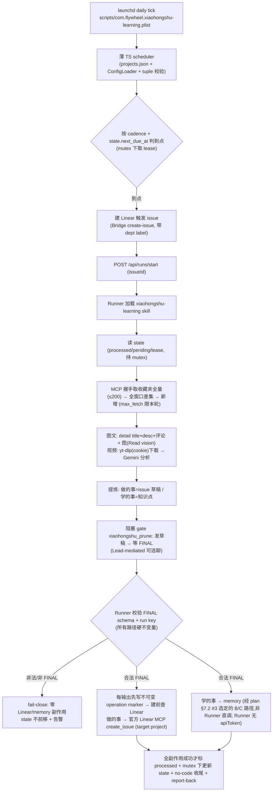

# Research: 小红书收藏夹定期"上课"— 现成工具覆盖度 + 落地机制 — FLY-222

**Issue**: FLY-222
**Date**: 2026-06-05
**Source**: `doc/engineer/exploration/new/FLY-222-xiaohongshu-periodic-learning.md`(brainstorm 3 轮锁定)
**Status**: 已用 **MCP 真机探测 + 视频端到端实测**校正所有早期假设;本文为单一权威机制描述(无并列旧方案）。

> 结论先行:全链所需机制 = 本仓 + 本机现成积木,不自研爬虫/排程/审批/记忆。**视频本体可拿(yt-dlp,实测通)**;收藏夹**无 cursor**、`limit≤200` 一次拉全;内容全部走**登录态 MCP**,不是 summarize 抓 URL。

> **⚠️ Phase 0 实测校正(2026-06-05,见 plan §7)** —— ① MCP server 已是 **`xiaohongshu-mcp` v2.0.0**,旧 REST `/api/v1/*`(下文 §1 多处)**已不通**(404/000);**唯一可靠路径 = MCP JSON-RPC over Streamable HTTP**(`POST /mcp` 握手),feeds/detail/收藏夹**全部经 MCP**,不再分 REST/MCP 两路。② output issue 的 Linear MCP 工具是 **`create_issue`**(官方 `mcp.linear.app`),**不是** 下文写的 `save_issue`。③ `get_collection_content` 由 rod 真 Chromium 抓取,**慢**(7 条 60s),并发会串行排队卡死 → 长超时+串行+半夜排程是硬需求。下文 §1 的字段结构与"无 cursor / total 暴露 / 视频 yt-dlp"结论**经真机复现仍成立**;仅"REST 路由"与"`save_issue`"两处被 Phase 0 推翻,以本框 + plan §7 为准。

---

## 1. MCP / 视频 真机探测结论（权威，落在事实上）

> 探测法(**Phase 0 v2.0.0 校正**,见顶部 banner + plan §7.0):MCP server 已是 `xiaohongshu-mcp` **v2.0.0**,旧 `/api/v1/*` REST 路由**已不通**(404/000)。**唯一可靠路径 = curl 直打 `/mcp` JSON-RPC 握手(initialize → notifications/initialized → tools/call)** —— feeds/detail/search、收藏夹**全部经 MCP 协议**(不再分 REST/MCP)。`get_collection_content` 由 rod 真 Chromium 抓取,慢(7 条 60s)。结合 Go 源码 struct(`xiaohongshu/types.go`)+ 真调样本核对一致。

### 1.1 内容来源 = 登录态 MCP(v2.0.0 仅 MCP 协议,无 REST),不是 summarize 抓 URL

小红书有登录墙,外部抓裸 URL 撞登录页 → `summarize <xhs-url>` **行不通**。内容**全部从本地 MCP server 拿**(它持登录 cookie),Claude 直接分析返回的结构化文字。summarize/gemini 只用于处理**已下载到本地的视频文件**(见 §1.4),不抓页面。

### 1.2 图文 `get_feed_detail`(MCP 协议,真调样本;v2.0.0 校正见顶部 banner)

返回:`{note:{noteId, xsecToken, title, desc, type, time, ipLocation, user, interactInfo, imageList[]}, comments:{list, cursor, hasMore}}`。
- `desc` = 正文/caption(含 hashtag,信息量大,真调样本文字质量足够学)。
- `imageList` = 图片直链(rednotecdn,可直接下载;Runner 可 `Read`(vision)分析 —— Phase 0 验证)。
- detail 本身**无视频字段**(视频另走 §1.4)。

### 1.3 收藏夹 `list_collections` / `get_collection_content`（MCP-only,live 真调）

- 收藏夹**经 MCP 协议取**(v2.0.0 全部经 `/mcp` JSON-RPC 握手,无 REST —— 见顶部 banner + plan §7.0)。
- **`get_collection_content` 真返 `{notes:[...], count:N}` —— 不暴露 `hasMore`/`nextCursor`**(binary 内部 struct 有,工具层不透传)。`limit ≤ 200`。
- Annie 真实收藏夹(真调拿到):**"妆" 124 条、"AI - 视频" 13 条**(Suno 域应另有)。13/124 均 <200 → **一次拉全**。
- **>200 = 硬上限**:靠 `list_collections` 的 `total` 检测;超限取最新 200 + 显式告警(无法翻页),**不静默漏**。
- → 增量 = **拉全量(≤200)对已处理 noteId 全窗口差集**,无需也无 cursor。

### 1.4 视频 = 可拿本体（端到端实测通,核心能力，非兜底）

**路径:`yt-dlp`(2025.10.22,自带 `XiaoHongShu` extractor)+ 登录 cookie → 真实 mp4 → Gemini 分析。**
- **实测**:一条 video 笔记(恰好 **Suno 教程**)→ `yt-dlp "https://www.xiaohongshu.com/explore/<id>?xsec_token=<tok>" --cookies <netscape>` → 提取 `sns-video-ak.xhscdn.com/stream/...mp4`(226s,16MB)→ 下载 → `summarize --video-mode understand <file>` → **完整逐字稿**(Suno 改编工作流全过程:上传音频→识别歌词→styles 提示词→让 GPT 写风格 prompt…)。
- cookie 源 = MCP 的 `~/.config/xiaohongshu-mcp/cookies.json`(转 Netscape)。本账号是 **Rednote**,但 yt-dlp 用 `xiaohongshu.com/explore` URL 形式提取成功。
- 备用路:curl 笔记页(带 cookie)→ `__INITIAL_STATE__.masterUrl`(已确认存在)。
- **安全(plan 落实)**:skill 派生**任何** cookie 文件 `0600` + `umask 077` + per-run temp dir + 用完清理(trap)+ token/cookie 不入日志 + 下载上限(持续约束)。**MCP 原 cookie 文件 `~/.config/xiaohongshu-mcp/cookies.json` 原为 `0644`(全员可读),已修为 `0600`(team-lead 2026-06-05,stat 确认)。** 视频送 Gemini(Google)由 `video_opt_in`(default false)唯一授权;false → 不调 yt-dlp/Gemini,退化为 caption+comments。

### 1.5 可靠性

MCP-tool 客户端超时是常态 → skill **长超时(≥120s)+ 重试 + fail-soft + 半夜排程**。

---

## 2. 落地机制（本仓现成能力，已核到代码层 + Codex R1/R2 校正）

| 需求 | 现成机制(已核实) | 关键校正 |
|------|------------------|---------|
| per-project config | `<projectRoot>/.flywheel/config.yaml` + `packages/config/src/types.ts`;先例 `ProofShotConfig` / `doc_flow`(default-off 字节兼容) | config 三义分开:`lead_id` / `department_label`(真实 Linear label,trigger issue 路由) / `target_linear_project`;**校验 routing tuple 整体** |
| 定时 spawn | launchd plist(源控 `scripts/com.flywheel.*.plist`,照 `daily-standup`)+ 薄 TS scheduler 复用 `~/.flywheel/projects.json` + `ConfigLoader` | `/api/runs/start` **强制 issueId** → 上课 = **Linear 触发 issue**(复用现有 spawn 流水线;identity 每轮新建 vs 固定复用 → Phase 0 定) |
| 提稿等勾 prune | 阻塞 `gate`(非 `ask` —— `ask` 是 non-blocking) | **两层(plan §2.3)**:**① 所有路径硬不变量** —— Runner 拿 gate 返回值必须严格校验 FINAL schema + run key,非法/非 FINAL → **fail-close、零 Linear/memory 副作用、state 不前移、告警**(产品安全要害,不依赖 gate 释放语义)。**② gate 释放二选一** —— `gate` 读第一条 response 即释放、`respond` 写任意文本(`gate.ts:145-185`/`respond.ts:104-105`)→ 路 A 协议级尽力(误释放靠①兜)/ 路 B response-write 窄校验(shared);可选聊 = **Lead-mediated** |
| 建 issue | scheduler 建 trigger issue 走 Bridge `POST /api/linear/create-issue`(需 team/精确 project/labelIds——名→id);Runner 建 output issue **官方 Linear MCP `create_issue`**(plan §7.2 #5 校正:工具是 `create_issue` 非 `save_issue`) | Bridge create-issue 非本仓 CLI;scheduler 非 MCP host;**调用面分离 + 鉴权矩阵(§3)** |
| 学的事进 memory | Bridge `POST /api/memory/add` + `/api/memory/search`(GEO-145/203,mem0/pgvector) | **不是 `flywheel-comm capture`(那是 tmux 抓屏)**;`search` 是语义查询(非精确 source-key)→ memory 幂等需二选一(见 §3) |

---

## 3. 鉴权矩阵 + 幂等/并发（Codex R2 抓出的硬边界）

- **鉴权(R2 #2)**:Runner 当前注入 `FLYWHEEL_INGEST_TOKEN`,**不是** Bridge `/api/*`(memory/linear/runs)用的 `config.apiToken`。四个调用面逐项定 token/endpoint:① scheduler 建 trigger issue ② scheduler 调 `/runs/start` ③ Runner 建 output issue(优先 Linear MCP,绕开 Bridge token)④ Runner memory 读写(可审计窄路径)。新 runner-scoped token = 共享架构变更 → 重审。
- **crash-safe 幂等(R2 #3)**:逐项 side-effect 记录不够(外部已提交但 state 落盘前 crash 会重建)。**稳定逐输出 operation id = `collection + noteId + outputKind + candidateId/version`**(不是 `run key+noteId`——一条 note 多输出会撞);stale 接管复用同一 logical run identity。Linear:issue 描述/metadata 写不可变 marker → **建前查重**(无需 API 改);memory:`/api/memory/search` 是语义查询不能精确去重、`/api/memory/add` 无 idempotency key → **二选一**:扩 source-key 精确去重合同(shared 改动),或**明确接受 at-least-once + 同步改 A8 与产品承诺**(学习重复低害,issue 必须不重复)。
- **lease/CAS 并发(R2 #4)**:原子 rename ≠ 互斥。scheduler(判 due/取 lease)与 Runner(更新 pending/FINAL/副作用)两个 writer → **单一薄 state helper,所有 transition 在 collection-scoped mutex(复用 skills-sync mkdir-lock 先例)+ 校验 lease owner/run key 再写**;明确 lease acquire/handoff/renew/release/stale-takeover、`next_due_at` 转换、48h gate 与 TTL/heartbeat 关系。**helper 归属 flywheel(TS),skill 经 CLI 调用**;PR 顺序:先地基(helper/auth/config)后 skill。

---

## 4. 端到端实现地图

**横跨两 repo**:skill 在 flyview-skills `skills/flywheel/xiaohongshu-learning/`(强编排依赖);config/scheduler/state-helper/auth/plist 在 flywheel。

---

## 5. 开放项 → **Phase 0 已跑完,决策记录在 plan §7(本表仅留映射)**

> **Phase 0 spike 已完成(2026-06-05),八项 decision record + post-Phase-0 Codex 校正全在 plan §7。本表的"开放项"是历史输入;当前结论一律以 plan §7 为准。**

| # | 开放项(历史) | Phase 0 结论(详见 plan §7.2) |
|---|--------|-------------|
| 1 | 执行剖面 | **NEEDS-SHARED-CHANGE**:现有 FSM 无 no-code 终态 → 窄共享改动(新 completion route + 免 brainstorm) |
| 2 | trigger identity | 固定复用;**真跑 PENDING(卡 #1)** |
| 3 | 鉴权矩阵 | **OPEN — 要 Annie 拍 B(Lead-mediated)/ C(窄 broker,推荐);A(注 apiToken)否决** |
| 4 | FINAL-routing | **DESIGN-SET**:①Runner fail-close + ②路 A;待实现+A4 |
| 5 | issue 创建 | 机制确认(官方 Linear MCP `create_issue`);**真建 PENDING** |
| 6 | 幂等契约 | 不可变 marker + 建前查 Linear(crash-safe);本地 map 仅优化;**真验 PENDING** |
| 7 | 图片 vision | **PASS(实测读出教程图全文)** |
| 8 | 分页 | **PASS(无 cursor;total 暴露)** |

---

## 6. 结论

方向 + 机制已清且落在真探上;**Phase 0 已跑完**(plan 已从 `plan/new/` 推进,决策记录见 plan §7)。视频(yt-dlp + `gemini -p "@file.mp4"` 实测)+ page token(无 cursor,全量≤200)+ 内容来源(登录态 MCP v2.0.0)均为实锤。Phase 0 翻出两个真架构缺口(#1 no-code 终态、#3 memory 权限)+ 几项待 Phase 1 真验(#2/#5/#6)+ #4 待实现 —— 全在 plan §7.4 的 A0 重定义 + 逐项 stop-gate 下受限推进。一个 worker 横跨两 repo(FLY-222 owner)。
