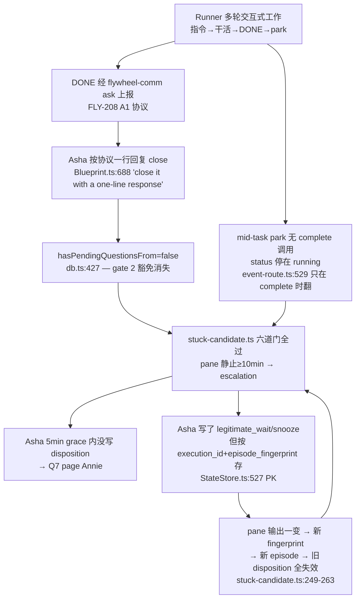

# Research: Runner-stuck 误报刷屏审计 — FLY-253

**Issue**: FLY-253(误报刷屏: 合法 parked(等 founder 输入)的 Runner 触发 FLY-195 Q7 fallback 刷屏一整天)
**Date**: 2026-06-11
**Source**: Linear FLY-253;生产只读取证(`~/.flywheel/teamlead.db` + `~/.flywheel/comm/sub/comm.db`,sqlite3 `mode=ro`,未触碰任何进程)

---

## 1. 事故规模(生产 DB 取证 — 比 issue 描述更大,且仍在进行)

LEARN-57 execution `9832b207-9946-4c29-bb92-3b1657a0fcab`(sub 项目,session_role=main):

| 取证项 | 结果 |
|--------|------|
| sessions 行 | `status=running`,`decision_route` 空,`last_activity_at=2026-06-10 06:19`(陈旧) |
| `runner_stuck_escalation`(→ Asha) | **21 条**(2026-06-10 06:52 UTC ~ 2026-06-11 18:45 UTC,全部 delivered=1) |
| `runner_stuck_unhandled`(→ Annie,Q7) | **12 条**(issue 截图时为 9;UTC 11:15 = 本地 4:15 AM,对上 Annie 时间线) |
| `stuck_dispositions` | **7 条,全部 noted_by=sub-lead**(4× `legitimate_wait`,3× `snooze`) |
| 状态 | **刷屏仍在进行**:最新 escalation 2026-06-11 18:45:24 UTC(今天),Asha 20 秒后又写了一条 `legitimate_wait` |

**关键反转:Asha 不是失职 — 她在尽职追着 disposition**。首条 escalation(06:52:13)后 **27 秒** 她就写了 `legitimate_wait`(06:52:40)。问题是她追不上 episode 的产生速度:21 个 episode 她处置了 7 个,漏掉/超 5 分钟 grace 的 12 个全部 page 了 Annie。

## 2. 根因链(逐环代码定位)

逐环说明:

1. **status 不翻是合理行为,不是 FLY-108 的 bug**。status 只在 `flywheel-comm complete --route ...` 时翻(`event-route.ts:529-714`:needs_review→awaiting_review、merged→completed、blocked→blocked、no_code→completed)。LEARN-57 是多轮交互任务(Asha 指令 → runner 干活 → DONE 报告 → park 等下一轮/等 Annie 挑人),park 是 **mid-task**,任务没结束不能 `complete`。FSM(`workflow-fsm.ts:120`)没有 running↔parked 边。
2. **gate 2(pending-question 豁免)被 FLY-208 协议自己拆掉**。CommDB 取证:runner 的每条 DONE 报告和指令回执都有**恰好 1 条 response** —— Asha 严格执行了 FLY-208 的"Lead may close it with a one-line response"(`Blueprint.ts:684-692`)。一旦回复,`hasPendingQuestionsFrom`(`flywheel-comm/db.ts:427`,查"无 response 且未过期")返回 false,豁免消失。**两条规则在打架**:回报协议要求秒回,stuck 豁免要求挂着别回。
3. **episode 以 pane fingerprint 为界,而 pane 变化恰是 parked runner 的常态**(`stuck-candidate.ts:249-263`:fingerprint 一变 → episode: null → 重新开计)。变化源:下一轮 Lead 指令、runner 回执/干活输出、**Asha 按 remanage ladder ① 发的 mailbox wake 本身**(`stuck-runner-remanage.md` Step 2 ①:"If output changed, the Runner is back — you are done (no disposition needed)" —— 规则自己保证了 runner 继续 park 时 ~15 分钟后下一个 episode 必然出现)。
4. **disposition 按 `(execution_id, episode_fingerprint)` 存**(`StateStore.ts:527-537` PK;`getStuckDisposition` 精确匹配),新 episode 全部绕过。`snooze` 同样 fingerprint-scoped,同样绕过。
5. **Q7 文案撒谎**:"the Lead may be down or stuck too"(`stuck-escalation.ts:267`)— 实际 Asha 在线且 27 秒处置过同 execution 的上一个 episode。Q7 只看"**本 fingerprint** 5 分钟内无 receipt",不看该 execution 的处置历史。
6. **检测器看不见真实生命体征**。这个 workload 的活性信号在 CommDB(runner 18:07 UTC 还在发消息),检测器只看 pane 静止度。"安静的 pane" 对 parked 交互式 runner 是常态而非异常。

附:Annie 收到 12 条而非 21 条的原因 —— Q7 eventId `runner-stuck-unhandled:<exec>:<fingerprint>` 不含 episodeStartedAt,claims.db 持久 dedup 把**同 fingerprint 复发**的 episode(pane 变走又变回同一帧,如 `657ea6ac`、`f44d3be3` 各出现 2 次)压到每 fingerprint 一条。12 = 距离去重后的 distinct fingerprint 中无及时 disposition 的数量。

## 3. FLY-193/218/220 家族对照(Lead-pane 侧已修,runner 侧缺位)

| 机制 | Lead-pane 侧(已修) | runner-stuck 侧(现状) |
|------|---------------------|------------------------|
| 报一次就停 | FLY-220 `episodeKind` latch(`LeadWatchdog.ts:296-313`):报过后**静音直到 live state 不再显示该 block**(每 tick 用 classify 检恢复) | 无等价物。episode 以 pane fingerprint 为界,pane 一变就"恢复",下次静止重新报 |
| 合法等待豁免 | FLY-193 live-region 识别器:idle 锚点(输入框+status bar)= 健康,default-ON 压制 | gate 2 pending-question 豁免存在但被 FLY-208 回报协议击穿;无"runner 最近在通信=活着"豁免 |
| episode 定义 | 以**阻塞条件本身**为界(条件消失才算恢复) | 以 **pane 帧哈希**为界(噪声驱动) |

镜像结论:runner 侧需要的 latch 语义是"**Lead 判过这个 runner 在合法等待 → 静音,直到真实状态变化**",latch 的 key 应该是 **execution**(Lead 判断的对象是 runner,不是某一帧 pane)。

## 4. 三个修复方向权衡(初判,plan 细化)

### 方向 1:状态翻转(DONE/park 时翻出 running)— **不推荐作为本 issue 修法**
- mid-task park 没有可靠的翻转钩子:谁翻出去、谁翻回来?靠 runner 自报 park/unpark = LLM 合规依赖,漏翻回 = 制造新的 stuck-state 家族(LEARN-12 同款),且 parked 状态下检测器永盲。
- 新增 status 的爆炸半径:FSM 双向边、`getActiveSessions`、RunnerIdleWatchdog(只 poll running)、HeartbeatService orphan reconcile(FLY-172)、stale patrol、close_runner 状态集、terminal-immunity(FLY-228)、dashboard、QA framework 断言。
- end-of-task 场景已有正确工具:`complete --route needs_review` → `awaiting_review`(gate 1 天然豁免,`stuck-candidate.ts:226-231`)。LEARN-57 的 park 不是 end-of-task,套不上。

### 方向 2:awaiting-founder 豁免 — **取机械化切片:recent-comm-activity 豁免(Layer 1)**
- 完整建模"等 founder"需要 runner 自声明(LLM 合规)或语义识别(脆),不取。
- 取机械真实的切片:**runner 最近 N 分钟内有 outbound CommDB 消息(ask/DONE/回执) ⇒ 不是 stuck candidate**(新 exclusion reason)。stuck 的定义是"loop 停了";一个最近还在给 Lead 发消息的 runner 机械上活着,与 pane 静止不矛盾(pane 是渲染,CommDB 是行为)。
- 查询便宜:`stuck-escalation.ts` 的 pending-gate probe 已经只读打开同一个 comm.db,加一个 `MAX(created_at) FROM messages WHERE from_agent=?` 同价。
- 对 LEARN-57 的效果:活跃期(指令/DONE 每 15-60 分钟一轮)几乎全部压掉;长夜 park(04:32 DONE 后 6.6h 静默)超窗后放行**一次** → 交给 Layer 2。
- 代价(plan 里写明):DONE 后立刻真冻(GEO-397 类)的检测延迟从 ~10-15min 变 ~N min(N=窗口),是延迟不是漏报。

### 方向 3:disposition 压制持久化(execution-scoped latch)— **核心修法(Layer 2)**
- `legitimate_wait` / `needs_founder` / `snooze` 改为 **execution-scoped**(Lead 判断的对象是 runner 不是 pane 帧);`false_positive` 保持 episode-scoped("实际在干活"本来就会自然换 episode,execution-scoped 反而会遮蔽后续真卡死)。
- 零 schema migration 候选:`episode_fingerprint='*'` 哨兵行(PK `(execution_id, episode_fingerprint)` 兼容),`getStuckDisposition` 先精确后哨兵;endpoint 按 disposition 类型决定写入 scope。
- 直接复用现有抑制位点:escalation 路径 `readDispositionSafe→dispositionSuppresses`(`stuck-runner-detector.ts:254-270`)和 Q7 路径 durable re-read(`:308-338`)——查询命中哨兵行后两条刷屏路径(→Lead 和 →Annie)同时闭合,**报一次就停**。
- latch 清除语义(plan 定稿):execution 终结天然失效(retry 是新 execution_id);`snooze` 到期自动失效(现有 `snooze_until_ms` 语义);可选显式 clear/re-arm 动作。已知盲区(文档化,FLY-218 同款 tradeoff):latch 后该 runner 后续真卡死不再上报 —— 缓解 = 规则引导有时限的等待用 `snooze`、开放式 park 用 `legitimate_wait`,且 Lead 本来就在高频驱动这种 runner。

### 推荐组合
**Layer 1(机械豁免)+ Layer 2(execution-scoped latch)**,两层独立成立、叠加后覆盖:活跃交互期(L1)、长 park 期(L2 报一次后静音)、Lead 真 down(L1/L2 都不挡首报,Q7 兜底保留)。不动 FSM、不动 status、不依赖 LLM 合规;LeadWatchdog 侧零改动。

## 5. 现行参数与开关(plan 引用)

| 参数 | 默认 | 位置 |
|------|------|------|
| `FLYWHEEL_STUCK_DETECT` | on(`!=0`) | stuck-escalation.ts:43 |
| `FLYWHEEL_STUCK_THRESHOLD_MS` | 600_000(10min) | stuck-escalation.ts:59 |
| `FLYWHEEL_STUCK_LEAD_GRACE_MS` | 300_000(5min) | stuck-escalation.ts:64 |
| 驱动 | RunnerIdleWatchdog 30s poll piggyback,零新 timer | RunnerIdleWatchdog.ts:122-135 |
| 即时缓解(代码外) | Asha 对当前 episode 已在持续 disposition;Annie 挑完人 unpark 自然停 | — |

## 6. 受影响文件清单(plan 输入)

- `packages/teamlead/src/bridge/stuck-candidate.ts` — 新 exclusion(recent_comm_activity)+ 纯逻辑输入
- `packages/teamlead/src/bridge/stuck-runner-detector.ts` — 接 predicate;disposition 查询语义不变(查到即抑制)
- `packages/teamlead/src/bridge/stuck-escalation.ts` — comm.db probe 扩展(last outbound activity);env knob
- `packages/teamlead/src/StateStore.ts` — `getStuckDisposition` 哨兵 fallback;`setStuckDisposition` scope 写入
- `packages/teamlead/src/bridge/stuck-remanage-routes.ts` — endpoint scope 语义(按 disposition 类型)
- `packages/teamlead/lead-rules-base/stuck-runner-remanage.md` — 规则更新(legit-wait 现在 per-runner 生效;snooze 用于有时限等待)
- 测试:`stuck-runner-detector.test.ts`、`stuck-escalation.test.ts`、stuck-candidate 纯逻辑测试、StateStore 测试
