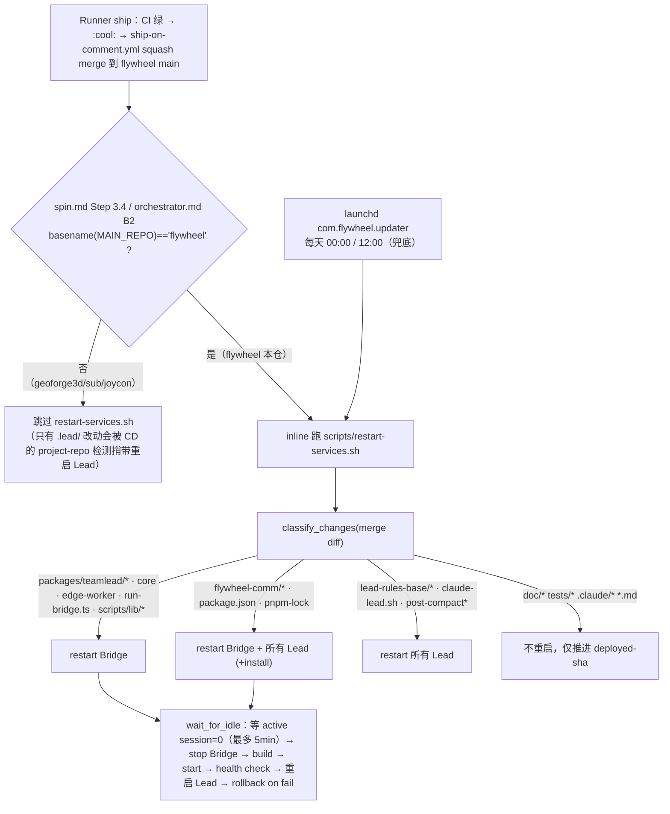

# Research: 把 Flywheel 自己 onboard 进 Flywheel — FLY-270

**Issue**: FLY-270
**Date**: 2026-06-15
**Source**: `doc/engineer/exploration/new/FLY-270-self-onboard.md`；onboard 机制复用 `doc/engineer/plan/draft/FLY-189-onboard-joycon-typeless.md` + `FLY-190-onboard-sub.md`（已上线模板）；自托管 CD trace = `scripts/restart-services.sh` / `scripts/update-flywheel.sh` / `.claude/commands/spin.md` / `orchestrator.md` 实读
**Author**: worker-fly-270

> 红线遵守：本研究**先审计了真实 codebase**（projects.json 实文件、Peter identity/agent、CD 脚本全文、Blueprint worktree 路径、FLY team labels），不把已有的当从零设计。

---

## 0. TL;DR

1. **onboard 机制 = 完全复用 FLY-189/190 的成熟模板**（joycon/sub 已上线验证）。flywheel 的 onboard 物料形状与它们同构，只是 `projectName=flywheel` / `team_id=FLY` / 专属 label。机制审计不重复，直接引用（§1）。
2. **写代码阶段安全已确认**：Runner 跑在 `~/Dev/flywheel/worktrees/<execId>`（Blueprint 路径实读），主 checkout `~/Dev/flywheel` 不被动 —— 这正是 CD `git pull --ff-only` 要求的干净状态。worktree 隔离成立（§3）。
3. **唯一新风险 = ship 那一步的"自我手术"**：现成 CD（`spin.md` Step 3.4 + `restart-services.sh`）**只在 main repo 是 flywheel 时**自动跑重启，且会按 merge diff 重启 Bridge + **所有 Lead**（含正在协调的 Eng Lead）。完整 trace + 三个真实风险（self-restart 死锁 / 杀掉协调者 / flywheel 同时是"代码仓"又是"项目仓"的双重身份交互）见 §4 —— **这是 plan/design-review 要啃的核心**。
4. **merge 授权早已 founder-gated**（`founder-only-authority` + `approve_to_ship` + `verify-approval`，Claude Lead 路径）。FLY-270 不需要重造授权；要新解的是 **merge 之后的重启执行路径**（重启不是 `/api/actions/*` 动作，FLY-245 的闸不覆盖它）。§6。
5. **label scoping 有跨线坑**：每个 Lead 默认 `TEAMLEAD_ISSUE_PREFIXES=FLY,GEO` 都认 FLY 前缀；若 Eng Lead 复用 `Product` label，GeoForge3D 的 Peter（match `Product`）理论上能被误调去在 GeoForge3D repo 跑一个 FLY issue。→ 倾向给 flywheel **专属 scope label**（§5）。

---

## 1. Onboard 机制（复用 FLY-189/190，不重复审计）

FLY-189（joycon）/ FLY-190（sub）两份 plan 已把 Flywheel 的 onboard 机制审计透并上线。本次**直接复用**，结论照搬，不重新 trace：

- **三套配置 + 一条 launch 链**：`~/.flywheel/projects.json`（Lead↔Discord↔repo 路由，Bridge 启动期 `ProjectConfig.loadProjects()` 硬校验）+ `<repo>/.flywheel/config.yaml`（Blueprint/Runner 侧，`ConfigLoader.validate()`）+ `<repo>/.lead/<leadId>/identity.md`（+ `agent.md`，claude-lead.sh copy 到 `~/.claude/agents/`）+ Discord bot（`/setup-discord-lead`）+ executor agent 文件 + launchd plist（走 `flywheel-lead-wrapper.sh <manifest>`，manifest 由 claude-lead.sh 每次启动自动写）。
- **关键复用约束**（FLY-189/190 已踩的坑，flywheel 同样适用）：
  - **不建 `.lead/shared/` 单文件**：一旦存在，claude-lead.sh 对非 cos Lead 强制 `common-rules.md` **和** `department-lead-rules.md` 同时存在否则 launch fail。单 Lead 项目把具体规则折进 `identity.md`；`founder-only-authority.md` 等 base 规则由 claude-lead.sh 从 `lead-rules-base/` 另行加载，不受影响。
  - **首次必须手动跑一次 claude-lead.sh** 生成 manifest，之后 launchd plist 才有东西可 exec；plist 必须手写。
  - **manifest `projectDir` 可指向 worktree**（joycon 实例就是 `joycon-typeless/worktrees/flywheel-main`）—— 这是为了让 Lead 跑在干净 main 上。**flywheel 不需要这招**：flywheel 主 checkout `~/Dev/flywheel` 本就是 CD 维护的干净 main，Eng Lead 的 `projectDir` 直接用它即可（Runner 自建 `worktrees/<execId>` 隔离）。
  - **label 是 FLY-127 run-start 硬闸**：`isLeadInScope`→`classifyIssue`（`department-registry.ts`）要求 issue 带匹配 Lead `match.labels` 的 label，否则 Bridge 403 `issue_no_department_label`（开关 `BRIDGE_DEPT_SCOPE_REJECT` 默认开）。`match.labels` 取**恰好一个** label（`classifyIssue` 对 spawning lead 假设单 label，`department-registry.ts:123` 注释 `match.labels[0]`）。

> 与 FLY-189/190 的差异点全部集中在 §2/§4/§5。机制本身不动。

---

## 2. flywheel 的具体 onboard 物料形状（实读现状后的草案）

### 2.1 `~/.flywheel/projects.json` 新增条目（draft，**不写进 live 文件**）

```jsonc
{
  "projectName": "flywheel",
  "projectRoot": "/Users/xiaorongli/Dev/flywheel",
  "projectRepo": "xrliAnnie/flywheel",
  "memoryAllowedUsers": ["annie", "eng-lead", "flywheel"],
  "leads": [
    {
      "agentId": "eng-lead",
      "chatChannel": "<NEW: #flywheel 频道 id>",
      "match": { "labels": ["<NEW: 专属 scope label, 见 §5>"] },
      "botTokenEnv": "<PERSONA>_BOT_TOKEN",
      "department": "engineering",
      "canSpawnRunners": true,
      "alertChannel": "<#flywheel 频道 id>"
    }
  ],
  "generalChannel": "<NEW: #flywheel-core 频道 id（若走双频道）>"
}
```

- `projectName=flywheel`（= 目录 basename、= config.yaml `project:`、= comm.db key、= Runner worktree 根 `~/Dev/flywheel/worktrees/`；三处必须一致 —— 与 FLY-189 A5 同理）。
- `agentId=eng-lead`（manifest key 会是 `flywheel-eng-lead`，干净；`discord-eng-lead` state dir）。`department: engineering` 便于将来扩。
- ⚠️ **flywheel 同时成为"被 CD 维护的代码仓"和"projects.json 里的项目仓"** —— 这个双重身份会和 CD 的 `check_project_lead_changes` 交互，见 §4.4。

### 2.2 `<repo>/.flywheel/config.yaml`（新建）

照 GeoForge3D / FLY-189 草案，`team_id: FLY`（schema 强制非空但运行期不读 —— FLY-189 §1.4 已 trace 确认）。`decision_layer.autonomy_level: advisor`（merge 仍走 founder）。executor：Eng Lead 的活几乎全是 TypeScript/脚本工程 + 文档，倾向单 `engineering-executor`（或 code + docs 两个），不照搬 GeoForge3D 的 7 个。具体粒度 plan 定。

### 2.3 `.lead/eng-lead/identity.md` + `agent.md`（照 Peter）

- frontmatter 同 Peter：`model: opus`、`memory: user`、`disallowedTools: Write, Edit, MultiEdit, Agent, NotebookEdit`、`permissionMode: bypassPermissions`。
- 正文照 `GeoForge3D/.lead/product-lead/{identity,agent}.md`：Orchestrator/Architect 定位、Bridge API + flywheel-comm 用法、stage monitoring、escalation、双桶 memory。
- **差异点**：①单 Lead → 删掉 Peter 的 "Shared Channel Reply Discipline"（除非进 #leads-roundtable，照 FLY-267 加 cross-dept 段）；②频道隔离改成 #flywheel（+ #flywheel-core）；③**写死 self-hosting ship 纪律**（§4 的边界结论，plan 定稿后回填）；④issue scoping：只处理带专属 label 的 FLY issue（§5）。
- **memory `user_id` 共享桶** = `flywheel`（对应 projects.json `memoryAllowedUsers`）。

### 2.4 launchd plist + manifest

照 `com.flywheel.lead.geoforge3d-product-lead.plist`：label `com.flywheel.lead.flywheel-eng-lead`、`KeepAlive=true`、`RunAtLoad=true`、ProgramArguments = `/bin/bash <wrapper> <manifest>`、`EnvironmentVariables.FLYWHEEL_LEAD_MODEL`（模型按 fleet 决定，FLY-247/241）。manifest 由首次手动 claude-lead.sh 生成。**KeepAlive 是 self-surgery 存活的关键**（§4.3）。

---

## 3. 写代码阶段安全：Runner worktree 隔离（已确认）

- Blueprint/run-dispatcher 把 Runner worktree 建在 **`${HOME}/Dev/<projectName>/worktrees/<execId>`**（`event-route.ts:123` 注释 + `run-dispatcher.ts` worktreePath）。flywheel → `~/Dev/flywheel/worktrees/<execId>`，正好是 repo 里已 `.gitignore` 的 `worktrees/` 目录（人类 worker 今天也用它）。
- 主 checkout `~/Dev/flywheel` 始终留在干净 `main` —— 这正是 CD `update-flywheel.sh` 的 `git pull origin main --ff-only` 和 `rollback_and_restart`（拒 dirty checkout）所要求的。
- **结论**：写代码/跑测试/开 PR 阶段，Runner 与运行中的 Bridge/Lead **物理隔离**，零风险。风险 100% 集中在 ship 那一步（§4）。

---

## 4. ★ 核心：self-hosting ship / 重启安全边界（完整 trace）

### 4.1 现成 CD 触发链（实读）



**关键事实**：
- ship 走 `:cool:` → GitHub Actions `ship-on-comment.yml` squash merge（不是 `gh pr merge`）。
- merge 之后由 **谁** 跑 `restart-services.sh` 决定风险形态：
  - 主路径 = **触发 ship 的那个 Runner**（spin.md Step 3.4，inline，且 **仅当 main repo 是 flywheel**）。
  - 兜底 = **launchd updater**（detached，每天两次，与任何 Lead/Runner 进程无关）。
- `restart-services.sh` 的 `classify_changes()`（实读 `restart-services.sh:447-484`）把 merge diff 映射成 `restart_bridge` / `restart_all_leads` / `need_install`。**碰核心运行时 = 重启 Bridge + 所有 Lead；碰 lead-rules-base / claude-lead.sh = 重启所有 Lead；纯 doc/test/md = 不重启。**

### 4.2 三个真实风险（自我手术特有）

1. **杀掉协调者**：`restart-services.sh` 重启 **所有 Lead**（`do_restart_all_leads` 遍历所有 manifest），其中就包含正在协调这次 ship 的 Eng Lead 自己。Bridge 重启更是把全机 Lead 一起带走。
2. **self-restart 死锁/被杀**：inline 路径下，触发重启的 Runner 自己**还是 active session**（spin Step 3.7 的 `session_completed` 在 Step 3.4 之后才发）。`wait_for_idle()`（`restart-services.sh:530-557`）等 `sessions_count==0` —— 它会数到自己 → 等满 5min 超时 → 强制重启。Bridge 重启时这个 Runner 的 tmux 是否被波及取决于它是否被 `do_restart_all_leads`/`stop_bridge` 命中（Runner ≠ Bridge ≠ Lead，理论上 Runner tmux 不被这两者直接 kill，但它依赖的 Bridge 在它跑完 bookkeeping 前就没了 → 后续 `session_completed` 投递失败 → 落 `complete-failed` marker，靠 stale patrol 对账）。
3. **flywheel 的双重身份交互**（§4.4）。

### 4.3 已有的"存活"机制（设计可依赖的兜底）

- **launchd KeepAlive**：Bridge（`com.flywheel.bridge`）+ 每个 Lead plist 都 `KeepAlive=true` → 被 kill 后自动 respawn。Eng Lead 被自我手术杀掉后会被 launchd 拉起来、resume from summary（同 memory 里"Lead 重启卡 resume 确认框"的已知现象，FLY-182/193 已处理 frozen 告警）。
- **detached updater**：`com.flywheel.updater` 完全独立于 Lead/Runner 进程，是天然的"手术不在病人身上做"路径 —— 即使 Eng Lead/Runner 都被杀，它仍能把重启跑完。
- **restart-services.sh 自带安全网**：idle-wait + build 失败 `rollback_and_restart`（reset --hard 到 deployed-sha，拒 dirty）+ Bridge health check（60s 内 `/health` 不 ok 则 rollback）+ deployed-sha 只在全绿后推进（部分失败不推进，下次重试）+ `restart.lock.d` 互斥。
- **Annie 的终极兜底**：真出事 → 开独立 terminal 救（Annie 已接受）。

### 4.4 flywheel 双重身份的新交互（onboard 引入的副作用，需在 plan 里消化）

onboard 后 flywheel 既是 **CD 的代码仓**（`deployed-sha` 门）又是 **projects.json 的项目仓**（有 manifest）。`restart-services.sh:check_project_lead_changes()` 会遍历所有 manifest、对每个项目仓 fetch origin/main 并 diff `.lead/`。加入 flywheel manifest 后，它也会对 flywheel 仓做这件事 → flywheel 的 `.lead/eng-lead/*` 改动会经 **project-repo 路径** 触发 Lead 重启（而 `classify_changes` 的主 diff 路径只认 `lead-rules-base/*`、不认 repo 内 `.lead/*`）。两条路径对 flywheel 的 `.lead/` 改动可能重叠/各自判断，需确认不产生**双重重启**或**误判**。属低风险（Lead-only restart 大致幂等），但 plan/design-review 要显式走查。

### 4.5 边界设计空间（plan + codex-design-review 拍，本研究只列）

按 Annie "越自动越好，必要时 hybrid" 的口径，候选形态：

- **方案 A — 风险分档（hybrid，推荐起点）**：
  - **Tier 1（非自修改）**：merge diff **不碰** Bridge/Lead runtime（纯 doc/test，或不触发 `restart_bridge`/`restart_all_leads` 的代码）→ **全自动** merge + 重启（甚至无需重启）。
  - **Tier 2（自修改）**：merge diff 碰 Bridge/Lead runtime → merge 仍走**现成 founder 闸**（approve_to_ship + verify-approval，已是 Annie 拍）；重启**不 inline 跑**（避开 §4.2 的 self-restart 死锁 + 协调者被杀），改成 **Runner 先发 `session_completed` 落终态 → 触发 detached 重启**（`launchctl kickstart com.flywheel.updater`，或 detached `nohup restart-services.sh`）→ Bridge/Lead 经 launchd KeepAlive + resume 自愈。
  - 分档判据可复用 `classify_changes()` 同一套文件 pattern（单一真相，避免 Lead/CD 两套规则漂移）。
- **方案 B — 全 detached**：所有 flywheel ship 的重启都走 detached updater，不 inline。简单、统一，但非自修改 PR 也要等 updater 节奏（除非 ship 后主动 kickstart）。
- **方案 C — 全手动门**：所有碰运行时的 ship 都停在 Annie 手动重启。最安全但最不自动，与 Annie "越自动越好" 相悖 —— 仅作保守对照。

> ⚠️ 还需 codex 确认的实现细节：①触发重启的 Runner 如何**先落终态再触发重启**（次序：merge → bookkeeping → `session_completed` → detached restart），避免 self-restart 死锁；②Eng Lead 被杀→launchd 拉起→resume 后，能否**接回**未完成的 ship 上下文（in-flight Runner 状态由 Bridge StateStore 持有，重启后可查）；③§4.4 双重身份不产生双重重启。

---

## 5. FLY issue 的 label / match scoping（跨线坑）

- **现状**（实查 FLY team labels）：`Product`（"Product development and engineering work"）、`Operations`（FLY mirror of GEO）、`PM`/test/`codex`/`designer` 等。**FLY-270 自己无 label**；FLY issue 总体无统一 label。
- **跨线风险**：`claude-lead.sh:184` 每个 Lead 默认 `TEAMLEAD_ISSUE_PREFIXES=FLY,GEO` —— **所有现役 Lead（Peter/Oliver/Simba）本就认 FLY 前缀**。隔离真正靠的是 **projectName 绑定 + FLY-127 label 硬闸**（FLY-189 §1.4）。若 Eng Lead **复用 `Product` label**：一个带 `Product` 的 FLY issue，若被以 `leadId=product-lead`+`projectName=geoforge3d` 调 `/api/runs/start`，`classifyIssue` 会放行 → 在 **GeoForge3D repo** 跑一个 flywheel issue（错仓）。这是误操作面，不是物理不可能。
- **倾向**：给 flywheel **专属 scope label**（如 `flywheel` / `Engineering` / `Infra`，名字 Annie/plan 定），Eng Lead `match.labels=["<它>"]`，且每个交给 Runner 的 FLY issue 必须打这个 label。与 joycon(`joycon`)/sub(`Sub`) 的"每项目一个专属 label"教训一致。
- 复用 `Product` 是次选（省一个 label，但引入上面跨线面 + 与 GeoForge3D Peter 语义混淆）。plan 给 Annie 两个选项。

---

## 6. 与 FLY-245 founder gate 的关系（澄清边界）

- **Eng Lead 是 Claude Lead**（照 Peter，`model: opus`），不是 write-capable Codex Lead。所以它的 **merge/ship 授权走现成 Claude 路径**：`lead-rules-base/founder-only-authority.md`（Track 1，Lead 把 founder 自由文本批准当输入）+ `approve_to_ship` checkpoint + `flywheel-comm verify-approval`（重核 CommDB gate + approved_to_ship + prHeadSha）。**这条已经是 founder-gated，FLY-270 不重造。**
- **FLY-245 不覆盖本 issue 的新风险**：FLY-245 的闸管的是 write-capable **Codex** Lead 经网关请求 `/api/actions/*`（merge/ship/runner-lifecycle）。**"重启 Bridge/Lead 自己"不是 `/api/actions/*` 动作**，是 shell 跑 `restart-services.sh` —— 不在 FLY-245 闸内。所以 FLY-270 的 §4 边界是**新增的、正交的**一层。
- **协同点**：若将来 Eng Lead 换成 Codex backend，则 §4 的"重启"动作需要也纳入 FLY-245 风格的网关授权（届时新建一个 lifecycle-style consent）。本次 Claude Lead 不需要，记为 future。

---

## 7. plan 必须定的开放项（research 不拍，给 Annie/Codex）

| # | 开放项 | research 倾向 | 谁定 |
|---|--------|--------------|------|
| 1 | **ship/重启安全边界**（§4.5） | 方案 A 风险分档 hybrid（复用 `classify_changes` pattern 作单一真相；Tier 2 走 detached 重启 + launchd KeepAlive 自愈） | Codex design-review（核心） |
| 2 | self-restart 次序 / resume 接回 / 双重身份（§4.2/§4.4） | 先 `session_completed` 落终态再 detached 触发；§4.4 显式走查 | Codex |
| 3 | Lead 人格名（§2.3） | Disney 工程师/造物者主题，提 2-3 候选（如 Tadashi/Edna/Gyro） | Annie |
| 4 | 频道拓扑：单 #flywheel vs #flywheel + #flywheel-core | 照 joycon/sub option C 双频道（与 core-channel reply-guard 一致） | Annie |
| 5 | FLY label / match 规则（§5） | 专属 scope label（避免与 Peter 的 `Product` 跨线） | Annie |
| 6 | 自托管部署执行者（§4.5 方案绑定） | detached（updater / nohup），非 inline Runner | Codex + Annie |
| 7 | config.yaml executor 粒度（§2.2） | 单 engineering-executor 或 code+docs 两个，不照搬 7 个 | plan/Codex |

---

## 附：本研究实读的真实来源
- `~/.flywheel/projects.json`（5 项目实文件）、`~/.flywheel/manifests/*.json`、`~/Library/LaunchAgents/com.flywheel.lead.*.plist`、`com.flywheel.updater.plist`
- `GeoForge3D/.lead/product-lead/{identity,agent}.md`（Peter 模板）
- `scripts/restart-services.sh`（全文）、`scripts/update-flywheel.sh`、`scripts/pre-ship-check.sh`
- `.claude/commands/spin.md`（Step 3）、`.claude/commands/orchestrator.md`（B/B2）
- `packages/teamlead/scripts/claude-lead.sh`（`TEAMLEAD_ISSUE_PREFIXES`）、`packages/teamlead/src/department-registry.ts`、`packages/teamlead/src/bridge/event-route.ts`（worktree 路径）
- FLY team Linear labels（`mcp__linear-api__list_issue_labels`）
- 复用：`doc/engineer/plan/draft/FLY-189-onboard-joycon-typeless.md` + `FLY-190-onboard-sub.md`
- 协同：`doc/engineer/plan/new/v1.42.0-FLY-245-codex-lead-founder-gate.md`
