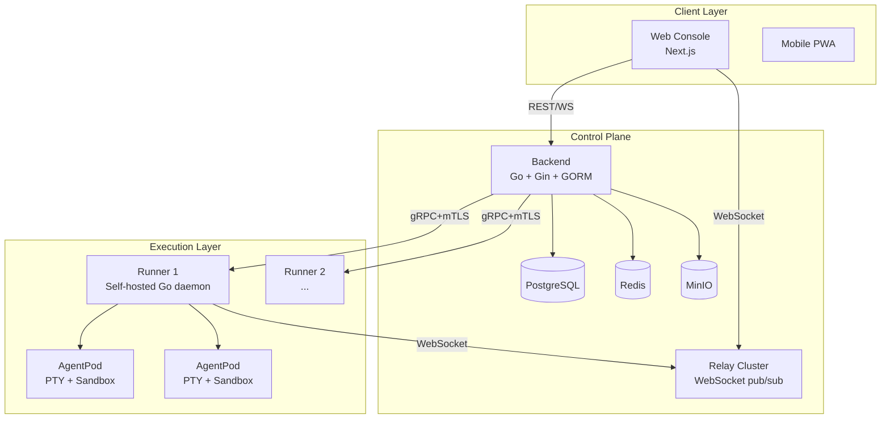

# Research: AgentsMesh Deep Dive — FLY-3

**Issue**: FLY-3 (AgentsMesh Deep Dive Research)
**Date**: 2026-03-30
**Source**: https://github.com/AgentsMesh/AgentsMesh + https://agentsmesh.ai/

---

## 1. AgentsMesh 概览

### 1.1 定位

AgentsMesh 自称 **"AI Agent Fleet Command Center"**，核心主张是 **"Don't let humans bottleneck AI agents"**。它是一个通用的多 AI coding agent 协作平台，支持 Claude Code、Codex CLI、Gemini CLI、Aider、OpenCode 等任意终端型 agent。

**BYOK 模式**：用户自带 API key，AgentsMesh 收取基础设施/编排费用，不收 AI 使用费。

### 1.2 规模与成熟度

| 指标 | 数据 |
|------|------|
| GitHub Stars | ~1,171 |
| 首次发布 | 2026-01-11 (v0.1.0) |
| 最新版本 | v0.5.0 (2026-02-27) + Unreleased |
| Go 源码 (非测试) | ~135K 行 |
| Go 测试 | ~165K 行 |
| TypeScript 文件 | ~726 个 |
| 后端 domain 模块 | 22 个 |
| DB migrations | 166 个 |
| License | BSL-1.1 (商业使用需授权，2030 年转 GPL) |
| 开发方法 | 1 人 + 3 并行 agent，52 天构建 |

关键发现：**这是一个单人+AI开发的项目**。作者在博客中披露用 "Harness Engineering" 方法论，1人52天600 commits，~1M行代码吞吐量，保留356K行。这说明 AI 辅助开发的生产力上限。

### 1.3 技术栈

| 层 | 技术 |
|----|------|
| Backend | Go (Gin + GORM) |
| Frontend | Next.js (App Router) + TypeScript + Tailwind CSS |
| Admin Console | Next.js |
| Database | PostgreSQL + Redis |
| Storage | MinIO (S3-compatible) |
| Runner ↔ Backend | gRPC + mTLS (双向流) |
| Browser ↔ Server | WebSocket (via Relay) |
| Reverse Proxy | Traefik |
| Proto | Protocol Buffers |

---

## 2. 核心架构

### 2.1 三层分离



**核心设计决策**：控制面和数据面分离。
- **控制信号**（Pod 创建/终止/状态）走 gRPC + mTLS 双向流
- **终端数据**（实时输出/输入）走 Relay 集群的 WebSocket

这比 Flywheel 的 tmux 本地方案复杂得多，但支持了远程/多机/Web 访问。

### 2.2 核心组件

#### Runner (Go daemon)
- 自托管在用户机器上，连接 Backend 通过 gRPC + mTLS
- 管理 AgentPod（隔离 PTY 环境）
- 自动证书续签（每小时检查）
- 支持远程升级 (`UpgradeRunnerCommand`)
- 使用 `suture/v4` 做 supervision tree

#### AgentPod
- 一个隔离的执行环境：PTY terminal + Sandbox (Git worktree) + 输出转发器
- 每个 Pod 有独立的 `pod_key`
- 支持 Resume（复用 sandbox + 会话状态）
- Agent 状态检测：executing / waiting / idle（通过 OSC escape sequences）

#### Relay
- 独立的 Go 服务，纯 WebSocket pub/sub
- 双端连接：Runner 是 publisher，Browser 是 subscriber
- Channel 模型（ChannelManager → TerminalChannel → Publisher + Subscribers）
- 优雅关停：先停接受连接 → 通知 Backend → 等 Channel 关闭 → 停 HTTP

#### Autopilot Controller
- **Agent 驱动 Agent** 的核心抽象
- 迭代循环：Control Agent 观察 → 决策 → 发送输入 → 等待
- 断路器模式：无进展/重复错误时自动暂停请求人工审批
- 用户接管/交回控制权机制
- 每次迭代有超时（默认 300s）

---

## 3. Multi-Agent 协作机制

这是 AgentsMesh 最有价值的设计，也是与 Flywheel 差异最大的部分。

### 3.1 Channel (频道通信)

```typescript
// Channel = 多 agent 协作空间
Channel {
  name, description, document  // 共享文档
  repositoryID, ticketID       // 关联 repo 和 ticket
  createdByPod                 // 可由 agent 创建
}

Message {
  senderPod / senderUserID     // Pod 或人发送
  messageType: text|system|code|command
  content, metadata
}
```

- Agent 通过 MCP tool 加入/离开频道
- 支持 @mention（直接转发 prompt 到目标 Pod）
- 人类也可以参与频道对话
- Channel 可以绑定到 repo 或 ticket，建立上下文

### 3.2 Pod Binding (直接绑定)

```
Pod A ---[pod:read]---> Pod B    // A 可以观察 B 的终端输出
Pod A ---[pod:write]--> Pod B    // A 可以发送输入到 B 的终端
```

- **请求-审批模式**：Initiator 发起 bind_pod → Target 的 agent 决定 accept/reject
- **作用域控制**：`pod:read`（观察终端输出）、`pod:write`（发送终端输入）
- **策略**：same_user_auto（同用户自动批准）、same_project_auto（同项目）、explicit_only

**关键工具**：
- `get_pod_snapshot` — 获取另一个 Pod 的终端快照（需 pod:read）
- `send_pod_input` — 向另一个 Pod 发送文本/按键（需 pod:write）
- `get_pod_status` — 获取 Pod 的 agent 状态

### 3.3 MCP 工具集 (26 个)

| 类别 | 工具 | 说明 |
|------|------|------|
| Discovery | list_available_pods, list_runners, list_repositories | 发现可用资源 |
| Pod | create_pod, get_pod_snapshot, send_pod_input, get_pod_status | Pod 管理和交互 |
| Binding | bind_pod, accept_binding, reject_binding, get_bindings, get_bound_pods, unbind_pod | 绑定协商 |
| Channel | 搜索/创建/加入/发消息 | 频道通信 |
| Ticket | CRUD + 关联 | 任务管理 |
| Loop | 查看/触发 | 自动化任务 |

所有 MCP 工具通过 Runner 本地 HTTP server (port 19000) 提供，但实际请求通过 gRPC 双向流转发到 Backend。

### 3.4 Mesh 拓扑可视化

```go
MeshTopology {
  Nodes: []MeshNode    // Pod 节点
  Edges: []MeshEdge    // Binding 连接
  Channels: []ChannelInfo
  Runners: []RunnerInfo
}
```

- 实时拓扑图：节点 = Pod，边 = Binding，动画显示数据流
- 前端用 ReactFlow 渲染

### 3.5 Loop (定时任务)

- Cron 表达式调度 + API 触发
- 两种执行模式：direct（直接执行） / autopilot（Autopilot 控制）
- Sandbox 策略：persistent（保留上下文，跨 run 复用）/ fresh（每次新建）
- 并发策略：skip / queue / replace
- 使用场景：定时 code review、依赖更新、安全扫描

---

## 4. Flywheel vs AgentsMesh 概念映射

| Flywheel 概念 | AgentsMesh 对应 | 对比分析 |
|---------------|-----------------|----------|
| **Lead** (Claude Code --agent) | **Autopilot Controller** | Flywheel Lead 是长期运行的 "部门主管"，AgentsMesh Autopilot 是任务级的控制循环。Lead 有身份和记忆，Autopilot 无状态 |
| **Runner** (tmux session) | **AgentPod** (PTY + Sandbox) | 功能等价，但 AgentPod 有更好的隔离（独立 sandbox/worktree）和远程访问（Web terminal）|
| **Discord** (Lead↔Lead, Lead↔CEO) | **Channel** (频道通信) | Discord 是外部平台，Channel 是内置功能。Discord 更灵活（语音/线程/rich embed），Channel 更轻量集成 |
| **flywheel-comm** (SQLite inbox) | **Pod Binding** + **MCP tools** | flywheel-comm 是文件级通信，Pod Binding 是终端级通信。AgentsMesh 更强大（直接观察/控制终端），Flywheel 更简单 |
| **Bridge API** (StateStore + events) | **Backend** (Go API) | 功能类似但规模不同。Bridge 是 Express 单服务，Backend 是 22 个 domain 模块的 DDD 架构 |
| **Linear** (issue tracking) | **Ticket** (内置 Kanban) | Flywheel 外挂 Linear，AgentsMesh 内置。Linear 功能更丰富，但内置减少了集成摩擦 |
| **Memory** (mem0 + Supabase) | 无对应 | AgentsMesh 没有 memory 系统，依赖 "repo is the context" 哲学 |
| **Decision Layer** (Haiku triage) | **Autopilot 断路器** | Flywheel 用 LLM 做路由决策，AgentsMesh 用 rule-based 断路器 |
| **Orchestrator** (bash + SQLite) | **Loop** (cron + autopilot) | Loop 更成熟（并发策略、持久 sandbox、统计），Orchestrator 更轻量 |
| **Forum Channel** (Discord) | **Web Console Dashboard** | Flywheel 用 Discord Forum 做可见性，AgentsMesh 用 Web 拓扑图 |
| **tmux-viewer** (Terminal.app) | **Relay + Web Terminal** | AgentsMesh 方案更优：Web 随处访问，不依赖本地 Terminal.app |

---

## 5. AgentsMesh 做得更好的地方

### 5.1 Agent 间直接通信 (Pod Binding)

这是 AgentsMesh 最独特的能力：**Agent A 可以直接观察和控制 Agent B 的终端**。

```
Agent A (架构师) ---bind_pod(pod:read,pod:write)---> Agent B (编码者)
Agent A: get_pod_snapshot(B) → 看到 B 在做什么
Agent A: send_pod_input(B, "请先写测试") → 直接指导 B
```

Flywheel 的 Lead→Runner 通信是通过 flywheel-comm SQLite inbox，是**间接的**——Lead 发消息，Runner 通过 PostToolUse hook 轮询检查。AgentsMesh 的方案是**实时的**，而且 Agent 自主决定是否接受 binding，更像人类之间的协作。

**Flywheel 可借鉴**：考虑让 Lead 能直接 capture Runner 的终端输出（现有 Bridge `/api/sessions/:id/capture` 已部分实现），甚至直接向 Runner 发送 terminal input。

### 5.2 Autopilot + 断路器

Autopilot 的迭代循环 + 断路器模式比 Flywheel 的 Decision Layer 更精细：

- **无进展检测**：连续 N 次迭代无文件变更 → 暂停
- **重复错误检测**：相同错误 N 次 → 触发断路器
- **人工介入机制**：暂停 → 请求审批 → 超时自动停止
- **用户接管/交回**：随时切换人工/自动模式

Flywheel 的 "blocked" 状态处理相对粗糙（整个 session 标记为 blocked）。

**Flywheel 可借鉴**：为 Runner 增加 iteration-level 的进度追踪和断路器机制。

### 5.3 Web Terminal + 远程访问

AgentsMesh 的 Relay 架构让用户可以从任何浏览器访问 Agent 终端，包括手机 PWA。Flywheel 依赖本地 tmux + Terminal.app，只能在同一台机器上看。

这是产品形态的根本差异——AgentsMesh 是 SaaS 平台思维，Flywheel 是本地优先思维。

### 5.4 DDD 架构与代码组织

22 个 domain 模块，每个文件 <200 行硬限制，严格的 SOLID/GRASP/YAGNI 原则。这种架构纪律在单人项目中令人印象深刻。

### 5.5 Skill Marketplace

Agent 的能力可以通过 Skill 和 MCP Server 扩展，有 marketplace 机制。Flywheel 的 agent 能力是静态的（agent.md + TOOLS.md）。

---

## 6. Flywheel 做得更好的地方

### 6.1 Lead 身份与记忆

Flywheel 的 Lead 不是匿名的执行器——Peter 是产品经理，Oliver 是运维主管，Simba 是参谋长。每个 Lead 有：
- **持久身份**：角色、职责、行为规范 (agent.md)
- **记忆系统**：mem0 + Supabase pgvector，跨 session 保留上下文
- **专业分工**：不同 Lead 处理不同类型的 issue

AgentsMesh 的 Pod 是无状态的——没有持久身份，没有角色分工，没有跨 session 记忆。

### 6.2 人类通信体验

Discord 作为通信总线比内置 Channel 好得多：
- **丰富的 UI**：线程、embed、反应、语音
- **CEO 不需要学新工具**：Annie 在 Discord 里自然地与 Lead 对话
- **通知生态**：桌面/手机/邮件通知已有基础设施
- **Bot-to-bot**：Lead 之间通过 Discord 协调（经 allowBots fork 实现）

AgentsMesh 的 Channel 是纯文本消息，UI 在自己的 Web console 里——意味着用户需要打开一个新的 Web 应用。

### 6.3 外部集成 vs 内置

Flywheel 选择集成 Linear（issue tracking）而非自建 Kanban，这意味着：
- 复用 Linear 的成熟功能（优先级、label、cycle、filter、roadmap）
- CEO 不需要切换工具
- Linear API 丰富，支持 webhook

AgentsMesh 自建 Ticket 系统，功能远不如 Linear。

### 6.4 简单即力量

Flywheel 的技术选型更简单：
- SQLite vs PostgreSQL + Redis + MinIO
- tmux vs gRPC + mTLS + Relay + PTY
- Express Bridge vs 22-module DDD Backend

简单意味着更少的部署/运维成本、更快的迭代速度、更少的故障点。对于单团队使用场景，Flywheel 的方案完全足够。

### 6.5 Orchestrator 模式

Flywheel 的 bash + SQLite Orchestrator 虽然比 AgentsMesh 的 Loop 原始，但有一个关键优势：**它直接在 Claude Code 的环境里运行**，不需要额外的基础设施。Agent 自己就是调度器。

---

## 7. 值得借鉴的具体组件和模式

### 7.1 高价值（建议短期采纳）

| 模式 | 来源 | Flywheel 应用 |
|------|------|---------------|
| **Autopilot 断路器** | autopilot_controller.go | Runner 级别增加 no-progress / same-error 检测，自动暂停而非无限运行 |
| **Terminal Observation MCP** | http_tools_pod_interaction.go | Lead 通过 MCP tool 直接 `get_runner_snapshot` 获取 Runner 终端状态，比 Bridge capture API 更直接 |
| **Sandbox Resume** | Pod.SessionID + SourcePodKey | Runner 重启后恢复 Claude Code session（已有 GEO-285 crash recovery，但可更优雅）|
| **Agent Status Detection** | agent_status: executing/waiting/idle | Runner 增加 agent 状态检测（通过 OSC escape 或 tmux 进程检测），让 Lead 知道 Runner 是否在等待输入 |

### 7.2 中价值（可考虑中期采纳）

| 模式 | 来源 | Flywheel 应用 |
|------|------|---------------|
| **Loop/Cron 调度** | loop.go | Flywheel 现有 launchd cron 做 standup/patrol，可考虑统一成 Loop 抽象 |
| **Binding 权限模型** | pod_binding.go | Lead→Runner 通信增加权限层（read-only observe vs. full control），防止误操作 |
| **Skill Marketplace** | extension/ | agent.md 能力声明从静态文件变为可安装的 skill package |
| **Mesh 拓扑可视化** | mesh.go | 开发一个 Dashboard 显示 Lead/Runner 实时状态和连接关系 |

### 7.3 低价值（了解即可，不建议采纳）

| 模式 | 原因 |
|------|------|
| gRPC + mTLS | Flywheel 是本地运行，不需要网络安全层 |
| Relay 架构 | 本地 tmux 直接访问更简单 |
| 内置 Ticket/Kanban | Linear 已经足够好 |
| Multi-tenant | Flywheel 是单团队使用 |
| BYOK 计费 | Flywheel 用 Claude subscription，无需计费 |

---

## 8. 风险与关注点

### 8.1 License 风险

BSL-1.1 **不允许生产使用**（除非获得商业授权）。2030年才转 GPL。如果要借鉴代码，只能借鉴**设计模式和架构思路**，不能直接复制代码。

### 8.2 单人项目风险

1人开发的 356K 行项目——维护是个大问号。如果作者放弃，整个项目可能停滞。不建议形成依赖。

### 8.3 "Harness Engineering" 的认知上限

作者自己承认：管理 3 个并行 agent 时达到认知带宽上限（~50K 行/天）。这与 Flywheel 的经验一致——多 agent 协作的瓶颈不是技术，是人类的注意力。AgentsMesh 试图通过 Web UI 解决可见性问题，Flywheel 通过 Discord 解决。

### 8.4 过度工程化

22 个 domain 模块、gRPC + mTLS + Relay、PostgreSQL + Redis + MinIO——对于一个编码辅助工具来说，基础设施过重。这或许是 SaaS 商业化的需要，但作为学习对象需要分辨什么是必要的，什么是业务需求驱动的复杂度。

---

## 9. 关键洞察总结

### 9.1 AgentsMesh 的核心创新

**Pod Binding + Autopilot = Agent 自主协作的基础设施**

这是目前开源项目中最完整的多 agent 终端级协作实现。Agent 不只是接收任务，还能主动发现其他 agent、协商权限、观察和指导其他 agent。这比 Flywheel 的单向 Lead→Runner 指令模式更灵活。

### 9.2 Flywheel 的核心差异化

**Lead 身份 + Discord 人机交互 + Linear 集成 = 组织级 AI 团队**

Flywheel 不是通用编排器，是"AI 员工团队"。Lead 有名字、角色、记忆，通过 Discord 参与组织沟通。这种"拟人化"设计是 AgentsMesh 完全没有的。

### 9.3 发展方向建议

1. **短期**：借鉴 Autopilot 断路器模式，增强 Runner 的自主性和安全性
2. **短期**：增加 agent status detection，让 Lead 实时知道 Runner 状态
3. **中期**：考虑 Terminal Observation MCP tool，让 Lead 能直接读取 Runner 终端
4. **长期**：如果 Flywheel 要支持远程/多机场景，可参考 Relay 架构思路
5. **不做**：不要自建 Ticket/Kanban/Multi-tenant，这些不是核心价值

---

## 10. 附录：代码统计对比

| 维度 | AgentsMesh | Flywheel |
|------|-----------|----------|
| 主语言 | Go | TypeScript |
| 源码 (非测试) | ~135K 行 | ~15K 行 (估) |
| 测试 | ~165K 行 | ~3K 行 (估) |
| 数据库 | PostgreSQL + Redis | SQLite (sql.js) |
| 通信协议 | gRPC + mTLS + WebSocket | HTTP REST + SQLite inbox |
| 部署 | Docker + Traefik (多服务) | tmux + launchd (单机) |
| Agent 支持 | 6+ (Claude, Codex, Gemini, Aider, OpenCode, Custom) | 1 (Claude Code) |
| 多租户 | 是 (Organization > Team > User) | 否 |
| License | BSL-1.1 | 私有 |
| 开发人数 | 1 | 1 |
| 开发周期 | 52 天 (截至博客) | ~3 个月 |

---

## 11. 建议清单

以下是从 AgentsMesh 中提炼的所有值得考虑的模式，供 Annie 统一 review 决定优先级。

### 11.1 Runner 断路器 (Circuit Breaker)

**为什么值得做**：当前 Runner 遇到重复错误或长时间无进展时会持续运行直到超时，浪费 Claude session 时间且不产出。AgentsMesh 的 Autopilot 有 no-progress（连续 N 次无文件变更）和 same-error（相同错误 N 次）两种断路器，自动暂停并通知 Lead。这能让 Flywheel 更早发现"卡住"的 Runner，减少无效运行。

**Priority**: ⭐⭐⭐ 高 — 直接提升 Runner 效率和资源利用率

**复杂度**: 中（2-3 天）— 需要在 Runner 侧增加迭代追踪逻辑，定义"无进展"和"重复错误"的检测规则，通过 flywheel-comm 通知 Lead

**依赖**: 无，可独立实施

---

### 11.2 Agent 状态检测 (Agent Status Detection)

**为什么值得做**：Lead 目前无法精确知道 Runner 是在"执行中"、"等待输入"还是"空闲"。AgentsMesh 通过 OSC escape sequences 和进程检测实现了 `executing / waiting / idle` 三态。有了这个，Lead 可以做更智能的调度——比如发现 Runner 在等待输入时主动发送指令，而不是盲目轮询。

**Priority**: ⭐⭐⭐ 高 — Lead 智能调度的基础

**复杂度**: 小（1-2 天）— 通过 tmux 进程列表或 Claude Code 的 OSC title 变化检测状态，暴露到 Bridge API

**依赖**: 无，可独立实施。与 GEO-262 (tmux 可见性) 和 GEO-283 (typing indicator) 相关

---

### 11.3 Terminal Observation MCP Tool

**为什么值得做**：让 Lead 通过 MCP tool 直接获取 Runner 的终端快照（最近 N 行输出）。目前 Lead 需要通过 Bridge `GET /api/sessions/:id/capture` 间接访问，而且 capture API 是 HTTP 调用不是 MCP tool，Lead 调用不够自然。AgentsMesh 的 `get_pod_snapshot` 是 agent 原生能力——观察其他 agent 就像"抬头看同事屏幕"一样自然。

**Priority**: ⭐⭐⭐ 高 — 显著提升 Lead 对 Runner 的感知能力

**复杂度**: 中（2-3 天）— 需要为 Lead 的 Claude Code session 增加 MCP tool，连接到 tmux capture-pane

**依赖**: GEO-262 已实现 Bridge capture API，这是在其上包装 MCP tool

---

### 11.4 Loop/Cron 统一调度

**为什么值得做**：Flywheel 现有 launchd cron 做 standup (GEO-288)、stale patrol (GEO-270)、Bridge tmux auto-close (GEO-280) 等定时任务，分散在不同的 launchd plist 和 shell 脚本中。AgentsMesh 的 Loop 抽象统一了调度（cron + API 触发）、执行策略（并发/跳过/排队）、持久 sandbox、统计（成功率/平均耗时）。统一后更容易管理和扩展。

**Priority**: ⭐⭐ 中 — 当前 launchd 方案能用，但随着定时任务增多会越来越难管理

**复杂度**: 大（5-7 天）— 需要设计 Loop schema、调度引擎、与 Bridge 集成

**依赖**: 无，但需要 Bridge 架构变更

---

### 11.5 Binding 权限模型 (Lead→Runner 权限层)

**为什么值得做**：AgentsMesh 的 Pod Binding 有明确的权限协商（`pod:read` / `pod:write`，请求→审批流程）。Flywheel 当前 Lead 对 Runner 的控制是无差别的——能发指令就能发任何指令。增加权限层可以防止 Lead 误操作（比如意外 kill 其他 Lead 的 Runner），在多 Lead 场景下尤其重要。

**Priority**: ⭐⭐ 中 — 当前 3 个 Lead 场景风险可控，但随着 Lead 数量增加需要考虑

**复杂度**: 中（3-4 天）— 需要在 Bridge API 增加 scope 验证，修改 Lead agent.md 中的工具权限描述

**依赖**: GEO-259 (Lead 数据隔离) 已做了 leadId scope，这是在其上加 action-level 权限

---

### 11.6 Skill Marketplace / 动态能力扩展

**为什么值得做**：AgentsMesh 的 Skill marketplace 让 agent 能力可动态安装/卸载，而 Flywheel 的 agent 能力是通过 agent.md + TOOLS.md 静态定义的。如果能让 Lead 根据任务类型动态加载不同的 skill（比如处理前端 issue 时加载前端 review skill），会更灵活。

**Priority**: ⭐⭐ 中 — 当前静态配置够用，但限制了 Lead 的通用性

**复杂度**: 大（5-7 天）— 需要设计 skill 打包格式、安装/激活机制、与 Claude Code --agent 集成

**依赖**: 需要先理清 agent.md 和 TOOLS.md 的加载机制

---

### 11.7 Mesh 拓扑可视化 (Dashboard)

**为什么值得做**：AgentsMesh 的 Mesh 拓扑图实时显示所有 Pod 节点、Binding 连接和 Channel 活动。Flywheel 目前没有全局可视化——要了解系统状态需要查 Bridge API 或看 Discord。一个简单的 Dashboard（即使只是 CLI 输出）能让 Annie 一眼看到所有 Lead 和 Runner 的状态。

**Priority**: ⭐⭐ 中 — 好的可见性是高效运维的基础

**复杂度**: 中（3-5 天）— 可以先做 CLI dashboard（类似 Orchestrator 的 `dashboard.sh`），后期再考虑 Web

**依赖**: Bridge API 已有大部分数据，主要是前端/展示层工作

---

### 11.8 Sandbox Resume (Session 恢复)

**为什么值得做**：AgentsMesh 的 Pod 支持 Resume——通过 `SessionID` + `SourcePodKey` 恢复之前的 Claude Code 会话上下文。Flywheel 在 GEO-285 做了 crash recovery（supervisor auto-restart），但没有跨 session 的 Resume——一旦 Runner session 结束，上下文就丢失了。Resume 能让 Runner 在中断后恢复工作，而不是重新开始。

**Priority**: ⭐⭐ 中 — 减少重复工作，尤其是长任务中断后

**复杂度**: 中（2-3 天）— Claude Code 本身支持 `--session-id` resume，需要在 TmuxAdapter 和 Bridge 中追踪和传递 session ID

**依赖**: GEO-285 (crash recovery) 已有基础

---

### 11.9 远程/多机 Runner (Relay 架构)

**为什么值得做**：AgentsMesh 的 Relay 架构让 Runner 可以部署在任何机器上，用户通过 Web 访问终端。如果 Flywheel 要扩展到多台机器（比如用公司的 GPU 服务器或云 VM 运行 Runner），需要类似的远程通信层。

**Priority**: ⭐ 低 — 当前单机场景足够，远程是长期方向

**复杂度**: 特大（2-3 周）— 需要重新设计 Runner 通信层，替换 tmux 本地方案

**依赖**: 需要根本性的架构变更，不建议短期考虑

---

### 11.10 多 Agent 类型支持

**为什么值得做**：AgentsMesh 支持 6+ agent 类型（Claude Code, Codex, Gemini CLI, Aider 等），通过 `AgentType` 配置化。Flywheel 目前只支持 Claude Code。如果要引入 Codex 做 code review 或 Gemini 做特定任务，需要 agent 类型抽象。

**Priority**: ⭐ 低 — Claude Code 能力目前足够，且 Flywheel 已有 Codex/Gemini 做 review 的 skill

**复杂度**: 大（5-7 天）— 需要抽象 IAgentRunner，支持不同 agent 的启动命令、参数、状态检测

**依赖**: 需要先评估是否真有 multi-agent-type 的需求

---

### 11.11 文件级 200 行硬限制

**为什么值得做**：AgentsMesh 强制每个文件 <200 行（测试 <400 行），这保证了代码的可读性和可维护性。Flywheel 没有类似的硬限制，部分文件已超过 300 行。

**Priority**: ⭐ 低 — 好的编码纪律，但不紧急

**复杂度**: 小（1 天）— 在 CLAUDE.md 加规则 + CI lint 检查

**依赖**: 无

---

### 汇总表

| # | 建议 | Priority | 复杂度 | 依赖 |
|---|------|----------|--------|------|
| 11.1 | Runner 断路器 | ⭐⭐⭐ | 中 (2-3d) | 无 |
| 11.2 | Agent 状态检测 | ⭐⭐⭐ | 小 (1-2d) | 无 |
| 11.3 | Terminal Observation MCP | ⭐⭐⭐ | 中 (2-3d) | GEO-262 |
| 11.4 | Loop/Cron 统一调度 | ⭐⭐ | 大 (5-7d) | 无 |
| 11.5 | Binding 权限模型 | ⭐⭐ | 中 (3-4d) | GEO-259 |
| 11.6 | Skill Marketplace | ⭐⭐ | 大 (5-7d) | agent.md 机制 |
| 11.7 | Mesh 拓扑可视化 | ⭐⭐ | 中 (3-5d) | Bridge API |
| 11.8 | Sandbox Resume | ⭐⭐ | 中 (2-3d) | GEO-285 |
| 11.9 | 远程/多机 Runner | ⭐ | 特大 (2-3w) | 架构重设计 |
| 11.10 | 多 Agent 类型 | ⭐ | 大 (5-7d) | 需求评估 |
| 11.11 | 文件 200 行限制 | ⭐ | 小 (1d) | 无 |
