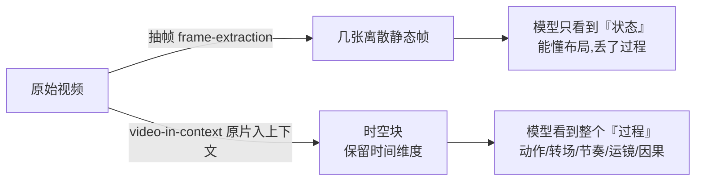
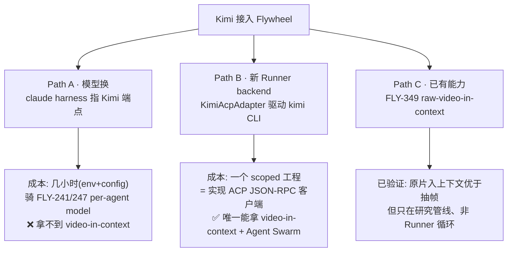

# Research: Kimi Code 视频深读 → 对 Flywheel 的启示 + Runner CLI 接入分析 — FLY-492

**Issue**: FLY-492（研究：Kimi Code 视频（小红书）→ 对 Flywheel 的启示 + Runner CLI 接入分析）
**Date**: 2026-06-22
**Source**: 小红书视频 [http://xhslink.com/o/82d1zl3LxFw](http://xhslink.com/o/82d1zl3LxFw)（作者「小天fotos」，标题《Codex要是抄一下这个功能就好了！》，note `6a33bf2f0000000017029460`）+ Kimi Code 官方文档/GitHub + Flywheel Runner 架构审计
**Method**: yt-dlp（FLY-349 引擎 cookie 法）拉原片 → Gemini File API（gemini-2.5-pro）原生视频多模态深读（整段视频入上下文，非抽帧）+ Kimi Code 文档/GitHub 三处取证 + 本仓 `packages/claude-runner`、`packages/agent-team-transport` 接入面审计

---

## 0. 这是什么视频

一条约 2 分钟的小红书技术解说短视频。作者用 **Kimi Code CLI** 演示了「从一段视频直接生成可运行的代码 / 重制视频」的端到端能力，主张 Kimi Code 有一个 Codex 现在没有的关键功能——**把整段原始视频放进 agent 的上下文**，而不是把视频抽成几张静态帧再喂给模型。

作者 caption 原话：「把视频的原始内容放入上下文，而不是抽帧。Codex 应该认真考虑改一下这个了。」话题标签：`#codex #kimicode #KimiK27Code #hyperframe #remotion #AI剪辑 #多模态`。

> 这不是一条「Kimi Code 是又一个 coding CLI」的泛泛介绍，而是一条**聚焦单点能力差异**（video-in-context）的深度解说。这是它对 Flywheel 真正有价值的地方。

---

## 1. 视频深读：演示了什么

### 1.1 三个端到端 demo

| # | 输入 | 指令 | 产物 | 关键观察 |
|---|------|------|------|---------|
| 1 | 一段 `game_demo.mp4`（基于 Claude Fable 5 做的 2D 俯视角对战游戏录屏） | 「读取 game_demo.mp4 完整复刻它」 | 可玩的 HTML5 Canvas 游戏 | 不只复刻界面（角色选择/地图），还实现了核心玩法（WASD 移动、鼠标射击、喷涂占地、拾道具） |
| 2 | 一段「中国功夫」网页粒子动画的录屏 | 「让它 1:1 的复刻」 | 几乎完全一致的网页动画 | 甚至把作者录屏时**不小心录进去的视频播放器控件**（进度条/播放键）也一起复刻了——说明它是在「看画面」而非「读源码」 |
| 3 | 一段 SpaceX IPO 财经解说视频（含复杂叙事逻辑 + 运镜动画） | 让 Kimi Code 和 Codex 分别理解视频、用视频框架 **HyperFrame** 重制一个解说视频 | 两版对比 | **Codex 版**：被评「硬生生做成了 PPT」，丢了镜头语言和动态；**Kimi Code 版**：还原叙事 + **模拟出了摄像机运镜**（平移/缩放/转场） |

### 1.2 视频里展示的 Kimi Code 能力

- **原生多模态输入**：终端里直接读 `.mp4` / 图片，日志可见 `Used ReadMediaFile`、`Used Write`。
- **透明执行日志**：TUI 清晰展示 agent 思考链和每步工具调用。
- **Agent Swarm（智能体蜂群）**：复杂任务自动分解给子 agent（如一个建 SVG、一个管图片美学、一个调 HyperFrame 渲染）并协同调度。
- **多轮迭代精修**：一次会话里同时给「原始视频」和「初版成品视频」让 agent 对比、精修——这是抽帧方案难做到的。
- **可扩展架构**：作者读源码发现可接入其它模型（含本地 Qwen），并预留了音频类型处理接口。

---

## 2. Kimi Code 是什么（官方取证）

| 维度 | 事实 |
|------|------|
| 形态 | **Kimi Code CLI**——TypeScript 写的终端 coding agent（GitHub `MoonshotAI/kimi-code`），定位同 Claude Code / Codex CLI |
| 模型 | **Kimi K2.7-Code**（2026-06-12 发布，开源 HuggingFace、Modified MIT），长程 coding + agent 优化，比 K2.6 省 30% reasoning token；视频对应的是 `#KimiK27Code` |
| 视频能力底座 | 推断为 **MoonViT-3D**（Kimi 多模态视觉编码器）——把连续帧编码成「时空块」保留时间维度 |
| 安装 | `curl ... install.sh \| bash` / `brew install kimi-code` / Windows PowerShell；二进制分发不需 Node，开发需 Node ≥ 24.15、pnpm 10.33 |
| API 兼容 | **官方 API 同时兼容 OpenAI 与 Anthropic 协议**：`https://api.kimi.com/coding/v1`（OpenAI）、`https://api.kimi.com/coding/`（Anthropic） |
| 子能力 | 内置 `coder`/`explore`/`plan` 子 agent；`/mcp-config` 会话式配 MCP；lifecycle hooks；`kimi acp`（Agent Client Protocol，供 Zed/JetBrains 等驱动） |
| Headless | 概览/CLI 文档**未提供** `claude --print` 式的「单次跑完即退」无人值守模式；但 `kimi acp` 提供了等价的程序化驱动面（见 §4） |

---

## 3. 核心洞察：video-in-context vs 抽帧

这是整条视频的「眼」，也是对 Flywheel 唯一真正重要的技术点。

- **抽帧**：把视频当成几张孤立关键帧图片。能理解界面布局，但丢了帧与帧之间的**连续变化**——动作、速度、节奏、转场时机、因果关系。
- **video-in-context**：把连续帧编码成保留「时间」维度的时空块。模型看到的是连贯的「过程」，所以能复现运镜、动画节奏、转场——demo 3 的差距就来自这里。

作者原话（逐字，最多 8 条）：
1. 「在视频理解这个多模态场景，很可能你用的 Coding Agent 一直都是残血。」
2. 「所有搭配了 Kimi Code 的多模态模型都不是残血。」
3. 「（Kimi Code）明确的把视频放进了上下文，放进了 Agent 循环中。」
4. 「抽帧看到的是**状态**，但视频的上下文看到的是整个**过程**。」
5. 「动作、转场、节奏、速度、因果关系，都（存）在图和图之间。」
6. 「Codex 硬生生是给做成了 PPT。」
7. 「Kimi Code 的版本……它模拟出了摄像机运镜的效果。」
8. 「谁最先理解模型厂的技术路线，谁最先在新能力上跑通整个工作流，谁就能在新一轮的模型和工具的迭代里，最早拿到红利。」

---

## 4. Runner CLI 接入分析（核心交付）

### 4.1 Flywheel 现状（接入面审计）

- 生产 Runner 经 tmux 起 `claude` CLI；headless 路径是 `ClaudeCodeRunner` / `ClaudeCodeAdapter`，写死 spawn `claude --print --output-format json`，用 Claude 专属 flag（`--max-turns`/`--resume`/`--allowedTools`/`--model`/`--permission-mode`/`--append-system-prompt`）。
- **但 Runner 后端不是死锁在 Claude**：已有 `IAgentRunner` 抽象 + `packages/agent-team-transport/src/codex/CodexAdapter.ts`（FLY-123/224 起的 vendor-pluggable 通路，`roles: → backend` 映射，`ExecutorBackend` 如 `codex-tmux`）。**「再加一个 CLI 后端」是这套抽象本来就为之设计的形状**，不是从零造。
- Flywheel 还**已经在做** Kimi 倡导的事：FLY-349 小红书引擎把整段 `video.mp4` 直接喂 Gemini File API 做原生视频理解（本研究就是用它读的这条视频）——只是用在「研究/分析」管线，不在 coding Runner 循环里。

### 4.2 三条接入路径

| | **Path A — 模型换** | **Path B — 新 Runner backend** | **Path C — 已有 FLY-349 能力** |
|---|---|---|---|
| 做法 | 保留现有 `claude --print` Runner，把 Claude Code 指向 Kimi 的 **Anthropic-兼容端点**（`ANTHROPIC_BASE_URL=https://api.kimi.com/coding/` + `ANTHROPIC_AUTH_TOKEN=<kimi key>` + `--model` 选 K2.7-Code） | 写 `KimiAcpAdapter` 实现 `IAgentRunner`，经 **`kimi acp`（JSON-RPC over stdio）** 程序化驱动 Kimi Code CLI——和现有 `CodexAdapter` 驱动 Codex app-server 同构 | Flywheel 自有的 Gemini 多模态管线（已在 FLY-349 跑通） |
| 成本 | **几小时**：env + 现成 per-agent model/backend 开关（FLY-241/247） | **一个 scoped 工程**：实现 ACP 客户端 + adapter，非配置改动 | 已存在；若要让 Runner「动手」处理视频，需给现有 Runner 加 Gemini-backed `ReadMediaFile` 式工具（自研） |
| 拿到 video-in-context？ | **❌ 拿不到**——Claude harness 不会把原始视频文件传给模型，只拿到 Kimi 模型的文本/代码推理 | **✅ 唯一能拿**——`ReadMediaFile` + 那个 agent 循环正是视频里 demo 的东西 | 部分——证明了原理，但在分析管线、非编码 Runner |
| Headless 可行性 | 现成（Claude Code 本就支持自定义 base URL） | **可行，非死路**：`kimi acp` 是干净的无人值守接口（`initialize`/`session/new`/`session/prompt`/流式 `tool_call`+完成信号），暴露 12 个稳定 agent 方法中的 10 个 | N/A |
| 限制 | 拿的是「Kimi 这个模型」，不是「视频里那个功能」 | ACP 限制：终端 reverse-RPC 未接（shell 命令本地执行——对 Flywheel 的 worktree Runner **反而合适**）；不支持音频；`session/close` 未实现 | 不是 Runner |
| 价值 | 厂商多样性 / 韧性 / 成本（同 Codex-当-Lead 的逻辑） | agent-agnostic Runner backend 战略的旗舰；解锁视频驱动工作流 | 记一笔：原片入上下文优于抽帧，已在内部验证 |

> **诚实更正一条**：「Path B 被 headless 卡死」这个说法不准确。概览文档没提 headless，但 ACP 参考页确认 `kimi acp` 就是一个 JSON-RPC/stdio 的无人值守驱动面。所以 Path B 不是「不可能」，而是「**可行，但要写一个 ACP 客户端 adapter（真工程，不是配置）**」。这恰好让 A vs B 的取舍更清楚：A = 便宜配置拿 Kimi 模型；B = 投工程拿那个独一份的视频能力。

---

## 5. 对 Flywheel 的启示

1. **video-in-context 是 Kimi 的真 USP，但不在 Flywheel 当前主线上**。Flywheel 主线是「Linear issue → 改纯文本代码库 → PR」，Runner 不处理视频输入。所以这个能力「很酷但当前非关键路径」。
2. **agent-agnostic Runner backend 的抽象已经在那了**（CodexAdapter 已证明）。加 Kimi 是「沿已铺的路再走一步」，不是新基建——这降低了 Path B 的真实成本评估。
3. **Flywheel 已经默默在用 Kimi 倡导的「原片入上下文」**（FLY-349 引擎）。如果未来 Runner 真要「动手」处理视频（录屏复刻 UI、视觉 QA），现有 Claude Runner 会是「残血」，那时的解法要么 Path B（Kimi Code），要么给现有 Runner 加 Gemini-backed 视频工具。
4. **「谁最先跑通新能力工作流谁拿红利」**这条作者的元观点，正好是 Flywheel 把 Lead/Runner 做成 vendor-pluggable 的同一条逻辑（FLY-224 Codex-当-Lead、FLY-241/247 per-agent 模型）——保持「换后端只是配置」的能力本身就是在为这种红利留接口。

---

## 6. 推荐 + 待 Annie 决策

**研究结论（informs FLY-494）**：
- **先做 Path A**：把 Kimi K2.7-Code 接成一个**可选 Runner 模型**，骑 FLY-241/247 现成的 per-agent model/backend 开关——低成本、立刻拿到厂商多样性 / 成本 / 韧性收益。这是「Kimi Code 集成 issue（FLY-494）」最稳的第一步。
- **Path B 待真实视频驱动工作流**：完整 `KimiCodeAdapter`（ACP）只在出现具体用例（录屏→UI 复刻 / 视觉 QA）或作为「agent-agnostic Runner CLI backends」战略旗舰时才值得投。**现在别深挖**——记为 backled spike，前置 = 一个真实用例 + headless/ACP 工程评估。
- **Path C 记一笔**：原片入上下文 > 抽帧，已在 FLY-349 内部验证；任何未来的「视频感知 Runner 工具」设计都该复用这条结论。

**但这是给 Annie 的取舍，不是替她拍板**（Tadashi 明确）：Annie 的 vision 是 agent-agnostic CLI backends（偏 Path B）。所以 HTML/scoping 要把三路 + Path B 的真实成本（可行、但要写 ACP adapter）+ video USP 都摆清楚，让她自己定 FLY-494 走 **A（便宜、拿 Kimi 模型）** 还是投 **B（完整 CLI、ACP 工程、拿视频能力）**。

---

## 7. CLAIMS vs INFERENCE（诚实分层）

**视频明确展示（Claims）**：
- Kimi Code CLI 能直接接收视频文件作输入；能从视频生成可玩 HTML5 游戏代码；复刻时能还原时间相关元素（动画节奏/镜头移动）而 Codex 不能；内置 Agent Swarm 并在 TUI 展示工作流。

**官方文档证实（Facts）**：
- Kimi Code = TS CLI（MoonshotAI/kimi-code，MIT）；K2.7-Code 开源；API 同时兼容 OpenAI/Anthropic 协议；`kimi acp` = JSON-RPC/stdio 无人值守驱动面（10/12 稳定方法）；凭据从 `config.toml` 读，**不支持** shell 注入的 `ANTHROPIC_AUTH_TOKEN`（这影响的是「配 Kimi Code 自己」，不影响 Path A「配 Claude Code 指向 Kimi 端点」）。

**我的推断（Inferences）**：
- 「视频被放入上下文」是作者基于 Kimi 技术路线（MoonViT-3D）+ 产品表现的解释，非 Kimi Code 直接日志；「剪辑叙事经验知识库」是作者提的商机假设，非已实现功能；接本地 Qwen「要改点代码」暗示开放性但视频未实演。
- Path A 是 Claude Code 的既有能力（自定义 base URL 跑第三方 Anthropic-兼容模型），非 Kimi 特性；它**不会**带来 video-in-context，因为 Claude harness 没有把原始视频喂模型的工具路径。

---

## 8. 附录：参考

- 视频：[http://xhslink.com/o/82d1zl3LxFw](http://xhslink.com/o/82d1zl3LxFw) → note `6a33bf2f0000000017029460`
- GitHub: [MoonshotAI/kimi-code](https://github.com/MoonshotAI/kimi-code)
- Kimi Code 官网/文档: [kimi.com/code](https://www.kimi.com/code) · env-vars · `kimi acp` 参考
- K2.7-Code: [kimi.com/resources/kimi-k2-7-code](https://www.kimi.com/resources/kimi-k2-7-code) · [HuggingFace moonshotai/Kimi-K2.6](https://huggingface.co/moonshotai/Kimi-K2.6)
- Flywheel 接入面：`packages/claude-runner/src/ClaudeCodeAdapter.ts`、`packages/agent-team-transport/src/codex/CodexAdapter.ts`、`packages/config/src/types.ts`（`ExecutorBackend` / `roles:→backend`）
- 相关 issue：FLY-494（Kimi Code 集成，本研究 informs）、task#37 agent-agnostic Runner CLI backends（FLY-492/493/494）、FLY-241/247（per-agent model/backend 开关）、FLY-224（vendor-pluggable Lead）、FLY-349（小红书多模态引擎）
