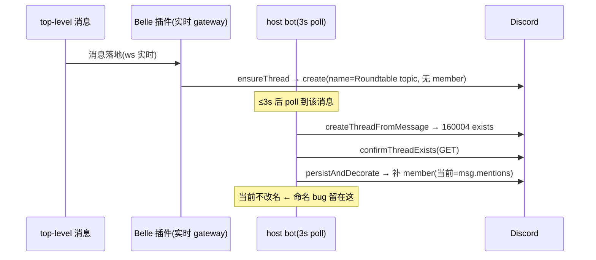

# Research: Roundtable 自动 thread 成员资格 / surfacing / 命名 — FLY-576

**Issue**: FLY-576 ([roundtable] 自动开的 thread 没把参与者加成 thread 成员 → 不进 sidebar + 回复不 surface + 通用命名)
**Date**: 2026-06-25
**Source**: Annie 2026-06-25 在 FLY-574 live-verify 时观察(两症状、同一根因);Lead 设计方向(A 主 + B 纪律 + 命名)

---

## 1. 调查范围

弄清 #leads-roundtable 自动 thread **在哪建、谁建、为什么没成员 / 命名通用**。两条候选建 thread 路径(issue 都点名了):

1. **FLY-314 host bot** — `RoundtableThreadManager`(Bridge 侧中心 poller)
2. **Belle 插件** — `ensureRoundtableThread`(Claude Lead 的 Discord 插件 fork)

---

## 2. 两条路径的代码事实(已读源码)

### Path 1 — Bridge host bot `RoundtableThreadManager`

`packages/teamlead/src/bridge/roundtable/RoundtableThreadManager.ts`

- 由 `plugin.ts` 在 Bridge 启动时构造(`loadRoundtableConfig` 返回非 undefined 才建),默认 OFF。
- `any_top_level` 模式下,对 #leads-roundtable 里**每条** top-level 消息都尝试建 thread(3s 一 poll)。
- **已经加 member**:`persistAndDecorate()` 构造 `members = new Set([...memberUserIds, ...msg.mentions])`,过滤掉 bot 自己,然后 `decorateThread()` 逐个 `addThreadMember()`(PUT `/channels/{thread}/thread-members/{userId}`)。
- **命名**:`threadName(content)` = content 去空白截断 80 字,空则 fallback `"Roundtable topic"`。
- **recovery 路径**:自建撞 Discord code 160004(thread 已存在,即别人先建了)→ `confirmThreadExists()` GET 确认 → `persistAndDecorate(skipSeed:true)` → **仍然补加 member**,但**不改名**。

### Path 2 — Belle 插件 `ensureRoundtableThread`

`~/.flywheel/repos/claude-plugins-official/external_plugins/discord/server.ts`(独立 repo,非本仓)

- Belle 这类 companion Claude Lead 的实时 Discord gateway。top-level 消息进来时,把 agent 的 reply 重定向进 topic thread(thread id == source message id),建/确认 thread 用 `ensureRoundtableThread()`。
- **硬编码命名**:`body: { name: 'Roundtable topic', ... }`(永远通用)。
- **完全不加 member**:只 create-or-confirm,bot 靠 send 隐式成为自己的 member;founder + 被 @ 的 lead 一个都不加。
- **token-isolated**:companion daemon `unset` 所有 Flywheel env(安全墙:自己 bot token、不污染 Flywheel token),只能读 benign `~/.flywheel/roundtable.json`(FLY-569,结构上**只允许 channelId**、丢弃其它字段)→ **插件拿不到 founder id**。

---

## 3. 生产配置(已查 `~/.flywheel/.env`)

```
FLYWHEEL_ROUNDTABLE_ENABLED=1                 # host bot 启用
FLYWHEEL_ROUNDTABLE_CHANNEL_ID=1512578695468941333   # #leads-roundtable
FLYWHEEL_ROUNDTABLE_BOT_TOKEN_ENV=CASS_BOT_TOKEN     # Aunt Cass = host bot
FLYWHEEL_ROUNDTABLE_BOT_USER_ID=1516205086890786917
FLYWHEEL_ROUNDTABLE_TRIGGER_MODE=any_top_level       # 每条 top-level 都建 thread
# FLYWHEEL_ROUNDTABLE_MEMBER_USER_IDS  —— 未设(= 空)
DISCORD_OWNER_USER_ID=1138241636057481306            # = Annie(founder)。issue thread 用它,已工作
```

关键:host bot **已启用**且 `any_top_level`,但 `MEMBER_USER_IDS` 空。

---

## 4. 根因(比 issue 假设更精确)

issue 假设「自动 thread 完全没加 member」。真相分两个独立缺口:

1. **founder 永不加**:host bot 只读 `FLYWHEEL_ROUNDTABLE_MEMBER_USER_IDS`(空),从不并入 founder。被 @ 的 lead 其实已经被加(`msg.mentions`)。→ Annie 不进自己 sidebar(=症状 2)。
2. **命名停在通用值**:Belle 插件是实时 gateway,通常**赢 create race**、硬编码 `Roundtable topic`;host bot 后续 poll 走 recovery(160004)只补 member、不改名 → 名字定格在 `Roundtable topic`(=命名症状)。

> 症状 1(回复不 surface):被 @ 的 lead 虽是 member,但 Belle 后续回复不逐条 @ 他们;真正没被 surface 的是 **founder + 没被 @ 的 lead**。核心仍是「该是 member 的人没成 member」。

### 时序(为什么 host bot 必然能纠正)



无论谁赢 race,host bot 在 ≤3s 内必处理该 top-level 消息并落到「补 member」分支。**所以最干净修复点 = host bot**:加 founder + 在 recovery 里补改名。

---

## 5. 对比范本 — issue thread 怎么做对的(`ChatThreadCreator`)

`packages/teamlead/src/bridge/ChatThreadCreator.ts` 是已工作的范本:

- **命名**:`buildIssueThreadName` = `[ISSUE-KEY] Title`;`maybeBackfillThreadName` GET 当前名 → 若是占位名(`isPlaceholderThreadName`)→ PATCH `/channels/{threadId}` 改成 desired 名。
- **founder 成员**:`ctx.ownerUserId`(来自 `DISCORD_OWNER_USER_ID`,config.ts:136)→ `addThreadMember`(幂等、reuse 时重加)。

FLY-576 host bot 修复直接镜像这两个机制。

---

## 6. 已有可复用件

| 件 | 位置 | 复用点 |
|---|---|---|
| `addThreadMember` | `bridge/chat-thread-utils.ts` | 已被 host bot 用,加 founder 不需新 HTTP 代码 |
| placeholder-rename 模式 | `ChatThreadCreator.maybeBackfillThreadName` | host bot recovery 改名照搬 GET→检测占位→PATCH |
| founder id 源 | `DISCORD_OWNER_USER_ID` env | issue thread 同源,已设已工作 |
| 测试 | `roundtable/__tests__/RoundtableThreadManager.test.ts`、`roundtable-config.test.ts` | 现成 suite,加 case |

---

## 7. 防 melee 的边界(Lead 强调)

「surfaced/知情」≠「每条都自动回」。本修复**只**:加 member + 改名。**完全不碰** reply-guard / `mention-gate` / `decideTopicThreadHandling` / autoContinue(保持 OFF)。成员收到消息=知情,回不回仍按现有 mention/relevance 判定 → 不引发 bot-to-bot melee(FLY-325 约束保持)。

---

## 8. scope 决策(Lead 已拍)

- **本 PR 只做 Bridge host bot**(infra 层、单次 Bridge 重启、不动生产 Belle 凭据)。
- 插件侧描述性命名 = **follow-up FLY-578**(Tier-3 fleet 重启 + 独立 repo + token-isolated 拿不到 founder id、边际收益小;host bot recovery 已纠正生产终态)。

---

## 9. 结论 → Plan

修复集中在 `RoundtableThreadManager` + `roundtable-config`:
1. member set 永远并入 founder(从 `DISCORD_OWNER_USER_ID` 解析,与 issue thread 同源)。
2. 自建用描述名(清 `<@id>` mention markup 的 content 摘要,fallback 通用)。
3. recovery 时镜像 `maybeBackfillThreadName`:占位名 → PATCH 描述名。
4. B 纪律:`cross-dept-channel-rules.md` 补一条「想让某人 surface/回你就 @ 他」。

字节兼容:feature 默认 OFF 路径不变;founder 解析失败(env 未设/格式错)→ 退回当前行为(只加 mentions),绝不 throw。
