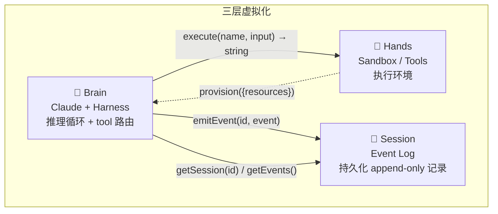
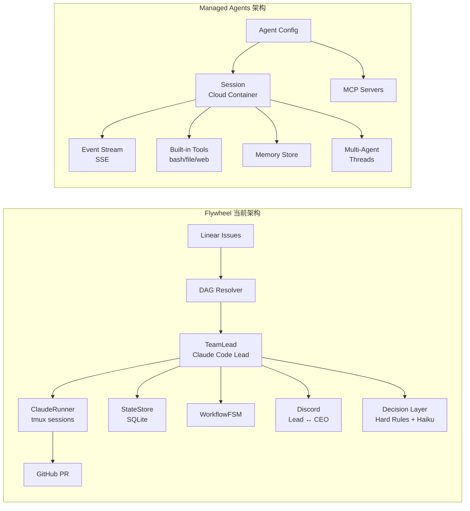
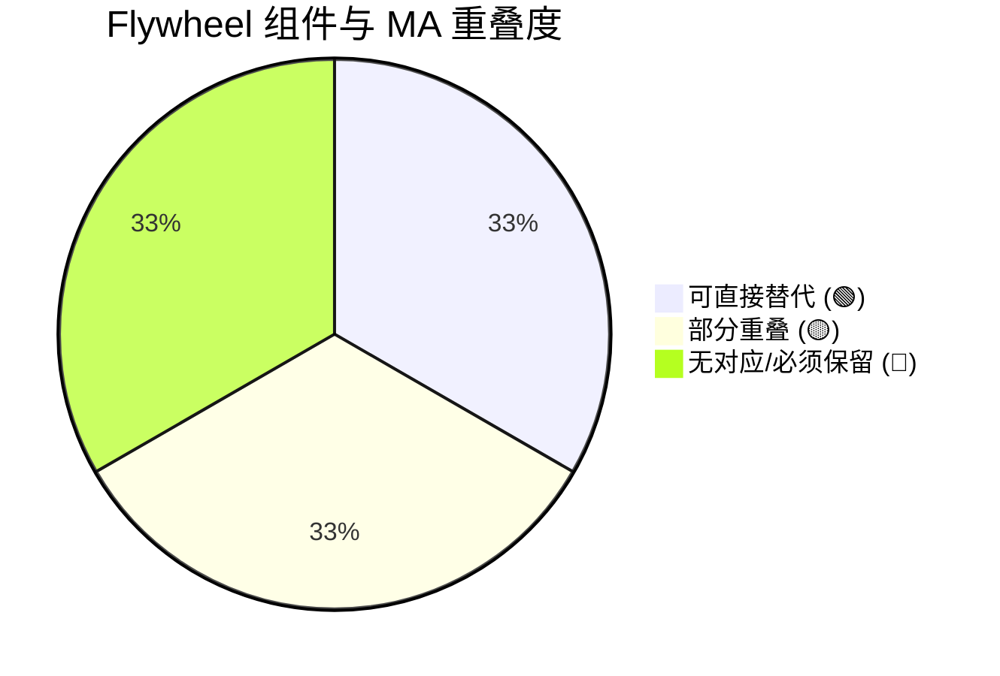
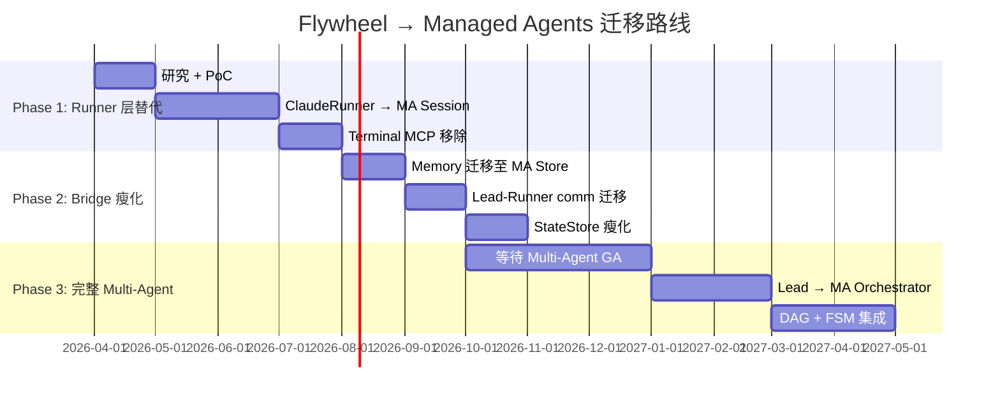
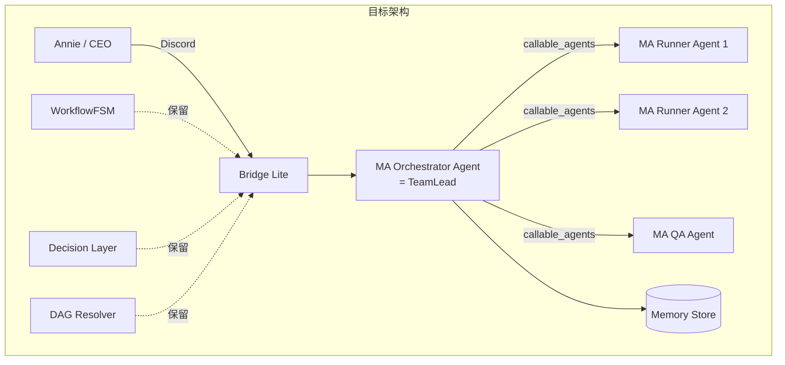
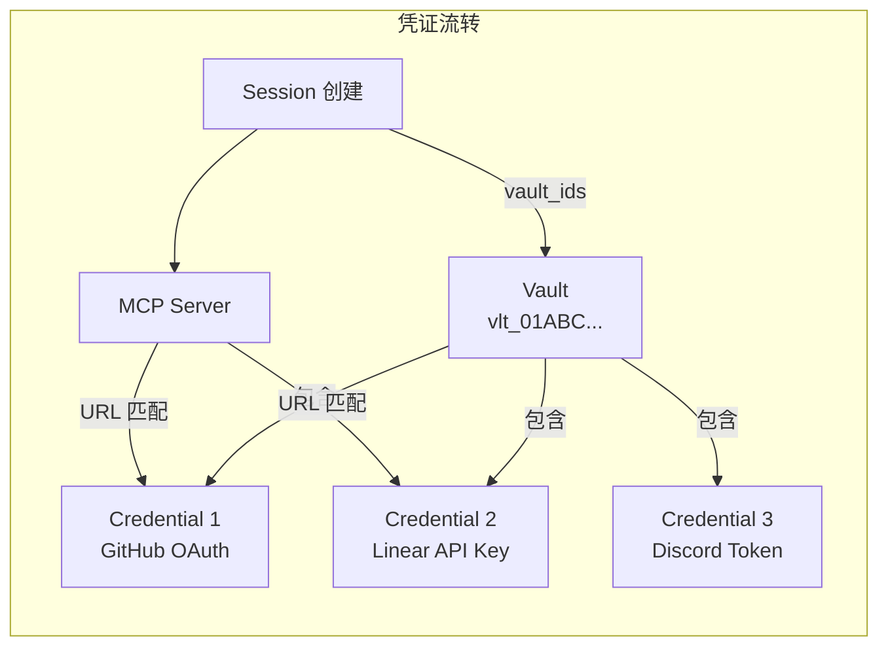
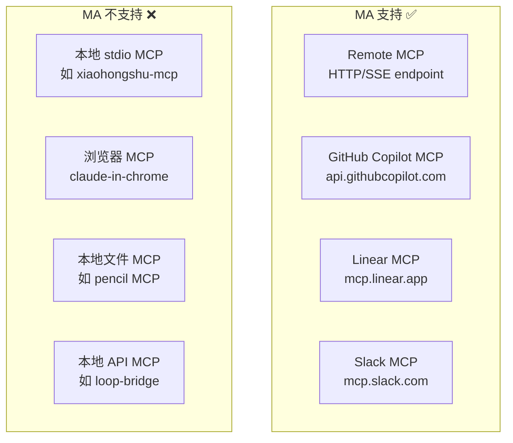
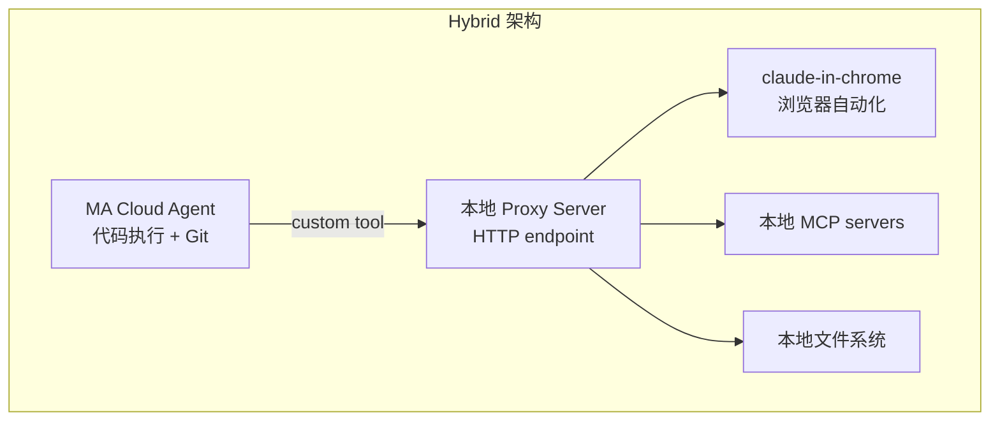

# Research: Anthropic Managed Agents — Flywheel 迁移评估 — FLY-82

**Issue**: FLY-82
**Date**: 2026-04-09
**Source**: Anthropic official docs + engineering blog

---

## 目录

1. [Managed Agents 架构详解](#1-managed-agents-架构详解)
2. [Flywheel 组件对照表](#2-flywheel-组件对照表)
3. [可替代 vs 必须保留](#3-可替代-vs-必须保留)
4. [迁移路径设计](#4-迁移路径设计)
5. [Multi-Agent Preview 评估](#5-multi-agent-preview-评估)
6. [Authentication & Secrets 机制](#6-authentication--secrets-机制)
7. [MCP 云端限制 & 本地 vs 云端 Gap](#7-mcp-云端限制--本地-vs-云端-gap)
8. [申请指南 & Quickstart](#8-申请指南--quickstart)
9. [风险 & 时间线](#9-风险--时间线)
10. [建议](#10-建议)

---

## 1. Managed Agents 架构详解

### 1.1 四层核心概念

| 概念 | 描述 |
|------|------|
| **Agent** | 可复用、版本化的配置：model + system prompt + tools + MCP servers + skills |
| **Environment** | 云端容器模板：预装 packages、网络规则、文件系统隔离 |
| **Session** | 运行中的 Agent 实例，绑定特定 Environment，生成输出 |
| **Event** | 应用与 Agent 之间的双向消息（user turns、tool results、status updates） |

### 1.2 三层虚拟化（核心设计哲学）

Anthropic 借鉴 OS 抽象理念，将 Agent 拆解为三个可独立替换的层：



**关键解耦：**

- **Brain 无状态**：harness 故障时，新 harness 通过 `wake(sessionId)` + `getSession(id)` 恢复，从最后记录的 event 续行
- **Hands 可替换**：容器 = cattle，不是 pets。失败时 harness 捕获错误、重新 provision
- **Session 持久化**：event log 独立于 Claude context window，支持 positional slicing、回放、恢复

**性能提升：**
- p50 TTFT 降低 ~60%
- p95 TTFT 降低 >90%
- 原因：容器按需 provision（通过 tool call），而非 session 启动时全量初始化

### 1.3 内置 Tools

| Tool | 名称 | 描述 |
|------|------|------|
| Bash | `bash` | 在 shell session 中执行命令 |
| Read | `read` | 读取文件 |
| Write | `write` | 写入文件 |
| Edit | `edit` | 字符串替换编辑文件 |
| Glob | `glob` | 文件模式匹配 |
| Grep | `grep` | 正则搜索 |
| Web Fetch | `web_fetch` | 抓取 URL 内容 |
| Web Search | `web_search` | 网络搜索 |

通过 `agent_toolset_20260401` 一键启用全部，可用 `configs` 数组逐个禁用或配置。

### 1.4 Custom Tools & MCP

- **Custom Tools**：类似 Messages API 的 client-executed tools，Claude 发出结构化请求 → 你的代码执行 → 结果回流
- **MCP Servers**：通过 `mcp_servers` 字段配置，标准化第三方工具接入
- **Credential Isolation**：生成的代码永远不接触凭证。Git repo 通过初始化时 clone，MCP 通过安全代理访问

### 1.5 Session 生命周期与事件系统

**Event 方向：**

| 方向 | Event 类型 |
|------|-----------|
| **User → Agent** | `user.message`, `user.interrupt`, `user.custom_tool_result`, `user.tool_confirmation`, `user.define_outcome` |
| **Agent → User** | `agent.message`, `agent.thinking`, `agent.tool_use`, `agent.tool_result`, `agent.mcp_tool_use`, `agent.custom_tool_use` |
| **Session 状态** | `session.status_running`, `session.status_idle`, `session.status_rescheduled`, `session.status_terminated`, `session.error` |
| **Observability** | `span.model_request_start`, `span.model_request_end` (含 token counts) |

**Session 流转：**
```
Create Session → Send user.message → session.status_running
  → agent.tool_use / agent.message → ... → session.status_idle
  → (Send another message or close)
```

**关键能力：**
- SSE streaming（Server-Sent Events）
- 中途 interrupt（`user.interrupt`）
- 自动 compaction（`agent.thread_context_compacted`）
- Event history 服务端持久化，可全量回溯

### 1.6 Environment 配置

- **Packages**：支持 apt, cargo, gem, go, npm, pip，session 间缓存
- **Networking**：`unrestricted`（默认）或 `limited`（白名单 `allowed_hosts`）
- **隔离**：每个 session 独立容器实例，不共享文件系统
- **生命周期**：Environment 持久存在直到 archive/delete

### 1.7 Memory Store（Research Preview）

- **Memory Store**：workspace-scoped 文本文档集合
- 每 session 可挂载最多 **8 个** memory store
- Agent 自动获得 `memory_list/search/read/write/edit/delete` 工具
- 支持版本审计（每次变更创建 immutable version）
- 支持 optimistic concurrency（`content_sha256` precondition）
- 单条 memory 上限 100KB

### 1.8 API 端点总览

| Resource | Endpoint | 关键操作 |
|----------|----------|---------|
| Agents | `POST /v1/agents` | create, update, list, archive |
| Environments | `POST /v1/environments` | create, update, list, archive, delete |
| Sessions | `POST /v1/sessions` | create, retrieve, list |
| Events | `POST /v1/sessions/:id/events` | send events |
| Stream | `GET /v1/sessions/:id/stream` | SSE stream |
| Threads | `GET /v1/sessions/:id/threads` | list, stream per-thread |
| Memory Stores | `POST /v1/memory_stores` | create, list, archive |
| Memories | `POST /v1/memory_stores/:id/memories` | write, read, update, delete |

**Beta Header**: `anthropic-beta: managed-agents-2026-04-01`（所有请求必须）

### 1.9 Rate Limits

| 操作 | 限制 |
|------|------|
| Create 端点 | 60 req/min |
| Read 端点 | 600 req/min |

Organization-level spend limits 和 tier-based rate limits 同样适用。

---

## 2. Flywheel 组件对照表

### 2.1 架构对比图



### 2.2 逐组件映射

| Flywheel 组件 | 功能 | MA 对应 | 重叠度 | 备注 |
|---------------|------|---------|--------|------|
| **ClaudeRunner** (tmux) | 运行 Claude Code CLI | **Session** (cloud container) | 🟢 **高** | MA 提供完整容器、内置 tools、crash recovery |
| **ClaudeAdapter** | Runner 抽象层 | **Agent** (config) | 🟢 **高** | Agent 定义 = model + prompt + tools |
| **StateStore** (SQLite) | Session 状态持久化 | **Event Log** + Session API | 🟡 **中** | MA event log 自带持久化，但 Flywheel 有自定义 FSM 状态 |
| **WorkflowFSM** | 状态机（待批准→运行中→完成） | ❌ **无对应** | 🔴 **低** | MA 没有业务级状态机，必须保留 |
| **TeamLead** daemon | Lead agent 持久进程 | **Agent** + **Session** (long-running) | 🟡 **中** | MA session 支持长时运行，但缺少 daemon 生命周期管理 |
| **Decision Layer** | Hard Rules + Haiku Triage | ❌ **无对应** | 🔴 **低** | 业务决策层，MA 不提供 |
| **Discord Plugin** | CEO ↔ Lead 通信 | ❌ **无对应** | 🔴 **低** | 通信总线，MA 不管前端 channel |
| **Linear Transport** | Issue → Agent 事件 | **Custom Tools** | 🟡 **中** | 可作为 custom tool 或 MCP 接入 |
| **DAG Resolver** | Issue 依赖排序 | ❌ **无对应** | 🔴 **低** | 调度逻辑，MA 不提供 |
| **Terminal MCP** | Lead 读写 Runner tmux | **内置 tools** (bash/read/write) | 🟢 **高** | MA container 自带文件操作 |
| **flywheel-comm** (inbox) | Lead ↔ Runner 通信 | **Multi-Agent Threads** | 🟡 **中** | MA thread 间消息传递可替代 file inbox |
| **Memory** (mem0/Gemini) | Lead 跨 session 记忆 | **Memory Store** | 🟢 **高** | MA 原生支持，且有版本审计 |

### 2.3 重叠度总结



---

## 3. 可替代 vs 必须保留

### 3.1 可替代组件（Phase 1 候选）

| 组件 | 当前实现 | MA 替代方案 | 迁移收益 |
|------|---------|------------|---------|
| **ClaudeRunner** | tmux + Claude Code CLI spawn | MA Session (cloud container) | 🎯 **最大收益**：消除 tmux 管理、crash recovery 内置、容器隔离 |
| **ClaudeAdapter** | IAdapter 抽象 → ClaudeRunner | MA Agent config | 简化代码，model/tools/prompt 声明式 |
| **Terminal MCP** | Lead→Runner tmux 读写 | MA 内置 bash/file tools | 不再需要 MCP 桥接 |
| **Memory** | mem0 + Gemini embeddings | MA Memory Store | 原生版本审计、optimistic concurrency |

### 3.2 部分可替代（需适配）

| 组件 | 保留什么 | 替代什么 |
|------|---------|---------|
| **StateStore** | 业务状态（FSM state, session metadata）| Session 持久化交给 MA event log |
| **flywheel-comm** | 如果有 multi-agent access 就替代 inbox | File inbox → MA thread messaging |
| **Linear Transport** | 事件监听保留 | 可作为 MA custom tool 暴露 |
| **TeamLead daemon** | daemon 生命周期管理保留 | Runner 管理部分交给 MA |

### 3.3 必须保留（MA 无法替代）

| 组件 | 原因 |
|------|------|
| **WorkflowFSM** | Flywheel 核心业务逻辑：issue 状态流转（pending→running→review→done），MA 没有业务级状态机 |
| **Decision Layer** | Hard Rules + Haiku Triage + 路由逻辑，属于 Flywheel 业务策略 |
| **Discord Plugin** | CEO 交互通道，MA 不管通信前端 |
| **DAG Resolver** | Issue 依赖排序是 Flywheel orchestrator 核心功能 |
| **Bridge API** | Discord ↔ Lead 桥接层，MA 没有 Discord 集成 |
| **Agent SDK hooks** | PostCompact、PostToolUse 等生命周期钩子（MA 有 event 但不等价） |

---

## 4. 迁移路径设计

### 4.1 渐进式三阶段迁移



### 4.2 Phase 1: Runner 层替代（最高优先级）

**目标**：用 MA Session 替代 `ClaudeRunner` + tmux spawn

**当前流程：**
```
TeamLead → spawn tmux session → ClaudeRunner(Claude Code CLI) → 监听输出 → 关闭 tmux
```

**迁移后：**
```
TeamLead → create MA Agent → create MA Session → send events via API → stream responses → session idle
```

**具体步骤：**

1. **创建 Flywheel Runner Agent**
   ```typescript
   const agent = await client.beta.agents.create({
     name: "Flywheel Runner",
     model: "claude-sonnet-4-6",
     system: "You are a Flywheel Runner. Execute the assigned task...",
     tools: [{ type: "agent_toolset_20260401" }],
   });
   ```

2. **创建 Environment**（预装 pnpm, git 等）
   ```typescript
   const env = await client.beta.environments.create({
     name: "flywheel-runner-env",
     config: {
       type: "cloud",
       packages: { npm: ["pnpm"], apt: ["git"] },
       networking: { type: "unrestricted" },
     },
   });
   ```

3. **替换 ClaudeAdapter.execute()**
   - `startSession()` → `client.beta.sessions.create()`
   - `sendMessage()` → `client.beta.sessions.events.send()`
   - `onOutput()` → SSE stream event handling
   - `stop()` → `user.interrupt` event

**收益：**
- 消除 tmux 进程管理（当前 ~500 行代码）
- 内置 crash recovery（MA harness 自动恢复）
- 容器隔离（不再共享本地文件系统）
- 内置 prompt caching + compaction

**风险：**
- Git repo access 方式变化（本地 clone → MA 容器内 clone）
- 现有 hook 系统（PostCompact, PostToolUse）需要用 MA event 替代
- CLAUDE.md / 项目配置文件需要注入到 MA 容器

### 4.3 Phase 2: Bridge 瘦化

**目标**：利用 MA Memory Store 和 Event 系统简化中间件

1. **Memory 迁移**：mem0 + Gemini → MA Memory Store
   - 每个 Lead 一个 memory store
   - 项目级 memory store（read-only，共享 conventions）
   - 支持最多 8 个 store/session

2. **Lead-Runner 通信**：file inbox → MA event 或 custom tool
   - 如果有 multi-agent access：直接用 thread messaging
   - 否则：通过 custom tool 桥接

3. **StateStore 瘦化**
   - Session 持久化部分交给 MA event log
   - 仅保留 FSM state、业务 metadata

### 4.4 Phase 3: 完整 Multi-Agent（依赖 GA）

**目标**：用 MA Multi-Agent 重构 Lead-Runner 关系



**MA Multi-Agent 如何映射 Flywheel：**
- TeamLead → Orchestrator Agent（callable_agents 配置）
- Runner → Called Agent（每个 task 一个 thread）
- Lead-Runner 通信 → `agent.thread_message_sent/received`
- 共享文件系统（同一容器内）

---

## 5. Multi-Agent Preview 评估

### 5.1 当前状态

| 特性 | 状态 | 申请方式 |
|------|------|---------|
| Core (Agent/Env/Session) | **Beta** (公开) | 默认启用所有 API 账户 |
| Multi-Agent | **Research Preview** | [申请表](https://claude.com/form/claude-managed-agents) |
| Memory Store | **Research Preview** | [申请表](https://claude.com/form/claude-managed-agents) |
| Outcomes | **Research Preview** | [申请表](https://claude.com/form/claude-managed-agents) |

### 5.2 Multi-Agent 技术细节

- **共享容器**：所有 agent 共享同一容器和文件系统
- **独立 context**：每个 agent 运行在独立 thread，有自己的对话历史
- **持久 thread**：coordinator 可以向之前调用的 agent 发送 follow-up
- **单层委托**：coordinator 可以调用 agent，但被调用的 agent **不能再调用**其他 agent
- **配置独立**：每个 agent 使用自己的 model、system prompt、tools
- **Event 类型**：`session.thread_created`, `session.thread_idle`, `agent.thread_message_sent/received`

### 5.3 对 Flywheel 的意义

**直接对应：**
- TeamLead = Orchestrator Agent
- Runner = Called Agent
- Lead 给 Runner 发任务 = `agent.thread_message_sent`
- Runner 完成汇报 = `session.thread_idle`

**限制：**
- **单层委托**：Runner 不能再委托 sub-agent（当前 Flywheel 也没有这个需求）
- **共享容器**：所有 agent 共享文件系统 — 对 Flywheel 是优势（Runner 改代码，QA 直接验证）
- **无 Discord 集成**：Lead ↔ CEO 通信仍需 Bridge

### 5.4 建议申请时间

**立即申请 Research Preview access**，理由：
1. 了解 multi-agent 真实延迟和稳定性
2. 验证 thread messaging 是否能替代 file inbox
3. 在 GA 前积累集成经验
4. Memory Store 对 Flywheel 有直接价值

---

## 6. Authentication & Secrets 机制

### 6.1 Vault 系统（MA 原生凭证管理）

MA 提供了完整的 **Vault** 凭证管理系统，这是 Flywheel 迁移的关键支撑：



**核心概念：**

| 概念 | 描述 |
|------|------|
| **Vault** | 凭证集合，对应一个 end-user。workspace-scoped |
| **Credential** | 绑定到特定 `mcp_server_url` 的认证信息 |
| **Session 引用** | 创建 session 时传 `vault_ids`，运行时自动匹配 |

**凭证类型：**

| 类型 | 用途 | 示例 |
|------|------|------|
| `mcp_oauth` | OAuth 2.0 服务 | Slack、GitHub Copilot MCP |
| `static_bearer` | 固定 API key / token | Linear API key、Discord bot token |

**关键特性：**
- **Credential Isolation**：生成的代码**永远不接触凭证**。token 存在 secure vault，通过代理注入
- **自动 Token Refresh**：OAuth 凭证支持 `refresh` 配置，Anthropic 自动刷新过期 token
- **Secret 只写不读**：`token`, `access_token`, `refresh_token`, `client_secret` 字段写入后不可读取
- **运行时热更新**：凭证在 session 运行中周期性重新解析，rotation 无需重启 session
- 每 vault 最多 **20 个 credential**
- 每个 `mcp_server_url` 每 vault **只能有一个** active credential

### 6.2 环境变量 / 直接设 API Keys？

**MA 当前不支持直接设置容器环境变量。** 所有外部服务认证必须通过以下路径之一：

| 方式 | 支持? | 说明 |
|------|-------|------|
| **Vault + MCP** | ✅ 推荐 | 凭证通过 Vault 注入 MCP server，agent 代码不接触 token |
| **Custom Tool** | ✅ 可行 | 你的后端执行 tool call，自己管理认证 |
| **容器环境变量** | ❌ 不支持 | Environment config 没有 env vars 字段 |
| **注入文件** | ⚠️ 间接 | Agent 可以通过 bash 写文件，但不是初始化时注入 |
| **System Prompt 含 token** | ❌ 不推荐 | 安全风险，token 暴露在 context 中 |

### 6.3 Flywheel 服务认证对照

| Flywheel 需要的服务 | 当前认证方式 | MA 迁移路径 |
|---------------------|-------------|-------------|
| **GitHub** | `GITHUB_TOKEN` 环境变量 | Vault + GitHub MCP (`api.githubcopilot.com/mcp/`) |
| **Linear** | `LINEAR_API_KEY` 环境变量 | Vault `static_bearer` + Linear MCP (`mcp.linear.app/mcp`) |
| **Discord** | Bot token 环境变量 | ⚠️ **无 Discord MCP** — 需保留 custom tool 或 Bridge |
| **Anthropic API** | `ANTHROPIC_API_KEY` | MA 自带，Agent 配置里已含 |
| **mem0 / Supabase** | 环境变量 | MA Memory Store 替代 mem0；Supabase 需 custom tool |

---

## 7. MCP 云端限制 & 本地 vs 云端 Gap

### 7.1 MCP Server 类型限制

**MA 只支持 Remote MCP Servers（HTTP endpoint）。** 本地 stdio MCP server 不受支持。



**技术要求：**
- MCP server 必须暴露 **HTTP endpoint**（streamable HTTP transport）
- 必须是 **公网可达** 或在 environment networking `allowed_hosts` 白名单中
- 认证通过 **Vault credential** 注入（绑定 `mcp_server_url`）

### 7.2 Flywheel 本地 MCP 影响评估

| 本地 MCP | 功能 | 能迁移? | 替代方案 |
|----------|------|---------|---------|
| **terminal-mcp** | Lead 读写 Runner tmux | ✅ 不需要 | MA 内置 bash/read/write 替代 |
| **inbox-mcp** | Lead-Runner file inbox | ✅ 可替代 | MA multi-agent thread messaging |
| **claude-in-chrome** | 浏览器自动化 | ❌ **无法迁移** | 保留本地，或用 MA web_fetch |
| **xiaohongshu-mcp** | 小红书操作 | ❌ **无法迁移** | 需要部署为 remote HTTP MCP |
| **loop-bridge** | Codex 通信 | ❌ **无法迁移** | 需要 custom tool 桥接 |
| **pencil** | 设计文件编辑 | ❌ **无法迁移** | 需要部署为 remote HTTP MCP |
| **serena** | 语义代码工具 | ❌ **无法迁移** | MA 内置 grep/glob 部分替代 |

### 7.3 本地 vs 云端能力差异

| 能力 | 本地 (当前) | 云端 (MA) | Gap |
|------|------------|-----------|-----|
| **浏览器自动化** | claude-in-chrome, Playwright | ❌ 不支持 | 🔴 严重 — QA/E2E 测试受影响 |
| **本地文件系统** | 直接访问 ~/Dev/* | 容器内隔离 | 🟡 需要 Git clone 或文件注入 |
| **本地网络服务** | localhost API, tmux | ❌ 不可达 | 🟡 需要 custom tool 桥接 |
| **Claude Code hooks** | PostCompact, PostToolUse | MA event stream | 🟡 功能相似但 API 不同 |
| **CLAUDE.md / 项目配置** | 自动加载 | 需要注入到容器 | 🟡 通过 system prompt 或文件写入 |
| **Git credentials** | 本地 ~/.gitconfig | Vault + MCP | 🟢 MA 原生支持 |
| **tmux session 管理** | 直接控制 | ❌ 不需要 | 🟢 MA 容器替代 |
| **资源限制** | 无限制 | 8GB RAM, 10GB disk | 🟡 足够大部分场景 |

### 7.4 Hybrid 模式可行性

**MA 没有官方 hybrid 模式**，但可以自建：



**实现方式：**
1. 本地跑一个 HTTP proxy server（暴露公网 endpoint，如通过 ngrok/cloudflare tunnel）
2. MA Agent 通过 custom tool 调用 proxy
3. Proxy 转发请求到本地 MCP servers

**评估：**
- 复杂度高，引入新的故障点
- 适合过渡期，不适合长期方案
- 更好的路径：将需要的 MCP server 部署为 remote HTTP 服务

---

## 8. 申请指南 & Quickstart

### 8.1 Access 层级

| 层级 | 需要什么 | 当前状态 |
|------|---------|---------|
| **Core Beta** (Agent/Env/Session) | API key + beta header | ✅ **所有 API 账户默认启用** |
| **Multi-Agent** | 申请 Research Preview | ⏳ 需申请 |
| **Memory Store** | 申请 Research Preview | ⏳ 需申请 |
| **Outcomes** | 申请 Research Preview | ⏳ 需申请 |

### 8.2 申请步骤

**Step 1: 确认 API key**
- 前往 [Anthropic Console](https://console.anthropic.com/settings/keys) 获取/确认 API key
- Core Beta 不需要额外申请，header `anthropic-beta: managed-agents-2026-04-01` 即可

**Step 2: 申请 Research Preview**
- 填写申请表：**https://claude.com/form/claude-managed-agents**
- 覆盖 multi-agent、memory、outcomes 三个 preview 功能
- 建议在申请理由中说明 Flywheel 的 multi-agent 场景

**Step 3: 安装 `ant` CLI**
```bash
# macOS (Homebrew)
brew install anthropics/tap/ant
xattr -d com.apple.quarantine "$(brew --prefix)/bin/ant"

# 验证安装
ant --version
```

**Step 4: 安装/更新 SDK**
```bash
# TypeScript (Flywheel 主要语言)
npm install @anthropic-ai/sdk

# Python (如果需要)
pip install anthropic
```

### 8.3 5 分钟 Quickstart（Annie 可以直接跑）

设好 API key 后，在终端依次执行：

```bash
# 0. 设置 API key
export ANTHROPIC_API_KEY="your-key-here"

# 1. 创建 Agent
AGENT_ID=$(curl -sS https://api.anthropic.com/v1/agents \
  -H "x-api-key: $ANTHROPIC_API_KEY" \
  -H "anthropic-version: 2023-06-01" \
  -H "anthropic-beta: managed-agents-2026-04-01" \
  -H "content-type: application/json" \
  -d '{
    "name": "Flywheel Test Agent",
    "model": "claude-sonnet-4-6",
    "system": "You are a helpful coding assistant.",
    "tools": [{"type": "agent_toolset_20260401"}]
  }' | jq -r '.id')
echo "Agent: $AGENT_ID"

# 2. 创建 Environment
ENV_ID=$(curl -sS https://api.anthropic.com/v1/environments \
  -H "x-api-key: $ANTHROPIC_API_KEY" \
  -H "anthropic-version: 2023-06-01" \
  -H "anthropic-beta: managed-agents-2026-04-01" \
  -H "content-type: application/json" \
  -d '{
    "name": "flywheel-test-env",
    "config": {"type": "cloud", "networking": {"type": "unrestricted"}}
  }' | jq -r '.id')
echo "Environment: $ENV_ID"

# 3. 创建 Session
SESSION_ID=$(curl -sS https://api.anthropic.com/v1/sessions \
  -H "x-api-key: $ANTHROPIC_API_KEY" \
  -H "anthropic-version: 2023-06-01" \
  -H "anthropic-beta: managed-agents-2026-04-01" \
  -H "content-type: application/json" \
  -d "{
    \"agent\": \"$AGENT_ID\",
    \"environment_id\": \"$ENV_ID\",
    \"title\": \"Quickstart test\"
  }" | jq -r '.id')
echo "Session: $SESSION_ID"

# 4. 发送消息
curl -sS "https://api.anthropic.com/v1/sessions/$SESSION_ID/events" \
  -H "x-api-key: $ANTHROPIC_API_KEY" \
  -H "anthropic-version: 2023-06-01" \
  -H "anthropic-beta: managed-agents-2026-04-01" \
  -H "content-type: application/json" \
  -d '{
    "events": [{
      "type": "user.message",
      "content": [{"type": "text", "text": "Write a Python script that prints Hello Flywheel and save it to hello.py, then run it."}]
    }]
  }'

# 5. 流式接收响应
curl -sS -N "https://api.anthropic.com/v1/sessions/$SESSION_ID/stream" \
  -H "x-api-key: $ANTHROPIC_API_KEY" \
  -H "anthropic-version: 2023-06-01" \
  -H "anthropic-beta: managed-agents-2026-04-01" \
  -H "Accept: text/event-stream" | while IFS= read -r line; do
    [[ $line == data:* ]] || continue
    json=${line#data: }
    type=$(echo "$json" | jq -r '.type')
    case $type in
      agent.message) echo "$json" | jq -j '.content[] | select(.type == "text") | .text' ;;
      agent.tool_use) printf '\n[Tool: %s]\n' "$(echo "$json" | jq -r '.name')" ;;
      session.status_idle) printf '\n✅ Done!\n'; break ;;
    esac
  done
```

### 8.4 用 `ant` CLI 更简单的版本

```bash
# 创建 Agent
ant beta:agents create \
  --name "Flywheel Test" \
  --model claude-sonnet-4-6 \
  --system "You are a helpful coding assistant." \
  --tool '{type: agent_toolset_20260401}'

# 创建 Environment
ant beta:environments create \
  --name "flywheel-test" \
  --config '{type: cloud, networking: {type: unrestricted}}'

# 创建 Session 并交互
ant beta:sessions create \
  --agent "$AGENT_ID" \
  --environment "$ENV_ID"
```

---

## 9. 风险 & 时间线

### 9.1 风险矩阵

| 风险 | 影响 | 概率 | 缓解方案 |
|------|------|------|---------|
| **Beta 稳定性不足** | Runner 任务中断 | 中 | Phase 1 先做 PoC，保留 tmux 回退路径 |
| **定价未公布** | 成本不可控 | 高 | 当前用 Claude subscription，MA 可能按 token 计费；需要成本模型对比 |
| **Multi-Agent GA 时间未知** | Phase 3 阻塞 | 中 | Phase 1-2 不依赖 multi-agent，可独立推进 |
| **Git repo access 方式变化** | 需要改 Runner clone 逻辑 | 低 | MA 支持 Git credential isolation |
| **Event log 无法完全替代 StateStore** | 仍需维护部分 SQLite | 低 | 只替代 session 持久化，保留 FSM state |
| **Hook 系统不等价** | PostCompact/PostToolUse 行为变化 | 中 | 用 MA event stream + custom tool 模拟 |
| **Rate Limit** | 60 create/min 可能不够批量 | 低 | 复用 Agent/Environment，只创建 Session |
| **容器冷启动延迟** | Runner 启动变慢 | 中 | MA 声称 TTFT 大幅改善；Environment 缓存包 |

### 9.2 时间线估算

| 阶段 | 前提条件 | 预计时间 |
|------|---------|---------|
| **Phase 1 PoC** | Beta access (已有) | 2-3 周 |
| **Phase 1 Production** | PoC 验证 + 定价明确 | 1-2 月 |
| **Phase 2** | Phase 1 完成 + Memory Preview access | 1-2 月 |
| **Phase 3** | Multi-Agent GA | 取决于 Anthropic 时间线（预计 2026 H2） |

---

## 10. 建议

### 10.1 短期行动（本周）

1. ✅ **申请 Research Preview access**（multi-agent + memory + outcomes）
2. ✅ **注册 `ant` CLI**（`brew install anthropics/tap/ant`）
3. ✅ **创建 PoC Agent**：用 MA 跑一个简单的 coding task，验证基本流程

### 10.2 中期行动（1-3 月）

4. **Phase 1 PoC**：在 worktree 中实现 `ManagedAgentAdapter`（实现 `IAdapter` 接口），替换 `ClaudeAdapter`
5. **定价评估**：一旦 Anthropic 公布 MA 定价，做 cost model 对比（当前 Claude subscription vs MA per-token）
6. **Memory Store PoC**：如果获得 access，测试 mem0 → MA Memory Store 迁移

### 10.3 长期行动（3-6 月）

7. **Phase 2 实施**：Memory 迁移 + Lead-Runner 通信简化
8. **Phase 3 设计**：Multi-Agent GA 后，设计 Lead-as-Orchestrator 架构
9. **Bridge 瘦化**：保留 Discord + Decision Layer + FSM，移除 tmux 管理代码

### 10.4 不建议做的

- ❌ **不要现在全面迁移**：Beta 稳定性和定价不确定
- ❌ **不要放弃 WorkflowFSM**：MA 没有业务级状态机
- ❌ **不要放弃 Discord 集成**：MA 没有通信前端
- ❌ **不要依赖 Multi-Agent GA 时间**：Phase 1-2 应独立于 Multi-Agent

---

## 附录 A: API 快速参考

```bash
# 安装 CLI
brew install anthropics/tap/ant

# 创建 Agent
ant beta:agents create \
  --name "Flywheel Runner" \
  --model claude-sonnet-4-6 \
  --system "..." \
  --tool '{type: agent_toolset_20260401}'

# 创建 Environment
ant beta:environments create \
  --name "flywheel-env" \
  --config '{type: cloud, networking: {type: unrestricted}}'

# 创建 Session
ant beta:sessions create \
  --agent "$AGENT_ID" \
  --environment "$ENV_ID"

# 发送消息
ant beta:sessions:events send \
  --session-id "$SESSION_ID" \
  --event '{type: user.message, content: [{type: text, text: "Hello"}]}'
```

## 附录 B: SDK 支持

| 语言 | 包 |
|------|------|
| Python | `anthropic` (pip) |
| TypeScript | `@anthropic-ai/sdk` (npm) |
| Go | `github.com/anthropics/anthropic-sdk-go` |
| Java | `com.anthropic:anthropic-java` |
| C# | `Anthropic` (NuGet) |
| Ruby | `anthropic` (gem) |
| PHP | `anthropic-ai/sdk` (composer) |
| CLI | `ant` (brew / curl / go install) |

## 附录 C: Flywheel 迁移检查表

- [ ] 申请 Research Preview (multi-agent, memory, outcomes)
- [ ] 安装 `ant` CLI
- [ ] 创建测试 Agent + Environment
- [ ] 运行 quickstart PoC
- [ ] 评估 container 冷启动延迟
- [ ] 测试 Git repo clone in MA container
- [ ] 实现 `ManagedAgentAdapter` (IAdapter)
- [ ] 成本模型对比（subscription vs MA pricing）
- [ ] Memory Store PoC（如果有 access）
- [ ] Multi-Agent PoC（如果有 access）
