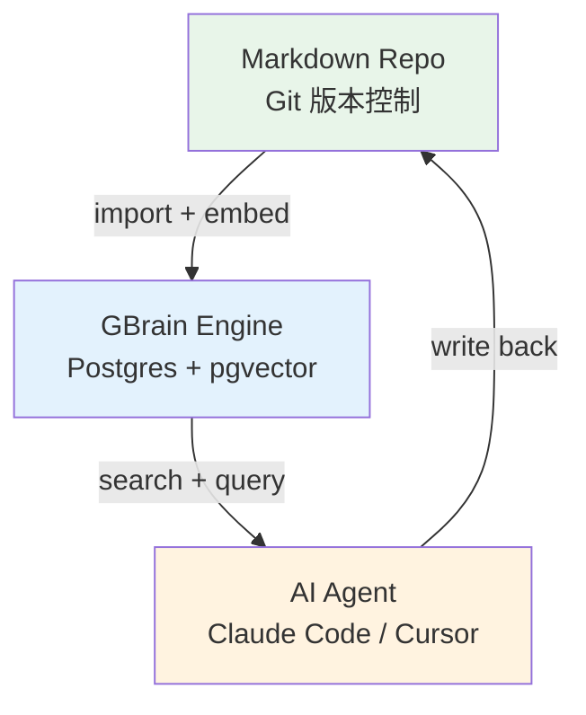
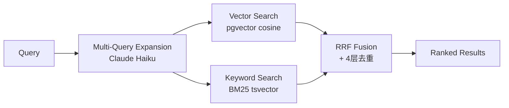
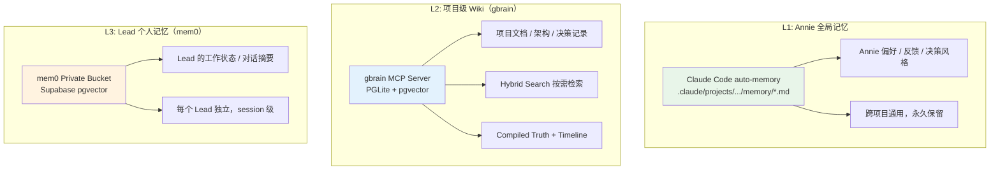
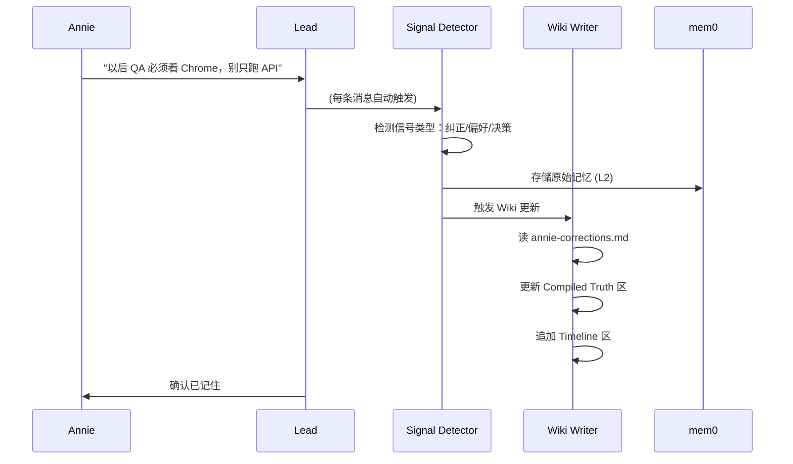

# Research: Lead Memory 方案研究 — gbrain + 社区参考

**Issue**: FLY-89
**Date**: 2026-04-12
**Source**: `doc/architecture/product-experience-spec.md` §3.2, FLY-72/FLY-32/FLY-33
**Status**: Complete

---

## 1. 研究背景

Lead Memory 是 Flywheel 的核心痛点之一。Lead 作为 24/7 运行的部门经理，需要在跨 session、context compact 后仍然"记住"：

- Annie 的决策偏好和行为 pattern
- 历史决策及其原因
- 项目上下文和进度
- 纠正记录（做错了什么、为什么、怎么改）

### 1.1 现有基础

| 能力 | 状态 | 说明 |
|------|------|------|
| mem0 dual-bucket | ✅ Deployed | Private + shared buckets, Supabase pgvector |
| CIPHER snapshot/recordOutcome | ✅ Deployed | 决策快照 + 结果记录 |
| CIPHER principle proposals | Infra Exists | 代码存在，学习闭环未完成 |
| PII/secret 过滤 | ❌ Gap | FLY-39 |
| MemPalace L0-L3 分层加载 | ✅ 研究完成 | 结论可用，见下文 |

### 1.2 Product Spec 对 Memory 的要求（§3.2）

1. **学习来源**：对话 + 观察行为（approve/reject/修改）+ Annie 主动教
2. **应用策略**：高信心 → 自动应用（告知 Annie）；低信心 → 先问
3. **纠正机制**：存储 决定 + Annie 的纠正 + 原因
4. **偏离检测**：当 Annie 行为跟以往 pattern 不一致时，主动问
5. **决策权渐进式扩展**：按场景逐步放权，需要解锁机制

### 1.3 关联 Issue

| Issue | 主题 | 状态 |
|-------|------|------|
| FLY-72 | LLM Wiki — Lead 知识复利 | Backlog |
| FLY-32 | Context Compact 策略 | Backlog |
| FLY-33 | Session Memory Extraction | Backlog |
| FLY-82 | Managed Agents Memory Store | 研究完成 |
| FLY-39 | PII/Secret 过滤 | Backlog |

---

## 2. gbrain 深度分析

### 2.1 项目概述

[gbrain](https://github.com/garrytan/gbrain) 是 Garry Tan（Y Combinator CEO）开发的 AI agent 知识管理系统。核心理念：**为 AI agent 构建持久化的、可搜索的"第二大脑"**。

| 维度 | 详情 |
|------|------|
| **作者** | Garry Tan (YC CEO) |
| **Tech Stack** | Bun + TypeScript |
| **存储** | PGLite（本地嵌入式 Postgres）或 Supabase（生产） |
| **向量** | pgvector (OpenAI text-embedding-3-large) |
| **检索** | Hybrid Search (Vector + BM25 + RRF) |
| **Agent 接口** | CLI / MCP Server（本地+远程） |
| **知识格式** | Markdown 文件（Git repo） |

### 2.2 核心架构：三层设计



**关键设计决策**：
- **Markdown 是 source of truth** — 人类可读、Git 版本控制、可直接编辑
- **数据库是索引层** — 提供搜索能力，但不是 primary store
- **Agent 是读写接口** — 每次交互都是一个 read-write loop，知识不断复利

### 2.3 知识组织："Compiled Truth + Timeline" 模式

这是 gbrain 最核心的设计 pattern：

```markdown
# Jane Doe

## Executive Summary
[当前综合状态 — 每次有新信息时重写]

## State
- Role: VP Engineering @ Acme
- Relationship: Close collaborator since 2024

## What They Believe
[观点立场，标注来源]

---
<!-- 分割线以下是 append-only timeline -->

### 2026-04-10 — Meeting at YC
Source: meeting transcript
[详细记录]

### 2026-04-05 — Email re: Series B
Source: email
[详细记录]
```

**分割线以上**：持续综合更新的"当前真相"（pre-computed synthesis）
**分割线以下**：只追加、不修改的时间线证据

**vs RAG 的关键区别**：RAG 每次查询都重新从原始数据推导答案；gbrain 的综合是预计算的，查询时直接读取已消化的结论。

### 2.4 MECE 目录分类

gbrain 使用 MECE（Mutually Exclusive, Collectively Exhaustive）分类：

```
brain/
├── RESOLVER.md          ← 决策树：新知识放哪个目录
├── people/              ← 一人一页
├── companies/           ← 一公司一页
├── projects/            ← 在做的事
├── ideas/               ← 想法
├── concepts/            ← 可复用的思维模型
├── meetings/            ← 会议记录 + 分析
├── inbox/               ← 未分类的暂存区
└── archive/             ← 历史/过期的页面
```

每个目录有 `README.md` 定义：什么属于这里、什么不属于。有歧义时放 `inbox/`。

### 2.5 检索机制：Hybrid Search



1. **Multi-Query Expansion**：用 Claude Haiku 把一个查询扩展成多个语义变体
2. **双路搜索**：Vector（语义相似度）+ BM25（关键词匹配）并行
3. **RRF (Reciprocal Rank Fusion)**：合并两路结果 + 去重
4. **Slug-based API**：用文件名 slug 作为稳定 ID，不依赖数据库 ID

### 2.6 Agent 交互模式：Brain-Agent Loop

gbrain 定义了 agent 的"操作纪律"：

| 纪律 | 说明 |
|------|------|
| **Brain-first lookup** | 回答问题前先查 brain，不直接猜 |
| **Entity detection** | 每条消息都自动检测实体（人/公司/项目） |
| **Sync-after-write** | 写入后确保索引同步 |
| **Dream cycle** | 安静时段（凌晨）做后台处理：丰富实体、修复引用、扫描对话 |
| **Signal detection** | 识别什么信息值得记录 |

**三层记忆模型**：

| 层 | 持久性 | 内容 |
|----|--------|------|
| **GBrain** | 永久 | 世界知识（人/公司/项目/概念） |
| **Agent Memory** | Session 级 | Agent 的工作状态 |
| **Session** | 临时 | 当前对话上下文 |

### 2.7 Enrichment Pipeline（知识丰富管线）

gbrain 的核心增长引擎 — 每个信号自动触发知识丰富：

| 信号源 | 处理方式 |
|--------|---------|
| 会议 | 转录 → 实体提取 → 更新所有相关人/公司页面 |
| 邮件 | Gmail → 实体匹配 → 追加到 timeline |
| 日历 | Google Calendar → 每日可搜索页面 |
| 社交 | X/Twitter 监控 → 删除检测 + 互动追踪 |
| 语音 | Twilio 电话 → 转录 → brain 索引 |

**优先级分层**：
- **Tier 1**（关键人物）：全管线、所有来源
- **Tier 2**（一般联系人）：Web + 社交 + brain 交叉引用
- **Tier 3**（偶然提及）：仅从当前来源提取

### 2.8 认知纪律（Epistemic Discipline）

gbrain 对高价值信息要求**来源标注**：

- `observed` — 亲眼观察到的
- `self-described` — 对方自己说的
- `inferred` — 从 pattern 推断的
- 信心度跟交互次数挂钩（1 次会议 = 低信心；5+ 次 = 高信心）
- **用户纠正 override 一切**（最高信心信号）

---

## 3. MemPalace 研究回顾

之前 FLY-82 研究中分析了 MemPalace（96.6% R@5 召回率）。核心借鉴点：

### 3.1 分层上下文加载（L0-L3）

| 层 | 内容 | Token 量 | 加载时机 |
|----|------|----------|----------|
| **L0** | 身份 + 核心规则 | ~50 | 永远加载 |
| **L1** | 高优先级记忆（最近决策、活跃偏好） | ~500 | 永远加载 |
| **L2** | 按需检索（历史决策、项目上下文） | 变动 | 语义搜索触发 |
| **L3** | 原始对话/文档 | 大 | 极少加载 |

### 3.2 元数据层级过滤

比纯语义搜索准确率提升 34%。关键维度：
- Issue ID / 项目
- 决策阶段（brainstorm / plan / implement / ship）
- 决策类型（偏好 / 纠正 / 方向 / 技术）

### 3.3 知识图谱 + 时间窗口

SPO（Subject-Predicate-Object）三元组 + `valid_from`/`valid_to`，支持查询历史某个时间点的状态。

---

## 4. Embedding Spike 验证

### 4.1 实验设置

在 `/tmp/gbrain-spike/` 下安装 gbrain（`bun add github:garrytan/gbrain`），以 Flywheel 项目目录作为知识源做实操验证。

| 维度 | 详情 |
|------|------|
| **安装方式** | `bun add github:garrytan/gbrain`（GitHub 直装，npm 上的 `gbrain` 是另一个 GPU ML 库） |
| **Embedding 模型** | OpenAI text-embedding-3-large, 1536 维 |
| **存储** | PGLite（本地嵌入式 Postgres） |
| **导入源** | Flywheel 项目 `doc/` 目录，279 个 Markdown 文件 |

### 4.2 导入与 Embedding 结果

```
Import: 279 files → 1301 chunks (2 秒)
Embedding: 279 pages, 1301 chunks → OpenAI text-embedding-3-large (约 $0.05)
```

### 4.3 中文搜索验证

**关键修正**：初始测试仅使用 BM25 关键词搜索（未配置 OpenAI key），中文查询得分为 0。配置 embedding 后，中文语义搜索**完全可用**。

OpenAI text-embedding-3-large 是多语言模型，原生支持中文。

| 查询 | BM25 Only（无 embedding） | Hybrid Search（含 embedding） |
|------|--------------------------|-------------------------------|
| "Annie 的偏好" | score 0.00, 无有效结果 | ✅ 命中 product-experience-spec、decision patterns 等 |
| "Forum 更新问题" | "No results" | ✅ 7 篇相关文档（forum thread、stale cleanup 等） |
| "Lead 记忆系统" | score 0.00 | ✅ 精准命中 context window research、mem0 plan、Claude Code 分析 |

### 4.4 验证结论

1. **gbrain 开箱即用**：作为项目 Wiki 搜索引擎，导入 + embedding + 搜索全链路通畅
2. **中文搜索无障碍**：embedding 模型支持多语言，BM25 关键词搜索不支持中文但 hybrid search 中 vector 路径完全弥补
3. **成本极低**：279 文件 embedding 约 $0.05，日常增量更新成本可忽略
4. **无需 fork**：gbrain 原版足以满足 L2 项目 Wiki 需求，配置 OpenAI key 即可

---

## 5. 对比分析：gbrain vs Flywheel 现有方案

### 5.1 架构对比

| 维度 | gbrain | Flywheel 现状 | 差距 |
|------|--------|--------------|------|
| **存储格式** | Markdown 文件 (Git) | mem0 向量数据库 (Supabase pgvector) | gbrain 可人类编辑 |
| **知识组织** | MECE 目录 + Compiled Truth + Timeline | 无结构化组织 | **核心差距** |
| **检索** | Hybrid (Vector + BM25 + RRF) | 纯语义搜索 (mem0) | 缺关键词搜索 |
| **写入触发** | 每条消息自动实体检测 + enrichment | 手动 / prompt 触发 | **核心差距** |
| **综合能力** | Pre-computed synthesis（分割线模式） | 无综合层 | **核心差距** |
| **来源标注** | observed / self-described / inferred | 无 | 需要补充 |
| **Agent 接口** | MCP Server (30 tools) | Bridge REST API (search/add) | 功能足够 |
| **后台处理** | Dream cycle (cron) | 无 | 值得借鉴 |

### 5.2 关键洞察

**gbrain 做对了什么：**

1. **Pre-computed synthesis** — 不是每次查询都重新推导，而是写入时就综合好。Lead 查询 "Annie 对 PR review 的偏好是什么" 时，直接读到已消化的结论，不需要从 100 条原始记忆中推导。

2. **Markdown 可编辑性** — Annie 可以直接编辑 Lead 的知识库，纠正错误认知。这比通过 API 修改向量数据库直观得多。

3. **自动 enrichment** — 知识增长是交互的副产品，不需要额外操作。每条对话都触发"这条信息跟哪些已知实体相关？要不要更新？"

4. **认知纪律** — 区分"我观察到"vs"她说的"vs"我推断的"，防止 hallucination 变成"记忆"。

**gbrain 不适合 Flywheel 的地方：**

1. **规模不同** — gbrain 面向个人（Garry Tan 一个人的社交/商业关系网）；Flywheel Lead 面向的是项目管理 + 决策偏好，实体类型更窄但交互频率更高。

2. **MECE 目录过重** — 20+ 个目录分类对 Lead 来说 overkill。Lead 不需要 `civic/`、`household/`、`hiring/` 等目录。

3. **文件系统 vs API** — gbrain 依赖独立的 brain repo + git sync。Flywheel Lead 已有 mem0 API，增加一个 markdown repo 会带来同步复杂性。

4. **Enrichment 来源不同** — gbrain 丰富信号来自 email/calendar/social；Lead 的信号来源主要是 Discord 对话和 Runner 报告。

---

## 6. 适配方案建议

### 6.1 方案概述：三层知识管理架构

基于 gbrain spike 验证和 Annie 的分层需求，提出**三层知识管理架构**：



**三层分工**：

| 层 | 系统 | 内容 | 持久性 | 读写方 |
|----|------|------|--------|--------|
| **L1** | Claude Code auto-memory (.md) | Annie 全局偏好、反馈、决策风格 | 永久 | Annie + Claude Code |
| **L2** | gbrain (MCP Server) | 项目文档、架构决策、技术 Wiki | 永久 | Lead + Runner 读，系统写 |
| **L3** | mem0 (Private Bucket) | Lead 工作状态、对话摘要、临时记忆 | Session 级 | Lead 自行读写 |

**关键洞察**：L1 已经存在（就是 Claude Code 的 auto-memory 系统）。L3 也已部署（mem0 dual-bucket）。**真正缺失的是 L2 — 项目级知识 Wiki**，这正是 gbrain 填补的位置。

### 6.2 借鉴 Pattern 1: Compiled Truth Pages

**核心思路**：为 Lead 最常需要的知识维度维护"已消化的 wiki 页面"。

**建议的 Lead Wiki 结构**（大幅简化 gbrain 的 MECE）：

```
.flywheel/wiki/                      # 或 Lead workspace 目录下
├── annie-preferences.md             # Annie 的决策偏好（最核心）
├── annie-corrections.md             # Annie 的纠正记录
├── project-context.md               # 项目当前状态和关键信息
├── workflow-patterns.md             # 已验证的工作流 pattern
└── decisions-log.md                 # 重要决策记录（Compiled Truth + Timeline）
```

每页采用 gbrain 的"分割线"模式：

```markdown
# Annie 的决策偏好

## Compiled Truth (自动综合，定期更新)
- PR review：偏好一个 bundled PR 而非多个小 PR（对于重构类变更）
- Code review：只用 Codex，不用 Gemini
- QA 标准：必须 Chrome Discord 全程观察，API 通过 ≠ 产品通过
- 沟通风格：不要结构化模板，自然语言对话
...

---
<!-- Timeline: append-only -->

### 2026-04-10 — Annie 纠正
Source: Discord #core-room
Annie 说 Gemini review 质量不够，以后只用 Codex。
Confidence: high (explicit instruction)

### 2026-04-08 — PR 策略偏好
Source: Discord #product-chat  
Annie 确认重构类 PR 用 bundled 方式。
Confidence: high (confirmed after suggestion)
```

### 6.3 借鉴 Pattern 2: Auto-Enrichment on Signal

**核心思路**：不依赖 Lead 主动记忆，而是 wired into 对话流。



**实现路径**：
- **Phase 1**（最小可行）：Lead PostCompact hook 中注入 Wiki 页面到新 context
- **Phase 2**：对话中自动检测"值得记录的信号"并写入
- **Phase 3**：Dream cycle — 定期综合未消化的 mem0 记忆到 Wiki 页面

### 6.4 借鉴 Pattern 3: 来源标注 + 信心度

**核心思路**：防止 Lead 的"推断"变成"事实"。

每条记忆标注：
- **source_type**: `explicit`（Annie 明确说的）| `observed`（观察 Annie 行为推断的）| `inferred`（从 pattern 推断的）
- **confidence**: `high`（多次一致）| `medium`（2-3 次）| `low`（单次观察）
- **recency**: 最后验证时间

**应用规则**：
- `explicit + high` → 自动应用，不问
- `observed + medium` → 自动应用，但告知 Annie
- `inferred + low` → 先问 Annie 确认
- 超过 30 天未验证 → 降信心度

### 6.5 不借鉴的部分

| gbrain 特性 | 不借鉴原因 |
|-------------|-----------|
| 独立 brain repo (Git sync) | 增加同步复杂性，Lead workspace 目录足够 |
| MECE 20+ 目录分类 | 过重，Lead 只需 4-5 个 wiki 页面 |
| 全渠道 enrichment (email/calendar/social) | Lead 信号来源只有 Discord + Runner |
| Slug-based entity registry | Lead 不需要管理 3000+ 实体 |
| Voice/Twilio 集成 | 不相关 |

### 6.6 推荐采用的部分

| gbrain 特性 | 推荐原因 |
|-------------|---------|
| **MCP Server** | 作为 L2 项目 Wiki 的 Agent 接口，Lead 通过 MCP 查询项目知识 |
| **Hybrid Search** | Spike 验证 Vector + BM25 + RRF 检索质量高，中文支持良好 |
| **Compiled Truth + Timeline** | 预计算综合避免每次查询重新推导，写入 Wiki 页面 |
| **PGLite 本地存储** | 零依赖、零延迟，适合 Lead 本地运行 |

---

## 7. 小红书收藏参考

> **Deferred**: 小红书 MCP 工具暂时不可用（登录 + QR 码服务异常）。待 MCP 恢复后补充 Annie "Claude" 收藏夹中 memory 相关帖子的设计思路。此部分不影响核心结论。

---

## 8. 实施建议

### 8.1 优先级排序

| 优先级 | 行动 | 关联 Issue | 估计工作量 |
|--------|------|-----------|-----------|
| **P0** | Wiki Pages + PostCompact 注入 | FLY-32 | 中 |
| **P1** | Signal Detector — 自动检测对话中的偏好/纠正 | FLY-33 | 中 |
| **P1** | 来源标注 + 信心度模型 | 新 issue | 小 |
| **P2** | Dream Cycle — 定期综合 mem0 → Wiki | FLY-72 | 大 |
| **P2** | PII/Secret 过滤 | FLY-39 | 小 |
| **P3** | 偏离检测（当前行为 vs 历史 pattern） | 新 issue | 大 |
| **P3** | 决策权解锁机制 | 新 issue | 中 |

### 8.2 P0 具体方案：gbrain MCP 作为 L2 项目 Wiki

这是最高 ROI 的第一步：

1. **安装 gbrain 作为 Lead 的 MCP Server**（spike 已验证可行）
2. **导入项目 `doc/` 目录到 gbrain**（279 文件，2 秒完成）
3. **Lead 通过 MCP 工具查询项目知识**（Hybrid Search，中文支持良好）
4. **维护 Compiled Truth wiki 页面**（Annie 偏好、纠正记录等）

**为什么是最高 ROI**：
- gbrain 开箱即用，不需要 fork 或自建
- 直接解决 FLY-72 (LLM Wiki — Lead 知识复利)
- Hybrid Search 比 mem0 纯语义搜索更精准
- Annie 可以直接编辑 Markdown wiki 页面纠正错误
- 成本极低（embedding 约 $0.05/279 文件）

### 8.3 技术路径


---

## 9. 结论

### 9.1 核心发现

1. **gbrain 不仅是参考架构，而是可直接使用的产品**。Embedding spike 验证了 gbrain 作为 L2 项目 Wiki 的完整链路：导入 279 文件 → 1301 chunks embedding → Hybrid Search 中文查询精准命中。

2. **三层知识管理架构是正确答案**：L1 auto-memory（已有）+ L2 gbrain Wiki（新增）+ L3 mem0 private（已有）。三层各司其职，无冗余。

3. **中文搜索完全可用**。初始 BM25-only 测试误导了结论。OpenAI text-embedding-3-large 原生支持中文，Hybrid Search 中 vector 路径弥补了 BM25 对中文的弱项。

4. **不需要 fork gbrain**。原版配置 OpenAI key 即可满足 L2 项目 Wiki 需求。gbrain 的 MCP Server 可直接作为 Lead 的知识查询工具。

5. **Pre-computed synthesis 仍是核心差异**。gbrain 的 Compiled Truth + Timeline 模式比 mem0 碎片化存储高效得多，这个 pattern 应在 Wiki 页面中实践。

6. **来源标注是防止 Lead 幻觉的关键**。gbrain 的 epistemic discipline（observed/self-described/inferred）应融入记忆写入流程。

### 9.2 最终建议

| 层 | 方案 | 状态 |
|----|------|------|
| **L1** | Claude Code auto-memory (.md) | ✅ 已有，无需改动 |
| **L2** | gbrain MCP Server — 项目级 Wiki | 🆕 推荐新增（spike 验证通过） |
| **L3** | mem0 Private Bucket | ✅ 已有，保留用于 Lead session 级记忆 |

### 9.3 建议下一步

1. 创建 FLY-89 实施 plan：为 Lead 配置 gbrain MCP Server
2. 定义 Wiki 页面初始结构（Annie 偏好、纠正记录、项目上下文等）
3. 集成到 Lead PostCompact hook 实现 context 恢复
4. 小红书 MCP 恢复后补充社区参考（不阻塞主方案）
