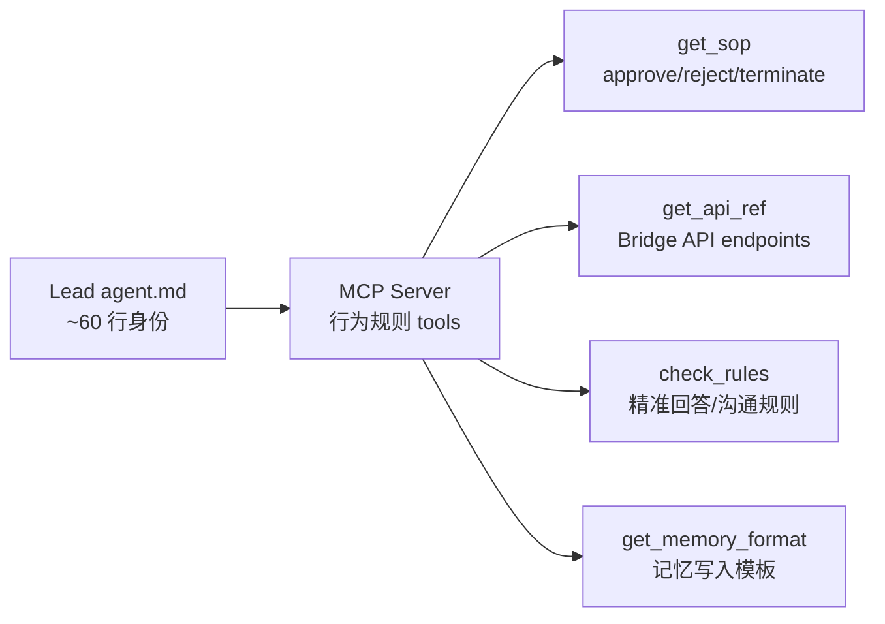
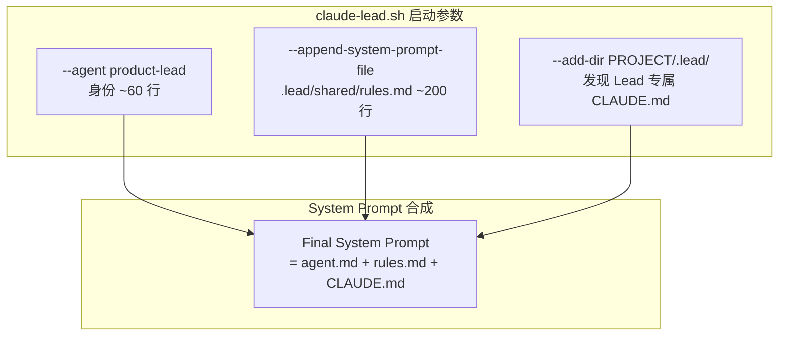
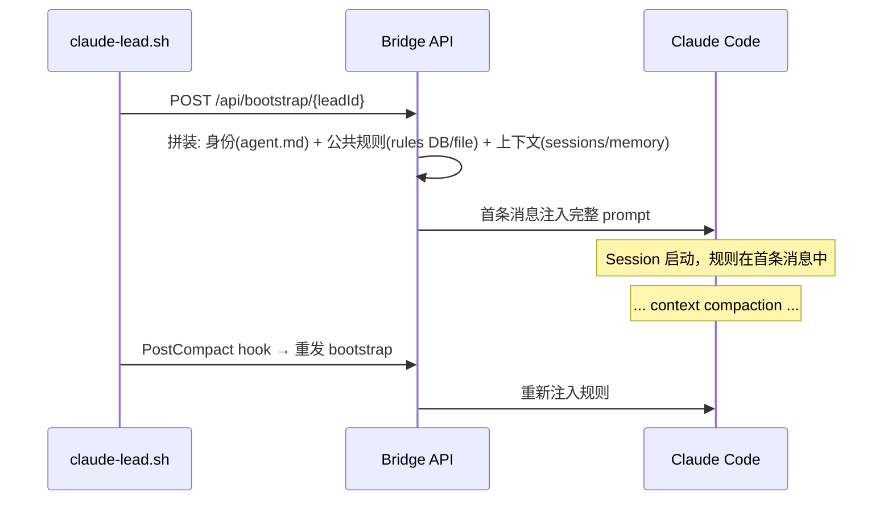
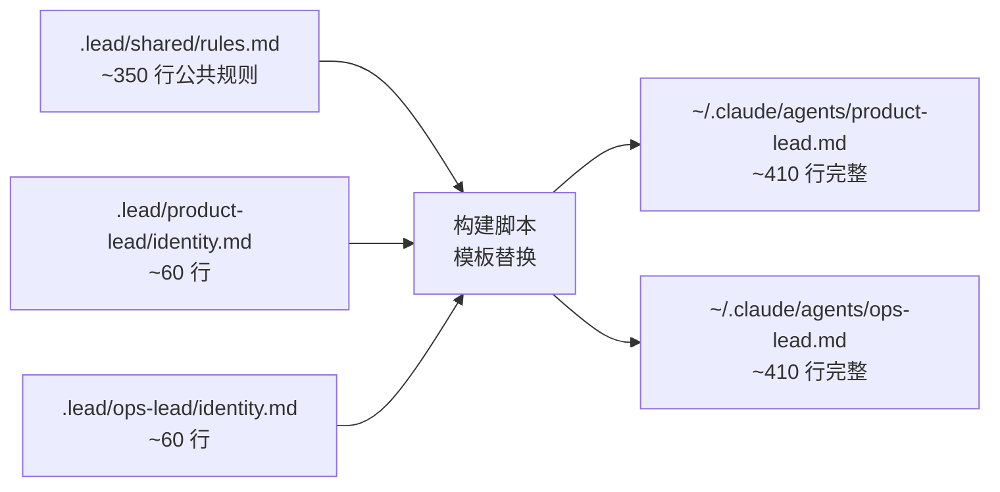
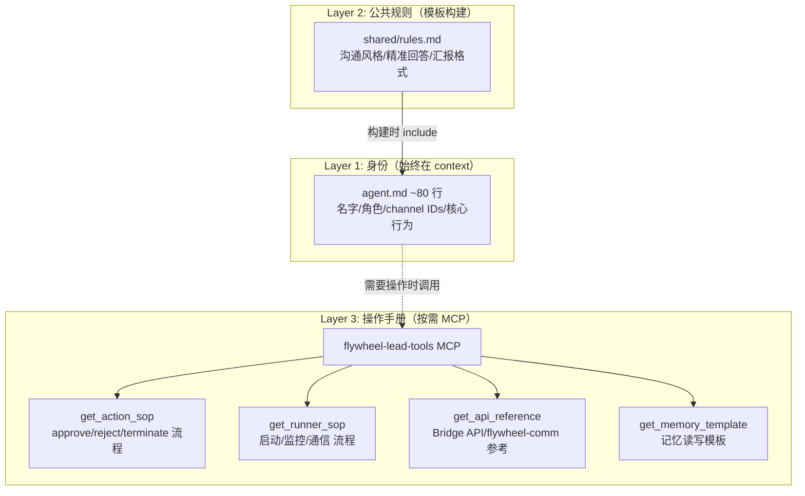
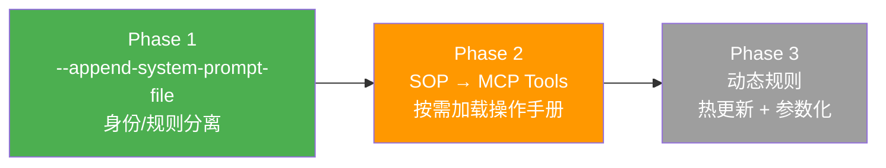

# Exploration: Lead 行为规则 Scalability — FLY-26

**Issue**: [FLY-26 Lead 行为规则 scalability](https://linear.app/geoforge3d/issue/FLY-26/arch-lead-行为规则-scalability-探索-mcp-tools-动态注入-其他方案)
**Date**: 2026-03-30
**Status**: Draft

---

## 1. 问题分析

### 1.1 当前状态量化

| Agent | 行数 | 唯一内容占比 |
|-------|------|-------------|
| Peter (product-lead) | 490 | ~12% (~60 行) |
| Oliver (ops-lead) | 491 | ~12% (~60 行) |
| Simba (cos-lead) | 424 | ~35% (~150 行) |
| **合计** | **1,405** | — |

Peter 和 Oliver 之间约 **430 行内容几乎完全一样**（只有 leadId、channel ID、角色名不同）。重复区域包括：

| Section | 行数 | Peter/Oliver 重复 | 三者共有 |
|---------|------|:-----------------:|:--------:|
| 沟通风格 + 精准回答 | ~25 | ✅ | ✅ |
| 事件处理 | ~30 | ✅ | 部分 |
| Bubble DOWN (approve/reject/terminate/start) | ~110 | ✅ | ❌ |
| Runner 通信 (flywheel-comm) | ~80 | ✅ | ❌ |
| Session Stage Monitoring | ~50 | ✅ | ❌ |
| Escalation 策略 | ~15 | ✅ | ❌ |
| 工具/Bridge API 参考 | ~40 | ✅ | 部分 |
| 记忆/Memory 双桶 | ~70 | ✅ | ✅ |
| 限制 | ~10 | ✅ | ✅ |

### 1.2 五大痛点

1. **N 份维护成本**: 改规则 → 改 N 个 agent.md → merge PR → 重启 Lead。GEO-260（精准回答）改了 3 份 agent.md，GEO-274（启动 Runner）改了 2 份。
2. **公共规则重复**: ~430 行在 Peter/Oliver 间 copy-paste，drift 风险高。
3. **agent.md 越来越长**: 490 行 → LLM 容易遗忘底部规则，特别是精准回答、memory 写入格式等。
4. **Context compaction 后规则丢失**: PostCompact hook 重发 bootstrap，但 agent.md 里的规则不会重发——它们在 system prompt 里被 compaction 截断后就丢失了。
5. **新 Lead 成本高**: 加一个新 Lead 需要复制 agent.md → 改身份 → 改 channel → 改 leadId → PR → 重启。

### 1.3 规则分类

对 agent.md 内容做了语义分类：

| 类别 | 示例 | 特征 | 能否 compaction 后丢失？ |
|------|------|------|:-----------------------:|
| **身份 (Identity)** | 名字、角色、Bot ID、channel IDs | 独一无二，必须始终在 context | ❌ 不能丢 |
| **行为规则 (Behavior)** | 精准回答、沟通风格、汇报风格 | 公共且稳定，偶尔遗忘 | ⚠️ 可接受短暂遗忘 |
| **操作手册 (SOP)** | Bubble DOWN 流程、terminate 验证、启动 Runner | 公共且复杂，按需查阅 | ✅ 可以按需重载 |
| **工具参考 (API Ref)** | Bridge API endpoints、flywheel-comm 命令 | 公共纯参考，查用 | ✅ 可以按需查阅 |
| **配置 (Config)** | Channel IDs、leadId 值 | 独一无二但稳定 | ❌ 不能丢 |

**关键洞察**：身份 + 配置约 60 行，是真正需要"始终在 context"的内容。其余 430 行是行为/SOP/参考，理论上可以按需加载。

---

## 2. 业界方案调研

### 2.1 各框架的角色定义方式

> 来源：ChatGPT Deep Research (`doc/deep-research/multi-agent-architecture-best-practices.md`) + FLY-3 AgentsMesh Deep Dive

| 框架 | 角色定义方式 | 规则管理 | 与 Flywheel 的对比 |
|------|------------|---------|-------------------|
| **CrewAI** | YAML 配置文件 (`config/agents.yaml`)：role/goal/backstory | 静态配置，集中管理。可复用但不支持动态加载 | 类似方案 D（模板化），解决重复但不解决长度 |
| **AutoGen** | 编程定义：继承 `BaseChatAgent`，实现 `on_messages()` | 行为编码在方法中，不在 prompt 里 | 类似方案 A/E（工具化），但过于 code-heavy |
| **LangGraph** | 图 + 代码编排，不直接定义角色 | 工作流节点，非 prompt 驱动 | 与 Flywheel Lead 模式差异太大 |
| **AgentsMesh** | Pod 配置（agent type, model, permissions, initial prompt）+ 26 个 MCP tools | **能力编码在 MCP tools 中**，Pod 本身只有最小配置 | 最接近方案 A，核心参考 |
| **OpenAI Swarm** | 轻量：name + instructions + functions | Instructions 是静态 prompt，functions 是可调用工具 | 类似方案 F（hybrid），但更轻量 |
| **Claude Agent SDK** | Markdown 文件 + YAML frontmatter | 静态 prompt，支持 name/description/tools/model | 当前 Flywheel 的方式 |

### 2.2 AgentsMesh 的具体做法

AgentsMesh 的行为规则管理策略是 **"最小 prompt + 最大 tool"**：

1. **Pod 配置**：每个 Pod（等价于 Flywheel Runner）只有基本配置 —— agent type（Claude/Codex/Gemini）、model、permissions、initial prompt（类似 agent.md 的身份部分）。
2. **行为编码在 MCP Tools**：26 个 MCP tools 通过 Runner 本地 HTTP server (port 19000) 提供，涵盖 Pod 管理、Binding 协商、Channel 通信、Ticket 管理、Loop 调度。Agent 的"能力"不写在 prompt 里，而是通过 tool schema 自动暴露。
3. **Skill Marketplace**：Agent 能力可通过 Skill 包动态安装/卸载，有 marketplace 机制。这让行为规则可以模块化分发。
4. **Autopilot Controller**：复杂的控制逻辑（断路器、用户接管、进度检测）编码在 Go 代码中，不在 agent prompt 里。Agent 只需要调 tool，控制逻辑由基础设施执行。

**关键差异**：AgentsMesh 的 Pod 是**无状态、无身份**的——没有 Peter/Oliver 这样的角色，没有跨 session 记忆。所以它不需要长 prompt。Flywheel Lead 的"身份"部分是差异化价值，需要保留在 prompt 中。

### 2.3 业界共识

Deep Research 总结的核心共识：

> **"精简主提示 + 强化工具是最佳实践"**

- **避免 agentic monolith**：一个 agent 承担过多职责会造成混乱、高错误率
- **"提示驱动" → "工具驱动" 演进**：全部行为写在提示里直观但不可靠。封装在工具/API 中更可靠、可测试、可维护
- **工具调用比纯文本提示更可靠、自我纠错**
- **动态规则注入优于静态大提示**：通过 API 或事件在运行时更新规则

### 2.4 Claude Code 新发现

研究 Claude Code CLI 发现两个关键 flag，改变方案 B 的可行性：

| Flag | 功能 | 对 FLY-26 的意义 |
|------|------|-----------------|
| `--add-dir <dirs>` | 添加额外目录用于 CLAUDE.md 发现和工具访问 | Lead 可运行在隔离 workspace，同时通过 `--add-dir` 加载项目 `.lead/` 中的共享 CLAUDE.md |
| `--append-system-prompt-file <file>` | 从文件追加 system prompt | 共享规则文件直接注入 system prompt，比 agent.md include 更干净 |

这两个 flag 使得**无需改变 workspace 策略**就能实现 CLAUDE.md 分层，显著提升方案 B 的可行性。

---

## 3. 方案分析

### 方案 A: MCP Tools（AgentsMesh 模式）

**核心思路**: 把操作手册和行为规则编码为 MCP tools。Lead 调 tool 就是执行规则。



**实现方式**:
- 本地 MCP server（TypeScript/Node.js，类似 flywheel-comm），提供规则查询 tools
- Tool 可以动态返回内容（如当前 Lead 的 channel IDs、API 模板）
- agent.md 只保留身份 + "调用 MCP tool 获取操作手册"的指令

**参考**: AgentsMesh 的 26 个 MCP tools（FLY-3 Section 3.3）中，很多本质上是操作手册编码（如 `create_pod` 的 description 包含了创建 Pod 的完整流程）。

| 维度 | 评估 |
|------|------|
| **Context window 影响** | ⚠️ 中。每个 MCP tool 的 JSON schema 都进 system prompt（~200 token/tool）。10 个 tools ≈ 2000 token 额外开销，但比 490 行 agent.md 小 |
| **规则遗忘风险** | ✅ 低。规则在 tool 代码里，调 tool 就 100% 执行正确。但 Lead 可能忘记调 tool |
| **维护成本** | ✅ 改一处生效。但 MCP server 本身需要开发和维护 |
| **新 Lead 成本** | ✅ 低。新 agent.md 只需身份，MCP tools 自动共享 |
| **Claude Code 兼容** | ✅ 完全兼容。Claude Code 原生支持 MCP servers |
| **复杂度** | ⚠️ 中。需要设计 tool schema、实现 MCP server、处理 leadId 参数化 |

**Pros**:
- 规则代码化 → 一处修改，所有 Lead 生效
- 不增加 agent.md 长度（甚至大幅缩短）
- 可动态参数化（tool 输入 leadId → 返回该 Lead 的 channel IDs）
- Compaction 后不会丢失规则——tool 始终可调用

**Cons**:
- Lead 需要"记住调 tool"，如果 agent.md 里没写清楚什么时候该调什么 tool，Lead 可能不调
- 额外基础设施：需要开发和部署 MCP server
- Tool schema 进 system prompt 有固定 token 开销
- 调试比读 agent.md 更复杂

---

### 方案 B: --append-system-prompt-file（Claude Code 原生分层）

**核心思路**: 利用 Claude Code 的 `--append-system-prompt-file` 将共享规则注入 system prompt，`--add-dir` 发现项目级 CLAUDE.md。



**实现方式**:
- `agent.md` 只保留身份（~60 行）：名字、角色、Bot ID、channel IDs
- 公共规则放在 `.lead/shared/rules.md`（~200 行）：沟通风格、精准回答、Bridge API ref、记忆模板
- `claude-lead.sh` 启动时加 `--append-system-prompt-file .lead/shared/rules.md`
- 可选：`--add-dir PROJECT/.lead/` 让 Lead 发现 `.lead/CLAUDE.md`（Lead 专属上下文）

**关键发现**:
- ✅ `--append-system-prompt-file` 注入到 system prompt（高遵从度），不是用户消息
- ✅ `--add-dir` 解决了"Lead 运行在隔离 workspace 看不到项目 CLAUDE.md"的问题
- ✅ 不需要改 workspace 策略

| 维度 | 评估 |
|------|------|
| **Context window 影响** | ⚠️ 中。规则在 system prompt，和 agent.md 等价，但总量从 490→260 行 |
| **规则遗忘风险** | ⚠️ 与 agent.md 相同。system prompt 被 compaction 后丢失 |
| **维护成本** | ✅ 改 rules.md 一处，所有 Lead 生效 |
| **新 Lead 成本** | ✅ 低。只需新 agent.md（~60 行）+ 共享 rules.md 自动覆盖 |
| **Claude Code 兼容** | ✅ 完全兼容。原生 CLI flag，无 hack |
| **复杂度** | ✅ 极低。只改 `claude-lead.sh` 启动参数 |

**Pros**:
- 最简方案，0 额外基础设施，只改启动参数
- 规则在 system prompt 中，遵从度高（和 agent.md 等价）
- agent.md 大幅缩短（490→60 行），公共规则集中管理
- 参数化通过 agent.md 解决（每个 Lead 的身份部分不同）
- `--add-dir` 让 Lead 可以看到项目级 `.lead/CLAUDE.md` 而不暴露整个项目 repo

**Cons**:
- 公共规则 + 身份加起来仍 ~260 行在 system prompt，compaction 问题未完全解决
- 不支持动态参数化（rules.md 是静态文件，不能根据 leadId 返回不同内容）
- rules.md 中的 SOP 部分（如 Bubble DOWN 流程）即使不需要也始终在 context

---

### 方案 C: Bootstrap 动态注入

**核心思路**: 公共规则通过 Bridge bootstrap 动态注入 Lead session 的首条消息。



**实现方式**:
- Bridge 维护公共规则文件/DB
- Bootstrap 时拼装 agent.md（身份）+ 公共规则 + 当前状态
- PostCompact hook 已存在（GEO-285），可以重发 bootstrap 恢复规则

**当前状态**: Bootstrap 已经在做这件事（发送活跃 session 状态），但不发送行为规则。

| 维度 | 评估 |
|------|------|
| **Context window 影响** | ⚠️ 高。规则注入为用户消息，占 context window |
| **规则遗忘风险** | ✅ PostCompact hook 可重发，比 agent.md 好 |
| **维护成本** | ✅ 改 Bridge 配置/文件即可 |
| **新 Lead 成本** | ✅ 低。共享规则自动注入 |
| **Claude Code 兼容** | ✅ 完全兼容（已有 bootstrap 基础设施） |
| **复杂度** | ✅ 低。在已有 bootstrap 基础上扩展 |

**Pros**:
- 复用已有 bootstrap + PostCompact 基础设施
- 规则可以动态化（根据 leadId 注入不同规则集）
- PostCompact 后可重发，缓解 compaction 丢失问题
- 不需要新的 MCP server 或改 workspace

**Cons**:
- 规则作为用户消息（非 system prompt）注入，LLM 遵从度可能低于 system prompt
- Bootstrap 消息会很长（当前状态 + 规则 = potentially 1000+ 行）
- 每次 PostCompact 重发都消耗 context window
- 规则和上下文混在一起，不好管理

---

### 方案 D: agent.md 模板化 + 共享 Include

**核心思路**: 构建时将共享规则文件 include 到各 agent.md 中。



**实现方式**:
- 源文件拆分：`.lead/shared/rules.md`（公共规则）+ `.lead/<lead>/identity.md`（身份）
- `claude-lead.sh` 启动时执行模板合并（`cat identity.md rules.md > agent.md`）
- 可支持模板变量替换（`{{LEAD_ID}}`、`{{CHANNEL_IDS}}`）

| 维度 | 评估 |
|------|------|
| **Context window 影响** | ❌ 不变。最终 agent.md 长度和现在一样 |
| **规则遗忘风险** | ❌ 不变。和现在一样 |
| **维护成本** | ✅ 改一处，构建时自动分发 |
| **新 Lead 成本** | ✅ 低。只需写 identity.md |
| **Claude Code 兼容** | ✅ 完全兼容（生成的 agent.md 和手写的没区别） |
| **复杂度** | ✅ 极低。几行 shell 脚本 |

**Pros**:
- 最简最稳，几乎 0 风险
- 解决"改 N 份"问题
- 不改任何基础设施
- 模板变量替换解决参数化需求

**Cons**:
- 不解决 agent.md 太长的问题（最终生成的文件一样长）
- 不解决 compaction 丢失问题
- 只解决了 5 个痛点中的 2 个（N 份维护 + 新 Lead 成本）

---

### 方案 E: Rule Engine（Bridge 侧规则 DB）

**核心思路**: Bridge 维护结构化规则数据库，Lead 通过 API 查询当前适用的规则。


**实现方式**:
- Bridge 新增 `GET /api/rules?leadId=X&category=sop` 端点
- 规则存储在 SQLite（或 JSON 配置文件）
- Lead agent.md 里写"需要 SOP 时调 Bridge API 查"
- 规则可以版本化、分类、按需查询

| 维度 | 评估 |
|------|------|
| **Context window 影响** | ✅ 按需加载，最小化 |
| **规则遗忘风险** | ⚠️ Lead 需要记住去查 API |
| **维护成本** | ✅ 中央管理，热更新 |
| **新 Lead 成本** | ✅ 低。自动获取规则 |
| **Claude Code 兼容** | ✅ 通过 Bash curl 查询 |
| **复杂度** | ⚠️ 中。需要设计规则 schema、CRUD API |

**Pros**:
- 规则可热更新（改 DB，不用重启 Lead）
- 按需加载，context window 友好
- 可以版本化、审计规则变更
- 可为不同角色返回不同规则集

**Cons**:
- 过度工程化风险——目前规则数量不多（~10 个 SOP），规则 DB 可能是杀鸡用牛刀
- Lead 需要主动查询，如果忘记就没规则
- Bridge 依赖增加（规则 DB 挂了 → Lead 无规则）
- 规则作为 API response 注入，遵从度可能低于 system prompt

---

### 方案 F: Hybrid（推荐评估）

**核心思路**: 分层策略——身份在 agent.md，公共规则模板化，复杂 SOP 在 MCP tools。



**分层原则**:

| 层级 | 内容 | 加载方式 | 大小 |
|------|------|---------|------|
| **L1 身份** | 名字、角色、Bot ID、channel IDs、核心行为原则 | agent.md (system prompt) | ~30 行/Lead |
| **L2 公共规则** | 沟通风格、精准回答、汇报格式、记忆规范 | 模板 include 到 agent.md | ~50 行共享 |
| **L3 操作手册** | Bubble DOWN SOP、Runner 管理、Bridge API ref | MCP tools (按需) | ~350 行 → tools |

**实现方式**:
1. 源文件拆分：`identity.md` (~30 行) + `shared-rules.md` (~50 行) + MCP tools
2. `claude-lead.sh` 构建时合并 L1+L2 → agent.md (~80 行)
3. MCP server 提供 L3 tools，Lead 需要执行操作时调用
4. agent.md 末尾写明："执行 approve/reject/start 等操作前，先调 `get_action_sop` 获取流程"

| 维度 | 评估 |
|------|------|
| **Context window 影响** | ✅ 好。agent.md 从 490→80 行，MCP schema ~1000 token |
| **规则遗忘风险** | ✅ 低。关键规则在 L1/L2，SOP 在 tool 里不会被 compaction |
| **维护成本** | ✅ 低。公共改 shared-rules.md，SOP 改 MCP server |
| **新 Lead 成本** | ✅ 极低。只需 ~30 行 identity.md |
| **Claude Code 兼容** | ✅ 完全兼容 |
| **复杂度** | ⚠️ 中。需要 MCP server + 模板构建，但都不复杂 |

**Pros**:
- 同时解决 5 个痛点
- agent.md 大幅缩短 → LLM 遗忘风险降低
- SOP 在 MCP tools 里 → compaction 后不丢失
- 改公共规则只改一处
- 新 Lead 成本极低

**Cons**:
- 需要开发 MCP server（但可以很轻量）
- Lead 需要记住在操作前调 tool（但 agent.md 可以写明触发条件）
- 两个系统需要保持一致（agent.md 的触发指令 ↔ MCP tool 的实际内容）

---

## 4. 方案对比矩阵

| 维度 | A: MCP | B: --append | C: Bootstrap | D: 模板化 | E: Rule DB | F: Hybrid |
|------|:------:|:----------:|:-----------:|:--------:|:---------:|:---------:|
| 解决 N 份维护 | ✅ | ✅ | ✅ | ✅ | ✅ | ✅ |
| 解决 agent.md 太长 | ✅ | ✅ | ⚠️ | ❌ | ✅ | ✅ |
| 解决 compaction 丢失 | ✅ | ❌ | ✅ | ❌ | ✅ | ✅ |
| 新 Lead 成本 | ✅ | ✅ | ✅ | ✅ | ✅ | ✅ |
| 实现复杂度 | 中 | **极低** | 低 | 极低 | 中 | 中 |
| Claude Code 兼容 | ✅ | ✅ | ✅ | ✅ | ✅ | ✅ |
| 热更新(不重启) | ✅ | ❌ | ❌ | ❌ | ✅ | ✅(L3) |
| 业界对齐度 | ⭐⭐⭐⭐⭐ | ⭐⭐⭐ | ⭐⭐ | ⭐⭐ | ⭐⭐⭐ | ⭐⭐⭐⭐⭐ |
| 综合评分 | ⭐⭐⭐⭐ | ⭐⭐⭐⭐ | ⭐⭐⭐ | ⭐⭐ | ⭐⭐⭐ | ⭐⭐⭐⭐⭐ |

**与方案 A/F 原来对比的变化**：方案 B 在发现 `--append-system-prompt-file` 和 `--add-dir` 后从 ⭐⭐ 升级到 ⭐⭐⭐⭐。它现在是一个极低复杂度就能解决 3/5 痛点的方案。

---

## 5. 更新后的推荐方案

### 推荐路线: B → F（渐进式 3-Phase）

结合业界调研结果，推荐从最简方案起步，验证后逐步深化。与 Deep Research 中"精简主提示 + 强化工具"的业界共识完全对齐。



### Phase 1: 身份/规则分离（方案 B）— 立即可做

**做法**:
1. 拆分每个 agent.md 为：
   - `identity.md`（~60 行）：名字、角色、Bot ID、channel IDs、核心原则
   - `.lead/shared/department-lead-rules.md`（~200 行）：沟通风格、精准回答、Bridge API ref、记忆模板
   - `.lead/shared/runner-manager-rules.md`（~150 行）：Bubble DOWN SOP、Runner 通信、Stage Monitoring（仅 Peter/Oliver 用，Simba 不 include）
2. 修改 `claude-lead.sh`：
   ```bash
   CLAUDE_ARGS=(
     --agent "$LEAD_ID"
     --append-system-prompt-file "$PROJECT_DIR/.lead/shared/department-lead-rules.md"
     --channels "plugin:discord@claude-plugins-official"
     --permission-mode bypassPermissions
   )
   # Peter/Oliver 额外加载 Runner 管理规则
   if [[ "$LEAD_ID" != "cos-lead" ]]; then
     CLAUDE_ARGS+=(--append-system-prompt-file "$PROJECT_DIR/.lead/shared/runner-manager-rules.md")
   fi
   ```

**投入**: ~2-3 小时
**收益**: 解决 N 份维护 + 新 Lead 成本 + agent.md 缩短 88%
**风险**: 极低（只改启动参数 + 拆分文件）

### Phase 2: SOP → MCP Tools（方案 F 的 L3）— Phase 1 验证后

**做法**:
1. 开发 `flywheel-lead-tools` MCP server（TypeScript，Flywheel monorepo 新 package）
2. 把操作手册从 rules.md 迁移到 MCP tools：
   - `get_action_sop(action)` → 返回 approve/reject/terminate/retry/start 流程
   - `get_api_reference(category)` → 返回 Bridge API / flywheel-comm 命令参考
   - `get_memory_template(bucket)` → 返回记忆读写模板（含 curl 命令）
   - `get_stage_reference()` → 返回 Session Stage 超时参考表
3. rules.md 缩短到 ~80 行（只留沟通风格、精准回答等核心行为规则）
4. agent.md 添加一行触发规则："执行 approve/reject/start 等操作前，调 `get_action_sop` 获取流程"

**投入**: ~1-2 天
**收益**: agent.md + rules.md 总量从 ~260→~140 行 + SOP 不受 compaction 影响 + 热更新
**风险**: 低（MCP 是 Claude Code 成熟机制）

### Phase 3: 动态规则 + 参数化（远期）

**做法**:
1. MCP tools 支持 `leadId` 参数，返回该 Lead 的 channel IDs、API 模板
2. rules.md 中的模板变量在 `claude-lead.sh` 启动时做 `envsubst` 替换
3. 可选: Bridge 侧规则 API，支持热更新规则（不重启 Lead）

**投入**: ~1 天
**风险**: 低

### 为什么这条路线最好

1. **渐进式，每步有独立价值**: Phase 1 已经解决 3/5 痛点，即使不做 Phase 2 也值得
2. **与业界共识对齐**: "精简主提示 + 强化工具"（Deep Research），"最小 prompt + 最大 tool"（AgentsMesh）
3. **不引入不必要的复杂度**: Phase 1 是 0 新基础设施；Phase 2 的 MCP server 也很轻量
4. **每个 Phase 都可独立验证**: 不需要一次性全做完

---

## 6. Annie 需要决定的问题

研究了 6 个框架 + AgentsMesh 详细做法后，问题已经从 5 个收窄到 3 个：

### Q1: Phase 1 直接做？
方案 B（`--append-system-prompt-file`）风险极低（只改启动参数 + 拆分文件），是否直接进入 research → plan → implement？

### Q2: SOP 是否需要始终在 context？
Phase 2 会把 Bubble DOWN 流程、Runner 管理等 SOP 移到 MCP tools（按需调用）。Annie 能接受 Lead "需要时调 tool 查 SOP" 而非始终记住全部流程吗？

业界倾向: AgentsMesh、OpenAI Swarm、CrewAI 都倾向把逻辑放 tools 而非 prompt。Deep Research 明确建议"工具调用比纯文本提示更可靠"。

### Q3: MCP server 放哪里？
如果做 Phase 2，MCP server 放在：
- **选项 a**: Flywheel monorepo 新 package `packages/lead-tools`（推荐——与 flywheel-comm 同层，CI 覆盖）
- **选项 b**: 独立部署在 `~/.flywheel/mcp/`
- **选项 c**: Bridge 扩展为 MCP server（复用已有 HTTP server）

---

## 7. 参考资料

- [Deep Research: Multi-Agent Architecture Best Practices](../../deep-research/multi-agent-architecture-best-practices.md) — 6 框架对比 + 业界共识
- [FLY-3 AgentsMesh Deep Dive](../../research/new/FLY-3-agentsmesh-deep-dive.md) — Section 2.2 AgentPod, 3.3 MCP 工具集, 5.5 Skill Marketplace
- [FLY-26 Linear Issue](https://linear.app/geoforge3d/issue/FLY-26) — 问题描述 + 5 个方案
- Agent.md 文件: `GeoForge3D/.lead/{product-lead,ops-lead,cos-lead}/agent.md`（490+491+424=1,405 行）
- Claude Code CLI flags: `--agent`, `--append-system-prompt-file`, `--add-dir`
- `claude-lead.sh`: GEO-285 crash recovery + PostCompact hook
