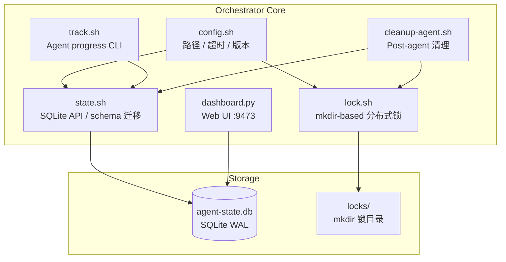
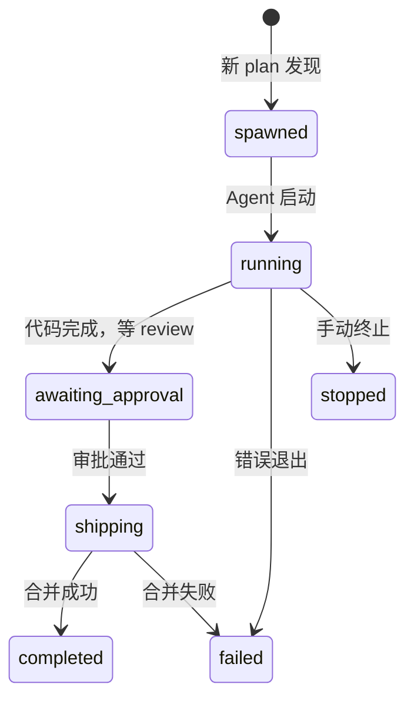

# Exploration: Flywheel Orchestrator — GEO-291

**Issue**: GEO-291 ([Infra] Flywheel 项目增加 Orchestrator — 多 agent 并行开发管理)
**Date**: 2026-03-28
**Status**: Complete

---

## 背景

Flywheel 项目的开发目前靠 CEO 手动管理 — 开 session、分配 task、盯进度。随着 P1/P2 backlog 越来越多（GEO-288, 254, 286, 285, 280 等），手动管不过来。

GeoForge3D 已有一套成熟的 orchestrator（`GeoForge3D/.claude/orchestrator/`），用 bash + SQLite 实现多 agent 编排。目标是把这套模式搬到 Flywheel repo。

## GeoForge3D Orchestrator 分析

### 架构概览



### 七个核心文件

| 文件 | 职责 | 行数 |
|------|------|------|
| `config.sh` | 路径常量、超时、版本管理、全局配置 | 中 |
| `state.sh` | SQLite 完整 API（3 层容错）、schema 迁移（v1→v4）、step template seeding | 大 |
| `track.sh` | Agent 调用的 CLI wrapper（start/complete/artifact/gate） | 小 |
| `lock.sh` | 基于 mkdir 的跨进程互斥锁 | 中 |
| `cleanup-agent.sh` | Agent 完成后的清理（归档、释放锁、删 worktree） | 中 |
| `dashboard.py` | HTTP dashboard（auto-refresh 10s） | 中 |
| `schema*.sql` | Schema 定义（4 个版本） | 小 |

### Agent 生命周期



### Step Template 机制

GeoForge3D 定义了 5 种 agent 类型的 step 模板：

| Agent Type | Steps | 用途 |
|-----------|-------|------|
| executor | 8 步 | 标准开发流程 (Verify → Brainstorm → Research → Plan → Implement → Review → Pre-merge → Ship) |
| designer | 6 步 | 设计流程 |
| qa-executor | 5 步 | QA 测试流程 |
| plan-generator | 4 步 | 从 handoff 生成 plan |
| qa-plan-generator | 4 步 | 从测试报告生成修复 plan |

Gate 机制：每步有前置条件，track.sh gate 检查前置步骤是否完成才允许继续。

### 并发控制

- **全局**: `MAX_CONCURRENT_AGENTS=4`
- **环境锁**: `backend-env-lease`, `frontend-live-lease`（防止并行 deploy）
- **文档锁**: `docs-update`, `version-bump`（保护文件移动和版本号）
- **实现**: mkdir 原子操作 + metadata 文件记录 holder/timestamp

### 三层容错

| 层 | 函数 | 用途 | 失败行为 |
|---|------|------|---------|
| Tier 1 | `_sql()` | 原始 SQL | 重试 3 次（锁冲突）, 5s 超时 |
| Tier 2 | `state_critical()` | 生命周期操作 | 重试 3 次 + 日志告警 |
| Tier 3 | `state_try()` | 遥测/非关键 | 静默吞错 |

---

## Flywheel 适配分析

### 核心差异

| 维度 | GeoForge3D | Flywheel |
|------|-----------|----------|
| **Domain 数量** | 5 个（backend, frontend, designer, qa, plan-gen） | 1 个（全栈 TypeScript） |
| **Plan 路径** | `product/doc/{domain}/plan/new/` | `doc/plan/new/` |
| **Exploration/Research** | `product/doc/{domain}/exploration/new/` | `doc/exploration/new/`, `doc/research/new/` |
| **Worktree 命名** | `product/{Backend\|Frontend}/worktrees/` | `../flywheel-geo-{XX}` 或 `../flywheel-{slug}` |
| **版本文件** | `product/doc/VERSION` | `doc/VERSION` |
| **Agent 类型** | executor, designer, qa-executor, plan-gen, qa-plan-gen | executor（统一，全走 /spin pipeline） |
| **环境锁** | 需要（backend/frontend 各一套 env） | 不需要（无 deploy 流程） |
| **Handoff** | designer ↔ frontend handoff 流程 | 不存在 |

### 需要做的适配

#### 1. config.sh — 路径全部重写

```
PROJECT_ROOT → /Users/xiaorongli/Dev/flywheel
PLAN_NEW → doc/plan/new/          (唯一 plan 入口)
PLAN_INPROGRESS → doc/plan/inprogress/
PLAN_ARCHIVE → doc/plan/archive/
EXPLORATION_NEW → doc/exploration/new/
RESEARCH_NEW → doc/research/new/
VERSION_FILE → doc/VERSION
WORKTREE_BASE → ../ (flywheel-geo-{XX} pattern)
```

去掉 `BACKEND_DIR`, `FRONTEND_DIR`, `BACKEND_NEW`, `FRONTEND_NEW`, `QA_NEW`, `DESIGNER_NEW`, `HANDOFF_NEW`。

#### 2. state.sh — Schema 大幅简化

**Domain CHECK**: 从 `backend|frontend|designer|qa|plan-generator|qa-plan-generator` 简化为单一 `executor` 类型。

**Step Templates**: 只保留一种 executor 模板，对齐 Flywheel 的 /spin pipeline：

| Step Key | Step Name | 对应 /spin 阶段 |
|----------|-----------|-----------------|
| 1 | Verify Environment | 环境检查 |
| 2 | Brainstorm | /brainstorm |
| 3 | Research | /research |
| 4 | Write Plan + Design Review | /write-plan + /codex-design-review |
| 5 | Implement | /implement |
| 5a | Code Review | /codex-code-review |
| 5b | User Approval | CEO 审批 |
| 6 | Ship + Archive | /ship-pr + 归档 |

**Schema 版本**: 从 v1 开始，不需要迁移路径（全新安装）。

#### 3. track.sh — Gate 适配

Gate 逻辑不变（线性依赖链），但 step key 对应 Flywheel 模板。

#### 4. lock.sh — 可以原样复用

锁机制是通用的，不依赖项目结构。唯一变化：去掉 `backend-env-lease` 和 `frontend-live-lease`（Flywheel 不需要环境锁）。

保留：
- `docs-update` — 保护 plan 文件移动
- `version-bump` — 保护 VERSION 递增

#### 5. cleanup-agent.sh — 简化 domain 分支

去掉 domain-specific 清理逻辑（qa report、designer handoff、env lease release）。
统一为：
1. 更新 SQLite 状态
2. 归档 plan/exploration/research
3. 删除 worktree + branch
4. 释放锁

#### 6. dashboard.py — 基本不变

路径和端口可能需要调整，其余逻辑通用。

### 不需要的东西

| 功能 | 原因 |
|------|------|
| 多 domain 路由 | Flywheel 单一 TypeScript 项目 |
| 环境锁 (env-lease) | 无 deploy 流程 |
| Handoff 机制 | 无 designer ↔ frontend 交接 |
| plan-generator / qa-plan-generator | 不需要自动生成 plan |
| Schema 迁移 (v1→v4) | 全新安装，直接用最终 schema |
| 多 VERSION 文件 | 只有一个 `doc/VERSION` |

---

## 关键设计决策

### Q1: Agent 类型 — 保持 executor 单一还是预留扩展？

**建议: 只做 executor，但 schema 的 CHECK 约束用 `executor` 而不硬编码。**
如果未来需要加类型（比如 qa-executor），改 CHECK 约束即可。当前 scope 不做多类型。

### Q2: Worktree 命名 — 用 GeoForge3D 的 `worktrees/` 子目录还是 Flywheel 的 `../flywheel-geo-{XX}` ？

**建议: 保持 Flywheel 现有惯例 `../flywheel-geo-{XX}`。**
这和 CLAUDE.md 中 git-workflow 规范一致，改动最小。

### Q3: Plan 发现 — 扫描 `doc/plan/new/` 还是 Linear？

**建议: 扫描 `doc/plan/new/`（和 GeoForge3D 一致）。**
Plan 文件是 /spin pipeline 的产出，已经包含 issue ID、version、scope 等信息。不需要额外查 Linear。

### Q4: Step Template — 完全对齐 /spin 还是简化？

**建议: 完全对齐 /spin pipeline 的 8 步。**
这样 orchestrator 的 step tracking 和手动 /spin 的流程完全一致，dashboard 显示也有意义。

### Q5: Dashboard 端口 — 用同一个还是换？

**建议: 换一个端口避免冲突。** GeoForge3D 用 9473，Flywheel 可以用 9474 或其他。

---

## 预估工作量

| 步骤 | 预估 |
|------|------|
| 复制骨架 | 小 |
| 改 config.sh 路径 | 小 |
| 简化 state.sh schema + templates | 中 |
| 简化 cleanup-agent.sh | 中 |
| 适配 worktree 命名 | 小 |
| 调 dashboard.py 端口/路径 | 小 |
| 测试：丢 plan 进去看能否 spawn | 小 |
| **总计** | 中等（主要是 state.sh 和 cleanup 的精简） |

## 风险

| 风险 | 影响 | 缓解 |
|------|------|------|
| state.sh 精简时误删关键逻辑 | Agent 状态丢失 | 逐函数对比，保留 3 层容错 |
| Worktree 命名冲突（手动 /spin + orchestrator 同时跑） | Git 锁冲突 | 用 lock.sh 保护 worktree 创建 |
| Schema 没有迁移路径 | 未来升级困难 | v1 schema 留好扩展点 |

## 后续

- **GEO-276** (PM Triage) 完成后，orchestrator 可以接收 triage 产出的 plan 并行 spawn
- **GEO-288, 254, 286, 285, 280** — 5 个 P1 task 可以作为首批并行测试
