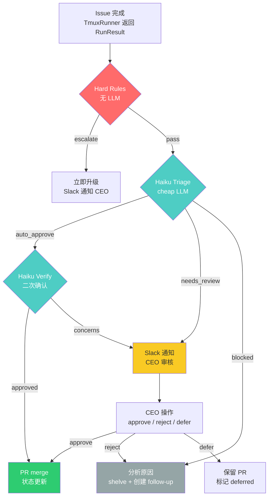
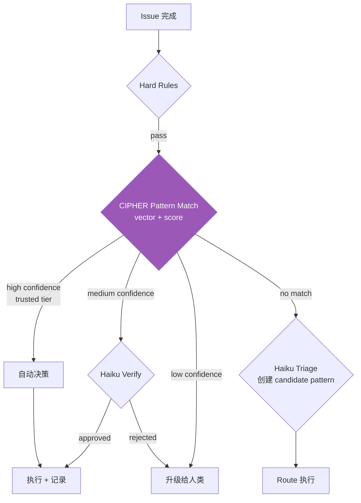
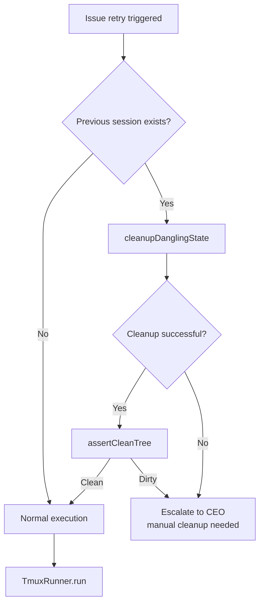

# Exploration: Decision Layer — Phase 2 完整设计 Spec

## 摘要

本文档为 Flywheel Phase 2 Decision Layer 提供完整的技术设计。Decision Layer 的核心职责是：**在 Claude Code session 完成一个 issue 后，决定如何处置结果**——自动合并、通知 CEO 审核、还是搁置。

设计基于四个源码项目的深度分析：
- **awesome-llm-apps Trust Layer** — 信任分数模型、AuditEntry schema、DelegationScope 权限递减
- **AG2 Adaptive Research Team** — Triage/Route/Verify 三阶段决策流
- **DevPulseAI** — Utility vs Agent 边界、LLM fallback heuristic
- **MobileAgent v3** — InfoPool 共享状态、consecutive failure threshold、Manager/Executor 分离
- **deer-flow** — DanglingToolCallMiddleware、中断后 message history 修复

## 1. Architecture Overview

### 1.1 Phase 2 决策流（最小可行）



### 1.2 Phase 5 CIPHER 扩展（预留）



### 1.3 组件职责边界

| 组件 | 类型 | 职责 | LLM? |
|------|------|------|------|
| HardRuleEngine | Utility | 安全/权限/billing 硬规则过滤 | No |
| HaikuTriageAgent | Agent | 分类决策路由 | Yes (Haiku) |
| HaikuVerifier | Agent | auto_approve 二次确认 | Yes (Haiku) |
| FallbackHeuristic | Utility | LLM 不可用时降级 | No |
| AuditLogger | Utility | 决策审计日志 | No |
| SlackNotifier | Utility | 构造 + 发送 Slack 消息 | No |
| ExecutionContextManager | Utility | Session 状态追踪 | No |
| DanglingCleanup | Utility | 中断后清理逻辑 | No |

> **设计原则**（来自 DevPulseAI SignalCollector）：确定性工作不需要 LLM。Agent 只用于需要推理判断的地方。DevPulseAI 的 `SignalCollector` 明确标注 "NOT an agent — no LLM calls. This is an intentional design choice"，其 `__init__.py` docstring 写道："Agents are used ONLY where reasoning is required. Deterministic operations (collection, normalization, dedup) are utilities." 我们遵循同样的原则。

## 2. Hard Rules 列表

Hard Rules 在 LLM 调用之前执行，是纯确定性的规则引擎。任何匹配 Hard Rule 的场景**直接 escalate**，不经过 Haiku。

### 2.1 规则定义

```typescript
/**
 * Hard rule evaluator — no LLM, pure deterministic checks.
 *
 * Design: Inspired by awesome-llm-apps TrustLayer.PolicyEngine
 * where SUSPENDED agents are rejected before any delegation check.
 * Here we reject before any LLM triage.
 */
interface HardRule {
  /** 规则 ID */
  id: string;
  /** 人类可读描述 */
  description: string;
  /** 匹配优先级（数字越小越先执行） */
  priority: number;
  /** 评估函数 */
  evaluate: (ctx: ExecutionContext) => HardRuleResult;
}

interface HardRuleResult {
  /** 是否触发 */
  triggered: boolean;
  /** 触发时的 action */
  action: 'escalate' | 'block';
  /** 原因（人类可读） */
  reason: string;
}
```

### 2.2 初始规则集

| ID | 优先级 | 场景 | Action | 原因 |
|----|--------|------|--------|------|
| `HR-001` | 1 | Issue labels 包含 `security` / `auth` / `billing` | escalate | 安全/权限/计费变更必须人工审核 |
| `HR-002` | 2 | `consecutiveFailures >= 3` | escalate | 连续失败超过阈值（来自 MobileAgent `err_to_manager_thresh`） |
| `HR-003` | 3 | PR 修改了 `.env*` / `*secret*` / `*credential*` 文件 | escalate | 可能涉及 secrets |
| `HR-004` | 4 | PR diff 超过 500 行（净增） | escalate | 大规模变更需要人工审查 |
| `HR-005` | 5 | Issue labels 包含 `breaking-change` | escalate | Breaking change 必须人工确认 |
| `HR-006` | 6 | 项目 trust score < 300 (SUSPENDED/RESTRICTED) | escalate | 低信任项目不允许自动决策 |
| `HR-007` | 7 | Runner 超时（非正常完成） | block | session 异常终止，需要清理 |

### 2.3 实现

```typescript
class HardRuleEngine {
  private rules: HardRule[] = [];

  registerRule(rule: HardRule): void {
    this.rules.push(rule);
    this.rules.sort((a, b) => a.priority - b.priority);
  }

  /**
   * 按优先级顺序评估所有规则。
   * 第一个触发的规则即决定结果（short-circuit）。
   */
  evaluate(ctx: ExecutionContext): HardRuleResult | null {
    for (const rule of this.rules) {
      const result = rule.evaluate(ctx);
      if (result.triggered) {
        return result;
      }
    }
    return null; // 无 hard rule 触发，交给 Haiku
  }
}
```

## 3. Haiku Triage Prompt

### 3.1 Prompt 模板

```typescript
const HAIKU_TRIAGE_PROMPT = `You are a triage agent for an autonomous development system.
Your job is to decide what to do with a completed development task.

## Context

Issue: {{issueIdentifier}} — {{issueTitle}}
Project: {{projectId}}
Labels: {{labels}}

## Execution Summary

- Commits: {{commitCount}}
- Files changed: {{filesChanged}}
- Lines added/removed: +{{linesAdded}} / -{{linesRemoved}}
- Duration: {{durationMinutes}} minutes
- Test results: {{testResults}}
- Consecutive failures on this issue: {{consecutiveFailures}}

## Commit Messages

{{commitMessages}}

## Diff Summary (truncated to 2000 chars)

{{diffSummary}}

## Decision

Classify this result into exactly ONE route:

- **auto_approve**: Safe to merge automatically. Use when:
  - Changes are small and well-scoped
  - All tests pass
  - No security-sensitive files touched
  - Commit messages are clear and match issue description

- **needs_review**: Requires human review before merging. Use when:
  - Changes are significant but not problematic
  - Some uncertainty about correctness
  - Test coverage unclear
  - Could benefit from human judgment

- **blocked**: Cannot proceed, needs human intervention. Use when:
  - Task appears incomplete
  - Error indicators in output
  - Conflicting changes detected
  - Issue requirements not met

Respond with ONLY a JSON object:
{
  "route": "auto_approve" | "needs_review" | "blocked",
  "confidence": 0.0 to 1.0,
  "reasoning": "one sentence explanation",
  "concerns": ["list of specific concerns, if any"]
}`;
```

### 3.2 Few-shot Examples

```typescript
const TRIAGE_FEW_SHOT_EXAMPLES = [
  // Example 1: auto_approve — 小改动，测试通过
  {
    input: {
      issueTitle: "Fix typo in README.md",
      commitCount: 1,
      filesChanged: 1,
      linesAdded: 1,
      linesRemoved: 1,
      testResults: "all passing",
      diffSummary: "README.md: changed 'recieve' to 'receive'",
    },
    output: {
      route: "auto_approve",
      confidence: 0.95,
      reasoning: "Single character fix in documentation, no functional impact",
      concerns: [],
    },
  },
  // Example 2: needs_review — 有改动但需要确认
  {
    input: {
      issueTitle: "Add input validation to user registration",
      commitCount: 3,
      filesChanged: 5,
      linesAdded: 120,
      linesRemoved: 15,
      testResults: "18/18 passing",
      diffSummary: "Added zod schema validation to registration endpoint...",
    },
    output: {
      route: "needs_review",
      confidence: 0.7,
      reasoning: "Functional changes to user-facing registration flow; tests pass but human should verify validation rules",
      concerns: ["validation rules may need business review", "5 files touched across auth boundary"],
    },
  },
  // Example 3: blocked — 任务未完成
  {
    input: {
      issueTitle: "Implement OAuth2 PKCE flow",
      commitCount: 0,
      filesChanged: 0,
      linesAdded: 0,
      linesRemoved: 0,
      testResults: "N/A",
      diffSummary: "(no changes)",
    },
    output: {
      route: "blocked",
      confidence: 0.99,
      reasoning: "No commits produced — task was not completed",
      concerns: ["zero output", "may need clearer requirements or manual intervention"],
    },
  },
];
```

### 3.3 Verify Prompt（仅 auto_approve 时触发）

```typescript
const HAIKU_VERIFY_PROMPT = `You are a code review verifier for an autonomous development system.
A triage agent has recommended auto-approving this PR. Your job is to double-check.

## PR Details

Issue: {{issueIdentifier}} — {{issueTitle}}
Commits: {{commitCount}}
Files changed: {{filesChanged}}

## Full Diff

{{fullDiff}}

## Verification Checklist

Check each item:
1. Do changes match the issue description?
2. Are there any obvious bugs or logic errors?
3. Are error paths handled (no silent failures)?
4. Are there any hardcoded secrets or credentials?
5. Is the change scope appropriate (no unnecessary changes)?

Respond with ONLY a JSON object:
{
  "approved": true | false,
  "confidence": 0.0 to 1.0,
  "concerns": ["list of concerns, empty if approved"],
  "checklist": {
    "matches_issue": true | false,
    "no_obvious_bugs": true | false,
    "error_handling": true | false,
    "no_secrets": true | false,
    "appropriate_scope": true | false
  }
}`;
```

## 4. ExecutionContext TypeScript Interface

来源于 MobileAgent v3 的 `InfoPool` dataclass。MobileAgent 使用 `InfoPool` 作为所有 agent 之间的共享状态容器，追踪 `action_history`、`action_outcomes`、`error_descriptions`、`err_to_manager_thresh` 等。我们将这一模式适配到 Flywheel 的 issue 执行上下文。

### 4.1 MobileAgent InfoPool 原始实现（参考）

MobileAgent v3 的 `InfoPool`（位于 `MobileAgent/Mobile-Agent-v3/mobile_v3/utils/mobile_agent_e.py`）定义了：

```python
@dataclass
class InfoPool:
    # Working memory
    summary_history: list          # 操作描述列表
    action_history: list           # 操作列表
    action_outcomes: list          # 结果列表 ("A"=成功, "B"=错误页面, "C"=无变化)
    error_descriptions: list       # 错误描述

    # Error tracking
    error_flag_plan: bool = False  # 连续失败触发 replan
    err_to_manager_thresh: int = 2 # 连续失败阈值

    # Planning
    plan: str = ""
    completed_plan: str = ""
    progress_status: str = ""
    current_subgoal: str = ""
```

关键模式：当最近 `err_to_manager_thresh` 次操作全部失败（outcome 为 "B" 或 "C"），设置 `error_flag_plan = True`，触发 Manager 重新规划。这个模式直接映射到 Flywheel 的 "连续失败 -> escalate" 逻辑。

### 4.2 Flywheel ExecutionContext

```typescript
/**
 * Session execution state tracking.
 *
 * Adapted from MobileAgent v3 InfoPool:
 * - action_history -> attemptHistory
 * - action_outcomes -> outcome in each attempt
 * - err_to_manager_thresh -> consecutiveFailureThreshold
 * - error_flag_plan -> computed from consecutiveFailures
 *
 * Key difference: MobileAgent tracks per-step UI actions;
 * Flywheel tracks per-attempt issue executions.
 */
export interface ExecutionContext {
  // --- Issue Identity ---
  /** Linear issue ID */
  issueId: string;
  /** Human-readable identifier (e.g., "GEO-42") */
  issueIdentifier: string;
  /** Issue title */
  issueTitle: string;
  /** Issue description (from Linear) */
  issueDescription: string;
  /** Issue labels */
  labels: string[];
  /** Target project ID */
  projectId: string;
  /** Target repository path */
  repositoryPath: string;

  // --- Execution State ---
  /** Current attempt number (1-based) */
  currentAttempt: number;
  /** Maximum attempts before hard escalation */
  maxAttempts: number;
  /** Git SHA before session started */
  baseSha: string;
  /** Git SHA after session completed (null if no commits) */
  headSha: string | null;
  /** tmux session name */
  tmuxSessionName: string;
  /** Session start timestamp (ISO) */
  startedAt: string;
  /** Session end timestamp (ISO, null if running) */
  completedAt: string | null;
  /** How the session ended */
  exitReason: 'completed' | 'timeout' | 'user_stopped' | 'error';

  // --- Result Metrics ---
  /** Number of commits produced */
  commitCount: number;
  /** Commit messages (if any) */
  commitMessages: string[];
  /** Files changed in the diff */
  filesChanged: string[];
  /** Lines added */
  linesAdded: number;
  /** Lines removed */
  linesRemoved: number;
  /** Diff summary (truncated) */
  diffSummary: string;
  /** Test results summary (if available) */
  testResults: string | null;

  // --- Error Tracking (from MobileAgent) ---
  /**
   * Number of consecutive failures on this issue.
   * Resets to 0 on success.
   * MobileAgent equivalent: counting "B"/"C" outcomes in action_outcomes
   */
  consecutiveFailures: number;
  /**
   * Threshold for escalation.
   * MobileAgent equivalent: err_to_manager_thresh (default 2)
   * Flywheel uses 3 for more tolerance (dev tasks are slower than UI taps)
   */
  consecutiveFailureThreshold: number;

  // --- Attempt History ---
  /**
   * History of all attempts on this issue.
   * MobileAgent equivalent: action_history + action_outcomes + error_descriptions
   */
  attemptHistory: AttemptRecord[];

  // --- Decision Result ---
  /** Decision made by the Decision Layer (null if pending) */
  decision: DecisionResult | null;
}

/**
 * Record of a single execution attempt.
 */
export interface AttemptRecord {
  /** Attempt number (1-based) */
  attempt: number;
  /** Start time (ISO) */
  startedAt: string;
  /** End time (ISO) */
  completedAt: string;
  /** Outcome */
  outcome: 'success' | 'failure' | 'timeout' | 'error';
  /** Number of commits produced */
  commitCount: number;
  /** Error description (if failed) */
  errorDescription: string | null;
  /** Decision route assigned */
  route: DecisionRoute | null;
}

/**
 * Decision route — the three possible outcomes from triage.
 */
export type DecisionRoute = 'auto_approve' | 'needs_review' | 'blocked';

/**
 * Result of the Decision Layer evaluation.
 */
export interface DecisionResult {
  /** Route decided */
  route: DecisionRoute;
  /** Confidence score (0-1) */
  confidence: number;
  /** Human-readable reasoning */
  reasoning: string;
  /** Specific concerns raised */
  concerns: string[];
  /** How the decision was made */
  decisionSource: 'hard_rule' | 'haiku_triage' | 'fallback_heuristic' | 'cipher_match';
  /** Hard rule ID (if decisionSource is hard_rule) */
  hardRuleId?: string;
  /** Verification result (if route was auto_approve) */
  verification?: VerificationResult;
}

/**
 * Verification result for auto_approve decisions.
 */
export interface VerificationResult {
  /** Whether the verifier approved */
  approved: boolean;
  /** Confidence score (0-1) */
  confidence: number;
  /** Concerns raised by verifier */
  concerns: string[];
  /** Checklist results */
  checklist: {
    matchesIssue: boolean;
    noObviousBugs: boolean;
    errorHandling: boolean;
    noSecrets: boolean;
    appropriateScope: boolean;
  };
}
```

## 5. AuditEntry TypeScript Interface

来源于 awesome-llm-apps Trust Layer 的 `AuditEntry` dataclass（位于 `awesome-llm-apps/advanced_ai_agents/multi_agent_apps/multi_agent_trust_layer/multi_agent_trust_layer.py`）。

原始实现：

```python
@dataclass
class AuditEntry:
    timestamp: datetime
    event_type: str
    agent_id: str
    action: str
    delegation_id: Optional[str]
    result: str  # "allowed", "denied", "error"
    details: Dict[str, Any]
    trust_impact: int = 0
```

Trust Layer 的每个 `authorize_action` 调用都会记录一条 `AuditEntry`，包括 trust score 变动。TrustScoringEngine 的 `SCORE_ADJUSTMENTS` 定义了各事件类型的 delta：`task_completed: +10`, `scope_violation_attempt: -50`, `security_violation: -100` 等。

### 5.1 Flywheel AuditEntry

```typescript
/**
 * Decision audit log entry.
 *
 * Adapted from awesome-llm-apps TrustLayer.AuditEntry:
 * - agent_id -> issueId (Flywheel 的信任对象是决策类型+项目，不是 agent)
 * - delegation_id -> removed (Flywheel 无多级委托)
 * - trust_impact -> trustScoreDelta (Phase 5 CIPHER)
 *
 * 每个 Decision Layer 调用产生一条 AuditEntry。
 * Phase 2 存入 SQLite；Phase 5 用于 CIPHER 学习。
 */
export interface AuditEntry {
  /** 唯一 ID (UUID v4) */
  id: string;
  /** 记录时间 (ISO) */
  timestamp: string;

  // --- What was decided ---
  /** 事件类型 */
  eventType:
    | 'decision_made'        // Decision Layer 做出决策
    | 'decision_overridden'  // CEO 推翻了自动决策
    | 'decision_confirmed'   // CEO 确认了需要审核的决策
    | 'hard_rule_triggered'  // Hard Rule 触发
    | 'llm_fallback'         // LLM 不可用，使用 fallback
    | 'cipher_match';        // Phase 5: CIPHER pattern 匹配

  // --- Context ---
  /** Issue ID */
  issueId: string;
  /** Issue identifier (e.g., "GEO-42") */
  issueIdentifier: string;
  /** Project ID */
  projectId: string;
  /** Decision route */
  route: DecisionRoute;

  // --- Decision details ---
  /** How the decision was made */
  decisionSource: DecisionResult['decisionSource'];
  /** Confidence score (0-1) */
  confidence: number;
  /** Reasoning */
  reasoning: string;
  /** Result of the decision */
  result: 'executed' | 'overridden' | 'pending' | 'error';

  // --- Metrics ---
  /** Execution metrics snapshot */
  metrics: {
    commitCount: number;
    filesChanged: number;
    linesAdded: number;
    linesRemoved: number;
    durationMinutes: number;
    consecutiveFailures: number;
  };

  // --- Trust (Phase 5 CIPHER) ---
  /**
   * Trust score adjustment.
   * Inspired by TrustScoringEngine.SCORE_ADJUSTMENTS:
   *   task_completed: +10, delegation_success: +15,
   *   scope_violation_attempt: -50, security_violation: -100
   *
   * Flywheel adaptation:
   *   auto_approve_confirmed: +10
   *   auto_approve_no_issues: +5
   *   needs_review_approved: +3
   *   decision_overridden: -25
   *   false_auto_approve: -50  (auto-approved but CEO later found issues)
   */
  trustScoreDelta: number;

  // --- Additional data ---
  /** Free-form details */
  details: Record<string, unknown>;
}
```

### 5.2 Trust Score Adjustments

```typescript
/**
 * Score adjustments for CIPHER trust scoring (Phase 5).
 *
 * Directly adapted from TrustScoringEngine.SCORE_ADJUSTMENTS
 * in awesome-llm-apps Trust Layer, but applied to decision types
 * instead of agent identities.
 */
export const TRUST_SCORE_ADJUSTMENTS: Record<string, number> = {
  // Positive signals
  auto_approve_confirmed: +10,      // CEO 确认 auto-approve 正确
  auto_approve_no_issues: +5,       // auto-approve 后无问题报告
  needs_review_approved: +3,        // 人工审核后批准
  consistent_success: +2,           // 连续成功

  // Negative signals
  decision_overridden: -25,         // CEO 推翻决策
  false_auto_approve: -50,          // 自动批准了有问题的 PR
  security_miss: -100,              // 漏掉了安全问题
  consecutive_failure: -15,         // 连续失败

  // Neutral
  needs_review_rejected: -5,        // 审核后拒绝（系统本身就不确定）
};
```

## 6. Fallback Heuristic

当 Haiku LLM 不可用（API 超时、rate limit、服务故障）时，Decision Layer 降级为纯规则引擎。

### 6.1 设计原则

来自 DevPulseAI 的 `RelevanceAgent._fallback_score` 和 `RiskAgent._fallback_assessment`：

```python
# DevPulseAI RelevanceAgent — LLM 不可用时的降级
def _fallback_score(self, signal, error):
    score = 50  # Default: moderate
    metadata = signal.get("metadata", {})
    if metadata.get("stars", 0) > 100:
        score += 20
    if metadata.get("points", 0) > 50:
        score += 15
    return {
        "score": min(score, 100),
        "reasoning": f"Heuristic score (LLM unavailable: {error})"
    }

# DevPulseAI RiskAgent — 关键词匹配 fallback
def _fallback_assessment(self, signal, error):
    title = signal.get("title", "").lower()
    risk_level = "LOW"
    risk_keywords = {
        "HIGH": ["vulnerability", "exploit", "cve", "critical", "breach"],
        "MEDIUM": ["breaking", "deprecated", "removed", "migration"],
    }
    for level, keywords in risk_keywords.items():
        if any(kw in title for kw in keywords):
            risk_level = level
            break
    return {"risk_level": risk_level, ...}
```

核心模式：**使用元数据信号（metadata heuristics）做粗糙估算，宁可保守也不要漏过**。DevPulseAI 的 RiskAgent 在 fallback 注释中明确写道 "This is intentionally conservative — better to over-flag than miss."

### 6.2 Flywheel Fallback 实现

```typescript
/**
 * Fallback heuristic when Haiku LLM is unavailable.
 *
 * Design principles:
 * 1. Conservative: when uncertain, escalate to human
 * 2. Metadata-based: use commit count, file count, labels as signals
 * 3. No false auto-approves: fallback NEVER auto-approves
 *
 * Adapted from DevPulseAI RelevanceAgent._fallback_score pattern.
 */
function fallbackHeuristic(
  ctx: ExecutionContext,
  error: string,
): DecisionResult {
  // Rule 1: zero output -> blocked
  if (ctx.commitCount === 0) {
    return {
      route: 'blocked',
      confidence: 0.9,
      reasoning: `No commits produced. LLM unavailable: ${error}`,
      concerns: ['zero output', 'LLM fallback active'],
      decisionSource: 'fallback_heuristic',
    };
  }

  // Rule 2: consecutive failures -> blocked
  if (ctx.consecutiveFailures >= 2) {
    return {
      route: 'blocked',
      confidence: 0.85,
      reasoning: `${ctx.consecutiveFailures} consecutive failures. LLM unavailable: ${error}`,
      concerns: ['repeated failures', 'LLM fallback active'],
      decisionSource: 'fallback_heuristic',
    };
  }

  // Rule 3: large changes -> needs_review
  if (ctx.linesAdded > 200 || ctx.filesChanged.length > 10) {
    return {
      route: 'needs_review',
      confidence: 0.6,
      reasoning: `Large change (${ctx.linesAdded} lines, ${ctx.filesChanged.length} files). LLM unavailable: ${error}`,
      concerns: ['large diff', 'LLM fallback active'],
      decisionSource: 'fallback_heuristic',
    };
  }

  // Rule 4: default -> needs_review (conservative choice)
  // DevPulseAI pattern: "better to over-flag than miss"
  return {
    route: 'needs_review',
    confidence: 0.5,
    reasoning: `Default conservative routing. LLM unavailable: ${error}`,
    concerns: ['LLM fallback active - human review recommended'],
    decisionSource: 'fallback_heuristic',
  };
}
```

### 6.3 集成方式

```typescript
/**
 * Main decision function with LLM fallback.
 *
 * Pattern from DevPulseAI main.py and 006-decision-layer-patterns.md:
 *   try { haikuDecision(ctx) } catch { heuristicDecision(ctx, error) }
 */
async function makeDecision(ctx: ExecutionContext): Promise<DecisionResult> {
  // Step 1: Hard Rules (always runs, no LLM)
  const hardRuleResult = hardRuleEngine.evaluate(ctx);
  if (hardRuleResult) {
    return {
      route: hardRuleResult.action === 'escalate' ? 'needs_review' : 'blocked',
      confidence: 1.0,
      reasoning: hardRuleResult.reason,
      concerns: [],
      decisionSource: 'hard_rule',
      hardRuleId: hardRuleResult.id,
    };
  }

  // Step 2: Haiku Triage (with fallback)
  try {
    const triageResult = await haikuTriage(ctx);

    // Step 3: If auto_approve, run verification
    if (triageResult.route === 'auto_approve') {
      try {
        const verification = await haikuVerify(ctx);
        triageResult.verification = verification;
        if (!verification.approved) {
          triageResult.route = 'needs_review';
          triageResult.reasoning += ' (verifier rejected)';
          triageResult.concerns.push(...verification.concerns);
        }
      } catch (verifyError) {
        // Verification failed -> conservative: needs_review
        triageResult.route = 'needs_review';
        triageResult.reasoning += ` (verification failed: ${verifyError})`;
        triageResult.concerns.push('verification unavailable');
      }
    }

    return triageResult;
  } catch (error) {
    // Step 2b: Fallback heuristic
    return fallbackHeuristic(ctx, String(error));
  }
}
```

## 7. DanglingToolCall 处理

### 7.1 deer-flow 原始实现分析

deer-flow 的 `DanglingToolCallMiddleware`（位于 `deer-flow/backend/src/agents/middlewares/dangling_tool_call_middleware.py`）解决的问题：

> 当 AI session 被中断（timeout、用户 Ctrl+C、crash），message history 中的 `AIMessage.tool_calls` 没有对应的 `ToolMessage` 响应。下次重试时 LLM 会因为 message format 不完整而报错。

deer-flow 的解决方案核心逻辑：

```python
class DanglingToolCallMiddleware(AgentMiddleware):
    def _build_patched_messages(self, messages):
        # 1. 收集所有已存在的 ToolMessage IDs
        existing_tool_msg_ids = {
            msg.tool_call_id
            for msg in messages
            if isinstance(msg, ToolMessage)
        }

        # 2. 对每个 AIMessage 中未被响应的 tool_call，
        #    插入合成的错误 ToolMessage
        for msg in messages:
            patched.append(msg)
            if msg.type == "ai":
                for tc in msg.tool_calls or []:
                    if tc["id"] not in existing_tool_msg_ids:
                        patched.append(ToolMessage(
                            content="[Tool call was interrupted ...]",
                            tool_call_id=tc["id"],
                            name=tc.get("name", "unknown"),
                            status="error",
                        ))
```

关键设计决策：
- 使用 `wrap_model_call` 而非 `before_model`，确保合成的 ToolMessage 插入到正确位置（紧跟 dangling AIMessage 之后）
- 同时提供同步 (`wrap_model_call`) 和异步 (`awrap_model_call`) 版本
- 用 `set` 追踪已 patch 的 ID，避免重复插入

### 7.2 Flywheel 适配场景

Flywheel 的 TmuxRunner 可能在以下情况中断：

| 场景 | 触发条件 | 影响 |
|------|----------|------|
| Timeout | session 超过 `maxDurationMinutes` | tmux pane 被 kill |
| User stop | CEO 通过 Slack 发 `/stop` | tmux send-keys Ctrl+C |
| Crash | Claude Code 进程异常退出 | pane dead |
| OOM | 系统内存不足 | 进程被 kill |

Blueprint 重试失败 issue 时，需要清理上一次中断遗留的状态：

```typescript
/**
 * Cleanup logic for interrupted tmux sessions.
 *
 * Adapted from deer-flow DanglingToolCallMiddleware concept:
 * When a session is interrupted, there may be orphaned state that
 * prevents clean retry.
 *
 * Key difference: deer-flow patches LLM message history;
 * Flywheel cleans up git and filesystem state.
 */
interface DanglingCleanupActions {
  /** Reset git working tree to base SHA */
  resetGitState: boolean;
  /** Remove orphaned tmux sessions */
  killOrphanedTmuxSessions: boolean;
  /** Clear any lock files */
  clearLockFiles: boolean;
  /** Log cleanup actions to audit */
  auditCleanup: boolean;
}

/**
 * Clean up dangling state before retrying an issue.
 *
 * Uses execFile (not shell exec) for safety — no user input
 * is interpolated into shell commands.
 */
async function cleanupDanglingState(ctx: ExecutionContext): Promise<void> {
  const actions: DanglingCleanupActions = {
    resetGitState: true,
    killOrphanedTmuxSessions: true,
    clearLockFiles: true,
    auditCleanup: true,
  };

  // 1. Kill orphaned tmux sessions for this issue
  if (actions.killOrphanedTmuxSessions) {
    const sessionName = `flywheel-${ctx.issueIdentifier}`;
    // Use execFile with explicit args to avoid shell injection
    await execFileNoThrow('tmux', ['kill-session', '-t', sessionName]);
  }

  // 2. Reset git state to base SHA
  // (only if there are uncommitted changes — don't destroy committed work)
  if (actions.resetGitState && ctx.baseSha) {
    const statusResult = await execFileNoThrow('git', [
      '-C', ctx.repositoryPath, 'status', '--porcelain',
    ]);
    if (statusResult.stdout.trim()) {
      await execFileNoThrow('git', ['-C', ctx.repositoryPath, 'checkout', '--', '.']);
      await execFileNoThrow('git', ['-C', ctx.repositoryPath, 'clean', '-fd']);
    }
  }

  // 3. Clear lock files
  if (actions.clearLockFiles) {
    const lockPath = path.join(ctx.repositoryPath, '.flywheel', 'lock');
    await fs.rm(lockPath, { force: true });
  }

  // 4. Audit
  if (actions.auditCleanup) {
    auditLogger.log({
      eventType: 'dangling_cleanup',
      issueId: ctx.issueId,
      issueIdentifier: ctx.issueIdentifier,
      projectId: ctx.projectId,
      details: { actions, baseSha: ctx.baseSha },
    });
  }
}
```

### 7.3 Blueprint 重试流程



## 8. CIPHERPattern Schema

Phase 5 CIPHER（Contextual Intelligence for Pattern-driven Human-agent Evaluation and Routing）的 pattern 晋升机制。

### 8.1 来源分析

ruflo ReasoningBank 的 pattern 晋升模型（记录于 `006-decision-layer-patterns.md`）：

```python
# ruflo ReasoningBank
class ReasoningPattern:
    tier: 'short_term' | 'long_term'
    usageCount: int
    qualityScore: float  # 0-1
    # 晋升: short_term -> long_term when usageCount >= 5 AND qualityScore >= 0.7
    # 降级: long_term -> archived when lastUsedAt > 90 days
```

awesome-llm-apps Trust Layer 的 `TrustScore.update()` 方法提供了 score 变化的参考实现——bounds checking（`max(0, min(1000, score + delta))`）和完整的变更历史记录。

### 8.2 CIPHERPattern Interface

```typescript
/**
 * CIPHER decision pattern — learned from historical decisions.
 *
 * Lifecycle: candidate -> validated -> trusted -> (demoted if override rate too high)
 *
 * Adapted from:
 * - ruflo ReasoningBank: tier promotion, usage counting, quality scoring
 * - awesome-llm-apps TrustScore: 0-1000 scoring, level-from-score mapping
 *
 * Trust Layer analogy:
 * - Flywheel 的信任对象是 "决策模式"（e.g., "test-only PRs can be auto-approved"）
 * - 不是 Trust Layer 的 "agent identity"
 */
export interface CIPHERPattern {
  /** 唯一 ID (UUID v4) */
  id: string;

  // --- Pattern Definition ---
  /** 决策类型 */
  decisionType: 'auto_approve' | 'needs_review' | 'blocked';
  /**
   * 人类可读的 context 描述。
   * Examples:
   *   "When PR has only test file changes"
   *   "When commit message contains 'fix typo'"
   *   "When diff < 20 lines and only touches .md files"
   */
  contextDescription: string;
  /** 匹配到此 pattern 时的决策 */
  decision: string;
  /** Context 的 embedding vector (由 @xenova/transformers 本地生成) */
  embedding: number[];

  // --- Tier and Promotion ---
  /**
   * 当前层级。
   *
   * candidate: 新创建，CEO 尚未足够确认
   * validated: CEO 多次确认，可用于 Haiku verify 跳过
   * trusted:   高度可信，可直接自动决策
   *
   * 晋升规则（改进自 ruflo ReasoningBank）:
   *   candidate -> validated: validationCount >= 3 AND overrideCount == 0
   *   validated -> trusted:   validationCount >= 10 AND overrideRate <= 0.1
   *   trusted -> demoted:     overrideCount > 2 in last 30 days
   *   any -> archived:        lastUsedAt > 90 days
   */
  tier: 'candidate' | 'validated' | 'trusted' | 'archived';

  // --- Counters ---
  /** CEO 确认次数（decision confirmed） */
  validationCount: number;
  /** CEO 推翻次数（decision overridden） */
  overrideCount: number;
  /** 总使用次数 */
  usageCount: number;
  /** 30天内 override 次数（滑动窗口） */
  recentOverrideCount: number;

  // --- Quality Score ---
  /**
   * 综合质量分数 (0.0-1.0)。
   *
   * Computed: validationCount / (validationCount + overrideCount)
   * 类似 ruflo qualityScore，但基于 CEO 反馈而非自动评估
   */
  qualityScore: number;

  // --- Trust Score ---
  /**
   * 信任分数 (0-1000)。
   *
   * 来自 Trust Layer 的 TrustScore 模型:
   *   SUSPENDED (0-299): 模式被暂停
   *   RESTRICTED (300-499): 需要每次人工确认
   *   PROBATION (500-699): 需要 Haiku verify
   *   STANDARD (700-899): 可以减少 verify 频率
   *   TRUSTED (900-1000): 直接自动决策
   */
  trustScore: number;

  // --- Metadata ---
  /** 项目 ID（pattern 是 per-project 的） */
  projectId: string;
  /** 创建时间 */
  createdAt: string;
  /** 最后使用时间 */
  lastUsedAt: string;
  /** 最后更新时间 */
  updatedAt: string;
}

/**
 * CIPHER pattern promotion rules.
 */
export const CIPHER_PROMOTION_RULES = {
  candidateToValidated: {
    minValidationCount: 3,
    maxOverrideCount: 0,
    description: '3+ CEO confirmations with zero overrides',
  },
  validatedToTrusted: {
    minValidationCount: 10,
    maxOverrideRate: 0.1,  // override / (validation + override) <= 10%
    description: '10+ confirmations with <10% override rate',
  },
  trustedToDemoted: {
    maxRecentOverrides: 2,
    windowDays: 30,
    description: '2+ overrides in 30 days -> demote to validated',
  },
  archiveThreshold: {
    inactiveDays: 90,
    description: 'No usage for 90 days -> archive',
  },
} as const;
```

### 8.3 CIPHER 匹配流程

```typescript
/**
 * Phase 5: Try CIPHER pattern match before falling back to Haiku.
 *
 * Uses sqlite-vec for vector similarity search:
 * 1. Embed the current ExecutionContext description
 * 2. Find closest patterns via cosine similarity
 * 3. Apply Dual-Gate: vector distance + trust score
 */
async function cipherMatch(
  ctx: ExecutionContext,
): Promise<{ pattern: CIPHERPattern; similarity: number } | null> {
  const contextText = [
    ctx.issueTitle,
    ctx.commitMessages.join(', '),
    `files: ${ctx.filesChanged.join(', ')}`,
  ].join(' | ');

  // @xenova/transformers — local embedding, no API call
  const embedding = await embed(contextText);

  // sqlite-vec: find top-3 closest patterns for this project
  const candidates = await db.query(`
    SELECT p.*, vec_distance_cosine(p.embedding, ?) AS distance
    FROM cipher_patterns p
    WHERE p.project_id = ?
      AND p.tier IN ('validated', 'trusted')
      AND p.last_used_at > datetime('now', '-90 days')
    ORDER BY distance ASC
    LIMIT 3
  `, [embedding, ctx.projectId]);

  if (candidates.length === 0) return null;

  const best = candidates[0];
  const similarity = 1 - best.distance;

  // Dual-Gate: both vector similarity AND trust score must pass
  if (similarity >= 0.85 && best.trustScore >= 700) {
    return { pattern: best, similarity };
  }

  return null; // No confident match -> fall through to Haiku
}
```

## 9. Slack 通知格式

### 9.1 needs_review 消息模板

```typescript
/**
 * Slack Block Kit message for needs_review route.
 *
 * Uses Flywheel's existing slack-event-transport package.
 */
function buildNeedsReviewMessage(
  ctx: ExecutionContext,
  decision: DecisionResult,
): SlackBlockMessage {
  return {
    channel: FLYWHEEL_CHANNEL_ID,
    blocks: [
      // Header
      {
        type: 'header',
        text: {
          type: 'plain_text',
          text: `Review Required: ${ctx.issueIdentifier}`,
        },
      },
      // Issue info
      {
        type: 'section',
        fields: [
          {
            type: 'mrkdwn',
            text: `*Issue:*\n<${linearIssueUrl(ctx.issueId)}|${ctx.issueIdentifier}: ${ctx.issueTitle}>`,
          },
          {
            type: 'mrkdwn',
            text: `*Project:*\n${ctx.projectId}`,
          },
          {
            type: 'mrkdwn',
            text: `*Commits:*\n${ctx.commitCount}`,
          },
          {
            type: 'mrkdwn',
            text: `*Changed:*\n${ctx.filesChanged.length} files (+${ctx.linesAdded}/-${ctx.linesRemoved})`,
          },
        ],
      },
      // Decision reasoning
      {
        type: 'section',
        text: {
          type: 'mrkdwn',
          text: [
            `*Decision:* ${decision.route} (confidence: ${(decision.confidence * 100).toFixed(0)}%)`,
            `*Reasoning:* ${decision.reasoning}`,
          ].join('\n'),
        },
      },
      // Concerns (if any)
      ...(decision.concerns.length > 0
        ? [{
            type: 'section' as const,
            text: {
              type: 'mrkdwn' as const,
              text: `*Concerns:*\n${decision.concerns.map(c => `- ${c}`).join('\n')}`,
            },
          }]
        : []),
      // Commit messages
      {
        type: 'section',
        text: {
          type: 'mrkdwn',
          text: `*Commit messages:*\n\`\`\`\n${ctx.commitMessages.join('\n')}\n\`\`\``,
        },
      },
      // Action buttons
      {
        type: 'actions',
        elements: [
          {
            type: 'button',
            text: { type: 'plain_text', text: 'Approve & Merge' },
            style: 'primary',
            action_id: `flywheel_approve_${ctx.issueId}`,
            value: JSON.stringify({ issueId: ctx.issueId, action: 'approve' }),
          },
          {
            type: 'button',
            text: { type: 'plain_text', text: 'Reject' },
            style: 'danger',
            action_id: `flywheel_reject_${ctx.issueId}`,
            value: JSON.stringify({ issueId: ctx.issueId, action: 'reject' }),
          },
          {
            type: 'button',
            text: { type: 'plain_text', text: 'Defer' },
            action_id: `flywheel_defer_${ctx.issueId}`,
            value: JSON.stringify({ issueId: ctx.issueId, action: 'defer' }),
          },
          {
            type: 'button',
            text: { type: 'plain_text', text: 'View PR' },
            url: `https://github.com/${ctx.projectId}/pulls`,
            action_id: `flywheel_view_pr_${ctx.issueId}`,
          },
        ],
      },
      // Footer
      {
        type: 'context',
        elements: [
          {
            type: 'mrkdwn',
            text: `Flywheel Decision Layer | Source: ${decision.decisionSource} | Attempt: ${ctx.currentAttempt}/${ctx.maxAttempts}`,
          },
        ],
      },
    ],
  };
}
```

### 9.2 blocked 消息模板

```typescript
function buildBlockedMessage(
  ctx: ExecutionContext,
  decision: DecisionResult,
): SlackBlockMessage {
  return {
    channel: FLYWHEEL_CHANNEL_ID,
    blocks: [
      {
        type: 'header',
        text: { type: 'plain_text', text: `Blocked: ${ctx.issueIdentifier}` },
      },
      {
        type: 'section',
        text: {
          type: 'mrkdwn',
          text: [
            `:warning: *${ctx.issueIdentifier}: ${ctx.issueTitle}* is blocked.`,
            '',
            `*Reason:* ${decision.reasoning}`,
            `*Attempts:* ${ctx.currentAttempt}/${ctx.maxAttempts}`,
            `*Consecutive failures:* ${ctx.consecutiveFailures}`,
          ].join('\n'),
        },
      },
      ...(ctx.attemptHistory.length > 0
        ? [{
            type: 'section' as const,
            text: {
              type: 'mrkdwn' as const,
              text: `*Attempt history:*\n${ctx.attemptHistory.map(a =>
                `- Attempt ${a.attempt}: ${a.outcome}${a.errorDescription ? ` - ${a.errorDescription}` : ''}`
              ).join('\n')}`,
            },
          }]
        : []),
      {
        type: 'actions',
        elements: [
          {
            type: 'button',
            text: { type: 'plain_text', text: 'Retry' },
            style: 'primary',
            action_id: `flywheel_retry_${ctx.issueId}`,
          },
          {
            type: 'button',
            text: { type: 'plain_text', text: 'Shelve' },
            action_id: `flywheel_shelve_${ctx.issueId}`,
          },
          {
            type: 'button',
            text: { type: 'plain_text', text: 'View tmux' },
            action_id: `flywheel_tmux_${ctx.issueId}`,
          },
        ],
      },
    ],
  };
}
```

## 10. Utility vs Agent 边界

### 10.1 分类表

来源于 DevPulseAI 的设计原则。DevPulseAI `__init__.py` 明确定义了边界：

> "SignalCollector: Pure utility (NOT an agent) — Signal collection is deterministic and intentionally not agent-driven."
> "RelevanceAgent: LLM agent — scores signals 0-100 for developer relevance."
> "Design Principle: Agents are used ONLY where reasoning is required. Deterministic operations (collection, normalization, dedup) are utilities."

每个 Agent 都包含 `_fallback_*` 方法，确保 LLM 不可用时仍能工作。

| 组件 | 类型 | 理由 | LLM Fallback? |
|------|------|------|---------------|
| `HardRuleEngine.evaluate()` | **Utility** | 纯规则匹配，无歧义 | N/A |
| `GitResultChecker.check()` | **Utility** | git SHA 对比，确定性 | N/A |
| `DagResolver.resolve()` | **Utility** | 拓扑排序，确定性 | N/A |
| `DagDispatcher.dispatch()` | **Utility** | 调度执行，确定性 | N/A |
| `AuditLogger.log()` | **Utility** | 结构化写入，确定性 | N/A |
| `SlackNotifier.send()` | **Utility** | 消息构造+发送，确定性 | N/A |
| `ExecutionContextManager` | **Utility** | 状态 CRUD，确定性 | N/A |
| `cleanupDanglingState()` | **Utility** | git/tmux 清理，确定性 | N/A |
| `fallbackHeuristic()` | **Utility** | 规则引擎降级，确定性 | N/A（自身就是 fallback） |
| --- | --- | --- | --- |
| `HaikuTriageAgent` | **Agent** | 需要理解 diff 含义、判断变更风险 | 降级到 `fallbackHeuristic()` |
| `HaikuVerifier` | **Agent** | 需要审查代码质量、检查逻辑错误 | 跳过验证，降级到 needs_review |
| `CIPHERMatcher` (Phase 5) | **Hybrid** | 向量搜索 (utility) + Haiku 打分 (agent) | 只用 vector distance |

### 10.2 决策判定指南

何时用 Utility（规则引擎）：
- 输入和输出之间有**确定性映射**
- 规则可以**穷举枚举**
- 不需要理解自然语言含义
- 例子：label 包含 "security" -> 一定 escalate

何时用 Agent（LLM）：
- 需要理解**语义和上下文**
- 决策因素无法简单量化
- 存在**灰色地带**需要判断
- 例子：这个 120 行的 diff 是否安全？需要看具体改了什么

## 附录 A: AG2 Adaptive Research Team Triage/Route/Verify 分析

AG2 Research Team（位于 `awesome-llm-apps/advanced_ai_agents/multi_agent_apps/agent_teams/ag2_adaptive_research_team/`）实现了完整的 Triage/Route/Verify 流程。

### 流程

```
triage_agent -> 决定 route: "local" | "web"
  |
local_research_agent / web_research_agent -> 按 route 执行，返回 evidence + draft_answer
  |
verifier_agent -> 检查 evidence sufficiency，返回 verdict: "sufficient" | "insufficient" + gaps
  |
synthesizer_agent -> 综合所有输入，生成最终答案
```

### Flywheel 映射

| AG2 组件 | Flywheel 对应 | 说明 |
|----------|---------------|------|
| `triage_agent` | `HaikuTriageAgent` | 分类到 auto_approve / needs_review / blocked |
| `local/web_research_agent` | Route 执行逻辑 | auto_approve -> verify -> merge; needs_review -> Slack |
| `verifier_agent` | `HaikuVerifier` | 检查 auto_approve 决策是否正确 |
| `synthesizer_agent` | 不需要 | AG2 的 synthesizer 是为了生成人类报告；Flywheel 的输出是操作 |

关键差异：AG2 的 `router.py` 在 triage 后根据 route 选择不同的 research agent 执行；Flywheel 在 triage 后根据 route 执行不同的操作（merge / notify / shelve）。AG2 的 verifier 检查 evidence sufficiency；Flywheel 的 verifier 检查代码质量。

## 附录 B: 实现优先级

| 优先级 | 组件 | Phase | 估算工作量 |
|--------|------|-------|-----------|
| P0 | HardRuleEngine | 2 | ~100 LOC |
| P0 | ExecutionContext + AuditEntry types | 2 | ~150 LOC |
| P0 | FallbackHeuristic | 2 | ~80 LOC |
| P1 | HaikuTriageAgent + prompt | 2 | ~200 LOC |
| P1 | SlackNotifier (needs_review + blocked) | 2 | ~150 LOC |
| P2 | HaikuVerifier + prompt | 2 | ~150 LOC |
| P2 | DanglingCleanup | 2 | ~80 LOC |
| P2 | AuditLogger (SQLite) | 2 | ~100 LOC |
| P3 | CIPHERPattern schema + migration | 5 | ~200 LOC |
| P3 | CIPHER matcher (sqlite-vec) | 5 | ~300 LOC |
| P3 | CIPHER promotion engine | 5 | ~200 LOC |

Phase 2 总计：~1,010 LOC（不含 CIPHER）。

## 附录 C: 开放问题

1. **Haiku 调用成本上限**：每个决策调用 Haiku 两次（triage + verify），需要设定每月预算上限。考虑 cache 相似 issue 的 triage 结果。

2. **CEO 响应超时**：needs_review 通知发出后，CEO 多久不响应算超时？建议 24 小时后自动 shelve + 再发一次提醒。

3. **多项目 trust score 隔离**：CIPHERPattern 按 projectId 隔离。新项目从 score=500 (PROBATION) 起步，需要积累信任。

4. **Slack interaction handler**：按钮点击后的 callback 处理需要在 slack-event-transport 中新增 `interaction` 类型的 webhook handler。目前只支持 `app_mention`。

5. **Git diff 截断策略**：发给 Haiku 的 diff 需要截断。建议：triage 用 2000 chars summary，verify 用 full diff（但限制在 8000 tokens 以内）。
