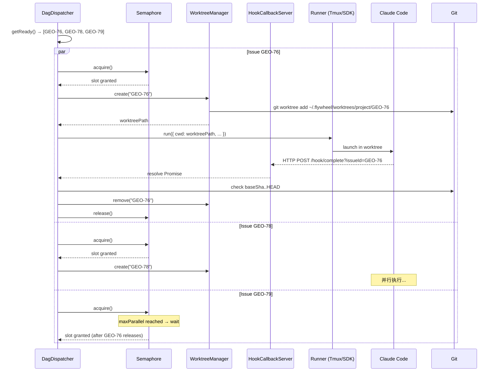
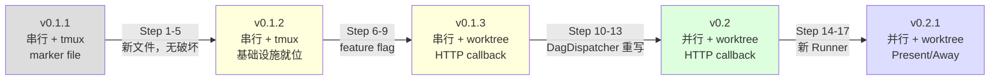
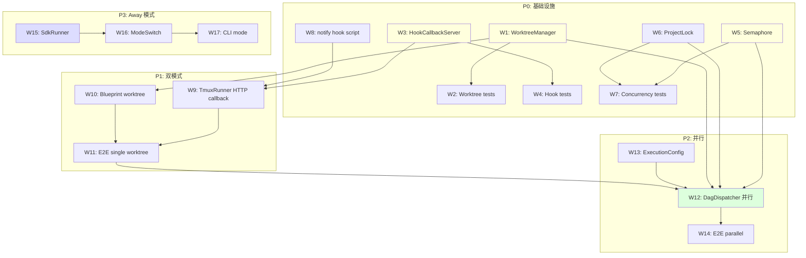

# Exploration: v0.2 并行执行架构

## 背景

Flywheel v0.1.1 是**串行执行**架构：DagDispatcher 逐个执行 issue，共用一个代码目录，用 `assertCleanTree()` 确保不冲突。这在 MVP 阶段是正确的——简单、可验证。但 CEO 的目标是**连续自主执行**，意味着 DAG 中多个无依赖 issue 应该并行跑，充分利用 AI 和硬件资源。

**v0.2 目标**：

1. 每个 issue 在独立的 git worktree 中执行——消除共享代码目录的竞争条件
2. 支持最大 N 个并行 session（可配置）
3. Hook 从 marker file 升级为 HTTP callback——支持多 session 回调复用
4. Present/Away 模式切换——用户在场时 tmux 可见，离开时 SDK 高效执行

**核心参考**：

| 来源 | 文件 | 复用内容 |
|------|------|----------|
| superset-ai | `apps/desktop/src/lib/trpc/routers/workspaces/utils/git.ts` | `createWorktree`, `removeWorktree`, `isWorktreeRegistered`, rename trick |
| superset-ai | `apps/desktop/src/main/lib/workspace-init-manager.ts` | Per-project mutex, job lifecycle |
| superset-ai | `apps/desktop/src/main/lib/agent-setup/` | HTTP callback hook 注入 |
| ruflo | `v2/src/sdk/session-forking.ts` | Claude Code SDK `forkSession` 并行执行 |

## 1. Architecture Overview

```mermaid
graph TB
    subgraph "Flywheel Orchestrator"
        DAG[DagDispatcher<br/>concurrency: N]
        WM[WorktreeManager]
        HK[HookCallbackServer<br/>localhost:PORT]
        SEM[Semaphore<br/>maxParallel: N]
        MODE[ModeSwitch<br/>Present / Away]
    end

    subgraph "Per-Issue Execution (×N)"
        WT1[Git Worktree<br/>~/.flywheel/worktrees/project/GEO-76/]
        WT2[Git Worktree<br/>~/.flywheel/worktrees/project/GEO-78/]
        WT3[Git Worktree<br/>~/.flywheel/worktrees/project/GEO-79/]
    end

    subgraph "Runner (Mode-Dependent)"
        TMX[TmuxRunner<br/>Present Mode]
        SDK[SdkRunner<br/>Away Mode]
    end

    subgraph "External"
        LN[Linear API]
        GH[GitHub]
        CC[Claude Code<br/>CLI / SDK]
    end

    DAG -->|acquire| SEM
    DAG -->|getReady| LN
    SEM -->|dispatch| WM
    WM -->|create| WT1
    WM -->|create| WT2
    WM -->|create| WT3

    MODE -->|present| TMX
    MODE -->|away| SDK

    TMX -->|tmux new-window -c worktree| CC
    SDK -->|query(forkSession)| CC

    CC -->|SessionEnd hook| HK
    HK -->|resolve Promise| DAG

    WT1 -->|git push + gh pr create| GH
    WT2 -->|git push + gh pr create| GH
    WT3 -->|git push + gh pr create| GH

    WM -->|cleanup| WT1
    WM -->|cleanup| WT2
    WM -->|cleanup| WT3

    style HK fill:#ffd,stroke:#333
    style SEM fill:#dfd,stroke:#333
    style MODE fill:#ddf,stroke:#333
```

### 执行流程（时序图）



## 2. Worktree Management

### 2.1 TypeScript Interface 定义

```typescript
// packages/core/src/worktree-manager.ts

import { execFile, spawn } from "node:child_process";
import { randomUUID } from "node:crypto";
import { mkdir, rename } from "node:fs/promises";
import { dirname, join, resolve } from "node:path";
import { homedir } from "node:os";
import { promisify } from "node:util";

const execFileAsync = promisify(execFile);

// ─── 配置 ───

export interface WorktreeConfig {
  /** Worktree 根目录，默认 ~/.flywheel/worktrees */
  baseDir?: string;
  /** 创建 worktree 的 timeout（ms），默认 120s */
  createTimeoutMs?: number;
  /** 清理 worktree 的 timeout（ms），默认 10s */
  pruneTimeoutMs?: number;
}

// ─── 返回类型 ───

export interface WorktreeInfo {
  /** 项目名 */
  projectName: string;
  /** Issue ID（也是 branch 名的一部分） */
  issueId: string;
  /** Worktree 绝对路径 */
  worktreePath: string;
  /** Branch 名 */
  branch: string;
  /** 主仓库路径 */
  mainRepoPath: string;
}

export interface ExternalWorktree {
  path: string;
  branch: string | null;
  isDetached: boolean;
  isBare: boolean;
}

// ─── 接口 ───

export interface IWorktreeManager {
  /** 为一个 issue 创建 worktree */
  create(opts: {
    mainRepoPath: string;
    projectName: string;
    issueId: string;
    startPoint?: string;
  }): Promise<WorktreeInfo>;

  /** 删除 worktree（macOS 安全的 rename + background rm） */
  remove(mainRepoPath: string, worktreePath: string): Promise<void>;

  /** 检查 worktree 是否已注册 */
  isRegistered(mainRepoPath: string, worktreePath: string): Promise<boolean>;

  /** 列出所有 worktree */
  list(mainRepoPath: string): Promise<ExternalWorktree[]>;

  /** 清理所有孤儿 worktree（branch 已合并或 worktree 目录不存在） */
  pruneOrphans(mainRepoPath: string, projectName: string): Promise<string[]>;
}
```

### 2.2 路径策略

```
~/.flywheel/worktrees/
├── geoforge3d/                    ← 项目名
│   ├── flywheel-GEO-76/          ← branch: flywheel-GEO-76
│   ├── flywheel-GEO-78/
│   └── flywheel-GEO-79/
├── another-project/
│   └── flywheel-PROJ-42/
```

路径解析逻辑（移植自 superset-ai `resolve-worktree-path.ts`）：

```typescript
export function resolveWorktreePath(
  projectName: string,
  issueId: string,
  config?: WorktreeConfig,
): string {
  const baseDir = config?.baseDir
    ?? join(homedir(), ".flywheel", "worktrees");
  const branch = `flywheel-${issueId}`;
  return join(baseDir, projectName, branch);
}
```

**设计决策**：branch 名加 `flywheel-` 前缀，避免与用户手动创建的 branch 冲突。对应 superset-ai 的 author prefix 模式，但我们用固定前缀而非 Git author name——更简单、更可预测。

### 2.3 核心函数实现

以下代码从 superset-ai `git.ts` 移植，去掉了 superset-ai 特有的依赖（`simple-git`、`friendly-words`、`@superset/local-db`），保留核心逻辑。

#### `createWorktree` — 创建 worktree

```typescript
/**
 * 创建 git worktree。
 *
 * 移植自 superset-ai git.ts L452-518，关键改动：
 * - 去掉 simple-git 依赖，直接用 execFileAsync
 * - 去掉 shell env 处理（Flywheel 不在 Electron 中运行）
 * - 保留 ${startPoint}^{commit} 防止 implicit upstream tracking
 * - 保留 push.autoSetupRemote 自动设置
 * - 新增 git lock error 的友好提示
 */
export async function createWorktree(
  mainRepoPath: string,
  branch: string,
  worktreePath: string,
  startPoint = "origin/main",
  timeoutMs = 120_000,
): Promise<void> {
  try {
    // 确保父目录存在
    const parentDir = dirname(worktreePath);
    await mkdir(parentDir, { recursive: true });

    // git worktree add <path> -b <branch> <startPoint>^{commit}
    // ^{commit} 防止 implicit upstream tracking（superset-ai 的关键发现）
    await execFileAsync(
      "git",
      [
        "-C", mainRepoPath,
        "worktree", "add",
        worktreePath,
        "-b", branch,
        `${startPoint}^{commit}`,
      ],
      { timeout: timeoutMs },
    );

    // 设置 push.autoSetupRemote，首次 push 自动创建远程 branch
    await execFileAsync(
      "git",
      ["-C", worktreePath, "config", "--local", "push.autoSetupRemote", "true"],
      { timeout: 10_000 },
    );

    console.log(
      `[worktree] Created at ${worktreePath} with branch ${branch} from ${startPoint}`,
    );
  } catch (error) {
    const errorMessage = error instanceof Error ? error.message : String(error);
    const lowerError = errorMessage.toLowerCase();

    // Git lock error 友好提示（从 superset-ai 移植）
    const isLockError =
      lowerError.includes("could not lock") ||
      lowerError.includes("unable to lock") ||
      (lowerError.includes(".lock") && lowerError.includes("file exists"));

    if (isLockError) {
      throw new Error(
        `Failed to create worktree: Git repository is locked by another process. ` +
        `Wait for the other operation to complete, or manually remove the lock file ` +
        `(e.g., .git/config.lock or .git/index.lock).`,
      );
    }

    // Branch 已被其他 worktree 检出
    if (
      lowerError.includes("already checked out") ||
      lowerError.includes("is already used by worktree")
    ) {
      throw new Error(
        `Branch "${branch}" is already checked out in another worktree. ` +
        `Each branch can only be checked out in one worktree at a time.`,
      );
    }

    throw new Error(`Failed to create worktree: ${errorMessage}`);
  }
}
```

#### `removeWorktree` — 安全删除 worktree

```typescript
/**
 * 删除 git worktree。
 *
 * 移植自 superset-ai git.ts L651-708，关键技巧：
 * 1. rename() 到同文件系统的临时目录（避免 EXDEV cross-device error）
 * 2. git worktree prune 清理 git metadata
 * 3. spawn rm -rf 后台删除（不阻塞调用方）
 *
 * 为什么不用 Node.js fs.rm()：macOS 上遇到 .app bundle 的 extended attributes
 * 时 fs.rm() 会 hang。/bin/rm 是原生实现，更可靠。
 */
export async function removeWorktree(
  mainRepoPath: string,
  worktreePath: string,
): Promise<void> {
  try {
    // Step 1: Rename 到临时目录（同文件系统，原子操作）
    const tempPath = join(
      dirname(worktreePath),
      `.flywheel-delete-${randomUUID()}`,
    );
    await rename(worktreePath, tempPath);

    // Step 2: Prune git metadata
    await execFileAsync(
      "git",
      ["-C", mainRepoPath, "worktree", "prune"],
      { timeout: 10_000 },
    );

    // Step 3: 后台 rm -rf（不阻塞）
    const child = spawn("/bin/rm", ["-rf", tempPath], {
      detached: true,
      stdio: "ignore",
    });
    child.unref();
    child.on("error", (err) => {
      console.error(
        `[worktree] Failed to spawn rm for ${tempPath}:`,
        err.message,
      );
    });
    child.on("exit", (code: number | null) => {
      if (code !== 0) {
        console.error(
          `[worktree] Background cleanup of ${tempPath} failed (exit ${code})`,
        );
      }
    });
  } catch (error) {
    const code = (error as NodeJS.ErrnoException).code;

    // 目录已不存在——只需要 prune metadata
    if (code === "ENOENT") {
      try {
        await execFileAsync(
          "git",
          ["-C", mainRepoPath, "worktree", "prune"],
          { timeout: 10_000 },
        );
      } catch {
        // best effort
      }
      return;
    }

    const errorMessage = error instanceof Error ? error.message : String(error);
    throw new Error(`Failed to remove worktree: ${errorMessage}`);
  }
}
```

#### `isWorktreeRegistered` — 检查 worktree 注册状态

```typescript
/**
 * 检查给定路径的 worktree 是否在 git 中注册。
 *
 * 移植自 superset-ai git.ts L43-75。
 * 使用 --porcelain 格式解析，比 regex 更可靠。
 */
export async function isWorktreeRegistered(
  mainRepoPath: string,
  worktreePath: string,
): Promise<boolean> {
  try {
    const { stdout } = await execFileAsync(
      "git",
      ["-C", mainRepoPath, "worktree", "list", "--porcelain"],
      { timeout: 10_000 },
    );

    const expectedPath = resolve(worktreePath);
    for (const line of stdout.split("\n")) {
      if (!line.startsWith("worktree ")) continue;
      const listedPath = line.slice("worktree ".length).trim();
      if (resolve(listedPath) === expectedPath) return true;
    }
    return false;
  } catch {
    return false;
  }
}
```

#### `listExternalWorktrees` — 列出所有 worktree

```typescript
/**
 * 列出主仓库的所有 worktree。
 *
 * 移植自 superset-ai git.ts L749-793。
 * 返回 path + branch + detached/bare 状态。
 */
export async function listExternalWorktrees(
  mainRepoPath: string,
): Promise<ExternalWorktree[]> {
  const { stdout } = await execFileAsync(
    "git",
    ["-C", mainRepoPath, "worktree", "list", "--porcelain"],
    { timeout: 10_000 },
  );

  const result: ExternalWorktree[] = [];
  let current: Partial<ExternalWorktree> = {};

  for (const line of stdout.split("\n")) {
    if (line.startsWith("worktree ")) {
      if (current.path) {
        result.push({
          path: current.path,
          branch: current.branch ?? null,
          isDetached: current.isDetached ?? false,
          isBare: current.isBare ?? false,
        });
      }
      current = { path: line.slice("worktree ".length) };
    } else if (line.startsWith("branch refs/heads/")) {
      current.branch = line.slice("branch refs/heads/".length);
    } else if (line === "detached") {
      current.isDetached = true;
    } else if (line === "bare") {
      current.isBare = true;
    }
  }

  if (current.path) {
    result.push({
      path: current.path,
      branch: current.branch ?? null,
      isDetached: current.isDetached ?? false,
      isBare: current.isBare ?? false,
    });
  }

  return result;
}
```

#### `pruneOrphans` — 清理孤儿 worktree

```typescript
/**
 * 清理 Flywheel 创建的孤儿 worktree。
 *
 * 孤儿定义：
 * 1. worktree 目录已不存在但 git metadata 还在
 * 2. branch 已被合并到 main（PR merged）
 *
 * 这是 superset-ai 没有的功能——Flywheel 特有。
 */
export async function pruneOrphans(
  mainRepoPath: string,
  projectName: string,
  config?: WorktreeConfig,
): Promise<string[]> {
  const baseDir = config?.baseDir
    ?? join(homedir(), ".flywheel", "worktrees");
  const projectDir = join(baseDir, projectName);

  // 先执行 git worktree prune（清理目录不存在的 worktree）
  await execFileAsync(
    "git",
    ["-C", mainRepoPath, "worktree", "prune"],
    { timeout: 10_000 },
  );

  // 列出还存在的 Flywheel worktree
  const worktrees = await listExternalWorktrees(mainRepoPath);
  const flywheelWorktrees = worktrees.filter(
    (wt) => wt.path.startsWith(projectDir) && wt.branch?.startsWith("flywheel-"),
  );

  // 检查哪些 branch 已合并到 main
  const pruned: string[] = [];
  for (const wt of flywheelWorktrees) {
    if (!wt.branch) continue;
    try {
      const { stdout } = await execFileAsync(
        "git",
        ["-C", mainRepoPath, "branch", "--merged", "main", "--list", wt.branch],
        { timeout: 10_000 },
      );
      if (stdout.trim().length > 0) {
        // Branch 已合并，可以安全删除
        await removeWorktree(mainRepoPath, wt.path);
        await execFileAsync(
          "git",
          ["-C", mainRepoPath, "branch", "-D", wt.branch],
          { timeout: 10_000 },
        );
        pruned.push(wt.path);
      }
    } catch {
      // 跳过错误，继续清理其他 worktree
    }
  }

  return pruned;
}
```

### 2.4 WorktreeManager 完整实现

```typescript
/**
 * WorktreeManager — 整合所有 worktree 操作的 Facade。
 *
 * 与 superset-ai 的区别：
 * - superset-ai 的 worktree 函数是 module-level 导出（无状态管理）
 * - Flywheel 的 WorktreeManager 封装了项目配置 + 生命周期追踪
 */
export class WorktreeManager implements IWorktreeManager {
  private config: Required<WorktreeConfig>;
  private activeWorktrees = new Map<string, WorktreeInfo>();

  constructor(config?: WorktreeConfig) {
    this.config = {
      baseDir: config?.baseDir ?? join(homedir(), ".flywheel", "worktrees"),
      createTimeoutMs: config?.createTimeoutMs ?? 120_000,
      pruneTimeoutMs: config?.pruneTimeoutMs ?? 10_000,
    };
  }

  async create(opts: {
    mainRepoPath: string;
    projectName: string;
    issueId: string;
    startPoint?: string;
  }): Promise<WorktreeInfo> {
    const branch = `flywheel-${opts.issueId}`;
    const worktreePath = resolveWorktreePath(
      opts.projectName,
      opts.issueId,
      this.config,
    );

    // 如果 worktree 已存在且已注册，直接复用
    const registered = await isWorktreeRegistered(
      opts.mainRepoPath,
      worktreePath,
    );
    if (registered) {
      console.log(`[worktree] Reusing existing worktree at ${worktreePath}`);
    } else {
      await createWorktree(
        opts.mainRepoPath,
        branch,
        worktreePath,
        opts.startPoint ?? "origin/main",
        this.config.createTimeoutMs,
      );
    }

    const info: WorktreeInfo = {
      projectName: opts.projectName,
      issueId: opts.issueId,
      worktreePath,
      branch,
      mainRepoPath: opts.mainRepoPath,
    };

    this.activeWorktrees.set(opts.issueId, info);
    return info;
  }

  async remove(mainRepoPath: string, worktreePath: string): Promise<void> {
    await removeWorktree(mainRepoPath, worktreePath);

    // 从活跃列表移除
    for (const [id, info] of this.activeWorktrees) {
      if (info.worktreePath === worktreePath) {
        this.activeWorktrees.delete(id);
        break;
      }
    }
  }

  async isRegistered(
    mainRepoPath: string,
    worktreePath: string,
  ): Promise<boolean> {
    return isWorktreeRegistered(mainRepoPath, worktreePath);
  }

  async list(mainRepoPath: string): Promise<ExternalWorktree[]> {
    return listExternalWorktrees(mainRepoPath);
  }

  async pruneOrphans(
    mainRepoPath: string,
    projectName: string,
  ): Promise<string[]> {
    return pruneOrphans(mainRepoPath, projectName, this.config);
  }

  /** 获取当前活跃的 worktree 列表 */
  getActive(): Map<string, WorktreeInfo> {
    return new Map(this.activeWorktrees);
  }
}
```

## 3. Hook 升级方案

### 3.1 方案对比

| 维度 | v0.1.1 Marker File | v0.2 HTTP Callback |
|------|-------------------|--------------------|
| **传输机制** | `SessionEnd` hook → `echo > /tmp/flywheel/sessions/{id}.done` → `fs.watch()` | `SessionEnd` hook → `curl http://127.0.0.1:PORT/hook/complete` |
| **延迟** | ~0ms（fs.watch 几乎即时） | ~1-5ms（localhost HTTP） |
| **多 session 支持** | 全局共享一个 marker dir，session ID 区分文件名 | 一个 HTTP server 接收所有 session 回调 |
| **携带数据** | 文件内容（JSON body） | URL query params 或 POST body |
| **错误处理** | 文件写入失败 → pane_dead fallback | curl 超时/连接失败 → pane_dead fallback |
| **清理** | 需要手动清理 `/tmp/flywheel/sessions/` | 无文件残留 |
| **调试** | 检查文件存在 | 检查 HTTP server 日志 |
| **扩展性** | 只支持 `SessionEnd` 一种事件 | 支持所有 hook events（Stop, Notification 等） |
| **环境变量** | 不需要 | 需要 `FLYWHEEL_PORT` 环境变量注入 |
| **跨进程通信** | 文件系统（最简单） | HTTP（标准、可靠） |

### 3.2 superset-ai 的 HTTP Callback 实现

superset-ai 的 notify hook 模板（`templates/notify-hook.template.sh`）展示了完整的 HTTP callback 模式：

```bash
#!/bin/bash
# 从 stdin（Claude）或 $1（Codex）读取事件 JSON
if [ -n "$1" ]; then
  INPUT="$1"
else
  INPUT=$(cat)
fi

# 提取 event type
EVENT_TYPE=$(echo "$INPUT" | grep -oE '"hook_event_name"[[:space:]]*:[[:space:]]*"[^"]*"' | \
  grep -oE '"[^"]*"$' | tr -d '"')

# 跳过无法解析的事件（不默认为 Stop，防止误报）
[ -z "$EVENT_TYPE" ] && exit 0

# curl 异步通知本地 HTTP server，带超时防阻塞
curl -sG "http://127.0.0.1:${SUPERSET_PORT:-{{DEFAULT_PORT}}}/hook/complete" \
  --connect-timeout 1 --max-time 2 \
  --data-urlencode "paneId=$SUPERSET_PANE_ID" \
  --data-urlencode "tabId=$SUPERSET_TAB_ID" \
  --data-urlencode "eventType=$EVENT_TYPE" \
  > /dev/null 2>&1

exit 0
```

关键设计点：
1. **`--connect-timeout 1 --max-time 2`** — 防止 HTTP server 不可达时阻塞 Claude Code
2. **`exit 0`** — 无论 curl 成功/失败，hook 都返回成功（不影响 Claude Code 正常运行）
3. **环境变量注入** — `SUPERSET_PORT`, `SUPERSET_TAB_ID` 等通过 tmux env 或 wrapper script 注入
4. **灵活的事件解析** — 同时支持 Claude（`hook_event_name`）和 Codex（`type`）格式

### 3.3 Flywheel 移植方案

```bash
#!/bin/bash
# scripts/hooks/flywheel-notify.sh
# Flywheel agent notification hook — HTTP callback to orchestrator
# Inert when FLYWHEEL_CALLBACK_PORT is not set

[ -z "$FLYWHEEL_CALLBACK_PORT" ] && exit 0

if [ -n "$1" ]; then INPUT="$1"; else INPUT=$(cat); fi

# 提取 event type
EVENT_TYPE=$(echo "$INPUT" | grep -oE '"hook_event_name"[[:space:]]*:[[:space:]]*"[^"]*"' | \
  grep -oE '"[^"]*"$' | tr -d '"')
[ -z "$EVENT_TYPE" ] && exit 0

# 提取 session ID
SESSION_ID=$(echo "$INPUT" | grep -oE '"session_id"[[:space:]]*:[[:space:]]*"[^"]*"' | \
  grep -oE '"[^"]*"$' | tr -d '"')

# HTTP callback（异步，不阻塞 Claude Code）
curl -sG "http://127.0.0.1:${FLYWHEEL_CALLBACK_PORT}/hook/complete" \
  --connect-timeout 1 --max-time 2 \
  --data-urlencode "sessionId=${SESSION_ID}" \
  --data-urlencode "issueId=${FLYWHEEL_ISSUE_ID}" \
  --data-urlencode "eventType=${EVENT_TYPE}" \
  > /dev/null 2>&1

exit 0
```

**`claude-settings.json` 注入**（移植自 superset-ai `agent-wrappers-claude-codex-opencode.ts`）：

```typescript
// HookCallbackServer 启动时生成 settings
function generateClaudeSettings(notifyScriptPath: string): object {
  return {
    hooks: {
      SessionEnd: [
        { hooks: [{ type: "command", command: notifyScriptPath }] },
      ],
      Stop: [
        { hooks: [{ type: "command", command: notifyScriptPath }] },
      ],
      // Phase 2+ 可以增加更多 hooks
      // Notification: [{ hooks: [{ type: "command", command: notifyScriptPath }] }],
    },
  };
}
```

**TmuxRunner 启动时注入环境变量**：

```typescript
// TmuxRunner.run() 中
execFileSync("tmux", [
  "new-window",
  "-t", this.sessionName,
  "-n", windowName,
  "-c", worktreePath,
  "-e", `FLYWHEEL_CALLBACK_PORT=${this.callbackPort}`,
  "-e", `FLYWHEEL_ISSUE_ID=${issueId}`,
  "claude", "--settings", settingsPath, ...claudeArgs,
]);
```

### 3.4 建议

**v0.2 推荐**：**HTTP callback 为主，marker file 作为 fallback**。

理由：
1. HTTP callback 天然支持多 session——一个 server 处理所有回调，无需管理文件
2. HTTP callback 可以携带丰富的事件数据（event type, session ID, issue ID），marker file 只能靠文件名
3. 为 Phase 2 的 Decision Layer（Stop quality gate, Notification escalation）打基础
4. superset-ai 已在生产环境验证了这个模式的可靠性

**Fallback 保留**：如果 HTTP server 意外崩溃，pane_dead polling 仍然可以检测到 session 结束。这是 v0.1.1 已有的三层保障思路（hook → polling → timeout），只是把第一层从 marker file 升级为 HTTP。

**HookCallbackServer 实现大纲**：

```typescript
// packages/core/src/hook-callback-server.ts

import { createServer, type Server } from "node:http";
import { URL } from "node:url";
import { EventEmitter } from "node:events";

export interface HookEvent {
  sessionId: string;
  issueId: string;
  eventType: string; // "SessionEnd" | "Stop" | etc.
  timestamp: number;
}

export class HookCallbackServer extends EventEmitter {
  private server: Server;
  private port: number;

  constructor(port = 0) { // port=0 让 OS 分配随机端口
    super();
    this.port = port;
    this.server = createServer((req, res) => {
      const url = new URL(req.url ?? "/", `http://localhost:${this.port}`);

      if (url.pathname === "/hook/complete") {
        const event: HookEvent = {
          sessionId: url.searchParams.get("sessionId") ?? "",
          issueId: url.searchParams.get("issueId") ?? "",
          eventType: url.searchParams.get("eventType") ?? "",
          timestamp: Date.now(),
        };
        this.emit("hook", event);
        res.writeHead(200);
        res.end("ok");
      } else {
        res.writeHead(404);
        res.end("not found");
      }
    });
  }

  async start(): Promise<number> {
    return new Promise((resolve) => {
      this.server.listen(this.port, "127.0.0.1", () => {
        const addr = this.server.address();
        this.port = typeof addr === "object" ? addr?.port ?? 0 : 0;
        console.log(`[hook-server] Listening on 127.0.0.1:${this.port}`);
        resolve(this.port);
      });
    });
  }

  async stop(): Promise<void> {
    return new Promise((resolve) => {
      this.server.close(() => resolve());
    });
  }

  getPort(): number {
    return this.port;
  }

  /** 等待指定 session 的特定事件 */
  waitForEvent(
    sessionId: string,
    eventType: string,
    timeoutMs: number,
  ): Promise<HookEvent | null> {
    return new Promise((resolve) => {
      const timer = setTimeout(() => {
        this.removeListener("hook", handler);
        resolve(null); // timeout
      }, timeoutMs);

      const handler = (event: HookEvent) => {
        if (event.sessionId === sessionId && event.eventType === eventType) {
          clearTimeout(timer);
          this.removeListener("hook", handler);
          resolve(event);
        }
      };

      this.on("hook", handler);
    });
  }
}
```

## 4. Present/Away 模式

### 4.1 核心区别

| 维度 | Present Mode (tmux) | Away Mode (SDK) |
|------|--------------------|--------------------|
| **可见性** | 完整 TUI，用户可打字交互 | 不可见（后台进程） |
| **Runner** | TmuxRunner | SdkRunner（新） |
| **启动方式** | `tmux new-window -c worktree "claude ..."` | `query({ prompt, options: { forkSession: true } })` |
| **完成检测** | HTTP callback + pane_dead polling | `for await (const msg of query)` 自然结束 |
| **性能** | 正常（每次 spawn 新进程） | 快 10-20x（forkSession 复用初始化） |
| **适用场景** | 开发中、需要观察/介入 | 夜间批处理、大量 issue |
| **依赖** | tmux（macOS 自带或 brew） | `@anthropic-ai/claude-code` SDK（npm） |

### 4.2 ruflo Session Forking 分析

ruflo 的 `ParallelSwarmExecutor`（`v2/src/sdk/session-forking.ts`）展示了完整的 SDK 并行执行模式：

```typescript
// ruflo 核心代码（简化）
import { query, type Options } from '@anthropic-ai/claude-code';

const sdkOptions: Options = {
  forkSession: true,           // 复用 session，跳过初始化
  resume: baseSessionId,       // 从 base session 继承上下文
  model: 'claude-sonnet-4',
  maxTurns: 50,
  timeout: 60000,
  cwd: process.cwd(),
};

const forkedQuery = query({ prompt, options: sdkOptions });

// Streaming 收集结果
const messages: SDKMessage[] = [];
for await (const message of forkedQuery) {
  messages.push(message);
  if (message.type === 'assistant') {
    // 提取文本输出
  }
}
```

ruflo 的关键设计：
1. **Batch 执行**：`createBatches(configs, maxParallel)` 将 agent 分批，每批 `Promise.allSettled`
2. **Priority 排序**：critical > high > medium > low，高优先级先执行
3. **Graceful failure**：`Promise.allSettled` 确保单个 agent 失败不影响其他

### 4.3 SdkRunner 设计

```typescript
// packages/claude-runner/src/SdkRunner.ts

import { query, type Options, type SDKMessage } from "@anthropic-ai/claude-code";

export class SdkRunner implements IFlywheelRunner {
  readonly name = "claude-sdk";

  async run(request: FlywheelRunRequest): Promise<FlywheelRunResult> {
    const start = Date.now();

    const options: Options = {
      prompt: request.prompt,
      cwd: request.cwd,
      model: request.model ?? "claude-sonnet-4",
      permissionMode: request.permissionMode ?? "bypassPermissions",
      appendSystemPrompt: request.appendSystemPrompt,
      timeout: request.timeoutMs ?? 1800_000,
      // Away mode 不需要 forkSession，但可以在 Phase 3 用于 multi-agent
    };

    const q = query(options);
    const messages: SDKMessage[] = [];
    let outputText = "";

    for await (const message of q) {
      messages.push(message);
      if (message.type === "assistant") {
        const text = message.message.content
          .filter((c: any) => c.type === "text")
          .map((c: any) => c.text)
          .join("\n");
        outputText += text;
      }
    }

    return {
      success: true,
      sessionId: crypto.randomUUID(), // SDK 模式的 session ID
      durationMs: Date.now() - start,
      resultText: outputText,
      // 注意：SDK 模式可以获取 costUsd（从 messages 中提取）
      costUsd: this.extractCost(messages),
    };
  }

  private extractCost(messages: SDKMessage[]): number | undefined {
    // 从 result message 中提取 usage 信息
    const lastAssistant = messages
      .filter((m) => m.type === "assistant")
      .at(-1);
    if (!lastAssistant) return undefined;
    // SDK messages 包含 usage: { input_tokens, output_tokens }
    // 需要根据 model 计算实际费用
    return undefined; // Phase 2 实现精确计费
  }
}
```

### 4.4 模式切换逻辑

```typescript
// packages/core/src/mode-switch.ts

export type ExecutionMode = "present" | "away";

export interface ModeSwitch {
  /** 获取当前模式 */
  getMode(): ExecutionMode;

  /** 切换模式 */
  setMode(mode: ExecutionMode): void;

  /** 根据当前模式选择 Runner */
  getRunner(): IFlywheelRunner;
}

/**
 * 简单实现：手动切换。
 *
 * Phase 1: 只有 present 模式（TmuxRunner）
 * Phase 2: 支持 present/away 切换
 * Phase 3 (可选): 自动检测（tmux attach/detach 事件）
 */
export class SimpleModeSwitch implements ModeSwitch {
  private mode: ExecutionMode;
  private tmuxRunner: IFlywheelRunner;
  private sdkRunner: IFlywheelRunner;

  constructor(
    tmuxRunner: IFlywheelRunner,
    sdkRunner: IFlywheelRunner,
    initialMode: ExecutionMode = "present",
  ) {
    this.mode = initialMode;
    this.tmuxRunner = tmuxRunner;
    this.sdkRunner = sdkRunner;
  }

  getMode(): ExecutionMode { return this.mode; }

  setMode(mode: ExecutionMode): void {
    console.log(`[mode] Switching to ${mode} mode`);
    this.mode = mode;
  }

  getRunner(): IFlywheelRunner {
    return this.mode === "present" ? this.tmuxRunner : this.sdkRunner;
  }
}
```

**Phase 3 自动检测**（目前不实现，记录设计）：

```typescript
// 自动模式检测（Phase 3）
// 检测 tmux 是否有 client attached
function detectMode(sessionName: string): ExecutionMode {
  try {
    const { stdout } = execFileSync("tmux", [
      "list-clients", "-t", sessionName, "-F", "#{client_name}",
    ]);
    return stdout.trim().length > 0 ? "present" : "away";
  } catch {
    return "away"; // tmux session 不存在 = away
  }
}
```

## 5. 并发控制

### 5.1 Semaphore（并发限制）

```typescript
// packages/core/src/semaphore.ts

/**
 * 异步 Semaphore，限制最大并行任务数。
 *
 * 与 superset-ai 的 WorkspaceInitManager.projectLocks 类似，
 * 但更通用——支持 N > 1 的并发。
 */
export class Semaphore {
  private current = 0;
  private waiting: Array<() => void> = [];

  constructor(private readonly maxConcurrent: number) {
    if (maxConcurrent < 1) {
      throw new Error("maxConcurrent must be >= 1");
    }
  }

  async acquire(): Promise<void> {
    if (this.current < this.maxConcurrent) {
      this.current++;
      return;
    }
    return new Promise<void>((resolve) => {
      this.waiting.push(() => {
        this.current++;
        resolve();
      });
    });
  }

  release(): void {
    this.current--;
    if (this.waiting.length > 0) {
      const next = this.waiting.shift()!;
      next();
    }
  }

  /** 当前使用的 slot 数 */
  get used(): number { return this.current; }

  /** 等待队列长度 */
  get queueLength(): number { return this.waiting.length; }
}
```

### 5.2 Per-Project Mutex

superset-ai 的 `WorkspaceInitManager` 实现了 per-project mutex，防止同一项目的多个 git worktree 操作并发执行（git 不支持同一仓库的并发 worktree 操作）。

Flywheel 需要同样的保护：

```typescript
// packages/core/src/project-lock.ts

/**
 * Per-project mutex for git operations.
 *
 * 移植自 superset-ai WorkspaceInitManager.acquireProjectLock/releaseProjectLock。
 * 保护同一主仓库的 git worktree add/remove 不会并发执行。
 */
export class ProjectLock {
  private locks = new Map<string, Promise<void>>();
  private resolvers = new Map<string, () => void>();

  async acquire(projectId: string): Promise<void> {
    // 等待现有 lock 释放
    while (this.locks.has(projectId)) {
      await this.locks.get(projectId);
    }

    // 创建新 lock
    let resolve: () => void;
    const promise = new Promise<void>((r) => { resolve = r; });
    this.locks.set(projectId, promise);
    this.resolvers.set(projectId, resolve!);
  }

  release(projectId: string): void {
    const resolve = this.resolvers.get(projectId);
    if (resolve) {
      this.locks.delete(projectId);
      this.resolvers.delete(projectId);
      resolve();
    }
  }

  isLocked(projectId: string): boolean {
    return this.locks.has(projectId);
  }
}
```

### 5.3 资源限制

```typescript
// packages/core/src/execution-config.ts

export interface ParallelExecutionConfig {
  /** 最大并行 session 数（默认 3） */
  maxParallel: number;

  /** 每个 session 的默认超时（默认 30 分钟） */
  defaultTimeoutMs: number;

  /** 执行模式（默认 present） */
  mode: ExecutionMode;

  /** 是否在首个失败时停止调度新 issue（默认 true） */
  haltOnFirstFailure: boolean;

  /** Worktree 配置 */
  worktree: WorktreeConfig;
}

export const DEFAULT_PARALLEL_CONFIG: ParallelExecutionConfig = {
  maxParallel: 3,               // 保守起步，Mac Mini 8 cores
  defaultTimeoutMs: 30 * 60_000, // 30 min
  mode: "present",
  haltOnFirstFailure: true,      // 保留 v0.1.1 的安全策略
  worktree: {
    baseDir: undefined,          // 使用默认 ~/.flywheel/worktrees
    createTimeoutMs: 120_000,
    pruneTimeoutMs: 10_000,
  },
};
```

**为什么 maxParallel 默认为 3**：

1. **Claude Code API rate limit**：单个 API key 的并发请求有上限
2. **CPU/内存**：每个 Claude Code session 本身不太吃资源，但 git 操作、build/test 执行需要 CPU
3. **磁盘 I/O**：多个 worktree 的 git 操作会争夺磁盘带宽
4. **CEO 预算**：$5/issue × 3 并行 = $15/batch，可控范围
5. **可调**：通过配置文件调整，不硬编码

### 5.4 并行 DagDispatcher 改造

```typescript
// packages/edge-worker/src/DagDispatcher.ts (v0.2 改造方向)

export class DagDispatcher {
  private semaphore: Semaphore;
  private projectLock: ProjectLock;
  private worktreeManager: WorktreeManager;
  private hookServer: HookCallbackServer;

  async dispatch(config: ParallelExecutionConfig): Promise<DispatchResult> {
    this.semaphore = new Semaphore(config.maxParallel);

    // 启动 HTTP callback server
    const port = await this.hookServer.start();

    // 获取所有可执行的 issue
    const readyIssues = this.dag.getReady();

    // 并行执行（受 semaphore 限制）
    const promises = readyIssues.map((issue) =>
      this.executeIssue(issue, config, port),
    );

    // 等待所有完成（allSettled，不因一个失败全部 reject）
    const results = await Promise.allSettled(promises);

    await this.hookServer.stop();

    return this.summarize(results, config);
  }

  private async executeIssue(
    issue: DagNode,
    config: ParallelExecutionConfig,
    callbackPort: number,
  ): Promise<IssueBlueprintResult> {
    await this.semaphore.acquire();
    try {
      // Per-project lock for git operations
      await this.projectLock.acquire(issue.projectId);
      const worktree = await this.worktreeManager.create({
        mainRepoPath: config.worktree.mainRepoPath,
        projectName: issue.projectName,
        issueId: issue.issueId,
      });
      this.projectLock.release(issue.projectId);

      // 执行 blueprint（在 worktree 中）
      const result = await this.blueprint.run(issue, worktree.worktreePath, {
        callbackPort,
      });

      // 清理 worktree（成功时）
      if (result.success) {
        await this.projectLock.acquire(issue.projectId);
        await this.worktreeManager.remove(
          worktree.mainRepoPath,
          worktree.worktreePath,
        );
        this.projectLock.release(issue.projectId);
      }
      // 失败时保留 worktree 供检查

      return result;
    } finally {
      this.semaphore.release();
    }
  }
}
```

## 6. Migration Path: v0.1.1 → v0.2

### 阶段一：基础设施准备（不改变串行行为）

```
v0.1.1 (current) → v0.1.2 (foundation)
```

| Step | 内容 | 影响 |
|------|------|------|
| 1 | 实现 `WorktreeManager`（createWorktree, removeWorktree, isWorktreeRegistered） | 新文件，无现有代码变更 |
| 2 | 实现 `HookCallbackServer` | 新文件，不替换现有 marker file |
| 3 | 实现 `Semaphore` + `ProjectLock` | 新文件 |
| 4 | 添加 `flywheel-notify.sh` hook 脚本（HTTP callback 版） | 与现有 `flywheel-session-end.sh` 共存 |
| 5 | 单元测试：worktree 操作、hook server、semaphore | 所有测试独立 |

**验证**：`pnpm build && pnpm test` 通过，v0.1.1 行为完全不变。

### 阶段二：TmuxRunner 双模式（feature flag 切换）

```
v0.1.2 → v0.1.3 (dual mode)
```

| Step | 内容 | 影响 |
|------|------|------|
| 6 | TmuxRunner 支持 `cwd` 参数指向 worktree（不再只用 `projectRoot`） | TmuxRunner 小改 |
| 7 | TmuxRunner 支持 HTTP callback（通过 `HookCallbackServer`），保留 marker file fallback | TmuxRunner 改造 |
| 8 | Blueprint 在 `useWorktree: true` 时调用 WorktreeManager 创建 worktree | Blueprint 条件分支 |
| 9 | 集成测试：单个 issue 在 worktree 中执行 | E2E 测试 |

**验证**：`useWorktree: false`（默认）= v0.1.1 行为不变。`useWorktree: true` = 使用 worktree 隔离。

### 阶段三：并行执行（v0.2）

```
v0.1.3 → v0.2 (parallel)
```

| Step | 内容 | 影响 |
|------|------|------|
| 10 | DagDispatcher 改造：`concurrency: N` + Semaphore | DagDispatcher 重写 |
| 11 | 强制启用 worktree（并行模式下必须隔离） | 去掉 `useWorktree` flag |
| 12 | 添加 `pruneOrphans` 到 dispatch 结束的清理逻辑 | DagDispatcher 清理 |
| 13 | E2E 测试：3 个 issue 并行执行 | E2E 测试 |

**验证**：`maxParallel: 1` = v0.1.3 行为不变。`maxParallel: 3` = 真正并行。

### 阶段四：Away 模式（v0.2.1）

```
v0.2 → v0.2.1 (away mode)
```

| Step | 内容 | 影响 |
|------|------|------|
| 14 | 实现 `SdkRunner` | 新文件 |
| 15 | 实现 `ModeSwitch` | 新文件 |
| 16 | DagDispatcher 通过 ModeSwitch 选择 Runner | DagDispatcher 小改 |
| 17 | CLI 命令：`flywheel mode present/away` | CLI 扩展 |

**验证**：默认 `mode: present` = v0.2 行为不变。切换到 `away` = SDK 高效执行。

### 迁移可视化



## 7. Follow-up: Implementation Plan 任务列表

### P0（v0.1.2 — 基础设施）

| Task | 文件 | LOC | 依赖 | 描述 |
|------|------|-----|------|------|
| W1 | `packages/core/src/worktree-manager.ts` | ~200 | 无 | WorktreeManager + 底层函数（from superset-ai） |
| W2 | `packages/core/src/worktree-manager.test.ts` | ~300 | W1 | 完整 worktree 单元测试（mock execFileAsync） |
| W3 | `packages/core/src/hook-callback-server.ts` | ~100 | 无 | HookCallbackServer（HTTP callback） |
| W4 | `packages/core/src/hook-callback-server.test.ts` | ~150 | W3 | HTTP callback 测试 |
| W5 | `packages/core/src/semaphore.ts` | ~40 | 无 | 异步 Semaphore |
| W6 | `packages/core/src/project-lock.ts` | ~40 | 无 | Per-project mutex（from superset-ai） |
| W7 | `packages/core/src/semaphore.test.ts` + `project-lock.test.ts` | ~100 | W5, W6 | 并发控制测试 |
| W8 | `scripts/hooks/flywheel-notify.sh` | ~30 | 无 | HTTP callback hook 脚本（from superset-ai template） |

### P1（v0.1.3 — 双模式）

| Task | 文件 | LOC | 依赖 | 描述 |
|------|------|-----|------|------|
| W9 | `packages/claude-runner/src/TmuxRunner.ts` | ~+30 | W3, W8 | TmuxRunner 支持 HTTP callback + `--settings` 注入 |
| W10 | `packages/edge-worker/src/Blueprint.ts` | ~+20 | W1 | Blueprint worktree 条件分支 |
| W11 | E2E 测试 | ~100 | W9, W10 | 单 issue worktree 集成测试 |

### P2（v0.2 — 并行执行）

| Task | 文件 | LOC | 依赖 | 描述 |
|------|------|-----|------|------|
| W12 | `packages/edge-worker/src/DagDispatcher.ts` | 重写 | W5, W6, W1 | 并行 DagDispatcher（Semaphore + WorktreeManager） |
| W13 | `packages/core/src/execution-config.ts` | ~30 | 无 | 并行执行配置 |
| W14 | E2E 测试 | ~200 | W12 | 多 issue 并行 E2E 测试 |

### P3（v0.2.1 — Away 模式）

| Task | 文件 | LOC | 依赖 | 描述 |
|------|------|-----|------|------|
| W15 | `packages/claude-runner/src/SdkRunner.ts` | ~80 | 无 | Claude Code SDK Runner（from ruflo pattern） |
| W16 | `packages/core/src/mode-switch.ts` | ~40 | W15 | Present/Away 切换逻辑 |
| W17 | CLI 扩展 | ~30 | W16 | `flywheel mode` 命令 |

### 任务依赖图



## 8. 风险和未解决问题

### 已识别风险

| 风险 | 影响 | 缓解 |
|------|------|------|
| `@anthropic-ai/claude-code` SDK 的 `forkSession` 可能在 Away 模式下不稳定 | SdkRunner 不可用 | Away 模式是 P3 优先级，可以等 SDK 稳定后再实施；fallback 到 headless `--print` |
| 多个 worktree 的 git 操作可能产生 lock 冲突 | 创建/删除 worktree 失败 | Per-project mutex 保护（从 superset-ai 移植） |
| HTTP callback server 崩溃 | 所有 session 完成检测失效 | pane_dead polling fallback 始终存在 |
| Worktree 残留（进程崩溃后未清理） | 磁盘空间泄漏 | `pruneOrphans` 在 dispatch 前后执行 + 手动 `flywheel cleanup` 命令 |
| maxParallel 设置过高导致 API rate limit | 所有 session 同时被限流 | 默认 3，基于实际 rate limit 调整 |

### 待验证问题

1. **`claude --settings` flag 是否在 v2.1.63 可用？** — superset-ai 使用此 flag 注入自定义 settings，需要在 Flywheel 环境中验证
2. **tmux `-e` flag 注入环境变量是否被 Claude Code 继承？** — 需要 spike 验证
3. **Claude Code SDK `forkSession` 的稳定性** — ruflo 的 tests 是 mock 的，需要用真实 API key 验证
4. **多 worktree 场景下 `CLAUDE.md` 的 project scope** — Claude Code 读取 worktree 目录下的 `.claude/` 还是主仓库的？

### 超出范围（明确不做）

- **Multi-machine 执行**（R6）— 需要共识协议，复杂度过高
- **自动 Present/Away 检测**（Phase 3）— 需要 tmux 事件监听
- **forkSession 上下文共享**（ruflo 的 `sharedMemory` 参数）— SDK 不保证
- **Dynamic maxParallel 调整** — 保持静态配置，运行中不可变

## Sources

- [superset-ai git.ts](https://github.com/superset-sh/superset) — worktree management (git.ts L43-708)
- [superset-ai workspace-init-manager.ts](https://github.com/superset-sh/superset) — per-project mutex (L260-292)
- [superset-ai notify-hook.template.sh](https://github.com/superset-sh/superset) — HTTP callback hook
- [superset-ai agent-wrappers-claude-codex-opencode.ts](https://github.com/superset-sh/superset) — claude-settings.json hook injection
- [ruflo session-forking.ts](https://github.com/ruvnet/ruflo) — Claude Code SDK forkSession
- [ruflo query-control.ts](https://github.com/ruvnet/ruflo) — real-time query control (pause/resume/terminate)
- [Flywheel v0.1.1 Architecture](doc/exploration/archive/v0.1.1-interactive-runner-architecture.md)
- [Flywheel v0.1.1 Plan](doc/plan/archive/v0.1.1-interactive-runner.md)
- [Claude Code Hooks Reference](https://code.claude.com/docs/en/hooks)
