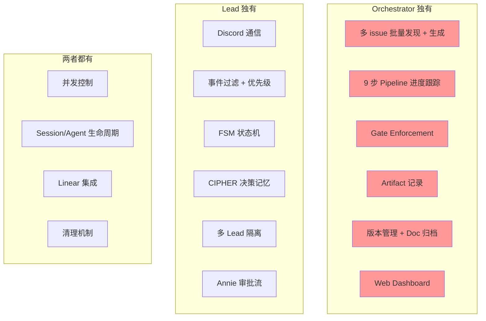
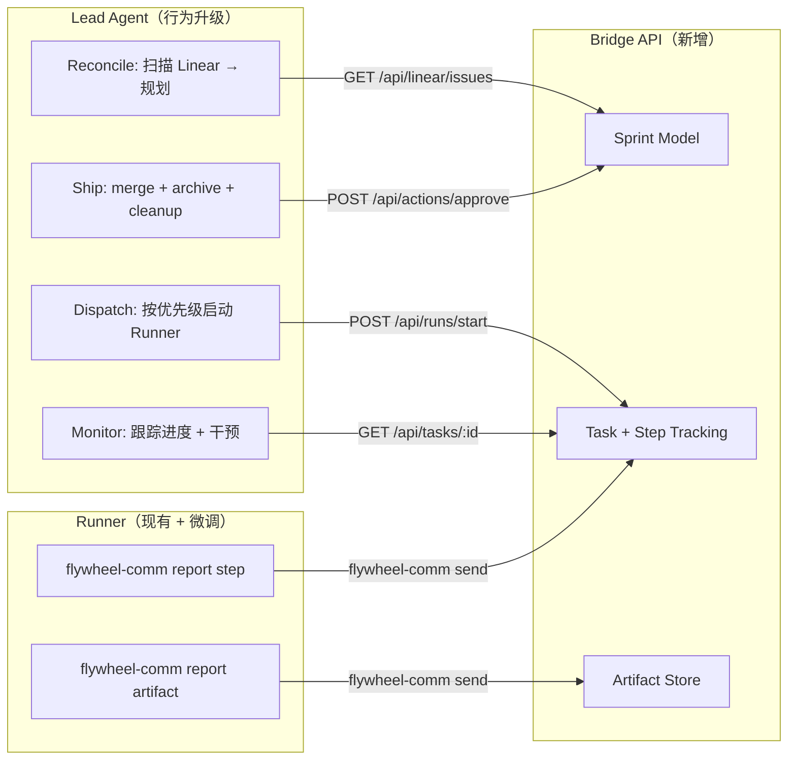
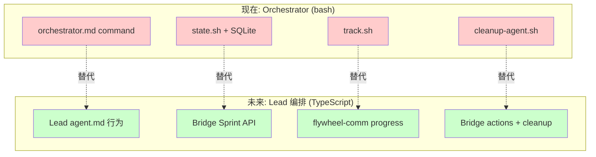

# Exploration: Flywheel 学习 Orchestrator 模式 — Lead 智能编排能力 — GEO-292

**Issue**: GEO-292 (Flywheel 学习 Orchestrator 模式)
**Date**: 2026-03-30
**Status**: Draft

---

## 1. Background

GeoForge3D 的 `.claude/orchestrator/` 是一套 **bash + SQLite 本地编排系统**，可以：
- 自动扫描 Linear issue → spawn 多个 Claude Code agent（worktree 隔离）
- 跟踪 9 步 `/spin` pipeline 进度（gate enforcement）
- 管理并发（MAX_CONCURRENT_AGENTS=5，mkdir-based locking）
- 记录 artifact（PR、commit、codex review、docs）
- 原子性版本管理（version bump with lock）
- 完成后自动清理（worktree removal + branch deletion）

Flywheel 作为产品，目标是将这些模式 **融入 Lead 体系**，通过 Discord + Bridge API 实现，而非本地 bash 脚本。

## 2. 现有能力对比

### 2.1 Orchestrator（bash + SQLite）

| 能力 | 实现 | 代码位置 |
|------|------|----------|
| Issue 发现 | Linear MCP → `list_issues` | `orchestrator.md` Reconcile Loop |
| Agent 生成 | `git worktree add` + `Agent(team_name=...)` | `orchestrator.md` Claim & Spawn |
| 进度跟踪 | `agent_steps` 表（9 步 pipeline） | `state.sh` + `track.sh` |
| Gate enforcement | 前置步骤必须 completed/skipped | `track.sh` gate action |
| 并发控制 | SQLite agents 表计数 + mkdir lock | `config.sh` MAX_CONCURRENT_AGENTS |
| Artifact 记录 | `artifacts` 表（PR/commit/review/doc） | `state.sh` add_artifact |
| 版本管理 | `doc/VERSION` 原子 bump with lock | `config.sh` bump_feature_version |
| 清理 | worktree rm + branch -D + lock release | `cleanup-agent.sh` |
| Dashboard | Python web UI on port 9474 | `dashboard.py` |
| Ship gate | 等 Annie 确认 → 才 merge + archive | `orchestrator.md` Ship Gate |

### 2.2 Lead 体系（Bridge API + Claude Code agent）

| 能力 | 实现 | 代码位置 |
|------|------|----------|
| 启动 Runner | `POST /api/runs/start` | `runs-route.ts` |
| 并发查询 | `GET /api/runs/active` | `runs-route.ts` |
| 状态 action | approve/reject/defer/retry/shelve/terminate | `actions.ts` |
| Session 监控 | StateStore + getActiveSessions | `StateStore.ts` |
| Stale 巡检 | `POST /api/patrol/scan-stale` | `plugin.ts` |
| 日报 | StandupService v2（系统状态 + 完成列表） | `standup-service.ts` |
| Linear 代理 | `GET/POST /api/linear/issues`, `create-issue`, `update-issue` | `plugin.ts` |
| Lead scope | 按 label 路由到对应 Lead | `lead-scope.ts` |
| 事件过滤 | EventFilter classify → notify/skip | `EventFilter.ts` |
| Discord 通信 | ClaudeDiscordRuntime → control channel | `claude-discord-runtime.ts` |
| tmux 可见性 | `GET /api/sessions/:id/capture` | `session-capture.ts` |

### 2.3 Gap 分析



**关键 Gap**（Orchestrator 有，Lead 缺）：

1. **多 issue 批量编排**: Orchestrator 一次 reconcile 可以发现 N 个 issue 并行 spawn。Lead 目前只能手动一次启动一个 Runner。没有 "扫描 backlog → 自动 spawn" 的能力。

2. **Pipeline 进度跟踪**: Orchestrator 有 `agent_steps` 表跟踪 brainstorm → research → plan → implement → review → ship。Lead 只知道 session 的最终状态（running/completed/failed），无法回答 "这个 Runner 现在在第几步？"。

3. **Gate Enforcement**: Orchestrator 阻止 step 5 在 step 4 未完成时执行。Lead 没有这个层面的控制——Runner 自行执行 /spin，Lead 无法插入 gate。

4. **Artifact 追踪**: Orchestrator 记录每次 codex review 的结果、PR 号、doc 路径。Lead 只通过 Discord 消息感知 Runner 产出，没有结构化存储。

5. **Post-merge 生命周期**: Orchestrator 明确定义 ship → archive docs → update MEMORY → update Linear → cleanup。Lead 没有这个 "收尾" protocol。

## 3. 设计方案

### 方案 A: Bridge API 全面扩展

将 orchestrator 的状态管理全部移入 Bridge API（TypeScript + SQLite），Lead 通过 HTTP 调用。

**新增 Bridge 端点**：
- `POST /api/sprints/start` — 创建 sprint，扫描 Linear backlog
- `GET /api/sprints/:id/tasks` — 查看 sprint 中的任务
- `POST /api/tasks/:id/step` — 更新 Runner pipeline 进度
- `POST /api/tasks/:id/artifact` — 记录 artifact
- `GET /api/tasks/:id/gate` — 检查 gate condition

**优点**: 最 robust，数据持久化，多 Lead 共享状态
**缺点**: 工程量大（~15+ 新端点），与现有 StateStore session 模型重叠

### 方案 B: Lead 直接调用 Orchestrator bash

将 orchestrator bash 命令加入 Lead TOOLS.md，Lead 通过 `bash` 工具执行。

```
# Lead TOOLS.md
## Orchestrator Commands
- `bash state.sh create_agent ...` — 创建 agent 记录
- `bash track.sh <id> start <step>` — 更新步骤进度
```

**优点**: 零代码改动，复用现有实现
**缺点**: 耦合 bash，不适合远程 Lead，sqlite3 并发问题（Lead + multiple Runners），没有 API 层校验

### 方案 C: 混合方案 — Bridge 轻量 Sprint 模型 + Lead 行为升级

Bridge 新增 **Sprint 和 Task 追踪**（轻量，不重复 StateStore）。Lead agent.md 升级为 **智能编排行为**。Runner 通过 flywheel-comm 报告 pipeline 进度。



**优点**: 增量开发（不推翻现有），Lead 有结构化 API 可调用，Runner 报告进度 through existing flywheel-comm
**缺点**: 中等工程量

### 方案 D: 纯 Agent 行为升级（无代码改动）

只修改 Lead agent.md，加入编排 pattern，依赖 Lead 的 "智能" 来跟踪状态（通过 Discord 对话历史 + Bridge API 查询）。

**优点**: 零代码改动
**缺点**: 状态丢失（Lead restart = 失忆），无结构化追踪，不可 audit

## 4. 推荐方案: C（混合）分阶段实施

### Phase 1: Lead 编排行为 + Runner 进度报告（最小可行）

**目标**: Lead 获得 "triage → prioritize → dispatch → monitor" 循环。

1. **Runner pipeline hook**（flywheel-comm 扩展）
   - Runner 在 /spin 每步开始/结束时通过 flywheel-comm 发 `step_started`/`step_completed` 消息
   - Lead 收到 inbox 消息，了解 Runner 在第几步
   - 实现: `/spin` skill 内嵌 `flywheel-comm send` 调用

2. **Lead agent.md 编排行为**
   - 新增 "Sprint 编排" 行为章节
   - Reconcile loop: 定期检查 Bridge `GET /api/runs/active` + `GET /api/linear/issues`
   - Dispatch 策略: 按优先级选择 issue → `POST /api/runs/start`
   - Monitor 策略: 查看 Runner inbox 消息 → 汇总到 Discord

3. **Post-merge protocol**（Lead agent.md）
   - Runner PR 完成 → Lead 通知 Annie
   - Annie approve → Lead 调用 `POST /api/actions/approve`
   - Lead 执行 archive docs + update MEMORY + update Linear

**工程量**: ~2-3 天
**交付物**: agent.md 更新 + flywheel-comm 微调 + /spin hook

### Phase 2: Bridge Sprint Model（结构化追踪）

**目标**: 持久化 sprint 状态，支持 dashboard 和 audit。

1. **Bridge 新增 Sprint/Task 表**
   - `sprints`: id, name, started_at, status
   - `sprint_tasks`: sprint_id, issue_id, lead_id, runner_session_id, current_step, status
   - `task_artifacts`: task_id, type, value, metadata

2. **Bridge 新增端点**
   - `POST /api/sprints` — 创建 sprint
   - `GET /api/sprints/:id` — sprint 状态
   - `PATCH /api/sprints/:id/tasks/:task_id` — 更新 task step
   - `POST /api/sprints/:id/tasks/:task_id/artifacts` — 记录 artifact

3. **Dashboard 集成**
   - 现有 dashboard-data.ts 扩展 sprint 视图

**工程量**: ~3-5 天
**依赖**: Phase 1 完成

### Phase 3: 自动 Reconcile + Gate Enforcement（全自动）

**目标**: Lead 定时扫描 Linear，自动分配 Runner，gate 控制。

1. **Reconcile cron**（类似 standup launchd）
   - 定期触发 Lead reconcile（Bridge 端点 or Lead PostCompact hook）

2. **Gate enforcement**
   - Bridge 校验 step 前置条件
   - Lead 遵守 gate（不在 plan 完成前启动 implement）

3. **Version management**
   - Bridge 端点做 atomic version bump

**工程量**: ~3-5 天
**依赖**: Phase 2 完成

## 5. Phase 1 技术细节

### 5.1 Runner Pipeline 进度报告

目前 `/spin` skill 执行 brainstorm → research → plan → implement → review → PR。在每步之间插入 `flywheel-comm send`：

```bash
# /spin 内部（伪代码）
flywheel-comm send --to lead --type step_started --step brainstorm
# ... execute brainstorm ...
flywheel-comm send --to lead --type step_completed --step brainstorm --artifact "doc/exploration/new/GEO-XX.md"

flywheel-comm send --to lead --type step_started --step research
# ... execute research ...
```

**flywheel-comm 消息格式扩展**：
```json
{
  "type": "pipeline_progress",
  "step": "brainstorm",
  "status": "completed",
  "artifact": "doc/exploration/new/GEO-292.md",
  "timestamp": "2026-03-30T04:30:00Z"
}
```

Lead 通过 inbox hook 接收，汇总为进度视图。

### 5.2 Lead 编排行为模板

```markdown
## Sprint 编排

### Reconcile（每次收到 Annie 指令或系统事件时）
1. 查询 Bridge: `GET /api/runs/active` → 获取当前 Runner 数量
2. 查询 Bridge: `GET /api/linear/issues?state=started&project=...` → 获取 backlog
3. 比对: 已有 active session 的 issue 排除
4. 按优先级排序剩余 issue
5. 如果 running < maxConcurrentRunners，调用 `POST /api/runs/start` 启动新 Runner

### Monitor
- 定期检查 inbox（flywheel-comm）获取 Runner 进度
- Runner 卡住 >2h → 检查 tmux capture → 决定是否干预
- Runner 完成 → 通知 Annie 审批

### Ship Protocol
Annie 说 "ship" / "approve" → 按顺序：
1. `POST /api/actions/approve` — merge PR + close tmux
2. 在 main repo: `git mv` docs → archive
3. 更新 MEMORY.md
4. 更新 Linear issue status → Done
5. 向 Annie 汇报完成
```

### 5.3 与现有 Orchestrator 的关系



**过渡策略**: Orchestrator 不删除，Phase 1 先实现 Lead 行为 + progress reporting。Phase 2 引入 Bridge Sprint Model 后，orchestrator bash 脚本可以废弃。两者不冲突——orchestrator 管 Claude Code team agents，Lead 编排管 Flywheel Runners。

## 6. Scope 与边界

### In Scope
- Lead 获得 "扫描 backlog → 优先排序 → 启动 Runner" 能力
- Runner 向 Lead 报告 pipeline 步骤进度
- Lead 执行 post-merge lifecycle（archive + MEMORY + Linear）
- Lead agent.md 编排行为规范

### Out of Scope（Phase 1）
- Web dashboard for sprint tracking（Phase 2）
- 自动 reconcile cron（Phase 3）
- Gate enforcement（Phase 3）
- 版本管理自动化（Phase 3）
- 跨 Lead 任务 rebalancing（远期）

## 7. 风险与 Mitigation

| 风险 | 影响 | Mitigation |
|------|------|------------|
| Lead context window 溢出（太多 Runner 状态） | Lead 失去 context → 行为退化 | PostCompact hook 已有（GEO-285），增加 sprint 状态压缩策略 |
| Runner /spin 未插入 progress hook | Lead 看不到进度 | /spin skill 统一修改，不依赖 Runner 自行报告 |
| flywheel-comm message 丢失 | Lead 进度信息缺失 | CommDB 已有 WAL mode，inbox hook 已有 retry |
| 多 Lead 争抢同一 issue | 重复 Runner 启动 | Bridge `POST /api/runs/start` 已有 409 去重 |
| Annie 不在 → PR 堆积 | Runner 资源浪费 | 现有 stale patrol + standup 已覆盖提醒 |

## 8. 决策点（需 Annie 确认）

1. **Phase 1 优先级**: 是先做 Runner progress reporting（技术基建），还是先做 Lead 编排行为（agent.md 升级）？推荐：先做行为升级（agent.md），progress reporting 作为增强。

2. **哪个 Lead 负责编排**: Simba（CoS，全局视角）还是每个 Lead 各自编排？推荐：Simba 做全局 triage + dispatch，Peter/Oliver 各自 monitor 自己的 Runner。

3. **orchestrator bash 退役时间线**: Phase 2 完成后废弃，还是长期并行？推荐：Phase 2 完成后 orchestrator 归档为 reference。

## 9. 下一步

1. ~~Brainstorm~~ ← 本文档
2. Research: 分析 flywheel-comm 消息扩展可行性 + /spin skill 改造范围
3. Plan: Phase 1 implementation plan
4. Implement → Code Review → PR
