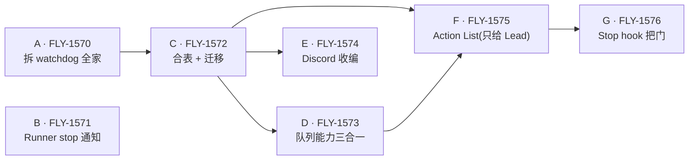

# 消息层重构(messaging rework)

Issue: FLY-1569 (https://linear.app/geoforge3d/issue/FLY-1569/消息层重构-07-high-level-design-落地成文档并合进-main)
日期: 2026-07-31
基于: design.md

**[design.md](./design.md) 是本次重构的权威设计文档。** 下面 7 个实施单全部引用它 —— 动手前先把 design.md 读完,尤其是 §1 两条铁律和 §8 三条防 watchdog 红线。

本 README 只做索引和指路,**不新增任何设计判断**;凡与 design.md 有出入的,以 design.md 为准。

## 一句话说清在改什么

v1 的消息层有四条流(founder→Lead、Lead→Lead、Runner→Lead、Lead→Runner),四套语义各写各的。重构把它们收敛成**一张 mailbox 表 + 一个投递循环**,收件人靠 `to_agent` 区分;最后一公里(适配器 + JSON/socket + 官方 poller)一行不改。

真正要治的病:重投被做成了「复制一份新行」,于是 `ack 慢 → watchdog 催 → 新建一行 → 表膨胀 → 更慢` 自激。新设计里重投是「同一条消息重新变可见」(SQS visibility timeout 的做法),行数不涨。

## 7 个实施单

| 批次 | 单 | Linear | 标题 | 依赖 |
| -- | -- | -- | -- | -- |
| 1 | A | [FLY-1570](https://linear.app/geoforge3d/issue/FLY-1570) | 拆 watchdog 全家 | — |
| 1 | B | [FLY-1571](https://linear.app/geoforge3d/issue/FLY-1571) | Runner stop 通知(带停的原因) | — |
| 1 | C | [FLY-1572](https://linear.app/geoforge3d/issue/FLY-1572) | 合表 + 迁移:两张信箱表并成一张 mailbox | A |
| 2 | D | [FLY-1573](https://linear.app/geoforge3d/issue/FLY-1573) | 队列能力三合一:租约重投 + 合批投递 + 死信闸 | C |
| 2 | E | [FLY-1574](https://linear.app/geoforge3d/issue/FLY-1574) | Discord 收编:不再直推,统一走 mailbox | C |
| 3 | F | [FLY-1575](https://linear.app/geoforge3d/issue/FLY-1575) | Action List:建 task 表(只给 Lead) | C、D |
| 3 | G | [FLY-1576](https://linear.app/geoforge3d/issue/FLY-1576) | Stop hook 出口把门 | F |

字母 A–G 与 design.md §10 实施单索引一一对应。

### 依赖图

A 和 B 无依赖,可以并起来干;C 等 A;批次 2 的 D、E 都只等 C,彼此独立;F 等 C 和 D;G 等 F。

## 每个单落在设计的哪一节

| 单 | 主要依据 design.md 的 |
| -- | -- |
| A 拆 watchdog 全家 | §8 三条防 watchdog 红线、§7 出口把门(替代 watchdog) |
| B Runner stop 通知 | §5 Lead 与 Runner 的职责差异(停的原因五选一) |
| C 合表 + 迁移 | §2 目标架构、§3 mailbox 状态机 |
| D 队列能力三合一 | §4 投递循环每 tick 的逻辑、§6 死信闸 |
| E Discord 收编 | §0 四条流对照表、§2 目标架构 |
| F Action List | §3 task 状态机、§5 只给 Lead 建 task |
| G Stop hook 把门 | §7 出口把门、§8 红线③ 合法出口 |

## 本期明确不做

见 design.md §9:优先级排序逻辑、折叠/去重逻辑、消息分类、DAG 对接、把 Action List 推广到 Runner。**这些是有意识留的口子,实施单里不要顺手做掉。**

另有一条明确接受的风险(design.md §5):本期不覆盖 Runner「ack 了但其实没办」的漏。

## 改设计的规矩

design.md 是权威。实施过程中若发现设计本身需要偏离:**先改 design.md、同步回 FLY-1569 issue,再改代码。** 不要让代码和文档各说各话,也不要在实施单里私下改口径。
