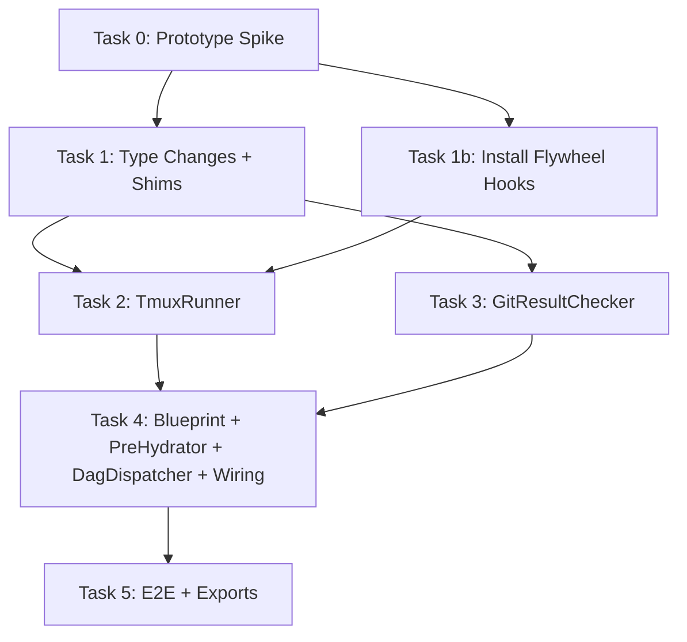

# Plan: Interactive Runner — Headless → tmux Interactive Mode

## Context

PR #3 merged the Flywheel core loop (DAG → Blueprint → ClaudeCodeRunner → GitHub PR) using headless `claude --print` mode. Exploration 002 (approved) identified that this doesn't meet the CEO's requirement: **每个 issue 一个可见的 Claude Code session，用户能看到过程、能打字交互**.

This plan converts the Runner layer from headless to interactive tmux-based sessions, following the design principle: **"TypeScript does minimal dispatch, Claude Code interactive session does all real work"** (Ralph pattern).

**What stays**: DagResolver, LinearGraphBuilder, ConfigLoader — untouched.
**What changes**: ClaudeCodeRunner → TmuxRunner, Blueprint simplified, PreHydrator minimal, FlywheelRunnerRegistry updated.
**Net effect**: ~200 LOC reduction (simpler architecture).

### Phase 1 Product Contract (Explicit)

**Phase 1 success = at least one new git commit on the working branch.** Blueprint checks `commitCount > 0` (via `GitResultChecker`). The `filesChanged` field is informational only — a commit with zero net diff (e.g., a revert) is still treated as success. The system prompt instructs Claude to also create branches, push, create PRs, and verify CI, but Blueprint does **not** verify these post-conditions in Phase 1. This is a deliberate scope narrowing from the headless mode (which deterministically ran `git push` + `gh run list`). Post-condition verification (PR exists, CI green, Linear state updated) is deferred to Phase 2 Decision Layer.

### Interactive Mode Guardrail Changes

| Guardrail | Headless (`--print`) | Interactive (tmux) | Notes |
|-----------|---------------------|-------------------|-------|
| `maxCostUsd` | Enforced via `--max-budget-usd` | **Not supported** | `--max-budget-usd` requires `--print` |
| `maxTurns` | Enforced via `--max-turns` | **Not supported** | `--max-turns` flag does not exist in Claude CLI v2.1.63. Deferred to future CLI update or prompt-based workaround |
| `timeoutMs` | Process kill | tmux window kill | TmuxRunner enforces |
| `permissionMode` | Supported | Supported | `--permission-mode` flag |
| Budget tracking | `costUsd` in JSON output | **Not available** | `costUsd` made optional |

### Hooks Integration Strategy (v0.1.1 Scope)

Claude Code [Hooks](https://code.claude.com/docs/en/hooks) provide lifecycle events that fire at specific points during a session. Instead of polling tmux `pane_dead` to detect session completion, Flywheel installs a **`SessionEnd` hook** that writes a completion marker — turning completion detection from polling into an event-driven flow.

**v0.1.1 scope** (minimal, proven-first):

| Hook | Type | Purpose | Mechanism |
|------|------|---------|-----------|
| `SessionEnd` | command | **Completion detection** | Write marker file → `fs.watch()` resolves TmuxRunner Promise |

**Deferred to Phase 2+** (documented in exploration):

| Hook | Purpose | Phase |
|------|---------|-------|
| `Stop` (type: agent) | Quality gate — verify tests pass before Claude stops | Phase 2 |
| `Notification` (permission_prompt) | Forward to Decision Layer → Slack | Phase 2 |
| `SessionStart` (compact) | Re-inject `.flywheel/` memory after compaction | Phase 3 |
| `PostToolUse` (Bash: git commit) | Real-time commit tracking → memory | Phase 3 |
| `PreToolUse` / `PermissionRequest` | CIPHER auto-approve known-safe actions | Phase 4 |
| `TeammateIdle` / `TaskCompleted` | Multi-agent coordination | Phase 5 |

**Hook installation**: Flywheel installs a global hook script in `~/.claude/settings.json` that is **inert by default** — it only acts when Flywheel's marker directory (`/tmp/flywheel/sessions/`) exists. This avoids modifying per-project settings and is safe for non-Flywheel Claude Code sessions.

**Fallback guarantee**: If the hook fails to fire (e.g., Claude Code version mismatch, hook disabled), TmuxRunner falls back to `pane_dead` polling. The dual-path design ensures no hard dependency on hooks in v0.1.1.

**Phase 1 serial execution**: DagDispatcher runs issues one-at-a-time (`concurrency: 1`). Combined with `assertCleanTree()` preflight and halt-on-first-failure, this eliminates shared-repo race conditions without worktrees. Phase 2 will introduce `git worktree` for parallel execution.

**Phase 2 improvement** (Round 5 Issue #3): For concurrent dispatch, the global `/tmp/flywheel/sessions/` marker dir must be replaced with run-scoped dirs (e.g., `/tmp/flywheel/<run-id>/sessions/`) passed via environment variable. Phase 1 serial execution is safe with the global dir.

## Reference

- Exploration: `doc/exploration/new/v0.1.1-interactive-runner-architecture.md`
- Prior plan: `doc/plan/archive/v0.1.0-core-loop.md`
- Ralph patterns: `doc/reference/ralph-patterns.md`
- Claude Code Hooks: `https://code.claude.com/docs/en/hooks`
- Current runner: `packages/claude-runner/src/ClaudeCodeRunner.ts`
- Current blueprint: `packages/edge-worker/src/Blueprint.ts`

## Design Review History

- Round 1: Codex flagged 8 issues (tmux lifecycle, git baseline, shared-repo conflicts, PR/CI regression, build-green sequencing, sessionId overloading, compile-time checks, missing prototype). All accepted or partially accepted.
- Round 2: Codex flagged 6 issues (cwd missing, runner wiring, sessionId still inconsistent, completion vs failure-preservation conflict, PR/CI regression too far, spike doesn't test commits). All accepted or partially accepted.
- Round 3: Codex flagged 3 issues (request.sessionId resume semantics, eager tmux hard dependency, timeoutMs not per-request). All accepted.
- Round 4: Codex confirmed Round 3 resolved. Flagged 3 new issues (exception not caught in Blueprint, window_name not stable ID, maxTurns not passed). All accepted.
- Round 5 (hooks update): Codex flagged 6 issues. 5 accepted (git dirty-tree preflight, atomic hook install, success definition inconsistency, spike reuse Task 1b script, run-scoped marker dir noted for Phase 2). 1 partially accepted (repo isolation — Phase 1 serial is safe, worktree deferred to Phase 2).
- Round 6: Codex flagged 2 issues (timeout kills window conflicting with inspect policy, model/allowedTools not forwarded). Both accepted.
- Round 7: Codex flagged arg order (options must precede prompt in `claude` CLI) and timeout error path losing tmuxWindow. Fixed: options-before-prompt in buildClaudeArgs, timeout resolves instead of rejects.

---

## Task 0: Prototype Spike — tmux + Claude Code + git

**Goal**: Validate the core operational assumption before touching orchestration code. The exploration doc itself calls for this prototype.

**Create**: `scripts/spike-tmux-runner.sh` (~50 LOC)

**What the spike proves**:
1. Can we create/target a named tmux session programmatically?
2. Does `claude "prompt"` launch interactive TUI inside a tmux window?
3. Can the user attach and interact with the session?
4. Does `remain-on-exit` + `pane_dead` detection work for completion?
5. Does Claude actually commit, and does `git rev-list --count baseSha..HEAD` detect it?
6. Does `--session-id <uuid>` work in interactive mode?
7. Does a `SessionEnd` hook fire when Claude exits and can it write a marker file?

**Script outline** (spike must include commit to prove git detection):
```bash
#!/bin/bash
SESSION="flywheel-spike"
WINDOW="SPIKE-001"
CLAUDE_SESSION_ID=$(uuidgen | tr '[:upper:]' '[:lower:]')

# 1. Create tmux session
tmux has-session -t "$SESSION" 2>/dev/null || tmux new-session -d -s "$SESSION"

# 2. Capture git baseline
BASE_SHA=$(git rev-parse HEAD)
echo "Baseline SHA: $BASE_SHA"

# 3. Set remain-on-exit so failed panes stay visible
tmux set-option -t "$SESSION" remain-on-exit on

# 4. Launch Claude in new window WITH cwd and session-id
tmux new-window -t "$SESSION" -n "$WINDOW" -c "$(pwd)" \
  "claude --session-id $CLAUDE_SESSION_ID \
    'Create a branch spike-test, add spike-test.txt with hello flywheel, commit, then exit.'"

echo "Claude session ID: $CLAUDE_SESSION_ID"
echo "Attach with: tmux attach -t $SESSION"

# 5. Set up SessionEnd hook marker directory
MARKER_DIR="/tmp/flywheel/sessions"
mkdir -p "$MARKER_DIR"
echo "Hook marker directory: $MARKER_DIR"

# 6. Poll for completion: hook marker OR pane_dead (dual-path)
echo "Waiting for Claude process to exit (hook marker OR pane_dead)..."
while true; do
  # Primary: check for hook-written marker file
  if ls "$MARKER_DIR"/*.done 1>/dev/null 2>&1; then
    echo "Completion detected via SessionEnd hook marker!"
    DETECTED_VIA="hook"
    break
  fi
  # Fallback: check pane_dead
  PANE_DEAD=$(tmux list-panes -t "$SESSION:$WINDOW" -F '#{pane_dead}' 2>/dev/null)
  if [ "$PANE_DEAD" = "1" ] || [ -z "$PANE_DEAD" ]; then
    echo "Completion detected via pane_dead polling"
    DETECTED_VIA="pane_dead"
    break
  fi
  sleep 3
done

# 6. Check git result
NEW_COMMITS=$(git rev-list --count "$BASE_SHA"..HEAD 2>/dev/null || echo 0)
FILES_CHANGED=$(git diff --shortstat "$BASE_SHA"..HEAD 2>/dev/null)
echo "Result: $NEW_COMMITS new commits"
echo "Files: $FILES_CHANGED"

# 7. Get exit status
EXIT_STATUS=$(tmux list-panes -t "$SESSION:$WINDOW" -F '#{pane_dead_status}' 2>/dev/null || echo "unknown")
echo "Claude exit status: $EXIT_STATUS"

# 8. Cleanup: kill window if successful, leave if failed
if [ "$NEW_COMMITS" -gt 0 ]; then
  echo "SUCCESS: Commits detected. Cleaning up window."
  tmux kill-window -t "$SESSION:$WINDOW" 2>/dev/null
else
  echo "FAILURE: No commits. Window preserved for inspection."
  echo "Inspect: tmux attach -t $SESSION"
fi
```

**Success criteria**:
- Claude TUI is visible and interactive in tmux
- `--session-id` flag is accepted (no error)
- Claude creates at least 1 commit
- `git rev-list` detects the commits
- `pane_dead` transitions to `1` when Claude exits
- `SessionEnd` hook fires and writes marker file (if hooks configured)
- Failed window remains visible for inspection

**Spike hook setup** (manual, before running spike):
1. Run `scripts/install-hooks.sh` (Task 1b) to install the Flywheel SessionEnd hook.
2. If hook fires, `DETECTED_VIA` will be `hook`. If not, `pane_dead` fallback works.
3. Either path is acceptable for the spike — hooks are an optimization, not a requirement.

**If spike fails**: Investigate `claude --tmux` flag, or fall back to simple window-disappear detection. Document findings before proceeding.

**Commit**: `spike: validate tmux + Claude Code + git detection flow`

---

## Task 1: Type Changes + Compatibility Shims

Make `costUsd` optional in `FlywheelRunResult`, AND update all current consumers to handle `undefined` — ensuring the repo stays compilable.

**Modify**: `packages/core/src/flywheel-runner-types.ts`

Add `label` field to `FlywheelRunRequest` for display/naming purposes (not overloading `sessionId`):

```typescript
export interface FlywheelRunRequest {
  // ... existing fields ...
  /** Session ID for resuming a previous session (headless mode only) */
  sessionId?: string;
  /** Human-readable label for UI display (e.g., issue ID "GEO-101") */
  label?: string;
  // ...
}

export interface FlywheelRunResult {
  success: boolean;
  /** Total API cost in USD (unavailable in interactive mode) */
  costUsd?: number;
  /** Claude session ID — for resume in headless mode, UUID in interactive mode */
  sessionId: string;
  /** tmux target — format "session:@window_id" e.g. "flywheel:@42" (only set by TmuxRunner) */
  tmuxWindow?: string;
  durationMs?: number;
  numTurns?: number;
  resultText?: string;
}
```

**Resume semantics (clarified)**:
- **Headless mode** (`ClaudeCodeRunner`): `request.sessionId` → `claude --resume <id>`. Resume supported.
- **Interactive mode** (`TmuxRunner`): `request.sessionId` is **ignored**. Resume is not supported in Phase 1. TmuxRunner always starts a fresh session with a new UUID via `--session-id`. Window naming uses `request.label` (e.g., issue ID).

**Also modify** (compatibility — keep build green):
- `packages/edge-worker/src/Blueprint.ts`: change `totalCost += implResult.costUsd` → `totalCost += implResult.costUsd ?? 0`; same for fix cost accumulation
- `packages/edge-worker/src/DagDispatcher.ts`: change `totalCostUsd += result.costUsd` → `totalCostUsd += result.costUsd ?? 0`
- `packages/edge-worker/src/Blueprint.ts` `BlueprintResult`: `costUsd` → `costUsd?: number`

**Type assertion** (in compiled source, not test):
```typescript
// packages/core/src/flywheel-runner-types.ts — bottom of file
const _typeCheck = {
  success: true,
  sessionId: "test",
  // costUsd intentionally omitted — must compile
} satisfies FlywheelRunResult;
```

**Tests**: All existing tests pass unchanged (they already provide `costUsd` values).

**Commit**: `refactor: make costUsd optional + add tmuxWindow field to FlywheelRunResult`

---

## Task 1b: Install Flywheel Hooks

Create a hook installation script and the SessionEnd hook handler. The hook is installed globally in `~/.claude/settings.json` but is **inert** unless Flywheel's marker directory exists.

**Create**: `scripts/install-hooks.sh` (~30 LOC)
**Create**: `scripts/hooks/flywheel-session-end.sh` (~15 LOC)

### Hook Handler: `flywheel-session-end.sh`

```bash
#!/bin/bash
# Flywheel SessionEnd hook — writes completion marker for TmuxRunner.
# Inert when Flywheel is not running (marker dir absent).
MARKER_DIR="/tmp/flywheel/sessions"
[ -d "$MARKER_DIR" ] || exit 0

INPUT=$(cat)
SESSION_ID=$(echo "$INPUT" | jq -r '.session_id')
CWD=$(echo "$INPUT" | jq -r '.cwd')

# Write completion marker with session metadata
echo "$INPUT" > "$MARKER_DIR/$SESSION_ID.done"
```

### Installation Script: `install-hooks.sh`

```bash
#!/bin/bash
set -euo pipefail
# Install Flywheel hooks into ~/.claude/settings.json (atomic write, Round 5 Issue #4)
SETTINGS="$HOME/.claude/settings.json"
HOOK_SCRIPT="$(cd "$(dirname "$0")" && pwd)/hooks/flywheel-session-end.sh"

# Ensure hook script is executable
chmod +x "$HOOK_SCRIPT"

# Read existing settings (or empty object)
if [ -f "$SETTINGS" ]; then
  EXISTING=$(cat "$SETTINGS")
  # Validate existing JSON
  if ! echo "$EXISTING" | jq empty 2>/dev/null; then
    echo "ERROR: $SETTINGS is not valid JSON. Backup and fix manually." >&2
    exit 1
  fi
else
  EXISTING="{}"
  mkdir -p "$(dirname "$SETTINGS")"
fi

# Merge Flywheel hooks (preserves existing hooks) → write to temp file
TMPFILE=$(mktemp "${SETTINGS}.XXXXXX")
trap 'rm -f "$TMPFILE"' EXIT

echo "$EXISTING" | jq --arg cmd "$HOOK_SCRIPT" '
  .hooks.SessionEnd //= [] |
  if (.hooks.SessionEnd | map(select(.hooks[]?.command == $cmd)) | length) == 0
  then .hooks.SessionEnd += [{"hooks": [{"type": "command", "command": $cmd}]}]
  else .
  end
' > "$TMPFILE"

# Validate output before atomic move
if ! jq empty "$TMPFILE" 2>/dev/null; then
  echo "ERROR: Generated settings JSON is invalid. Aborting." >&2
  exit 1
fi

mv "$TMPFILE" "$SETTINGS"
trap - EXIT
echo "Flywheel hooks installed in $SETTINGS"
```

**Design decisions**:
- **Global hook, not per-project**: Avoids modifying target project's `.claude/settings.local.json`. The hook is safe globally because it exits immediately when the marker directory is absent.
- **Idempotent install**: Running `install-hooks.sh` multiple times won't duplicate the hook entry.
- **jq dependency**: Required for JSON parsing in hooks. Already a dependency for the spike script.
- **No uninstall needed for v0.1.1**: Hook is inert when Flywheel isn't running.

**Tests**: Manual verification during spike (Task 0). Automated test in Task 2 (TmuxRunner mocks the marker file).

**Commit**: `feat: add Flywheel SessionEnd hook for event-driven completion detection`

---

## Task 2: Implement `TmuxRunner`

New `IFlywheelRunner` that manages tmux session lifecycle and launches Claude Code in a named window.

**Create**: `packages/claude-runner/src/TmuxRunner.ts` (~160 LOC)
**Create**: `packages/claude-runner/test/TmuxRunner.test.ts` (~200 LOC)
**Modify**: `packages/claude-runner/src/index.ts` (add export)

### tmux Session Bootstrap + Lifecycle

The runner manages a **dedicated tmux session** (`flywheel` by default, configurable). It does NOT assume a session already exists.

**Completion detection** (dual-path):
- **Primary**: `SessionEnd` hook writes marker file → `fs.watch()` resolves Promise (event-driven, ~0 latency)
- **Fallback**: `remain-on-exit` + `pane_dead` polling every 5s (works even if hooks are disabled/broken)

Both paths converge to the same result: TmuxRunner knows the session ended, then Blueprint checks git for success/failure.

```typescript
import { watch } from "node:fs";
import { existsSync, mkdirSync } from "node:fs";

type ExecFileFn = (cmd: string, args: string[]) => { stdout: string };

const MARKER_DIR = "/tmp/flywheel/sessions";

class TmuxRunner implements IFlywheelRunner {
  readonly name = "claude-tmux";
  private preflightDone = false;

  constructor(
    private sessionName: string = "flywheel",
    private execFileFn: ExecFileFn = defaultExecFile,
    private pollIntervalMs: number = 5000,
    private defaultTimeoutMs: number = 1800000, // 30 min
  ) {
    // NOTE: No constructor preflight. tmux check is lazy (in run()).
    // This allows TmuxRunner to be registered in environments without tmux
    // as long as it's never actually called (Round 3 Issue #2).
  }

  async run(request: FlywheelRunRequest): Promise<FlywheelRunResult> {
    // Lazy preflight: check tmux on first run, not at construction time
    if (!this.preflightDone) {
      this.execFileFn("tmux", ["-V"]); // throws if tmux not installed
      this.preflightDone = true;
    }

    // Window name from label (issue ID), NOT from sessionId (Round 3 Issue #1)
    const windowName = this.sanitizeWindowName(
      request.label ?? `issue-${Date.now()}`
    );
    const claudeSessionId = crypto.randomUUID();
    const start = Date.now();

    // Per-request timeout (Round 3 Issue #3)
    const effectiveTimeoutMs = request.timeoutMs ?? this.defaultTimeoutMs;

    // Ensure marker directory exists (for SessionEnd hook)
    mkdirSync(MARKER_DIR, { recursive: true });

    // Ensure session exists (idempotent)
    this.ensureSession();

    // Enable remain-on-exit so dead panes stay visible
    this.execFileFn("tmux", [
      "set-option", "-t", this.sessionName, "remain-on-exit", "on"
    ]);

    // Build claude args (interactive mode — NO --print, NO --output-format)
    const claudeArgs = this.buildClaudeArgs(request, claudeSessionId);

    // Launch Claude in a new tmux window WITH cwd
    // Use -P -F to capture stable window_id (e.g., "@42") for reliable targeting
    const launchResult = this.execFileFn("tmux", [
      "new-window",
      "-P", "-F", "#{window_id}",  // ← returns stable unique ID (Round 4 Issue #2)
      "-t", this.sessionName,
      "-n", windowName,            // display name only (e.g., "GEO-101")
      "-c", request.cwd,           // set working directory
      "claude", ...claudeArgs,
    ]);
    const windowId = launchResult.stdout.trim(); // e.g., "@42"

    // Wait for completion: hook marker (primary) OR pane_dead (fallback)
    await this.waitForCompletion(claudeSessionId, windowId, effectiveTimeoutMs);

    return {
      success: true, // runner-level: "process completed without timeout". Task-level success determined by Blueprint via GitResultChecker
      sessionId: claudeSessionId, // real Claude session ID via --session-id
      tmuxWindow: `${this.sessionName}:${windowId}`, // stable ID, not display name
      durationMs: Date.now() - start,
    };
  }

  private buildClaudeArgs(req: FlywheelRunRequest, sessionId: string): string[] {
    // IMPORTANT: CLI syntax is `claude [options] [prompt]` — options MUST come before prompt (Round 7)
    const args: string[] = [];
    args.push("--session-id", sessionId);
    if (req.permissionMode) args.push("--permission-mode", req.permissionMode);
    if (req.appendSystemPrompt) args.push("--append-system-prompt", req.appendSystemPrompt);
    if (req.model) args.push("--model", req.model);
    if (req.allowedTools?.length) args.push("--allowed-tools", ...req.allowedTools);
    // NOTE: --max-turns flag does NOT exist in Claude CLI v2.1.63
    // NOTE: --max-budget-usd not supported in interactive mode (requires --print)
    // NOTE: request.sessionId intentionally ignored — no resume in interactive mode
    args.push(req.prompt); // prompt MUST be last positional argument
    return args;
  }

  private async waitForCompletion(
    claudeSessionId: string, windowId: string, timeoutMs: number,
  ): Promise<void> {
    const markerPath = `${MARKER_DIR}/${claudeSessionId}.done`;
    const deadline = Date.now() + timeoutMs;

    // Race: hook marker file watch vs pane_dead polling
    return new Promise<void>((resolve, reject) => {
      let resolved = false;
      const cleanup = () => { resolved = true; watcher?.close(); clearInterval(poller); clearTimeout(timer); };

      // Path 1: Watch for hook-written marker file (event-driven, ~0 latency)
      const watcher = existsSync(MARKER_DIR) ? watch(MARKER_DIR, (_, filename) => {
        if (!resolved && filename === `${claudeSessionId}.done`) {
          cleanup();
          resolve();
        }
      }) : null;

      // Path 2: Poll pane_dead as fallback (handles hook disabled/broken)
      const poller = setInterval(() => {
        if (resolved) return;
        // Also check if marker appeared (in case fs.watch missed it)
        if (existsSync(markerPath)) { cleanup(); resolve(); return; }
        try {
          const result = this.execFileFn("tmux", [
            "list-panes", "-t", windowId, "-F", "#{pane_dead}"
          ]);
          if (result.stdout.trim() === "1") { cleanup(); resolve(); }
        } catch {
          cleanup(); resolve(); // window gone entirely
        }
      }, this.pollIntervalMs);

      // Timeout — resolve (not reject) so caller gets tmuxWindow for inspection (Round 7)
      const timer = setTimeout(() => {
        if (resolved) return;
        cleanup();
        // NOTE: Do NOT kill window on timeout. Resolve normally — Blueprint checks git for success.
        // Window preserved for user inspection via tmuxWindow in the result.
        resolve();
      }, timeoutMs);
    });
  }

  private ensureSession(): void {
    try {
      this.execFileFn("tmux", ["has-session", "-t", this.sessionName]);
    } catch {
      this.execFileFn("tmux", ["new-session", "-d", "-s", this.sessionName]);
    }
  }

  private sanitizeWindowName(name: string): string {
    return name.replace(/[^a-zA-Z0-9-]/g, "-").slice(0, 50);
  }
}
```

**Key design decisions**:
- **Dual-path completion detection**: Primary = `SessionEnd` hook writes marker file, watched via `fs.watch()`. Fallback = `pane_dead` polling. This ensures no hard dependency on hooks while gaining event-driven responsiveness when hooks work.
- **`-c request.cwd`**: Sets tmux window working directory (Round 2 Issue #1)
- **`request.label` for window naming**: Issue ID (e.g., `GEO-101`) used for window name. Does NOT use `request.sessionId` (Round 3 Issue #1). Clean separation: `sessionId` = Claude resume handle, `label` = display name.
- **`crypto.randomUUID()` for Claude `--session-id`**: Real Claude session ID passed via flag, returned as `sessionId` (Round 2 Issue #3). The same UUID is used as the marker filename, so the hook and TmuxRunner agree on the identifier.
- **Lazy preflight**: `tmux -V` check runs on first `run()` call, not in constructor (Round 3 Issue #2). Allows registry to instantiate TmuxRunner without tmux being available.
- **Per-request timeout**: `request.timeoutMs ?? this.defaultTimeoutMs` (Round 3 Issue #3). Each run can override the default 30-min timeout.
- **`remain-on-exit` + `pane_dead`**: Coherent lifecycle (Round 2 Issue #4). Process exit detected, but window stays for inspection. Blueprint decides whether to kill the window based on success/failure.
- **`tmuxWindow`**: Separate field for tmux targeting, not overloading `sessionId`
- **No `--max-budget-usd`**: Explicitly unsupported in interactive mode (documented in guardrail table above)
- **Marker directory as activation signal**: `/tmp/flywheel/sessions/` dir existence tells the global hook whether Flywheel is running. TmuxRunner creates it; cleanup removes it after dispatch.

**User discovery UX**: Users can `tmux attach -t flywheel` to see all issue windows. Log output includes `tmuxWindow` field.

**Tests** (TDD, mock execFileFn):
- Does NOT check tmux in constructor (lazy preflight)
- Checks `tmux -V` on first `run()` call only
- Creates tmux session if it doesn't exist
- Reuses existing session
- Launches tmux window with `-c request.cwd`
- Uses `request.label` for window name (not `request.sessionId`)
- Falls back to timestamp-based name when no label
- Passes `--session-id <uuid>` to claude (ignores `request.sessionId`)
- Does NOT include `--print` or `--output-format`
- Includes `--permission-mode` and `--append-system-prompt`
- Passes `--model` when specified
- Passes `--allowed-tools` when specified
- Does NOT pass `--max-turns` (flag does not exist in CLI v2.1.63)
- Does NOT pass `--max-budget-usd`
- Sets `remain-on-exit on`
- Creates marker directory before launching session
- Resolves when hook marker file appears (primary path)
- Resolves when `pane_dead` = 1 (fallback path)
- Resolves when window is gone entirely (catch path)
- Checks for marker file in polling loop (in case fs.watch missed it)
- Honors `request.timeoutMs` over default timeout
- Resolves on timeout (preserves window, Blueprint detects no-commits → failure with tmuxWindow)
- Sanitizes window name
- Returns `sessionId` as UUID (same as marker filename)
- Captures `window_id` from `tmux new-window -P -F '#{window_id}'`
- Uses `window_id` (not window_name) for all polling and cleanup
- Returns `tmuxWindow` in format `session:@id`

**Commit**: `feat: add TmuxRunner — interactive Claude Code sessions in tmux windows`

---

## Task 3: Implement `GitResultChecker`

(Unchanged from Round 2 — Codex approved SHA-based approach.)

Utility to detect session results via git SHA comparison.

**Create**: `packages/edge-worker/src/GitResultChecker.ts` (~60 LOC)
**Create**: `packages/edge-worker/src/__tests__/GitResultChecker.test.ts` (~100 LOC)

**Interface**:
```typescript
interface GitCheckResult {
  hasNewCommits: boolean;
  commitCount: number;
  filesChanged: number;
  commitMessages: string[];
}

interface IGitResultChecker {
  captureBaseline(cwd: string): Promise<string>;
  check(cwd: string, baseSha: string): Promise<GitCheckResult>;
}
```

**Logic**: `captureBaseline()` → `git rev-parse HEAD`. `check()` → `rev-list --count`, `log --format=%s`, `diff --shortstat` all on `baseSha..HEAD` range.

**Git preflight** (Round 5 Issue #1+#2): `assertCleanTree(cwd: string): Promise<void>` — runs `git status --porcelain` and throws if stdout is non-empty. Called by Blueprint before `captureBaseline()` to ensure no stale staged/unstaged/untracked files pollute the session. This prevents misattribution of pre-existing changes to the Claude session.

```typescript
async assertCleanTree(cwd: string): Promise<void> {
  const result = await this.execFile("git", ["-C", cwd, "status", "--porcelain"]);
  if (result.stdout.trim().length > 0) {
    throw new Error(`Git working tree is not clean in ${cwd}. Aborting to prevent misattribution.`);
  }
}
```

**Edge cases**: baseSha === HEAD → no changes. baseSha not in history → fallback + warn. Empty repo → graceful. Dirty tree → fail fast (preflight).

**Tests** (TDD, 10 cases): baseline capture, commit detection, filesChanged, messages, no-change, force-push fallback, error handling, assertCleanTree passes on clean tree, assertCleanTree throws on staged files, assertCleanTree throws on untracked files.

**Commit**: `feat: add GitResultChecker — SHA-based session result detection`

---

## Task 4: Rewrite Blueprint + PreHydrator + DagDispatcher + Runner Wiring (Single Vertical Slice)

This is the core refactor. **All files change together in one commit** to keep the repo compilable. Now also includes runner registry wiring (Round 2 Issue #2).

### 4a: Simplify `PreHydrator`

**Modify**: `packages/edge-worker/src/PreHydrator.ts`

**Before**: `constructor(fetchIssue, readRules, projectRoot)` → 6-field HydratedContext
**After**: `constructor(fetchIssue)` → `{ issueId, issueTitle, issueDescription }`

### 4b: Rewrite `Blueprint` for Interactive Mode

**Modify**: `packages/edge-worker/src/Blueprint.ts` (249 → ~100 LOC)

**Remove**: ShellRunner, FlywheelConfig, buildPrompt(), runLint(), gitPush(), checkCI(), onSessionCreated, CI fix loop, ciRounds.
**Add**: IGitResultChecker, window cleanup logic.

**New flow**:
```typescript
async run(node, projectRoot, ctx): Promise<BlueprintResult> {
  const hydrated = await this.hydrator.hydrate(node);

  const startTime = Date.now();

  // Git preflight: fail fast if working tree is dirty (Round 5 Issue #1+#2)
  await this.gitChecker.assertCleanTree(projectRoot);
  const baseSha = await this.gitChecker.captureBaseline(projectRoot);

  const prompt = `Implement ${hydrated.issueId}: ${hydrated.issueTitle}.\n\n${hydrated.issueDescription}`;
  const systemPrompt = [
    "You are working on a Linear issue. Follow these steps:",
    "1. Read the codebase and understand the context (CLAUDE.md, relevant files).",
    "2. Implement the requested changes following TDD.",
    "3. Create a feature branch, commit your changes.",
    "4. Push the branch and create a GitHub PR.",
    "5. Verify CI passes. If CI fails, fix and push again.",
    "6. When done, exit the session.",
    "Do not ask questions — implement your best judgment.",
  ].join("\n");

  // Wrap runner.run() to convert exceptions into failed BlueprintResult (Round 4 Issue #1)
  let result: FlywheelRunResult;
  try {
    result = await runner.run({
      prompt,
      cwd: projectRoot,
      label: hydrated.issueId,
      permissionMode: "bypassPermissions",
      appendSystemPrompt: systemPrompt,
      // NOTE: maxTurns not passed — --max-turns flag does not exist in Claude CLI v2.1.63
    });
  } catch (err) {
    // tmux not installed, window creation failed, etc. (timeout no longer throws — Round 7)
    return {
      success: false,
      durationMs: Date.now() - startTime,
      error: err instanceof Error ? err.message : String(err),
    };
  }

  const gitResult = await this.gitChecker.check(projectRoot, baseSha);
  const success = gitResult.commitCount > 0; // Phase 1: commit presence = success (Round 5 Issue #5)

  // Window lifecycle: kill successful windows, preserve failed ones for inspection
  if (result.tmuxWindow) {
    if (success) {
      await this.killTmuxWindow(result.tmuxWindow);
    }
    // Failed windows stay open (remain-on-exit) for user inspection
  }

  return {
    success,
    costUsd: result.costUsd,
    sessionId: result.sessionId,
    tmuxWindow: success ? undefined : result.tmuxWindow,
    durationMs: result.durationMs,
  };
}
```

Note: `baseSha` above is simplified — in actual implementation, `captureBaseline()` returns just the SHA string. The timestamp for error-path duration can use `Date.now() - startTime` with a `startTime` captured before the try block.

**Updated `BlueprintResult`**:
```typescript
interface BlueprintResult {
  success: boolean;
  costUsd?: number;
  sessionId?: string;
  tmuxWindow?: string;
  durationMs?: number;
  error?: string; // set when runner throws (tmux missing, timeout, etc.)
}
```

**Updated `BlueprintContext`**:
```typescript
interface BlueprintContext {
  teamName: string;
  runnerName: string;
  // maxTurns removed — --max-turns flag does not exist in Claude CLI v2.1.63
}
```

**maxTurns note** (Round 5 CLI verification): `--max-turns` flag does **not** exist in Claude CLI v2.1.63. `maxTurns` is removed from `BlueprintContext` and not passed to the runner in Phase 1. If a future Claude CLI version adds this flag, it can be re-added. For now, session duration is controlled solely via `timeoutMs`.

### 4c: Update `DagDispatcher` — Remove Cost Tracking + Halt on Failure + Marker Cleanup

- Remove `totalCostUsd` from `DispatchResult`
- Halt on first failure (prevent shared-repo conflicts with preserved failed windows)
- Add `halted: boolean` to `DispatchResult`
- **Marker directory lifecycle** (Round 6): DagDispatcher creates `/tmp/flywheel/sessions/` before starting dispatch and removes it (+ all `.done` files) after dispatch completes or halts. This ensures the global hook is only active during Flywheel runs.

### 4d: Wire `TmuxRunner` into Runner Selection

**Modify**: `packages/core/src/FlywheelRunnerRegistry.ts` (or equivalent)

The `"claude"` runner name now resolves to `TmuxRunner` by default. `ClaudeCodeRunner` is available as `"claude-headless"` for CI/testing.

**Registry API change** (Round 5 Issue #2): Current `FlywheelRunnerRegistry.register(runner)` uses `runner.name` as the key. But `TmuxRunner.name = "claude-tmux"` and `ClaudeCodeRunner.name = "claude"`. To support alias registration, add a `registerAs(name, runner)` method:

```typescript
// Add to FlywheelRunnerRegistry:
registerAs(name: string, runner: IFlywheelRunner): void {
  this.runners.set(name, runner);
  if (this.defaultRunnerName === null) {
    this.defaultRunnerName = name;
  }
}
```

**Registration** (safe even without tmux — lazy preflight):
```typescript
// TmuxRunner registered under "claude" alias (not its internal name "claude-tmux")
registry.registerAs("claude", new TmuxRunner("flywheel"));
// ClaudeCodeRunner registered under "claude-headless" alias
registry.registerAs("claude-headless", new ClaudeCodeRunner());
registry.setDefault("claude"); // interactive mode is default
```

This preserves backward compatibility: `registry.register(runner)` still works using `runner.name`. The new `registerAs()` is an additive API change.

Config files that specify `runner: claude` will now get the interactive runner. Tests can explicitly use `"claude-headless"`.

### 4e: Tests

**Rewrite**: PreHydrator tests (4 cases), Blueprint tests (~200 LOC), DagDispatcher tests (add halt test).

**Blueprint tests** (TDD):
- Asserts clean git tree before anything else (preflight, Round 5)
- Throws when git tree is dirty (staged, unstaged, or untracked files)
- Hydrates issue before launching runner
- Captures git baseline after preflight
- Builds prompt with issueId + title + description
- System prompt includes branch/commit/push/PR/CI instructions
- Passes bypassPermissions and label to runner (no maxTurns — flag doesn't exist)
- Returns success when git has new commits (`commitCount > 0`)
- Returns failure when no commits
- Catches runner exceptions → returns `{ success: false, error }`
- Kills tmux window on success, preserves on failure
- Returns `tmuxWindow` only for failed sessions

All existing DAG ordering/shelving tests updated for new interfaces.

**Commit**: `refactor: rewrite Blueprint/PreHydrator/DagDispatcher for interactive mode + wire TmuxRunner`

---

## Task 5: Update E2E Tests + Wire Exports

**Modify**: `packages/edge-worker/src/__tests__/e2e-core-loop.test.ts`
**Modify**: `packages/edge-worker/src/index.ts` (export GitResultChecker)
**Modify**: `packages/claude-runner/src/index.ts` (export TmuxRunner)

Rewrite E2E mocks:
- Runner mock returns `{ success: true, sessionId: "<uuid>", tmuxWindow: "flywheel:@42", durationMs }` (format: `session:@window_id`)
- Remove `makeCIPassShell()` mock
- Add `makeGitChecker()` mock returning `GitCheckResult`
- Add `halted` field assertions

**E2E test cases**:
- Linear issue → DAG → Blueprint → runner → git has commits → success
- Linear issue → DAG → Blueprint → runner → no commits → shelve + halt
- Chain dependency order preserved
- Shelving A blocks B
- Dispatch halts on first failure

**Commit**: `test: rewrite E2E tests for interactive tmux-based pipeline`

---

## Task Dependency Graph



**Build-green guarantee**: Each task/commit leaves the repo compilable and tests passing.

- Task 0: standalone script, no impact on codebase
- Task 1: compatibility shims ensure existing code compiles with optional `costUsd`
- Task 1b: standalone scripts only, no TypeScript changes
- Tasks 2, 3: new files only, no existing code changes (can run in parallel after Task 1 + 1b)
- Task 4: single commit rewrites all consumers together + wires registry
- Task 5: final wiring and E2E validation

## Summary

| Task | Files | LOC Delta | Description |
|------|-------|-----------|-------------|
| 0 | NEW `scripts/spike-tmux-runner.sh` | +60 | Prototype validation (includes commit + hook test) |
| 1 | `flywheel-runner-types.ts` + consumers | +15 | costUsd optional + tmuxWindow field + shims |
| 1b | NEW `scripts/install-hooks.sh` + `scripts/hooks/flywheel-session-end.sh` | +45 | Hook installation + SessionEnd handler |
| 2 | NEW `TmuxRunner.ts` + tests | +360 | tmux lifecycle + dual-path completion (hook + pane_dead) |
| 3 | NEW `GitResultChecker.ts` + tests | +160 | SHA-based git diff detection |
| 4 | Blueprint + PreHydrator + DagDispatcher + Registry + tests | -500 | Core refactor + runner wiring |
| 5 | E2E tests + exports | -85 | Rewire pipeline |
| **Total** | | **~+55** | **Slight net addition (hooks infrastructure)** |

## Verification

After all tasks:
1. `pnpm build` — all packages compile (verified at each task boundary)
2. `pnpm test` — all tests pass (verified at each task boundary)
3. `pnpm typecheck` — type assertions pass
4. Manual: run `scripts/install-hooks.sh` — verify hook appears in `~/.claude/settings.json`
5. Manual: run spike script to validate tmux + Claude + git + hook flow
6. Manual: run Flywheel against a test Linear issue, verify:
   - tmux session `flywheel` is created
   - Named window opens with Claude Code TUI (correct cwd)
   - User can `tmux attach -t flywheel` to observe/interact
   - Claude session has real `--session-id` UUID
   - Claude creates commits (system prompt instructs branch/push/PR but Blueprint does NOT verify these)
   - Blueprint detects commits via SHA comparison (`commitCount > 0` = success)
   - Successful window auto-cleaned, failed window preserved
   - SessionEnd hook writes marker → TmuxRunner resolves (or falls back to pane_dead)
   - Dispatch halts on first failure
