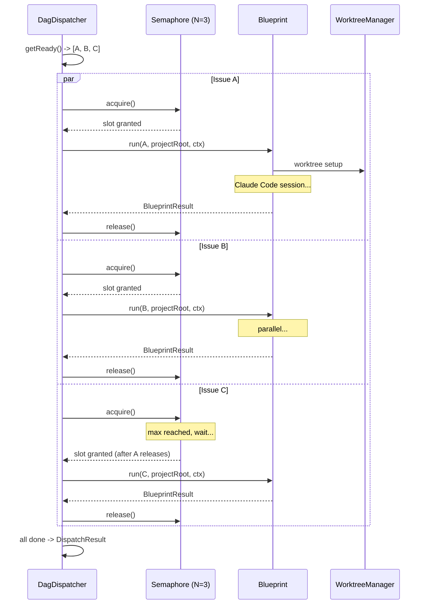
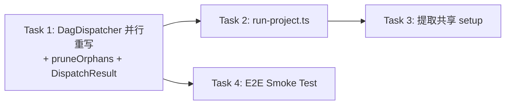

# v0.2 Step 3: Parallel Execution — Implementation Plan

> **Status**: Draft (Round 2 — addresses Codex review feedback)
> **Branch**: `feat/v0.2-step3-parallel`
> **Base**: `main`
> **Depends on**: v0.2 Step 2c (Slack Notification + Reactions)
> **Design docs**: `doc/architecture/v0.2-architecture.md` line 852-964, `doc/exploration/new/v0.2-parallel-execution.md`

### Interface Alignment Declaration

架构文档 (line 886) 使用 `dispatchAll(projectRoot)` + `result.outcome`。当前代码使用 `dispatch()` (projectRoot in constructor) + `result.success`。

**本计划采用当前代码语义**：`dispatch()` + `BlueprintResult.success`。理由：
- `BlueprintResult` 已在 7 个 PR 中稳定使用
- 架构文档是 design intent，不是 binding contract
- 改名带来的 churn 远大于收益

架构文档中不一致的 `dispatchAll`/`outcome` 将在实现完成后同步更新。

---

## 1. Goal

DagDispatcher 从串行改并行。DAG 中无依赖关系的 issues 同时开跑（最多 N 个），每个在独立 git worktree 中。完成时间从 `N * T` 降到 `~T`。

**已有基础设施（Step 1-2 已建好）**：
- `Semaphore` (`packages/core/src/Semaphore.ts`) — 异步计数信号量，FIFO
- `ProjectLock` (`packages/core/src/ProjectLock.ts`) — per-key mutex
- `WorktreeManager` (`packages/edge-worker/src/WorktreeManager.ts`) — per-issue worktree 创建/删除/清理
- `HookCallbackServer` (`packages/edge-worker/src/HookCallbackServer.ts`) — 多 session HTTP callback

**缺的**: DagDispatcher 并行 dispatch 逻辑 + 多 issue 入口脚本。

---

## 2. Architecture



### Key Design Decisions

| Decision | Choice | Rationale |
|----------|--------|-----------|
| Failure isolation | 一个 issue 失败只 shelve 自己+下游，不 halt 全部 | 并行模式下 halt-on-first-failure 不合理 |
| needs_review 路由 | markDone()，不阻塞下游 | PR 已创建，代码工作完成；CEO 审核是 merge 决策 |
| blocked 路由 | shelve() | 真正的失败，下游应该 blocked |
| Promise 清理 | `.finally()` 自动从 inflight 删除 | 不用轮询检测 settled 状态 |
| 双层状态 | `scheduled` + semaphore | 防止 `getReady()` 重复返回已入队节点 |
| onNodeComplete | semaphore release 后异步通知 | 不阻塞执行槽位 |
| 入口脚本 | 新建 `run-project.ts` | `run-issue.ts` 保留为单 issue 调试工具 |
| DispatchResult | 保持稳定，新增 optional metrics | 不破坏现有契约 |

---

## 3. Tasks (TDD)

### Task 1: DagDispatcher 并行重写 + pruneOrphans (~220 LOC impl, ~250 LOC test)

**Modify**: `packages/edge-worker/src/DagDispatcher.ts`
**Modify**: `packages/edge-worker/src/__tests__/DagDispatcher.test.ts`
**Modify**: 所有 DagDispatcher 调用点（见下方）

> Task 1 合并了原 Task 2 (DispatchResult) 和 Task 5 (pruneOrphans)，一次定型 Dispatcher API。

#### Constructor 变更

```typescript
// 当前 (串行)
constructor(
  private resolver: DagResolver,
  private blueprint: Blueprint,
  private projectRoot: string,
  private buildContext: (node: DagNode) => BlueprintContext,
  private tmuxSessionName: string = "flywheel",
)

// 新 (并行) — semaphore 有默认值保证后向兼容
constructor(
  private resolver: DagResolver,
  private blueprint: Blueprint,
  private projectRoot: string,
  private buildContext: (node: DagNode) => BlueprintContext,
  private semaphore: Semaphore = new Semaphore(1),  // 默认串行
  private tmuxSessionName: string = "flywheel",
  // Optional worktree cleanup
  private worktreeManager?: WorktreeManager,
  private projectName?: string,
)
```

**后向兼容**：`semaphore` 默认 `new Semaphore(1)` = 串行行为，现有调用点无需修改即可编译。但仍需更新以下调用点以传入正确的 semaphore：

| 调用点 | 文件 | Action |
|--------|------|--------|
| 单元测试 (8 处) | `packages/edge-worker/src/__tests__/DagDispatcher.test.ts` | 后向兼容（默认 Semaphore(1)）；可选添加 Semaphore(10) |
| E2E 测试 (2 处) | `packages/edge-worker/src/__tests__/e2e-core-loop.test.ts:167,199` | 后向兼容 |
| Smoke test | `scripts/smoke-test.ts:265` | 后向兼容 |
| run-issue.ts | `scripts/run-issue.ts` | 不使用 DagDispatcher，无需改 |

#### DispatchResult 增强

```typescript
export interface DispatchResult {
  completed: string[];
  shelved: string[];
  halted: boolean;
  // v0.2 Step 3 — optional parallel execution stats
  durationMs?: number;           // wall-clock time
  nodeResults?: Record<string, BlueprintResult>;  // plain object, not Map
}
```

> 新字段全部 optional，不破坏现有消费者。用 `Record` 而非 `Map`，方便序列化/日志输出。

#### 核心方法: `dispatch()` 重写

```typescript
async dispatch(): Promise<DispatchResult> {
  const startTime = Date.now();
  const completed: string[] = [];
  const shelved: string[] = [];
  const scheduled = new Set<string>();
  const inflight = new Map<string, Promise<void>>();
  const nodeResults: Record<string, BlueprintResult> = {};

  // Pre-dispatch worktree cleanup
  await this.pruneOrphansQuiet();

  mkdirSync(FLYWHEEL_MARKER_DIR, { recursive: true });
  this.openTmuxViewer();

  try {
    while (this.resolver.remaining() > 0) {
      const ready = this.resolver.getReady()
        .filter(n => !scheduled.has(n.id));

      if (ready.length === 0 && inflight.size > 0) {
        // Wait for at least one in-flight to complete
        await Promise.race(inflight.values());
        continue;
      }

      if (ready.length === 0) break;

      for (const node of ready) {
        scheduled.add(node.id);
        const ctx = this.buildContext(node);
        // Wrapper: auto-remove from inflight on completion
        const p = this.dispatchOne(node, ctx, completed, shelved, nodeResults)
          .finally(() => inflight.delete(node.id));
        inflight.set(node.id, p);
      }

      // Wait for any to complete → may unlock new downstream nodes
      if (inflight.size > 0) {
        await Promise.race(inflight.values());
      }
    }

    // Wait for all remaining in-flight
    if (inflight.size > 0) {
      await Promise.allSettled(inflight.values());
    }
  } finally {
    this.cleanupMarkerDir();
    // Post-dispatch worktree cleanup
    await this.pruneOrphansQuiet();
  }

  return {
    completed,
    shelved,
    halted: shelved.length > 0,
    durationMs: Date.now() - startTime,
    nodeResults,
  };
}
```

#### `dispatchOne()` — 状态决策与回调解耦

```typescript
private async dispatchOne(
  node: DagNode,
  ctx: BlueprintContext,
  completed: string[],
  shelved: string[],
  nodeResults: Record<string, BlueprintResult>,
): Promise<void> {
  await this.semaphore.acquire();

  let result: BlueprintResult;
  try {
    result = await this.blueprint.run(node, this.projectRoot, ctx);

    // Finalize resolver state FIRST (before any callback)
    if (result.success) {
      this.resolver.markDone(node.id);
      completed.push(node.id);
    } else {
      this.resolver.shelve(node.id);
      shelved.push(node.id);
    }

    nodeResults[node.id] = result;
  } catch (err) {
    // Blueprint.run() threw → shelve
    result = {
      success: false,
      error: err instanceof Error ? err.message : String(err),
    };
    this.resolver.shelve(node.id);
    shelved.push(node.id);
    nodeResults[node.id] = result;
  } finally {
    // Release semaphore BEFORE callback — don't block slot
    this.semaphore.release();
  }

  // Callback AFTER release — fire-and-forget, NOT part of dispatchOne's promise.
  // This ensures slow/hanging callbacks never block inflight settlement or dispatch loop.
  // Uses .then() chain to safely capture both sync throws and async rejections.
  if (this.onNodeComplete) {
    const nodeId = node.id;
    void Promise.resolve()
      .then(() => this.onNodeComplete!(nodeId, result))
      .catch(callbackErr => {
        console.warn(
          `[DagDispatcher] onNodeComplete error for ${nodeId} (non-fatal): ${
            callbackErr instanceof Error ? callbackErr.message : String(callbackErr)
          }`,
        );
      });
  }
}
```

**关键修复 vs Round 1**：
1. **Promise 清理**: `.finally(() => inflight.delete(node.id))` — 无需轮询检测 settled
2. **状态与回调解耦**: resolver 状态先定，release 后再通知，callback 错误不影响节点状态
3. **Semaphore release 在 callback 前**: 不阻塞执行槽位

#### `pruneOrphansQuiet()` helper

```typescript
private async pruneOrphansQuiet(): Promise<void> {
  if (!this.worktreeManager || !this.projectName) return;
  try {
    const pruned = await this.worktreeManager.pruneOrphans(
      this.projectRoot, this.projectName,
    );
    if (pruned.length > 0) {
      console.log(`[DagDispatcher] Pruned ${pruned.length} orphan worktrees`);
    }
  } catch (err) {
    console.warn(`[DagDispatcher] pruneOrphans failed (non-fatal): ${
      err instanceof Error ? err.message : String(err)
    }`);
  }
}
```

#### Tests

| # | Test | Verifies |
|---|------|----------|
| 1 | Independent nodes A, B run in parallel (timing check) | Parallel dispatch |
| 2 | Dependency chain A -> B -> C runs sequentially | DAG ordering |
| 3 | Diamond DAG: A -> B, A -> C, B+C -> D | Complex dependency |
| 4 | Node failure shelves only that node, others continue | Error isolation |
| 5 | Shelved node blocks downstream | DAG propagation |
| 6 | Semaphore(1) forces sequential execution | Semaphore integration |
| 7 | Semaphore(2) allows 2 parallel, blocks 3rd | Semaphore throttle |
| 8 | onNodeComplete fires for each node | Callback |
| 9 | onNodeComplete fires for failed nodes too | Error callback |
| 10 | onNodeComplete throws -> node state unchanged, no double-shelve | Callback isolation |
| 11 | Blueprint.run() throws -> node shelved, others continue | Exception handling |
| 12 | Empty DAG -> immediate return | Edge case |
| 13 | All nodes shelved -> halted=true, loop terminates | Termination |
| 14 | Backward compat: default Semaphore(1) produces same results as old serial | Regression |
| 15 | inflight cleanup: no busy-wait when promises settle | Promise lifecycle |
| 16 | Same node never dispatched twice (scheduled set) | Dedup under pressure |
| 17 | pruneOrphans called before and after dispatch | Worktree cleanup |
| 18 | pruneOrphans failure doesn't halt dispatch | Non-fatal cleanup |
| 19 | durationMs and nodeResults populated correctly | DispatchResult |
| 20 | Slow onNodeComplete callback doesn't block dispatch loop | Fire-and-forget callback |
| 21 | Sync-throwing onNodeComplete doesn't crash dispatch | Sync throw safety |

**Commit**: `feat(edge-worker): rewrite DagDispatcher for parallel execution`

---

### Task 2: run-project.ts — 多 Issue 入口脚本 (~150 LOC)

**Create**: `scripts/run-project.ts`

```
Usage:
  npx tsx scripts/run-project.ts <project-name> <project-root> [--max-parallel N] [--issue-ids ID1,ID2,...]

Examples:
  npx tsx scripts/run-project.ts geoforge3d ~/Dev/GeoForge3D
  npx tsx scripts/run-project.ts geoforge3d ~/Dev/GeoForge3D --max-parallel 2
  npx tsx scripts/run-project.ts geoforge3d ~/Dev/GeoForge3D --issue-ids GEO-95,GEO-96,GEO-97
```

#### Flow

```typescript
// 1. Parse args
const projectName = args[0];
const projectRoot = args[1];
const maxParallel = parseInt(getFlag('--max-parallel') ?? '3');
const issueIds = getFlag('--issue-ids')?.split(',');

// 2. Build DAG
let nodes: DagNode[];
if (issueIds) {
  nodes = issueIds.map(id => ({ id, blockedBy: [] }));
} else {
  const builder = new LinearGraphBuilder(linearClient, projectId);
  nodes = await builder.build();
}
const resolver = new DagResolver(nodes);

// 3. Initialize shared components (from scripts/lib/setup.ts)
const components = await setupComponents({ projectRoot, tmuxSessionName, projectName });

// 4. Create DagDispatcher with Semaphore
const semaphore = new Semaphore(maxParallel);
const dispatcher = new DagDispatcher(
  resolver, components.blueprint, projectRoot, buildContext, semaphore,
  tmuxSessionName, components.worktreeManager, projectName,
);

// 5. Wire onNodeComplete for logging + async Slack notifications
dispatcher.onNodeComplete = async (nodeId, result) => {
  log(`[${nodeId}] ${result.success ? 'DONE' : 'SHELVED'}`);
  // Fire-and-forget Slack notification (don't block dispatch)
  if (components.slackNotifier && result.decision) {
    const route = result.decision.route;
    if (route === 'needs_review' || route === 'blocked') {
      components.slackNotifier.notify(/* ... */).catch(err =>
        console.warn(`[Slack] Notification failed for ${nodeId}: ${err.message}`)
      );
    }
  }
};

// 6. Dispatch
log(`Dispatching ${nodes.length} issues (max parallel: ${maxParallel})`);
const dispatchResult = await dispatcher.dispatch();

// 7. Report
log('\n--- Dispatch Summary ---');
log(`  completed: ${dispatchResult.completed.join(', ') || '(none)'}`);
log(`  shelved:   ${dispatchResult.shelved.join(', ') || '(none)'}`);
log(`  duration:  ${((dispatchResult.durationMs ?? 0) / 1000).toFixed(1)}s`);

// 8. Cleanup
await teardownComponents(components);
```

#### Slack 通知策略

`onNodeComplete` 中的 Slack 通知使用 fire-and-forget（`.catch()` 记录日志），不 `await`。这确保：
- Slack rate limit 不阻塞下一个 issue 的 dispatch
- Slack API 故障不影响执行流

#### 与 run-issue.ts 的关系

- `run-issue.ts` 保留不变 — 单 issue 调试工具
- `run-project.ts` 是新的批量入口 — 多 issue 并行
- 共享组件初始化逻辑提取到 `scripts/lib/setup.ts`（Task 3）

**Tests**: Manual E2E

**Commit**: `feat: add run-project.ts — multi-issue parallel dispatch entry point`

---

### Task 3: 提取共享初始化逻辑 (~100 LOC refactor)

**Create**: `scripts/lib/setup.ts`
**Modify**: `scripts/run-issue.ts` — 导入共享 setup
**Modify**: `scripts/run-project.ts` — 导入共享 setup

```typescript
// scripts/lib/setup.ts

export interface FlywheelComponents {
  hookServer: HookCallbackServer;
  worktreeManager: WorktreeManager;
  skillInjector: SkillInjector;
  evidenceCollector: ExecutionEvidenceCollector;
  decisionLayer: DecisionLayer;
  blueprint: Blueprint;
  slackNotifier?: SlackNotifier;
  interactionServer?: SlackInteractionServer;
  reactionsEngine?: ReactionsEngine;
}

export async function setupComponents(opts: {
  projectRoot: string;
  tmuxSessionName: string;
  projectName: string;
  projectRepo?: string;
}): Promise<FlywheelComponents> {
  // Extract all initialization logic from run-issue.ts
}

export async function teardownComponents(c: FlywheelComponents): Promise<void> {
  await c.hookServer.stop();
  if (c.interactionServer) await c.interactionServer.stop();
}
```

**Commit**: `refactor: extract shared component setup into scripts/lib/setup.ts`

---

### Task 4: E2E Smoke Test (~100 LOC)

**Create**: `packages/edge-worker/src/__tests__/parallel-dispatch-e2e.test.ts`

```typescript
describe('Parallel Dispatch E2E', () => {
  it('dispatches 3 independent issues with Semaphore(2)', async () => {
    // Mock Blueprint takes 100ms per node
    // 3 independent nodes: A, B, C, Semaphore(2)
    // Verify: total time ~200ms (not 300ms), all completed
  });

  it('diamond DAG with parallel middle layer', async () => {
    // A -> B, A -> C, B+C -> D, Semaphore(3)
    // Verify: A first, B+C parallel, D last
  });

  it('failure in one branch does not affect other branch', async () => {
    // A -> B (B fails), C -> D (independent)
    // Verify: B shelved, C+D completed
  });

  it('onNodeComplete callback error does not affect dispatch', async () => {
    // onNodeComplete throws for node A
    // Verify: A still in completed, B runs normally
  });
});
```

**Commit**: `test(edge-worker): add E2E smoke tests for parallel dispatch`

---

## 4. Environment Variables

| Variable | Required | Default | Description |
|----------|----------|---------|-------------|
| `FLYWHEEL_MAX_PARALLEL` | No | `3` | Max concurrent sessions |
| All existing vars from Step 2c | — | — | Slack, Anthropic, etc. |

---

## 5. Task Dependency Graph



Linear path: T1 -> T2 -> T3 -> T4

---

## 6. NOT in Scope

| Feature | Why |
|---------|-----|
| SdkRunner (Away Mode) | Phase 2+ — 需要 Claude Code SDK |
| Auto-retry (failed -> retry) | v0.2.1+ — Auto-Loop |
| ProjectLock integration | 当前只支持单 project |
| Slack summary (dispatch 完成后发总结) | Nice-to-have，不是 must-have |

---

## 7. Risk Mitigation

| Risk | Impact | Mitigation |
|------|--------|------------|
| Promise 泄漏 | inflight map 无限增长 | `.finally()` 自动清理，无需手动检测 settled |
| 并发 Slack notification | Rate limit | fire-and-forget `.catch()`，不阻塞 dispatch |
| onNodeComplete 异常 | 状态污染 | callback 在 resolver 状态确定后执行，独立 try/catch |
| Worktree 创建竞争 | git lock error | WorktreeManager 已有 lock 处理 + Blueprint try/catch |
| DagResolver 并发安全 | Race condition | JS 单线程 + markDone/shelve 在 await 点之间，safe |
| 多 tmux window 同时打开 | 用户界面混乱 | tmux session 本身支持多 window |

---

## 8. Success Criteria

1. 3 个无依赖 issue 并行跑完，wall-clock 时间 ~= 单个 issue 时间（而非 3x）
2. DAG 依赖顺序正确（A->B->C 串行，A|B 并行）
3. 一个 issue 失败不影响其他无关 issue
4. onNodeComplete 异常不影响 dispatch 流程
5. `pnpm build && pnpm test` 全绿
6. `run-project.ts` 可从命令行执行多 issue

---

## 9. Summary

| Task | Files | LOC (impl) | LOC (test) | Tests |
|------|-------|-----------|-----------|-------|
| 1. DagDispatcher 并行重写 + pruneOrphans + DispatchResult | 2 modify | ~220 | ~270 | 21 |
| 2. run-project.ts | 1 new | ~150 | — | manual |
| 3. 提取共享 setup | 1 new, 2 modify | ~100 | — | — |
| 4. E2E Smoke Test | 1 new | — | ~100 | 4 |
| **Total** | **3 new, 4 modify** | **~470** | **~350** | **23** |

---

## 10. Codex Review Changelog

### Round 1 -> Round 2

| # | Issue | Fix |
|---|-------|-----|
| 1 | inflight Promise 清理逻辑死循环/忙等 | 改用 `.finally(() => inflight.delete(id))` 自动清理 |
| 2 | onNodeComplete 异常导致状态污染/double-shelve | resolver 状态先定 -> semaphore release -> 独立 try/catch callback |
| 3 | 构造函数变更不后向兼容 | `semaphore` 默认 `new Semaphore(1)`；列出所有调用点 |
| 4 | DispatchResult 扩展与架构约束冲突 + Map | 新字段全部 optional；用 `Record` 替代 `Map` |
| 5 | Slack rate limit 风险（callback 占 semaphore slot） | release 在 callback 前；Slack 用 fire-and-forget |
| 6 | Task 拆分过碎，重复改动 | 合并 Task 1+2+5 为单个 Task 1，一次定型 API |
| 7 | 测试缺少并发边界用例 | 新增 #10 callback 隔离、#15 busy-wait、#16 dedup 压力、#17-18 pruneOrphans |
| 8 | 与架构文档接口语义不一致 | 添加 Interface Alignment Declaration 明确采用代码语义 |

### Round 2 -> Round 3

| # | Issue | Fix |
|---|-------|-----|
| 1 | callback await 阻塞 inflight settlement | 改为 `void Promise.resolve(onNodeComplete(...)).catch(...)` fire-and-forget |
| 2 | 调用点清单不完整 | 补齐 smoke-test.ts:265, e2e-core-loop.test.ts:167,199 |
| 7补 | 缺少慢 callback 测试 | 新增 test #20: slow callback doesn't block dispatch |

### Round 3 -> Round 4

| # | Issue | Fix |
|---|-------|-----|
| 1 | `Promise.resolve(callback())` 无法捕获同步 throw | 改为 `Promise.resolve().then(() => callback())` 链式调用 |
| — | 补测试 | 新增 test #21: sync-throwing callback doesn't crash dispatch |
