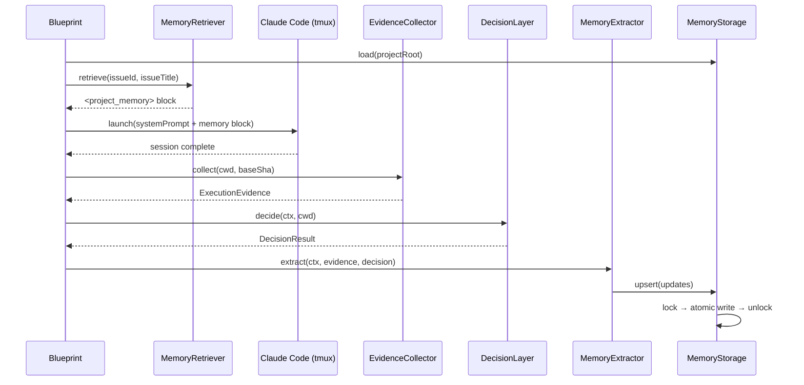
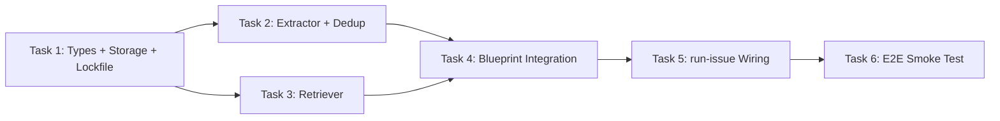

# v0.3 Step 1: Memory System — Implementation Plan

> **Status**: Draft (Round 2 — addresses Codex review feedback)
> **Branch**: `feat/v0.3-step1-memory`
> **Base**: `main`
> **Depends on**: v0.2 Step 2b (DecisionLayer, `LLMClient`, AnthropicLLMClient)
> **Research**: `doc/exploration/new/v0.3-memory-system.md`, `doc/research/new/005-memory-architecture-survey.md`

---

## 1. Goal

Flywheel 跑完一个 issue 后，自动从 session 中提取经验（facts + summaries），存到 `.flywheel/memory.json`。下次跑同一个 project 的 issue 时，自动将相关记忆注入到 Claude Code session 的 system prompt 中。

**双层架构**：
- **内置 Docs**（repo 内）：CLAUDE.md, doc/ — 人写 + AI 辅助，commit 进 repo
- **外置 Memory**（`.flywheel/`）：AI 自动积累，不污染 repo history（自动写入 `.git/info/exclude`）

**Phase 1 scope**: `.flywheel/memory.json`（全量注入，无向量检索）

---

## 2. Architecture



### Integration Points

Blueprint.ts 中的两个注入点：

1. **Before runner** (`run()` line ~147): 注入 memory → `appendSystemPrompt`
2. **After decision**: 提取 memory → storage
   - **`runWithDecision()` path** (line ~293, return 前): DecisionLayer 启用时
   - **`run()` v0.1.1 fallback path** (line ~220): DecisionLayer 未启用时

> **关键**: `runWithDecision()` 在 `run()` line 207 直接 `return`，因此 extraction 必须在 `runWithDecision()` 内部执行，而非在 `run()` 尾部。

---

## 3. Components

### 3.1 New Files

| File | LOC (est.) | Description |
|------|-----------|-------------|
| `packages/edge-worker/src/memory/types.ts` | ~60 | `FlywheelMemory`, `MemoryFact`, `SummarySection`, `MemoryConfig` |
| `packages/edge-worker/src/memory/MemoryStorage.ts` | ~100 | JSON 读写 + atomic write + lockfile |
| `packages/edge-worker/src/memory/MemoryExtractor.ts` | ~150 | Haiku LLM extraction + dedup + upsert (includes content hash) |
| `packages/edge-worker/src/memory/MemoryRetriever.ts` | ~60 | Format memory → system prompt block |
| `packages/edge-worker/src/memory/prompts.ts` | ~100 | MEMORY_UPDATE_PROMPT (from exploration doc) |
| `packages/edge-worker/src/memory/index.ts` | ~10 | Re-exports |
| **Tests** | | |
| `packages/edge-worker/src/__tests__/MemoryStorage.test.ts` | ~90 | |
| `packages/edge-worker/src/__tests__/MemoryExtractor.test.ts` | ~110 | |
| `packages/edge-worker/src/__tests__/MemoryRetriever.test.ts` | ~50 | |
| `packages/edge-worker/src/__tests__/memory-e2e.test.ts` | ~80 | |

**Total**: ~810 LOC (implementation ~480, tests ~330)

### 3.2 Modified Files

| File | Change |
|------|--------|
| `packages/edge-worker/src/Blueprint.ts` | Add optional `MemoryRetriever` + `MemoryExtractor` deps (appended after `decisionLayer`); inject memory into `appendSystemPrompt`; extract in both `runWithDecision()` and fallback path |
| `packages/edge-worker/src/index.ts` | Export memory module |
| `scripts/run-issue.ts` | Hoist `let llmClient` to outer scope; initialize memory components; pass to Blueprint |

---

## 4. Tasks (TDD)

### Task 1: Types + MemoryStorage (~160 LOC)

**What**: Define `FlywheelMemory` schema + JSON file read/write with atomic write + lockfile safety.

**Types** (from exploration doc S3):

```typescript
// packages/edge-worker/src/memory/types.ts

export interface FlywheelMemory {
  version: '1.0';
  projectId: string;
  lastUpdated: string;
  project: {
    codebaseContext: SummarySection;
    activeWork: SummarySection;
    recentDecisions: SummarySection;
  };
  history: {
    recentSessions: SummarySection;
    patterns: SummarySection;
    longTermContext: SummarySection;
  };
  facts: MemoryFact[];
}

export interface SummarySection {
  summary: string;
  updatedAt: string;
}

export interface MemoryFact {
  id: string;                    // "fact_" + 8 char hex
  content: string;
  category: 'pattern' | 'error' | 'preference' | 'constraint' | 'decision' | 'knowledge';
  confidence: number;            // 0.0-1.0
  contentHash: string;           // SHA256[:16]
  reinforcementCount: number;
  lastReinforcedAt: string;
  createdAt: string;
  source: { type: 'session' | 'issue' | 'manual'; id: string; issueId?: string };
}

export interface MemoryConfig {
  enabled: boolean;
  storagePath: string;           // default: ".flywheel/memory.json"
  maxFacts: number;              // default: 100
  factConfidenceThreshold: number; // default: 0.7
  maxInjectionTokens: number;    // default: 2000
}
```

**MemoryStorage** class:

```typescript
// packages/edge-worker/src/memory/MemoryStorage.ts
import { mkdirSync, writeFileSync, readFileSync, renameSync,
         existsSync, unlinkSync } from "node:fs";
import { join } from "node:path";
import { createHash } from "node:crypto";

class MemoryStorage {
  constructor(projectRoot: string, config?: Partial<MemoryConfig>)

  async load(): Promise<FlywheelMemory>
  // - Read .flywheel/memory.json
  // - If not exists -> return createEmpty(projectId)
  // - Validate version field

  async save(memory: FlywheelMemory): Promise<void>
  // - Acquire lockfile (.flywheel/memory.json.lock) with retry+backoff
  // - Atomic write: write to .tmp file -> rename
  // - mkdir -p .flywheel/ if needed
  // - Update lastUpdated timestamp
  // - Release lockfile
  // - Auto-add .flywheel/ to .git/info/exclude if not already present

  static createEmpty(projectId: string): FlywheelMemory

  /**
   * Ensure .flywheel/ is excluded from git tracking.
   * Writes to .git/info/exclude (not .gitignore) to avoid polluting repo.
   * Pattern follows SkillInjector.ensureGitExclude().
   */
  private ensureGitExclude(projectRoot: string): void
}
```

**Lockfile strategy** (addresses concurrent write):
- `save()` creates `.flywheel/memory.json.lock` before writing
- If lock exists, retry up to 3 times with 200ms backoff
- Lock file contains PID + timestamp for stale lock detection (>30s = stale)
- On save complete, remove lock file in `finally` block
- This prevents last-writer-wins data loss when parallel sessions extract memory

**Tests** (RED first):
1. `load()` returns empty memory when file doesn't exist
2. `save()` creates `.flywheel/` directory if missing
3. `save()` + `load()` roundtrip preserves data
4. `save()` is atomic (file not corrupted if process crashes mid-write)
5. `createEmpty()` returns valid schema with empty sections
6. `ensureGitExclude()` adds `.flywheel/` to `.git/info/exclude`
7. Concurrent `save()` calls don't lose data (lockfile test)

**Commit**: `feat(edge-worker): add FlywheelMemory types + MemoryStorage with lockfile`

---

### Task 2: MemoryExtractor (~250 LOC, includes dedup)

**What**: After Blueprint completes, use Haiku to extract facts + update summaries from the session. Includes content hash dedup (merged from original Task 2 — dedup is only used by extractor).

**Dependencies**: `LLMClient` (from `flywheel-core`, **not** `ILLMClient`), `MemoryStorage`

```typescript
// packages/edge-worker/src/memory/MemoryExtractor.ts
import type { LLMClient } from "flywheel-core";

// --- Content hash dedup (inlined, ~30 LOC) ---

function computeContentHash(content: string, category: string): string
// SHA256 of normalized "${category}:${content.toLowerCase().trim()}" -> first 16 hex chars

function checkDuplicate(
  content: string,
  category: string,
  existingFacts: MemoryFact[]
): { action: 'reinforce'; existingId: string } | { action: 'create'; contentHash: string }

// --- Extractor ---

class MemoryExtractor {
  constructor(
    llmClient: LLMClient,
    storage: MemoryStorage,
    config?: {
      model?: string;
      maxDiffChars?: number;
      timeoutMs?: number;  // default: 10_000 (10s)
    }
  )

  async extract(params: {
    issueId: string;
    issueTitle: string;
    issueDescription: string;
    sessionResult: 'success' | 'failure' | 'timeout';
    durationMs: number;
    commitCount: number;
    commitMessages: string[];
    diffSummary: string;
    branchName?: string;
    decisionRoute?: string;
    decisionReasoning?: string;
  }): Promise<{ factsAdded: number; factsReinforced: number; sectionsUpdated: string[] }>

  // Internal flow:
  // 1. Load current memory from storage
  // 2. Build prompt from MEMORY_UPDATE_PROMPT template
  // 3. Call Haiku LLM with AbortSignal timeout (config.timeoutMs)
  // 4. Parse JSON response
  // 5. For each newFact: checkDuplicate -> create or reinforce
  // 6. For each section with shouldUpdate=true: merge summary
  // 7. Prune facts exceeding maxFacts (lowest confidence first)
  // 8. Save updated memory
}
```

**Timeout/circuit breaker**: LLM call wrapped with `AbortSignal.timeout(config.timeoutMs)` (default 10s). On timeout or any error, extraction is skipped (non-fatal). This prevents Haiku latency spikes from blocking session completion.

**Prompt**: Use `MEMORY_UPDATE_PROMPT` from exploration doc S5 (already written, ~100 lines).

**Tests** (mock LLMClient):
1. Same content + category -> same hash (dedup unit test)
2. Different content -> different hash
3. Whitespace normalization works
4. `checkDuplicate()` finds existing fact by hash -> returns 'reinforce'
5. `checkDuplicate()` returns 'create' for new content
6. Extract from successful session -> adds facts + updates activeWork
7. Extract from failed session -> adds error fact
8. Duplicate fact -> reinforces existing (reinforcementCount++)
9. LLM returns invalid JSON -> fails gracefully (no memory corruption)
10. Facts below confidence threshold are filtered out
11. Prune works: >maxFacts -> remove lowest confidence
12. `factsToRemove` from LLM -> removes outdated facts
13. LLM timeout -> extraction skipped, no error thrown

**Commit**: `feat(edge-worker): add MemoryExtractor — Haiku-powered fact extraction with dedup`

---

### Task 3: MemoryRetriever (~60 LOC)

**What**: Before Blueprint runs Claude Code, format memory into a system prompt block.

```typescript
// packages/edge-worker/src/memory/MemoryRetriever.ts

class MemoryRetriever {
  constructor(storage: MemoryStorage, config?: { maxTokens?: number })

  async retrieve(issueId: string, issueTitle: string): Promise<string | null>
  // Returns null if memory is empty or disabled
  // Otherwise returns formatted block for appendSystemPrompt:
  //
  // <project_memory>
  // ## Project Context
  // {codebaseContext summary}
  //
  // ## Recent Decisions
  // {recentDecisions summary}
  //
  // ## Known Patterns
  // {patterns summary}
  //
  // ## Key Facts
  // - [pattern] Always run pnpm build before test
  // - [error] Flaky test in auth module — retry once
  // - [constraint] Never modify migration files after merge
  // </project_memory>

  // Token budget: prioritize by category importance:
  // 1. constraints (must-know)
  // 2. errors (avoid repeating)
  // 3. patterns (best practices)
  // 4. knowledge, preferences, decisions
}
```

**Injection target**: `appendSystemPrompt` (not user prompt). Memory is system-level context, not task content. The runner already supports `appendSystemPrompt` (`TmuxRunner.ts:163-164`).

**Phase 1**: 全量注入（no vector search）— JSON 中所有 facts + summaries 拼成一个 block。
Token budget ~2000 — 如果超出，按 priority 截断。

**Tests**:
1. Empty memory -> returns null
2. Memory with facts -> returns formatted `<project_memory>` block
3. Facts sorted by category priority (constraints first)
4. Token budget exceeded -> truncates low-priority facts
5. Summary sections included when non-empty

**Commit**: `feat(edge-worker): add MemoryRetriever — format memory for system prompt injection`

---

### Task 4: Blueprint Integration (~60 LOC)

**What**: Wire MemoryRetriever + MemoryExtractor into Blueprint.

**Blueprint.ts constructor** — append after `decisionLayer` (last position, no parameter shift risk):

```typescript
// packages/edge-worker/src/Blueprint.ts — constructor
constructor(
  private hydrator: PreHydrator,
  private gitChecker: GitResultChecker,
  private getRunner: (name: string) => IFlywheelRunner,
  private shell: ShellRunner,
  private worktreeManager?: WorktreeManager,
  private skillInjector?: SkillInjector,
  private evidenceCollector?: ExecutionEvidenceCollector,
  private skillsConfig?: SkillsConfig,
  private decisionLayer?: IDecisionLayer,
  // v0.3 — memory (appended last to avoid parameter shift)
  private memoryRetriever?: MemoryRetriever,
  private memoryExtractor?: MemoryExtractor,
) {}
```

**In `run()` — BEFORE prompt construction** (after skill injection, ~line 147):

```typescript
// ── Memory retrieval (v0.3 — best-effort, non-blocking) ─
let memoryBlock = '';
if (this.memoryRetriever) {
  try {
    memoryBlock = await this.memoryRetriever.retrieve(hydrated.issueId, hydrated.issueTitle) ?? '';
  } catch (err) {
    console.warn(
      `[Blueprint] Memory retrieval failed (non-fatal): ${err instanceof Error ? err.message : String(err)}`,
    );
  }
}
```

**Inject into systemPrompt** (not user prompt):

```typescript
// Existing systemPrompt construction (line ~149-158)
const systemPrompt = [
  "You are working on a Linear issue. Follow these steps:",
  // ... existing lines ...
  "Do not ask questions — implement your best judgment.",
  memoryBlock ? `\n${memoryBlock}` : '',
].join("\n");
```

**In `runWithDecision()` — BEFORE return** (line ~307, after decision routing):

> **Note**: `runWithDecision()` 的 `hydrated` 参数类型当前不含 `issueDescription`（line 242-248）。
> 需要扩展该类型，添加 `issueDescription: string` 字段，以匹配 `extractMemory()` 的参数需求。
> 这是安全的——`run()` 中 `this.hydrator.hydrate(node)` 返回值已包含 `issueDescription`。

```typescript
// ── Memory extraction (v0.3 — non-fatal, after decision) ─
await this.extractMemory(hydrated, evidence, result, decision);

return { success, costUsd: result.costUsd, /* ... existing ... */ };
```

**In `run()` v0.1.1 fallback path — BEFORE return** (line ~228):

```typescript
// ── Memory extraction (v0.3 — non-fatal, v0.1.1 fallback path) ─
if (evidence) {
  await this.extractMemory(hydrated, evidence, result, undefined);
}

return { success, costUsd: result.costUsd, /* ... existing ... */ };
```

**New private method** (shared by both paths):

```typescript
private async extractMemory(
  hydrated: { issueId: string; issueTitle: string; issueDescription: string },
  evidence: ExecutionEvidence,
  result: FlywheelRunResult,
  decision: DecisionResult | undefined,
): Promise<void> {
  if (!this.memoryExtractor) return;
  try {
    const extractResult = await this.memoryExtractor.extract({
      issueId: hydrated.issueId,
      issueTitle: hydrated.issueTitle,
      issueDescription: hydrated.issueDescription,
      sessionResult: decision?.route === 'blocked' ? 'failure' : result.timedOut ? 'timeout' : 'success',
      durationMs: evidence.durationMs ?? result.durationMs ?? 0,
      commitCount: evidence.commitCount,
      commitMessages: evidence.commitMessages,
      diffSummary: evidence.diffSummary ?? '',
      decisionRoute: decision?.route,
      decisionReasoning: decision?.reasoning,
    });
    console.log(`[Blueprint] Memory extraction: +${extractResult.factsAdded} facts, ~${extractResult.factsReinforced} reinforced, sections: [${extractResult.sectionsUpdated.join(', ')}]`);
  } catch (err) {
    console.warn(`[Blueprint] Memory extraction failed (non-fatal): ${err instanceof Error ? err.message : String(err)}`);
  }
}
```

**Pattern**: Follows SkillInjector pattern — optional dependency, try/catch, non-fatal on error.

**Tests** (Blueprint integration):
1. Blueprint without memory deps -> works as before (backward compat)
2. Blueprint with MemoryRetriever -> injects `<project_memory>` into systemPrompt
3. Blueprint with MemoryExtractor + DecisionLayer -> calls extract() in runWithDecision()
4. Blueprint with MemoryExtractor without DecisionLayer -> calls extract() in fallback path
5. MemoryRetriever failure -> warns but continues (non-fatal)
6. MemoryExtractor failure -> warns but continues (non-fatal)

**Commit**: `feat: integrate memory retrieval + extraction into Blueprint`

---

### Task 5: run-issue.ts Wiring (~40 LOC)

**What**: Initialize memory components in the script, conditional on config.

**Key fix**: Hoist `llmClient` declaration to outer scope so memory can reuse it.

```typescript
// scripts/run-issue.ts — hoist llmClient before the if block (~line 291)

// LLM client — shared between Decision Layer and Memory Extractor
let llmClient: LLMClient | undefined;
if (process.env.ANTHROPIC_API_KEY) {
  llmClient = new AnthropicLLMClient();
  log("LLM client initialized (shared: Decision Layer + Memory)");
} else {
  log("ANTHROPIC_API_KEY not set — LLM-dependent features disabled");
}

// Decision Layer components use llmClient (existing code, adjust to use hoisted var)
const triage = new HaikuTriageAgent(
  llmClient ?? { chat: () => { throw new Error("No ANTHROPIC_API_KEY"); } },
  llmClient ? "claude-haiku-4-5-20251001" : "",
  llmClient ? 2000 : 0,
);
const verifier = new HaikuVerifier(
  llmClient ?? { chat: () => { throw new Error("No ANTHROPIC_API_KEY"); } },
  llmClient ? "claude-haiku-4-5-20251001" : "",
);

// ... existing DecisionLayer construction ...

// 4d. Memory system — conditional on FLYWHEEL_MEMORY !== 'disabled'
let memoryRetriever: MemoryRetriever | undefined;
let memoryExtractor: MemoryExtractor | undefined;

if (process.env.FLYWHEEL_MEMORY !== 'disabled') {
  const memoryStorage = new MemoryStorage(resolvedRoot, {
    storagePath: '.flywheel/memory.json',
    maxFacts: parseInt(process.env.FLYWHEEL_MAX_FACTS ?? '100'),
  });

  memoryRetriever = new MemoryRetriever(memoryStorage);

  // Extraction requires LLM client (shared with Decision Layer)
  if (llmClient) {
    memoryExtractor = new MemoryExtractor(llmClient, memoryStorage, {
      model: process.env.FLYWHEEL_MEMORY_MODEL ?? 'claude-haiku-4-5-20251001',
    });
  }

  log('Memory system enabled' + (memoryExtractor ? ' (with extraction)' : ' (retrieval only)'));
}

// Pass to Blueprint constructor (appended at the end — no parameter shift)
const blueprint = new Blueprint(
  hydrator,
  gitChecker,
  getRunner,
  shell,
  worktreeManager,
  skillInjector,
  evidenceCollector,
  skillsConfig,
  decisionLayer,
  memoryRetriever,     // v0.3 — appended last
  memoryExtractor,     // v0.3 — appended last
);
```

**Tests**: No separate tests — covered by Task 4 integration tests and Task 6 E2E.

**Commit**: `feat: wire memory system into run-issue.ts`

---

### Task 6: E2E Smoke Test (~80 LOC)

**What**: Full loop — memory starts empty -> run -> extract -> run again -> memory injected.

```typescript
// packages/edge-worker/src/__tests__/memory-e2e.test.ts

describe('Memory System E2E', () => {
  it('full loop: empty -> extract -> retrieve', async () => {
    // 1. Create MemoryStorage with temp dir
    // 2. Run MemoryExtractor with mock LLM response
    // 3. Verify .flywheel/memory.json created with facts
    // 4. Run MemoryRetriever
    // 5. Verify <project_memory> block contains extracted facts
  });

  it('reinforcement: same fact extracted twice -> count increases', async () => {
    // 1. Extract fact "always run pnpm build"
    // 2. Extract same fact again
    // 3. Verify reinforcementCount == 2
  });

  it('graceful degradation: no LLM client -> memory disabled', async () => {
    // Blueprint without memoryExtractor works normally
  });
});
```

**Commit**: `test(edge-worker): add E2E smoke test for memory system`

---

## 5. Environment Variables

| Variable | Required | Default | Description |
|----------|----------|---------|-------------|
| `FLYWHEEL_MEMORY` | No | `enabled` | Set to `disabled` to turn off memory |
| `FLYWHEEL_MEMORY_MODEL` | No | `claude-haiku-4-5-20251001` | LLM model for extraction |
| `FLYWHEEL_MAX_FACTS` | No | `100` | Max facts in memory.json |
| `ANTHROPIC_API_KEY` | For extraction | — | Required for Haiku calls (shared with Decision Layer) |

---

## 6. Design Decisions

| Decision | Choice | Rationale |
|----------|--------|-----------|
| Phase 1 storage | `.flywheel/memory.json` | 简单、可 cat 查看、可 git diff，<100 facts 不需要 DB |
| Extraction LLM | Haiku (via existing `LLMClient`) | ~$0.001/次，已有基础设施，不需要新依赖 |
| Interface name | `LLMClient` (not `ILLMClient`) | 匹配 `packages/core/src/llm-client-types.ts:6` 的实际定义 |
| Injection target | `appendSystemPrompt` | 系统级上下文，优先级高于 user prompt；TmuxRunner 已支持此通道 |
| Memory location | `.flywheel/` in project root | 不污染 repo — 自动写入 `.git/info/exclude`（同 SkillInjector 模式） |
| Blueprint integration | Optional deps, appended last | 不影响现有参数位置，不造成静默错位 |
| Extraction position | `runWithDecision()` 内 + `run()` fallback 各一处 | 避免被 `runWithDecision()` 的 early return 绕过 |
| Atomic write | lockfile + tempfile + rename | 防止并发写丢失 + crash 导致 JSON 损坏 |
| Extraction timeout | `AbortSignal.timeout(10_000)` | 防止 Haiku 延迟阻塞 session 完成 |
| Fact dedup | content_hash (SHA256[:16]) | 简洁高效，避免 LLM 重复判断 |
| Fact pruning | 超过 maxFacts -> 删除最低 confidence | 防止 memory 无限增长 |
| Task 2 (dedup) merged into Task 2 (Extractor) | 减少上下文切换 | dedup 仅被 extractor 使用，内聚更好 |

---

## 7. NOT in Scope (Phase 2+)

| Feature | Phase | Notes |
|---------|-------|-------|
| SQLite + sqlite-vec | v0.3 Step 2 | 三层实体模型 + 向量检索 |
| Local embeddings (`@xenova/transformers`) | v0.3 Step 2 | 384-dim all-MiniLM-L6-v2 |
| Salience 排序 | v0.3 Step 2 | reinforcement * recency * similarity |
| 三层分级检索 (route -> category -> item -> resource) | v0.3 Step 2 | Token 节省 |
| Context graph (cross-issue 关联) | v0.4+ | OpenClaw coordinator |
| Session log capture | v0.3 Step 2 | tmux capture-pane for richer extraction |

---

## 8. Risk Mitigation

| Risk | Impact | Mitigation |
|------|--------|------------|
| LLM extraction returns bad JSON | Memory not updated | Parse in try/catch, log warning, skip update |
| Memory file corrupted | Lost history | Atomic write (tempfile + rename) |
| Concurrent sessions overwrite | Facts lost | Lockfile with retry+backoff (3 retries, 200ms) |
| Memory grows too large for prompt | Token overflow | maxInjectionTokens (2000) + priority-based truncation |
| Haiku API down or slow | Extraction blocks session | 10s timeout via AbortSignal + non-fatal skip |
| Memory facts become outdated | Bad advice injected | `factsToRemove` in extraction prompt + confidence decay |
| `.flywheel/` accidentally committed | Repo pollution | Auto-add to `.git/info/exclude` on first save |

---

## 9. Success Criteria

1. After a successful Blueprint run, `.flywheel/memory.json` contains extracted facts
2. On subsequent runs, `<project_memory>` block appears in Claude Code's system prompt
3. Duplicate facts are reinforced (count++) not duplicated
4. All features degrade gracefully (no ANTHROPIC_API_KEY -> no extraction, no `.flywheel/` -> empty memory)
5. Backward compatible — existing v0.2 users unaffected without config changes
6. `.flywheel/` is auto-excluded from git tracking

---

## 10. Task Dependency Graph



Linear path: T1 -> T2 -> T3 -> T4 -> T5 -> T6
(T3 可以和 T2 并行，但为了 TDD 清晰度建议顺序执行)

---

## 11. Codex Review Changelog

### Round 1 -> Round 2

| # | Issue | Fix |
|---|-------|-----|
| 1 | `ILLMClient` -> `LLMClient` | 全文统一为 `LLMClient`，import from `flywheel-core` |
| 2 | `runWithDecision()` early return 绕过 extraction | Extraction 放入 `runWithDecision()` 内 + `run()` fallback 两处；新增 `extractMemory()` 私有方法 |
| 3 | 示例代码变量名与实际不符 | 对齐 Blueprint.ts 实际变量名（`result`, `evidence`, `hydrated`），区分 `run()` 和 `runWithDecision()` |
| 4 | Constructor 参数错位风险 | Memory deps 追加在 `decisionLayer` 之后（最末位置） |
| 5 | `llmClient` 作用域不可达 | Hoist `let llmClient` 到 if 分支外，Decision Layer 和 Memory 共享 |
| 6 | 并发写入 last-writer-wins | 添加 lockfile（.lock 文件 + retry 3x + stale detection 30s） |
| 7 | Extraction 阻塞关键路径 | 添加 `AbortSignal.timeout(10_000)` + 明确 non-fatal skip |
| 8 | Memory 注入位置（user prompt vs system prompt） | 改为 `appendSystemPrompt`，语义优先级更高 |
| 9 | `.flywheel/` 未自动忽略 | 添加 `ensureGitExclude()` 写入 `.git/info/exclude` |
| 10 | Task 2 (dedup) 过细拆分 | 合并入 Task 2 (Extractor)，总 task 数 7 -> 6 |

### Round 2 -> Round 3

| # | Issue | Fix |
|---|-------|-----|
| 1 | `runWithDecision()` 的 `hydrated` 类型缺少 `issueDescription` | 明确要求扩展 `runWithDecision()` 的 `hydrated` 参数类型，添加 `issueDescription: string` |
