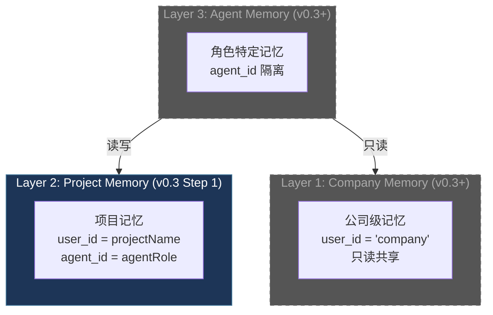
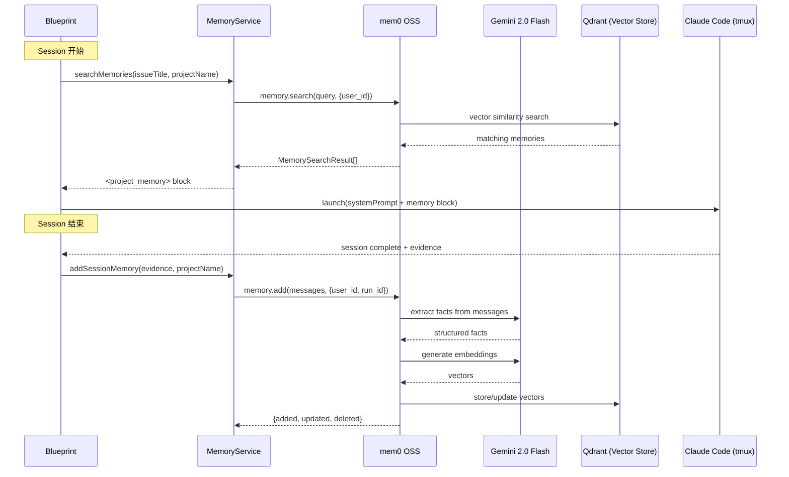
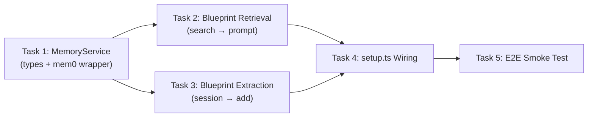

# v0.3 Step 1: Memory System — mem0 OSS + Gemini

> **Status**: codex-approved (Round 6 — 6 review rounds, all issues resolved)
> **Branch**: `feat/v0.3-step1-memory`
> **Base**: `main`
> **Research**: `doc/research/new/009-mem0-node-sdk-integration.md`
> **Exploration**: `doc/exploration/new/v0.3-memory-system.md`
> **Old plan (superseded)**: `doc/plan/backlog/v0.3-step1-memory-system.md`

---

## 1. Goal

用 mem0 OSS SDK + Gemini 2.0 Flash（免费 API）为 Flywheel 添加持久化项目记忆。每次 Blueprint 跑完一个 issue 后自动从 session 中提取经验（mem0 内置 LLM fact extraction），下次跑同一 project 的 issue 时自动将相关记忆注入 prompt。

**核心改变**：不再自写 memory extraction/dedup/storage 逻辑，改用 mem0 SDK 全套能力。

**v0.3 Step 1 scope**：
- Layer 2（项目级 memory）— `user_id = projectName`
- 预留 Layer 1/3 接口（Company / Agent scoping）
- 本地 Qdrant 持久化 → 后续迁 Supabase

---

## 2. Architecture

### 2.1 三层 Memory 模型（v0.3 实现 Layer 2）



### 2.2 数据流



### 2.3 mem0 Scoping 映射

| mem0 Identifier | Flywheel 映射 | 作用域 | v0.3 Step 1 |
|-----------------|--------------|--------|-------------|
| `user_id` | `projectName`（如 `geoforge3d`） | 项目隔离 | ✅ |
| `agent_id` | `agentRole`（如 `backend`, `qa`） | Agent 隔离 | 预留接口 |
| `run_id` | `executionId` | 单次 session | ✅ |
| `app_id` | `flywheel`（固定值） | 应用隔离 | ✅ |

---

## 3. Tech Stack

| 组件 | 选择 | 理由 |
|------|------|------|
| Memory SDK | `mem0ai/oss` v2.3.0 | 60K+ stars，内置 extraction/dedup/search |
| LLM (fact extraction) | Gemini 2.0 Flash | 免费 API，MMLU-Pro 超过 GPT-4o |
| Embedding | `gemini-embedding-001` (768 dims) | 免费，原生 Google AI |
| Vector Store | Qdrant (Docker) — **必需** | 持久化，进程重启不丢失 |
| Vector Store (test) | In-memory | 测试用，不需要 Docker |
| Vector Store (future) | Supabase pgvector | 云端，团队共享 |
| History DB | SQLite (mem0 内置)，存 `~/.flywheel/` | 审计日志，不污染 repo |

### 已知 Bug 及 Workaround

| Bug | 影响 | Workaround |
|-----|------|------------|
| **#3857**: 静态 `require('ollama')` | import 时报错 | `pnpm add ollama`（装包即可，不需要运行 Ollama） |
| **embedBatch 硬编码 768 dims** | batch embedding 维度不匹配 | 统一使用 768 dims（embed/vector store/embedder 都设 768） |
| **Telemetry 默认开启** | PostHog 追踪 | `MEM0_TELEMETRY=false` |

---

## 4. Components

### 4.1 New Files

| File | LOC (est.) | Description |
|------|-----------|-------------|
| `packages/edge-worker/src/memory/MemoryService.ts` | ~120 | mem0 封装 + 三层 scoping + prompt formatting |
| `packages/edge-worker/src/memory/types.ts` | ~30 | `MemoryServiceConfig`, `MemorySearchResult` |
| `packages/edge-worker/src/memory/createMemoryService.ts` | ~25 | Factory: env-conditional init (used by setup.ts) |
| `packages/edge-worker/src/memory/index.ts` | ~5 | Re-exports |
| **Tests** | | |
| `packages/edge-worker/src/__tests__/MemoryService.test.ts` | ~150 | Unit + integration tests |
| `packages/edge-worker/src/__tests__/memory-e2e.test.ts` | ~80 | Full loop smoke test |

### 4.2 Modified Files

| File | Change |
|------|--------|
| `packages/edge-worker/package.json` | Add `mem0ai`, `@google/genai`, `ollama` deps |
| `packages/edge-worker/src/Blueprint.ts` | Add optional `MemoryService` dep, inject memory in prompt, extract after session |
| `packages/edge-worker/src/index.ts` | Export memory module |
| `scripts/lib/setup.ts` | Initialize MemoryService in `setupComponents()`, pass to Blueprint constructor |

**Total**: ~385 LOC (implementation ~155, tests ~230)

对比旧方案（自写）：810 LOC → 385 LOC，减少 52%。

---

## 5. Tasks (TDD)

### Task 1: Package Setup + MemoryService (~155 LOC)

**What**: 安装 mem0 OSS + Gemini peer deps，创建 `MemoryService` 封装类。

**Install**:
```bash
cd packages/edge-worker
pnpm add mem0ai @google/genai ollama
```

**Types**:
```typescript
// packages/edge-worker/src/memory/types.ts

export interface MemoryServiceConfig {
  /** Google AI API key for Gemini LLM + embedding */
  googleApiKey: string;
  /** Qdrant URL for persistent vector storage (REQUIRED for persistence) */
  qdrantUrl: string;
  /** mem0 history DB path — MUST be outside repo to avoid git dirty tree
   *  default: ~/.flywheel/memories/<projectName>/history.db */
  historyDbPath: string;
  /** Vector collection name (default: flywheel-memories) */
  collectionName?: string;
  /** Gemini model for fact extraction (default: gemini-2.0-flash) */
  llmModel?: string;
  /** Max memories to return on search (default: 10) */
  searchLimit?: number;
}

/** Config for tests only — in-memory vector store, no Qdrant needed */
export interface MemoryServiceTestConfig {
  googleApiKey: string;
  historyDbPath?: string;
  collectionName?: string;
  llmModel?: string;
  searchLimit?: number;
}
```

**MemoryService**:
```typescript
// packages/edge-worker/src/memory/MemoryService.ts
import { Memory } from "mem0ai/oss";

export class MemoryService {
  private memory: Memory;
  private searchLimit: number;

  constructor(config: MemoryServiceConfig | MemoryServiceTestConfig) {
    this.searchLimit = config.searchLimit ?? 10;

    const isTestConfig = !("qdrantUrl" in config);

    this.memory = new Memory({
      version: "v1.1",
      llm: {
        provider: "google",
        config: {
          apiKey: config.googleApiKey,
          model: config.llmModel ?? "gemini-2.0-flash",
        },
      },
      embedder: {
        provider: "google",
        config: {
          apiKey: config.googleApiKey,
          model: "gemini-embedding-001",
          embeddingDims: 768,  // match embedBatch hardcoded value
        },
      },
      vectorStore: isTestConfig
        ? {
            provider: "memory",
            config: {
              collectionName: config.collectionName ?? "flywheel-memories",
              dimension: 768,
            },
          }
        : {
            provider: "qdrant",
            config: {
              url: (config as MemoryServiceConfig).qdrantUrl,
              collectionName: config.collectionName ?? "flywheel-memories",
              dimension: 768,
            },
          },
      historyDbPath: config.historyDbPath ?? ":memory:",
    });
  }

  /**
   * Store session memories after Blueprint execution.
   * mem0 internally: LLM extracts facts → generates embeddings → dedup → store.
   */
  async addSessionMemory(params: {
    projectName: string;
    executionId: string;
    issueId: string;
    issueTitle: string;
    sessionResult: "success" | "failure" | "timeout";
    commitMessages: string[];
    diffSummary: string;
    decisionRoute?: string;
    error?: string;             // error context for failure/timeout sessions
    decisionReasoning?: string; // decision.reasoning + concerns for blocked/failure sessions
    agentId?: string;           // Layer 3: reserved
  }): Promise<{ added: number; updated: number }> {
    const messages = [
      {
        role: "user",
        content: [
          `Issue: ${params.issueTitle} (${params.issueId})`,
          params.diffSummary ? `Changes:\n${params.diffSummary}` : "",
        ].filter(Boolean).join("\n"),
      },
      {
        role: "assistant",
        content: [
          `Session result: ${params.sessionResult}`,
          params.commitMessages.length
            ? `Commits:\n${params.commitMessages.map(m => `- ${m}`).join("\n")}`
            : "No commits",
          params.decisionRoute
            ? `Decision: ${params.decisionRoute}`
            : "",
          params.error
            ? `Error: ${params.error}`
            : "",
          params.decisionReasoning
            ? `Decision reasoning: ${params.decisionReasoning}`
            : "",
        ].filter(Boolean).join("\n"),
      },
    ];

    const result = await this.memory.add(messages, {
      user_id: params.projectName,
      run_id: params.executionId,
      agent_id: params.agentId,     // undefined = no agent isolation
      app_id: "flywheel",
      metadata: {
        issue_id: params.issueId,
        session_result: params.sessionResult,
      },
    });

    // mem0 returns { results: Array<{ id, event, memory }> }
    const added = (result?.results ?? []).filter(
      (r: any) => r.event === "ADD"
    ).length;
    const updated = (result?.results ?? []).filter(
      (r: any) => r.event === "UPDATE"
    ).length;

    return { added, updated };
  }

  /**
   * Search memories relevant to an issue.
   * Returns formatted prompt block or null if no memories found.
   */
  async searchAndFormat(params: {
    query: string;
    projectName: string;
    agentId?: string;           // Layer 3: reserved
  }): Promise<string | null> {
    const results = await this.memory.search(params.query, {
      user_id: params.projectName,
      agent_id: params.agentId,
      app_id: "flywheel",        // match write-side scoping
      limit: this.searchLimit,
    });

    // Layer 1 company memory (future):
    // const companyResults = await this.memory.search(params.query, {
    //   user_id: "company",
    //   limit: 5,
    // });

    const memories = (results?.results ?? []) as Array<{ memory: string }>;
    if (!memories.length) return null;

    const lines = memories.map((m) => `- ${m.memory}`);
    return [
      "<project_memory>",
      "## Learned from previous sessions",
      ...lines,
      "</project_memory>",
    ].join("\n");
  }

  /** Close underlying connections */
  async close(): Promise<void> {
    // mem0 OSS doesn't expose a close method; no-op for now
  }
}
```

**Factory function** (env-conditional init, tested inside edge-worker package):

```typescript
// packages/edge-worker/src/memory/createMemoryService.ts
import { join } from "node:path";
import { mkdirSync } from "node:fs";
import { homedir } from "node:os";
import { MemoryService } from "./MemoryService.js";

export interface CreateMemoryServiceOpts {
  googleApiKey?: string;   // from process.env.GOOGLE_API_KEY
  qdrantUrl?: string;      // from process.env.QDRANT_URL
  projectName: string;
  llmModel?: string;       // from process.env.FLYWHEEL_MEMORY_MODEL
}

/**
 * Creates MemoryService if both GOOGLE_API_KEY and QDRANT_URL are provided.
 * Returns undefined otherwise (graceful degradation).
 * History DB stored at ~/.flywheel/memories/<projectName>/history.db.
 */
export function createMemoryService(opts: CreateMemoryServiceOpts): MemoryService | undefined {
  if (!opts.googleApiKey || !opts.qdrantUrl) return undefined;
  const memoryDbDir = join(homedir(), ".flywheel", "memories", opts.projectName);
  mkdirSync(memoryDbDir, { recursive: true });
  return new MemoryService({
    googleApiKey: opts.googleApiKey,
    qdrantUrl: opts.qdrantUrl,
    historyDbPath: join(memoryDbDir, "history.db"),
    llmModel: opts.llmModel ?? "gemini-2.0-flash",
  });
}
```

**Tests** (RED first):

**Unit tests (all mock `Memory` — no API key needed, always run):**
1. `MemoryService` constructor creates instance without error
2. `addSessionMemory()` with success session → calls `memory.add()` with correct scoping
3. `addSessionMemory()` with failure session → includes error field in messages
4. `searchAndFormat()` with no memories → returns `null`
5. `searchAndFormat()` with memories → returns `<project_memory>` block
6. `searchAndFormat()` block contains `## Learned from previous sessions`
7. `addSessionMemory()` passes correct `user_id`, `run_id`, `app_id` to mem0
8. `createMemoryService()` with both keys → returns `MemoryService` instance
9. `createMemoryService()` without `googleApiKey` → returns `undefined`
10. `createMemoryService()` without `qdrantUrl` → returns `undefined`
11. `createMemoryService()` history path uses `~/.flywheel/memories/<projectName>/history.db`

**Live integration tests (opt-in via `RUN_MEM0_LIVE_TESTS=true` + `GOOGLE_API_KEY`):**
8. `addSessionMemory()` + `searchAndFormat()` round-trip (real mem0 in-memory mode)
9. Different `projectName` → isolated memories (scoping test)
10. Same fact twice → mem0 dedup (no exact duplicate)

**Note**: Default `pnpm test` runs only unit tests (1-7) with mocked `Memory` — no network, no API key, fully reproducible. Live tests gated behind `RUN_MEM0_LIVE_TESTS=true`.

**Commit**: `feat(edge-worker): add MemoryService — mem0 OSS wrapper with Gemini + three-layer scoping`

---

### Task 2: Blueprint Retrieval Integration (~40 LOC)

**What**: Before prompt assembly, search memories and inject into system prompt.

**Blueprint.ts constructor** — append after `agentDispatcher` (last position):
```typescript
constructor(
  private hydrator: PreHydrator,
  private gitChecker: GitResultChecker,
  private getRunner: (name: string) => IFlywheelRunner,
  private shell: ShellRunner,
  private worktreeManager?: WorktreeManager,
  private skillInjector?: SkillInjector,
  private evidenceCollector?: ExecutionEvidenceCollector,
  private skillsConfig?: SkillsConfig,
  private decisionLayer?: IDecisionLayer,
  private eventEmitter?: ExecutionEventEmitter,
  private agentDispatcher?: AgentDispatcher,
  // v0.3 — memory (appended last to avoid parameter shift)
  private memoryService?: MemoryService,
)
```

**In `run()` — normalize project scope ONCE before constructing event envelope**:

```typescript
// ── Canonical project scope (v0.3 — unified for events, memory, worktree) ─
// Replaces existing `ctx.projectName ?? "unknown"` with richer fallback
const projectScope = ctx.projectName ?? ctx.teamName ?? "unknown";

const env: EventEnvelope = {
  executionId,
  issueId: node.id,
  projectName: projectScope,  // now uses canonical scope (was: ctx.projectName ?? "unknown")
};
```

This ensures events and memory use the same canonical project identifier. The only behavioral change to the existing event system is: when `ctx.projectName` is undefined, events now fall back to `ctx.teamName` instead of `"unknown"` — a strict improvement. (Worktree/skill injection already compute `ctx.projectName ?? ctx.teamName` independently — same result, but v0.3 does not modify those existing code paths.)

**In `runInner()` — BEFORE system prompt construction** (after agent dispatch):

```typescript
// ── Memory retrieval (v0.3 — best-effort, non-fatal) ─
// env.projectName is the canonical projectScope (normalized in run())
let memoryBlock = "";
if (this.memoryService) {
  try {
    memoryBlock = await this.memoryService.searchAndFormat({
      query: `${hydrated.issueTitle} ${hydrated.issueDescription ?? ""}`.trim(),
      projectName: env.projectName,
    }) ?? "";
  } catch (err) {
    console.warn(
      `[Blueprint] Memory retrieval failed (non-fatal): ${err instanceof Error ? err.message : String(err)}`,
    );
  }
}
```

**Inject into systemPrompt** (append after base prompt):

```typescript
const systemPrompt = [
  // ... existing system prompt lines ...
  memoryBlock,
].filter(Boolean).join("\n");
```

**Tests**:
1. Blueprint without `memoryService` → works as before (backward compat)
2. Blueprint with `memoryService` → `<project_memory>` appears in systemPrompt
3. `memoryService.searchAndFormat()` throws → warns but continues (non-fatal)
4. `memoryService.searchAndFormat()` returns `null` → no memory block in prompt

**Commit**: `feat: inject project memory into Blueprint system prompt`

---

### Task 3: Blueprint Extraction Integration (~50 LOC)

**What**: After session completion + evidence collection, store session memory.

**Signature change to `runWithDecision()`** — append `env` parameter:

```typescript
private async runWithDecision(
  _node: DagNode,
  ctx: BlueprintContext,
  hydrated: { ... },
  evidence: ExecutionEvidence,
  result: FlywheelRunResult,
  cwd: string,
  baseSha: string,
  worktreeInfo: WorktreeInfo | undefined,
  env: EventEnvelope,              // v0.3 — canonical scope for memory extraction
): Promise<BlueprintResult> {
```

Call site in `runInner()`:
```typescript
return this.runWithDecision(
  node, ctx, hydrated, evidence, result, cwd, baseSha, worktreeInfo,
  env,  // v0.3 — pass canonical envelope
);
```

**New private method in Blueprint** (shared by decision and fallback paths):

```typescript
private async extractMemory(
  hydrated: { issueId: string; issueTitle: string },
  evidence: ExecutionEvidence,
  result: FlywheelRunResult,
  decision: DecisionResult | undefined,
  executionId: string,     // from env.executionId (already normalized in run())
  projectName: string,
): Promise<void> {
  if (!this.memoryService) return;
  try {
    // sessionResult must align with Blueprint's actual outcome semantics:
    // - decision path: blocked = failure, else = success
    // - fallback path: commitCount > 0 && !timedOut = success, else = failure
    const sessionResult: "success" | "failure" | "timeout" = result.timedOut
      ? "timeout"
      : decision
        ? (decision.route === "blocked" ? "failure" : "success")
        : (evidence.commitCount > 0 ? "success" : "failure");

    const memResult = await this.memoryService.addSessionMemory({
      projectName,
      executionId,
      issueId: hydrated.issueId,
      issueTitle: hydrated.issueTitle,
      sessionResult,
      commitMessages: evidence.commitMessages,
      diffSummary: evidence.diffSummary ?? "",
      decisionRoute: decision?.route,
      error: result.timedOut ? "timeout" : (!decision && evidence.commitCount === 0) ? "no commits produced" : undefined,
      decisionReasoning: decision
        ? [decision.reasoning, ...decision.concerns.map(c => `concern: ${c}`)].join("; ")
        : undefined,
    });
    console.log(
      `[Blueprint] Memory stored: +${memResult.added} added, ~${memResult.updated} updated`,
    );
  } catch (err) {
    console.warn(
      `[Blueprint] Memory extraction failed (non-fatal): ${err instanceof Error ? err.message : String(err)}`,
    );
  }
}
```

**Call sites** (both pass `env.projectName` — canonicalized once in `run()`):
1. In `runWithDecision()` — BEFORE return (after decision routing): `await this.extractMemory(hydrated, evidence, result, decision, env.executionId, env.projectName)`
2. In `runInner()` fallback path — BEFORE return (when no DecisionLayer): `await this.extractMemory(hydrated, evidence, result, undefined, env.executionId, env.projectName)`

**Tests**:
1. Blueprint with `memoryService` + DecisionLayer → calls `addSessionMemory()` in `runWithDecision()`
2. Blueprint with `memoryService` without DecisionLayer → calls `addSessionMemory()` in fallback
3. `addSessionMemory()` throws → warns but continues (non-fatal)
4. Successful session (decision path, auto_approve) → `sessionResult: "success"`
5. Blocked session (decision path) → `sessionResult: "failure"`
6. Timed out session → `sessionResult: "timeout"`
7. Fallback path: 0 commits, not timed out → `sessionResult: "failure"` (not "success")
8. Fallback path: >0 commits, not timed out → `sessionResult: "success"`
9. Error context: failure sessions include `error` field in stored messages
10. Decision context: blocked sessions include `decisionReasoning` with `decision.reasoning` and `decision.concerns`
11. All failure/blocked sessions have at least one explainable reason field (`error` or `decisionReasoning`)
12. When `ctx.projectName` is undefined, memory AND event emitter both use `ctx.teamName` as fallback (canonical `projectScope`)

**Commit**: `feat: extract session memory after Blueprint completion`

---

### Task 4: setup.ts Wiring (~40 LOC)

**What**: Initialize `MemoryService` in `setupComponents()` (`scripts/lib/setup.ts`), pass to Blueprint. This is the shared component factory used by both `run-issue.ts` and `run-project.ts`.

**Why `setup.ts` and not `run-issue.ts`**: Blueprint is constructed in `setupComponents()` at `scripts/lib/setup.ts:306`, not in `run-issue.ts`. The same setup is reused by `run-project.ts`. Wiring memory here covers both entry points.

```typescript
// scripts/lib/setup.ts — inside setupComponents(), after agentDispatcher

import { createMemoryService } from "../../packages/edge-worker/dist/memory/index.js";

// 4e. Memory system — uses factory (logic + tests live in edge-worker package)
// Note: projectName is required in SetupOptions (setup.ts:68), no fallback needed
const memoryService = createMemoryService({
  googleApiKey: process.env.GOOGLE_API_KEY,
  qdrantUrl: process.env.QDRANT_URL,
  projectName,
  llmModel: process.env.FLYWHEEL_MEMORY_MODEL,
});
if (memoryService) {
  log("Memory system enabled (Qdrant persistent)");
} else {
  log("Memory system disabled — requires GOOGLE_API_KEY + QDRANT_URL");
}

// Pass to Blueprint constructor (appended last — line ~306)
const blueprint = new Blueprint(
  hydrator, gitChecker, makeRunner, shell,
  worktreeManager, skillInjector, evidenceCollector,
  flywheelConfig?.skills,
  decisionLayer,
  eventEmitter,
  agentDispatcher,
  memoryService,     // v0.3 — appended last
);
```

**Key points**:
- All conditional init logic lives in `createMemoryService()` inside edge-worker package — **directly testable** by `pnpm test`
- History DB stored in `~/.flywheel/memories/<projectName>/history.db` — **outside repo**, no git dirty tree risk
- Both `GOOGLE_API_KEY` and `QDRANT_URL` required — no silent fallback to volatile in-memory
- `run-issue.ts` and `run-project.ts` both get memory via `setupComponents()` — no code duplication
- Wiring tests (unit tests 8-11 in Task 1) run inside edge-worker's vitest suite — no stale `scripts/__tests__` orphan

**Commit**: `feat: wire MemoryService into setupComponents()`

---

### Task 5: E2E Smoke Test (~80 LOC)

**What**: Full loop — add session memory → search → verify round-trip.

```typescript
// packages/edge-worker/src/__tests__/memory-e2e.test.ts

describe("Memory System E2E", () => {
  it("full loop: add → search → found in prompt", async () => {
    // 1. Create MemoryService with in-memory vector store (no Qdrant)
    // 2. Call addSessionMemory with a mock session
    // 3. Call searchAndFormat with related query
    // 4. Verify <project_memory> block contains relevant memory
  });

  it("project isolation: different projects don't leak", async () => {
    // 1. Add memory for project "alpha"
    // 2. Search for project "beta"
    // 3. Verify no results
  });

  it("graceful degradation: missing env vars → memory disabled", async () => {
    // No GOOGLE_API_KEY → createMemoryService returns undefined → Blueprint works normally
    // No QDRANT_URL → createMemoryService returns undefined → Blueprint works normally
    // Both missing → same
  });
});
```

**Note**: E2E tests are opt-in (`RUN_MEM0_LIVE_TESTS=true` + `GOOGLE_API_KEY`). Use `it.skipIf(!process.env.RUN_MEM0_LIVE_TESTS)` to gate. Default `pnpm test` skips these — no network dependency in CI.

**Commit**: `test(edge-worker): add E2E smoke test for memory system`

---

## 6. Environment Variables

| Variable | Required | Default | Description |
|----------|----------|---------|-------------|
| `GOOGLE_API_KEY` | For memory | — | Gemini API key (free from AI Studio) |
| `QDRANT_URL` | For persistence | — | Qdrant Docker URL (e.g. `http://localhost:6333`) |
| `FLYWHEEL_MEMORY_MODEL` | No | `gemini-2.0-flash` | LLM model for fact extraction |
| `MEM0_TELEMETRY` | No | `true` | Set `false` to disable mem0 telemetry |

### Qdrant 快速启动

```bash
docker run -d --name qdrant -p 6333:6333 -v qdrant_storage:/qdrant/storage qdrant/qdrant
```

---

## 7. Design Decisions

| Decision | Choice | Rationale |
|----------|--------|-----------|
| Memory SDK | mem0 OSS (not self-written) | 60K+ stars, 内置 extraction/dedup/search, ~155 LOC vs ~480 LOC |
| LLM provider | Gemini 2.0 Flash | 免费 API, 够智能做 fact extraction |
| Embedding dims | 768 (not 1536) | 规避 mem0 embedBatch 硬编码 768 bug |
| Vector store (prod) | Qdrant Docker — **必需** | 持久化，进程重启不丢失 |
| Vector store (test) | In-memory (mock/live test) | 测试不依赖 Docker |
| Vector store (future) | Supabase pgvector | 云端，config 改一行 |
| History DB location | `~/.flywheel/memories/<project>/` | 放 repo 外，不污染 git tree |
| Wiring location | `scripts/lib/setup.ts` | `setupComponents()` 被 run-issue + run-project 共享 |
| Injection target | `appendSystemPrompt` | 系统级上下文，TmuxRunner 已支持 |
| Blueprint integration | Optional dep, appended last | 不影响现有参数位置 |
| Extraction position | `runWithDecision()` + fallback 各一处 | 避免 early return 绕过 |
| Error handling | Non-fatal try/catch | 不影响 session 完成 |
| Three-layer model | v0.3 实现 Layer 2, 预留 L1/L3 | 先跑通，后扩展 |
| Memory scoping | `user_id=project, agent_id=role` | mem0 原生支持，无需自建 |

---

## 8. NOT in Scope (v0.3 Step 2+)

| Feature | Phase | Notes |
|---------|-------|-------|
| Layer 1 Company Memory | v0.3 Step 2 | `user_id='company'` 共享层 |
| Layer 3 Agent Memory | v0.3 Step 2 | `agent_id` 隔离，多 agent 模式 |
| Cross-agent broadcast | v0.3 Step 2+ | "广播" 机制 |
| Supabase pgvector 迁移 | v0.3 Step 2 | Config 改一行 |
| Custom extraction prompt | v0.3 Step 2 | 针对 Flywheel 场景优化提取 |
| Graph memory (Neo4j) | v0.4+ | Issue 间因果关系 |
| MCP server for Claude Code | v0.3 Step 2 | 让 Claude Code 自助查记忆 |
| Memory dashboard | v0.4+ | Web UI 查看/管理记忆 |
| CIPHER decision memory | v0.4+ | 从 approve/reject 模式中学习 |

---

## 9. Risk Mitigation

| Risk | Impact | Mitigation |
|------|--------|------------|
| Gemini API rate limit (15 RPM free) | Extraction throttled | 单个 session ~2 calls (extract + embed), 远低于限制 |
| mem0 #3857 static require bug | Import crash | 安装 `ollama` 包 workaround |
| embedBatch 768 dims bug | Dimension mismatch | 统一用 768 dims |
| Qdrant Docker 未运行 | Memory 不可用 | `QDRANT_URL` 未设置 → `createMemoryService()` 返回 `undefined`，memory 整体禁用。`QDRANT_URL` 设了但服务不可达 → `addSessionMemory()` / `searchAndFormat()` 走 try/catch non-fatal 路径，log warning，不影响 session |
| Memory 文件污染 git tree | clean-tree 失败 | History DB 存 `~/.flywheel/` (repo 外) |
| mem0 SDK breaking change | 升级风险 | 锁版本 `mem0ai@2.3.0` |
| Memory 质量差 (无关 facts) | 噪音注入 prompt | v0.3 Step 2 加 custom extraction prompt |
| Memory 无限增长 | 检索慢 | mem0 内置 dedup + Qdrant 高效检索 |

---

## 10. Success Criteria

1. `GOOGLE_API_KEY` + `QDRANT_URL` 同时设置后，Blueprint 跑完 issue 自动存储 memory facts
2. 后续跑同一 project 的 issue 时，`<project_memory>` block 出现在 system prompt 中
3. 不同 `projectName` 的 memory 互不可见（隔离）
4. mem0 内置 dedup：相同 fact 不会重复存储
5. 所有功能 graceful degradation（缺 `GOOGLE_API_KEY` 或 `QDRANT_URL` → 无 memory，不影响 session）
6. 向后兼容——未同时设置 `GOOGLE_API_KEY` + `QDRANT_URL` 的环境完全不受影响
7. 测试覆盖率 ≥ 80%

---

## 11. Task Dependency Graph



Linear path: T1 → T2 → T3 → T4 → T5
(T2 and T3 can be parallelized but sequential TDD is cleaner)

---

## 12. Migration Path: Qdrant → Supabase

v0.3 Step 2 切 Supabase 只需改 `MemoryService` constructor 的 `vectorStore` 配置：

```typescript
// Before (Qdrant)
vectorStore: {
  provider: "qdrant",
  config: { url: "http://localhost:6333", collectionName: "flywheel", dimension: 768 },
}

// After (Supabase)
vectorStore: {
  provider: "supabase",
  config: { connectionString: process.env.SUPABASE_DB_URL, collectionName: "flywheel", dimension: 768 },
}
```

无需改业务代码。

---

## 13. Codex Review Changelog

### Round 1 → Round 2

| # | Issue | Fix |
|---|-------|-----|
| 1 | Wiring 错误地放在 `run-issue.ts`，实际 Blueprint 在 `setup.ts` 构造 | Task 4 改为 `scripts/lib/setup.ts`，在 `setupComponents()` 内初始化 |
| 2 | Memory 文件写入 repo 内 `.flywheel/` 会污染 git tree，导致 clean-tree 失败 | History DB 改存 `~/.flywheel/memories/<project>/`（repo 外） |
| 3 | 目标说"持久化"但默认 in-memory 不持久 | Qdrant 改为必需（`GOOGLE_API_KEY` + `QDRANT_URL` 同时存在才启用），in-memory 仅用于测试 |
| 4 | 测试默认依赖外部 Gemini API，不符合 repo 可重复测试风格 | 默认 unit test 全 mock `Memory`；live test gated behind `RUN_MEM0_LIVE_TESTS=true` |
| 5 | `sessionResult` 逻辑与 Blueprint 实际语义不一致（fallback path 0 commits 记成 success） | 对齐 Blueprint: fallback `commitCount > 0 && !timedOut` = success；加 `error` 字段；用 `env.executionId` |

### Round 2 → Round 3

| # | Issue | Fix |
|---|-------|-----|
| 1 | `app_id` 只在写入时使用，没有在检索时过滤，和隔离模型不一致 | `searchAndFormat()` 的 `memory.search()` 加上 `app_id: "flywheel"` |
| 2 | Failure memory 缺少 decision path 的失败原因（`reasoning` / `concerns`） | 加 `decisionReasoning` 字段到 `addSessionMemory` params；`extractMemory()` 传入 `decision.reasoning` + `decision.concerns`；测试收紧为 "所有 failure 至少有一个可解释原因字段" |
| 3 | 文档变量名与实际签名不一致（`context` vs `ctx`，`opts.projectName` vs `projectName`）；wiring 缺直接测试 | Task 2 修正 `context` → `ctx`；Task 4 修正 `opts.projectName` → `projectName`；Task 4 新增 `setupComponents()` 最小 wiring test |

### Round 3 → Round 4

| # | Issue | Fix |
|---|-------|-----|
| 1 | Wiring test 放在 `scripts/__tests__`，不在 edge-worker vitest 入口覆盖范围内 | 将 memory init 逻辑抽为 `createMemoryService()` factory 函数放入 `packages/edge-worker/src/memory/`，wiring tests（8-11）在 edge-worker 包内运行；`setup.ts` 只保留薄接线 |
| 2 | Project scope 有 `default` / `teamName` / `unknown` 三套 fallback，读写隔离键不统一 | 在 `runInner()` 开头归一化 `projectScope = ctx.projectName ?? ctx.teamName`（和现有 worktree 语义一致），search/extract/call-site 统一使用；补 regression test 覆盖 "未传 projectName 时使用 teamName" |

### Round 4 → Round 5

| # | Issue | Fix |
|---|-------|-----|
| 1 | `projectScope` 只在 `runInner()` 统一，事件 envelope 仍用 `"unknown"` fallback | 将 `projectScope = ctx.projectName ?? ctx.teamName ?? "unknown"` 前移到 `run()`，用于构造 `env.projectName`，memory search/extract 都通过 `env.projectName` 获取；events/memory/worktree 全部使用同一个 canonical 值 |
| 2 | Qdrant 必需后，success criteria 仍只写 `GOOGLE_API_KEY`，E2E 也只测缺 API key，risk table 承诺"启动探活"但实际没做 | Success criteria 改为 "`GOOGLE_API_KEY` + `QDRANT_URL` 同时设置"；E2E 覆盖两种缺失场景；risk table 改为真实语义：env var 缺失 → `createMemoryService()` 返回 `undefined`，URL 存在但不可达 → per-call non-fatal try/catch |

### Round 5 → Round 6

| # | Issue | Fix |
|---|-------|-----|
| 1 | `runWithDecision()` 不接收 `env`，decision path 的 memory extraction 可能重新漂移；overclaiming worktree 统一 | 显式修改 `runWithDecision()` 签名追加 `env: EventEnvelope`，call-site 也传入 `env`；精确描述统一范围为"events + memory"，worktree/skill injection 不在 v0.3 scope 内 |
| 2 | Task 4 仍有 `projectName ?? "default"`（`SetupOptions.projectName` 是必填不需要 fallback）；依赖图标签仍是 `run-issue Wiring` | 去掉 `?? "default"`，改为直接用 `projectName`；依赖图标签改为 `setup.ts Wiring` |
