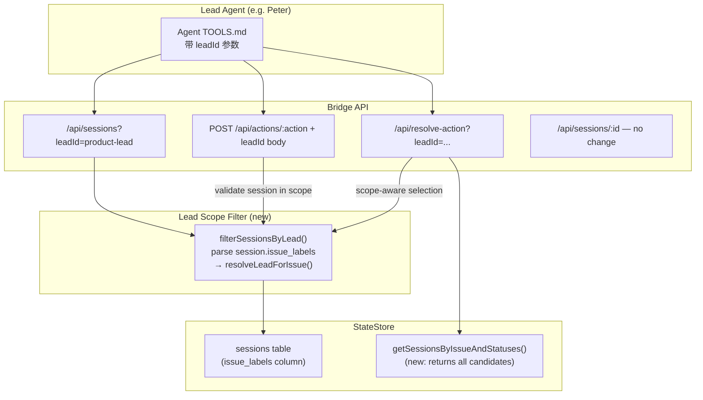

# Plan: Lead Data Isolation — Bridge API Default Scoping

**Version**: v1.11.0
**Issue**: GEO-259
**Date**: 2026-03-25
**Source**: `doc/exploration/new/GEO-259-lead-data-isolation.md`
**Status**: codex-approved

## Summary

为所有未隔离的 Bridge API 端点添加可选的 `leadId` 查询参数，实现默认按 Lead scope 过滤。不传参数时行为不变（全局视角，向后兼容）。

## Design Principles

1. **Noise reduction, not access control** — 过滤是默认行为优化，不是权限墙
2. **Optional parameter, backwards-compatible** — 所有端点不传 `leadId` 时返回全量数据
3. **Reuse existing routing** — 复用 `resolveLeadForIssue()` + label routing 从 ProjectConfig
4. **Single shared utility** — 提取公共过滤函数，所有端点复用
5. **Fail-closed for explicit scope** — 传了 `leadId` 就是声明 scope。Mismatch 和 verify error (unknown project, missing config) 都拒绝。**Label parsing 不是 verify error** — `parseSessionLabels()` contract: accepts `string[]` JSON or CSV; `JSON.parse` succeeds but result is not `string[]` → falls through to CSV (treated as format compat, not error)

## Architecture



## Data Model

Session labels are stored in the `sessions.issue_labels` column as a JSON array string (e.g., `'["Product","Frontend"]'`). There is no separate `session_labels` table.

**Label parsing strategy**: `parseSessionLabels()` accepts both JSON array and legacy CSV format. This is **data format compatibility**, not an error condition. A "verify error" is specifically when `resolveLeadForIssue()` throws due to unknown project or missing config — these are configuration/data integrity issues, not format issues.

**Label stability**: Labels come from Linear and are written on `session_started`, then may be re-written on `session_completed`/`session_failed`. In practice labels are stable across sessions of the same issue (Linear convention), but this is NOT enforced as a code invariant. The `/api/resolve-action` implementation uses scope-aware candidate selection (not post-check) to handle this correctly.

## Changes

### 1. Extract shared filter utility

**New file**: `packages/teamlead/src/bridge/lead-scope.ts`

```typescript
import type { ProjectEntry } from "../ProjectConfig.js";
import { resolveLeadForIssue } from "../ProjectConfig.js";
import type { Session } from "../StateStore.js";

/**
 * Parse issue_labels from a session object.
 * Accepts JSON array (standard) or CSV (legacy compatibility).
 * This is format normalization, NOT a verify error path.
 */
export function parseSessionLabels(session: Session): string[] {
  if (!session.issue_labels) return [];
  try {
    const parsed: unknown = JSON.parse(session.issue_labels);
    // Contract: only accept string[]. Anything else (object, number[], etc.)
    // falls through to CSV fallback — treat non-string[] JSON as unparseable.
    if (
      Array.isArray(parsed) &&
      parsed.every((item): item is string => typeof item === "string")
    ) {
      return parsed;
    }
  } catch {
    // JSON parse failed — fall through to CSV
  }
  // CSV fallback (legacy compatibility)
  return session.issue_labels
    .split(",")
    .map((l) => l.trim())
    .filter(Boolean);
}

/**
 * Check if a session belongs to a specific Lead's scope.
 * Returns false for out-of-scope sessions.
 * Throws on verify errors (unknown project, missing config).
 */
export function matchesLead(
  session: Session,
  leadId: string,
  projects: ProjectEntry[],
): boolean {
  const labels = parseSessionLabels(session);
  const { lead } = resolveLeadForIssue(projects, session.project_name, labels);
  return lead.agentId === leadId;
}

/**
 * Filter a session array to only those matching a Lead's scope.
 * If leadId is undefined, returns all sessions (no-op).
 * Verify errors → warn + exclude (not silently dropped).
 */
export function filterSessionsByLead(
  sessions: Session[],
  leadId: string | undefined,
  projects: ProjectEntry[],
): Session[] {
  if (!leadId) return sessions;
  return sessions.filter((s) => {
    try {
      return matchesLead(s, leadId, projects);
    } catch (err) {
      console.warn(
        `[lead-scope] Cannot resolve lead for session ${s.execution_id} ` +
        `(project: ${s.project_name}): ${(err as Error).message}`
      );
      return false;
    }
  });
}
```

Design goals:
- **No StateStore dependency** — reads `session.issue_labels` directly (pure function, no N+1)
- **No silent catch** — `matchesLead()` throws on verify errors; `filterSessionsByLead()` catches at list level and logs
- **Clear error taxonomy**: label parsing = format compat (no error); unknown project = verify error (throw)

### 2. Refactor bootstrap-generator.ts

Import from `lead-scope.ts`. **All three** filtering points use `filterSessionsByLead()`:

```diff
- import type { Session, StateStore } from "../StateStore.js";
+ import type { StateStore } from "../StateStore.js";
+ import { filterSessionsByLead } from "./lead-scope.js";

  export async function generateBootstrap(...) {
    const allActive = store.getActiveSessions();
-   const activeSessions = filterByLead(allActive, leadId, projects, store);
+   const activeSessions = filterSessionsByLead(allActive, leadId, projects);

    const recent = store.getRecentSessions(MAX_RECENT_SESSIONS);
-   const pendingDecisions = recent
-     .filter((s) => s.status === "awaiting_review")
-     .filter((s) => matchesLead(s, leadId, projects, store));
+   const pendingDecisions = filterSessionsByLead(
+     recent.filter((s) => s.status === "awaiting_review"),
+     leadId,
+     projects,
+   );

-   const recentFailures = recent
-     .filter((s) => s.status === "failed")
-     .filter((s) => matchesLead(s, leadId, projects, store))
-     .slice(0, MAX_RECENT_FAILURES);
+   const recentFailures = filterSessionsByLead(
+     recent.filter((s) => s.status === "failed"),
+     leadId,
+     projects,
+   ).slice(0, MAX_RECENT_FAILURES);

    // ... rest unchanged ...
  }

- function matchesLead(...) { ... }
- function filterByLead(...) { ... }
```

### 3. Add getSessionsByIssueAndStatuses to StateStore

**File**: `packages/teamlead/src/StateStore.ts`

Add a new method that returns **all** matching sessions (not just the latest). This powers scope-aware candidate selection in `/api/resolve-action`.

```typescript
/**
 * Get all sessions for an issue matching given statuses, ordered by last_activity_at DESC.
 * Unlike getLatestSessionByIssueAndStatuses(), returns the full candidate set.
 */
getSessionsByIssueAndStatuses(
  issueId: string,
  statuses: string[],
): Session[] {
  if (statuses.length === 0) return [];
  const placeholders = statuses.map(() => "?").join(", ");
  const results: Session[] = [];
  const stmt = this.db.prepare(
    `SELECT * FROM sessions WHERE issue_id = ? AND status IN (${placeholders}) ORDER BY last_activity_at DESC`,
  );
  stmt.bind([issueId, ...statuses]);
  while (stmt.step()) {
    results.push(this.rowToSession(stmt.getAsObject() as Record<string, unknown>));
  }
  stmt.free();
  return results;
}
```

### 4. Modify createQueryRouter signature

**File**: `packages/teamlead/src/bridge/tools.ts`

Add `projects: ProjectEntry[]` parameter.

```diff
- export function createQueryRouter(
-   store: StateStore,
-   retryDispatcher?: IRetryDispatcher,
- ): Router {
+ export function createQueryRouter(
+   store: StateStore,
+   projects: ProjectEntry[],
+   retryDispatcher?: IRetryDispatcher,
+ ): Router {
```

Update the single call site in `plugin.ts` (line 282):
```diff
- createQueryRouter(store, retryDispatcher),
+ createQueryRouter(store, projects, retryDispatcher),
```

### 5. Add leadId filtering to GET /api/sessions

**File**: `packages/teamlead/src/bridge/tools.ts`

Applies to bulk modes: `active`, `recent`, `stuck`.
Does NOT apply to `by_identifier` (specific lookup by known identifier).

```typescript
router.get("/sessions", (req, res) => {
  const leadId = req.query.leadId as string | undefined;
  // ... existing mode/limit parsing ...

  let sessions: Session[];
  switch (mode) {
    case "active":
    case "recent":
    case "stuck":
      // ... existing fetch logic per mode ...
      break;
    case "by_identifier":
      // Specific lookup — leadId not applied
      // ... existing logic unchanged, return early ...
      return;
  }

  // Apply lead scope filter for bulk modes
  sessions = filterSessionsByLead(sessions, leadId, projects);

  res.json({
    sessions: sessions.map(omitIssueId),
    count: sessions.length,
  });
});
```

### 6. Add leadId filtering to GET /api/sessions/:id/history

Filter history results to Lead scope. Initial lookup by `:id` remains unfiltered.

```typescript
router.get("/sessions/:id/history", (req, res) => {
  const leadId = req.query.leadId as string | undefined;
  // ... existing session lookup (unchanged) ...

  let history = store.getSessionHistory(session.issue_id);
  history = filterSessionsByLead(history, leadId, projects);

  res.json({ /* ... */ });
});
```

### 7. Scope-aware candidate selection for GET /api/resolve-action

**File**: `packages/teamlead/src/bridge/tools.ts`

When `leadId` is provided, use **scope-aware candidate selection**: get all candidates, filter by lead scope, then pick the latest. This ensures the resolve result is always consistent with what `POST /api/actions/:action` would accept.

```typescript
router.get("/resolve-action", (req, res) => {
  const leadId = req.query.leadId as string | undefined;
  const issueId = req.query.issue_id as string;
  const action = req.query.action as string;
  // ... existing validation ...

  const actionDef = ACTION_DEFINITIONS.find((d) => d.action === action);
  // ... existing actionDef validation ...

  let session: Session | undefined;

  if (leadId) {
    // Scope-aware: get all candidates, filter by lead, pick latest
    const candidates = store.getSessionsByIssueAndStatuses(
      issueId,
      actionDef.fromStates,
    );
    const inScope = filterSessionsByLead(candidates, leadId, projects);
    session = inScope[0]; // Already ordered by last_activity_at DESC
  } else {
    // Global: existing behavior (single latest)
    session = store.getLatestSessionByIssueAndStatuses(
      issueId,
      actionDef.fromStates,
    );
  }

  if (!session) {
    res.json({
      can_execute: false,
      reason: leadId
        ? `No in-scope session found for issue ${issueId} in lead "${leadId}" scope`
        : `No session found for issue ${issueId} in status: ${actionDef.fromStates.join(", ")}`,
    });
    return;
  }

  // ... rest of existing logic (retry inflight checks, etc.) ...
});
```

This eliminates the "先选全局最新再过滤" problem: scoped resolve and scoped action now use the same scope logic and will always give consistent answers.

### 8. Add leadId scope check to POST /api/actions/:action

**File**: `packages/teamlead/src/bridge/actions.ts`

Fully fail-closed when `leadId` is provided.

```typescript
import { matchesLead } from "./lead-scope.js";

// Helper: check lead scope. Returns error or null.
function checkLeadScope(
  session: Session,
  leadId: string | undefined,
  projects: ProjectEntry[],
  action: string,
): { status: number; body: object } | null {
  if (!leadId) return null;
  try {
    if (!matchesLead(session, leadId, projects)) {
      return {
        status: 403,
        body: {
          success: false,
          message: `Session ${session.execution_id} is outside lead "${leadId}" scope`,
          action,
        },
      };
    }
  } catch (err) {
    console.warn(
      `[actions] Cannot verify lead scope for ${session.execution_id}: ${(err as Error).message}`
    );
    return {
      status: 403,
      body: {
        success: false,
        message: `Cannot verify lead scope for session ${session.execution_id}`,
        action,
      },
    };
  }
  return null;
}
```

Each action case inserts `checkLeadScope` after session lookup:

```typescript
case "approve": {
  const { execution_id, identifier, leadId } = req.body ?? {};
  // ... existing validation ...
  const session = store.getSession(execution_id);
  if (!session) { /* existing 404 */ }

  const scopeError = checkLeadScope(session, leadId, projects, "approve");
  if (scopeError) {
    res.status(scopeError.status).json(scopeError.body);
    return;
  }
  // ... proceed with existing approve logic ...
}
```

Same for reject, defer, shelve, terminate, retry.

Note: action router mounted at both `/actions` (line 247) and `/api/actions` (line 284). Both share the same router instance, so the `leadId` check applies to both.

### 9. No changes to these endpoints

| Endpoint | Reason |
|----------|--------|
| `GET /api/sessions/:id` | Single lookup by known ID |
| `POST /api/threads/upsert` | Internal call from event routing |
| `GET /api/thread/:thread_id` | Single thread lookup |
| `POST /api/forum-tag` | Already per-Lead (GEO-252) |
| `POST /api/cipher-principle` | Global by design |
| `POST /api/linear/*` | Global API key |
| `GET /api/config/discord-guild-id` | Global config |
| `GET /health`, `GET /sse` | Dashboard for CEO |
| `POST /api/bootstrap/:leadId` | Already scoped |
| `POST /api/memory/*` | Already scoped |

### 10. Update plugin.ts wiring

Pass `projects` to `createQueryRouter`. No other wiring changes.

## Test Plan

### Unit Tests — lead-scope.ts

**New file**: `packages/teamlead/src/__tests__/lead-scope.test.ts`

1. `parseSessionLabels()` — parses JSON array `'["Product"]'` → `["Product"]`
2. `parseSessionLabels()` — parses CSV fallback `"Product, Frontend"` → `["Product", "Frontend"]`
3. `parseSessionLabels()` — returns `[]` for null/empty `issue_labels`
3b. `parseSessionLabels()` — JSON parse succeeds but not `string[]` (e.g., `'[1,2]'`, `'{"a":"b"}'`) → falls through to CSV fallback
4. `matchesLead()` — returns `true` when labels route to matching Lead
5. `matchesLead()` — returns `false` when labels route to different Lead
6. `matchesLead()` — **throws** for unknown project (verify error)
7. `filterSessionsByLead()` — filters correctly when `leadId` provided
8. `filterSessionsByLead()` — returns all sessions when `leadId` is `undefined`
9. `filterSessionsByLead()` — logs warning and excludes sessions with unknown projects

### Bootstrap Refactor Tests

**Extend**: `packages/teamlead/src/__tests__/bootstrap-generator.test.ts`

10. Bootstrap with unknown project session → session excluded with warning log
11. All three filter points (active, pending, failures) behave consistently

### StateStore Tests

**Extend**: `packages/teamlead/src/__tests__/statestore.test.ts` (or existing StateStore tests)

12. `getSessionsByIssueAndStatuses()` — returns all matching sessions ordered by last_activity_at DESC
13. `getSessionsByIssueAndStatuses()` — returns empty for no matches
14. `getSessionsByIssueAndStatuses()` — returns empty for empty statuses array

### Query Router Tests

**Extend**: `packages/teamlead/src/__tests__/tools.test.ts`

15. `GET /api/sessions` (mode=active) without `leadId` → all sessions (backwards compat)
16. `GET /api/sessions?leadId=product-lead` (active) → only product-lead sessions
17. `GET /api/sessions?leadId=ops-lead` (active) → only ops-lead sessions
18. `GET /api/sessions?leadId=unknown-lead` → empty array
19. `GET /api/sessions?mode=recent&leadId=product-lead` → filtered
20. `GET /api/sessions?mode=stuck&leadId=product-lead` → filtered
21. `GET /api/sessions?mode=by_identifier&identifier=GEO-123` → NOT affected by leadId
22. `GET /api/sessions/:id/history?leadId=product-lead` → filtered history
23. `GET /api/resolve-action?leadId=product-lead` in scope → `can_execute: true`
24. `GET /api/resolve-action?leadId=product-lead` out of scope → `can_execute: false`
25. `GET /api/resolve-action?leadId=product-lead` with unknown project → `can_execute: false`
26. `GET /api/resolve-action` without leadId → existing behavior unchanged

### Action Router Tests

**Extend**: `packages/teamlead/src/__tests__/actions.test.ts`

27. `POST approve` without `leadId` → works as before
28. `POST approve` with matching `leadId` → succeeds
29. `POST approve` with mismatching `leadId` → 403
30. `POST approve` with `leadId` + unknown project → 403
31. `POST reject` with `leadId` mismatch → 403
32. `POST retry` with `leadId` mismatch → 403
33. `POST terminate` with `leadId` mismatch → 403

### Edge Case: Label Drift

34. Same `issue_id`, two sessions with different `issue_labels`. Verify:
    - `filterSessionsByLead()` checks each session's own labels independently
    - `resolve-action` with `leadId` selects the in-scope candidate (not the globally latest)
    - `POST /api/actions/:action` with `leadId` accepts the in-scope session

### Wiring Verification

**Extend**: `packages/teamlead/src/__tests__/bridge-e2e.test.ts`

35. `createQueryRouter(store, projects, retryDispatcher)` wiring works
36. Bootstrap refactor doesn't break existing flows

### Test Fixture Setup

- 2+ projects (geoforge3d, flywheel)
- 2+ leads per project (product-lead: `["Product"]`, ops-lead: `["Operations"]`)
- Sessions with `issue_labels` populated
- One session pair: same `issue_id`, different labels (label drift test)

## File Change Summary

| File | Change |
|------|--------|
| `packages/teamlead/src/bridge/lead-scope.ts` | **NEW** — `parseSessionLabels()`, `matchesLead()`, `filterSessionsByLead()` |
| `packages/teamlead/src/bridge/bootstrap-generator.ts` | Refactor: all 3 filter points use `filterSessionsByLead()` |
| `packages/teamlead/src/StateStore.ts` | Add `getSessionsByIssueAndStatuses()` method |
| `packages/teamlead/src/bridge/tools.ts` | Add `projects` param, leadId on `/sessions`, `/history`, scope-aware `/resolve-action` |
| `packages/teamlead/src/bridge/actions.ts` | Add `checkLeadScope()`, fail-closed on all action cases |
| `packages/teamlead/src/bridge/plugin.ts` | Pass `projects` to `createQueryRouter()` |
| `packages/teamlead/src/__tests__/lead-scope.test.ts` | **NEW** — unit tests |
| `packages/teamlead/src/__tests__/bootstrap-generator.test.ts` | Extend |
| `packages/teamlead/src/__tests__/tools.test.ts` | Extend with leadId tests |
| `packages/teamlead/src/__tests__/actions.test.ts` | Extend with scope check tests |
| `packages/teamlead/src/__tests__/bridge-e2e.test.ts` | Extend with wiring tests |

## Risks & Mitigations

| Risk | Mitigation |
|------|------------|
| Empty `issue_labels` → default lead via general match | Documented. Matches existing behavior |
| In-memory filtering on every request | Acceptable — <200 sessions. No N+1 |
| Lead forgets `leadId` → sees all data | Non-breaking. Improve via TOOLS.md |
| Unknown project → verify error | Fail-closed: excluded from lists, blocked from actions, with warning log |
| Label drift between sessions | Scope-aware candidate selection in resolve-action. Per-session label check in actions. Regression test covers |
| `createQueryRouter` signature change | Single call site. Tests verify |

## Out of Scope

- Per-Lead API tokens
- SSE/Dashboard per-Lead filtering
- Linear proxy scoping
- StateStore schema changes beyond `getSessionsByIssueAndStatuses()`
- `mode=by_identifier` filtering
- Label immutability enforcement
