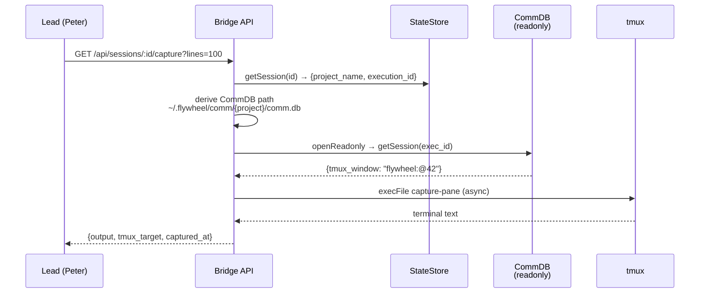

# Plan: Lead tmux 可见性 — Bridge Capture API

**Version**: v1.11.0
**Issue**: GEO-262
**Date**: 2026-03-25
**Source**: `doc/exploration/new/GEO-262-lead-tmux-visibility.md`, `doc/research/new/GEO-262-lead-tmux-visibility.md`
**Status**: codex-approved
**Review**: Codex Round 1: 4 issues (async capture, testable dbPath, error logging, TOOLS.md drift) — all accepted. Round 2: 1 issue (injection boundary) — accepted. Round 3: 1 issue (project_name path validation) — accepted.

---

## 目标

Bridge 新增 `GET /api/sessions/:id/capture` 端点，让 Lead（Peter/Oliver）能查看 Runner 的 tmux 终端输出。解决 Lead 无法判断 Runner 实际工作状态的问题（GEO-252 E2E 中 Peter 误判 Runner 卡住）。

## 架构



## 前提

- `flywheel-comm capture` CLI 已存在（GEO-206 Phase 2），无需新建
- `CommDB` 通过 `flywheel-comm/db` 已有 library export
- `CommDB.openReadonly()` 已有只读模式
- Bridge `tools.ts` 已有 `/sessions/:id` 路由模式

## 实施步骤

### Step 1: 添加依赖 + capture 工具函数

**TDD**: 先写 capture 工具函数的单元测试，再实现。

#### 1.1 添加 flywheel-comm 依赖

**File**: `packages/teamlead/package.json`

```diff
  "dependencies": {
    "express": "^5.2.1",
    "flywheel-core": "workspace:*",
    "flywheel-edge-worker": "workspace:*",
+   "flywheel-comm": "workspace:*",
    "@linear/sdk": "60.0.0",
    "sql.js": "^1.14.1"
  },
```

然后运行 `pnpm install`。

#### 1.2 新建 capture 工具函数

**File**: `packages/teamlead/src/bridge/session-capture.ts` (新文件)

封装 CommDB 查询 + tmux capture-pane 逻辑。**异步**实现，避免阻塞 Bridge event loop。

```typescript
import { execFile } from "node:child_process";
import { existsSync } from "node:fs";
import { homedir } from "node:os";
import { join } from "node:path";
import { promisify } from "node:util";
import { CommDB } from "flywheel-comm/db";

const execFileAsync = promisify(execFile);

export interface CaptureResult {
  output: string;
  tmux_target: string;
  lines: number;
  captured_at: string;
}

export interface CaptureError {
  error: string;
  status: number;
}

export type ExecCaptureFn = (tmuxTarget: string, lines: number) => Promise<string>;

/**
 * Default async tmux capture-pane implementation.
 * Non-blocking — does not stall Bridge's event loop.
 * Extracted for testability — tests inject a mock.
 */
export async function defaultExecCapture(tmuxTarget: string, lines: number): Promise<string> {
  const { stdout } = await execFileAsync(
    "tmux",
    ["capture-pane", "-t", tmuxTarget, "-p", "-S", `-${lines}`],
    { encoding: "utf-8", timeout: 5000 },
  );
  return stdout;
}

/**
 * Derive CommDB path from project name.
 * Default: ~/.flywheel/comm/{projectName}/comm.db
 * Extracted as a parameter for testability (Codex R1 #1).
 */
export function defaultGetCommDbPath(projectName: string): string {
  return join(homedir(), ".flywheel", "comm", projectName, "comm.db");
}

/**
 * Capture a Runner's tmux terminal output.
 *
 * Async to avoid blocking Bridge event loop (Codex R1 #2).
 * dbPath resolution is injectable for testability (Codex R1 #1).
 *
 * @param executionId - execution_id from StateStore
 * @param projectName - project_name from StateStore, used to derive CommDB path
 * @param lines - number of terminal lines to capture (1-500)
 * @param execCapture - tmux capture function (injectable for tests)
 * @param getCommDbPath - path resolver (injectable for tests)
 */
export async function captureSession(
  executionId: string,
  projectName: string,
  lines: number,
  execCapture: ExecCaptureFn = defaultExecCapture,
  getCommDbPath: (name: string) => string = defaultGetCommDbPath,
): Promise<CaptureResult | CaptureError> {
  // Path traversal guard (Codex R3 #1): reject project names with path separators
  if (/[/\\]|\.\./.test(projectName)) {
    return {
      error: `Invalid project name: '${projectName}'`,
      status: 400,
    };
  }

  const dbPath = getCommDbPath(projectName);

  if (!existsSync(dbPath)) {
    return {
      error: `Communication database not found for project '${projectName}'`,
      status: 404,
    };
  }

  let tmuxTarget: string;
  try {
    const db = CommDB.openReadonly(dbPath);
    try {
      const session = db.getSession(executionId);
      if (!session) {
        return {
          error: `No tmux window registered for execution ${executionId}`,
          status: 404,
        };
      }
      tmuxTarget = session.tmux_window;
    } finally {
      db.close();
    }
  } catch (err) {
    console.error(
      `[capture] Failed to read CommDB for project '${projectName}', execution ${executionId}:`,
      (err as Error).message,
    );
    return {
      error: `Failed to read communication database for project '${projectName}'`,
      status: 502,
    };
  }

  try {
    const output = await execCapture(tmuxTarget, lines);
    return {
      output,
      tmux_target: tmuxTarget,
      lines,
      captured_at: new Date().toISOString(),
    };
  } catch (err) {
    console.error(
      `[capture] tmux capture-pane failed for ${tmuxTarget} (execution ${executionId}):`,
      (err as Error).message,
    );
    return {
      error: `tmux window not found: ${tmuxTarget}`,
      status: 502,
    };
  }
}

export function isCaptureError(
  result: CaptureResult | CaptureError,
): result is CaptureError {
  return "error" in result;
}
```

**设计决策**:
- **Async `ExecCaptureFn`** (Codex R1 #2): 使用 `promisify(execFile)` 而非 `execFileSync`，不阻塞 Bridge event loop。与 `actions.ts` 中的 `execFileAsync` 模式一致。
- **Injectable `getCommDbPath`** (Codex R1 #1): dbPath 解析可注入，测试用临时目录，生产用默认 homedir 路径。
- **Error logging** (Codex R1 #3): `catch` 块记录具体错误到 `console.error`（含 execution_id、project_name、tmux_target 上下文），对外响应保持简洁。
- **`CommDB.openReadonly`**: 不执行 schema/migration，对 Runner 写入无影响。
- **Best-effort**: 不按 session status 拒绝，直接尝试 capture（remain-on-exit 的 window 也能捕获）。
- **5s timeout**: 防止 tmux 进程挂住。

### Step 2: 添加 Bridge API 路由

**TDD**: 先写 HTTP 集成测试，再实现路由。

#### 2.1 修改 `createQueryRouter` 签名

**File**: `packages/teamlead/src/bridge/tools.ts`

```diff
+ import {
+   type CaptureResult,
+   type CaptureError,
+   isCaptureError,
+ } from "./session-capture.js";
+
+ export type CaptureSessionFn = (
+   executionId: string,
+   projectName: string,
+   lines: number,
+ ) => Promise<CaptureResult | CaptureError>;

  export function createQueryRouter(
    store: StateStore,
    retryDispatcher?: IRetryDispatcher,
+   captureSessionFn?: CaptureSessionFn,
  ): Router {
```

#### 2.2 添加 capture 路由

**File**: `packages/teamlead/src/bridge/tools.ts`（在 `/sessions/:id/history` 路由之后）

```typescript
router.get("/sessions/:id/capture", async (req, res) => {
  if (!captureSessionFn) {
    res.status(501).json({ error: "Capture not configured" });
    return;
  }

  const id = req.params.id;

  // Resolve session (same fallback as /sessions/:id)
  let session = store.getSession(id);
  if (!session) {
    session = store.getSessionByIdentifier(id);
  }
  if (!session) {
    res.status(404).json({ error: "Session not found" });
    return;
  }

  // Parse and validate lines parameter
  const rawLines = parseInt(req.query.lines as string ?? "100", 10);
  const lines = Number.isFinite(rawLines)
    ? Math.min(Math.max(rawLines, 1), 500)
    : 100;

  const result = await captureSessionFn(
    session.execution_id,
    session.project_name,
    lines,
  );

  if (isCaptureError(result)) {
    res.status(result.status).json({ error: result.error });
    return;
  }

  res.json({
    execution_id: session.execution_id,
    ...result,
  });
});
```

#### 2.3 修改 plugin.ts 传递 captureSession

**File**: `packages/teamlead/src/bridge/plugin.ts`

```diff
+ import type { CaptureSessionFn } from "./tools.js";

  // 在 createBridgeApp 函数签名中添加可选参数:
  export function createBridgeApp(
    store: StateStore,
    projects: ProjectEntry[],
    config: BridgeConfig,
    // ... 现有参数 ...
    memoryService?: MemoryService,
+   captureSessionFn?: CaptureSessionFn,
  ): express.Application {

  // 在 /api 路由挂载处 — 透传，不做默认填充:
  app.use(
    "/api",
    tokenAuthMiddleware(config.apiToken),
-   createQueryRouter(store, retryDispatcher),
+   createQueryRouter(store, retryDispatcher, captureSessionFn),
  );
```

**注意**: `createBridgeApp` 透传 `captureSessionFn`，不做默认填充（Codex R2 #1）。默认 wiring 在 `startBridge()` 中完成，确保:
- 测试通过 `createBridgeApp` 不传 capture → 501 分支可达
- 测试注入 mock → 不触碰真实 tmux
- 生产通过 `startBridge` → 传入 `defaultCaptureSession`

#### 2.4 修改 startBridge() 传递默认实现

**File**: `packages/teamlead/src/bridge/plugin.ts`（`startBridge` 函数内）

```diff
+ import { captureSession as defaultCaptureSession } from "./session-capture.js";

  // 在 startBridge 中构建 app 时传入默认 capture:
  const app = createBridgeApp(
    store, projects, config, broadcaster, transitionOpts,
    retryDispatcher, opts?.cipherWriter, eventFilter,
    forumTagUpdater, registry, forumPostCreator,
-   opts?.memoryService,
+   opts?.memoryService, defaultCaptureSession,
  );
```

### Step 3: 测试

#### 3.1 session-capture 单元测试

**File**: `packages/teamlead/src/__tests__/session-capture.test.ts` (新文件)

| 测试用例 | 预期 |
|---------|------|
| CommDB 不存在 | 返回 404 + "database not found" |
| CommDB 存在但 session 不在其中 | 返回 404 + "No tmux window" |
| session 存在，tmux capture 成功 | 返回 output + tmux_target + captured_at |
| session 存在，tmux capture 失败 | 返回 502 + "tmux window not found" |
| lines 参数正确传递 | mock 收到正确 lines 值 |
| CommDB 读取异常 | 返回 502 + "Failed to read" + console.error 被调用 |
| project_name 含路径分隔符（如 `../../etc`） | 返回 400 + "Invalid project name" (path traversal guard) |

**Mock 策略**:
- 创建真实的临时 CommDB（使用 `new CommDB(tmpPath)` constructor，写入 session 数据）
- Mock `ExecCaptureFn`（注入的 async tmux 调用）
- 注入自定义 `getCommDbPath`（指向 tmpDir），**不 mock homedir()**

```typescript
// 示例 test setup
const tmpDir = mkdtempSync(join(tmpdir(), "capture-test-"));
const dbPath = join(tmpDir, "comm.db");

// 创建真实 CommDB 并写入测试数据
const db = new CommDB(dbPath);
db.registerSession("exec-1", "flywheel:@42", "test-project");
db.close();

// 注入自定义路径解析
const result = await captureSession(
  "exec-1", "test-project", 100,
  async (target, lines) => `captured ${lines} lines from ${target}`,
  (_name) => dbPath,  // ← 注入测试 DB 路径
);
```

#### 3.2 tools.test.ts 集成测试

**File**: `packages/teamlead/src/__tests__/tools.test.ts`（新 describe 块）

| 测试用例 | 预期 |
|---------|------|
| Session 存在 + capture 成功 | 200 + JSON body with output |
| Session 不存在 | 404 |
| Session 存在 + capture 返回 error | 对应 error status code |
| lines 参数校验（过大→500，过小→1，NaN→100） | 自动 clamp |
| 通过 identifier fallback 查找 session | 200 + 正确 capture |
| captureSessionFn 未配置 | 501 |

**Mock**: 注入 mock `captureSessionFn` 到 `createBridgeApp`。

```typescript
// 示例
const mockCapture: CaptureSessionFn = async (execId, project, lines) => ({
  output: "mock terminal output\n",
  tmux_target: "flywheel:@42",
  lines,
  captured_at: new Date().toISOString(),
});

const app = createBridgeApp(store, [], makeConfig(),
  undefined, undefined, undefined, undefined, undefined,
  undefined, undefined, undefined, undefined, mockCapture);
```

### Step 4: 文档更新

#### 4.1 product-lead-TOOLS.md — Session Queries 整节更新

**File**: `doc/reference/product-lead-TOOLS.md`

(Codex R1 #4) 更新整个 "Session Queries" 部分，同步现有 query modes + history，然后追加 capture：

```markdown
### Session Queries

```
GET /api/sessions/:id
  Returns session by execution_id (or identifier fallback)

GET /api/sessions/:id/history
  Returns all executions for the same issue

GET /api/sessions?mode=active
  Returns all active (running + awaiting_review) sessions

GET /api/sessions?mode=recent&limit=N
  Returns most recent N sessions (default 20, max 200)

GET /api/sessions?mode=stuck&stuck_threshold=15
  Returns sessions with no activity for N minutes

GET /api/sessions?mode=by_identifier&identifier=GEO-XX
  Returns session by issue identifier
```

Response includes `thread_id` — use for Forum Thread links:
`https://discord.com/channels/{guild_id}/{thread_id}`

### Session Capture (GEO-262)

Capture the current tmux terminal output of a runner session.

```
GET /api/sessions/:id/capture?lines=100

Parameters:
  :id    — execution_id or issue identifier (e.g., GEO-262)
  lines  — number of lines to capture (1-500, default 100)

Response 200:
{
  "execution_id": "abc-123",
  "tmux_target": "flywheel:@42",
  "lines": 100,
  "output": "... terminal text ...",
  "captured_at": "2026-03-25T12:00:00Z"
}

Errors:
  404 — Session not found / CommDB not found / no tmux window
  502 — tmux window gone (pane died)
```

Use this to:
- Check what a Runner is doing right now ("GEO-XX 在干什么？")
- Diagnose stuck sessions ("卡在 npm install 还是等 CI？")
- Provide specific info when reporting to CEO
```

---

## AC 验证

- [ ] `GET /api/sessions/{id}/capture` 返回 Runner tmux 屏幕内容
- [ ] 通过 execution_id 和 issue identifier 都能查找 session
- [ ] lines 参数可控（1-500，默认 100）
- [ ] CommDB 不存在时返回 404 + 明确错误
- [ ] tmux window 不存在时返回 502
- [ ] 非 running session（remain-on-exit）也能捕获
- [ ] capture 是异步的（不阻塞 Bridge event loop）
- [ ] 错误记录到 console.error（含 execution_id、project_name 上下文）
- [ ] 所有新代码有单元测试 + 集成测试
- [ ] product-lead-TOOLS.md Session Queries 整节已同步更新

## 不在 Scope 内

- ❌ ANSI escape code 处理 — capture-pane -p 默认返回纯文本
- ❌ flywheel-comm CLI — 已存在，无需改动
- ❌ HTTP Hooks 结构化监控 — 后续新 issue
- ❌ createBridgeApp 参数重构 — 不在本次范围
- ❌ 多机部署 — 后续
