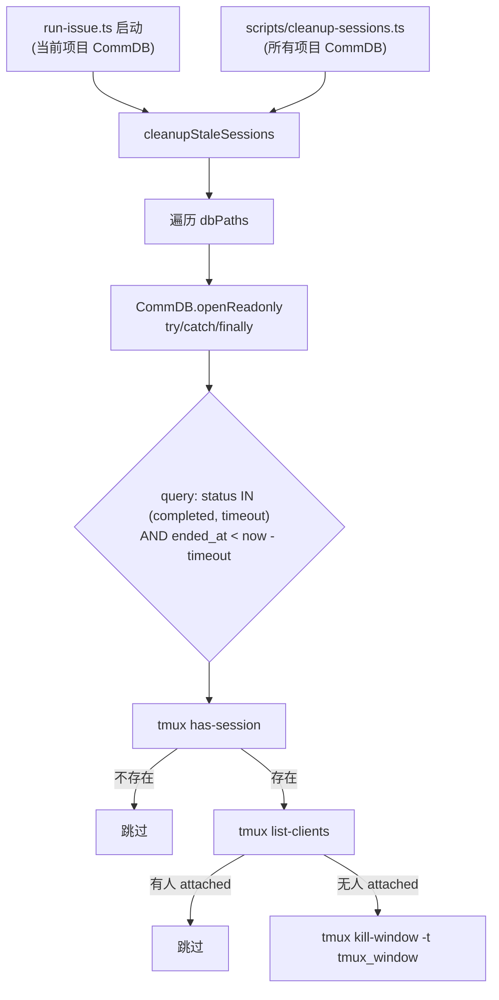

# Plan: Runner 完成后自动清理 tmux session

**Version**: v1.13.0
**Issue**: GEO-270
**Date**: 2026-03-27
**Source**: `doc/exploration/new/GEO-270-runner-tmux-cleanup.md`, `doc/research/new/GEO-270-runner-tmux-cleanup.md`
**Status**: codex-approved

## 目标

Runner 完成后的 tmux window 不再无限期挂着。提供 **opportunistic cleanup**（在 `run-issue.ts` 启动时自动清理当前项目的过期 session）+ **standalone CLI**（手动/cron 扫描所有项目），两条路径均检查超时 + attached 保护。

**明确边界**: 本版只清理 tmux window。不清理 worktree，不处理 orphan session（status='running' 但 tmux 已死）。这两个问题留给后续 issue。

## 方案

**外部清理函数** — 放在 `packages/flywheel-comm/src/cleanup.ts`（复用 CommDB class + 进入现有 vitest/CI 流程）。通过 `lib.ts` re-export（library entrypoint, via `package.json` `"./db"` subpath），由 `run-issue.ts` 和独立 CLI 脚本调用。

不修改 Runner/Blueprint/Bridge 核心逻辑。

## Architecture



## 设计决策

| 决策 | 选择 | 原因 |
|------|------|------|
| 清理粒度 | `kill-window -t {tmux_window}` | 对齐 Blueprint 的 `killTmuxWindow` 模式，以 CommDB `tmux_window` 字段为 source of truth |
| Attached 检测 | session 级 `list-clients` | 从 `tmux_window` 派生 session name，如果 session 有任何 client attached 则跳过 |
| 代码位置 | `packages/flywheel-comm/src/cleanup.ts` | 进入现有 vitest/CI/typecheck 流程，复用 CommDB class |
| Library export | 通过 `lib.ts` re-export（`"./db"` subpath） | `index.ts` 是 CLI entrypoint 会执行 `main()`，不能从 `"."` import |
| 触发方式 | `run-issue.ts` 启动时(当前项目) + CLI(全部) | Opportunistic cleanup，不是精确的 "30min 后自动" |
| run-issue.ts scope | 仅清理当前 `projectName` 的 CommDB | 避免单次启动触发全局 housekeeping，符合 scope discipline |
| CLI scope | 扫描 `~/.flywheel/comm/*/comm.db` 所有项目 | 手动/cron 场景需要全局清理 |
| tmux 命令执行 | `execFileSync` (不用 exec) | 避免 shell injection，对齐项目现有模式 |
| 旧 CommDB 兼容 | query 失败视为 "legacy DB, skip" | `openReadonly()` 不创建 schema，旧 DB 可能无 sessions 表 |
| Worktree 清理 | **不做** (v1) | CommDB 不存 `mainRepoPath`，无法安全复用 WorktreeManager |
| Orphan 处理 | **不做** (v1) | readonly CommDB 无法修复 status='running' 脏状态 |

## 实现步骤

### Step 1: 核心清理模块 `packages/flywheel-comm/src/cleanup.ts`

新文件，导出:

```typescript
import { execFileSync } from "node:child_process";
import { globSync } from "node:fs";
import { join } from "node:path";
import { homedir } from "node:os";
import { CommDB } from "./db.js";

export interface CleanupOptions {
  /** CommDB 文件路径列表。不传则 glob 扫描所有项目 */
  dbPaths?: string[];
  /** 清理超时（分钟），默认 30 */
  timeoutMinutes?: number;
  /** dry-run 模式 */
  dryRun?: boolean;
  /** 日志函数 */
  log?: (msg: string) => void;
}

export interface CleanupResult {
  /** 清理的 window 数量 */
  cleaned: number;
  /** 跳过的数量 */
  skipped: number;
  /** 非致命警告（legacy DB skip 等预期情况） */
  warnings: string[];
  /** 真正的错误（tmux/SQLite 异常） */
  errors: string[];
}

export function cleanupStaleSessions(opts?: CleanupOptions): CleanupResult;
```

**注意**: 使用同步 API（`execFileSync`、`globSync`），因为 tmux 命令瞬时执行（< 10ms），调用点在启动阶段不需要异步。

**逻辑**:

1. 检查 tmux server 是否运行: `execFileSync("tmux", ["list-sessions"])`，失败则直接返回 `{ cleaned: 0, skipped: 0, errors: [] }`
2. 确定 dbPaths:
   - 如果 `opts.dbPaths` 已提供 → 使用它
   - 否则 → `globSync(join(homedir(), ".flywheel", "comm", "*", "comm.db"))`
3. 过滤 dbPaths: 对每个 path 先 `existsSync(dbPath)`，不存在则跳过（不记录 warning/error — 这是 expected empty state）
4. 对每个存在的 dbPath — **db-level try/catch/finally**:
   ```
   let db: CommDB | undefined;
   try {
       db = CommDB.openReadonly(dbPath);
       const sessions = db.listSessions(undefined, ['completed', 'timeout']);
       // ... 过滤 + 清理逻辑
   } catch (err) {
       if (err.message includes "no such table") → warnings.push("legacy DB: " + dbPath)
       else → errors.push(String(err))
   } finally {
       db?.close();
   }
   ```
5. 过滤超时 session:
   - `ended_at` 存在且 `(Date.now() - Date.parse(ended_at + 'Z')) > timeoutMinutes * 60_000`
6. 对每个超时 session — **per-session try/catch**:
   - `tmux_window` 即 CommDB 中存储的完整 target（如 `"GEO-270:@0"`）
   - 提取 session name: `tmux_window.split(":")[0]`
   - 检查 tmux session 是否存在: `execFileSync("tmux", ["has-session", "-t", "=" + sessionName])` — throws 则不存在 → skipped++
   - 检查 attached: `execFileSync("tmux", ["list-clients", "-t", "=" + sessionName, "-F", "#{client_session}"], { encoding: "utf-8" }).trim()`
   - 如果有输出 → skipped++
   - 如果 dryRun → log + skipped++
   - 否则 `execFileSync("tmux", ["kill-window", "-t", tmux_window])` → cleaned++
7. 返回 `{ cleaned, skipped, warnings, errors }`

### Step 2: Library re-export

在 `packages/flywheel-comm/src/lib.ts` 中添加 re-export:

```typescript
export { cleanupStaleSessions } from "./cleanup.js";
export type { CleanupOptions, CleanupResult } from "./cleanup.js";
```

**不修改 `index.ts`** — 那是 CLI entrypoint，会执行 `main()`。Library consumer 通过 `"./db"` subpath import。

### Step 3: 独立 CLI 脚本 `scripts/cleanup-sessions.ts`

```typescript
#!/usr/bin/env tsx
// Usage: npx tsx scripts/cleanup-sessions.ts [--timeout 30] [--dry-run]
import { cleanupStaleSessions } from "../packages/flywheel-comm/src/cleanup.js";

const args = process.argv.slice(2);
const dryRun = args.includes("--dry-run");
const timeoutIdx = args.indexOf("--timeout");
const timeoutMinutes = timeoutIdx >= 0 ? parseInt(args[timeoutIdx + 1], 10) : 30;

if (isNaN(timeoutMinutes) || timeoutMinutes < 1) {
    console.error("Error: --timeout must be a positive integer");
    process.exit(1);
}

// CLI: scan all projects (no dbPaths → glob all)
const result = cleanupStaleSessions({
    timeoutMinutes,
    dryRun,
    log: console.log,
});

console.log(`\nResult: ${result.cleaned} cleaned, ${result.skipped} skipped`);
if (result.warnings.length > 0) {
    console.log(`Warnings: ${result.warnings.join(", ")}`);
}
if (result.errors.length > 0) {
    console.error(`Errors (${result.errors.length}):`);
    for (const e of result.errors) console.error(`  - ${e}`);
    process.exit(1);
}
// warnings alone do NOT trigger exit 1 — legacy DB skip is expected
```

### Step 4: 集成到 run-issue.ts

在 `setupComponents()` 调用之前（line ~304），插入。**只清理当前项目的 CommDB**:

```typescript
// GEO-270: Cleanup stale tmux sessions from previous runs (current project only)
try {
    const { cleanupStaleSessions } = await import("../packages/flywheel-comm/src/cleanup.js");
    const timeoutMinutes = parseInt(process.env.CLEANUP_TIMEOUT_MINUTES ?? "30", 10);
    if (isNaN(timeoutMinutes) || timeoutMinutes < 1) {
        log("Warning: CLEANUP_TIMEOUT_MINUTES invalid, skipping cleanup");
    } else {
        const home = process.env.HOME ?? "/tmp";
        const commDbPath = join(home, ".flywheel", "comm", projectName, "comm.db");
        const result = cleanupStaleSessions({
            dbPaths: [commDbPath],
            timeoutMinutes,
            log,
        });
        if (result.cleaned > 0) {
            log(`Cleaned up ${result.cleaned} stale tmux window(s)`);
        }
        if (result.errors.length > 0) {
            log(`Warning: session cleanup had ${result.errors.length} error(s): ${result.errors[0]}`);
        }
    }
} catch (err) {
    log(`Warning: session cleanup failed: ${err}`);
    // Non-fatal — continue with execution
}
```

使用 dynamic import 避免增加 `run-issue.ts` 的静态依赖。失败不阻断主流程。`join` 已在 `run-issue.ts` 中可用（从 `node:path` 导入），`process.env.HOME` 替代 `homedir()` 以避免新增 import（对齐 `run-issue.ts` 现有风格中 `resolvedRoot` 的 `process.env.HOME` 用法）。如果 `comm.db` 不存在，cleanup 内部会 `existsSync` 跳过，不产生 warning/error。

### Step 5: 测试

#### 单元测试 `packages/flywheel-comm/src/__tests__/cleanup.test.ts`

测试在 `flywheel-comm` package 内，由 `pnpm -r test` 自动执行。

| 测试 | 描述 |
|------|------|
| 无 CommDB 文件 | dbPaths=[] 或 glob 返回空，result = {cleaned: 0, skipped: 0, warnings: [], errors: []} |
| dbPath 不存在 | existsSync 返回 false → 跳过，不记录 warning/error |
| tmux server 未运行 | list-sessions throws → 直接返回空结果 |
| session 未超时 | ended_at 在 timeout 内，skipped++ |
| session 已超时 + 无人 attached | 执行 kill-window，cleaned++ |
| session 已超时 + 有人 attached | skipped++ |
| tmux window 已不存在 | has-session throws → skipped++ |
| dry-run 模式 | log 但不执行 kill，skipped++ |
| 多个 CommDB 文件 | 全部扫描，结果合并 |
| CommDB 打开失败 (非 legacy) | 跳过该文件，errors 记录错误，继续下一个 |
| CommDB 无 sessions 表 (legacy) | query throws "no such table" → warnings 记录，继续 |
| db.close() 在异常后仍被调用 | finally 保证关闭 |

**Mock 策略**:
- Mock `child_process.execFileSync` — 控制 tmux 命令返回值和 exit code
- 使用真实 CommDB 实例 + 临时 DB 文件 — `flywheel-comm` 已依赖 `better-sqlite3`
- 通过 `dbPaths` 参数传入临时 DB 路径，不需要 mock glob

## 文件变更清单

| 文件 | 操作 | 描述 |
|------|------|------|
| `packages/flywheel-comm/src/cleanup.ts` | **新建** | 核心清理逻辑 |
| `packages/flywheel-comm/src/lib.ts` | **修改** | re-export cleanup |
| `packages/flywheel-comm/src/__tests__/cleanup.test.ts` | **新建** | 单元测试 |
| `scripts/cleanup-sessions.ts` | **新建** | 独立 CLI（全局扫描） |
| `scripts/run-issue.ts` | **修改** | 启动时调用 cleanup（当前项目） |

## 配置

| 环境变量 | 默认值 | 描述 |
|----------|--------|------|
| `CLEANUP_TIMEOUT_MINUTES` | `30` | session 完成后多久算"过期"。必须为正整数，无效值跳过清理 |

## 不做的事情（v1 scope）

1. **不清理 worktree** — CommDB 无 `mainRepoPath`，无法安全复用 `WorktreeManager`
2. **不处理 orphan session** — readonly CommDB 无法修复 status='running' 脏状态
3. **不修改 CommDB schema** — 现有字段足够
4. **不修改 TmuxAdapter / Blueprint / Bridge** — 清理逻辑完全外部化
5. **不设置 cron/launchd** — 用户如需定时清理可自行配置调用 CLI 脚本
6. **不修改 HeartbeatService** — orphan 处理留给后续 issue
7. **不修改 index.ts** — CLI entrypoint，不用于 library export

## 后续 issue (out of scope)

- **Worktree 清理**: 需要在 CommDB sessions 表增加 `worktree_path` 或 `main_repo_path` 字段
- **Orphan session 修复**: 需要 writable CommDB + tmux server availability gate

## 风险

| 风险 | 概率 | 缓解 |
|------|------|------|
| 误杀正在使用的 window | 低 | attached 检测 + 超时保护 |
| CommDB readonly 读取失败 | 低 | per-DB try/catch/finally + 记录到 errors |
| tmux server 未运行 | 中 | 首先检测，不可用则直接返回 |
| 旧 CommDB 无 sessions 表 | 低 | query 异常视为 legacy，跳过 |
| CLEANUP_TIMEOUT_MINUTES 无效 | 低 | parseInt 校验，无效则跳过清理 |
| 清理函数影响启动速度 | 低 | 通常 0-2 个 session，毫秒级 |

## 测试计划

1. 单元测试覆盖 Step 5 所有场景（vitest，CI 自动执行）
2. 手动 E2E: 启动 runner → 等待完成 → 跑 `cleanup-sessions.ts --dry-run` 验证输出
3. 手动 E2E: 完成后 tmux attach → 跑 cleanup → 验证 attached 时不清理
4. 手动 E2E: detach 后等 30min → 跑 cleanup → 验证 window 被杀
