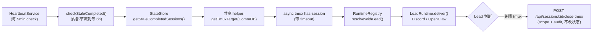

# Plan: Stale Session 巡检 + 通知 Lead

**Version**: v1.14.0
**Issue**: GEO-270
**Date**: 2026-03-27
**Source**: `doc/exploration/new/GEO-270-runner-tmux-cleanup.md` (v3), `doc/research/new/GEO-270-runner-tmux-cleanup.md`
**Status**: codex-approved

## 目标

定期检测已完成但 tmux session 仍然存活的 stale session，通知对应 Lead 判断处理。不自动杀 session — 由 Lead 决定关闭或 escalate 到 CEO。

## 方案

扩展现有 HeartbeatService + StateStore + RuntimeRegistry 管道，新增一个 `checkStaleCompleted()` 检查。Lead 关闭 tmux 通过专用端点，手动复用 lead scope + audit（**不改 workflow 状态**）。

## Architecture



## 设计决策

| 决策 | 选择 | 原因 |
|------|------|------|
| 巡检机制 | 扩展 HeartbeatService | 已有定期检查 + 通知管道 |
| 巡检频率 | 每 5min 跑但内部节流到每 6h | 不需要高频检查 stale session |
| 超时阈值 | 24h（可配置） | CEO 可能隔天才看 |
| tmux 数据源 | **CommDB tmux_window**（检测 + 关闭都用） | StateStore.tmux_session 在生产中未被写入。CommDB 是 source of truth |
| 共享 helper | `getTmuxTargetFromCommDb()` | 检测和关闭共用同一个 CommDB lookup，避免数据源分歧 |
| 关闭机制 | **专用端点** `POST /api/sessions/:id/close-tmux` | 关闭 tmux ≠ 改 workflow 状态。completed session 关掉 tmux 后仍然是 completed。不走 action 框架的状态迁移（FSM 不允许 completed→terminated） |
| 关闭 = 资源清理 | 只杀 tmux，**不改 StateStore 状态** | 保留原始 outcome 语义。CleanupService 归档逻辑不受影响 |
| 关闭端点安全 | 手动复用 `checkLeadScope()` + audit log | 继承 lead scope 校验和审计，不绕过控制面 |
| tmux 命令 | **async execFile + 5s timeout** | 对齐 session-capture.ts 模式，不阻塞 event loop |
| 错误分类 | 区分 benign（no server/session not found）和 real error | 对齐 handleTerminate() 的错误处理（actions.ts:597-615）。real error 打 console.error，benign 静默处理 |
| stale 状态覆盖 | `completed, failed, blocked` | 不含 approved/terminated（已有处理路径），不含 running（checkStuck/reapOrphans） |
| EventFilter | 新增 `session_stale_completed` 规则 + 保留调用方 context | 避免被默认规则覆盖 |
| BridgeConfig 新字段 | **可选** + 默认值在 HeartbeatService 构造函数中 | 最小化测试 fixture 变更 |

## 实现步骤

### Step 1: 共享 helper `packages/teamlead/src/bridge/tmux-lookup.ts`（新文件）

提取 CommDB → tmux target 的逻辑，供巡检和关闭共用：

```typescript
import { existsSync } from "node:fs";
import { execFile } from "node:child_process";
import { promisify } from "node:util";
import { join } from "node:path";
import { homedir } from "node:os";
import { CommDB } from "flywheel-comm/db";

const execFileAsync = promisify(execFile);
const TMUX_TIMEOUT = 5000;

export interface TmuxTarget {
    tmuxWindow: string;   // CommDB tmux_window (e.g. "GEO-208:@0")
    sessionName: string;  // parsed session name (e.g. "GEO-208")
}

/** Resolve tmux target from CommDB. Returns undefined if not found or DB missing. Logs real errors. */
export function getTmuxTargetFromCommDb(
    executionId: string,
    projectName: string,
): TmuxTarget | undefined {
    // Path traversal guard (same as session-capture.ts)
    if (/[/\\]|\.\./.test(projectName)) return undefined;

    const dbPath = join(homedir(), ".flywheel", "comm", projectName, "comm.db");
    if (!existsSync(dbPath)) return undefined;  // expected: project hasn't used comm yet

    let db: CommDB | undefined;
    try {
        db = CommDB.openReadonly(dbPath);
        const session = db.getSession(executionId);
        if (!session?.tmux_window) return undefined;  // expected: session not registered in CommDB
        const tw = session.tmux_window;
        const colonIdx = tw.indexOf(":");
        return {
            tmuxWindow: tw,
            sessionName: colonIdx >= 0 ? tw.slice(0, colonIdx) : tw,
        };
    } catch (err) {
        // Real CommDB error (corruption, lock, etc.) — log it, don't silently swallow
        console.error(`[tmux-lookup] CommDB read error for ${executionId}: ${(err as Error).message}`);
        return undefined;
    } finally {
        db?.close();
    }
}

/** Check if tmux session is alive. Returns false on any error (benign). Logs real errors. */
export async function isTmuxSessionAlive(sessionName: string): Promise<boolean> {
    try {
        await execFileAsync("tmux", ["has-session", "-t", `=${sessionName}`], { timeout: TMUX_TIMEOUT });
        return true;
    } catch (err) {
        const msg = (err as Error).message ?? String(err);
        if (msg.includes("session not found") || msg.includes("can't find session") || msg.includes("no server running")) {
            return false;  // benign
        }
        console.error(`[tmux-lookup] has-session error: ${msg}`);
        return false;
    }
}

/** Kill tmux session. Returns { killed, error }. Distinguishes benign from real errors. */
export async function killTmuxSession(sessionName: string): Promise<{ killed: boolean; error?: string }> {
    try {
        await execFileAsync("tmux", ["kill-session", "-t", `=${sessionName}`], { timeout: TMUX_TIMEOUT });
        return { killed: true };
    } catch (err) {
        const msg = (err as Error).message ?? String(err);
        if (msg.includes("session not found") || msg.includes("can't find session") || msg.includes("no server running")) {
            return { killed: true };  // already dead = success
        }
        console.error(`[tmux-lookup] kill-session error: ${msg}`);
        return { killed: false, error: msg };
    }
}
```

### Step 2: StateStore 新增查询

`packages/teamlead/src/StateStore.ts` 新增 `getStaleCompletedSessions()`:

```typescript
getStaleCompletedSessions(thresholdHours: number): Session[] {
    const stmt = this.db.prepare(
        `SELECT * FROM sessions
         WHERE status IN ('completed', 'failed', 'blocked')
           AND last_activity_at < datetime('now', ?)`,
    );
    stmt.bind([`-${thresholdHours} hours`]);
    const rows: Session[] = [];
    while (stmt.step()) {
        rows.push(this.rowToSession(stmt.getAsObject() as Record<string, unknown>));
    }
    stmt.free();
    return rows;
}
```

### Step 3: HeartbeatService 新增 `checkStaleCompleted()`

**新增字段**：
```typescript
private notifiedStale = new Set<string>();
private lastStaleCheckAt = 0;
```

**新增构造函数参数**（有默认值，向后兼容，不改 BridgeConfig 类型）：
```typescript
constructor(
    // ... 现有 6 个参数不变 ...
    private staleThresholdHours: number = 24,
    private staleCheckIntervalMs: number = 6 * 3_600_000,
) {}
```

**修改 check()**：
```typescript
async check(): Promise<void> {
    await this.checkStuck();
    await this.reapOrphans();
    await this.checkStaleCompleted();
}
```

**新增方法**（使用 Step 1 的共享 helper）：
```typescript
async checkStaleCompleted(): Promise<void> {
    const now = Date.now();
    if (now - this.lastStaleCheckAt < this.staleCheckIntervalMs) return;
    // DON'T advance checkpoint yet — advance only after successful sweep

    const stale = this.store.getStaleCompletedSessions(this.staleThresholdHours);

    // Prune dedup set
    const staleIds = new Set(stale.map(s => s.execution_id));
    for (const id of this.notifiedStale) {
        if (!staleIds.has(id)) this.notifiedStale.delete(id);
    }

    for (const session of stale) {
        if (this.notifiedStale.has(session.execution_id)) continue;
        if (!session.project_name) continue;

        // Per-session try/catch — one failure doesn't abort the sweep
        try {
            const target = getTmuxTargetFromCommDb(session.execution_id, session.project_name);
            if (!target) continue;

            const alive = await isTmuxSessionAlive(target.sessionName);
            if (!alive) continue;

            const hoursSince = session.last_activity_at
                ? Math.round((Date.now() - new Date(session.last_activity_at + "Z").getTime()) / 3_600_000)
                : 0;

            await this.notifier.onSessionStale(session, hoursSince);
            this.notifiedStale.add(session.execution_id);
        } catch (err) {
            console.error(`[HeartbeatService] stale check failed for ${session.execution_id}:`, (err as Error).message);
        }
    }

    // Advance checkpoint only after sweep completes (even with per-session errors)
    this.lastStaleCheckAt = Date.now();
}
```

### Step 4: HeartbeatNotifier 接口 + 实现

接口新增：
```typescript
onSessionStale(session: Session, hours: number): Promise<void>;
```

RegistryHeartbeatNotifier 实现（复用 `deliverHook`）：
```typescript
async onSessionStale(session: Session, hours: number): Promise<void> {
    const hookPayload: HookPayload = {
        event_type: "session_stale_completed",
        execution_id: session.execution_id,
        issue_id: session.issue_id,
        issue_identifier: session.issue_identifier,
        issue_title: session.issue_title,
        project_name: session.project_name,
        status: session.status,
        notification_context: `Session ${session.status} ${hours}h ago but tmux still alive. Please check if it can be closed.`,
    };
    await this.deliverHook(session, hookPayload);
}
```

### Step 5: EventFilter 规则 + context 保留

1. 在 EventFilter 规则集中新增 `session_stale_completed` → `notify_agent`，priority `normal`
2. 修改 `deliverHook()`: 如果调用方已提供 `notification_context`，EventFilter 的结果不覆盖它

### Step 6: 关闭端点 `POST /api/sessions/:executionId/close-tmux`

`packages/teamlead/src/bridge/plugin.ts` 中新增路由：

```typescript
import { randomUUID } from "node:crypto";
import { matchesLead } from "./lead-scope.js";
import { getTmuxTargetFromCommDb, killTmuxSession } from "./tmux-lookup.js";

app.post("/api/sessions/:executionId/close-tmux",
    tokenAuthMiddleware(config.apiToken),
    async (req, res) => {
        const { executionId } = req.params;
        const { leadId } = req.body as { leadId?: string };

        // 1. Get session from StateStore
        const session = store.getSession(executionId);
        if (!session) return res.status(404).json({ error: "Session not found" });

        // 2. Lead scope check with verify-error handling (same pattern as actions.ts checkLeadScope)
        if (leadId && projects) {
            try {
                if (!matchesLead(session, leadId, projects)) {
                    return res.status(403).json({
                        success: false,
                        message: `Session ${executionId} is outside lead "${leadId}" scope`,
                    });
                }
            } catch (err) {
                console.warn(`[close-tmux] matchesLead error for ${executionId}: ${(err as Error).message}`);
                return res.status(403).json({
                    success: false,
                    message: `Lead scope check failed: ${(err as Error).message}`,
                });
            }
        }

        // 3. Get tmux target from CommDB (shared helper, with path traversal guard)
        const target = getTmuxTargetFromCommDb(executionId, session.project_name);
        if (!target) return res.json({ closed: false, reason: "No tmux target found" });

        // 4. Kill tmux (shared helper, async + timeout + error classification)
        const result = await killTmuxSession(target.sessionName);

        // 5. Durable audit via StateStore.insertEvent() — full SessionEvent object
        store.insertEvent({
            event_id: randomUUID(),
            execution_id: executionId,
            issue_id: session.issue_id,
            project_name: session.project_name,
            event_type: result.killed ? "tmux_closed" : "tmux_close_failed",
            source: "bridge.close-tmux",
            payload: {
                leadId: leadId ?? "unknown",
                tmuxWindow: target.tmuxWindow,
                error: result.error,
            },
        });

        res.json({ closed: result.killed, error: result.error });
    },
);
```

**Lead scope**: `matchesLead()` from `lead-scope.ts` wrapped in try/catch — `false` → 403, throw → 403 + warn (same handling as `checkLeadScope` in actions.ts). No need to modify actions.ts.

**Audit**: `StateStore.insertEvent(event: SessionEvent)` with full object: `event_id` (randomUUID), `execution_id`, `issue_id`, `project_name`, `event_type` (tmux_closed / tmux_close_failed), `source` (bridge.close-tmux), `payload` (leadId, tmuxWindow, error).

**关键**: 不调用 `applyTransition()`，不改 StateStore status。session 仍然保持 `completed/failed/blocked`。只杀 tmux 资源。

### Step 7: config 接线（不改 BridgeConfig 类型）

**方式**: 在 `plugin.ts` 的 `startBridge()` 中直接从环境变量解析，不经过 `BridgeConfig` 类型。

```typescript
// plugin.ts startBridge() 内，HeartbeatService 实例化前：
const staleThresholdHours = parsePositiveInt(
    process.env.TEAMLEAD_STALE_THRESHOLD_HOURS, 24, "TEAMLEAD_STALE_THRESHOLD_HOURS");
const staleCheckIntervalMs = parsePositiveInt(
    process.env.TEAMLEAD_STALE_CHECK_INTERVAL, 6 * 3_600_000, "TEAMLEAD_STALE_CHECK_INTERVAL");
```

`parsePositiveInt` 当前是 `config.ts` 的私有函数，需要 **export** 它（或在 `plugin.ts` 中内联 `parseInt + 校验`）。这两个值是 `startBridge()` 的局部变量，**不加到 BridgeConfig 接口**，因此所有引用 `BridgeConfig` 的测试 fixture 完全不受影响。

### Step 8: plugin.ts 更新

```typescript
const heartbeatService = new HeartbeatService(
    store, notifier,
    config.stuckThresholdMinutes,
    config.stuckCheckIntervalMs,
    config.orphanThresholdMinutes,
    transitionOpts,
    staleThresholdHours,       // 局部变量，不来自 config 对象
    staleCheckIntervalMs,      // 局部变量，不来自 config 对象
);
```

no-op notifier 更新：
```typescript
const notifier: HeartbeatNotifier = registry.size > 0
    ? new RegistryHeartbeatNotifier(...)
    : { onSessionStuck: async () => {}, onSessionOrphaned: async () => {}, onSessionStale: async () => {} };
```

### Step 9: 测试

#### StateStore 测试

| 测试 | 描述 |
|------|------|
| 返回 completed + 超时 | status=completed, last_activity 超过 24h |
| 返回 failed/blocked + 超时 | 也包含 |
| 不返回 running/approved/terminated | 排除 |
| 不返回未超时 | last_activity 在阈值内排除 |

#### tmux-lookup 测试（新文件）

| 测试 | 描述 |
|------|------|
| getTmuxTargetFromCommDb — 正常 | 返回 tmuxWindow + sessionName |
| getTmuxTargetFromCommDb — DB 不存在 | 返回 undefined |
| getTmuxTargetFromCommDb — session 无记录 | 返回 undefined |
| isTmuxSessionAlive — 存在 | true |
| isTmuxSessionAlive — 不存在 | false (benign) |
| isTmuxSessionAlive — 真实错误 | false + console.error |
| killTmuxSession — 成功 | { killed: true } |
| killTmuxSession — 已死 | { killed: true } (benign) |
| killTmuxSession — 真实错误 | { killed: false, error } |

#### HeartbeatService 测试

| 测试 | 描述 |
|------|------|
| checkStaleCompleted 通知 Lead | stale + tmux alive → onSessionStale 被调用 |
| 节流 | 连续两次，第二次跳过 |
| 防重复 | 同一 session 只通知一次 |
| CommDB 无 tmux_window | 跳过 |
| tmux 不存在 | 跳过 |

#### close-tmux 端点测试

| 测试 | 描述 |
|------|------|
| 正常关闭 | 200 { closed: true } + insertEvent("tmux_closed") |
| session 不存在 | 404 |
| lead scope 不匹配 (matchesLead) | 403 |
| tmux target 不存在 | 200 { closed: false, reason } |
| tmux 已死 | 200 { closed: true } + insertEvent("tmux_closed") |
| tmux kill 真实错误 | 200 { closed: false, error } + insertEvent("tmux_close_failed") |

## 文件变更清单

| 文件 | 操作 | 描述 |
|------|------|------|
| `packages/teamlead/src/bridge/tmux-lookup.ts` | **新建** | 共享 tmux helper（CommDB lookup + has-session + kill） |
| `packages/teamlead/src/StateStore.ts` | **修改** | 新增 `getStaleCompletedSessions()` |
| `packages/teamlead/src/HeartbeatService.ts` | **修改** | 新增 `checkStaleCompleted()` + 构造函数 + notifier 接口 |
| `packages/teamlead/src/config.ts` | **修改** | export `parsePositiveInt`（或 plugin.ts 内联解析） |
| `packages/teamlead/src/bridge/plugin.ts` | **修改** | HeartbeatService 新参数 + no-op notifier + close-tmux 路由 |
| `packages/teamlead/src/bridge/EventFilter.ts` | **修改** | 新增 session_stale_completed 规则 |
| `packages/teamlead/src/__tests__/tmux-lookup.test.ts` | **新建** | tmux helper 测试 |
| `packages/teamlead/src/__tests__/StateStore.test.ts` | **修改** | 新增查询测试 |
| `packages/teamlead/src/__tests__/HeartbeatService.test.ts` | **修改** | 新增 stale 检查测试 |
| `packages/teamlead/src/__tests__/bridge.test.ts` | **修改** | 新增 close-tmux 端点测试 |

**不需要改的文件**：
- `packages/teamlead/src/bridge/types.ts` — 不在 BridgeConfig 加字段
- `packages/core/src/workflow-fsm.ts` — 不加 FSM transition
- `packages/teamlead/src/bridge/actions.ts` — 不加 action
- 其他引用 BridgeConfig 的测试 — 不受影响

## 配置

| 环境变量 | 默认值 | 描述 |
|----------|--------|------|
| `TEAMLEAD_STALE_THRESHOLD_HOURS` | `24` | 完成后多久算 stale |
| `TEAMLEAD_STALE_CHECK_INTERVAL` | `21600000` (6h) | 巡检节流间隔 |

## 不做的事情

1. **不自动杀 session** — 只通知 Lead
2. **不改 workflow 状态** — 关闭 tmux ≠ 改状态。completed 仍然是 completed
3. **不改 FSM / action 框架** — close-tmux 是资源清理，不是 workflow transition
4. **不改 BridgeConfig 类型** — 避免测试 fixture 级联变更
5. **不查 PR 状态** — Lead 自己判断
6. **不做 Sprint 收尾** — 新 issue

## 与 CleanupService 的关系

两者共享 24h 阈值但互不冲突：
- **CleanupService**: 归档 Discord thread（UI 整理），作用于 `completed/approved` session 的 `thread_id`
- **Stale patrol**: 通知 Lead 关于 tmux session（资源占用），作用于 `completed/failed/blocked` session

时序：可以同时发生。CleanupService 归档 thread 不影响 tmux session；stale patrol 通知 Lead 不影响 thread 归档。如果 Lead 调用 close-tmux，只杀 tmux，不改状态，CleanupService 行为不受影响。

## 风险

| 风险 | 概率 | 缓解 |
|------|------|------|
| CommDB readonly 读取失败 | 低 | try/catch + 跳过 + 共享 helper 中 finally close |
| async tmux 调用挂起 | 低 | 5s timeout（对齐 session-capture.ts） |
| real tmux error 被误判 | 低 | 区分 benign/real，real error 打 console.error |
| Lead 收到通知但不处理 | 中 | CEO 可以查看 Bridge dashboard |
| 巡检每 6h 太不频繁 | 低 | 可配置 TEAMLEAD_STALE_CHECK_INTERVAL |

## 测试计划

1. 单元测试覆盖 Step 9 所有场景
2. 手动 E2E: Bridge 启动 → 有 stale completed session → 调低阈值 → Lead 收到通知
3. 手动 E2E: `POST /api/sessions/:id/close-tmux` → tmux 被杀 + 状态不变
